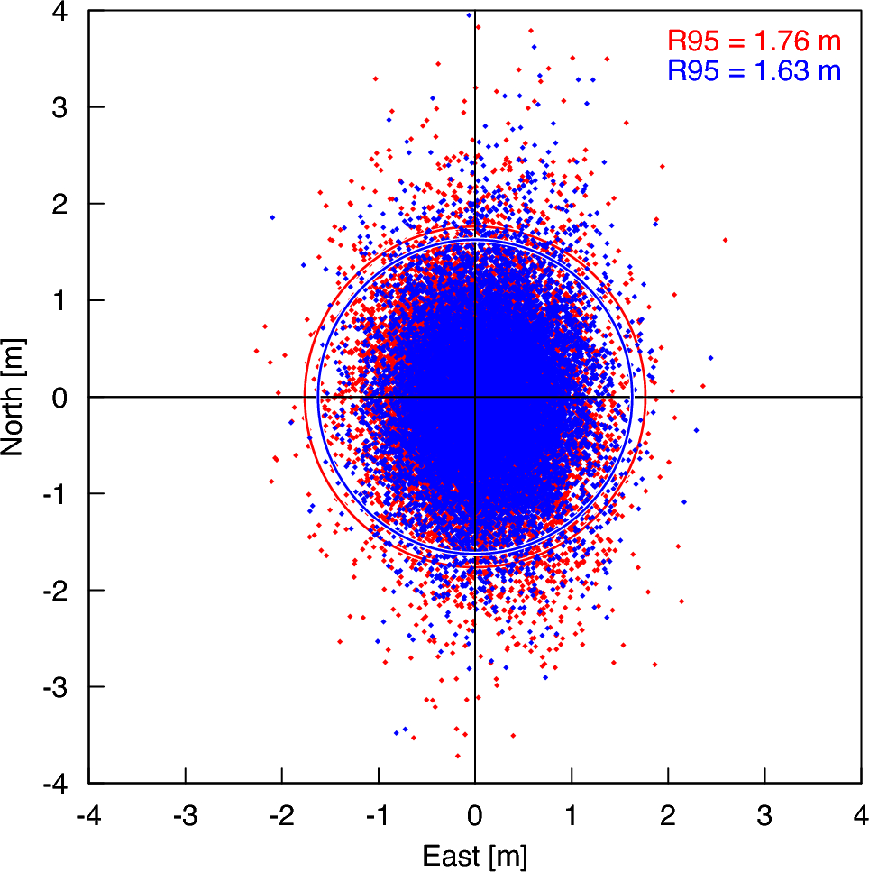
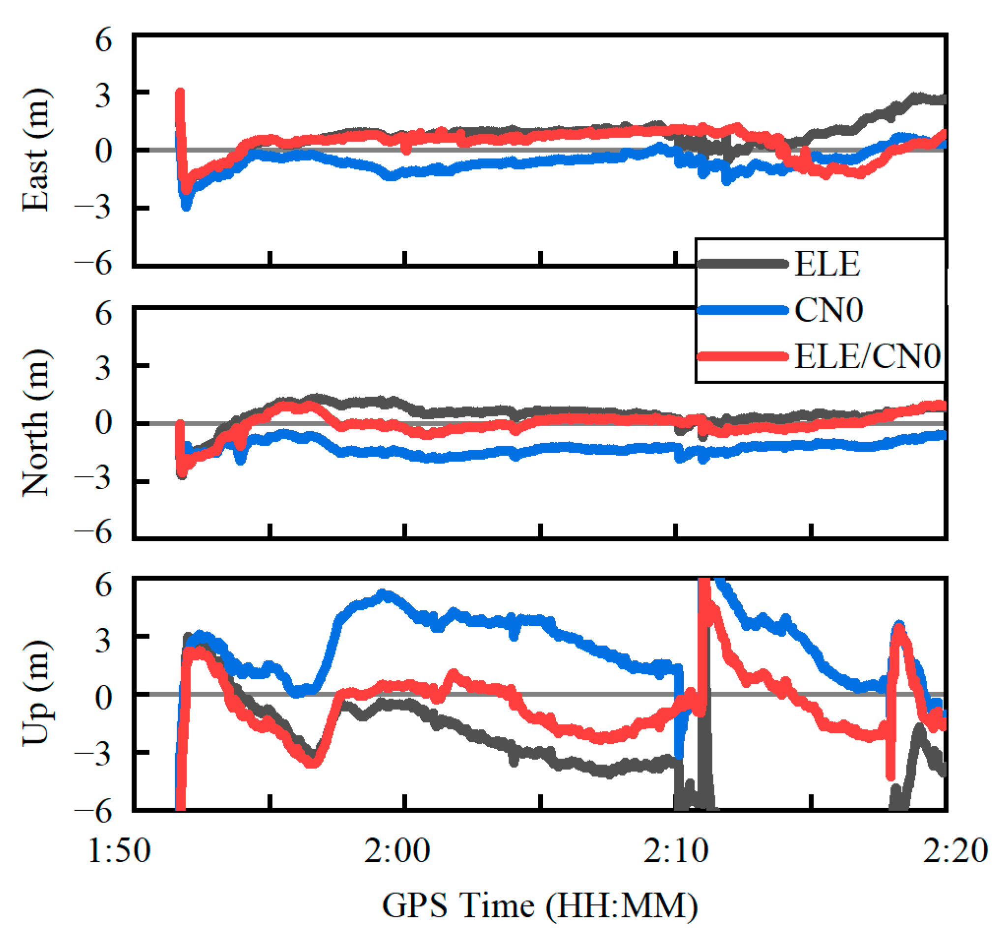
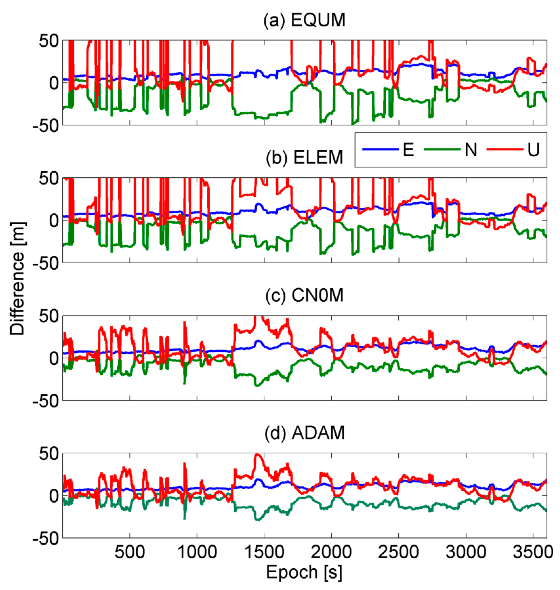

# 2026-08-31 GNSS 每日研究简报

## 今日快报

### 快报 1：基线长度不只用于验算姿态，还可以在分组模糊度搜索后约束整组候选

- 主题：`baseline-constrained-vib-bie-gnss-attitude`
- 来源 ID：`doi:10.1088/1361-6501/ae8c66`
- 来源链接：https://doi.org/10.1088/1361-6501/ae8c66
- 发表日期：2026-08-28
- 来源类型：Measurement Science and Technology 同行评审论文、GNSS 载波相位动态定姿与整数模糊度搜索
- 获取范围：出版社正式元数据与摘要；正文访问受限，因此本条不复述摘要之外的数值、车辆配置或候选数

**内容：** 作者把 VIB-BIE 的分组搜索与已知基线长度结合：每组模糊度搜索时用随搜索收缩的边界函数控制候选，完成全部分组后再以基线长度约束整体模糊度解，并以分段权函数调节不同候选子集的贡献。它试图同时解决 BC-LAMBDA 约束可靠但搜索可能较慢、VIB-BIE 搜索快却没有利用几何边界的问题。

**结论：** 正式摘要称，动态车辆比较中 BCVIB-BIE 的模糊度成功率最高，并在航向精度与耗时上优于 VIB-BIE 和 BC-LAMBDA；摘要未给出可独立核对的绝对误差、采样率和运行平台，因此这里把结论限定为作者数据与实现下的相对排序，不外推到任意基线、遮挡率或处理器。

**关注理由：** 已知杆臂是低成本双天线系统最便宜的强约束，但它必须进入候选评价而不只是事后检查。实现时还需记录候选截断是否误删真值、基线标定误差和车体挠曲，否则“更快”可能来自过紧边界。

### 快报 2：高纬电离层现报把经验背景与物理背景都送进同一个 3DVar 框架，而不是先假定谁永远更好

- 主题：`hawki-arctic-ionosphere-3dvar-nowcast`
- 来源 ID：`doi:10.1029/2026sw005159`
- 来源链接：https://doi.org/10.1029/2026SW005159
- 发表日期：2026-08-27
- 来源类型：Space Weather 同行评审开放论文、高纬电离层实时三维同化
- 获取范围：CC BY-NC-ND 4.0 正式摘要与出版元数据；方法、验证对象和 5 min 更新节拍可核查，本文不改编原图

**内容：** HAWK-I 以 IDA4D 的三维变分实现更新对数电子密度状态，在 5 min 节拍上同化地基 GNSS TEC 与掩星观测，输出三维电子密度。系统允许经验背景和物理背景分别进入同化，用同一观测与代价函数比较其互补性，而不是把某一种背景固定成真值。

**结论：** 作者以 2024 年 5 月地磁暴为案例，用地基 GNSS TEC 和非相干散射雷达验证；正式摘要报告同化相对背景模型显著降低 TEC 误差，并指出掩星数据改善了远离地基站区域。摘要没有给出本文可复核的统一百分比，因此不能把“改善”翻译成全球、全年或全部高度层的固定增益。

**关注理由：** 对 GNSS 用户，电离层产品的关键不只是网格分辨率，而是更新时间、站网空洞和背景依赖。5 min 三维同化提供了可用的误差分层思路，但定位滤波仍应传播产品龄期与区域覆盖，而不能把电子密度现报当无误差改正。

### 快报 3：没有站点气象传感器时，可让 GraphCast 先给 ZHD 与加权平均温度，再由 GNSS 延迟反演水汽

- 主题：`graphcast-forecast-gnss-pwv-retrieval`
- 来源 ID：`doi:10.1029/2025ea004409`
- 来源链接：https://doi.org/10.1029/2025EA004409
- 发表日期：2026-08-25
- 来源类型：Earth and Space Science 同行评审开放论文、AI 天气预报驱动的全球 GNSS 可降水量反演
- 获取范围：CC BY-NC 4.0 正式摘要、关键点与出版元数据；本文只采用摘要明确报告的全球探空/GNSS验证指标

**内容：** 方法用 GraphCast 预报加权平均温度 $`T_m`$ 与天顶静力延迟 ZHD，再把它们同 GNSS 估计的天顶总延迟结合，得到可降水量 PWV。比较基线是 GPT3 与堆叠机器学习模型，目的不是让天气模型直接替代 GNSS，而是给缺少地面气压和温度传感器的站点补齐实时转换参数。

**结论：** 正式摘要报告：对全球探空数据验证时，GraphCast-PWV 的 RMSE 为 0.73 mm，比两类基线低约 1.3 mm 以上；对 GNSS 数据验证时 RMSE 为 1.7 mm，改善约 0.7 mm 以上。两套“参考”并非同一种独立真值，且摘要层指标不能说明极端降水、预报时效和局地地形下的尾部误差。

**关注理由：** GNSS 气象产品的实时性常被 ZHD 与 $`T_m`$ 卡住。工程上应把“天气预报误差”“GNSS ZTD 误差”和“PWV 转换误差”分别留账，并用真正留出的站点和预报时效验证，避免随机划分泄漏空间气候特征。

### 快报 4：地球同步卫星的固定视线让三台接收机直接追踪闪烁图样从 180 m/s 慢到 40 m/s

- 主题：`geostationary-l1-spaced-receiver-equatorial-scintillation`
- 来源 ID：`doi:10.1029/2025ja034953`
- 来源链接：https://doi.org/10.1029/2025JA034953
- 发表日期：2026-08-24
- 来源类型：Journal of Geophysical Research: Space Physics 同行评审论文、赤道等离子体不规则体多基线闪烁观测
- 获取范围：出版社正式摘要与元数据；三接收机几何、速度、谱斜率和尺度量级来自摘要，正文复用权限未开放

**内容：** 三台接收机沿磁东西方向布设，间距为 40 m 和 100 m，连续跟踪地球同步卫星 L1 闪烁图样。对接收机间图样时间延迟求空间漂移，再用功率谱追踪不规则体尺度随事件演化；固定卫星视线减少了普通 MEO 卫星几何快速变化对时间演化判断的混淆。

**结论：** 摘要报告事件初期纬向漂移速度最高约 180 m/s，随后降至约 40 m/s；峰值闪烁期谱斜率约为 −3，估计尺度从形成时约 800 m 级联到约 200 m。它描述的是印度磁赤道上空、日落后特定事件的图样漂移与谱尺度，不等同于任意 GNSS 频点的定位误差或接收机失锁概率。

**关注理由：** 跟踪环设计需要知道闪烁变化的时间尺度，而不只是一个 $`S_4`$ 峰值。多基线结果可用于构造可控的幅相扰动回放，但从空间尺度映射到时间谱时必须保留漂移方向、固定视线和冻结流假设。

### 快报 5：惯导位置误差模型必须和位置参数化成对选择，不能把经纬度误差式直接搬到任意坐标状态

- 主题：`sins-position-error-parameterization-consistency`
- 来源 ID：`doi:10.1088/1361-6501/ae8dee`
- 来源链接：https://doi.org/10.1088/1361-6501/ae8dee
- 发表日期：2026-08-25
- 来源类型：Measurement Science and Technology 同行评审论文、捷联惯导位置误差模型推导与海试验证
- 获取范围：出版社正式摘要与元数据；三类参数化、正负对照和 60 h 海试范围可核查，具体方程与数值不作摘要外推

**内容：** 论文在三种位置参数化和误差定义下重新推导 SINS 位置误差模型，给出模型之间的显式映射与物理差异，并以重力辅助长航时惯导说明标准使用流程。核心问题是：同一“位置误差”若定义在标量经纬度、曲面切空间或其他坐标表示中，其状态传播与观测雅可比不能任意互换。

**结论：** 作者用 60 h 海试做正向验证，并以错误搭配模型的负对照说明参数化与误差模型必须一致。正式摘要没有提供全部海况、传感器等级和绝对漂移量，因此该结果支持“模型不能随意互换”，不支持某一种参数化在所有 GNSS/INS 系统中必然最优。

**关注理由：** GNSS 更新通常在 ECEF、ENU 或经纬高之间变换；位置误差定义若和状态坐标不一致，会把曲率项、重力梯度或雅可比符号错误伪装成滤波调参问题。代码审查应同时检查状态定义、误差注入、协方差变换和 GNSS 量测矩阵。

## 深度研读

### 深读 1｜接收机工程｜SISRE 降了三成，SPP 为什么只改善一点：先把广播误差、用户误差和几何分开记账

- 类别：`receiver-engineering`
- 学习层级：`foundation`
- 选题定位：`经典基础`
- 来源 ID：`doi:10.1007/s10291-024-01793-6`
- 来源链接：https://doi.org/10.1007/s10291-024-01793-6
- 发表日期：2024-12-05
- 来源类型：GPS Solutions 同行评审开放论文、2024 GPS 广播轨钟精度改进与用户定位误差预算
- 获取范围：CC BY 4.0 出版全文；2023-01—2024-08 广播/精密产品、Figures 1—6 与 Tables 1—4
- 价值评分：99/100（相关性 20，经典价值 20，证据 20，教学价值 20，工程价值 19）

#### 为什么先学这个

接收机看到的是伪距总误差，不会自动区分卫星广播轨钟、群延迟、电离层、多路径、接收机噪声和几何放大。若把 SISRE 下降直接等同于 SPP 同比例改善，就会在后两节的定权算法上优化错对象。先把误差预算拆开，才能知道权值实际在控制哪一项。

#### 先修知识

需要理解广播星历、精密轨钟、视线方向、卫星钟差、码偏差/群延迟、SISRE、UERE/UEE、DOP、伪距 SPP、双频无电离层组合，以及 RMS、DRMS 与 R95 的区别。

#### 一句话逻辑

先把广播轨道、卫星钟和群延迟投影成视线测距误差 SISRE，再与用户设备误差 UEE 按方差合成 UERE，最后由几何矩阵传播到位置；只要 UEE 仍占主导，空间段改善就会被用户端误差遮住。

#### 研究问题与约束

论文分析 GPS 2024 年初换用更稳原子钟、缩短导航数据上传间隔及更新卫星天线相位中心约定后，广播 SISRE 如何变化，并比较 L1 C/A、P(Y)、L2C 与 LNAV/CNAV 组合。定位示例只有 IGS BRUX 站、两个五日窗口、测地设备和开阔环境；它不是手机城市 SPP，也不包含认证级完整性风险。

#### 核心方法论

作者以合并广播星历对比 CODE 精密轨钟，并用 CAS 码偏差统一各用户信号的群延迟参考；轨道误差先分解到径向、沿轨和横轨，再与卫星钟/偏差共同投影成全球平均 SISRE。之后固定定位策略比较改进前后 SPP/PPP，区分空间段变化、DOP 变化和用户端观测误差。

#### 关键公式逐步推导

对卫星位置误差 $`\Delta\mathbf r^s`$、视线单位向量 $`\mathbf e`$、卫星钟与码偏差合成项 $`c\Delta\tau`$，用户方向上的测距误差可写成：

```math
\Delta \rho_{\mathrm{SIS}}
=-\mathbf e^T\Delta\mathbf r^s+c\Delta\tau.
```

把空间段与用户端误差视为已校准、近似不相关的零均值项，则：

```math
\sigma_{\mathrm{UERE}}^2
=\sigma_{\mathrm{SISRE}}^2+\sigma_{\mathrm{UEE}}^2.
```

线性化 SPP $`\mathbf v=\mathbf G\Delta\mathbf x-\boldsymbol\varepsilon`$ 后，位置协方差为：

```math
Q_{\Delta x}=(G^TWG)^{-1},
```

所以误差预算是“测距方差 × 几何传播”，不是 SISRE 单独决定。若 $`\sigma_{\mathrm{UEE}}\approx0.80\ \mathrm m`$ 而 SISRE 仅 0.3—0.5 m，继续压低 SISRE 对 UERE 的边际收益自然变小。

#### 经典价值与创新边界

经典价值在于把 SISRE、UEE、UERE 与 DOP 放回同一因果链，并用真实 GPS 运控变化验证。创新主要是对 2024 精度提升的独立归因：钟切换与更频繁上传主导即时收益，PCO 约定主要影响广播/精密轨道比较。边界是零均值、独立和代表性 UEE 假设；城市相关多路径会破坏这套简单 RSS。

#### 整体逻辑链

定义用户视线误差；拆解轨道、钟和群延迟；审计原子钟 Allan 偏差与上传间隔；比较 2023—2024 SISRE；区分信号/导航电文；把 SISRE 与 UEE 合成；固定几何做 BRUX SPP；解释空间段改善为何被用户端遮蔽；再用载波 PPP 展示低 UEE 情况下的收益。

#### 原文图表与结果分析



> 图表源：Montenbruck 与 Steigenberger《The 2024 GPS accuracy improvement initiative》Figure 6，[DOI 原文](https://doi.org/10.1007/s10291-024-01793-6)，CC BY 4.0。下载出版社提供的 Figure 6 高分辨率 PNG；未裁剪、重绘、改色或修改坐标、图例与数据。

横轴东向、纵轴北向，单位均为 m；圆表示 R95。图中两期 R95 为 1.76 m 与 1.63 m，较小者仅缩小约 7%，与正文“水平误差约改善 8%”一致。点云仍由用户端误差主导，不能用这张图证明卫星 SISRE 没改善，也不能把 R95 当单轴 95% 分位。

#### 原文结果论述

论文报告双频 P(Y)/LNAV 的全球平均 SISRE 从约 45 cm 降至约 30 cm；L1 C/A/LNAV 因缺少相对 P(Y) 的 ISC，改进后仍约 40 cm。BRUX 两个窗口的 UERE 约 0.90 m 与 0.86 m，UEE 约 0.80 m，水平误差变化中约 3% 还来自几何差异。作者因此明确区分“空间段量级改善”与“SPP 用户端实际收益”。

#### 常见误区与适用边界

第一，把 SPS 7 m 的 95% 上限当当前 RMS。第二，把 SISRE 当实际定位误差。第三，忽略不同码信号的群延迟参考。第四，用无电离层组合消除了电离层，就忘记噪声和多路径约放大三倍。第五，把两个五日窗口当全年统计。第六，把 R95 与 DRMS 混用。第七，忽略空间段与 UEE 可能相关或有偏。

#### 工程实现步骤

1. 按信号与导航电文分别解析广播轨钟和群延迟。
2. 用同一参考点、时间尺度和码偏差定义对齐精密产品。
3. 逐星计算视线 SISRE，并另存轨道、钟、偏差分量。
4. 从接收机残差估计噪声、多路径和大气剩余的 UEE。
5. 以实际 $`W`$ 与 $`G`$ 传播到 ENU 协方差。
6. 报告 RMS、95% 分位、DOP 和数据剔除率，避免单指标归因。
7. 在空间段变更前后使用相同处理链，并做卫星/信号分层。
8. 将城市偏差与相关误差留给后续稳健或自适应定权处理。

#### 复现实验设计

选 20 个 IGS 站，覆盖 2024 年 1—4 月各连续 30 d；以 30 s 采样、10° 截止角，比较 LNAV L1 C/A、P(Y) 双频和 CNAV L1/L2C。基线为“广播 SPP”“仅替换精密轨钟”“完整 PPP”；指标为逐星 SISRE RMS/95%、UERE、水平 DRMS/R95、PDOP 与卫星剔除率。失败场景加入未知 0.6 m ISC、300 s 产品龄期和低仰角多路径，检查是否仍能正确归因。

#### 与定位及低成本实现的联系

低成本 SPP 的主要瓶颈通常在 UEE，而不是现代 GNSS 的广播 SISRE。第二节因此不再把所有观测等权，而是利用仰角与 $`C/N_0`$ 改善手机观测随机模型；第三节再把城市站点特有的偏离量单独变成额外方差。

#### 本节小结

SISRE 是空间段视线测距误差，不是位置误差；只有把它同 UEE 和几何传播合账，才能判断一次卫星系统升级对具体接收机真正值多少。

### 深读 2｜低成本与手机｜仰角给稳定底座，C/N₀ 只补瞬时变化：手机 PPP 联合定权怎样避免权值跟着信号强度乱跳

- 类别：`low-cost-mobile`
- 学习层级：`intermediate`
- 选题定位：`基础进阶`
- 来源 ID：`doi:10.3390/s22072804`
- 来源链接：https://doi.org/10.3390/s22072804
- 发表日期：2022-04-06
- 来源类型：Sensors 同行评审开放论文、Xiaomi Mi 8 多系统动态 PPP 联合随机模型
- 获取范围：CC BY 4.0 出版全文；两组动态试验、Figures 1—14 与 Tables 1—3
- 价值评分：98/100（相关性 20，经典价值 18，证据 20，教学价值 20，工程价值 20）

#### 为什么先学这个

上一节说明 UEE 主导 SPP/PPP 用户端误差，但“看见低 $`C/N_0`$ 就大幅降权”也会造成权值剧烈抖动。手机线极化天线使 $`C/N_0`$ 对姿态和环境很敏感；需要让仰角模型提供平滑基准，只让 $`C/N_0`$ 的异常部分补充瞬时质量变化。

#### 先修知识

需要理解权阵与观测方差、仰角定权、$`C/N_0`$（dB-Hz）、多系统未差未组合 PPP、码相噪声、GIM 虚拟观测、Kalman 随机游走、实时精密轨钟和动态 RTK 真值。

#### 一句话逻辑

先拟合正常情况下 $`C/N_0`$ 随仰角的变化，把纯 $`C/N_0`$ 方差缩放到仰角方差尺度，再用“仰角主项 + 归一化 $`C/N_0`$ 补项”定权，既保留几何上的平滑趋势，也响应手机瞬时遮挡。

#### 研究问题与约束

论文只用 Xiaomi Mi 8，比较开阔操场步行和建筑/树木遮挡下电动车动态 PPP。采用 GPS/GLONASS/BDS/Galileo、1 Hz 数据、10° 截止角、CNES 实时精密产品与 GIM 约束；结果不能代表其他手机天线、手持姿态、城市峡谷速度或真正在线网络延迟。

#### 核心方法论

作者先用二次多项式拟合 L1/G1/B1/E1 的 $`C/N_0`$—仰角关系。对这些信号，仰角方差作主项，$`C/N_0`$ 方差减去拟合 $`C/N_0`$ 对应方差后作补项；L5/E5a 因码多路径噪声与仰角相关较弱，只使用归一化后的 $`C/N_0`$ 方差。不同星座/频点另设初始权比，避免把联合指标误当跨信号绝对标尺。

#### 关键公式逐步推导

观测权为方差倒数：

```math
W=\operatorname{diag}(\sigma_1^{-2},\ldots,\sigma_m^{-2}).
```

两种传统模型分别为：

```math
\sigma_{ele}^2=\frac{\sigma_0^2}{\sin^2(ele)},\qquad
\sigma_{C/N_0}^2=\sigma_0^2\times10^{\max(MAX-C/N_0,0)/10}.
```

拟合正常信号强度：

```math
C/N_{0,cal}=a+b\,ele+c\,ele^2.
```

对 L1 类信号，可把论文的联合思想概括为：

```math
\sigma_{comb}^2
=\sigma_{ele}^2+k\left(\sigma_{C/N_0}^2-\sigma_{C/N_{0,cal}}^2\right),
```

其中 $`k`$ 把补项归一到仰角方差尺度；实现时应按论文的频点分支和上下界处理，而不能让差值产生负方差。

#### 经典价值与创新边界

价值在于把仰角和 $`C/N_0`$ 的角色分工：前者提供稳定先验，后者描述环境与姿态造成的瞬时变化。创新边界是经验拟合与单机型验证；它没有从物理上分离多路径、天线方向图和 AGC，也没有证明联合方差经过统计校准。

#### 整体逻辑链

分析手机码多路径噪声；比较其对仰角与 $`C/N_0`$ 的相关；拟合正常 $`C/N_0`$—仰角曲线；统一两类方差尺度；按频点构造联合权；放入四系统未组合 PPP；用开阔与受限动态试验比较三种权；以 RTK 轨迹计算 ENU 与 3D RMS。

#### 原文图表与结果分析



> 图表源：Li、Cai 与 Xu《A Combined Elevation Angle and C/N0 Weighting Method for GNSS PPP on Xiaomi MI8 Smartphones》Figure 14，[DOI 原文](https://doi.org/10.3390/s22072804)，CC BY 4.0。下载出版社 Figure 14 原始 PNG；未裁剪、重绘、改色或修改坐标、图例与数据。

横轴是 GPS 时间 1:50—2:20（HH:MM），纵轴是东、北、天三方向误差（m）；灰、蓝、红分别为仰角、$`C/N_0`$ 与联合定权。红线在北和天方向多数时段更靠近零，但东向并非处处优于纯 $`C/N_0`$。图能证明这段轨迹的分量变化，不能单凭曲线宣称误差独立、权值已校准或所有历元联合方案都最优。

#### 原文结果论述

受限环境中，联合方案 E/N/U RMS 为 1.00/0.62/2.22 m，3D RMS 2.51 m；仰角方案为 1.24/0.71/5.03 m，纯 $`C/N_0`$ 为 0.83/1.28/3.03 m。联合 3D RMS 相对两者改善 52.0% 与 26.0%，但东向反而不如纯 $`C/N_0`$。开阔试验联合 3D RMS 为 1.63 m，相对两基线改善 22.7% 与 24.2%。

#### 常见误区与适用边界

第一，把高 $`C/N_0`$ 当 LOS 证明。第二，跨手机直接复用拟合系数。第三，混用 dB-Hz 与线性功率。第四，忽略不同星座/频点的初始权比。第五，让方差补项为负。第六，只报 3D RMS，掩盖东向退化。第七，用同一段轨迹调参又验收。第八，把外部 RTK 真值误差当零。

#### 工程实现步骤

1. 按机型、天线姿态、星座和频点采集开阔标定数据。
2. 以卫星级时间隔离拟合 $`C/N_0`$—仰角曲线。
3. 为各信号设码/相初始方差与合理上下界。
4. 将 $`C/N_0`$ 方差归一到仰角尺度，检查单位与非负性。
5. 在滤波更新前记录每星权值、创新和剔除原因。
6. 对低卫星数、周跳和重收敛设置状态重置逻辑。
7. 分方向报告 RMS、95% 分位、收敛时间和可用率。
8. 用跨设备、跨路线数据重估而非照搬经验系数。

#### 复现实验设计

使用三款 Android 双频手机，各做开阔步行、林荫电动车和高楼车辆三条 30 min 路线，1 Hz、10° 截止角，共天线或已标定杆臂 RTK/INS 作真值。比较等权、仰角、纯 $`C/N_0`$、联合权和残差鲁棒权；指标为 ENU/3D RMS、95% 分位、重收敛次数、权值变化率和归一化创新。失败场景加入手机旋转 90°、短时断星与 $`C/N_0`$ 偏置 3 dB-Hz。

#### 与定位及低成本实现的联系

联合定权已经把 UEE 结构化，但其 $`C/N_0`$ 拟合仍是跨场景经验关系。第三节进一步建立“同一接收机、同一频点、理想场地”的名义模板，只在实测 $`C/N_0`$ 显著偏离模板时追加场地特有方差，并直接用于纯码 SPP。

#### 本节小结

手机定权不应在仰角与 $`C/N_0`$ 之间二选一；稳定的仰角底座加归一化的瞬时信号强度补项，能减少纯 $`C/N_0`$ 权值抖动，但经验系数必须跨设备复验。

### 深读 3｜定位｜城市 SPP 不把弱星一刀切：用名义 C/N₀ 偏离量只增加“场地特有”方差

- 类别：`positioning`
- 学习层级：`advanced`
- 选题定位：`定位深入`
- 来源 ID：`doi:10.3390/rs10071157`
- 来源链接：https://doi.org/10.3390/rs10071157
- 发表日期：2018-07-22
- 来源类型：Remote Sensing 同行评审开放论文、城市纯码 SPP/RTD 实时自适应随机模型
- 获取范围：CC BY 4.0 出版全文；24 h 模板标定、两组静态与一组动态试验、Figures 1—15 与 Tables 1—3
- 价值评分：99/100（相关性 20，经典价值 19，证据 20，教学价值 20，工程价值 20）

#### 为什么先学这个

上一节联合使用仰角和 $`C/N_0`$，但仍把绝对 $`C/N_0`$ 映射成方差。相同 38 dB-Hz 对低仰角卫星可能正常，对高仰角卫星却可能异常；城市 SPP 更需要比较“实测值偏离这颗接收机在该仰角应有多少”，再决定是否追加多路径/NLOS 方差。

#### 先修知识

需要理解纯码 SPP、广播星历、Klobuchar 与 Hopfield 改正、最小二乘权阵、仰角/$`C/N_0`$ 随机模型、名义模板、标准差阈值、PDOP、RTK 真值和 NLOS/多路径差异。

#### 一句话逻辑

用开阔 24 h 数据拟合每频点的名义 $`C/N_{0,nom}(\theta)`$ 及其标准差；在线若实测值偏离超过 $`\beta`$ 倍标准差，就在仰角基础方差上追加与线性功率差成比例的场地特有方差，而不是直接删除该星。

#### 研究问题与约束

论文以 Trimble R10、GPS C1/P2、加拿大 Calgary 三组数据验证单频 SPP 和双频码 RTD。高级定位链在这里限定为纯 GNSS 码 SPP：没有相机、IMU 或地图。模型依赖预先采集的接收机/天线模板，且 2017 年单设备、单城市试验不代表现代手机或不同 AGC 实现。

#### 核心方法论

总码方差拆为接收机/大气基础项与场地特有项。基础项用 $`a/\sin^2\theta`$；开阔数据按 1° 仰角分箱，剔除双倍标准差外点，以三次多项式拟合名义 $`C/N_0`$ 和其标准差。在线以 $`T=\beta\,STD_{nom}(\theta)`$ 检验偏离，论文取 $`\beta=2`$；显著时才追加 $`C/N_0`$ 线性功率差。

#### 关键公式逐步推导

码观测误差方差先拆成：

```math
\sigma_P^2=\sigma_A^2+\sigma_\varepsilon^2+\sigma_U^2,
```

其中 $`\sigma_U^2`$ 表示多路径/NLOS 等场地特有项。名义模板为：

```math
C/N_{0,nom}(\theta)=f_1(\theta),\qquad
STD_{nom}(\theta)=f_2(\theta).
```

阈值 $`T=\beta STD_{nom}(\theta)`$ 后，自适应方差写成：

```math
\sigma_{ada}^2=
\begin{cases}
\dfrac{a}{\sin^2\theta}, & |C/N_0-C/N_{0,nom}(\theta)|<T,\\[6pt]
\dfrac{a}{\sin^2\theta}
+a\gamma\left|10^{-C/N_0/10}-10^{-C/N_{0,nom}(\theta)/10}\right|,
& |C/N_0-C/N_{0,nom}(\theta)|\ge T.
\end{cases}
```

绝对值允许异常反射使 $`C/N_0`$ 高于或低于名义值；最终权 $`w=1/\sigma_{ada}^2`$。

#### 经典价值与创新边界

经典价值在于把“绝对信号强度”改成“相对接收机名义状态的偏离”，并在等权、仰角、纯 $`C/N_0`$ 与自适应模型之间给出可退化关系。边界是 $`C/N_0`$ 不能区分 NLOS 正偏与负偏的物理原因，模板会随天线、固件、增益、温度和安装改变，且权值不处理跨星相关性。

#### 整体逻辑链

建立码观测功能模型；指出传统随机模型漏掉场地项；拆分三类方差；用开阔数据建立名义模板；以标准差阈值检测偏离；把 dB-Hz 转线性功率差；生成每星实时方差；在高楼、林区和动态路线比较四种定权；以已知坐标/RTK 计算 SPP 与 RTD 误差。

#### 原文图表与结果分析



> 图表源：Zhang 等《Site-Specific Unmodeled Error Mitigation for GNSS Positioning in Urban Environments Using a Real-Time Adaptive Weighting Model》Figure 8，[DOI 原文](https://doi.org/10.3390/rs10071157)，CC BY 4.0。下载出版社 Figure 8 原始 PNG；未裁剪、重绘、改色或修改坐标、图例与数据。

横轴是历元（1 Hz，约 3600 s），纵轴是与精确坐标之差（m），蓝/绿/红为东/北/天；四行依次为等权、仰角、纯 $`C/N_0`$ 和自适应。等权与仰角的垂向多次越出 ±50 m 显示范围，纯 $`C/N_0`$ 和自适应明显收敛，但仍有数十米偏差。图只说明这组高楼静态数据的相对稳健性，不能证明误差已高斯化或达到车道级精度。

#### 原文结果论述

高楼数据平均可用卫星 6.5 颗、PDOP 4.2。自适应 SPP 的 3D RMS 相对等权、仰角和纯 $`C/N_0`$ 分别改善 50.0%、41.4% 和 13.9%；作者对三组传统模型取平均后在高楼环境报告 SPP 改善 35.1%。林区数据的平均改善为 11.4%。这些是特定设备与数据集内的相对 RMS，不是城市 SPP 的通用误差下界。

#### 常见误区与适用边界

第一，把模板当永久标定。第二，只对低于名义值的信号降权，遗漏反射增益。第三，把 $`\beta=2`$ 当严格 95% 保证。第四，把弱星降权等同 NLOS 识别。第五，忽略 6.5 星、PDOP 4.2 时几何本已脆弱。第六，按星独立定权却不检查共同反射面相关性。第七，用坐标 RMS 代替方差一致性。第八，把 RTD 结论直接搬到 SPP。

#### 工程实现步骤

1. 固定天线、前端、固件和安装姿态采集至少 24 h 开阔数据。
2. 按星座/频点和 1°—5° 仰角箱检查卫星间模板一致性。
3. 拟合名义均值与标准差，并版本化保存温度与增益条件。
4. 在线计算偏离与 $`T=\beta STD_{nom}`$，再转换线性功率差。
5. 将场地项加到而非替代基础仰角方差，并设置方差上下界。
6. 同时记录卫星数、PDOP、创新和每星权，避免权值掩盖坏几何。
7. 用归一化残差与真实位置误差共同校准 $`\beta`$。
8. 检测模板漂移时回退到保守仰角模型并触发重新标定。

#### 复现实验设计

选择两款测地接收机和两款低成本模块，各采 24 h 开阔模板；再在高楼、林荫和高架三环境各做 10 次 1 h 静态/低速动态试验，1 Hz，RTK/全站仪作真值。比较 EQUM、ELEM、CN0M、ADAM 与 Huber 残差权；扫描 $`\beta=1.5/2/3`$。指标为 ENU/3D RMS、95/99% 分位、归一化创新覆盖、最大连续大误差、可用率和算时。失败场景包括天线旋转、温度变化、AGC 固件更新与同步多星 NLOS。

#### 与定位及低成本实现的联系

这是一条纯 GNSS SPP 路线：广播星历与码观测完成定位，$`C/N_0`$ 只调整观测协方差，不引入外部传感器。对低成本设备最实用的收益不是保证亚米，而是在保留足够卫星几何的同时降低异常码观测影响；若模板失配或多星相关偏差占主导，仍需残差检验、地图约束或宣布不可用。

#### 本节小结

城市 SPP 的 $`C/N_0`$ 应相对于“这套硬件在该仰角的名义值”解释；显著偏离时追加场地方差，比绝对阈值删除卫星更连续，但模板漂移与相关 NLOS 仍是硬边界。
