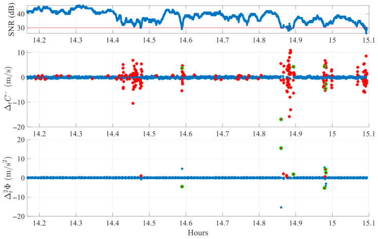
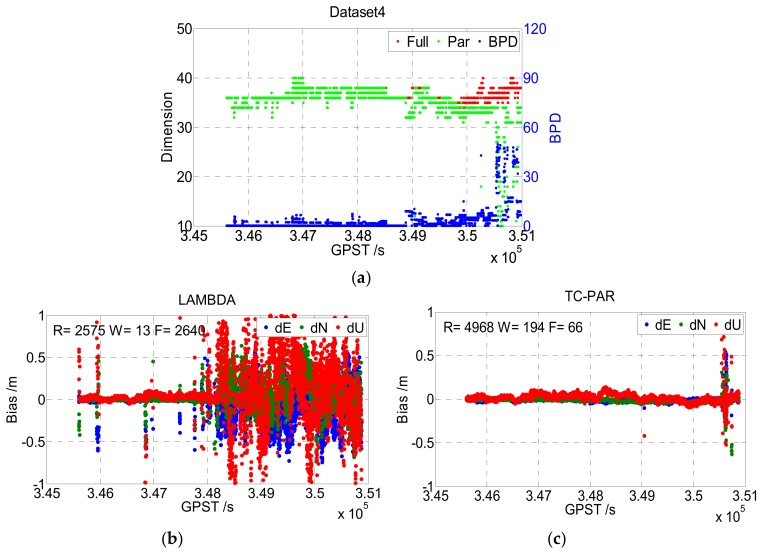
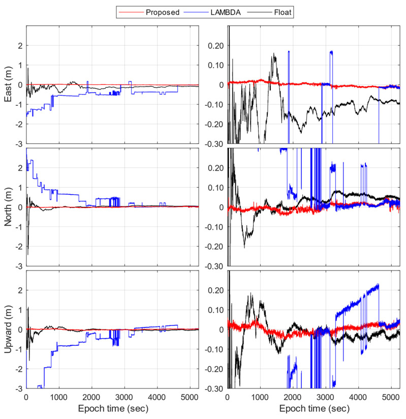

# 2026-09-01 GNSS 每日研究简报

## 今日快报

### 快报 1：LEO 通信波束兼做 PNT，真正的瓶颈是“忙小区还能看见几颗独立卫星”

- 主题：`leo-com-pnt-beam-scheduling-availability`
- 来源 ID：`arxiv:2608.28217`
- 来源链接：https://arxiv.org/abs/2608.28217
- 发表日期：2026-08-28
- 来源类型：arXiv 预印本、LEO 融合通信与 PNT 波束/功率调度仿真
- 获取范围：完整预印本 14 页；系统模型、24 h 仿真、参数表和结果图均已核对

**内容：** 论文把通信优先的多波束 LEO 星座写成波束—功率预算问题，要求一个网格在 95% 时间内同时收到至少 4 颗卫星的测距信号。第一种“共星分担”不改通信波形，忙小区由其他可见星发 PNT；第二种“波内测距”把测距成分嵌进通信波形，让通信服务星也成为第 4 个测距源。

**结论：** 在 24×11、倾角 55°、高度 1200 km 的 Walker 星座和 60 s 步长的 24 h 仿真中，共星分担对均匀/人口加权流量达到 70.5%/88.2% 的 95%-时间可用面积；波内测距达到该几何下限的 92.9%。这是确定性链路与流量仿真，不是轨道实测；92.9% 也受所选星座、仰角截止和“至少四星”规则约束。

**关注理由：** 融合 PNT 不能只报卫星总数或平均覆盖。工程上要同时审计忙小区的可见星重叠、每星波束上限、测距信号功率退避和波形相干性，否则通信满载时恰好会在用户最密集处丢掉定位可用性。

### 快报 2：一年林地试验显示，算法更复杂不等于跨季节更可靠

- 主题：`subarctic-multiseason-gnss-denied-navigation-field-report`
- 来源 ID：`arxiv:2608.27628`
- 来源链接：https://arxiv.org/abs/2608.27628
- 发表日期：2026-08-27
- 来源类型：arXiv 预印本、亚寒带林区长期机器人定位与建图实地报告
- 获取范围：完整预印本 27 页；64 km 数据、九种开源方法、失败定义与跨季节试验已核对

**内容：** 作者用 12 个月、超过 64 km 的重复路线，对轮速/IMU、激光、雷达和视觉共九种开源里程计、SLAM 与 Teach-and-Repeat 方法做统一复算。GNSS/PPK 与三天线几何用于参考轨迹，而被测导航链依赖机载传感器，重点是积雪、自相似林道、强季节外观变化和约 60 °C 温差下的失效，而非只比较成功片段的平均误差。

**结论：** 简单本体里程计在多条路线中表现出意外的稳健性；复杂 SLAM 的精度收益有限，却增加初始化、回环和软件失败风险。跨季节先验地图定位中，激光方法完成了更多运行，雷达和视觉会因匹配特征稀少而失败。结论来自一个亚寒带站点和特定实现，不能据此宣称激光在所有森林与季节都占优。

**关注理由：** GNSS 受限系统需要把“误差大但持续输出”与“误差低但突然终止”分开计量。对融合定位，GNSS 恢复后的重定位门控、失败率、环境分类和最简单的轮速/IMU 基线，往往比再加一个平均精度指标更有诊断价值。

### 快报 3：38 mg 档案式标签用旋转 BLE 波束重建蜜蜂路径，代价是必须回收标签

- 主题：`ultralow-power-ble-rss-probabilistic-path-reconstruction`
- 来源 ID：`arxiv:2608.27152`
- 来源链接：https://arxiv.org/abs/2608.27152
- 发表日期：2026-08-27
- 来源类型：arXiv 预印本、非 GNSS 超低功耗 RSS/AoA 路径重建与蜜蜂外场试验
- 获取范围：完整预印本 23 页；硬件、六条有 GNSS 参考的路径、功耗模型和蜜蜂回巢试验已核对

**内容：** 已知位置的旋转高增益 BLE 发射机播发定向信号，38 mg 接收标签只记录 RSS。作者先以贝叶斯模型从很少的 RSS 样本恢复方位概率分布，再用高斯过程和双随机变分推断恢复连续路径；这避免标签端运行 GNSS，但数据需在标签被重新观察或回收后读取。

**结论：** 六条地面真值路径中，每个方位只取 3 个 RSS 样本时路径 MAE 约 15 m、平均功耗约 180 µW；取 10 个样本时约 10 m、约 600 µW。参考 GNSS 自身约 3 m，作者估算评价下界约 4 m；持续扫描时相应超级电容续航仅约 5 min 与 90 s，因此结果证明的是功耗—精度折衷，不是长时实时 GNSS 替代。

**关注理由：** 这给 GNSS 拒止的超小型目标提供了可量化的低功耗基线，也提醒定位精度必须连同参考真值、占空比、基础设施密度和数据回收条件一起报告。

### 快报 4：协作式 Gaussian Splatting SLAM 把深度估计放到服务器，终端只传关键帧编码

- 主题：`collaborative-rgb-imu-gaussian-splatting-slam`
- 来源 ID：`arxiv:2608.26868`
- 来源链接：https://arxiv.org/abs/2608.26868
- 发表日期：2026-08-27
- 来源类型：arXiv 预印本、GNSS 拒止多终端 RGB+IMU 协作式 3DGS SLAM
- 获取范围：完整预印本 27 页（含补充材料）；TUM RGB-D、UT-MM、算力和通信负载已核对

**内容：** 每个终端用 RGB、IMU 预积分和度量单目深度先验完成局部跟踪与 3D Gaussian 子图；服务器运行更重的 Depth Pro 与 VGGT，识别重叠关键帧并对齐子图。终端编码约 65 KB、每秒 1—2 个关键帧，作者报告每终端上行小于 130 KB/s。

**结论：** 消费级 RTX 2080 Max-Q 笔记本侧约 10 FPS、约 1 GB 显存；TUM 五序列平均 ATE-RMSE 为 7.24 cm，与部分 RGB-D 3DGS 基线相近，但明显不及表中 Go-SLAM 的 2.56 cm。UT-MM 是把同一场馆的独立序列当作多终端代理，并非同步多机器人外场；服务器还使用 RTX 4090，因此“轻量协作”不等于全链路边缘化。

**关注理由：** 对 GNSS 拒止协同定位，这篇工作最有用的是把终端算力、上行量和服务器假设同时列出。部署前仍需实测网络丢包、错误子图关联、时间同步和真正多机动态遮挡。

### 快报 5：地磁平静不代表 GNSS 传播平静，弱 STEVE 也能产生可测幅相闪烁

- 主题：`antarctic-quiet-steve-gnss-scintillation`
- 来源 ID：`arxiv:2608.25764`
- 来源链接：https://arxiv.org/abs/2608.25764
- 发表日期：2026-08-26
- 来源类型：arXiv 预印本、南极光学与多频 GNSS 闪烁协同观测
- 获取范围：完整预印本 33 页与补充图；两站 50 Hz 数据、全景成像、投影高度和频点分析已核对

**内容：** 作者分析 2019-05-09 南极 Dronning Maud Land 的一次弱 STEVE 事件，把两台闪烁接收机的 GPS/Galileo/GLONASS 50 Hz 幅相观测与全天空成像的电离层穿刺点对齐，并比较卫星垂直穿越与切向掠过光弧时的 $`\sigma_\phi`$、$`S_4`$ 和无电离层组合。

**结论：** 事件在地磁总体平静时仍使 1 s 幅相闪烁指标超过接收机噪声两倍或更多；投影关系指向结构高度约在 10 min 内由 230—250 km 降到 170—200 km。证据只覆盖一个罕见事件、两站和有限卫星，作者也明确需要更多数据，不能由此给出通用失锁概率或定位误差。

**关注理由：** 接收机告警不应只看全球 Kp/Dst。极区航运和科考可把高率幅相指标、穿刺点几何与局地光学/电离层产品结合，区分传播异常、低仰角多路径和前端故障。

## 深度研读

### 深读 1｜接收机工程｜单频周跳不靠第二频点：先用码减相位找候选，再用二阶载波差分复核

- 类别：`receiver-engineering`
- 学习层级：`foundation`
- 选题定位：`经典基础`
- 来源 ID：`doi:10.3390/s25196162`
- 来源链接：https://doi.org/10.3390/s25196162
- 发表日期：2025-10-04
- 来源类型：Sensors 同行评审开放论文、单频 GNSS 实时周跳双指标检测
- 获取范围：CC BY 4.0 出版全文；十次 1 h 实测、1600 组人工注入试验、Figures 1—12 与 Tables 1—2
- 价值评分：98/100（相关性 20，经典价值 19，证据 20，教学价值 20，工程价值 19）

#### 为什么先学这个

RTK 的整数模糊度只有在载波连续时才可跨历元保持。手机或低成本模块一旦漏检周跳，后续“更聪明”的模糊度固定会在错误整数上变得很自信；因此先学会把突变从码噪声和多路径中分离，再进入部分固定与手机 RTK。

#### 先修知识

需要理解伪距、载波相位、整周模糊度、码减相位组合、历元差分、卫星仰角、SNR、RINEX LLI，以及检测率、漏检率和虚警率。

#### 一句话逻辑

一阶码减相位差分对周跳敏感但也吃码噪声，二阶载波差分更安静却会产生镜像峰；只有同一历元两个指标都越过各自的仰角自适应门限，才确认周跳。

#### 研究问题与约束

实验使用 u-blox EVK-M8T、GPS/Galileo L1、1 Hz，在开阔运动场和有林冠的城市公园各采五次 1 h 静态数据。人工试验排除了小于 5 周的跳变，电离层条件为常态且没有动态车辆，因此结果不覆盖高动态、强闪烁或 1—4 周微小周跳。

#### 核心方法论

令码观测为 $`P`$、以米计载波为 $`\Phi`$，先构造 $`C^-=P-\Phi`$。对每颗星独立计算一阶 $`\Delta_t C^-`$ 作为候选筛查，再计算二阶 $`\Delta_t^2\Phi`$ 作确认；门限随仰角经验方差变化，并在估计方差前剔除极端值。二阶差分造成相邻反号镜像峰，算法还需显式抑制镜像。

#### 关键公式逐步推导

单频码相模型相减后，几何、钟差和对流层消去：

```math
C^-=P-\Phi=2I-\lambda N+\varepsilon_{C^-}.
```

相邻历元一阶差分为：

```math
\Delta_t C^-=2\Delta_t I-\lambda\Delta_t N+\Delta_t\varepsilon_{C^-}.
```

若周跳在历元 $`k`$ 使 $`N_k-N_{k-1}=n`$，该指标出现约 $`-\lambda n`$ 的脉冲；再以

```math
\Delta_t^2\Phi_k=\Phi_k-2\Phi_{k-1}+\Phi_{k-2}
```

复核载波突变。最终判据可写为：

```math
|\Delta_t C^-|>T_C(e)\quad\land\quad
|\Delta_t^2\Phi|>T_\Phi(e),
```

其中 $`T_C(e)`$ 与 $`T_\Phi(e)`$ 由仰角分箱标准差拟合并设上下界。

#### 经典价值与创新边界

经典价值是把码减相位的高灵敏度与纯载波差分的低码噪声互补起来，不需要第二频点、用户位置或 IMU。创新主要是双指标交叉确认、仰角门限、异常值和镜像峰的组合；阈值仍来自特定接收机与静态场景的经验拟合。

#### 整体逻辑链

建立码相观测；用码减相位消去共同项；一阶差分把整数阶跃变脉冲；二阶载波差分提供独立确认；按仰角拟合噪声；先去异常再算门限；抑制镜像；用自然 LLI 与可控人工周跳分别验证选择性和灵敏度。

#### 原文图表与结果分析



> 图表源：Carvajal Librado 与 Park《Real-Time Cycle Slip Detection in Single-Frequency GNSS Receivers Using Dual-Index Cross-Validation and Elevation-Dependent Thresholding》Figure 7，[DOI 原文](https://doi.org/10.3390/s25196162)，CC BY 4.0。下载 PMC 提供的原始 JPEG（736×466）并无损转为 PNG；未裁剪、重绘、改色或修改坐标、图例与数据。

横轴为小时，顶图是 SNR（dB），中图为 $`\Delta_t C^-`$（m/s），底图为 $`\Delta_t^2\Phi`$（m/s²）。红星只是单指标越限，绿圈才是双指标同历元确认；约 14.6、14.9 和 15.0 h 的共现被判周跳，而 14.4—14.5 h 仅中图成簇的码噪声没有被接受。图是 G29、平均仰角 24.7° 的单次林冠静态记录，不能单独证明全数据虚警为零。

#### 原文结果论述

人工试验用十条无自然周跳的 1 h 卫星记录，组合 4 个幅度档（5—10、10—15、15—20、20—50 周）、4 个注入率（5、15、30、60 次/h）和 10 次重复，共 1600 组测试。所有配置未出现人工试验虚警；最小幅度档检测率从 5 次/h 的 99.60% 降到 60 次/h 的 96.68%，大于 10 周且最密注入时仍超过 98%。这些数值只针对作者的可控注入与精确历元命中定义。

#### 常见误区与适用边界

第一，把 LLI 当绝对真值。第二，把无人工虚警外推到动态街区。第三，忽略二阶差分的镜像峰。第四，用全局固定门限惩罚低仰角。第五，先让真实周跳污染方差再设阈值。第六，声称能检出未测试的 1 周跳。第七，检测后不重置相应模糊度状态。

#### 工程实现步骤

1. 按星座/信号独立维护三历元码相缓存。
2. 检查时间戳连续性和锁定状态，缺历元先断弧。
3. 计算 $`C^-`$、一阶与二阶差分并记录单位。
4. 以开阔与遮挡训练集拟合仰角方差曲线和边界。
5. 用稳健统计剔除极端值，再更新在线尺度。
6. 做镜像峰抑制，并要求两个指标同历元确认。
7. 检出后重置该星模糊度，保留原始指标用于追溯。
8. 分幅度、仰角、动态和闪烁条件报告检测/虚警。

#### 复现实验设计

使用三款单频模块，1/5/10 Hz，各采开阔静态、林冠步行和城市车辆 10×30 min；软件注入 ±1、±2、±5、±10、±20 周并保留自然断锁。比较固定门限、仅 $`\Delta C^-`$、仅二阶相位与双指标；指标为按星检测率、每小时虚警、检测延迟和漏检后 RTK 位置偏差。失败场景加入 1 s 缺历元、强电离层梯度、突变 SNR 和时间戳抖动。

#### 与定位及低成本实现的联系

该方法只负责判断“这条相位弧还能否沿用原整数”，并不直接修复周跳。对手机 RTK，它可在进入后两节的 LAMBDA/PAR 前重置污染模糊度，减少把坏相位塞进高维整数搜索的概率。

#### 本节小结

单频周跳检测的关键不是让一个噪声指标更灵敏，而是用物理响应不同的第二指标确认；同时必须承认小于 5 周、强动态和强电离层仍未被这组证据覆盖。

### 深读 2｜接收机工程｜高维模糊度不要全有或全无：模型、数据和基线精度连续过三道门

- 类别：`receiver-engineering`
- 学习层级：`intermediate`
- 选题定位：`基础进阶`
- 来源 ID：`doi:10.3390/s19225034`
- 来源链接：https://doi.org/10.3390/s19225034
- 发表日期：2019-11-18
- 来源类型：Sensors 同行评审开放论文、GPS/BDS 双频单历元 RTK 三重校验部分模糊度固定
- 获取范围：CC BY 4.0 出版全文；四组实测、Figures 1—10 与 Tables 1—5
- 价值评分：99/100（相关性 20，经典价值 20，证据 20，教学价值 20，工程价值 19）

#### 为什么先学这个

上一节先切断有周跳的相位弧，但低仰角、多路径和大气剩余仍会让少数浮点模糊度很差。把约 40 维整数全部固定，会让一颗坏星拖垮整组；只按仰角删星又忽略协方差结构。部分固定需要同时回答“模型够强吗、候选可信吗、固定后基线真的变精了吗”。

#### 先修知识

需要理解双差码相观测、浮点/整数/固定解、LAMBDA 去相关与 ILS、$`LDL^T`$ 分解、整数自举成功率 BSR、ratio test、协方差传播、固定率与正确固定率的区别。

#### 一句话逻辑

按去相关条件方差从差到好逐个缩小整数子集，先要求模型驱动 BSR 达标，再用数据驱动的固定失败率 ratio 门验候选，最后只接受能显著降低基线协方差的子集。

#### 研究问题与约束

论文使用 GPS L1/L2+BDS B1/B2、10° 截止角、码相权比 1:100 的单历元几何 RTK；两组静态基线为 18.6/12.5 km，两组动态为车辆 0.1—5.7 km 和船载 5—27 km。真值来自商业后处理固定解而非独立全站仪，且阈值 0.995、1.5、50 含经验选择。

#### 核心方法论

TC-PAR 先对去相关模糊度协方差作 $`L^TDL`$，从条件方差最差的整数开始剔除。第一关 SRC 要求自举成功率 $`P_{s,IB}\ge0.995`$；第二关 B-FFRT 用按模型强度与维数查表的失败率 ratio，且最小门限 1.5；第三关 BPD 检查固定子集后基线精度缺陷，要求 $`BPD\le50`$，否则返回浮点解。

#### 关键公式逐步推导

混合整数模型写成：

```math
E(y)=Aa+Bb,\qquad a\in\mathbb Z^n,
```

浮点解 $`\hat a,\hat b`$ 固定到候选 $`\check a`$ 后，基线更新为：

```math
\check b=\hat b-Q_{\hat b\hat a}Q_{\hat a\hat a}^{-1}
(\hat a-\check a).
```

固定子集带来的基线协方差为：

```math
Q_{\check b\check b}=Q_{\hat b\hat b}
-Q_{\hat b\hat a}Q_{\hat a\hat a}^{-1}Q_{\hat a\hat b}.
```

因此部分固定不能只看整数候选距离；BPD 的作用就是量化相对全固定时尚未获得的基线精度。工程判据为三关同时成立：

```math
P_{s,IB}\ge0.995,\qquad ratio\ge r_{B\text{-}FFRT},\qquad BPD\le50.
```

#### 经典价值与创新边界

价值在于把模型驱动成功率、观测驱动验收和定位参数精度放进同一流程，并明确固定率、固定成功率、正确固定率三者会互相牵制。边界是高斯随机模型与筛选顺序正确性；若权阵错误，$`D`$ 的“最差模糊度”排序也会错误。

#### 整体逻辑链

建立混合整数模型；LAMBDA 去相关；由条件方差排序；逐个缩小子集；BSR 检查模型强度；ILS 搜索；B-FFRT 验候选；BPD 检查基线收益；不通过则继续缩小或浮点；在静态、车辆与船载数据上与全固定 LAMBDA 比较。

#### 原文图表与结果分析



> 图表源：Li 等《A Triple Checked Partial Ambiguity Resolution for GPS/BDS RTK Positioning》Figure 10，[DOI 原文](https://doi.org/10.3390/s19225034)，CC BY 4.0。下载 PMC 提供的原始 JPEG（761×554）并无损转为 PNG；未裁剪、重绘、改色或修改坐标、图例与数据。

横轴为 GPST（s）。上图左轴是全模糊度/部分子集维数，右轴是 BPD；下图分别给 LAMBDA 与 TC-PAR 的东、北、天基线偏差（m），R/W/F 是正确固定、错误固定和浮点历元。LAMBDA 在后半段出现密集分米至米级偏差；TC-PAR 大多贴近零，但约 350500 s 后子集维数明显下降、末段仍有尖峰。图说明这组增长基线数据的相对改进，不证明阈值在别的误差模型下仍最优。

#### 原文结果论述

车辆 Dataset3 中，全固定 LAMBDA 固定率 72.33%、固定成功率 69.56%；TC-PAR 提升到 98.53% 和 92.90%。船载 Dataset4 中，TC-PAR 固定率/固定成功率为 98.74%/95.03%，LAMBDA 为 49.50%/49.25%；图中 R/W/F 数也由 2575/13/2640 变为 4968/194/66。可用性提高伴随错误固定数增加，正确固定率仍为 96.24%，所以不能只报固定率。

#### 常见误区与适用边界

第一，把固定率当可靠性。第二，用常数 ratio 忽略维数与模型强度。第三，只删最低仰角而不看条件协方差。第四，让错误权阵决定筛选顺序。第五，把商业后处理固定解当无误差真值。第六，忽略部分固定会增加错误固定绝对数。第七，在大气失相关的长基线上仍沿用短基线模型。

#### 工程实现步骤

1. 从双差滤波器输出浮点整数、基线与完整协方差块。
2. LAMBDA 去相关并保存可逆整数变换。
3. 对 $`D`$ 条件方差排序，逐级构造嵌套子集。
4. 计算 BSR，未达 0.995 则继续缩小。
5. 对子集做 ILS，按维数/失败率查 B-FFRT 门限。
6. 传播固定后基线协方差并计算 BPD。
7. 记录通过哪一关、子集维数和被删卫星/频点。
8. 以正确固定率、位置尾部误差和浮点回退共同验收。

#### 复现实验设计

用同一基站采开阔静态、林荫车辆和沿海船载各 2 h，1 Hz，GPS/Galileo/BDS 双频；真值用独立短基线双天线惯导或全站仪。比较全固定 LAMBDA、BSR-PAR、B-FFRT-PAR 与 TC-PAR；扫描 BSR 0.99/0.995/0.999、BPD 20/50/100。指标为固定率、固定成功率、正确固定率、ENU 95/99.9% 分位、子集维数和耗时。失败场景加入权阵缩小一半、10 cm 电离层残差和参考星切换。

#### 与定位及低成本实现的联系

TC-PAR 给出“别让一小撮坏整数否决全部观测”的通用框架，但手机还会出现非整数硬件偏差与随时间变化的模糊度偏置。下一节因此不只缩子集，还对候选整数做多历元残差和多数一致性检验。

#### 本节小结

部分模糊度固定必须同时守住模型强度、候选可靠性和位置精度收益；固定更多不是目标，正确且有用地固定才是目标。

### 深读 3｜定位｜手机 RTK 的整数不够“整数”：用搜索—收缩、多数表决和十历元残差把偏置挡在固定解外

- 类别：`positioning`
- 学习层级：`advanced`
- 选题定位：`定位深入`
- 来源 ID：`doi:10.3390/s23115292`
- 来源链接：https://doi.org/10.3390/s23115292
- 发表日期：2023-06-02
- 来源类型：Sensors 同行评审开放论文、双频多系统手机纯 GNSS RTK 模糊度固定
- 获取范围：CC BY 4.0 出版全文；Xiaomi Mi 8 静态与 Google Pixel 5 动态试验、Figures 1—11
- 价值评分：99/100（相关性 20，经典价值 19，证据 20，教学价值 20，工程价值 20）

#### 为什么先学这个

地测接收机的浮点模糊度接近整数时，LAMBDA 候选距离很有辨识力；手机天线与芯片却会留下 0.1 周量级偏置，使“最近整数”系统性错误。前两节解决断弧与坏子集，本节把候选在多历元观测里重新验算，形成面向手机的纯 GNSS RTK 闭环。

#### 先修知识

需要理解短基线双差、整数最小二乘、候选向量、部分固定、Kalman 滤波、多历元残差、模 1 偏置、RTK 基准站，以及静态/动态 ENU、沿轨/横轨误差。

#### 一句话逻辑

每轮从 LAMBDA 候选中固定最有共识的一部分整数，用十历元双差残差淘汰与真实观测不相容的向量，再迭代收缩未定集合，避免手机模糊度偏置把一次 ratio 通过变成长期错误固定。

#### 研究问题与约束

静态试验为 Xiaomi Mi 8 对 Trimble NetR9、基线 9.23 km、1 Hz、5261 历元（87.7 min），用 GPS L1/L5 与 Galileo E1/E5a，截止角 4°、SNR 门限 10 dB-Hz。动态试验为 Pixel 5，并用两台 u-blox ZED-F9P 的固定解构造沿/横轨参考。它仍需要基站改正，且只验证两款手机和有限路线。

#### 核心方法论

先建立双差混合整数模型并由 Kalman 滤波得到浮点解。每轮 LAMBDA 生成 10 个候选向量；搜索—收缩过程比较候选在单个整数和整体向量上的多数一致性，再用连续 10 历元的双差残差损失把候选压到 4 个左右。接受的整数回代基线，未固定部分更新后进入下一轮。

#### 关键公式逐步推导

单历元模型仍为：

```math
y_k=A_k a+B_k b_k+e_k,\qquad a\in\mathbb Z^n.
```

对候选 $`a_j`$，先消去该候选下的实数基线：

```math
\hat b_k(a_j)=
(B_k^TQ_k^{-1}B_k)^{-1}B_k^TQ_k^{-1}(y_k-A_ka_j).
```

再把连续 $`K=10`$ 历元残差合成候选损失：

```math
J(a_j)=\sum_{k=t-K+1}^{t}
\|y_k-A_ka_j-B_k\hat b_k(a_j)\|_{Q_k^{-1}}^2.
```

多数检验可理解为对候选集逐整数计票；只有在候选分量共识和 $`J(a_j)`$ 排序同时支持时才固定。该式是对论文多历元 DD 残差逻辑的等价工程表达，实际实现应按原文的候选与阈值定义复现。

#### 经典价值与创新边界

价值在于承认手机模糊度存在 0.07—0.31 周的卫星相关偏置，单次 ratio 并不足够，并把候选共识与观测残差联合。创新边界是经验候选数、十历元窗口和两机型验证；残差也可能被共同多路径或错误随机模型“解释”。

#### 整体逻辑链

构造双差；估浮点状态；LAMBDA 生成候选；多历元残差预筛；单整数多数检验；固定高共识分量；更新浮点剩余；向量多数检验；迭代收缩至完整或部分整数；回代位置；以静态精确坐标与动态双天线参考评估。

#### 原文图表与结果分析



> 图表源：Liu 等《An Improved Ambiguity Resolution Algorithm for Smartphone RTK Positioning》Figure 3，[DOI 原文](https://doi.org/10.3390/s23115292)，CC BY 4.0。下载 PMC 提供的原始 JPEG（799×824）并无损转为 PNG；未裁剪、重绘、改色或修改坐标、图例与数据。

横轴为历元时间（s），三行为东、北、天误差（m）；左列显示 ±3 m 全范围，右列放大到约 ±0.3 m。红色改进法全段贴近零；蓝色 LAMBDA 前约 3000 历元出现阶梯式米级错误，黑色浮点较平滑但为分米级。右列也显示红线并非零噪声，且图只覆盖静态手机与运动学滤波设置，不能证明动态全时固定。

#### 原文结果论述

改进法静态 E/N/U RMS 为 1.1/1.7/2.1 cm；浮点为 0.2/0.2/0.1 m，传统 LAMBDA 为 0.6/0.7/1.3 m，并约到第 3000 历元才进入正确整数。候选残差统计中，最终向量在 74% 历元取得最小损失；作者估计各星模糊度偏置 RMS 为 0.07—0.31 周。Pixel 5 动态沿轨/横轨 RMS 为 3.8/3.9 cm；这些都是作者处理链与外部 GNSS 参考下的结果。

#### 常见误区与适用边界

第一，把手机相位标为 ADR 就当测地级整数。第二，用一次 ratio 通过后永久 hold。第三，用同一历元生成候选又评价残差。第四，窗口跨周跳仍强迫同一整数。第五，忽略双频可见星远少于单频。第六，把两台 F9P 参考视为独立非 GNSS 真值。第七，只报厘米 RMS，不报错误固定持续时间与可用率。

#### 工程实现步骤

1. 按手机信号质量、半周标志和第一节检测结果切分相位弧。
2. 建立短基线多系统双差并显式处理跨系统偏差。
3. 输出浮点模糊度及完整协方差，生成限定数量候选。
4. 缓存十历元原始双差，避免只检验当前残差。
5. 先做候选向量残差筛查，再做分量多数表决。
6. 每固定一部分就更新剩余浮点状态并重新搜索。
7. 对固定、部分固定和浮点设清晰状态机与回退条件。
8. 记录错误固定段长度、固定可用率、尾部位置误差和算时。

#### 复现实验设计

选三款 Android 双频手机，在共天线短零基线、9 km 静态和城市车辆三场景各采 10×30 min、1 Hz；测地接收机/标定双天线 RTK-INS 作参考。比较 float、固定 ratio LAMBDA、TC-PAR、论文搜索—收缩法及“第一节周跳门控+搜索—收缩”。扫描窗口 5/10/20 历元与候选 5/10/20 个；指标为固定率、正确固定率、错误固定最长持续、ENU/沿横轨 95/99.9%、重初始化时间和 CPU 占用。失败场景加入 0.15 周人造偏置、5 s 断星和共同 NLOS。

#### 与定位及低成本实现的联系

这是纯 GNSS 手机 RTK：位置来自基站与手机的码相观测，没有相机、IMU 或地图参与解算。低成本实现的核心收益不是保证每历元厘米级，而是把手机偏置下的错误固定变成可观测、可拒绝、可回退的状态。

#### 本节小结

手机 RTK 的难点不是候选搜索不够快，而是候选评价不够诚实；多历元残差和多数一致性可显著降低偏置诱发的错误固定，但机型泛化、相关多路径和独立真值仍需更强证据。
