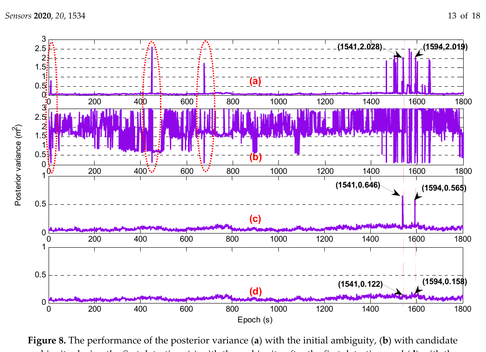
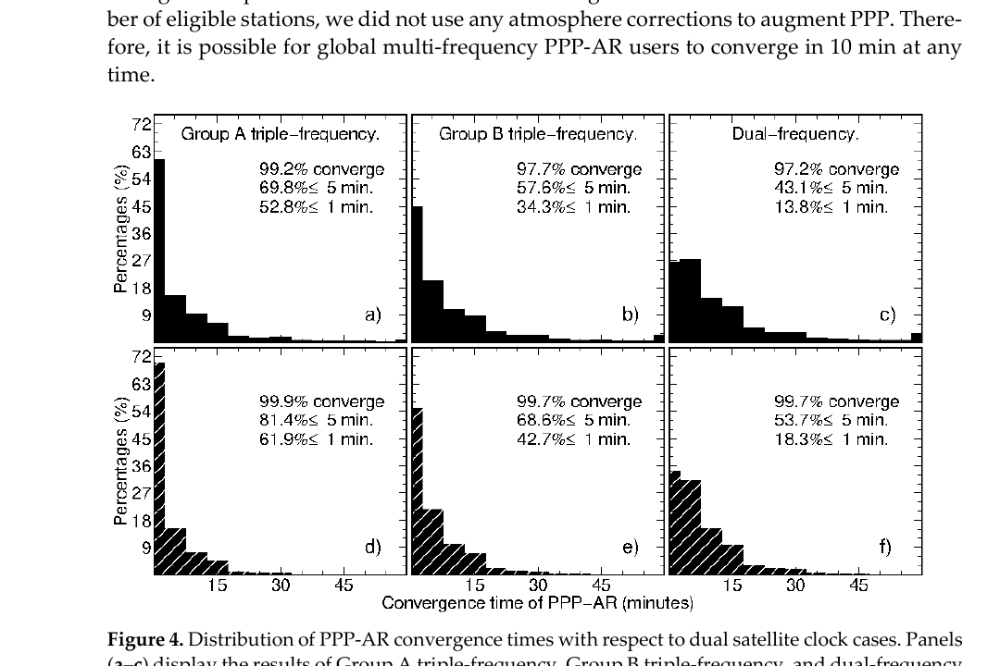
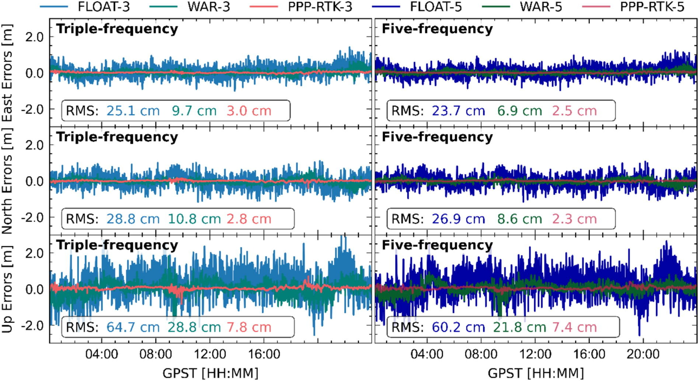

# 2026-09-02 GNSS 每日研究简报

## 今日快报

### 快报 1：LLM 两小时生成主动 GNSS L1 天线制造包，但所有射频指标仍只是仿真值

- 主题：`agentic-rf-gnss-l1-active-antenna`
- 来源 ID：`arxiv:2608.31006`
- 来源链接：https://arxiv.org/abs/2608.31006
- 发表日期：2026-08-31
- 来源类型：arXiv 预印本、主动 GNSS L1 天线与射频前端自动化设计案例
- 获取范围：完整预印本 4 页；CST/ADS/KiCad 工作流、规格表、设计复核与未实测边界已核对

**内容：** 作者让前沿 LLM 通过脚本操作 CST Studio Suite、Keysight ADS 与 KiCad，在一块双层板上联合设计右旋圆极化贴片、SAW 预滤波器和两级 LNA，并输出 ERC/DRC 通过的制造与装配文件。工程师仍负责规格、器件/材料取舍和视觉复核；例如初始 FR4 方案的仿真辐射效率只有 28%，改用 RO4350B 后为 78%。

**结论：** 表中最终仿真给出天线波束轴增益 5.15 dBic、轴比 2.46 dB、LNA 增益 36.9 dB、噪声系数 0.77 dB；完整流程约两小时。原型尚待制造和测量，所以这些数值不能当作实物验收、温漂、批差或有源天线抗干扰证据；论文证明的是脚本化设计闭环可行，而不是 LLM 已替代射频验证。

**关注理由：** GNSS 接收机性能从天线和前端就开始定界。若把几何、原理图、布局和仿真都变成可再生代码，设计审计会更容易；但最终仍必须用暗室方向图、噪声系数、线性度、带外阻塞和整机定位试验关门。

### 快报 2：超声不碰 GNSS，也能经“陀螺—估计器—控制器”把悬停点推偏约 1 m

- 主题：`ultrasonic-gyro-estimator-controller-uav-displacement`
- 来源 ID：`arxiv:2608.25319`
- 来源链接：https://arxiv.org/abs/2608.25319
- 发表日期：2026-08-28
- 来源类型：arXiv 预印本、无人机陀螺声学注入与闭环位移安全实验
- 获取范围：完整预印本 20 页（含附录）；81 次仿真、十余次飞行/台架实验、十种 IMU 与攻击边界已核对

**内容：** SonicNudge 不伪造位置，而是以相位门控的超声共振给陀螺注入带符号的低频混叠偏置；PX4 EKF 把它保留为滚转/俯仰误差，位置控制器再把错误姿态变成水平推力和新的悬停平衡点。室内使用 VICON 10 Hz 真值，室外使用 GNSS 5 Hz；主飞行试验把约 105 dB 的扬声器装在机体上以稳定声耦合。

**结论：** 一次约 100 s 的室内受控试验中，滚转偏置约 −5.5°、横向位移约 −1.1 m，且可通过改变门控符号反向推动；独立扬声器台架试验在十种无人机 IMU 上显示最高约 1.52 m 的位移响应。完全脱离、黑盒、跟踪移动目标的自由飞行攻击仍是未来工作，因此不能把贴身耦合结果外推成远距离普适威胁。

**关注理由：** PNT 安全不能只监测 GNSS 残差。完整威胁模型还要检查 IMU 频谱、EKF 偏置随机游走、姿态创新与控制器长期配平，否则低层小偏置会在闭环中放大成位置级后果。

### 快报 3：61 万对开放跨视角图像扩大了 GNSS 拒止定位训练域，也把“几米仍不够用”暴露出来

- 主题：`open-cross-view-localization-dataset`
- 来源 ID：`arxiv:2608.25274`
- 来源链接：https://arxiv.org/abs/2608.25274
- 发表日期：2026-08-25
- 来源类型：arXiv 预印本、开放跨视角绝对视觉定位数据集与基准
- 获取范围：完整预印本 22 页；617388 对图像、41 城市、姿态校正流程、许可与 Tables 3—6 已核对

**内容：** OpenCVL 汇集瑞典、波兰、挪威和荷兰 41 城市、超过 7000 km² 的 617388 对地面—航片图像，用高精度 ZOD 数据和更杂乱的 Mapillary 数据共同训练，并为跨区域、积雪和野外图像建立经几何校正与人工复核的测试集。数据源采用 CC BY-SA、CC BY 4.0 或相容开放条款，目标是让 GNSS 多路径严重时的跨视角定位能被长期复现。

**结论：** Loc² 在 OpenCVL 跨区域集上的平均/中位位置误差为 6.72/4.30 m，而只用 ZOD 训练为 7.55/4.50 m；在野外集为 7.90/6.19 m，作者明确称性能仍远未令人满意。用作者校正姿态微调的平均位置误差为 6.92 m，优于原始 GNSS 标签的 7.41 m；这是同一基准内的相对收益，不是车道级可用性证明。

**关注理由：** GNSS 拒止定位的数据问题不只是规模，还是真值质量、许可和跨域。工程验收应保留与原始 GNSS 标签、SfM 修正和独立真值的分层比较，并报告 180° 朝向混淆等长尾失败。

### 快报 4：Allan 方差不能直接塞进离散滤波器，先换成连续 PSD 再随采样周期传播

- 主题：`imu-allan-variance-kalman-tuning`
- 来源 ID：`arxiv:2608.21433`
- 来源链接：https://arxiv.org/abs/2608.21433
- 发表日期：2026-08-25
- 来源类型：arXiv 预印本、IMU Allan 方差到 Kalman 过程噪声的定参研究
- 获取范围：完整预印本 11 页；连续/离散推导、INS/GNSS、FAST-LIO2 与 OpenVINS 三组复算已核对

**内容：** 论文把 Allan 方差曲线中的角/速度随机游走和偏置不稳定性先映射到连续时间功率谱密度，再经状态转移传播到离散过程协方差，避免把“每根号小时”“每小时”规格和每历元协方差混用。作者在 KFGINS、退化场景 FAST-LIO2 与 OpenVINS 上用相同框架检查不同噪声倍率。

**结论：** KFGINS 配套数据中，标定式参数把 N/U/E 位置 RMSE 从 0.387/0.711/0.383 m 改为约 0.246/0.484/0.409 m；OpenVINS 单序列经顺序搜索从 1.483 m 降到 0.870 m。FAST-LIO2 不同序列有改善、退化乃至发散，说明定参不是“一组倍率通吃”；搜索仍使用被测序列，不能视为跨数据集泛化。

**关注理由：** GNSS/INS 失锁时的漂移包络高度依赖过程噪声的单位和离散化。代码审查应把传感器数据表、Allan 标定、采样频率、相关时间与实际 $`Q_d`$ 一一对齐，并用独立路线复核。

### 快报 5：农机 EKF 在仿真中跨过 20 s GNSS 中断，但 2.46 m 漂移和检测缺陷离下田还很远

- 主题：`paddy-tractor-gnss-outage-lidar-ekf`
- 来源 ID：`arxiv:2608.19004`
- 来源链接：https://arxiv.org/abs/2608.19004
- 发表日期：2026-08-19
- 来源类型：arXiv 预印本、稻田农机 GNSS/IMU/轮速/LiDAR/视觉集成仿真
- 获取范围：完整预印本 14 页；ROS 架构、60 s 仿真、20 s 人工断星、检测指标与已知故障已核对

**内容：** AgriNav 用 6 状态恒速转弯率 EKF 融合 1 Hz GNSS、50 Hz IMU 和 20 Hz 轮速，并以 AVAILABLE/DEGRADED/OUTAGE 状态机桥接断星；独立的 LiDAR 行检测与 EKF 给出作物行中心线，同时把行间区域回传给相机以减少检测范围。

**结论：** 60 s 仿真在 15—35 s 切断 GNSS，滤波连续输出，但中断末位置漂移为 2.46 m；LiDAR 行检测置信度保持大于 0.9，ROI 计算量减少 30%—50% 只是估算。作者还报告跨数据集 mAP 低于 1%、轻量模型杂草 AP 为 0，并明确所有结果来自仿真或离线数据；这不是可部署农机的性能证书。

**关注理由：** 真实冠层下 GNSS 退化是渐变、间歇且与多路径相关，远比硬切信号复杂。下一步应先用真实稻田日志标定漂移包络、相机—LiDAR 外参和误喷安全目标，再谈自主喷洒。

## 深度研读

### 深读 1｜接收机工程｜超宽巷很长也会定错：用第二候选和后验方差给单历元整数再过一关

- 类别：`receiver-engineering`
- 学习层级：`foundation`
- 选题定位：`经典基础`
- 来源 ID：`doi:10.3390/s20051534`
- 来源链接：https://doi.org/10.3390/s20051534
- 发表日期：2020-03-10
- 来源类型：Sensors 同行评审开放论文、BDS 三频单历元超宽巷模糊度验证
- 获取范围：CC BY 4.0 出版全文；六条 40—175 km 基线、Figures 1—11 与 Tables 1—2
- 价值评分：98/100（相关性 20，经典价值 19，证据 20，教学价值 20，工程价值 19）

#### 为什么先学这个

多频 PPP-AR 和 PPP-RTK 都从“容易固定”的超宽巷/宽巷往窄巷推进。第一层整数若错，后续更精细的模型只会把错误传得更深；所以先理解长波长为何仍会受码噪声和电离层偏差推过半周边界，以及怎样在同一历元验证它。

#### 先修知识

需要理解载波相位、伪距、双差、线性组合、整数舍入、超宽巷/宽巷/窄巷、首阶电离层频散、最小二乘残差、后验方差与错误检测。

#### 一句话逻辑

先对 6.37 m 的 BDS 三频超宽巷整数舍入；若某星标准化残差异常，就把它改成相邻的第二候选，比较两套整数下的后验方差，并保留更小者。

#### 研究问题与约束

论文以 BDS B1/B2/B3、1 Hz、15° 截止角测试中国两套 CORS 的六条 40—175 km 基线。方法假设一个历元通常只有一到两颗星整数错误；长基线活跃电离层会让正确候选的残差反而更大，因此结果不覆盖多星同时错和任意电离层状态。

#### 核心方法论

先用 $`(0,-1,1)`$ 组合固定约 4.48 m 超宽巷，再解 $`(1,4,-5)`$、约 6.37 m 的第二超宽巷。初值按浮点数舍入；把固定整数放进相对定位模型并估双差电离层，对最大标准化残差所在卫星构造相邻整数候选。两套模型分别重算后验方差，必要时逐星重复，直至无异常或达到停止条件。

#### 关键公式逐步推导

对第二超宽巷，几何无关浮点整数可概括为：

```math
\hat N_{(1,4,-5)}=
\frac{\Delta\Phi_{(1,4,-5)}-\Delta P_{(i,j,k)}
+\beta_I\Delta I}{\lambda_{(1,4,-5)}}.
```

舍入正确等价于浮点误差落在半周内；若误差近似 $`\mathcal N(\delta,\sigma^2)`$，成功率为：

```math
P_s=\int_{-0.5}^{0.5}
\frac{1}{\sigma\sqrt{2\pi}}
\exp\!\left[-\frac{(x-\delta)^2}{2\sigma^2}\right]dx.
```

候选 $`N^{(0)}`$ 与相邻 $`N^{(1)}`$ 分别进入最小二乘模型，比较：

```math
\hat\sigma_0^2=\frac{v_0^TPv_0}{n-u},\qquad
\hat\sigma_1^2=\frac{v_1^TPv_1}{n-u},
```

选择后验方差较小者。长波长缩小了 $`\sigma/\lambda`$，但不会消除系统偏差 $`\delta/\lambda`$。

#### 经典价值与创新边界

经典价值是把“长波长所以可舍入”拆成可验证的概率条件，并把错误整数看作观测粗差，用现有最小二乘诊断工具纠正。创新边界是第二候选只取相邻整数、残差仍可能被大气与噪声抵消；它不是固定失败率保证，也没有处理大量同时错误。

#### 整体逻辑链

构造三频双差组合；固定第一超宽巷；舍入第二超宽巷；回代估计基线与电离层；计算标准化残差；定位最可疑卫星；生成相邻候选；比较后验方差；逐步复查；用不同长度基线统计正确固定率。

#### 原文图表与结果分析



> 图表源：Deng 等《Extra-Wide Lane Ambiguity Resolution and Validation for a Single Epoch Based on the Triple-Frequency BeiDou Navigation Satellite System》Figure 8，[DOI 原文](https://doi.org/10.3390/s20051534)，CC BY 4.0。由出版社 PDF 第 13 页以 180 dpi 渲染后，仅裁出原图与图号；未重绘、改色或修改坐标、标注和数据。

横轴为 1800 个 1 s 历元，纵轴为后验方差（m²）。(a) 初始整数在多个错误历元出现约 2—3 m² 峰值；(b) 相邻候选整体不一定更好；第一次纠正后的 (c) 只剩 1541、1594 历元 0.646/0.565 m² 尖峰，第二次逐星纠正后的 (d) 降为 0.122/0.158 m²。图直接显示 66 km 数据中的诊断过程，不能证明任何大气条件下最小方差候选必为真整数。

#### 原文结果论述

66 km、1800 历元试验中，初始正确率 98.5%，27 个错误历元经逐步复核后在该数据上全部纠正。六基线统计中，40—70 km 的四条基线复核后达到 100%；104 km 与 175 km 的结果由约 96.8%/98.4% 提升到约 98.8%/99.7%。论文摘要、结论与 Table 2 的末两位有轻微排版差异，因此这里只保留一位小数量级，不制造虚假精度。

#### 常见误区与适用边界

第一，把 6 m 波长当作零错误。第二，忽略码噪声经组合放大。第三，把最小后验方差当真值保证。第四，残差门限被真实大气偏差污染。第五，多颗星同时错仍逐个修。第六，把中长基线结果外推到低纬强梯度。第七，固定成功率不区分漏检与误纠。

#### 工程实现步骤

1. 明确每个线性组合的系数、有效波长、噪声尺度和电离层尺度。
2. 对第一、第二超宽巷分别维护浮点值与整数状态。
3. 先舍入，再用完整权阵回代基线和双差电离层。
4. 计算标准化残差并记录最大贡献卫星。
5. 只在物理可行范围生成相邻候选，逐个重算后验方差。
6. 设置最大纠正星数与保守回退，超过即不固定。
7. 按基线、大气、星数和参考星切换分层统计误固定。
8. 通过后才把超宽巷约束传给下一层宽巷/窄巷。

#### 复现实验设计

选 10/50/100/200 km 四档 BDS/Galileo 三频基线，各取平静与扰动电离层 20×30 min、1 Hz。比较直接舍入、固定 ratio、论文后验方差复核和多假设搜索；注入一至四颗星 ±1 周错误。指标为正确固定率、漏检、误纠、单历元算时和固定后 ENU 99.9% 误差；失败场景加入 1 m 相关码多路径、参考星切换与 5 cm 电离层梯度失配。

#### 与定位及低成本实现的联系

这一步不直接给出绝对位置，而是把可疑的第一层整数挡在级联定整之外。低成本接收机码噪声更大，尤其需要记录组合噪声和回退状态；下一节进一步说明，即使超宽巷正确，多频 PPP 还要处理频率特有偏差与窄巷收敛。

#### 本节小结

超宽巷的优势是半周容差大，不是不会错；单历元验证必须同时看候选、权阵和大气失配，并在多星错误时敢于返回浮点。

### 深读 2｜接收机工程｜频点越多不一定越快：先选低噪声频差，再给第三频点单独记偏差账

- 类别：`receiver-engineering`
- 学习层级：`intermediate`
- 选题定位：`基础进阶`
- 来源 ID：`doi:10.3390/rs13234746`
- 来源链接：https://doi.org/10.3390/rs13234746
- 发表日期：2021-11-23
- 来源类型：Remote Sensing 同行评审开放论文、Galileo/BDS-3 多频 PPP 模糊度固定
- 获取范围：CC BY 4.0 出版全文；22 站一个月静态数据、一次 2 h 车载试验、Figures 1—8 与 Tables 1—5
- 价值评分：99/100（相关性 20，经典价值 19，证据 20，教学价值 20，工程价值 20）

#### 为什么先学这个

上一节只保证第一层超宽巷更可信。进入 PPP 后，未差模糊度还吸收卫星/接收机相位偏差，第三频点可能与传统 L1/L2 钟产品不一致；若只数频点而不算组合噪声和 IFCB，更多观测反而会拖慢窄巷固定。

#### 先修知识

需要理解未差未组合 PPP、卫星/接收机钟、首阶电离层、UPD/相位偏差、IFCB、宽巷/窄巷、LAMBDA、ratio test、部分固定、收敛时间和卫星数。

#### 一句话逻辑

先用低噪声的 E1/E5a/E6 与 B1C/B2a/B3I 形成超宽巷/宽巷，再估第三频点的附加卫星钟吸收频率特有偏差，最后由固定宽巷约束窄巷，缩短 PPP-AR 收敛。

#### 研究问题与约束

静态试验处理 2020 年 DOY 181—211、22 站、30 s 数据；18 站生成卫星钟/相位偏差，10 站评估 PPP，部分站角色重叠。车载试验只有武汉开阔道路约 2 h、30 s，前 30 min 静止，短基线解作参考；这不是城市连续实时服务，也没有独立非 GNSS 真值。

#### 核心方法论

在传统双频重参数化基础上，为第三及以上频点保留接收机常数；对有时变 IFCB 的第三频点再估一套卫星钟。参考网从浮点模糊度小数部分生成相位偏差产品。用户先把原始三频模糊度变换为超宽巷/宽巷并通过 LAMBDA+ratio 固定，再构造窄巷；部分固定最多剔除四个模糊度、至少保留四个。

#### 关键公式逐步推导

三频单差浮点模糊度先变换为两条长波长：

```math
\begin{bmatrix}
\widetilde N_{EWL}\\[2pt]\widetilde N_{WL}
\end{bmatrix}
=
\begin{bmatrix}
0&1&-1\\1&-1&0
\end{bmatrix}
\begin{bmatrix}
\widetilde N_1\\\widetilde N_2\\\widetilde N_3
\end{bmatrix}.
```

第三频点观测模型额外保留频率特有卫星钟 $`\widetilde t_3^s`$：

```math
P_3=\rho+c\widetilde t_r-c\widetilde t^s-c\widetilde t_3^s
+\gamma_3 I+h_3+\varepsilon_P,
```

```math
\Phi_3=\rho+c\widetilde t_r-c\widetilde t^s-c\widetilde t_3^s
-\gamma_3 I+\lambda_3\widetilde N_3+\varepsilon_\Phi.
```

相位偏差改正后依次固定 EWL、WL，再以已固定宽巷约束短波长窄巷；“多频收益”必须扣除组合噪声放大。

#### 经典价值与创新边界

价值在于把多频收益拆成波长、噪声、卫星几何和频率特有偏差四本账，而不是把第三频点视为免费信息。第二卫星钟能吸收 IFCB 和部分天线 PCO 残差，但不是物理辨识；小区域参考网的吸收效果不能自动推广到全球产品。

#### 整体逻辑链

重参数化原始观测；生成双钟/相位偏差产品；比较频点组合噪声；固定 EWL/WL；形成无模糊宽巷；估窄巷；LAMBDA 与部分固定；统计不同卫星数的收敛分布；以车载断弧检查动态边界。

#### 原文图表与结果分析



> 图表源：Guo 等《Assessment of Multi-Frequency PPP Ambiguity Resolution Using Galileo and BeiDou-3 Signals》Figure 4，[DOI 原文](https://doi.org/10.3390/rs13234746)，CC BY 4.0。由出版社 PDF 第 11 页以 180 dpi 渲染，仅裁出原图、邻近说明与图号；未重绘、改色或修改坐标、图例和数据。

横轴为 PPP-AR 收敛时间（min），纵轴为样本比例（%）；上排是全部解，下排只保留多于 10 颗卫星的解。低噪 Group A 的 ≤1 min 比例由全样本 52.8% 升至 61.9%，Group B 为 34.3%/42.7%，双频为 13.8%/18.3%；卫星多时三种方案都更快。图不能分离频点、几何和参考网产品质量的独立贡献。

#### 原文结果论述

论文给出的噪声放大因子为 Galileo E1/E5a/E6 67.03、BDS-3 B1C/B2a/B3I 71.23，而 E1/E5a/E5b 或 B1C/B2a/B2b 为 172.29。一个月结果中，Group A 三频 PPP-AR 平均约 5.6 min，较 Group B 和双频分别缩短约 36% 与 55%；多于 10 星时平均约 3 min。车载从静止开始需 14/19 min，直接从运动段初始化则约 33/37.5 min，暴露断弧与动态几何限制。

#### 常见误区与适用边界

第一，以频点数代替有效信息。第二，忽略第三频点 IFCB/PCO。第三，把第二卫星钟当唯一物理偏差。第四，用同网产品与用户站高估独立性。第五，把 30 s 开阔车载当实时城市。第六，只报平均收敛，不报失败解按 60 min 计入的规则。第七，ratio 通过即假定窄巷正确。

#### 工程实现步骤

1. 按星座列出全部频点、有效波长与组合噪声放大因子。
2. 校准多频天线 PCO/PCV，并监测第三频点时变钟差。
3. 用独立参考站生成相位偏差与附加钟产品。
4. 依 EWL→WL→NL 顺序固定，每层保存候选和验证统计。
5. 对频繁断弧重新初始化，不跨弧保持整数。
6. 以卫星数、PDOP、信号组合和接收机类型分层收敛。
7. 同时报告成功率、错误固定、95% 收敛时间和算时。
8. 产品异常时回退到双频/浮点，并禁止错误 hold。

#### 复现实验设计

选择 30 个全球 MGEX 站与两条城市车辆路线，1/5/30 s 三种采样；比较双频 PPP-AR、Group A、Group B、无第二钟和完整偏差模型。基线指标为 EWL/WL/NL 正确固定率、1/5/10 min 收敛比例、ENU 95/99.9%、断弧重收敛和产品带宽。失败场景加入第三频点 5 mm 周期偏差、PCO 错 2 cm、10 s 产品延迟和少于 7 星。

#### 与定位及低成本实现的联系

本节仍依赖时间积累和精密产品，动态断弧时收敛可超过半小时。下一节用区域电离层/对流层约束加强单历元模型，使每个历元独立求解，代价是必须把改正误差和参考网间距带入权阵。

#### 本节小结

多频 PPP-AR 的关键不是“多一个频点”，而是选择长波长低噪组合并校准频率特有偏差；几何、断弧和产品一致性决定理论收益能否兑现。

### 深读 3｜定位｜单历元 PPP-RTK 不等上一历元：用区域大气约束把每个历元独立推到厘米—分米级

- 类别：`positioning`
- 学习层级：`advanced`
- 选题定位：`定位深入`
- 来源 ID：`doi:10.1016/j.asr.2026.05.054`
- 来源链接：https://doi.org/10.1016/j.asr.2026.05.054
- 发表日期：2026-07-15
- 来源类型：Advances in Space Research 同行评审开放论文、多频多系统单历元纯 GNSS PPP-RTK
- 获取范围：CC BY 4.0 出版全文；93 站服务端产品、三套 CORS 网 8 d 静态评估、真实车辆试验、Figures 1—13 与 Tables 1—6
- 价值评分：99/100（相关性 20，经典价值 19，证据 20，教学价值 20，工程价值 20）

#### 为什么先学这个

上一节靠多历元把窄巷慢慢收紧，车辆断星就要重来。若应用要求每个历元独立可用，就必须用服务器相位偏差和区域大气改正替代时间记忆；这把问题从“等多久”变成“改正有多准、权重是否诚实”。

#### 先修知识

需要理解未组合 PPP、UPD/IFCB、EWL/WL 级联定整、区域电离层插值、ZWD、随机约束、逆距离加权、单历元最小二乘、CORS 网距与 ENU RMS。

#### 一句话逻辑

每个历元重新初始化：先用多频观测固定 EWL/WL，再把三参考站插值的斜电离层与 ZWD 连同方差作为伪观测，压低位置—大气—模糊度相关性，得到 PPP-RTK 解。

#### 研究问题与约束

服务器用 2024 DOY 63—70 的 93 个 MGEX 站生成 GPS/Galileo/BDS-3 UPD 与 IFCB；用户评估 NOAA、EPN、GA 三网，平均站距约 44.9、150.1、71.4 km，30 s、10° 截止角。静态参考坐标来自一日收敛 PPP，车辆参考仍是 GNSS 处理链；它不是独立全站仪/惯导真值，也未证明城市峡谷连续可用。

#### 核心方法论

六方案按三频/五频与 FLOAT、WAR、PPP-RTK 组合。所有参数每历元重置，不使用状态预测；FLOAT 不定整，WAR 固定 EWL/WL，PPP-RTK 再增加区域电离层与 ZWD 约束。电离层由周边站逆距离加权，ZWD 以高度指数函数拟合；约束强度随用户到参考网中心距离调整。

#### 关键公式逐步推导

未组合观测保留每频点电离层尺度和整数：

```math
P_i=\rho+c\delta t_r+\gamma_i I_1+mZWD+ISB+IFB_i+\varepsilon_i,
```

```math
L_i=\rho+c\delta t_r-\gamma_i I_1+mZWD
+\lambda_iN_i+IFCB_i+\xi_i.
```

服务器给出的区域大气改正不作为常数硬套，而写成带方差伪观测：

```math
I_1-I_1^{corr}=w_I,\quad w_I\sim\mathcal N(0,\sigma_I^2),
```

```math
ZWD-ZWD^{corr}=w_T,\quad w_T\sim\mathcal N(0,\sigma_T^2).
```

于是法方程同时吸收原始码相和大气约束；若 $`\sigma_I,\sigma_T`$ 低估，厘米解会显得过度自信并增加错误固定风险。

#### 经典价值与创新边界

价值在于把多频级联定整、区域大气与完全单历元估计放进同一可比较框架，并同时验证三频/五频、静态/车辆和三种网距。边界是服务端产品、参考网与用户处理同源；“单历元抗周跳”只是不跨历元保持状态，不代表多路径、偏差或错误整数消失。

#### 整体逻辑链

服务器估轨钟/UPD/IFCB；参考站估电离层和 ZWD；区域插值并传播方差；用户逐历元建未组合模型；级联固定 EWL/WL；加入大气伪观测；独立解位置；比较 FLOAT/WAR/PPP-RTK 与三频/五频；用静态网和车辆评估。

#### 原文图表与结果分析



> 图表源：Li 等《Single-epoch PPP-RTK with multi-frequency multi-constellation: reliable and instantaneous centimeter-level user positioning》Figure 8，[DOI 原文](https://doi.org/10.1016/j.asr.2026.05.054)，CC BY 4.0。下载出版社高分辨率 JPEG（1896×1037）并无损转为 PNG；未裁剪、重绘、改色或修改坐标、图例和数据。

横轴为 GPST 时刻，三行是东、北、天误差（m），左/右为三频/五频；浅蓝/深蓝 FLOAT 波动最大，绿线 WAR 收紧，红/粉 PPP-RTK 最靠近零。COPR 当日三频 FLOAT/WAR/PPP-RTK 的 E RMS 为 25.1/9.7/3.0 cm，U 为 64.7/28.8/7.8 cm；五频 PPP-RTK 为 2.5/2.3/7.4 cm。图只代表一站一天，且红线仍有相关变化，不能证明所有历元都正确固定。

#### 原文结果论述

三网插值 ZWD 误差在 1 cm 内；电离层误差随网距变化，约 150 km 的 EPN 为 4.5 cm，其他两网低于 4.0 cm。全部静态站三频 PPP-RTK E/N/U RMS 为 4.2/4.7/10.1 cm，WL 固定成功率由 WAR 的 96.9% 提升到 99.0%。车辆三频由 FLOAT 的 84.3/56.8/33.8 cm 降到 9.1/8.6/18.5 cm；五频 PPP-RTK 为 8.4/7.8/18.1 cm。均为作者处理链结果。

#### 常见误区与适用边界

第一，把单历元当无服务端依赖。第二，把大气改正当无误差常数。第三，只报 RMS，不报错误固定尾部。第四，以 PPP 静态坐标当绝对真值。第五，把开阔车辆外推到城市峡谷。第六，认为五频必然优于三频而忽略接收机偏差。第七，把不做周跳检测误解为不怕断星。第八，忽略 30 s 产品节拍与延迟。

#### 工程实现步骤

1. 服务器统一轨钟、码偏差、UPD、IFCB 与天线参考框架。
2. 每参考站估斜电离层和 ZWD，并做空间/时间质控。
3. 向用户广播改正值、方差、龄期和支持区域。
4. 用户每历元独立初始化，按信号可用性选三频/五频组合。
5. 级联固定 EWL/WL，并记录每层成功率与候选距离。
6. 以伪观测方式加入大气改正，方差随网距和龄期膨胀。
7. 通过残差、保护级或外部一致性门后才输出固定解。
8. 产品缺失或网络外推时回退 WAR/FLOAT，不延用旧厘米状态。

#### 复现实验设计

搭建 50/100/150/250 km 四档参考网，采 10 个静态站与三条开阔/郊区/城市车辆路线各 2 h、1 Hz。比较 FLOAT-3/5、WAR-3/5、PPP-RTK-3/5；扫描电离层约束 2/5/10 cm、产品延迟 0/5/30 s。指标为正确 WL 固定率、水平/垂直 95/99.9%、单历元可用率、保护级覆盖和 CPU；失败场景加入 20 cm 梯度异常、第三频点偏差、共同 NLOS 与参考网外推。

#### 与定位及低成本实现的联系

这是纯 GNSS 定位：外部信息仍来自 GNSS 参考网，没有 IMU、相机或地图进入用户位置解。低成本设备若能稳定输出三频/五频相位，可免去长时间滤波记忆；但码噪声、天线偏差和服务订阅带宽会决定实际收益。

#### 本节小结

单历元 PPP-RTK 用空间网络信息换取时间收敛；它最重要的不是“每历元厘米”，而是把改正误差、候选可靠性和回退条件一并显式化。
