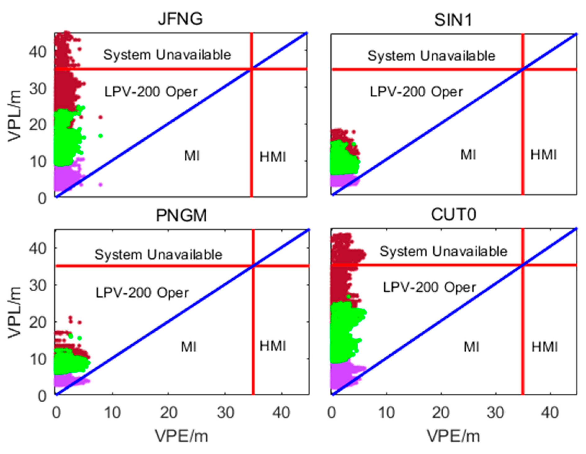
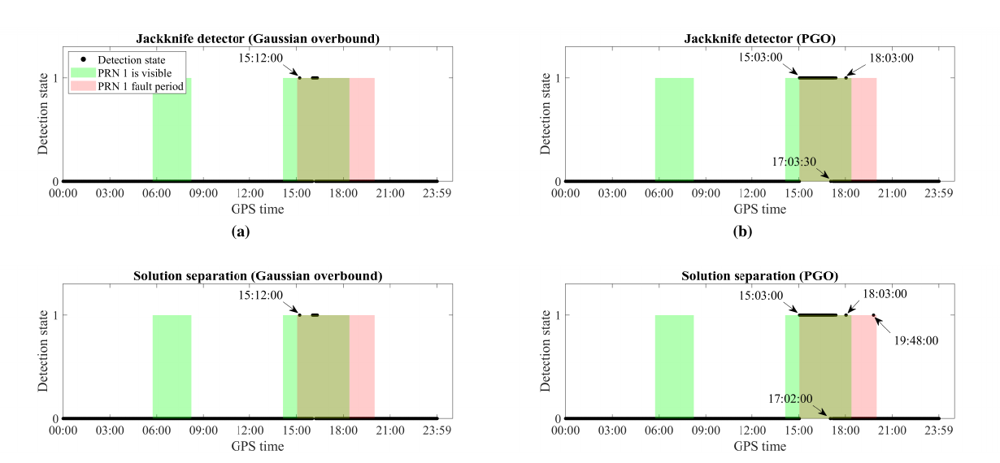
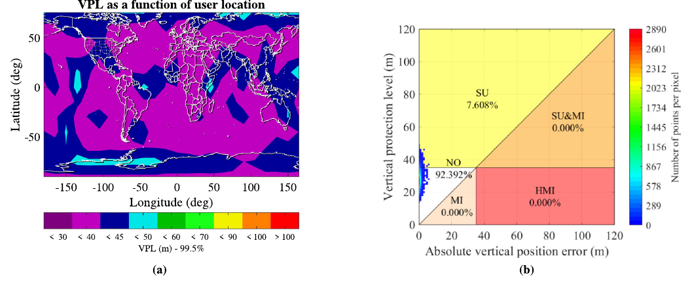

# 2026-09-03 GNSS 每日研究简报

## 今日快报

### 快报 1：双天线 RTK 不只给坐标，还给低速覆盖机器人的可观航向

- 主题：`dual-antenna-rtk-outdoor-coverage-robot`
- 来源 ID：`arxiv:2609.01384`
- 来源链接：https://arxiv.org/abs/2609.01384
- 发表日期：2026-09-01
- 来源类型：arXiv 预印本、ROS 2 室外覆盖机器人系统与五处外场试验
- 获取范围：完整预印本 15 页；定位架构、规划参数、五处场地指标与结论均已核对

**内容：** 系统把双天线 RTK-GNSS、轮速里程计和 12 状态 EKF 组合起来，用逐传感器 Mahalanobis 门控拒绝异常观测；双天线直接提供航向，GNSS 间歇退化时再由运动方向回退。规划侧在 Fields2Cover 上增加共线重采样、障碍感知连接和障碍聚类，任务侧用 Nav2 行为树管理恢复与自动回充。

**结论：** 五个形状、面积和障碍布局不同的真实室外区域均完成覆盖路线，实际扫过计划区域的 93.1%—96.1%；最大场地离线规划仍在秒级。结果证明的是一套单机器人系统集成在这些场地可行，不是 RTK 精度的独立计量，也未给出长时间 GNSS 完全中断下的漂移上界。

**关注理由：** 慢速、频繁转弯时，单天线“由速度推航向”最不可靠。把双天线基线、观测门控和无航向回退逻辑一起设计，比只升级路径规划器更能解释室外机器人为何能持续执行。

### 快报 2：公路 ADAS 测试里 RTK 只覆盖 2.3%，真值可用率本身就是结论

- 主题：`public-road-adas-lidar-rtk-reference-availability`
- 来源 ID：`arxiv:2608.26669`
- 来源链接：https://arxiv.org/abs/2608.26669
- 发表日期：2026-08-27
- 来源类型：arXiv 预印本、欧盟联合研究中心公共道路辅助变道合规实测
- 获取范围：完整预印本 11 页；A31 高速公路试验矩阵、RTK 参考范围、测量不确定度与结果已核对

**内容：** 两辆车在法国 A31 高速公路以 100—130 km/h、20—60 m 触发距离执行 27 次辅助变道；车载 LiDAR 跟踪前车，双车 RTK-GNSS 只在同时整数固定的片段上标定 LiDAR 位置和速度精度，再把实测轨迹与 UNECE R79 临界距离比较。

**结论：** 27 次中 18 次完成、9 次被抑制；6 次完成动作在变道开始时短于 R79 临界距离，其中 3 次计入空间和 1 s 人工时间标注不确定度后仍达到作者所称的 99% 置信。双车同时 RTK 固定只占记录的 2.3%，据此标定的 LiDAR 位置标准差为 0.83 m、速度标准差为 1.40 km/h；样本仅一款车辆，不能外推到整个车队或宣称违规。

**关注理由：** 高精度真值不是“装了 RTK 就一直存在”。道路评价必须同时报告整数固定占比、同步和事件标注分辨率，否则厘米级设备名称会掩盖真正可用的参考数据只有很小一段。

### 快报 3：水下吸附动作也能当定位因子，把“碰到同一目标”变成隐式回环

- 主题：`underwater-contact-aided-factor-graph-localization`
- 来源 ID：`arxiv:2608.26932`
- 来源链接：https://arxiv.org/abs/2608.26932
- 发表日期：2026-08-27
- 来源类型：arXiv 预印本、水下接触辅助因子图定位仿真与水池/港池试验
- 获取范围：完整预印本 9 页；传感器、iSAM2 因子图、两水池、Stonefish 仿真和港池结果已核对

**内容：** AUV 融合 IMU、DVL、压力计、磁力计、向下单目视觉和目标检测；视觉因子按内点统计放大不确定度，吸盘接触同一底栖目标时加入高置信几何因子，使物理交互成为不依赖外观重识别的回环。后端使用 iSAM2，并在有/无地标窗口间切换。

**结论：** 港池试验全局 ATE 为 0.8223 m、航向 RMSE 为 0.2121 rad；目标重访距离由无地标的 1.23 m 降到有视觉地标的 1.12 m，再降到加入吸附接触的 0.90 m。第二水池相应为 0.58/0.50/0.45 m。真值与环境规模有限，接触改善重访一致性并不等于获得全球绝对坐标。

**关注理由：** GNSS 拒止定位常把“接触”只当任务结果，这篇工作把它变成可量化观测。其工程启示是：任何可重复、几何明确的操作事件都可能比弱纹理图像更适合约束长期漂移。

### 快报 4：磁导航前先把平台磁场剥干净，多传感器卡尔曼融合把 359.2 nT 压到 12.3 nT

- 主题：`mapless-multisensor-aeromagnetic-compensation`
- 来源 ID：`arxiv:2608.26525`
- 来源链接：https://arxiv.org/abs/2608.26525
- 发表日期：2026-08-27
- 来源类型：arXiv 预印本、公开 DAF-MIT MagNav 飞行数据上的航空磁补偿
- 获取范围：完整预印本 16 页；18 参数 Tolles–Lawson 模型、两阶段估计、15 条评估航线与附表已核对

**内容：** 第一阶段用包含传感器偏置的增广线性模型估计平台永久、感应和涡流磁干扰参数，避免传统带通滤波丢掉直流信息；第二阶段以无地图卡尔曼融合同时估计动态外部磁场和三路磁传感器补偿，不依赖 IGRF、异常地图或外部位置反馈。

**结论：** 在公开飞行数据上，传统 Tolles–Lawson、多传感器增广标定和最终融合的总平均 RMSE 分别为 359.2、58.0 和 12.3 nT。作者同时指出离线参数会随时间漂移，现有结果还需在线标定；这是磁场估计误差，不是米级导航误差，也没有完成地图匹配定位闭环。

**关注理由：** GNSS 拒止的磁导航常把地图匹配当主角，但若机体自身磁干扰仍是百 nT 量级，匹配算法再复杂也会输入错误。先把传感器与平台误差闭合，才有资格讨论位置性能。

### 快报 5：高空俯视单目 SLAM 能不断轨，却可能在公里尺度持续变形

- 主题：`high-altitude-nadir-monocular-slam-benchmark`
- 来源 ID：`arxiv:2608.18632`
- 来源链接：https://arxiv.org/abs/2608.18632
- 发表日期：2026-08-24
- 来源类型：arXiv 预印本、高空俯视 UAV 五种单目 SLAM 基准评测
- 获取范围：完整预印本 9 页；五条 DJI、222 km 合成城市航迹、MARS-LVIG/ALTO 与资源开销已核对

**内容：** 作者统一比较 DPVO、DROID-SLAM、MASt3R-SLAM、ORB-SLAM3 和 VGGT-SLAM 2.0，仅输入单目 RGB，不使用 GNSS 或惯导辅助；数据从 110—120 m 的消费级 DJI 航迹扩展到 150—800 m、总计 222 km 的 Google Earth Studio 城市轨迹及长程公开集。

**结论：** 五条 DJI 数据中 MASt3R-SLAM 的平均水平 MAE 最低，为参考路径长度的 0.53%；全部完成运行汇总中 DROID-SLAM 最低，为 2.88%。但 34 个已完成的 GES/ALTO 运行有 29 个垂向 RMSE 超过 100 m，GES 多数水平误差为 1.11—3.84 km；参考真值混合机载非 RTK GNSS 与合成轨迹，不能把比例误差直接当绝对精度认证。

**关注理由：** “没有跟踪失败”不等于导航可用。高空近似平面场景需要把局部连续性、全局形变、垂向可观测性和闭环误匹配分开统计，并预留绝对定位或高度约束。

## 深度研读

### 深读 1｜接收机工程｜非高斯误差不能假装成普通高斯：先在位置域给尾部画一条可信外包络

- 类别：`receiver-engineering`
- 学习层级：`foundation`
- 选题定位：`经典基础`
- 来源 ID：`doi:10.3390/rs12121992`
- 来源链接：https://doi.org/10.3390/rs12121992
- 发表日期：2020-06-21
- 来源类型：Remote Sensing 同行评审开放论文、GPS/BDS ARAIM 位置域非高斯包络
- 获取范围：CC BY 4.0 出版全文；全球仿真、四站真实数据、Figures 1—7 与 Tables 1—3
- 价值评分：98/100（相关性 20，经典价值 19，证据 20，教学价值 20，工程价值 19）

#### 为什么先学这个

完整性不是“误差通常很小”，而是以预定风险约束保证保护级包住位置误差。多路径、电离层和相关接收机误差会形成偏斜或重尾；若仍把经验标准差塞进高斯模型，保护级可能漏包，若把高斯方差无限放大，又会让系统几乎总是不可用。

#### 先修知识

需要理解加权最小二乘、观测权阵、误差 CDF、线性误差传播、MHSS/ARAIM、垂直位置误差 VPE、垂直保护级 VPL、垂直告警限 VAL，以及完整性、连续性和可用性的区别。

#### 一句话逻辑

把高斯、独立非高斯和星间相关非高斯误差分别投影到位置域，以绝对敏感度求一个无需反复卷积的高斯型上界，再用连续性要求限制膨胀因子不能过度保守。

#### 研究问题与约束

论文面向 GPS/BDS 双星座 LPV-200 型垂向监测，设完整性风险 $`10^{-7}`$、连续性风险 $`2\times10^{-6}`$、VAL 35 m，并以全球几何仿真和 JFNG、SIN1、PNGM、CUT0 四站真实数据比较不包络 NARAIM、成对 CDF 包络 PB-ARAIM 与位置域 PDM-ARAIM。它不是认证实现，真实站结果也没有注入已知硬件故障。

#### 核心方法论

观测误差拆成高斯项、逐星非高斯项和星间相关非高斯项；由位置解第 $`z`$ 行敏感度 $`S_z`$ 将方差和协方差传播到位置域。独立高斯部分按平方和合成，非高斯部分用绝对值线性相加形成保守上界，并检查实际膨胀因子没有越过由连续性风险导出的上限。

#### 关键公式逐步推导

位置域实际标准差包含相关项：

```math
\sigma_a^2=\sum_n S_{z,n}^2\sigma_{g,n}^2
+\sum_n S_{z,n}^2\sigma_{ng,n}^2
+2\sum_{n<m}S_{z,n}S_{z,m}\sigma_{ng,mn}\sigma_{ng,nm}.
```

由三角不等式构造无需多次卷积的上界：

```math
\sigma_a\le \sigma_o=
\sqrt{\sum_n S_{z,n}^2\sigma_{g,n}^2}
+\sum_n|S_{z,n}\sigma_{ng,n}|.
```

对每个故障假设 $`i`$，保护级写成：

```math
VPL_o=\max_i\left(K_{HMI,i}\sigma_{o,i}+B_{v,i}+M_{o,i}\right).
```

$`K_{HMI,i}`$ 分配尾部风险，$`B_{v,i}`$ 表示名义偏差影响，$`M_{o,i}`$ 为预测项；上界若过宽仍须接受连续性检查。

#### 经典价值与创新边界

经典价值是清楚展示“安全包络”和“统计拟合”不是一回事，并把相关误差与连续性代价放进同一位置域。创新边界在于误差分解、相关结构和风险参数必须由足够数据验证；由有限样本得到零误导事件，不能证明真实风险恰为零。

#### 整体逻辑链

识别非高斯与相关误差；分解误差源；经解算敏感度投影到位置域；用绝对和构造外包络；为每个 MHSS 假设计算 VPL；以完整性风险约束下界、连续性约束上界；最后用全球几何和四站数据对照三种方法。

#### 原文图表与结果分析



> 图表源：Zhao 等《Position-Domain Non-Gaussian Error Overbounding for ARAIM》Figure 6，[DOI 原文](https://doi.org/10.3390/rs12121992)，CC BY 4.0。下载出版页面提供的 2799×2174 原始 PNG；未裁剪、重绘、改色或修改坐标、图例和数据。

四个子图横轴是 VPE（m），纵轴是 VPL（m），红线是 35 m VAL，蓝色对角线是 $`VPL=VPE`$。紫色 NARAIM 点在部分站落到对角线下方，表示保护级没有包住误差；棕色 PB-ARAIM 与绿色 PDM-ARAIM 未出现该类点。图能直接说明样本内包络与可用区分布，不能把“未观察到 HMI”外推成 $`10^{-7}`$ 风险已由实测频率证明。

#### 原文结果论述

全球仿真在星故障先验 $`10^{-5}`$ 时，PB-ARAIM/PDM-ARAIM 的平均 99.5% VPL 为 20.67/16.62 m，可用率为 96.06%/99.99%；把先验提高到 $`10^{-3}`$ 后分别为 24.16/18.96 m 与 82.53%/98.89%。四站真实数据中 NARAIM 的样本内 MI 比例为 0.36%—1.65%；两种包络法均为 0，但 PB-ARAIM 在 JFNG/CUT0 的可用率仅 96.41%/95.72%，PDM-ARAIM 为 99.99%/100%。

#### 常见误区与适用边界

第一，把拟合得像当作尾部有保证。第二，只看 VPL 小，不检查 VPE 是否越界。第三，忽略星间相关。第四，把有限样本零 HMI 当成 $`10^{-7}`$ 的频率证明。第五，只压缩保护级，不预算连续性。第六，把特定 GPS/BDS 参数直接移植到别的接收机、频点和环境。

#### 工程实现步骤

1. 按星座、信号、仰角和环境收集故障自由残差。
2. 分离均值偏差、高斯核心、非高斯尾与共同相关项。
3. 审计位置解敏感度矩阵和单位。
4. 逐假设传播 $`\sigma_a`$ 并构造 $`\sigma_o`$。
5. 按完整性风险分配 $`K_{HMI}`$ 与名义偏差预算。
6. 用连续性风险计算膨胀因子上限。
7. 输出 VPL、VPE、VAL 状态和方法版本。
8. 用未参与建模的数据持续回放越界与不可用事件。

#### 复现实验设计

选 20 个 MGEX 站、GPS/Galileo/BDS 三星座、1 Hz 连续 30 d；按 5° 仰角和开阔/多路径时段估计误差与相关性。比较无包络、逐测距 Gaussian/PB 与位置域 PDM；固定 VAL 35 m，扫描完整性风险 $`10^{-5}`$ 至 $`10^{-7}`$、星故障先验 $`10^{-5}`$ 至 $`10^{-3}`$。指标为 VPE>VPL 次数、99.5% VPL、可用率和连续中断长度；失败场景加入相关多路径、均值漂移和分布跨月变化。

#### 与定位及低成本实现的联系

低成本接收机的码噪声、多路径和 AGC 状态更易形成非高斯尾。位置域包络给出了把这些误差变成安全边界的第一步，但它不负责指出哪颗星坏了；下一节进一步用删一观测的 jackknife 残差做可解释检测。

#### 本节小结

保护级必须外包络真实尾部，同时不能宽到失去服务。位置域方法把相关性、完整性和连续性放到同一张账上，但其可信度仍由误差数据与未见样本验证决定。

### 深读 2｜接收机工程｜不必为每颗可疑星重算三维分离分布：一个删一残差已包含同样检测信息

- 类别：`receiver-engineering`
- 学习层级：`intermediate`
- 选题定位：`基础进阶`
- 来源 ID：`arxiv:2507.03987`
- 来源链接：https://arxiv.org/abs/2507.03987
- 发表日期：2025-12-30
- 来源类型：arXiv 预印本 v3、非高斯名义误差下单故障 jackknife 检测
- 获取范围：完整预印本 27 页；理论证明、648×288 全球仿真、1000 次 Monte Carlo、PRN-1 钟异常与 Figures 1—8
- 价值评分：99/100（相关性 20，经典价值 19，证据 20，教学价值 20，工程价值 20）

#### 为什么先学这个

上一节只回答“名义误差尾部要包多宽”。工程接收机还要定位异常观测。传统 solution separation 对每个删星子集比较三维位置解；非高斯模型下，每个方向都要做卷积。Jackknife 把同一信息保留在测距域的一个标量中，适合解释检测性能与算力差异。

#### 先修知识

需要理解线性化伪距模型、WLS、全量解/删一子解、误差卷积、分位数、假设检验、第一类错误、Bonferroni 校正、solution separation，以及 PGO 非高斯包络。

#### 一句话逻辑

删去第 $`k`$ 条观测求子解，用该子解反算第 $`k`$ 条观测，实测减预测所得标量 $`t_k`$ 与三维 solution-separation 向量一一映射，却只需计算一次非高斯标量分布。

#### 研究问题与约束

方法针对线性化伪距 SPP/DGNSS、独立零均值名义误差和单故障。全球仿真采用 27 星 Galileo、10° 全球网格、5 min 步长、10 m 人工偏差和 NIG 重尾分布；真实案例仅是 2023-01-28 GPS PRN-1 钟异常在 CHTI 一站的 L1、30 s 数据。它不是完整 ARAIM，也不处理同步多故障。

#### 核心方法论

对每个观测构造权重置零的删一 WLS 子解；由子解预测被删观测，形成 jackknife 残差。把其写成所有名义误差的线性组合后，可由单变量卷积得到阈值分布；对 $`n`$ 次检验用 Bonferroni 分配总虚警预算。论文证明 solution-separation 向量只是该标量沿位置敏感度方向的投影。

#### 关键公式逐步推导

线性化模型与全量解为：

```math
y=Gx+\varepsilon,\qquad
\hat x=Sy,\quad S=(G^TWG)^{-1}G^TW.
```

删去第 $`k`$ 条观测得到 $`S^{(k)}`$，用其预测被删观测：

```math
\hat y_k=g_k\hat x^{(k)},\qquad t_k=y_k-\hat y_k.
```

由于 $`(I-GS^{(k)})G=0`$，残差只由误差构成：

```math
t_k=\tilde p_k^{(k)}\varepsilon
=\sum_{j=1}^{n}\tilde p_{k,j}^{(k)}\varepsilon_j.
```

它与位置域分离向量满足：

```math
d_k=\hat x-\hat x^{(k)}
=(G^TWG)^{-1}g_k^TW_{k,k}t_k.
```

因此两者单故障检测信息等价；总虚警预算 $`\tau`$ 需分给 $`n`$ 个标量检验，而不是直接复用单次门限。

#### 经典价值与创新边界

价值在于把“删一法”从经验残差升级为有明确分布和多重检验控制的检测器，并证明与最优单故障 solution separation 等价。边界是零均值、独立误差和单故障；非高斯卷积的数值实现仍可能在门限附近造成微小差异。

#### 整体逻辑链

线性化观测；求全量和删一子解；由子解预测被删观测；把残差化为误差线性组合；构造 PGO/高斯包络；按 Bonferroni 设门限；证明与 solution separation 映射；最后以全球注偏、Monte Carlo 和真实钟异常交叉验证。

#### 原文图表与结果分析



> 图表源：Yan 等《An Efficient Detector for Faulty GNSS Measurements Detection With Non-Gaussian Noises》Figure 5，[arXiv 原文](https://arxiv.org/abs/2507.03987)。从预印本 PDF 第 15 页以 180 dpi 渲染后裁取最小必要图区；未重绘、改色或修改坐标、图例和数据。arXiv 页面未标示可再分发的 CC 许可，本节仅作研究评论引用。

横轴为 GPS time，纵轴 0/1 表示未报/报故障；绿色是 PRN-1 可见，红色是 15:02:30—20:00:00 异常。左列高斯包络到 15:12:00 才首次报警；右列 PGO 在 15:03:00 报警，但 17:03 左右仍出现长漏检。图证明包络紧度会改变该案例的检测时序，也直接暴露了方法并非持续无漏检。

#### 原文结果论述

全球仿真的 648 个位置×288 个时刻中注入 10 m 单故障，PGO 版本在多数位置检测率超过 95%，相应高斯包络在近半位置约 85%；两种检测器在相同包络下基本等价。真实钟异常中 PGO 首报仅晚 30 s，比高斯包络早约 8 min；但 jackknife 在 17:03:30—18:02:30 仍有长漏检。i7-12700H 上 jackknife 每历元低于 0.5 s，solution separation 约为其三倍且部分历元超过 1 s。

#### 常见误区与适用边界

第一，把 jackknife 当成新的位置解。第二，忘记删一检验是多重检验。第三，把理论等价误读为浮点实现完全一致。第四，用一个月误差模型覆盖所有季节。第五，把 30 s 首报当算法内在极限；它受采样率限制。第六，忽略 59 min 长漏检。第七，把单故障结论外推到星座级共模故障。

#### 工程实现步骤

1. 输出线性化 $`G`$、$`W`$ 与全量 WLS 解。
2. 对每条观测构造权重为零的删一子解。
3. 计算预测观测与 $`t_k`$，保留正负号和单位。
4. 按仰角/信号维护零均值名义误差包络。
5. 卷积得到 $`t_k`$ 的 CDF/分位数并缓存几何相近结果。
6. 用 Bonferroni 控制历元总虚警率。
7. 报警时标记观测而非直接静默删星。
8. 回放真实异常、无故障月和边界数值案例。

#### 复现实验设计

用 30 个 IGS 站、GPS/Galileo 双频 1 Hz 数据，训练月与测试月分离；向每历元随机单星注入 1—20 m 阶跃/斜坡，并保留真实钟异常。比较卡方残差、solution separation 与 jackknife，分别用高斯和 PGO 包络；扫描总虚警 $`10^{-2}`$ 至 $`10^{-5}`$。指标为按幅度检测率、虚警/站日、检测延迟、漏检最长时长、CPU 与门限附近不一致率。

#### 与定位及低成本实现的联系

该方法直接服务于伪距 SPP/DGNSS，适合算力有限的接收机把非高斯检测留在测距域；但单颗坏星之外，ARAIM 还要枚举卫星组合与整星座故障并计算保护级，下一节才完成这一步。

#### 本节小结

Jackknife 残差用一个标量保存了删星位置分离的信息，降低了非高斯卷积开销；真实钟异常同时说明，包络质量和训练数据范围仍比漂亮的理论等价更重要。

### 深读 3｜定位｜多故障 ARAIM 不必把每个假设都做成高维分离：单故障标量、多故障三轴混合监测

- 类别：`positioning`
- 学习层级：`advanced`
- 选题定位：`定位深入`
- 来源 ID：`doi:10.1007/s42401-026-00457-2`
- 来源链接：https://doi.org/10.1007/s42401-026-00457-2
- 发表日期：2026-05-12
- 来源类型：Aerospace Systems 同行评审开放论文、非高斯多故障 Jackknife ARAIM 全球仿真
- 获取范围：CC BY 4.0 出版全文；GPS/Galileo SISRE 2020—2022 实测建模、全球仿真、Figures 1—10 与 Tables 1—7
- 价值评分：99/100（相关性 20，经典价值 19，证据 20，教学价值 20，工程价值 20）

#### 为什么先学这个

上一节的标量检验只覆盖一颗卫星故障。双星座 ARAIM 必须监控同时卫星故障、整星座共模故障和未监控风险；若对每个组合都构造高维非高斯 solution separation，计算量随假设爆炸。本节把标量优势保留在单故障，把不可避免的多故障压到东、北、天三轴。

#### 先修知识

需要掌握 ARAIM 威胁模型、故障先验、MHSS、连续性/完整性风险分配、未监控故障概率、SISRE、无电离层码组合、PGO、VPE/VPL、HPL、VAL 与 LPV-200。

#### 一句话逻辑

单故障沿用逐星标量 $`t_k`$，多故障只对 E/N/U 三个组合统计量设门限；再把每个故障假设下的名义误差尾部、门限余量、先验概率和未监控风险合成保护级。

#### 研究问题与约束

论文用 MAAST 在 10° 经纬网格的 288 个位置、10 min 步长 24 h 几何上仿真；GPS 单星座最多一故障，GPS/Galileo 双星座最多两故障。名义 SISRE 来自 2020—2022 实测分布，但用户码噪声、大气、故障向量和航迹均为模型生成；结论是全球蒙特卡洛/几何评估，不是飞行试验或认证。

#### 核心方法论

对单星故障假设，直接约束逐星 jackknife 残差；对含多颗星的假设，把被排除观测的残差按位置敏感度组合成三轴统计量。故障未报警时，用门限上界限制其对位置的贡献；对整星座共模故障因无法形成独立 jackknife 残差，仍保留 solution separation。保护级由所有监控假设的最大分位数构成。

#### 关键公式逐步推导

对假设 $`H_k`$，位置误差可拆为名义误差投影与被排除观测的残差贡献：

```math
(\hat x-x)_v\mid H_k
=q^{(k)}\varepsilon+
\sum_{j\in idx_k^{ex}}S_{v,j}t_j^{(k)}.
```

若单故障未报警，则 $`|t_k|<T_k`$；若多故障三轴监测未报警，则 $`|\tilde t_{k,v}|<T_{k,v}`$。于是危险误导概率可由：

```math
P\left(|q^{(k)}\varepsilon|+T_{k,v}>AL_v\mid H_k\right)P_{H_k}
```

逐假设上界并求和。给每个假设分配风险 $`I^v_{REQ,k}`$ 后：

```math
PL_v=\max_k\left[
Q^{-1}_{q^{(k)}\varepsilon}
\left(\frac{I^v_{REQ,k}}{2P_{H_k}}\right)
+T_{k,v}+b_v^{(k)}\right].
```

最终 $`VPL=PL_3`$，$`HPL=\sqrt{PL_1^2+PL_2^2}`$；整星座假设另用 position-domain separation 项。

#### 经典价值与创新边界

价值在于把上一节的可解释标量检验嵌入完整 ARAIM 风险账，并明确哪些故障仍必须回到三轴或 solution separation。创新边界是等分 Bonferroni 与等分风险预算较保守，且双星座多故障时三轴处理使算力优势明显收窄。

#### 整体逻辑链

定义卫星/星座故障集合；按先验筛掉风险足够小的未监控模式；单故障建标量门限；多故障建三轴门限；整星座故障保留 solution separation；以 PGO/高斯包络传播名义误差；分配连续性与完整性预算；求 HPL/VPL；最后比较覆盖、状态分区和算时。

#### 原文图表与结果分析



> 图表源：Yan 等《Jackknife ARAIM: Efficient GNSS Integrity Monitoring for Simultaneous Faults under Non-Gaussian Errors》Figure 4，[DOI 原文](https://doi.org/10.1007/s42401-026-00457-2)，CC BY 4.0。从出版 PDF 第 15 页以 180 dpi 渲染后裁取 Figure 4 图区；未重绘、改色或修改坐标、图例和数据。

左图横轴经度、纵轴纬度，颜色为一日 99.5% VPL（m）；多数网格落在 30—40 m 色带。右图横轴绝对 VPE、纵轴 VPL，35 m 横线是 VAL，作者仿真中正常运行占 92.392%，系统不可用 7.608%，MI/HMI 均为 0。图直接显示这组仿真的状态计数，不能证明真实飞行风险已达到认证所需的极小概率。

#### 原文结果论述

GPS 单星座中，非高斯 Jackknife ARAIM 的正常运行事件为 94.799%；在 95% 时间可用要求下全球覆盖 88.64%，而高斯 SS/Jackknife 均为 15.16%。GPS/Galileo 中高斯方法因 Galileo 重尾使多数位置 99.5% VPL 超过 60 m，非高斯版多数低于 40 m；其 75%/95% 时间可用覆盖为 99.29%/62.55%。算时方面，单星座中位数 1.67 s 对 4.11 s，下降 59.4%；双星座为 59.95 s 对 63.30 s，仅下降 5.3%。

#### 常见误区与适用边界

第一，把仿真零 HMI 当认证。第二，只报正常运行 92%，不报 7.608% 不可用。第三，认为双星座一定缩小 VPL；错误尾模会反而放大。第四，忽略整星座故障仍需 solution separation。第五，把 59.4% 单星座加速套到双星座。第六，忽略 Bonferroni 保守性可能提高漏检。第七，混淆 200 ft 决断高与 35 m VAL。

#### 工程实现步骤

1. 固化卫星、星座与未监控故障先验及版本。
2. 用实测 SISRE、用户码噪声和大气误差建立 PGO/高斯包络。
3. 枚举至 $`k_{max}`$ 的故障假设并计算先验总和。
4. 单故障使用逐星标量 jackknife 门限。
5. 多故障只构造 E/N/U 三轴组合门限。
6. 整星座共模故障调用 solution separation。
7. 分配连续性/完整性风险并求各轴 PL。
8. 输出 HPL/VPL、VAL 状态、主导假设和算时；超限即不可用。

#### 复现实验设计

复现 MAAST 288 个全球网格、24 h、10 min 步长；分别跑 GPS、GPS/Galileo，保持 VAL 35 m 和论文风险参数。四条基线为 SS-高斯、JK-高斯、SS-PGO、JK-PGO；再把 Galileo 尾部尺度乘 0.5/1/2，扫描 $`k_{max}=1/2/3`$。指标为 75/95/99.5% 时间可用覆盖、MI/HMI 计数、99.5% VPL、主导假设和中位/P99 算时；失败场景加入星座共模偏差、相关用户误差和包络跨年失配。

#### 与定位及低成本实现的联系

这是纯 GNSS 伪距定位完整性：没有 IMU、视觉或地图进入位置解。低成本平台可从单故障标量统计量节省卷积，但论文双星座实现仍需约 60 s/历元，离实时接收机很远；缓存卷积、假设剪枝、风险优化和独立 C/C++ 实现是落地前必做项。

#### 本节小结

Jackknife ARAIM 的核心不是“换掉 ARAIM”，而是按故障维度选择最小充分统计量；它能在非高斯尾下收紧保护级，但多故障算力、包络有效性和认证证据仍是三道硬门。
