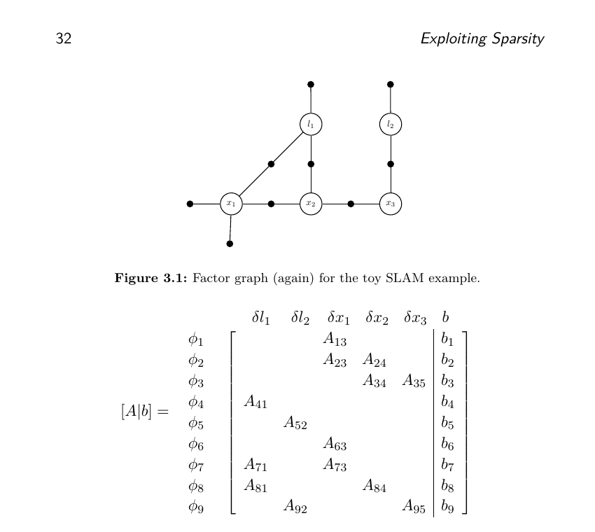
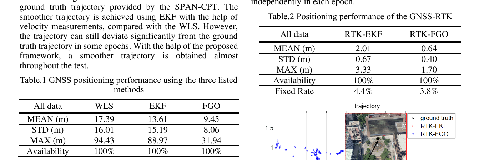
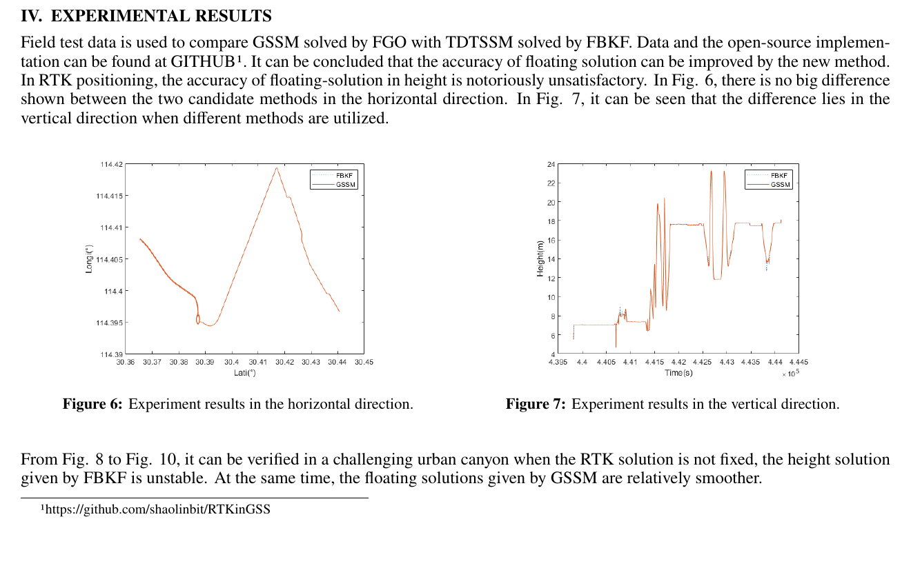

# 2026-09-04 GNSS 每日研究简报

## 今日快报

### 快报 1：隐蔽 GNSS/LiDAR 攻击不露残差，就用受限机动主动拉开可达集合

- 主题：`zonotope-active-exposure-gnss-lidar-deception`
- 来源 ID：`arxiv:2609.02587`
- 来源链接：https://arxiv.org/abs/2609.02587
- 发表日期：2026-09-02
- 来源类型：arXiv 预印本、集合成员估计与 UAV 多传感器攻击仿真
- 获取范围：完整预印本 8 页；定理、算法、UAV 参数及 Figures 3—4 均已核对

**内容：** 方法先用被认为安全的 IMU/气压计观测构造防守方 zonotope 可达集，再为“仅 GNSS、仅 LiDAR、两者同时受攻击”等假设传播攻击方输出集；滚动时域优化在控制输入上叠加有界扰动，主动放大两类集合的分离度。集合不再相交时，相应攻击假设才被暴露。

**结论：** 仿真采用 0.1 s 步长、螺旋 UAV 轨迹、50 步暴露窗口；离线给出的扰动预算下界/充分阈值为 1.47/2.94，案例取 2。攻击强度 0.6 时 GNSS/LiDAR 在暴露阶段第 17/46 步被识别，强度 0.9 时提前到第 7/14 步。证据只来自已知线性模型、已知噪声界和白盒攻击者仿真，不是实机抗欺骗认证。

**关注理由：** 被动残差检验面对“贴着阈值走”的慢变欺骗可能长期沉默。主动暴露把可检测性与平台可承受机动预算联系起来，但飞控安全边界、模型失配和安全传感器集合必须先被可信地定义。

### 快报 2：四鱼眼拼全景不能只追求无缝，机载版本还要守住 20 Hz 与功耗预算

- 主题：`uav-multifisheye-parallax-aware-onboard-panorama`
- 来源 ID：`arxiv:2609.02319`
- 来源链接：https://arxiv.org/abs/2609.02319
- 发表日期：2026-09-02
- 来源类型：arXiv 预印本、超低空 UAV 四鱼眼开放平台与 18 段外场序列
- 获取范围：完整预印本 10 页；超过 50,000 组同步四视图、消融、Jetson 回放与 VPR 结果已核对

**内容：** 系统按重叠区独立选择投影深度，以动态 seam、低/高频双带融合和受验证门控的残差网格处理近景视差；部署配置只保留能跟上输入速率的 Per-seam 更新。输出是 1280×640 等距柱状全景，并以冻结目标检测器和视觉地点识别器检查接口价值。

**结论：** 精度配置相对固定深度将远场 P90 特征错位降低 41.6%；Jetson Orin NX 部署配置维持 19.99 frame/s、模块输入平均功耗 13.29 W。八扇区全景的白天 VPR Recall@5 为 90.8%，但对应误差仍为 17.2 m；这些是特定数据、阈值和冻结下游模型的结果，不是 GNSS 等价定位精度。

**关注理由：** GNSS 受遮挡时，全景视觉常被当作补充约束。本文提醒工程端同时记几何错位、下游召回、端到端时延、丢帧和功耗，不能用一张“看起来无缝”的全景替代可复核的定位接口指标。

### 快报 3：RF 与超声同场同步后，联合定位的第一项成果是把缺测和时钟边界写进数据集

- 主题：`synchronized-rf-acoustic-indoor-positioning-dataset`
- 来源 ID：`arxiv:2609.02657`
- 来源链接：https://arxiv.org/abs/2609.02657
- 发表日期：2026-09-02
- 来源类型：arXiv 预印本、Techtile 分布式 RF—声学定位数据集与基线
- 获取范围：完整预印本 6 页；12 个实验、采集参数、数据联接规则与声学定位基线已核对

**内容：** 移动平台同时携带 920 MHz RF 端与超声发射端，以 Qualisys 位姿作为共同标签；固定端包含 42 个 RF 接收 tile 和 91 个麦克风。所有模态用 `(experiment_id, cycle_id)` 对齐，超声采用 20—40 kHz、30 ms 线性 chirp，RF 保留复 CSI。

**结论：** 发布物含 5011 个对齐的三模态周期、210,068 个 tile 级复 CSI 样本；声学基线在 50 条留出路径、550 个停点上的二维平均/P90 误差为 0.110/0.195 m，三维为 0.130/0.217 m，27,500 条测距的 MAE 为 0.311 m。RF 发射端与接收端没有相位同步，论文明确把 RF 精密相位定位列为尚未闭合的能力。

**关注理由：** 多模态融合最怕把缺失值误当零、把各自时间轴误当同一历元。ARFT 的价值不只在基线误差，更在于把同步键、缺测、训练/测试路径与硬件时钟限制一并交付。

### 快报 4：GPS 失效后的双机编队靠视觉相对位姿续航，但证据仍停留在 Gazebo

- 主题：`vision-leader-follower-uav-gps-degraded-fallback`
- 来源 ID：`arxiv:2609.01420`
- 来源链接：https://arxiv.org/abs/2609.01420
- 发表日期：2026-09-01
- 来源类型：arXiv 预印本、YOLOv8/RGB-D 双机编队仿真系统
- 获取范围：完整预印本 6 页；1,339 幅训练数据、视觉滤波、PID 控制、四类仿真指标已核对

**内容：** 跟随机用 RGB-D 与 YOLOv8 检测领机，以相机内参和深度恢复三维相对位置，再用常速度 Kalman 滤波平滑；GPS 或外部定位可用时维持本地坐标系，失效后相同 PID 只依赖视觉相对误差生成 PX4 速度指令。

**结论：** XTDrone/Gazebo 中直线、圆轨、GPS 失效和可见性压力场景的位置 RMSE 分别为 0.25、0.32、0.45、0.58 m，最大偏差为 0.60、0.75、0.95、1.20 m；端到端平均 38 ms，约 25 Hz。论文没有实机飞行、强阳光深度失效或独立定位真值，因此只能说明该仿真闭环可行。

**关注理由：** 相对编队不一定需要每架机都保持绝对 GNSS，但本地坐标漂移、领机自身位置错误和共同视觉失效仍会传给整个队形。产品化时必须把“保持相对队形”与“保持全球航迹”分开验收。

### 快报 5：Kalman 滤波不必先假设高斯，先把预测与观测写成一个广义最小二乘

- 主题：`kalman-filter-generalized-least-squares-derivation`
- 来源 ID：`arxiv:2609.02332`
- 来源链接：https://arxiv.org/abs/2609.02332
- 发表日期：2026-09-02
- 来源类型：arXiv 预印本、IEEE Signal Processing Magazine 教学稿
- 获取范围：完整预印本 18 页；Gauss–Markov 推导、相关过程/量测噪声、标量更新和后向平滑均已核对

**内容：** 教学稿把状态预测误差与观测误差堆成一个块结构线性模型，从广义最小二乘直接得到 Kalman 增益和后验协方差；随后允许过程噪声与量测噪声存在互协方差，并由同一批量最小二乘展示前向滤波与后向平滑的关系。

**结论：** 线性最小方差无偏估计只依赖零均值与已知二阶矩，不要求扰动为高斯；高斯假设带来的是后验/最大似然的进一步最优解释。若量测协方差为对角阵，还可逐标量更新以避免一次大矩阵求逆。该稿是推导与数值例，不是对非高斯异常值鲁棒性的实验保证。

**关注理由：** GNSS 工程常把“Kalman”与“高斯世界”混为一谈。真正危险的通常是协方差错设、偏差未建模和异常值，而不是分布名称本身；这一点也为下面比较滤波与因子图建立共同的最小二乘语言。

## 深度研读

### 深读 1｜接收机工程｜因子图不是画图工具：每条局部约束都对应稀疏最小二乘的一块

- 类别：`receiver-engineering`
- 学习层级：`foundation`
- 选题定位：`经典基础`
- 来源 ID：`doi:10.1561/2300000043`
- 来源链接：https://doi.org/10.1561/2300000043
- 发表日期：2017-08-15
- 来源类型：Foundations and Trends in Robotics 专著式同行评审综述
- 获取范围：作者公开完整 PDF 144 页；概率建模、MAP、非线性最小二乘、稀疏分解、排序与增量求解
- 价值评分：98/100（相关性 19，经典价值 20，证据 20，教学价值 20，工程价值 19）

#### 为什么先学这个

后两篇把伪距、Doppler、双差载波和模糊度放进图优化。如果只把因子图理解成“把多个历元一起算”，就看不出为何变量选择、因子连接和消元顺序会决定精度、内存与速度。先把概率分解到稀疏线性代数的映射讲清楚，才能审计 GNSS 图模型。

#### 先修知识

需要理解条件概率、最大后验估计、加权最小二乘、残差、协方差/信息矩阵、Jacobian、Gauss–Newton、QR/Cholesky，以及“状态变量”和“观测值”的区别。

#### 一句话逻辑

把全局后验写成只连接少量变量的因子乘积，取负对数并线性化后，每个因子只填 Jacobian 的一小块，因此可用稀疏分解高效求整个状态增量。

#### 研究问题与约束

原文是机器人感知的系统教材，以 SLAM、导航、标定和跟踪说明因子图，并非 GNSS 专论。它完整覆盖批处理与 iSAM/Bayes tree，但不替应用者决定 GNSS 误差分布、周跳、基准星切换或整数模糊度策略。

#### 核心方法论

变量集合 $`X`$ 的后验先按局部条件独立性分成因子 $`\phi_i(X_i)`$。Gaussian 测量把 MAP 变成 Mahalanobis 残差平方和；非线性测量在当前点线性化为 $`A\delta\approx b`$。因子—变量连接决定 $`A`$ 的非零块，QR 或 Cholesky 消元得到增量；不良排序会产生 fill-in。

#### 关键公式逐步推导

局部因子乘积为：

```math
\phi(X)=\prod_i\phi_i(X_i).
```

若因子来自 covariance 为 $`\Sigma_i`$ 的 Gaussian 残差，则 MAP 等价于：

```math
X^*=\arg\min_X\sum_i\left\|h_i(X_i)-z_i\right\|_{\Sigma_i}^2.
```

在当前估计 $`X_0`$ 处令 $`h_i(X_0\oplus\delta)\approx h_i(X_0)+A_i\delta`$，堆叠并白化后得到：

```math
\delta^*=\arg\min_\delta\|A\delta-b\|_2^2,
\qquad A^TA\delta=A^Tb.
```

图的稀疏性只减少非零块；若正规方程病态，平方条件数的代价仍然存在。

#### 经典价值与创新边界

经典价值是把概率图、稀疏矩阵、变量消元和增量推断放在统一框架中。边界是“全局优化”不等于全局凸，也不保证模型正确；错误数据关联、坏初值和重尾残差仍会让优化落到错误解。

#### 整体逻辑链

定义状态与观测；按条件独立性写因子；转成 MAP；对白化残差线性化；形成块稀疏 Jacobian；选择消元顺序；稀疏 QR/Cholesky 求增量；迭代重线性化；在线问题再用 iSAM/Bayes tree 只更新受影响区域。

#### 原文图表与结果分析



> 图表源：Dellaert 与 Kaess《Factor Graphs for Robot Perception》Figures 3.1—3.2，[DOI 页面](https://doi.org/10.1561/2300000043)。由作者公开 PDF 第 37 页以 150 dpi 渲染，仅裁出原图与矩阵；未重绘、改字或改变非零块。版权归原作者/出版者，本仓库仅作最小必要研究评论引用。

上半图中白圆是五个变量、黑点是九个因子；下半矩阵每一行对应一个因子、每一列对应变量增量，只有相连处出现 $`A_{ij}`$。它直接说明“局部约束为何产生稀疏矩阵”，却不展示具体求解时间，也不能证明任意消元顺序都保持同样稀疏。

#### 原文结果论述

原文的核心结论是：图结构使高维推断可以局部建模，并通过稀疏线性代数求解；变量排序决定分解后的 fill-in，增量算法可重用旧计算。这里没有把某个 GNSS 数据集的误差降低多少作为证据，教学价值来自结构与算法之间的可验证对应。

#### 常见误区与适用边界

第一，把节点数少当计算一定快。第二，忽略残差白化与相关协方差。第三，用正规方程却不检查条件数。第四，删掉旧状态却不保存正确边缘先验。第五，因子连接错误仍期待 robust kernel 修复。第六，把批量最优写成实时因果解。第七，把局部极小值称作全局最优。

#### 工程实现步骤

1. 为位置、钟差、速度和模糊度定义变量及单位。
2. 为每类观测写预测函数、残差与协方差。
3. 数值检查 Jacobian。
4. 绘制变量—因子连接并预测稀疏结构。
5. 对残差白化，选 QR/Cholesky 与排序。
6. 迭代求解并记录代价、步长和条件指标。
7. 滑窗边缘化时保留相关先验。
8. 对异常值与错误初值单独做压力测试。

#### 复现实验设计

生成 1000 历元、每历元 12 星的 GNSS 状态图，比较逐历元独立、链式 Doppler 因子和共享模糊度三种拓扑。固定同一残差模型，分别用 dense QR、sparse QR、Cholesky，扫描自然序、COLAMD 与“先消模糊度”排序。指标为非零块数、fill-in、峰值内存、单次迭代时延、代价下降和位置差；失败注入包括相关噪声被错当对角、初值偏 1 km、单星 100 m 粗差和窗口边缘化错误。

#### 与定位及低成本实现的联系

低成本接收机算力有限，真正可省的是结构，而不是省略误差项。伪距因子只连当前状态，Doppler 连相邻历元，连续载波的模糊度可跨多历元共享；这种连接方式正是下一篇 GNSS/RTK 因子图的计算骨架。

#### 本节小结

因子图把局部物理关系变成块稀疏矩阵；性能来自正确建模、白化、排序与增量复用，而不是“画成图”本身。

### 深读 2｜接收机工程｜把码、Doppler 与双差载波分别成因子，历史信息能抗粗差但不能替代周跳检测

- 类别：`receiver-engineering`
- 学习层级：`intermediate`
- 选题定位：`基础进阶`
- 来源 ID：`arxiv:2106.01594`
- 来源链接：https://arxiv.org/abs/2106.01594
- 发表日期：2021-06-03
- 来源类型：ICRA 2021 接收论文公开稿、香港城市峡谷 GNSS/RTK 因子图实测
- 获取范围：完整公开稿 7 页；观测方程、GraphGNSSLib、两组道路/静态数据与 Tables 1—2
- 价值评分：97/100（相关性 20，经典价值 18，证据 19，教学价值 20，工程价值 20）

#### 为什么先学这个

上一节给出通用稀疏骨架，本节把每个块换成真实 GNSS 观测：伪距锚绝对位置，Doppler 连接相邻状态，双差码与载波连接基站、流动站及模糊度。这样才能判断 FGO 的收益来自时间连接、观测类型还是异常值被多个历元稀释。

#### 先修知识

需要理解伪距与接收机钟差、Doppler 测速、地球自转改正、单差/双差、载波相位、浮点/固定 RTK、LAMBDA、高度角/SNR 定权、EKF 与 ENU 误差。

#### 一句话逻辑

将逐星伪距和双差相位作为量测因子，用 Doppler 速度因子串联相邻历元，再联合优化窗口状态与模糊度，使孤立粗差不必在单个滤波更新中永久写进状态。

#### 研究问题与约束

动态 GNSS 试验用 u-blox M8T、GPS+BDS 单频 1 Hz，真值来自 NovAtel SPAN-CPT；RTK 是另一处较少城市化区域的静态数据。公开实现没有周跳检测，模糊度逐历元独立求解，固定率极低；因此论文证明的是特定窗口浮点/混合输出改善，不是稳定的厘米级 RTK。

#### 核心方法论

先从 Doppler 最小二乘得到接收机速度与钟漂，作为相邻位置状态的速度因子。GNSS 单点图叠加逐星伪距因子；RTK 图以基准星形成双差码与载波因子，并估计双差模糊度。所有 covariance 按高度角和 SNR 设置，最后以 LAMBDA 尝试整数固定。

#### 关键公式逐步推导

逐星伪距模型可写为：

```math
\rho_r^s=\|p^s-p_r\|+\delta_r-\delta^s+I_r^s+T_r^s+\varepsilon_r^s.
```

Doppler 得到的速度观测将相邻状态连接：

```math
e_t^{DV}=v_t^{Doppler}-\frac{p_{t+1}-p_t}{\Delta t}.
```

以卫星 $`w`$ 为基准，双差载波残差包含整数模糊度：

```math
e_{DD,\Phi,t}^s=\Phi_{DD,t}^s-
\left[(r_r^s-r_b^s)-(r_r^w-r_b^w)+\lambda\Delta N_{rb,t}^s\right].
```

窗口目标为各因子白化残差之和：

```math
\chi^*=\arg\min_\chi\sum_{s,t}
\left(\|e_t^{DV}\|_{\Sigma_{DV}}^2+
\|e_{DD,\rho,t}^s\|_{\Sigma_\rho}^2+
\|e_{DD,\Phi,t}^s\|_{\Sigma_\Phi}^2\right).
```

#### 经典价值与创新边界

价值在于公开、清楚地给出 GNSS 单点与 RTK 的同一图优化表达，并提供代码。创新边界是没有 robust loss 的系统消融，也未完成跨历元模糊度与周跳管理；“抗粗差”主要来自时间平滑和批量重估，不能自动处理持续 NLOS。

#### 整体逻辑链

解析原始码/相位/Doppler；计算星位星速；Doppler LS 估速度；建伪距和速度因子；RTK 再形成双差码/相位与模糊度；窗口非线性优化；LAMBDA 尝试固定；输出 ENU；与 WLS、EKF/RTKLIB 比较。

#### 原文图表与结果分析



> 图表源：Wen 与 Hsu《Towards Robust GNSS Positioning and Real-time Kinematic Using Factor Graph Optimization》Tables 1—2，[arXiv 原文](https://arxiv.org/abs/2106.01594)。由公开作者稿 PDF 第 6 页以 180 dpi 渲染，裁出两张原表及其紧邻的轨迹图顶部；未重绘或修改标题、行列及数值。作者稿未声明开放再许可，本仓库按最小必要研究评论引用。

左表单位为 m：WLS/EKF/FGO 的平均水平误差为 17.39/13.61/9.45，STD 为 16.01/15.19/8.06，最大误差为 94.43/88.97/31.94。右表中 RTK-EKF/RTK-FGO 的平均误差为 2.01/0.64 m、最大误差为 3.33/1.70 m；两者可用率均 100%，但固定率由 4.4% 降到 3.8%。表只汇总指定数据，不能分离 Doppler、窗口长度和权模型各自贡献。

#### 原文结果论述

动态城市峡谷中 FGO 相比 WLS/EKF 降低均值、离散和最大水平误差。较少城市化的静态 RTK 数据中，FGO 混合输出的均值更小，但固定率没有改善；作者把这归因于未加入周跳检测且模糊度逐历元独立解算，并把提高固定率列为未来工作。

#### 常见误区与适用边界

第一，把 100% availability 当 100% fixed。第二，只看均值不看最大误差。第三，把平滑轨迹等同于异常已检测。第四，用同一 Doppler 同时构造速度又假装信息独立。第五，忽略基准星切换。第六，载波跨周跳仍连因子。第七，从静态 RTK 外推动态车载。第八，用作者称谓“robust”替代安全完整性指标。

#### 工程实现步骤

1. 统一基站/流动站时间、频点和星历。
2. 计算星位、星速与地球自转改正。
3. 按高度角/SNR 建立码、相位、Doppler 方差。
4. 用 Doppler LS 生成速度及 covariance。
5. 形成伪距和相邻状态因子。
6. 选择基准星并生成双差码/相位。
7. 按连续弧维护模糊度变量与周跳重置。
8. 优化、LAMBDA 验收并区分 float/fixed 输出。

#### 复现实验设计

在香港式深街谷、开阔道路和静态短基线各采 10 段 20 min、1/5/10 Hz GPS+BDS+Galileo 数据，独立 GNSS/INS 给真值。比较 WLS、EKF、仅码 FGO、码+Doppler FGO、完整双差 FGO、加入 robust kernel/周跳管理的版本。报告全历元与 fixed-only 的 50/95/最大误差、正确/错误固定率、可用率、恢复时间、CPU/内存；注入单星 50 m NLOS、1 周周跳、基准星切换和 2 s 时间错位。

#### 与定位及低成本实现的联系

M8T 级单频接收机也能输出原始码、相位与 Doppler，图优化能利用其时间相关性；但低成本振荡器、天线和频繁失锁使连续弧管理比求解器品牌更重要。下一节不再把每个历元的模糊度都复制，而把跨历元不变的双差模糊度作为共享常变量。

#### 本节小结

GNSS 因子图的收益来自把不同观测和时间关系显式连接；若周跳与模糊度寿命没建对，更大的窗口只能更一致地拟合错误。

### 深读 3｜定位｜双差模糊度既然跨历元不变，就别在每个时刻复制一份：全局 RTK 状态图

- 类别：`positioning`
- 学习层级：`advanced`
- 选题定位：`定位深入`
- 来源 ID：`arxiv:2208.12923`
- 来源链接：https://arxiv.org/abs/2208.12923
- 发表日期：2022-11-09
- 来源类型：arXiv 预印本 v3、开放代码的 RTK 后处理图状态模型
- 获取范围：完整预印本 10 页；三频 RTK 模型、FBKF/GSSM 推导、外场曲线与代码链接均已核对
- 价值评分：95/100（相关性 20，经典价值 18，证据 17，教学价值 20，工程价值 20）

#### 为什么先学这个

上一节已经把多历元连成图，但模糊度管理仍薄弱。本节问得更直接：位置随时间变化，连续弧内的双差模糊度却是常量，为何要按滤波器习惯把它复制成每历元状态？把动态量和常量分开，可让同一个整数/偏差节点吸收整段观测。

#### 先修知识

需要理解三频双差码与载波、基准星矩阵、RTKLIB 状态、前向/后向 Kalman 滤波、批量 WLS、固定与浮点解、线性化点、稀疏因子图及高程几何弱项。

#### 一句话逻辑

先用前向滤波给位置与模糊度初值，再把每历元位置设为动态节点、连续弧双差模糊度设为一个共享常节点，以全局因子图联合重估整段浮点 RTK。

#### 研究问题与约束

论文面向后处理，不是实时系统；用外场数据比较图状态空间模型 GSSM+FGO 与传统离散时序模型 TDTSSM+前后向 Kalman。结果主要是轨迹图，缺少完整误差表、数据时长和独立真值细节；实时性、整数成功率和统计显著性都未建立。

#### 核心方法论

传统状态把位置、速度和 L1/L2/L5 单差相位偏差都按历元传播。GSSM 只让位置 $`X_c`$ 形成时间序列，把连续弧的三频双差偏差 $`X_b`$ 作为全局常量；前向固定位置提供先验，双差码/相位提供量测因子。所有历元一次形成块方程并加权求解。

#### 关键公式逐步推导

双差三频观测的线性化结构为：

```math
Y=HX+r,
\qquad
X=[Pos^T,Vel^T,Bias_1^T,Bias_2^T,Bias_5^T]^T.
```

GSSM 将状态拆成动态与常量：

```math
\begin{bmatrix}\dot X_c\\\dot X_b\end{bmatrix}
=
\begin{bmatrix}A_c&A_b\\0&0\end{bmatrix}
\begin{bmatrix}X_c\\X_b\end{bmatrix}
+\begin{bmatrix}q\\0\end{bmatrix},
\qquad Y=[C_c\ C_b]\begin{bmatrix}X_c\\X_b\end{bmatrix}+r.
```

对整段堆叠得到：

```math
A_wX_w=b_w,
\qquad
\hat X_w=(A_w^TP_w^{-1}A_w)^{-1}A_w^TP_w^{-1}b_w.
```

实际实现应使用稀疏 QR/Cholesky，而不是显式形成矩阵逆。

#### 经典价值与创新边界

价值在于强调“变量的物理寿命决定图结构”：常量不必迎合滤波器而复制。边界是连续弧、硬件偏差和基准星一旦改变，所谓常量就必须切段；论文并未给出自动切段、稳健核或整数风险控制。

#### 整体逻辑链

前向 RTKLIB 得到 fixed/float 初值；识别各模糊度连续弧；固定位置形成位置先验；每历元形成双差量测；位置按历元建节点、模糊度按弧建共享节点；稀疏全局求解；与 FBKF 比水平/高程及三个失固定时段；输出后处理轨迹。

#### 原文图表与结果分析



> 图表源：Ge 等《Global RTK Positioning in Graphical State Space》Figures 6—7，[arXiv 原文](https://arxiv.org/abs/2208.12923)。由公开预印本 PDF 第 7 页以 180 dpi 渲染，仅裁出原文说明和两幅图；未重绘、平滑或修改坐标与数据。预印本未声明开放再许可，本仓库按最小必要研究评论引用。

左图横轴为纬度（约 30.36°—30.45°）、纵轴为经度（约 114.39°—114.42°），FBKF 与 GSSM 基本重合。右图横轴为时间（约 $`4.395\times10^5`$—$`4.445\times10^5`$ s）、纵轴为高程 4—24 m；多数区段两条线仍重合，只在跳变与末段看到小差异。它支持“水平差异小、高程差异集中在弱段”的定性判断，却不足以读出可靠 RMSE。

#### 原文结果论述

作者随后用 Figures 8—10 放大三个城市峡谷失固定时段，称 FBKF 高程更不稳定、GSSM 浮点解较平滑。论文还报告另一项 12 km 管线经验：GSSM+FGO 配 2 个约束点可达到 TDTSSM+FBKF 配 12 个约束点的同等精度；但正文未给完整数表与试验协议，因此应视为作者报告，不是可独立复核的普适比例。

#### 常见误区与适用边界

第一，把共享模糊度跨过周跳。第二，基准星改变却不变换状态。第三，用前向 fixed 解作强先验时忽略其可能错误。第四，平滑就是准确。第五，显式求逆大矩阵。第六，后处理结果宣称实时。第七，只看高程图不报外部真值。第八，把 float 改善等同于整数成功率提高。

#### 工程实现步骤

1. 用标准 RTK 前向解生成线性化点与质量标志。
2. 按频点、卫星、基准星和周跳切分连续弧。
3. 每历元创建位置节点，按弧创建共享模糊度节点。
4. 为可信 fixed 位置添加有 covariance 的先验，而非硬钉死。
5. 添加三频双差码/相位因子。
6. 用稀疏排序与阻尼迭代求解。
7. 对周跳、参考星切换和异常残差重建局部图。
8. 输出 float/fixed、残差、弧 ID 与 covariance 审计日志。

#### 复现实验设计

采集一条 12 km 开阔—树荫—高楼混合路线，双频/三频多 GNSS 10 Hz，独立测地 GNSS/INS 真值。比较前向 KF、FBKF、按历元复制模糊度的 FGO、共享弧模糊度 GSSM，以及加入 robust kernel 的 GSSM。指标为 ENU 50/95/最大误差、失固定段高程漂移、错误固定率、弧恢复时间、内存和整段时延；消融共享模糊度、fixed 先验、第三频点和排序，注入未标记周跳、错误 fixed 先验与基准星频繁切换。

#### 与定位及低成本实现的联系

高级项仍是纯 GNSS RTK：没有 IMU、视觉或地图。低成本部署的收益在于用整段载波弧增强浮点解，代价是批处理内存与严格弧管理；若要求实时，可改为固定窗/增量 Bayes tree，但必须量化边缘化和延迟带来的损失。

#### 本节小结

全局 RTK 的关键不是简单把滤波换成优化，而是让位置、速度和模糊度按各自物理寿命存在。共享常变量可加强失固定区段，但现有论文证据只够支持定性改善，离实时与完整性结论仍有明显距离。
