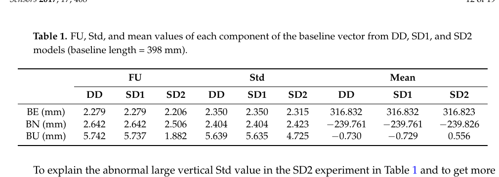
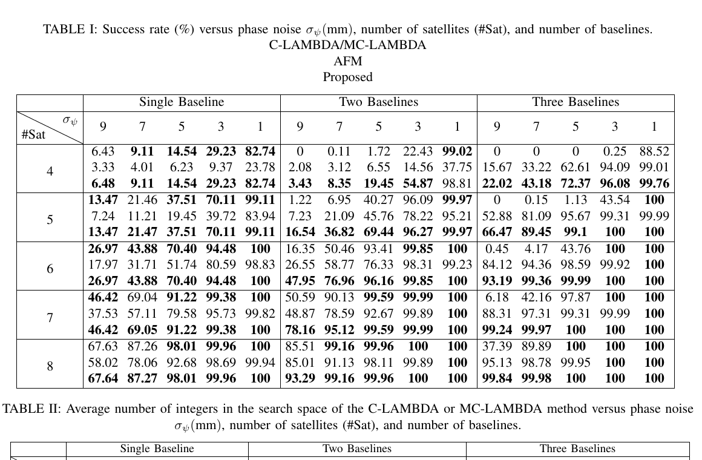
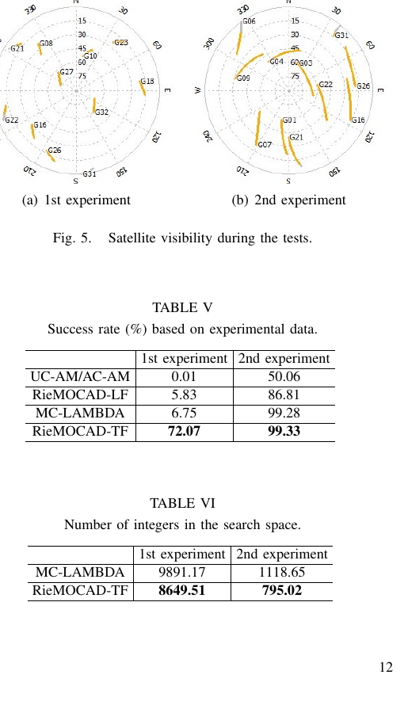

# 2026-09-05 GNSS 每日研究简报

## 今日快报

### 快报 1：空中俯视图只有变成地面车可执行的共享地图，异构协作才真正产生增益

- 主题：`air-ground-shared-bird-eye-vln`
- 来源 ID：`arxiv:2609.03483`
- 来源链接：https://arxiv.org/abs/2609.03483
- 发表日期：2026-09-03
- 来源类型：arXiv 预印本、CARLA-Air 闭环异构机器人导航评测
- 获取范围：完整预印本 8 页；方法、100 个闭环 episode、主结果表与消融均已核对

**内容：** AGC-VLN 让 UAV 在俯视图上标出 UGV 位姿、目标位置和距离，形成共享鸟瞰地图；UGV 用冻结 VLM 规划可行道路，UAV 同时用带升降动作的 3D-SPF 搜索目标。协作接口传递的是几何锚定后的地图，而不只是文本提示。

**结论：** 在 Town10HD 的 100 个闭环 episode 中，联合成功率为 77.0%，比较弱单体 UAV 的 50.0% 高 27.0 个百分点；UGV 成功率由单体的 12.0% 升到协作时的 75.0%。成功定义为任一平台进入目标 5 m 范围。证据来自一个仿真城市场景、一个目标类别和冻结模型，不证明真实通信延迟、地图误差或飞行安全已解决。

**关注理由：** GNSS 弱区的异构协作不能只比较各自定位精度，还要检查跨平台坐标、目标锚点和可通行约束是否在同一地图上闭合。

### 快报 2：稀疏互质阵列扩大虚拟孔径，也必须用更多快拍偿还空间—时间账

- 主题：`uav-isac-coprime-virtual-aperture`
- 来源 ID：`arxiv:2609.01979`
- 来源链接：https://arxiv.org/abs/2609.01979
- 发表日期：2026-09-02
- 来源类型：arXiv 预印本、UAV 全双工感知通信理论与仿真
- 获取范围：完整预印本 18 页；CRB 阶数分析、资源分配算法、参数表与 Figures 2—9 均已核对

**内容：** 方法把稀疏互质阵列嵌入同一均匀线阵孔径，部分阵元做全双工角度感知，其余阵元做 TDD 上下行通信；再联合优化感知协方差、下行预编码和上行接收波束，使角度 CRB、功率、QoS 与残余自干扰同时受约束。

**结论：** 在论文给定的“每感知阵元功率固定、目标非退化”渐近条件下，单目标空间频率 CRB 随感知阵元数按 $`O(M_s^{-6})`$ 衰减，而分割 ULA 为 $`O(M_s^{-4})`$；但固定物理孔径下，要达到同一 CRB，互质阵列通常需要更多时间快拍。数值结果是模型仿真，不是实机射频阵列或飞行定位试验。

**关注理由：** ISAC 常被视为 GNSS 补充定位源。这里最有用的不是“虚拟孔径更大”一句话，而是同时记录角度精度、快拍时长、残余自干扰和通信容量。

### 快报 3：无人机群共享特征前，先用一个小型上下文平面决定谁在何时发什么

- 主题：`drone-cooperative-perception-context-plane`
- 来源 ID：`arxiv:2609.00659`
- 来源链接：https://arxiv.org/abs/2609.00659
- 发表日期：2026-09-01
- 来源类型：arXiv 预印本、UAV3D 回放与 Jetson ROS 2 原型
- 获取范围：完整预印本 7 页；公开 DiscoNet checkpoint 回放、配对 bootstrap 区间与原型开销均已核对

**内容：** 每架无人机以不超过 1 KB、10 Hz 的描述符发布任务阶段、场景覆盖、算力/电量、编队几何和逐链路质量；可替换策略据此选择计算占空比、通信对象、特征精度、ROI、发送速率与融合权重，重数据仍走原数据平面。

**结论：** UAV3D 上，任务相关 AP 在只发送全共享 5%—10% 字节时可与全共享相当；固定选择错策略最多损失 7.7 AP。Jetson AGX Orin 原型的四个 180 B 描述符在 10 Hz 下约占数据平面带宽的 0.01%，策略中位时延 0.10 ms。实验只改变已有模型的共享调度，没有验证无线丢包、恶意描述符或真实多机飞行。

**关注理由：** 多机 GNSS/视觉/雷达融合若没有显式的质量和时效上下文，更多共享可能只是把陈旧、相关或低价值信息更快灌入估计器。

### 快报 4：小型多模态模型可能飞得到，却因为不会正确宣布“到达”而被判失败

- 主题：`drone-mllm-action-protocol-termination`
- 来源 ID：`arxiv:2609.01404`
- 来源链接：https://arxiv.org/abs/2609.01404
- 发表日期：2026-09-01
- 来源类型：arXiv 预印本、仿真无人机闭环 VLA 基准
- 获取范围：完整预印本 26 页；9 个模型、80 个单机 episode、20 个四机指挥 episode、失败分类与方差审计均已核对

**内容：** DroneCATS-Agent 只以提示词声明 `go/rotate/think/finished` 动作，让模型自己指点、搜索、犹豫和停止；统一成功准则要求模型明确宣布到达，而且宣布时目标可见、距离不超过 5 m，单纯飞过目标区不计成功。

**结论：** 单机可见静态目标中最佳模型成功 65%；Qwen3.5-9B 有 90% episode 曾进入成功半径，却只有 35% 最终成功。四机任务中 Gemini 3.7 Flash 为 80%，GPT-5 为 20%；较小模型还会把同一坐标复制给不同视图。每格仅 20 个 episode，仿真分数以 5 个百分点跳变，论文也报告约 9—13 个百分点的重复飞行标准差。

**关注理由：** 自动导航的安全接口既要验证轨迹，也要验证终止协议。对 GNSS 引导的无人机而言，“估计位置接近目标”与“控制器在正确时刻确认任务完成”是两个独立验收项。

### 快报 5：长基线 URTK 把 B2b/HAS 精密星历同时放在平台端和用户端，改正中断后仍可延续固定解

- 主题：`b2b-has-enhanced-long-baseline-urtk`
- 来源 ID：`doi:10.1186/s43020-026-00214-y`
- 来源链接：https://doi.org/10.1186/s43020-026-00214-y
- 发表日期：2026-09-01
- 来源类型：Satellite Navigation 开放获取原创论文、长基线多站实测
- 获取范围：完整开放 HTML；模型、300 km 站网、24 h/1 Hz 数据、改正龄期与中断试验均已核对

**内容：** 平台端先固定双差模糊度并映射为非差整数，利用多站插值形成含分数周偏差和大气项的 URTK 改正；平台和终端都应用 BDS PPP-B2b/Galileo HAS 轨钟改正，终端再以随改正龄期放松的电离层伪观测维持 PPP 形式滤波。

**结论：** 2025-07-20 的 24 h 数据来自约 300 km 三角站网及两个验证站；多站方案水平/垂直精度为 1.30/5.67 cm。固定改正龄期从 0 增至 150 s 时，B2b/HAS 方案水平 RMS 仅由 0.011 m 变为 0.013 m，固定率保持 100%；模拟中断可维持固定解超过 20 min。这里的中断是人工控制，数据只有一天，不能外推为任意电离层活动或全球覆盖保证。

**关注理由：** 高精度服务的连续性不只由改正是否到达决定，还由轨钟误差随龄期增长、大气约束如何退化和模糊度何时被安全释放共同决定。

## 深度研读

### 深读 1｜接收机工程｜共钟不只是少估一个钟差：它改变单差相对双差的垂向信息量

- 类别：`receiver-engineering`
- 学习层级：`foundation`
- 选题定位：`经典基础`
- 来源 ID：`doi:10.3390/s17020408`
- 来源链接：https://doi.org/10.3390/s17020408
- 发表日期：2017-02-20
- 来源类型：Sensors 同行评审开放获取论文
- 获取范围：完整出版 PDF 19 页；单差/双差协方差推导、398 mm 静态基线、车载试验及 Tables 1—2
- 价值评分：98/100（相关性 20，经典价值 20，证据 19，教学价值 20，工程价值 19）

#### 为什么先学这个

姿态定向先要把两天线载波写成正确差分模型。若两个通道不同钟，单差仍含接收机钟项；若共用时钟，天线间单差可同时消去星钟和接收机钟。这个变化决定可用卫星数、协方差和垂向基线强度，是后两篇几何约束与整数搜索的观测基础。

#### 先修知识

需要理解载波相位、天线间单差、星间双差、整周模糊度、未校准相位延迟（UPD）、协方差传播、基线 ENU 分量、最小二乘形式精度与实测离散度。

#### 一句话逻辑

非共钟时，正确估计逐历元钟/UPD 后单差与双差等价；共钟且把 UPD 作为常量或已知量时，单差保留一条双差消去的信息方向，因此垂向基线形式精度更强。

#### 研究问题与约束

论文比较 DD、非共钟等价的 SD1，以及共钟且单个 UPD 跨历元保持的 SD2。短基线假定两天线面对相近传播误差；SD2 的优势依赖真实共钟、通道间延迟稳定和正确 covariance。398 mm 静态试验存在可重复多路径，车载对比也不是独立绝对姿态认证。

#### 核心方法论

从两接收通道的非差载波开始，先在天线间作单差。非共钟模型保留一个差分钟/逐历元 UPD；再对卫星作差得到 DD。共钟模型若只估一个跨历元 UPD，则每颗卫星的单差都保留观测，设计矩阵比选基准星后的 DD 多一个有效方向。

#### 关键公式逐步推导

天线 $`a,b`$ 对卫星 $`s`$ 的载波单差可写为：

```math
\Delta\Phi_{ab}^{s}=-(e^{s})^Tb_{ab}+c\Delta t_{ab}+\lambda\Delta N_{ab}^{s}+\Delta\varepsilon_{ab}^{s}.
```

非共钟时把 $`c\Delta t_{ab}`$ 作为逐历元未知数，或再减参考星 $`r`$：

```math
\nabla\Delta\Phi_{ab}^{s,r}=-(e^s-e^r)^Tb_{ab}+\lambda\nabla\Delta N_{ab}^{s,r}+\nabla\Delta\varepsilon_{ab}^{s,r}.
```

共钟且通道 UPD $`u_{ab}`$ 稳定时，联合多历元估计：

```math
\Delta\Phi_t^s=-(e_t^s)^Tb_{ab}+u_{ab}+\lambda\Delta N_{ab}^{s}+\varepsilon_t^s.
```

形式协方差为 $`Q_{\hat x}=(A^TQ_y^{-1}A)^{-1}`$；SD2 多保留的信息使其垂向方差在本文几何下明显缩小。

#### 经典价值与创新边界

经典价值是明确回答“单差与双差何时等价、何时不等价”，并把共钟硬件收益量化到协方差。边界是形式精度只反映模型和权阵；通道延迟漂移、相关多路径或错误整数可使实际误差远大于形式值。

#### 整体逻辑链

写非差载波；形成天线间单差；区分共钟/非共钟；决定 UPD 是逐历元还是跨历元；构造 SD1、SD2、DD 设计矩阵；传播协方差；用静态和车载数据比较形式精度、离散度与卫星遮挡响应。

#### 原文图表与结果分析



> 图表源：Chen 等《Formal Uncertainty and Dispersion of Single and Double Difference Models for GNSS-Based Attitude Determination》Table 1，[DOI 页面](https://doi.org/10.3390/s17020408)，CC BY 4.0。由出版 PDF 第 12 页以 160 dpi 渲染，仅裁出原表与紧邻一句说明；未重绘、改字或改变数值。

表中 398 mm 基线的东/北/天分量单位均为 mm。DD 与 SD1 的形式不确定度几乎完全相同：垂向分别为 5.742/5.737 mm；SD2 垂向降到 1.882 mm，约为 DD 的三分之一。实测标准差为 5.639/5.635/4.725 mm，SD2 没有达到形式预测的比例，论文随后用半球多路径图说明静态环境中的相关多路径占据了差距。表能证明该数据与权模型下的信息量差异，不能证明所有共钟接收机都天然更准。

#### 原文结果论述

论文理论上证明非共钟 SD1 与 DD 在基线解及形式不确定度上等价；共钟 SD2 的水平增益较小，但垂向形式不确定度约小两倍以上。多路径改正后，DD/SD1 的实测离散度约为 SD2 的 3.7 倍，更接近理论的 5.3 倍但仍未完全闭合。

#### 常见误区与适用边界

第一，把电缆接到同一振荡器就当 UPD 恒定。第二，SD 与 DD 混用却沿用同一对角权阵。第三，把形式 covariance 当真实误差。第四，忽略基准星切换造成 DD 相关结构变化。第五，超短基线结论直接外推到长基线大气不共模场景。第六，只看航向而不审计弱几何垂向/俯仰。

#### 工程实现步骤

1. 记录各天线是否真正共享采样钟与 RF 参考。
2. 做零基线/公共天线试验估计通道 UPD 及温漂。
3. 分别实现 DD、逐历元 UPD 的 SD1、固定/随机游走 UPD 的 SD2。
4. 从原始观测 covariance 严格传播差分相关性。
5. 计算 $`A^TQ^{-1}A`$ 的条件数与 ENU 形式精度。
6. 用独立姿态或测量臂检验偏差和实测离散。
7. 遮星、换基准星和升温时单独记录退化。

#### 复现实验设计

搭建 0.4/1.0 m 两种双天线基线，共钟和独立钟各一组，GPS+Galileo 双频 10 Hz 连续 6 h。比较 DD、SD1、固定 UPD-SD2 与 UPD 随机游走 SD2；以全站仪/高等级 INS 给独立姿态。指标为 ENU 形式标准差、实测标准差、均值偏差、正确固定率和航向/俯仰 P95；失败注入包括单通道 0.1 cycle 温漂、相关多路径、卫星减至 3/4 颗与基准星切换。

#### 与定位及低成本实现的联系

低成本多通道板卡可用共钟提高可观性，但廉价射频链的群延迟与温漂可能把新增信息变成偏差。下一节不再只比较线性模型，而直接利用已知基线长度、夹角和相位的整周包裹结构搜索姿态。

#### 本节小结

共钟硬件改变的是观测模型的信息秩和协方差，不只是“同步更好”。收益只有在 UPD 稳定且权阵正确时才会兑现。

### 深读 2｜接收机工程｜先在球面上解包裹相位：不显式先固定整数，也能把基线几何塞进搜索

- 类别：`receiver-engineering`
- 学习层级：`intermediate`
- 选题定位：`基础进阶`
- 来源 ID：`arxiv:2112.14813`
- 来源链接：https://arxiv.org/abs/2112.14813
- 发表日期：2021-12-29
- 来源类型：arXiv 预印本 v2、单频单历元 GNSS 定向仿真与静态实测
- 获取范围：完整预印本 14 页；C-WLS 推导、候选点搜索、$`10^4`$ 次/场景仿真与两组实测
- 价值评分：97/100（相关性 20，经典价值 18，证据 19，教学价值 20，工程价值 20）

#### 为什么先学这个

上一节说明载波差分留下的整数项与几何项。本节换一个视角：把相位的小数部分视为模 1 的包裹残差，直接在已知基线长度对应的单位球面上找方向，并用多基线夹角筛掉不可能组合。

#### 先修知识

需要理解相位 cycle、取整与包裹算子、单位球面、LOS 矩阵、已知基线长度/夹角、Wahba 问题、旋转矩阵正交约束、C/MC-LAMBDA 与 ambiguity function method。

#### 一句话逻辑

对每个候选基线方向，用“预测相位减实测相位后取最近整数”自动恢复模糊度；只搜索能满足基线长度和夹角的球面候选，再以正交旋转矩阵精化姿态。

#### 研究问题与约束

方法针对最难的单频、单历元 GPS；仿真基线为 1 m、10° 高度角截止、伪距噪声标准差设为相位的 100 倍。实测是三台接收机的静态数据。算法仍依赖已知天线几何、候选网格与局部精化，未处理周跳时间序列、动态杆臂形变或重尾 NLOS。

#### 核心方法论

把整数模糊度消去为姿态的取整函数，最小化包裹载波残差与伪距残差。单基线先由卫星几何交点生成少量球面候选，多基线再用已知夹角筛选组合；候选基线矩阵经 SVD 解 Wahba 正交投影，最后连续优化旋转矩阵。

#### 关键公式逐步推导

相位与伪距矩阵可写为 $`\Psi=HRX_b+WN+\Pi`$、$`P=HRX_b+\Xi`$。给定旋转 $`R`$，最近整数为：

```math
\tilde N(R)=\operatorname{round}\!\left(W^{-1}(\Psi-HRX_b)\right).
```

代回后得到约束包裹最小二乘：

```math
\hat R=\arg\min_{R\in O^{3\times q}}
\left\|
\begin{bmatrix}
\Psi-HRX_b-W\tilde N(R)\\
P-HRX_b
\end{bmatrix}
\right\|_{Q^{-1}}^2.
```

多基线候选还需满足已知夹角：

```math
\left|r_i^Tr_j-\frac{(x_i^b)^Tx_j^b}{\|x_i^b\|\,\|x_j^b\|}\right|<\tau.
```

候选基线矩阵投影到正交群后再用包裹残差精化。

#### 经典价值与创新边界

价值在于把“先浮点—再整数—再姿态”的流水线改写为姿态域中的包裹代价，解释为何天线长度和夹角能在固定前参与判别。边界是非凸搜索仍可能漏掉真候选；表中 C/MC-LAMBDA 还设了 $`10^5`$ 整数候选上限，不能把受限实现差异说成理论最优性被推翻。

#### 整体逻辑链

形成差分码相位；按已知基线归一化方向；由每颗卫星约束生成球面交点；以包裹相位评分候选；多基线夹角交叉筛选；组装基线矩阵；SVD 投影到旋转矩阵；连续精化；回算整数并输出姿态。

#### 原文图表与结果分析



> 图表源：Liu 等《Constrained Wrapped Least Squares: A Tool for High Accuracy GNSS Attitude Determination》Table I，[arXiv 原文](https://arxiv.org/abs/2112.14813)。由 v2 PDF 第 11 页以 160 dpi 渲染，仅裁出原表及 Table II 标题顶部；未重绘、改字或改变数值。arXiv 页面未给出开放再许可，本仓库仅作最小必要研究评论引用。

表中每个条件依次列 C/MC-LAMBDA、AFM、Proposed，成功率单位为 %。在 4 星、3 基线、相位噪声 7 mm 时三者为 0/33.22/43.18；噪声降至 3 mm 时为 0.25/94.09/96.08。优势集中在多基线夹角能排除错误候选的条件；1 基线时 Proposed 与 C-LAMBDA 基本相同。表来自每场景 $`10^4`$ 次 Gaussian 仿真，不代表真实城市峡谷错误固定率。

#### 原文结果论述

两组静态实测中 Proposed 的成功率为 83.18%/99.33%，MC-LAMBDA 为 25.85%/99.28%，AFM 为 76.20%/97.64%；成功历元的三个姿态 RMSE 在第一组为 0.13°/0.92°/1.27°，第二组为 0.03°/0.42°/0.45°。第一组差异更明显，但仍是静态、单地点有限数据。

#### 常见误区与适用边界

第一，以为没有“先固定整数”就没有整数决策。第二，候选网格过粗却把漏解归因于噪声。第三，用错误杆臂长度/夹角强行过滤真解。第四，只报成功历元 RMSE，隐藏失败历元。第五，把受搜索上限限制的 MC-LAMBDA 当无限搜索。第六，把 Gaussian 仿真成功率当现场完整性风险。

#### 工程实现步骤

1. 标定各天线在机体系的三维坐标和温度形变。
2. 形成同频同历元差分码相位与完整 covariance。
3. 由 LOS 和基线长度生成球面候选。
4. 以取整后的包裹相位残差排序。
5. 用已知基线夹角筛选候选组合。
6. 以 SVD/Wahba 得到合法旋转初值。
7. 在 $`SO(3)`$ 上连续精化并回算整数。
8. 输出候选间距、残差、验收标志和未固定状态。

#### 复现实验设计

使用 0.5/1.0 m 三天线 L 形阵列，GPS+Galileo L1/E1，随机抽 4—10 星；仿真每条件 $`10^4`$ 次，实测静态、转台和车载各 30 min。比较 AFM、C/MC-LAMBDA、C-WLS；扫描相位噪声 1—9 mm、杆臂误差 0—10 mm、夹角误差 0—2°。报告正确/错误固定率、未固定率、三轴 P95、候选数、CPU 时间；注入相关多路径与单星 0.25 cycle 偏差。

#### 与定位及低成本实现的联系

短基线低成本阵列的优势是几何先验强，弱点是相位噪声、天线互扰和杆臂误差。C-WLS 展示了如何让这些先验在搜索早期发挥作用；下一节进一步把旋转正交约束当成 Stiefel 流形，先改善浮点中心，再缩小整数搜索域。

#### 本节小结

包裹最小二乘不是绕开模糊度，而是把整数取整嵌进姿态代价。多基线几何能提高判别力，但必须连同搜索上限和未固定率一起报告。

### 深读 3｜定位｜把旋转矩阵留在 Stiefel 流形上：先修正浮点中心，再缩小瞬时定向的整数搜索

- 类别：`positioning`
- 学习层级：`advanced`
- 选题定位：`定位深入`
- 来源 ID：`arxiv:2205.10141`
- 来源链接：https://arxiv.org/abs/2205.10141
- 发表日期：2022-05-20
- 来源类型：arXiv 预印本、单历元多天线 GNSS 定向仿真与静态实测
- 获取范围：完整预印本 16 页；UC/AC/OC 姿态模型、Stiefel 流形优化、两种搜索形式、$`10^4`$ 次仿真与两组实测
- 价值评分：98/100（相关性 20，经典价值 19，证据 19，教学价值 20，工程价值 20）

#### 为什么先学这个

C-WLS 在姿态域直接搜索候选，本节保留“整数搜索”框架，但先用旋转矩阵正交约束改善浮点模糊度中心。这样能看清一个关键点：多基线不仅增加整数维数，也增加刚体几何信息；是否受益取决于求解器有没有真正利用 $`R^TR=I`$。

#### 先修知识

需要理解 UC-AM、AC-AM、OC-AM，多变量整数最小二乘，LAMBDA/MC-LAMBDA，Stiefel 流形、Riemannian gradient/retraction、Schur complement、浮点 covariance、紧/松搜索形式与 Euler 角。

#### 一句话逻辑

先在 $`R^TR=I`$ 的流形上求满足天线刚体几何的连续姿态与浮点模糊度，再把更准确的浮点中心放进整数域搜索，使真整数更靠近搜索中心并减少候选。

#### 研究问题与约束

论文处理单频单历元、已知天线坐标和 Gaussian 噪声；紧形式仍以最多 $`10^4`$ 个整数候选比较复杂度。两组静态实测用 0.63 m 等边三天线、5 Hz，真值由全时段 GNSS+IMU 融合产生，并非完全独立高等级转台真值。方法不涵盖动态杆臂、通道偏差、周跳或 NLOS 完整性。

#### 核心方法论

UC-AM 忽略天线几何，AC-AM 用仿射约束，OC-AM 以 $`X=RX_b`$ 且 $`R^TR=I`$ 保留完整正交约束。RieMOCAD-LF 用流形解改善浮点模糊度；RieMOCAD-TF 再将目标分解为浮点距离与条件姿态距离，使枚举按更可信中心排序并提前截断。

#### 关键公式逐步推导

观测堆叠模型为：

```math
Y=ARX_b+BN+E,\qquad R\in \mathrm{St}(3,q),\quad N\in\mathbb Z^{S\times A}.
```

先放松整数、保留流形约束得到：

```math
(\hat R_{RM},\hat N_{RM})=
\arg\min_{R^TR=I,\,N\in\mathbb R^{S\times A}}
\|\operatorname{vec}(Y-ARX_b-BN)\|_{Q^{-1}}^2.
```

整数搜索可分解为：

```math
J(N)=\|\operatorname{vec}(N-\hat N_{RM})\|_{Q_{\hat N}^{-1}}^2
+\min_{R^TR=I}\|\operatorname{vec}(R-\hat R(N))\|_{Q_R^{-1}}^2.
```

第一项给候选次序，第二项检验候选能否对应合法刚体旋转；Riemannian retraction 保证迭代后的 $`R`$ 不离开可行流形。

#### 经典价值与创新边界

创新在于把天线正交几何用于浮点阶段而非只在整数验收后检查，并给出松/紧两种复杂度—成功率折衷。边界是流形优化仍是非凸连续问题，强依赖初值和模型；在人工候选上限下胜过 MC-LAMBDA，不等于在无限搜索和正确随机模型下改变整数最小二乘的统计最优性。

#### 整体逻辑链

构造差分观测矩阵；由机体系杆臂形成 $`X_b`$；计算 UC/AC 浮点解；投影/初始化流形变量；Riemannian 迭代得到 $`\hat R_{RM},\hat N_{RM}`$；以分解目标排序整数候选；紧形式加入条件姿态代价；选最优整数；回算旋转和 Euler 角并输出搜索规模。

#### 原文图表与结果分析



> 图表源：Liu 等《Instantaneous GNSS Ambiguity Resolution and Attitude Determination via Riemannian Manifold Optimization》Figure 5 与 Tables V—VI，[arXiv 原文](https://arxiv.org/abs/2205.10141)。由公开 PDF 第 12 页以 160 dpi 渲染并裁出原图表；未重绘、改字或改变数值。arXiv 页面未给出开放再许可，本仓库仅作最小必要研究评论引用。

上方 skyplot 显示第一组卫星更少、几何更差；Table V 的成功率单位为 %：第一组 UC/AC、RieMOCAD-LF、MC-LAMBDA、RieMOCAD-TF 分别为 0.01、5.83、6.75、72.07，第二组为 50.06、86.81、99.28、99.33。Table VI 显示紧形式第一/二组平均检查 8649.51/795.02 个整数，少于 MC-LAMBDA 的 9891.17/1118.65。图表直接支持“坏几何下流形中心带来大收益”，但第一组仍有约 28% 未正确固定，也不能把有限候选差异外推为完整性保证。

#### 原文结果论述

仿真每条件 $`10^4`$ 次、基线 1 m、4—8 星、伪距噪声为相位的 100 倍。随着基线数增加，普通 LS 浮点误差可能因整数维数增大而恶化，而流形浮点解利用阵列冗余改善；实测第二组几何好时 MC-LAMBDA 与紧形式都约 99.3%，第一组才显现 6.75% 对 72.07% 的差异。

#### 常见误区与适用边界

第一，把“流形”当精度来源而不检查物理模型。第二，忽略杆臂标定误差会污染正交约束。第三，只比较正确固定率，不报错误固定与拒绝。第四，在不同候选上限下比较速度。第五，把静态融合真值当完全独立参考。第六，输出 Euler 角却不说明旋转约定。第七，几何差时强制固定而不给 float/fail-safe 输出。

#### 工程实现步骤

1. 定义机体系、导航系、旋转方向和 Euler 顺序。
2. 标定 $`X_b`$ 并给杆臂 uncertainty。
3. 构造双差码相位、完整权阵和参考星切换逻辑。
4. 求 UC/AC 浮点解并诊断 ADOP/条件数。
5. 将姿态初值投影到 $`\mathrm{St}(3,q)`$。
6. 用 Riemannian gradient 与 retraction 求流形浮点解。
7. 按分解代价枚举、剪枝并记录候选上限。
8. 以 ratio、残差、几何一致性联合验收，失败则输出浮点/不可用。

#### 复现实验设计

三天线 0.63 m 等边阵列采 GPS+Galileo L1/E1 10 Hz，转台静态 12 方位、缓慢旋转和车辆动态各 20 min；独立光学/INS 真值。比较 UC-LAMBDA、AC-LAMBDA、MC-LAMBDA、RieMOCAD-LF/TF 与 C-WLS，统一最大候选数 $`10^4/10^5`$ 两档。指标为正确/错误/拒绝率、三轴 P95、候选数、迭代时延和重捕获时间；失败注入包括 5 mm 杆臂误差、0.1 cycle 通道偏差、4 星遮挡、相关多路径和 1 周周跳。

#### 与定位及低成本实现的联系

多天线定向是纯 GNSS 相对定位的刚体特例：没有随时间积累的陀螺漂移，但整数、杆臂和天线相位中心决定绝对可靠性。对低成本平台，流形方法可用几何冗余换搜索量，前提是始终保留“未固定”出口并测量真实算力预算。

#### 本节小结

RieMOCAD 的核心不是换一个优化名词，而是让旋转可行域在浮点阶段就修正整数搜索中心。坏几何下收益最大，也最需要错误固定与拒绝机制。
