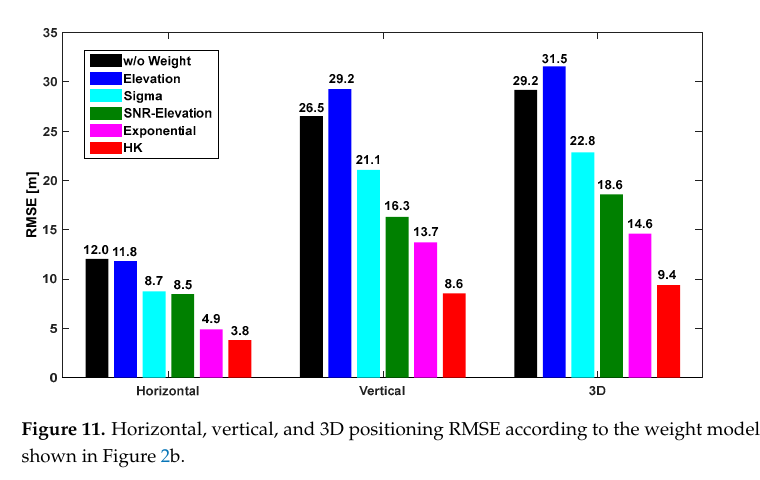
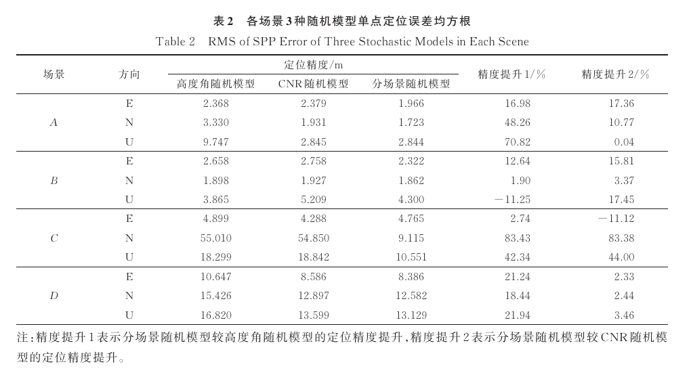
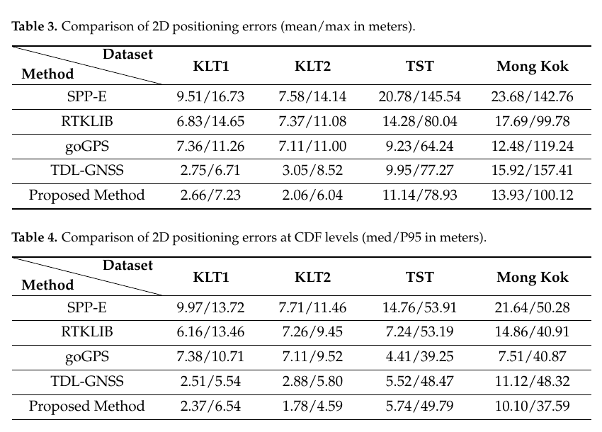

# 2026-09-06 GNSS 每日研究简报

## 今日快报

### 快报 1：Galileo E6-C 抗窄带干扰测距先在仿真中收敛到分米内，离接收机实证仍有一整段路

- 主题：`galileo-e6c-narrowband-ranging-simulation`
- 来源 ID：`doi:10.3390/aerospace13090805`
- 来源链接：https://doi.org/10.3390/aerospace13090805
- 发表日期：2026-09-03
- 来源类型：Aerospace 同行评审论文、Galileo E6-C 非线性滤波仿真
- 获取范围：开放全文 19 页；信号/干扰模型、接收机结构、仿真参数与 Figures 4—16 已核对

**内容：** 作者针对 1278.75 MHz 的 Galileo E6-C pilot，联合估计距离、速度、随机相位和窄带干扰的同相/正交分量，用二次损失下的准最优非线性滤波恢复信号并形成测距；状态后验二阶矩阵同时给出理论测量精度。仿真假定接收机已知主码和 Galileo 系统时，且不计电离层、对流层、星历、钟差与硬件延迟。

**结论：** 在文中给定的 1 s 飞行仿真、Runge–Kutta 步长 $`1.955\times10^{-7}`$ s 和所选信号/干扰参数下，距离误差约在 0.02 s 后稳定于 +0.16 m；把四条测距都人为设成不超过 0.16 m 时，所选卫星几何下坐标最大误差为 0.28 m、各轴最大 RMS 为 0.11 m。论文明确没有硬件验证，也排除了主要传播和系统误差，不能据此宣称真实 Galileo 用户定位已达该精度。

**关注理由：** 它把“抗干扰”落实到联合估计状态和计算量，而不是只展示频谱凹口；但工程验收必须补上真实 E6-C 前端、码/钟误差、动态范围、采样量化和多干扰源测试。

### 快报 2：前向紧耦合把 IGG-III 定权放在 GNSS/INS 图优化前端，滑窗只保存真正有用的历史

- 主题：`forward-tight-coupled-gnss-ins-factor-graph`
- 来源 ID：`doi:10.1142/s2301385028500689`
- 来源链接：https://doi.org/10.1142/S2301385028500689
- 发表日期：2026-09-03
- 来源类型：Unmanned Systems 同行评审论文
- 获取范围：出版者元数据与完整摘要；正文未开放，因此不采用摘要之外的参数或分项数值

**内容：** 方法在前端直接紧耦合原始 GNSS 与 INS，并用 IGG-III 鲁棒权抑制异常观测；后端在滑窗内联合 GNSS 位置因子、IMU 预积分因子和边缘化先验，目标是在城市峡谷中保留历史约束而不让状态维数无限增长。

**结论：** 完整摘要报告该方法相对 EKF 与常规 FGO 改善了城市数据上的导航精度，并在完整 GNSS 中断段表现更稳；但本简报没有取得正文，不能复述各轴误差、窗口长度、数据集细节或把作者的比较外推到其他 IMU 等级。

**关注理由：** 图优化是否“鲁棒”取决于前端残差、权函数、边缘化和异常持续时间共同作用。摘要展示的是一个值得复核的结构，而不是可直接复制的参数处方。

### 快报 3：稀疏半年一次的 campaign GNSS 也能约束震后衰减，但最快的早期过程可能早已漏采

- 主题：`samos-postseismic-campaign-continuous-gnss`
- 来源 ID：`doi:10.3390/s26175609`
- 来源链接：https://doi.org/10.3390/s26175609
- 发表日期：2026-09-03
- 来源类型：Sensors 同行评审开放论文、campaign/continuous GNSS 震后时间序列
- 获取范围：开放全文 27 页及补充材料说明；18 站、模型选择、Monte Carlo 稳健性与讨论边界已核对

**内容：** 研究将 2020 年 Samos $`M_w7.0`$ 地震周边的 campaign 与连续 GNSS 统一到约 4.5 年时间序列，用震前速度作先验，对线性、对数、指数和对数—指数组合模型逐分量比较；AICc 负责复杂度惩罚，1000 次观测扰动 Monte Carlo 检查模型选择是否稳定。

**结论：** 通过稳定性与拟合筛选的 7 个单过程非线性解，其特征时间为 182.6—730.5 d、中位数 438.3 d；两个 LOGEXP 解还含 109.6 d 的对数时间尺度和 292.2—438.3 d 的指数尺度。作者同时指出约半年一采的 campaign 网难以区分早期快速 afterslip 与黏弹过程，离散时间尺度网格也会造成参数别名。

**关注理由：** 这是一则很实用的 GNSS 时间序列提醒：长观测跨度不能补回早期采样空白，模型选择分数也不能自动赋予某个衰减项唯一物理解释。

### 快报 4：稀疏高差网络的 PPP-RTK 对流层改正，可让天气模型补空间结构、让 GNSS 校准技术间偏差

- 主题：`pangu-weather-gnss-troposphere-ppp-rtk`
- 来源 ID：`doi:10.1088/1361-6501/aea2b6`
- 来源链接：https://doi.org/10.1088/1361-6501/aea2b6
- 发表日期：2026-09-04
- 来源类型：Measurement Science and Technology 同行评审论文
- 获取范围：出版者元数据与完整摘要；正文访问受限，数值改善不在此复述

**内容：** 研究分别从 Pangu-Weather 与 GNSS 求取对流层延迟，再对两种技术间的系统偏差建模，以在参考站稀疏、地形复杂的区域生成更连续的 ZWD 约束，并把这些改正送入 PPP-RTK 用户端。

**结论：** 完整摘要说明其在欧洲大规模站网、月尺度试验中比较了三种常规方法，并同时评估 ZWD、收敛时间、三维精度和垂向小误差占比；由于未取得正文，本简报只保留“多指标一致改善”的作者结论，不转述具体百分比，也不把欧洲结果视为全球或强对流条件保证。

**关注理由：** AI 天气场的真正工程价值不是替代 GNSS，而是为稀疏网络提供外部空间先验；技术间偏差、预报时效和地形代表误差仍必须由独立站验证。

### 快报 5：单个 CYGNSS DDM 不能代表条件分布，条件流一次生成 16 个成员来补齐海面散射不确定性

- 主题：`cygnss-brcs-ddm-conditional-flow`
- 来源 ID：`doi:10.3390/jmse14171650`
- 来源链接：https://doi.org/10.3390/jmse14171650
- 发表日期：2026-09-04
- 来源类型：Journal of Marine Science and Engineering 同行评审开放论文、CYGNSS 条件生成实验
- 获取范围：开放全文 32 页；数据筛选、模型结构、8000 条件测试、置信区间与消融均已核对

**内容：** PGCFlow 用 4 个可逆 affine-coupling block 将 $`17\times11`$ BRCS delay–Doppler map 映射到同维 Gaussian latent；7 维风场/几何条件经调制模块进入参数预测，九维栅格位置描述符维持 cell 的空间依赖。训练数据来自 2024 年 CYGNSS Level 1 v3.2 与 ERA5 匹配后的 5,819,042 条质量控制观测。

**结论：** 对同一经验域内的 8000 个留出条件，每个模型生成 16 个 DDM。cVAE 的平衡 SSIM 最好（0.9396）；PGCFlow 的 FES/VS 最低（0.2242/0.0641），局部邻域离散比最接近 1（1.0501），冻结风速估计器响应 RMSE/MAE 最低（1.1900/0.9129 m/s）。这证明的是条件集成的分布与响应一致性，不是新 DDM 对未见风暴、陆缘或传感器漂移的真实观测替代。

**关注理由：** GNSS-R 生成模型应同时报告单样本像不像、集合散度是否合理、空间依赖是否保留、下游物理响应是否一致；只追 SSIM 会偏好过度收缩的“漂亮平均图”。

## 深度研读

### 深读 1｜接收机工程｜别把低 SNR 一刀切：十历元波动可以把“弱但直达”与“强却反射”分开定权

- 类别：`receiver-engineering`
- 学习层级：`foundation`
- 选题定位：`经典基础`
- 来源 ID：`doi:10.3390/s25154678`
- 来源链接：https://doi.org/10.3390/s25154678
- 发表日期：2025-07-29
- 来源类型：Sensors 同行评审开放论文、三类环境 GPS L1 实测
- 获取范围：开放全文 17 页；24 h/3 h 数据、六种权模型、逐小时检验与 Figures 1—13
- 价值评分：96/100（相关性 20，经典价值 18，证据 19，教学价值 20，工程价值 19）

#### 为什么先学这个

城市 SPP 的第一步不是上神经网络，而是理解权重在解算里做什么。高度角和瞬时 SNR 都只是观测质量代理；同一颗星在楼角掠过时，连续十个历元的起伏往往比某一瞬间的信号强度更能暴露反射。先把“观测值、方差、权重、几何”四者关系讲清楚，后两篇的分场景和学习定权才不会变成黑箱。

#### 先修知识

需要理解伪距 SPP、接收机钟差、视线单位向量、加权最小二乘、协方差、SNR/C/N0 的 dB-Hz 表达、LOS/NLOS、多路径、RMSE，以及“降权”和“剔星”的差别。

#### 一句话逻辑

用最近十历元 SNR 的标准差判别信号是否处于波动分支，再在两个分支内按瞬时 SNR 指数映射方差，使可疑观测仍保留几何贡献但不再支配位置解。

#### 研究问题与约束

论文使用 GPS L1、1 s 采样，在韩国三个固定站分别代表开阔（IHU4）、城市街道（SOND）和城市峡谷（TEHE）；IHU4/TEHE 为 24 h，SOND 为 3 h。真值由 CSRS-PPP 提供。LOS/NLOS 标签借助建筑物坐标与可见性分析，阈值和指数参数按该设备、该环境经验选取，因此不是跨接收机免标定模型。

#### 核心方法论

常规高度角模型令低仰角方差增大，单一 SNR 指数模型令弱信号方差增大。HK 模型增加时间维：计算十个连续 SNR 的 $`\sigma_{SNR}`$；若其超过 1.0，则进入强降权分支，否则进入温和分支。与直接删星相比，它保留了卫星数量和几何，但通过测量噪声矩阵减少 NLOS 对 EKF/最小二乘更新的影响。

#### 关键公式逐步推导

线性化伪距残差 $`v=z-h(x_0)`$，几何矩阵为 $`H`$，加权最小二乘增量为：

```math
\Delta\hat{x}=(H^TWH)^{-1}H^TWv,\qquad W=R^{-1}.
```

若第 $`i`$ 条观测的方差为 $`\sigma_i^2`$，则其标量权为 $`w_i=1/\sigma_i^2`$。HK 论文给出的分段模型为：

```math
\sigma_i^2=
\begin{cases}
A\exp\{\alpha(SNR_{\min}-SNR_i)\}, & \sigma_{SNR}>1.0,\\
B\exp\{\beta(SNR_{\min}-SNR_i)\}, & \sigma_{SNR}\le 1.0.
\end{cases}
```

第一步用十历元波动选分支，第二步用当前 SNR 决定该分支内的方差；它改变的是 $`R`$，不是伪距观测本身。

#### 经典价值与创新边界

价值在于用极低成本的时间统计量补充高度角/瞬时强度，并把 NLOS 处理写成连续权重。创新边界是 1.0 阈值和 $`A,B,\alpha,\beta`$ 均为经验参数；十历元窗口引入检测延迟，建筑标签也可能错。论文标题提到 integrity，但没有保护级、危险误导概率或认证意义上的完整性证明。

#### 整体逻辑链

采集逐星 SNR；用建筑几何分析 LOS/NLOS；按一度高度角统计均值与标准差；滚动计算十历元 $`\sigma_{SNR}`$；以 1.0 分支阈值区分强/弱波动；由分段指数函数生成方差；形成对角 $`R`$；完成定位；与不加权、仰角、Sigma、SNR–仰角和指数模型比较；再把 TEHE 24 h 切成逐小时段检查稳定性。

#### 原文图表与结果分析



> 图表源：Kim 与 Park《Satellite Positioning Accuracy Improvement in Urban Canyons Through a New Weight Model Utilizing GPS Signal Strength Variability》Figure 11，[DOI 页面](https://doi.org/10.3390/s25154678)。由 CC BY 4.0 开放 PDF 第 14 页以 150 dpi 渲染，仅裁出原图及 caption；未重绘、改字或改变柱值。

横轴依次为水平、垂直和三维误差，纵轴为 RMSE（m），六种颜色分别对应不加权、仰角、Sigma、SNR–仰角、指数和 HK。SOND 城市街道中，HK 的水平/垂直/三维 RMSE 为 3.8/8.6/9.4 m；不加权为 12.0/26.5/29.2 m，次优指数模型为 4.9/13.7/14.6 m。图直接显示该数据段的相对排序，但没有误差条，也不能分离阈值、窗口和参数各自贡献。

#### 原文结果论述

完整试验中，TEHE 城市峡谷的 HK 水平 RMSE 从不加权的 13.0 m 降到 4.7 m，垂直从 19.5 m 降到 6.9 m；逐小时切分后，24 段的三维 RMSE 均改善，水平在 22/24 段改善。TEHE 各小时三维 RMSE 仍跨 4.1—46.4 m，说明少星与坏几何并未被定权消除。

#### 常见误区与适用边界

第一，把 SNR 与 C/N0 名称混用却忽略接收机输出定义。第二，把十历元窗口用于 10 Hz 数据仍当作十秒。第三，阈值不标定就跨天线复制。第四，把降权等同于识别真实传播路径。第五，在少于四星或极差几何时期待权重创造信息。第六，只报平均 RMSE，不报尾部和失败历元。第七，把 CSRS-PPP 静态坐标当动态真值方案。

#### 工程实现步骤

1. 明确接收机报告的是 SNR 还是 C/N0，并统一 dB-Hz。
2. 每颗星、每频点维护独立十历元环形缓冲。
3. 对缺测、重捕获和周跳重置窗口。
4. 由标注道路或天空图标定 $`\sigma_{SNR}`$ 阈值。
5. 对 $`A,B,\alpha,\beta`$ 做训练/验证分离。
6. 将方差限制在物理上下界，再求 $`W=R^{-1}`$。
7. 同时记录卫星数、DOP、创新和位置尾误差。
8. 若几何不可观，输出不可用而不是强行平滑。

#### 复现实验设计

在开阔、单侧楼群、深街谷各采 3 天、1 Hz GPS+Galileo 数据，至少用两款接收机和两种天线；独立测量级 GNSS/INS 给真值。比较等权、$`1/\sin^2 e`$、瞬时 C/N0、5/10/30 历元波动 HK、以及硬剔星。训练日标定阈值与指数参数，另两天冻结。指标包括水平/垂直 P50、P95、最大误差、可用率、DOP、错误降权率、恢复时间和 CPU；失败注入包括 5 s 缺测、强 LOS 衰落、高仰角反射和卫星数降至 4。

#### 与定位及低成本实现的联系

所需状态仅为逐星短窗口和几个标量参数，适合低成本接收机实时实现。更重要的是，它建立了下一节的接口：把“一个环境共用一套经验参数”升级为“每类城市场景拥有自己的 C/N0—误差关系”。

#### 本节小结

SNR 波动定权的贡献是让时间不稳定性进入协方差，而不是宣称仅凭十个样本就看穿传播路径；权重改善可以很大，但几何和跨设备标定仍决定底线。

### 深读 2｜接收机工程｜同样的 C/N0 在树荫和玻璃幕墙下不是同一种误差：给每类场景拟合自己的方差曲线

- 类别：`receiver-engineering`
- 学习层级：`intermediate`
- 选题定位：`基础进阶`
- 来源 ID：`doi:10.13203/j.whugis20220598`
- 来源链接：https://doi.org/10.13203/j.whugis20220598
- 发表日期：2025-03
- 来源类型：武汉大学学报（信息科学版）同行评审论文、武汉车载 GNSS/INS 实测
- 获取范围：中文开放全文 9 页；973.65 km 数据、误差提取、四场景模型与 Tables 1—6
- 价值评分：97/100（相关性 20，经典价值 18，证据 20，教学价值 20，工程价值 19）

#### 为什么先学这个

上一节仍用一组阈值处理所有环境。本节进一步指出：即使 C/N0 相同，低仰角遮挡、半树荫、半高楼和玻璃幕墙街谷的伪距误差分布也不同。只有先用独立参考轨迹提取观测误差，再分场景拟合，才能知道“自适应”是在追踪真实环境差异还是只追训练残差。

#### 先修知识

需要理解星间单差、广播星历、卫星钟、电离层/对流层改正、C/N0、PDOP、中位数稳健统计、验后残差检验、ENU 误差和随机模型参数拟合。

#### 一句话逻辑

用高精度 GNSS/INS 参考轨迹把几何与钟差从伪距中扣除，以 C/N0 分箱后的误差中位数拟合四套场景曲线，再按当前位置场景切换 $`R`$，让同一个信号强度对应不同的可信度。

#### 研究问题与约束

平台以 u-blox 采 1 Hz GNSS、战术级 FSAS 采 200 Hz IMU；Inertial Explorer 组合解作为参考，杆臂归算到 u-blox 中心。全数据 973.65 km、140,895 历元，模型构建与测试使用不同时段。四类场景 A—D 来自武汉指定道路并借已知坐标范围调用；未建模环境退回经典 CNR 模型，因此论文尚未解决在线场景识别误判和跨城市迁移。

#### 核心方法论

先作星间单差，消除接收机钟相关项；由参考位置、广播星历、钟差和大气模型算出可解释部分，剩余量主要含伪距噪声、多路径及模型残差。比较高度角与 C/N0 后，选相关性更稳定的 C/N0；为降低粗差对均值/RMS 的牵引，用每个区间的伪距误差中位数拟合 $`a,b,c`$。定位时按场景选择曲线，并与验后残差检验联合剔除异常星。

#### 关键公式逐步推导

以卫星 $`i,j`$ 对接收机 $`R`$ 的星间单差残差为：

```math
\Delta V_R^{ij}=\Delta P_R^{ij}-\Delta\tilde{\rho}_R^{ij}
+c\Delta dt^{ij}-\Delta T_R^{ij}-\Delta I_R^{ij}.
```

几何、卫星钟和大气改正后，$`\Delta V_R^{ij}`$ 主要反映接收环境。经典 C/N0 模型是固定曲线，分场景模型改为：

```math
\sigma_s^2(C/N_0)=a_s\,10^{-(C/N_0)/b_s}+c_s,
\qquad w_i=\frac{1}{\sigma_{s,i}^2},
```

其中 $`s\in\{A,B,C,D\}`$。场景索引改变曲线参数，逐星 C/N0 再决定该曲线上的方差。

#### 经典价值与创新边界

价值是把环境上下文显式写进随机模型，并用与训练时段分离的长距离车载数据验证。边界是场景标签由位置坐标范围给出，系统已知道自己在哪类道路；这不是无需真值的在线识别。星间单差残差仍含广播星历、大气模型和参考轨迹误差，拟合量不能被称为纯多路径。

#### 整体逻辑链

同步 u-blox/FSAS；求参考轨迹并作杆臂改正；从伪距扣除几何、钟差与大气项；按道路定义四类场景；统计卫星数、PDOP、C/N0、仰角和伪距残差；选择 C/N0 与中位数；分场景拟合方差曲线；测试时按场景调用；完成 SPP 与验后残差剔星；按场景及全程比较 ENU RMSE。

#### 原文图表与结果分析



> 图表源：李岚、朱锋、刘万科、张小红《城市分类场景的 GNSS 伪距随机模型构建及其定位性能分析》Table 2，[DOI 页面](https://doi.org/10.13203/j.whugis20220598)。由期刊公开 PDF 第 7 页以 150 dpi 渲染，仅裁出原表与表注；未重排、改字或改变数值。期刊页面未标示开放再许可，本仓库仅作最小必要研究评论引用。

表中单位均为 m，A—D 是四类道路场景，E/N/U 分别比较高度角、固定 CNR 与分场景模型；最右两列是后者相对前两种模型的百分比改善。场景 C 的 N 向 RMSE 从 55.010/54.850 m 降到 9.115 m，U 向从 18.299/18.842 m 降到 10.551 m；但 E 向 4.765 m 反而比固定 CNR 的 4.288 m 差 11.12%。这张表说明收益集中在粗差方向，并非每个分量、每个场景都占优。

#### 原文结果论述

全程结果中，分场景模型的 E/N/U RMSE 为 4.815/7.886/14.245 m；高度角模型为 6.024/9.324/16.995 m，固定 CNR 模型为 5.120/10.144/17.312 m。合成水平与垂直精度相对高度角模型改善 16.76%/16.18%，相对 CNR 模型改善 18.68%/17.72%。P 点案例还显示，经典模型因低高度角/低 CNR 先剔 G21，而分场景模型识别出真正造成大误差的 G15；这是一次机制说明，不代表所有异常星都能被正确归因。

#### 常见误区与适用边界

第一，把道路坐标标签当可部署的场景识别器。第二，用同一时段既拟合又测试。第三，把中位数稳健性理解为自动去掉近半粗差。第四，忽略场景 C 的 E 向退化。第五，只按场景给对角方差，不建模跨星相关。第六，把参考 GNSS/INS 与待测 GNSS 完全独立。第七，未建模场景硬套最近一类而不给回退逻辑。

#### 工程实现步骤

1. 完成 GNSS、IMU、时间戳和杆臂标定。
2. 用独立参考轨迹计算逐星几何距离。
3. 施加卫星钟、电离层和对流层改正。
4. 形成星间单差残差并按 C/N0 分箱。
5. 按场景统计中位数与样本量，拟合 $`a_s,b_s,c_s`$。
6. 对方差设置连续性和上下界约束。
7. 测试时冻结参数，按场景选择或回退。
8. 将验后残差、剔星原因和可用率一并记录。

#### 复现实验设计

在两个城市各选开阔、树荫、普通街谷、玻璃幕墙街谷四类路线，每类至少 20 km；用一天拟合、另一天同城测试、第三天跨城测试。比较高度角、固定 C/N0、人工真值场景、相机/地图在线场景识别和误分类扰动（10%/20%）。报告 ENU P50/P95/最大误差、可用率、剔星正确率、场景切换抖动和参数置信区间；专门复现高 C/N0 反射、低仰角 LOS、连续 NLOS 和参考轨迹短时退化。

#### 与定位及低成本实现的联系

低成本接收机无需增加射频通道，只要输出原始伪距与 C/N0；计算负担主要在场景选择和查表。它也暴露了下一步需求：固定四类曲线仍无法覆盖每个历元，因而需要让残差和当前卫星集合连续调节模型参数。

#### 本节小结

分场景模型证明“环境”是随机模型的一部分；它可显著压住某些粗差，却依赖可靠场景标签，并不能保证所有方向都改善。

### 深读 3｜定位｜先改伪距、再学权重：残差引导两阶段网络改善轻街谷 SPP，却在重街谷输给传统 goGPS

- 类别：`positioning`
- 学习层级：`advanced`
- 选题定位：`纯 GNSS 单点定位前沿`
- 来源 ID：`doi:10.3390/s26175622`
- 来源链接：https://doi.org/10.3390/s26175622
- 发表日期：2026-09-04
- 来源类型：Sensors 同行评审开放论文、KLT/UrbanNav 纯 GNSS 伪距定位实验
- 获取范围：开放全文 19 页；可微 WLS、网络结构、训练参数、四条测试轨迹、五基线与消融
- 价值评分：98/100（相关性 20，经典价值 18，证据 20，教学价值 20，工程价值 20）

#### 为什么先学这个

前两节只调整协方差：坏伪距仍是原值，只是少说话。本节把动作拆成两条路径：第一阶段给每颗星预测伪距改正，第二阶段给同一历元预测混合随机模型参数；两者通过最终位置误差共同训练。这样可以审计“改观测”和“改权重”各自做了什么，也能看出域外街谷为何退化。

#### 先修知识

需要理解多系统伪距方程、ECEF 状态与钟差、Gauss–Newton WLS、C/N0/仰角定权、等权残差、全连接网络、mean pooling、反向传播、训练/测试分割、CDF/P95 与消融实验。

#### 一句话逻辑

先以仰角、方位、C/N0、等权残差和星座编码预测 $`\hat b_i`$ 修正伪距，再用 $`\hat b_i`$、仰角和 C/N0 预测每历元共享的混合方差参数，最终从可微 WLS 的位置误差反传到两阶段网络。

#### 研究问题与约束

训练只用轻街谷 KLT3（666 s）；同平台、同日、相邻路线 KLT1/KLT2（421/294 s）测试同域泛化，UrbanNav TST（786 s，中等）和 Mong Kok（2312 s，严重）测试跨数据集。KLT 由 u-blox F9P 采集。网络未使用卫星级真实伪距误差标签，$`\hat b_i`$ 只由位置损失间接确定，因此不具备唯一物理含义。

#### 核心方法论

第一网络将逐星五类特征标准化，经三层全连接输出伪距改正。第二网络读取改正、仰角和 C/N0，经非线性映射后对当前可见星 mean-pooling，输出 $`a,b,c,d`$；参数在同一历元共享，但每颗星代入自己的 C/N0/仰角后仍得到不同方差。修正伪距和逆方差进入 WLS，三维位置 L2 损失同时更新两网。

#### 关键公式逐步推导

城市伪距写成：

```math
p_i=r_i+c\Delta t+I_i+T_i+\varepsilon_i+b_i,
\qquad \hat p_i=p_i-\hat b_i.
```

对当前状态 $`y_k`$ 线性化后：

```math
\Delta y=(H^TWH)^{-1}H^TW\,[\hat p-h(y_k)],
\qquad y_{k+1}=y_k+\Delta y.
```

第二阶段输出混合方差：

```math
\sigma_i^2=a\,10^{-(C/N_0)_i/b}+c+\frac{d^2}{\sin^2 EL_i},
\qquad w_i=\frac{1}{\sigma_i^2}.
```

训练目标是 $`L=\|y_{gt}-\hat y\|_2`$。梯度既经 $`\hat p`$ 回到改正网络，也经 $`W`$ 回到定权网络；因此两个模块可能互相补偿，必须靠消融和域外测试识别真实贡献。

#### 经典价值与创新边界

价值是保留可解释的 C/N0/仰角方差形式，同时让参数随历元卫星集合变化，并用无需卫星级误差标签的可微定位闭环训练。边界是位置损失不保证 $`\hat b_i`$ 等于真实 NLOS 偏差；训练路线单一，模型还依赖真值位置监督、特征标准化统计和可微矩阵求逆的数值稳定性。

#### 整体逻辑链

先作等权 SPP；提取逐星残差及几何/信号/星座特征；网络一输出 $`\hat b_i`$；修正伪距；网络二对可见星聚合并输出 $`a,b,c,d`$；逐星生成 $`\sigma_i^2`$ 与 $`W`$；WLS 得位置；以真值 L2 反传；冻结模型；在两条同域和两条域外路线与 SPP-E、RTKLIB、goGPS、TDL-GNSS 比较；最后移除 bias 或 weight 做消融。

#### 原文图表与结果分析



> 图表源：Yin 等《Residual-Guided Hybrid Stochastic Modeling: A Two-Stage Learning Framework for Urban GNSS Positioning Enhancement》Tables 3—4，[DOI 页面](https://doi.org/10.3390/s26175622)。由 CC BY 4.0 开放 PDF 第 11 页以 150 dpi 渲染，仅裁出两张原表；未重排、改字或改变数值。

上表为二维 mean/max（m），下表为 median/P95（m）。在轻街谷 KLT2，本文方法四项均最佳：2.06/6.04 m 与 1.78/4.59 m；TDL-GNSS 为 3.05/8.52 m 与 2.88/5.80 m。在中等 TST，goGPS 的 mean/max 9.23/64.24 m 优于本文 11.14/78.93 m；在重街谷 Mong Kok，goGPS mean/median 为 12.48/7.51 m，仍优于本文 13.93/10.10 m，但本文 P95 最低为 37.59 m。表说明方法优势强烈依赖域匹配。

#### 原文结果论述

KLT1/KLT2 的二维均值为 2.66/2.06 m；相对各自最佳传统基线下降 61.1%/71.0%，KLT2 相对 TDL-GNSS 下降 32.5%。三维均值在 KLT2 为 4.74 m，也是最低；但 TST/Mong Kok 的三维均值 21.56/41.16 m，落后 goGPS 的 17.52/33.07 m，也落后 TDL-GNSS 的 17.49/33.59 m。消融中某些单因子模型在重街谷指标更好，作者据此承认 KLT3 学到的关系不能完整代表严重遮挡。

#### 常见误区与适用边界

第一，把间接学习的 $`\hat b_i`$ 称作真伪距误差。第二，把 KLT1/KLT2 当完全独立域；它们与训练轨迹同日同设备且相邻。第三，只报告 KLT2 的 71% 而隐藏 TST/Mong Kok 排名。第四，把 P95 最优说成所有尾部都最优；最大误差仍达 100.12 m。第五，网络输出方差不做正定/范围检查。第六，矩阵病态时直接反传求逆。第七，用纯位置 L2 训练却不监控单星改正和校准度。

#### 工程实现步骤

1. 固定伪距改正、大气模型和星座钟差约定。
2. 先实现可复核的等权/传统 WLS 基线。
3. 对 C/N0、仰角、方位和残差只用训练集统计量标准化。
4. 对 $`\hat b_i`$、$`a,b,c,d`$ 和 $`\sigma_i^2`$ 设置物理范围。
5. 用 QR/Cholesky 替代显式逆并监测条件数。
6. 将训练路线、设备、日期与测试域严格隔离。
7. 同时报位置、单星改正、权重分布和校准曲线。
8. 域外置信不足时回退到经验证的传统模型。

#### 复现实验设计

复用 KLT/UrbanNav，并增加另一城市、另一款接收机。训练 KLT3，验证集只调早停；100 epochs、AdamW、学习率 $`5\times10^{-3}`$、weight decay $`10^{-5}`$ 与原文一致。比较 SPP-E、RTKLIB、goGPS、TDL-GNSS、仅 bias、仅 weight、完整模型及“条件数触发回退”。报告 2D/3D mean、median、P95、max、可用率、每历元时延、$`\hat b_i`$ 与独立单星误差相关性、权重校准和域漂移；注入高仰角 NLOS、星座缺失、C/N0 偏置 3 dB-Hz、四星几何与 10 s 连续反射。

#### 与定位及低成本实现的联系

输出仍进入普通 WLS，不需要 RTK 基站、载波整数或额外摄像头，因而属于纯 GNSS SPP；F9P 级低成本接收机可提供所需特征。部署难点从算一个位置转为维护模型版本、标准化统计、域外检测和安全回退，GPU 训练成本不能被误写成接收机实时成本。

#### 本节小结

两阶段方法在轻街谷把“修正观测”和“调整可信度”组合得很有效；重街谷结果则诚实地显示，学习到的随机模型不是通用传播模型，跨域验证和回退机制比单一路线最优数值更重要。
