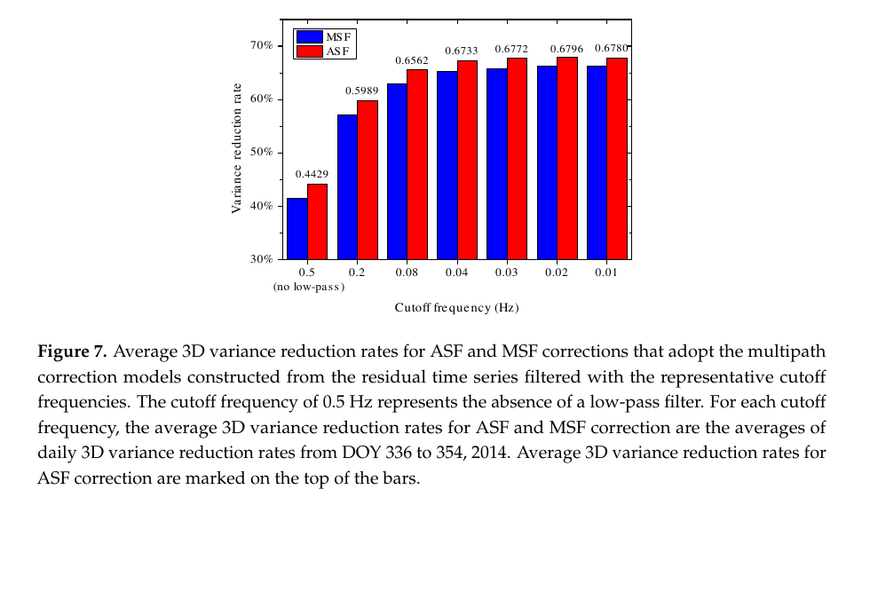
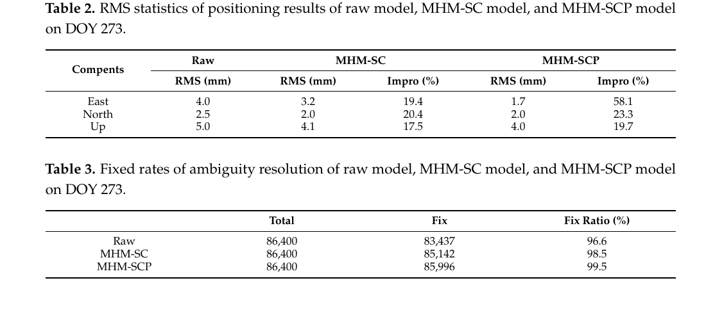
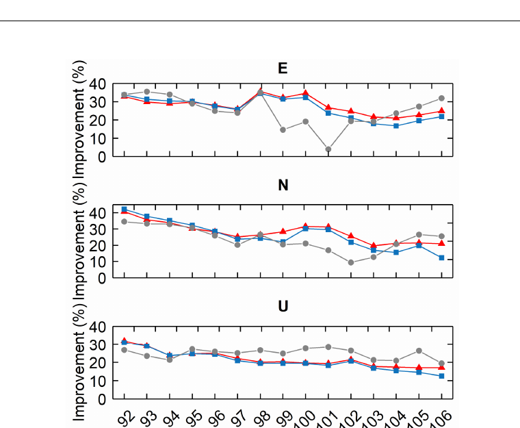

# 2026-09-07 GNSS 每日研究简报

## 今日快报

### 快报 1：GNSS 先扣地表形变，微重力才有资格讨论圣托里尼地下质量迁移

- 主题：`santorini-gravity-gnss-volcano-unrest`
- 来源 ID：`doi:10.1007/s00024-026-04085-x`
- 来源链接：https://doi.org/10.1007/s00024-026-04085-x
- 发表日期：2026-09-06
- 来源类型：Pure and Applied Geophysics 同行评审开放论文、重力/GNSS 火山监测
- 获取范围：CC BY 4.0 开放全文 10 页及补充材料说明；四期重力测量、GNSS 高程改正、模型与讨论边界已核对

**内容：** 研究在 Thera 与 Nea Kameni 布设 31 个重力点，以 Scintrex CG-6 完成 2023 年 9 月、2024 年 6 月、2025 年 2 月和 6 月四期测量，并用四个永久 GNSS 站估计地表升降对重力的自由空气效应。作者把网络平差后的时变重力、GNSS 形变、地震迁移和简化 Mogi/岩墙—流体模型并置，用来区分“地表抬升造成的视在重力变化”与“地下质量或密度变化”。

**结论：** 开放全文显示，2024 年 6 月已出现若干局地正重力异常，时间早于 2024 年下半年至 2025 年 1 月的主要膨胀；2025 年 2 月危机期间，膨胀转为快速退缩，震群向东北迁移。作者把浅部岩浆或热液流体沿裂隙侵入列为较可信解释，但也明确承认峰值膨胀期没有重力观测、海上延伸缺数据，而且点质量、岩墙与孔隙流体可产生非唯一响应，不能把相关时序当成唯一成因证明。

**关注理由：** GNSS 在这里不是最终定位产品，而是重力解释的必要改正与几何约束；这提醒形变监测工程必须把“测到了位移”和“知道了地下介质”分开陈述。

### 快报 2：船载重力遇到 GNSS 中断和干扰时，先切观测模式再切鲁棒滤波器

- 主题：`shipborne-gravimetry-gnss-anomaly-adaptive-filtering`
- 来源 ID：`doi:10.1038/s44172-026-00768-4`
- 来源链接：https://doi.org/10.1038/s44172-026-00768-4
- 发表日期：2026-09-05
- 来源类型：Communications Engineering 同行评审开放论文、船载 SINS/GNSS 重力实测
- 获取范围：出版者开放页面、完整摘要、方法概览与许可信息；正文下载受访问控制，本条不转述摘要之外的参数和分项数值

**内容：** 方法不是用同一个滤波器硬扛所有故障：GNSS 中断时转为 SINS/伪航速计组合，并以协方差匹配自适应 Kalman 滤波维持重力输出；GNSS 正常或受干扰时回到 SINS/GNSS 组合，以线性 Huber-M 鲁棒 Kalman 滤波降低异常量测的影响。

**结论：** 出版者摘要报告海上实测中断与干扰场景下总体表现优于所比较方法，并兼顾计算效率；由于本次未取得正文，本条不把摘要中的总体精度外推为任意航速、海况、惯导等级或更长中断时长下的保证。

**关注理由：** 真正的容错接收机链路往往需要“状态机 + 观测可用性判别 + 对应估计器”，而不只是把残差阈值调大；模式切换瞬间的协方差连续性仍是复现重点。

### 快报 3：永久站的载波相位残差会把天线周边地表与遮挡变化画成五类形状

- 主题：`antenna-environment-phase-residual-pattern-index`
- 来源 ID：`doi:10.1016/j.geog.2025.10.005`
- 来源链接：https://doi.org/10.1016/j.geog.2025.10.005
- 发表日期：2026-09
- 来源类型：Geodesy and Geodynamics 同行评审开放研究论文、Topo-Iberia 连续 GPS 质量分析
- 获取范围：2026 年 9 月卷期元数据与完整摘要；全文访问受限，本条不复述摘要之外的数值

**内容：** 作者用 GAMIT/GLOBK 处理多年连续 GPS，把电离层无关组合相位残差按高度角求均值，并把所得曲线与天线周边植被、平整反射面、岩石地表、屋顶和遮挡变化对应；进一步构造 phase residual pattern difference index（PRPDI），用于发现环境改变并区分较好与较差站点。

**结论：** 完整摘要给出五类残差形状：不平整且有植被的环境通常残差较小，平坦建筑屋顶附近通常较大；较高 PRPDI 与较差站点或遮挡天际线变化相伴。它是 Topo-Iberia 网络上的经验关联，不能单凭曲线把某个反射体唯一反演出来，也不能替代现场照片和设备变更记录。

**关注理由：** 长期站质量控制不应只看日 RMS；把残差按卫星高度角展开，可以在坐标时间序列明显恶化前暴露天线周边施工、积雪或植被变化。

### 快报 4：高原 ZTD 不宜只套全球高程项，GNSS 与 ERA5 要共同校准空间和垂向结构

- 主题：`xizang-gnss-era5-high-resolution-ztd-model`
- 来源 ID：`doi:10.1016/j.geog.2025.12.004`
- 来源链接：https://doi.org/10.1016/j.geog.2025.12.004
- 发表日期：2026-09
- 来源类型：Geodesy and Geodynamics 同行评审开放研究论文、区域 ZTD/PPP 验证
- 获取范围：2026 年 9 月卷期元数据与完整摘要；全文访问受限，因此结果仅作定性转述

**内容：** XZZM 将地基 GNSS 反演的 ZTD 与同期 ERA5 再分析融合成西藏区域高分辨率格网，并显式拟合垂向剖面，使高程归一化参数随空间与季节变化，而不是把一个全球常数从谷地搬到高山。

**结论：** 完整摘要称该模型相对全球经验模型改善了区域 ZTD 表征，并在 PPP 验证中带来垂向收益；由于正文未取得，本条不引用站数、格网间隔或改善百分比，也不把再分析期内结果当成实时天气、极端水汽过程或区域外性能保证。

**关注理由：** 对流层外部模型进入 PPP/PPP-RTK 前，必须分别验证时间外推、站点留一、高差外推和天气突变；空间分辨率更细并不自动意味着独立信息更多。

### 快报 5：滑坡监测 RTK 的多路径半球图中，单差建模在两组实景数据上优于双差建模

- 主题：`landslide-rtk-single-double-difference-mhm`
- 来源 ID：`doi:10.1016/j.geog.2026.07.011`
- 来源链接：https://doi.org/10.1016/j.geog.2026.07.011
- 发表日期：2026-08-21
- 来源类型：Geodesy and Geodynamics 同行评审开放研究论文、滑坡场景纯 GNSS RTK
- 获取范围：出版者元数据与完整摘要；正文接口仅返回核心元数据，本条不使用摘要之外的配置或数值

**内容：** 研究把实景滑坡监测站的历史残差投到方位角—高度角半球上，分别构建 single-differenced MHM（SD-MHM）与 double-differenced MHM（DD-MHM），再把对应方向的改正送回 RTK，重点比较低频多路径、码/相位残差和位置分量。

**结论：** 完整摘要报告两组数据均验证了多路径的空间可重复性，两种 MHM 都改善残差与 RTK 位置，且 SD-MHM 整体优于 DD-MHM；本条不转述摘要百分比，因为还需从正文核对建模天数、参考星切换、固定率和两场景的分项统计。

**关注理由：** 差分层级决定残差里混入多少参考星误差，也决定模型是否能跨参考星复用。工程上应把“建模域是否稳定”放在“改正幅度有多大”之前。

## 深度研读

### 深读 1｜接收机工程｜恒星日不是一个固定平移量：逐星回归地面轨迹，才能把异常重复周期隔离开

- 类别：`receiver-engineering`
- 学习层级：`foundation`
- 选题定位：`经典基础`
- 来源 ID：`doi:10.3390/ijgi7060228`
- 来源链接：https://doi.org/10.3390/ijgi7060228
- 发表日期：2018-06-20
- 来源类型：ISPRS International Journal of Geo-Information 同行评审开放论文、共钟双天线 GPS L1 实测
- 获取范围：CC BY 4.0 开放全文 22 页；两年轨道重复统计、20 天屋顶数据、公式、Figures 1—12 与附表已核对
- 价值评分：96/100（相关性 20，经典价值 19，证据 19，教学价值 20，工程价值 18）

#### 为什么先学这个

半球图把多路径记在空间里，恒星日滤波则把它记在时间里。先理解直达星下轨迹何时重走、残差怎样错位，才能知道下一节为何要从“一条时间模板”转向“方向格网”，也能避免把 23 h 56 min 当成每颗 GPS 卫星每天完全相同的移位。

#### 先修知识

需要理解载波相位、单差/双差、整数模糊度、短基线共同误差消除、卫星方位角与高度角、低通滤波、功率谱密度、方差与标准差，以及 multipath correction model 是从历史残差构造而非实时识别反射路径。

#### 一句话逻辑

对每颗卫星单独估计相邻日地面轨迹重复时间，把前一日低通后的单差残差按该时间平移，再从当日观测中扣除；异常轨道机动只污染本星模板，不拖坏所有卫星共用的平均恒星日。

#### 研究问题与约束

论文用一台共钟双天线接收机，天线间约 12.5 m，同型号、同朝向，连续采集 2014 年 DOY 335—354 的 1 Hz GPS L1；两年星历用于统计逐星重复时间。共钟单差大幅消去收发钟、轨道、大气与相位中心共同项，但仍保留一个近似历元恒定的硬件/电缆 bias，并且屋顶静态环境远比车辆、树叶摆动或移动反射体稳定。

#### 核心方法论

先逐历元固定模糊度并估计三维基线与 constant bias；为避免多路径被参数吸收，再把四个参数固定到日均值重算单差残差。每颗星以轨道坐标回归求相邻日重复时间，残差经低通后依本星时间平移形成 ASF；对照 MSF 则给所有星用平均重复时间。两者都只纠正历史中可重复、且未被滤掉的部分。

#### 关键公式逐步推导

共钟双天线的载波单差可写成：

```math
\Delta\phi^s(t)=\frac{1}{\lambda}\Delta\rho^s(t)+\Delta N^s+\frac{1}{\lambda}\Delta b+\frac{1}{\lambda}\Delta M^s(t)+\epsilon^s(t).
```

固定日均基线与 $`\Delta b`$ 后，重算残差 $`r^s(t)`$ 主要含可重复多路径 $`\Delta M^s/\lambda`$ 与噪声。若第 $`s`$ 星重复时间为 $`T_s`$，则当日改正近似为：

```math
\widehat{m}^{s}_{d}(t)=\operatorname{LPF}\{r^{s}_{d-1}(t-T_s)\},\qquad
\phi^{s}_{d,\mathrm{corr}}(t)=\phi^{s}_{d}(t)-\widehat{m}^{s}_{d}(t).
```

以未改正三维方差为基准，图中指标为：

```math
R_{3D}=\left(1-\frac{\sigma^2_{N,c}+\sigma^2_{E,c}+\sigma^2_{U,c}}{\sigma^2_{N,0}+\sigma^2_{E,0}+\sigma^2_{U,0}}\right)\times100\%.
```

#### 经典价值与创新边界

经典价值在于把“恒星日滤波”拆成逐星、逐轨道状态的问题，并用两年统计证明异常重复时间并非罕见。创新边界是它仍依赖静态反射环境、连续前一日数据与正确模糊度；单差残差还依赖共钟硬件，普通双接收机无法原样复制。

#### 整体逻辑链

共钟单差清除共同项；逐历元估计基线/偏差；固定日均参数重算更完整残差；逐星估计重复时间；低通分离慢变多路径与高频噪声；平移前一日模板；改正当日观测；与统一 MSF 比较；剔除异常周期卫星做归因；最后比较单日与七日平均模板。

#### 原文图表与结果分析



> 图表源：Wang 等《Advanced Sidereal Filtering for Mitigating Multipath Effects in GNSS Short Baseline Positioning》Figure 7，[DOI 页面](https://doi.org/10.3390/ijgi7060228)。由 CC BY 4.0 原始 PDF 第 9 页以 160 dpi 渲染，仅裁出原图与 caption；未重绘、改字或改变柱值。

横轴为低通截止频率（Hz），0.5 代表不低通；纵轴为相对未改正解的三维方差降低率。蓝/红柱分别为 MSF/ASF，红柱上直接标出的 ASF 值从 0.4429 上升到 0.02 Hz 时的 0.6796，进一步降到 0.01 Hz 反而略回落到 0.6780。图直接支持“去噪和保留多路径之间存在最佳点”，但不能说明 0.02 Hz 对其他采样率、动态平台或不同反射谱仍最佳。

#### 原文结果论述

两年中所有星重复时间都落在 86,145—86,165 s 的日期只占 28.81%；至少一星越界占 71.19%。19 个测试日采用 ASF 后，北、东、上标准差均值分别从 3.8/3.2/7.6 mm 降到 2.1/1.7/4.3 mm。剔除异常 PRN13 后，MSF 接近 ASF，但逐分量方差降低率的配对检验仍给出小于 0.01 的 p 值。单日前一日模板总体优于七日平均，因为较远日期的残差相关性下降；但卫星缺测时七日模板可补洞。

#### 常见误区与适用边界

第一，把恒星日与逐星轨道重复周期混成一个常数。第二，直接滤 post-fit 残差而不检查参数吸收。第三，把 0.02 Hz 当通用参数。第四，跨天发生天线移动、积雪、车辆停放仍沿用旧模板。第五，用七日平均期待必然降噪，却忽略模板失相关。第六，只看坐标 RMS，不看模糊度错误和改正后高频噪声。第七，把静态短基线结论外推到动态 RTK。

#### 工程实现步骤

1. 按卫星、频点维护原始观测与方位/高度角时间序列。
2. 用独立星历或轨道坐标估计每颗星的地面轨迹重复时间。
3. 先完成周跳、模糊度和硬件偏差质量控制。
4. 固定稳定几何参数后重算观测域残差。
5. 由训练日 PSD 选择低通截止频率，并记录相位延迟。
6. 将前一日残差插值到当日历元，缺口不外推。
7. 发生站点环境变化时失效旧模板。
8. 同时报坐标方差、改正覆盖率、固定率和尾部误差。

#### 复现实验设计

在开阔屋顶、单侧墙面和周期停车场各布一条 10—20 m 共钟短基线，1 Hz 连续采 30 d。比较无改正、统一 23 h 56 min、逐星 MSF/ASF、1/3/7 日模板；截止频率扫 0.005—0.1 Hz。第 15 天移动反射板，第 20 天制造 6 h 缺测。指标包括 ENU 标准差/P95、三维方差降低率、模板相关系数、覆盖率、错改历元和 CPU；失败判据为任一分量 P95 恶化或错误固定率上升。

#### 与定位及低成本实现的联系

ASF 只需历史残差、星历和一维滤波，适合固定低成本监测站离线建模、在线查表；但逐星时间模板随星数增加而膨胀。下一节的方位—高度格网把同一位置的多星样本合并，换来更紧凑的空间模型，同时引入格网污染的新风险。

#### 本节小结

逐星 ASF 的核心不是“每天减昨天”，而是正确对齐同一传播几何并只保留可重复低频项；它能隔离轨道周期异常，却无法处理变化的反射环境。

### 深读 2｜接收机工程｜半球图不是把残差求平均：先用物理上限剔大错，再让统计检验处理小错

- 类别：`receiver-engineering`
- 学习层级：`intermediate`
- 选题定位：`基础进阶`
- 来源 ID：`doi:10.3390/rs17050767`
- 来源链接：https://doi.org/10.3390/rs17050767
- 发表日期：2025-02-23
- 来源类型：Remote Sensing 同行评审开放论文、GPS 双频短基线 MHM 实测
- 获取范围：CC BY 4.0 开放全文 23 页；公式、两组短基线、Figures 1—24 与 Tables 1—5 已核对
- 价值评分：97/100（相关性 20，经典价值 18，证据 20，教学价值 20，工程价值 19）

#### 为什么先学这个

上一节默认历史残差足够干净，但半球格网会把许多历元压成一个均值：少量周跳或错误固定足以把改正表本身变成新故障源。本节把“物理可达范围、分布近似、显著性和样本量”串成有顺序的质控链，为第三节的多系统最近邻检索建立可信训练集。

#### 先修知识

需要理解双差码/相位方程、波长与相位延迟、LAMBDA 固定、正态分布的 3-sigma、F 检验、Z 检验、格网均值、方位角/高度角、码多路径会怎样间接破坏相位模糊度固定，以及改正模型与随机权模型的区别。

#### 一句话逻辑

先按载波最大多路径相位延迟 $`\lambda/4`$ 删除显然不可能的残差，使格网恢复近似正态，再用 3-sigma 与 F 检验清小异常，并用 Z 检验拒绝样本不足的格网。

#### 研究问题与约束

主试验使用 Curtin 大学 CUCC/CUT0 小于 10 m 基线，GPS 双频、1 Hz、2021 年 DOY 266—273，10° 截止高度角，RTKLIB 2.4.3 b34 连续 LAMBDA 固定；另以 M60/M63 约 11 m 变形监测基线验证遮挡环境。模型用前日或前若干日建表、次日改正，仍要求天线和周边反射体稳定。

#### 核心方法论

MHM-S 的顺序不可交换：先以载波反射模型给出绝对相位误差上限；再在每个格网内计算均值和标准差，3-sigma 标记候选，F 检验确认删除前后方差差异；最后用 Z 检验确定最少样本数 16。作者还区分只建相位表的 MHM-SC 与码/相位分别建表的 MHM-SCP，用以检验码多路径是否会经模糊度固定反作用于位置。

#### 关键公式逐步推导

直达与反射电压叠加的相位误差为 $`\psi`$。当反射相对相位达到半周 $`\Delta\varphi=\pi`$ 时，载波多路径相位误差上限对应：

```math
|\psi_m|=|\psi|\frac{\lambda}{2\pi}=\frac{\lambda}{4}.
```

通过物理门限后，第 $`i`$ 格网的第 $`j`$ 个残差以：

```math
|x_i^j-\bar{x}_i|>3s_i
```

标为候选，再比较含/不含该点的方差比 $`F=s^2_{i,2}/s^2_{i,1}`$ 是否显著。若格网通过质控且样本数 $`n_i\ge16`$，其改正为：

```math
\widehat{m}(e,a)=\frac{1}{n_i}\sum_{j=1}^{n_i}r_i^j,\qquad
l_{\mathrm{corr}}=l-\widehat{m}(e,a).
```

#### 经典价值与创新边界

价值在于用物理门限先修复统计检验的前提，而不是在明显重尾数据上反复调 sigma。边界是 $`\lambda/4`$ 只约束载波多路径相位误差，不是所有接收机粗差的通用上限；正态近似、独立样本和固定格网仍可能被时间相关残差破坏。

#### 整体逻辑链

短基线双差与固定模糊度；提取历史残差并投影格网；物理门限剔除大错；3-sigma 找小错；F 检验确认；Z 检验检查样本量；格网均值形成相位或码/相位 MHM-S；次日按星向查表改正；比较残差频谱、位置 RMS、固定率与建模天数。

#### 原文图表与结果分析



> 图表源：Zhou 等《A Multipath Hemispherical Map with Strict Quality Control for Multipath Mitigation》Tables 2—3，[DOI 页面](https://doi.org/10.3390/rs17050767)。由 CC BY 4.0 原始 PDF 第 19 页以 180 dpi 渲染，只裁出两张原表；未重绘、改字或改变数值。

Table 2 的三行是 East/North/Up，单位 mm；无改正、仅相位 MHM-SC、码相位 MHM-SCP 的 RMS 分别为 4.0/2.5/5.0、3.2/2.0/4.1、1.7/2.0/4.0。Table 3 直接给出 86,400 个历元中的固定数与固定率：96.6%、98.5%、99.5%（正文另写 99.53%，表内按一位小数）。它支持码表可解除东向一段错误固定，但只有单日、单基线，不能证明长期固定率或完整性风险必然改善。

#### 原文结果论述

PRN20 受异常值污染时，MHM-S 相对普通 MHM 的相位残差 STD 再降低 12.03%。DOY273 上 MHM-SCP 相对无改正的东/北/上 RMS 改善为 58.1%/23.3%/19.7%，而 MHM-SC 为 19.4%/20.4%/17.5%。用前 1—7 d 建模差异不大，四日模型略优；这反映该静态 GPS 场景的相邻日重复性，不等于“总要累积四天”。

#### 常见误区与适用边界

第一，在大异常存在时直接用均值和 3-sigma。第二，把 $`\lambda/4`$ 套到码观测。第三，先做 F 检验却不说明候选怎样产生。第四，把 16 个历元当 16 个独立样本。第五，只改相位却忽略码粗差会妨碍固定。第六，格网无样本时外插最近值。第七，报告固定率上升却不检查错误固定。第八，把毫米级静态短基线结果外推到移动端。

#### 工程实现步骤

1. 对每频点按实际波长计算载波物理门限。
2. 在固定解、周跳和创新检验通过后才收集建模残差。
3. 每格先做大错剔除，再计算稳健中心与尺度。
4. 用 3-sigma 标候选，并以 F 检验记录删除理由。
5. 检查有效样本数与时间覆盖，拒绝稀疏格网。
6. 码、相位分开建表并分别限幅。
7. 查询不到格网时回退为零改正或随机模型增方差。
8. 版本化天线位置、环境照片、建模日和失效日期。

#### 复现实验设计

在无遮挡、单墙、金属护栏三处各布 10 m GPS+Galileo 短基线，1 Hz 采 14 d；注入 0.2/0.5/1 周相位错、码粗差和 30 s 周跳，并移动一个反射板。比较普通 MHM、MAD 质控、MHM-S、码相位 MHM-SCP；格网扫 0.5°/1°/2°，最少样本扫 8/16/32。指标为每格污染率、查表覆盖率、残差 STD/PSD、ENU P50/P95、正确/错误固定率与环境变化后的退化时间。

#### 与定位及低成本实现的联系

格网建表可在服务器离线完成，终端只需按方位/高度查值，计算很轻；真正的低成本风险在训练残差质量和存储覆盖。下一节用多系统共频样本与 k-d tree 补稀疏格网，但若输入残差没经过本节质控，最近邻只会更快传播坏样本。

#### 本节小结

可靠 MHM 的关键不是格网分辨率，而是先保证“格内样本值得平均”；物理门限、统计检验和最小样本量分别处理不同层次的失败。

### 深读 3｜定位｜多系统共频样本填补半球空洞：k-d tree 让最近邻改正进入单频紧组合 RTK

- 类别：`positioning`
- 学习层级：`advanced`
- 选题定位：`先进纯 GNSS 定位`
- 来源 ID：`doi:10.3390/rs16244679`
- 来源链接：https://doi.org/10.3390/rs16244679
- 发表日期：2024-12-15
- 来源类型：Remote Sensing 同行评审开放论文、GPS/Galileo/BDS 单频紧组合短基线
- 获取范围：CC BY 4.0 开放全文 19 页；紧组合方程、25 天实测、Figures 1—16 与 Table 3 已核对
- 价值评分：97/100（相关性 20，经典价值 17，证据 19，教学价值 20，工程价值 21）

#### 为什么先学这个

ASF 对每颗星存时间模板，传统 MHM 对固定格网求均值；前者遇到多系统不同重复周期很繁琐，后者遇到稀疏星轨容易空格。本节把 GPS/Galileo/BDS 共频残差放入同一空间邻域，用 k-d tree 找最近样本，把前两节的“可重复几何”和“可信残差”推进到纯 GNSS 单频紧组合基线解。

#### 先修知识

需要理解跨系统双差、共同参考星、differential inter-system bias（DISB）、单频码/相位、LAMBDA、零均值约束下由双差恢复单差残差、KNN、k-d tree、周期方位角距离、DOP，以及残差精度改善不等于坐标绝对准确度。

#### 一句话逻辑

用一颗 GPS 星作 GPS/Galileo/BDS 共参考，恢复各星单差残差并在 $`(e,a)`$ 空间合并；查询时以 k-d tree 找最近历史方向的多路径值，避免传统细格网空洞和逐星 ASF 的异构重复周期负担。

#### 研究问题与约束

试验基线 12.92 m，基准站与流动站都在安徽理工大学楼顶；同型号接收机，2022 年 3 月 23 日至 4 月 16 日共 25 d、1 Hz，15° 截止高度角、PDOP 阈值 8，可见星通常在 20—30。研究针对准静态墙面/地面反射和重叠频点，短基线下忽略剩余大气；异型号接收机的 DISB 必须另估，动态场景不在证据范围。

#### 核心方法论

以 GPS 为跨系统共同参考星形成紧组合双差，使三系统共享一套基线状态并保留 DISB 项；固定模糊度后，用零均值约束把双差残差恢复为逐星单差残差。半球先分成 36×9 个 10°×10°粗区以缩小搜索，再在区内以高度角和方位角做 KNN 最近点查询；k-d tree 避免遍历全部历史样本，查到的多路径直接从双差观测扣除。

#### 关键公式逐步推导

紧组合线性化模型可压缩为：

```math
v=Ax+BN+Cd-L,
```

其中 $`x`$ 为三维基线，$`N`$ 为跨系统双差整数模糊度，$`d`$ 为需要时估计的 DISB。由双差残差 $`v_{i,r}=u_i-u_r`$ 恢复单差残差时，加权零均值约束 $`\sum_i w_i u_i=0`$，得到可投影到每颗星方向的 $`u_i`$。查询距离需处理方位角环绕：

```math
d_j^2=(e-e_j)^2+\min\{|a-a_j|,360^\circ-|a-a_j|\}^2,
\qquad \widehat m(e,a)=u_{j^*},\quad j^*=\arg\min_j d_j.
```

最后以 $`L_{\mathrm{corr}}=L-\widehat m`$ 重做模糊度固定和基线估计。若用多个邻点，应预先规定权重与最大搜索半径，不能把 KNN 名称当成已定义的插值器。

#### 经典价值与创新边界

价值在于把多系统互操作落实到残差空间和检索复杂度，并正面对比 ASF、传统 MHM 与改进 MHM。边界是跨系统共频多路径“足够相似”依赖天线、频率与接收机链路；零均值恢复会在卫星间重新分配参考误差，最近邻没有不确定度，10° 粗区边界还可能造成不连续。

#### 整体逻辑链

建立跨系统紧组合双差；处理 DISB；LAMBDA 固定；由双差恢复单差残差；按星向把 25 d 样本放入半球；10° 粗分区；k-d tree 建索引；查询最近方向改正；重算双差、固定与基线；按 GPS/BDS/Galileo/三系统比较；再与逐星 ASF 和 0.1°传统 MHM 做 15 d 连续坐标对照。

#### 原文图表与结果分析



> 图表源：Tao 等《Multipath Mitigation in Single-Frequency Multi-GNSS Tightly Combined Positioning via a Modified Multipath Hemispherical Map Method》Figure 16，[DOI 页面](https://doi.org/10.3390/rs16244679)。由 CC BY 4.0 原始 PDF 第 17 页以 180 dpi 渲染，仅裁出原图；未重绘、改字或改变曲线。

三幅图依次为 E/N/U，横轴 DOY92—106，纵轴相对未改正解的 precision improvement（%）；红三角、蓝方块、灰圆点分别是改进 MHM、ASF、传统 MHM。图直接显示改进 MHM 多数日期较平稳，传统 MHM 在东向 DOY101 和北向 DOY101 附近明显下探；但 U 向后段传统 MHM 常高于另外两法，因此不能概括成逐分量、逐日全胜。

#### 原文结果论述

正文对 Figure 16 的 15 d 汇总给出改进 MHM 的 E/N/U 平均改善 27.94%/28.06%/21.81%，相对 ASF 高 1.40/2.00/1.11 个百分点；传统 MHM 为 24.97%/23.85%/24.768%，因此 U 向平均反而比改进 MHM 高约 2.95 个百分点。逐星残差层面，改进 MHM 相对 ASF 对 GPS/BDS/Galileo 的平均改善高 10.20/10.77/9.29 个百分点。摘要另列一组 32.82%/40.65%/31.97%，正文 Figure 16 汇总口径不同；本简报不混合两组数值，也不自行推断差异来源。

#### 常见误区与适用边界

第一，把“同频”误写成不同频率多路径完全相同。第二，异型号接收机不估 DISB。第三，用欧氏方位角距离却忘记 0°/360°环绕。第四，查询无最大半径，让远处样本冒充局部反射。第五，只比较检索时间，不计建树、读盘和模型更新。第六，把 precision improvement 当 accuracy。第七，多星数增加就默认更好，忽略新增低仰角反射。第八，动态平台仍使用站心固定半球图。

#### 工程实现步骤

1. 选定重叠频点并校准跨系统硬件偏差。
2. 用正确固定、创新通过的历元生成单差残差。
3. 应用上一节的物理/统计质控并保存样本不确定度。
4. 将方位角用 $`(\sin a,\cos a)`$ 或周期距离表示。
5. 先按 10°粗区分桶，再为桶内样本建 k-d tree。
6. 定义 K、距离权、最大半径和无样本回退策略。
7. 查值后同时修正码/相位或明确只修相位。
8. 在固定率、错误固定、ENU 尾误差与查询耗时上做 A/B。
9. 环境变更后冻结在线使用并重建模型版本。

#### 复现实验设计

用 15 m 固定短基线采 GPS L1、Galileo E1、BDS B1C 30 d、1 Hz；前 10 d 建模、中间 10 d 冻结测试、后 10 d 移动反射板。比较 ASF、1°与 0.1°均值 MHM、K=1/3/5 的 k-d MHM，以及带最大半径的距离加权版本。基准为无改正紧组合 RTK。指标包括逐系统残差 RMS、ENU P50/P95、正确与错误固定率、无匹配率、单历元查询时延和模型内存；分层报告高度角、DOP、星数与环境变化前后性能。

#### 与定位及低成本实现的联系

建树可放在上位机，低成本终端只需加载压缩节点并查询；三系统共享空间样本可显著缓解单频轨迹稀疏。工程收益成立的前提是天线固定、方向姿态已知、训练样本通过严质控，并且查询失败能安全回退而不是强行套改正。

#### 本节小结

多系统 k-d MHM 解决的是“怎样更快找到相近传播几何的可信历史误差”，不是实时看见反射体；其 RTK 价值来自空间复用、紧组合和可靠回退三者共同成立。
