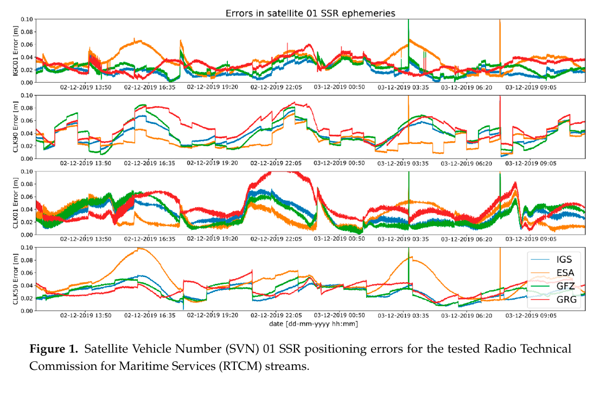
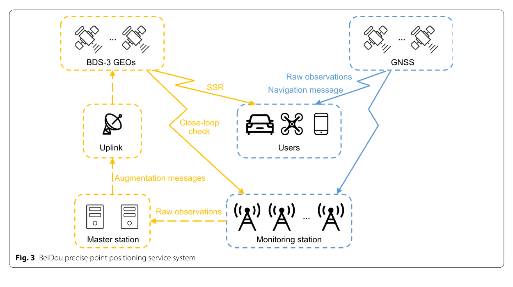
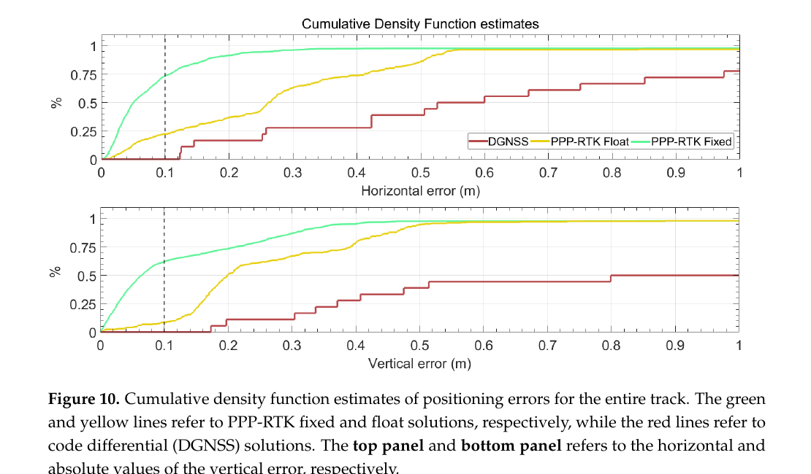

# 2026-09-08 GNSS 每日研究简报

## 今日快报

### 快报 1：LEO 钟差预测不只要差分平稳，还要阻止积分重构把小偏差一路累加

- 主题：`leo-clock-bias-reconstruction-finetuning`
- 来源 ID：`doi:10.1186/s43020-026-00215-x`
- 来源链接：https://doi.org/10.1186/s43020-026-00215-x
- 发表日期：2026-09-07
- 来源类型：Satellite Navigation 同行评审开放论文、LEO 卫星钟差预测
- 获取范围：CC BY 4.0 开放全文 21 页；GRACE-FO C/D 钟差数据、差分策略、训练/测试划分、消融与结论已核对

**内容：** 常规单差不能完全压平 GRACE-FO 星载振荡器的高阶趋势，而神经网络在差分域预测后再累加回原域，又可能把同方向小误差变成重构漂移。论文比较“单差 + 分段标准化”和直接二阶差分，并在预训练后加入原域重构微调，使损失函数显式看见最终钟差而不只看差分序列。

**结论：** 独立测试集按 70%/10%/20% 划分，GRACE-FO C/D 分别保留 4316/4157 个测试样本组。作者报告微调使总体预测误差下降约 6%—16%；相对频谱分析模型，60 min 与 10 min 预测总体精度约改善 90% 与 94%。60 min 末端误差为 0.84/1.42 ns，10 min 为 0.10/0.15 ns。证据只来自两颗 GRACE-FO 卫星的历史钟产品，尚未证明跨钟型、在轨异常或实时产品时延下仍成立。

**关注理由：** LEO 增强 GNSS 需要把钟预测误差连同协方差送进 PPP，而不是只交一个点预测；“差分域很好看、积分后漂掉”也是接收机钟、相位连续性与惯导增量网络的共同陷阱。

### 快报 2：手机地籍 App 的最好结果仍是米级，适合参与式农村制图不等于能定权属边界

- 主题：`smartphone-app-ffp-cadastral`
- 来源 ID：`doi:10.1007/s12518-026-00785-0`
- 来源链接：https://doi.org/10.1007/s12518-026-00785-0
- 发表日期：2026-09-07
- 来源类型：Applied Geomatics 同行评审开放论文、手机 GNSS 应用实测
- 获取范围：CC BY 4.0 开放全文 13 页；应用筛选、DGNSS 参考、统计检验与适用边界已核对

**内容：** 研究先在相似环境下测试 10 个手机 GNSS 应用，以 DGNSS 坐标为参考；两款因持续极端偏差和不稳定而剔除，再对余下八款以偏差、RMSE、置信区间和 Kruskal–Wallis 检验比较，目标是“fit-for-purpose”地籍快速建库而非测量级放样。

**结论：** Mobile Topography 的平均偏差 2.83 m、95% 置信区间 1.57—4.09 m、标准差 1.20 m，RMSE 最低为 3.03 m，满足作者采用的农村 FFP 不超过 5 m 门槛；其余应用差异显著，部分远超门槛。样本设备、应用版本、观测环境和地方地籍容差会共同限定结论，论文不能支持手机单点坐标直接替代法律边界测量。

**关注理由：** 低成本定位的验收指标必须从用途倒推。三米对农村底图可能“够用”，对界址争议、机器控制或车道级导航则完全不够；App 名称也不是可复现算法说明。

### 快报 3：静态 GNSS 的轻量前馈网络在 10 m 以上合成误差才稳定获益

- 主题：`static-gnss-fnn-error-compensation`
- 来源 ID：`doi:10.3390/geosciences16090356`
- 来源链接：https://doi.org/10.3390/geosciences16090356
- 发表日期：2026-09-05
- 来源类型：Geosciences 同行评审开放论文、合成静态 GNSS 误差补偿
- 获取范围：CC BY 4.0 开放全文 11 页；MATLAB/Simulink 数据生成、45 隐层神经元、敏感性试验与限制已核对

**内容：** 作者围绕已知静态坐标合成受扰位置，用相邻坐标差作为输入，训练一个含 45 个隐层神经元、采用 Levenberg–Marquardt 的前馈网络估计三维误差；随后把它与随机森林、XGBoost、LSTM 和 GRU 在同一数据划分上作初步比较。

**结论：** 在主设定 $`R_{95}=10\ \mathrm{m}`$ 下，网络使时间离散度约下降 46%，校正点云更集中；扫描 $`R_{95}=1,5,10,15,20\ \mathrm{m}`$ 时，10 m 及以上的 RMSE/标准差改善较一致，低误差档却没有稳定收益。全部观测由模拟生成，且相邻差分可能把特定生成过程泄漏给模型，因此它是轻量可行性证明，不是对真实多路径或动态接收机的性能声明。

**关注理由：** 学习型改正必须与“不改正”和简单滤波在不同误差幅度上逐档比较；否则网络可能只是在大噪声场景里做平滑，却在本来较好的观测上制造偏差。

### 快报 4：电离层梯度既要看标量强度，也要保留扰动前沿的传播方向

- 主题：`gradient-ionosphere-index-magnitude-vector`
- 来源 ID：`doi:10.1007/s10291-026-02143-4`
- 来源链接：https://doi.org/10.1007/s10291-026-02143-4
- 发表日期：2026-09-03
- 来源类型：GPS Solutions 同行评审开放论文、GNSS TEC 梯度监测
- 获取范围：CC BY 4.0 开放全文 16 页；约 400 个 EPN 站、GIXM/GIXV 定义、2015/2024 磁暴案例和预测边界已核对

**内容：** GIXM 对不同站—星链路的绝对 TEC 梯度作卫星分组后的标量平均，用于刻画区域扰动强度；GIXV 则先把梯度投影到东西/南北方向再矢量合成，保留电离层前沿的方向。作者以 50—500 km 电离层穿刺点对、350 km 单层高度假设和欧洲站网，与工程 I95 指数及 ROTI 对照。

**结论：** GIXM 与 I95 在 2015-03-17 和 2024-05-10 磁暴中表现出相似时序；稳定求 GIXV 方向通常需 35—45 个分布良好的穿刺点。矢量平均在安静期能抵消随机方向梯度，但稀疏或方位不均会产生方向偏差；由高纬前沿向赤道追踪得到的“预测潜力”仍是区域案例，不等于已验证的业务告警命中率。

**关注理由：** PPP-RTK 的电离层改正协方差不能只随基线长度增长；遇到传播中的梯度前沿，还应引入方向、尺度和时间演化，否则同一距离的用户风险可能完全不同。

### 快报 5：改正产品缺什么就降一级运行，优于把 PPP-RTK 固定标志硬撑到失效

- 主题：`multi-tier-ppp-rtk-product-availability`
- 来源 ID：`doi:10.3389/fspas.2026.1973781`
- 来源链接：https://www.frontiersin.org/journals/astronomy-and-space-sciences/articles/10.3389/fspas.2026.1973781/abstract
- 发表日期：2026-08-31（接受日期；最终排版版待发布）
- 来源类型：Frontiers in Astronomy and Space Sciences 已接收原创研究、实时多层 PPP-RTK
- 获取范围：出版者已接收条目预览、完整摘要、作者与许可信息；最终排版正文尚未发布，因此本条不补写摘要之外的配置细节

**内容：** 方法按终端实际拿到的服务端产品，把同一未差未组合框架组织成 SPP、PPP、PPP-AR 与 PPP-RTK 四层，并在服务端平台与嵌入式终端之间实现端到端实时链路。由这种分层做出的工程推论是：产品中断或缺项时可退到仍有模型闭合的一层；摘要本身尚不足以证明自动切换逻辑已经覆盖全部失效模式。

**结论：** 摘要报告 PPP-RTK 层水平/三维 RMS 为 0.72/1.78 cm，平均收敛 7.08 s；PPP-AR 与 PPP 分别收敛 4.27/15.98 min，40 次强制热启动后 PPP-RTK 平均 4.53 s 恢复固定。由于最终全文未上线，本条不判断参考真值、场景覆盖、置信区间或失败历元是否足以支持安全完整性，只把这些数字视为作者摘要中的系统实测结果。

**关注理由：** 连续性工程需要把“当前用了哪些改正、对应哪一级能力”做成可审计状态机；位置精度、收敛时间与产品可用率应同时上报。

## 深度研读

### 深读 1｜接收机工程｜SSR 不是直接加到坐标上：先把轨道坐标系改正投回卫星，再验证用户域误差

- 类别：`receiver-engineering`
- 学习层级：`foundation`
- 选题定位：`经典基础`
- 来源 ID：`doi:10.3390/s20133791`
- 来源链接：https://doi.org/10.3390/s20133791
- 发表日期：2020-07-06
- 来源类型：Sensors 同行评审开放论文、IGS 实时 SSR 产品评估
- 获取范围：CC BY 4.0 开放全文 22 页；四条 2019 年 RTCM 流、四套最终产品、卫星域/PPP/SPP 三层试验已核对
- 价值评分：95/100（相关性 20，经典价值 18，证据 19，教学价值 20，工程价值 18）

#### 为什么先学这个

PPP-RTK 的第一层不是整数固定，而是把广播星历变成足够准确且定义一致的卫星轨道与钟。若把径向、沿轨、法向改正当 ECEF 分量，或混用卫星质心与天线相位中心，后面的“厘米级”会建立在错误几何上。本节先把 SSR 从消息参数还原成用户观测中的距离改正。

#### 先修知识

需要理解 ECEF 坐标、广播星历、卫星速度、径向/沿轨/法向坐标系、卫星钟差、光速、视线单位向量、RTCM SSR 的 issue-of-data 一致性，以及 SPP 与 PPP 对码/相位和精密产品的不同依赖。

#### 一句话逻辑

用广播轨道构造卫星局部正交基，把 SSR 轨道三分量旋回 ECEF 并连同钟改正施加到同一 issue-of-data 的广播状态；随后既在卫星域对最终产品，也在接收机 PPP/SPP 域对真实坐标验证。

#### 研究问题与约束

论文选择 IGC01、CLK01、CLK50、CLK90 四条 GPS 实时流，轨道/钟更新率分别为 10 s 或 5 s，并与 IGS、ESA、GFZ、GRG 最终产品交叉比较。PPP 部分覆盖 33 d、10 个分布式站，产生近 300 万个定位结果；SPP 用 HERT 站 24 h、1 s 数据。数据来自 2019 年，流生成器、星座覆盖和今天的实时服务状态不可据此推断。

#### 核心方法论

从广播位置 $`\mathbf X_b`$ 与速度构造径向 $`\mathbf e_r`$、沿轨 $`\mathbf e_a`$ 和法向 $`\mathbf e_c`$，形成旋转矩阵 $`\mathbf E`$；把 SSR 轨道向量 $`\delta\mathbf O`$ 转成 ECEF 改正，再从广播位置扣除。钟改正是 RTCM 给出的多项式值 $`\delta C`$，以距离单位除以光速转成时间。作者强调同一条流在不同分析中心最终产品下会得到不同“卫星域真值”，所以又把改正送进 PPP/SPP 检查用户域后果。

#### 关键公式逐步推导

卫星状态改正为：

```math
\mathbf X_s=\mathbf X_b-\delta\mathbf X,
\qquad t_s=t_b-\frac{\delta C}{c},
\qquad \delta\mathbf X=\mathbf E\,\delta\mathbf O.
```

若 $`\mathbf u=(\mathbf X_s-\mathbf X_r)/\rho`$ 是接收机指向卫星的单位向量，小轨道误差对几何距离的一阶影响近似为：

```math
\Delta\rho_{\mathrm{geom}}\approx-\mathbf u^{\mathsf T}\delta\mathbf X,
\qquad
\Delta\rho_{\mathrm{clock}}\approx+\delta C,
\qquad
\Delta\rho_{\mathrm{SSR}}\approx \Delta\rho_{\mathrm{geom}}+\Delta\rho_{\mathrm{clock}}.
```

第二式说明三维轨道误差不会等量进入用户距离，投影几何与钟误差符号必须一起检查。

#### 经典价值与创新边界

经典价值是把产品评估拆成卫星位置、卫星钟与用户位置三域，并展示“卫星域平均误差较小”不保证各 PPP 流表现相同。边界是论文只测 GPS、四条历史流，且把选定最终产品当参考；这些最终产品并非无误差真值，同分析中心产品之间还可能相关。

#### 整体逻辑链

接收 RTCM 流；核对 issue-of-data；由广播星历算位置/速度；构造轨道局部基；施加轨道与钟改正；对四套最终产品算卫星残差；将同一改正送入 33 d PPP；比较 ENU/3D RMS；再用 24 h SPP 检查相对广播星历的收益；最后按流和参考产品解释差异。

#### 原文图表与结果分析



> 图表源：Pelc-Mieczkowska 与 Tomaszewski《Space State Representation Product Evaluation in Satellite Position and Receiver Position Domain》Figure 1，[DOI 页面](https://doi.org/10.3390/s20133791)。由 CC BY 4.0 原始 PDF 第 6 页以 180 dpi 渲染，仅裁出原图与 caption；未重绘、改字或改变曲线。

横轴是 2019-12-02 至 12-03 的时间，纵轴是 SV 01 位置误差（m，0—0.10）；四行依次为 IGC01、CLK90、CLK01、CLK50，蓝/橙/绿/红分别以 IGS、ESA、GFZ、GRG 最终产品作参考。曲线显示参考产品选择可改变同一实时流的误差排序，例如 CLK50 对 ESA 的橙线出现接近 0.10 m 的周期峰值。图直接证明“评估基准不是中性的”，但只是单星时间序列，不能代表全星座均值或最终用户坐标。

#### 原文结果论述

全体卫星的轨道位置平均误差约 3—5 cm、总体优于 10 cm，钟残差均值约 2—17 cm。接收机域揭示更大区别：10 站 PPP 的平均 3D RMS，IGC01/CLK01/CLK50/CLK90 分别为 0.32/0.17/0.15/0.13 m；24 h SPP 中，广播星历北/东平均绝对残差为 2.87/3.07 m，CLK90 为 0.85/1.34 m，垂向由 5.75 m 降至 1.46 m。后者还包含未建模电离层等误差，不能把全部改善归于轨道一项。

#### 常见误区与适用边界

第一，把 RAC 改正直接当 XYZ。第二，忽略 CoM/APC 参考点。第三，轨道与钟消息 issue-of-data 不一致仍拼接。第四，用同分析中心最终产品评估同源实时流而不承认相关性。第五，只报卫星三维误差，不做视线投影与用户域测试。第六，把 2019 年流排序当作今天的服务排名。第七，用 SPP 改善倍数声称 PPP-RTK 固定能力。

#### 工程实现步骤

1. 记录每条流的生成中心、参考点、更新率、IOD 与延迟。
2. 按 GNSS ICD 计算广播位置、速度与钟，不跨 IOD 外推。
3. 正交化 RAC 基并以单元测试核对符号。
4. 先用最终轨钟做离线卫星域残差，再用站坐标做用户域残差。
5. 分离 orbit-only、clock-only 与 combined 三种实验。
6. 按卫星、仰角、延迟、日界与机动事件统计尾部误差。
7. 把改正龄期和质量指示映射到观测协方差。
8. 超龄或不一致时降级，禁止沿用旧固定状态。

#### 复现实验设计

选 10 个全球 IGS 站，连续 30 d 保存两条独立 SSR 流与原始 RTCM，1 Hz 解码、30 s 定位。比较广播、orbit-only、clock-only、完整 SSR 的 SPP 与浮点 PPP；以两个独立最终产品交叉评估。指标为 RAC/钟 SISRE、改正龄期、ENU RMS/P95/P99.9、收敛时间与断流后退化斜率。人为加入 5/15/60 s 延迟、IOD 错配和 10 min 断流；任一静默错配未被状态机拒绝即判失败。

#### 与定位及低成本实现的联系

低成本接收机不一定需要自己估全球轨钟，却必须正确解码、投影和老化外部产品。完成这一步后，下一节才能讨论服务端还应估哪些偏差与大气量、哪些量在用户端应改正、约束或继续估计。

#### 本节小结

SSR 的价值来自“状态定义一致 + 正确坐标变换 + 用户域验证”，而不是消息到达本身；厘米级卫星产品也会因参考点、延迟、基准和投影错误变成米级用户故障。

### 深读 2｜接收机工程｜服务端估误差、用户端估坐标：PPP-RTK 快收敛靠的是参数角色闭合

- 类别：`receiver-engineering`
- 学习层级：`intermediate`
- 选题定位：`基础进阶`
- 来源 ID：`doi:10.1186/s43020-022-00089-9`
- 来源链接：https://doi.org/10.1186/s43020-022-00089-9
- 发表日期：2022-12-06
- 来源类型：Satellite Navigation 同行评审开放综述、PPP-RTK 原理与系统
- 获取范围：CC BY 4.0 开放全文 22 页；观测模型、服务端参数提取、空间插值、用户约束、公开/商业服务表已核对
- 价值评分：97/100（相关性 20，经典价值 19，证据 19，教学价值 20，工程价值 19）

#### 为什么先学这个

上一节只处理全球相关的轨道与钟，但快速固定还需要相位偏差和区域大气改正。关键不是“多发几种数”，而是同一不可估基准在服务端与用户端采用兼容定义：服务端固定参考站坐标并估误差，用户端改正或约束这些误差后才释放坐标与整数模糊度。

#### 先修知识

需要掌握码与载波相位观测方程、电离层正负号、湿对流层映射、接收机/卫星钟、码/相位硬件偏差、宽巷与窄巷、未差未组合模型、整数模糊度，以及随机约束不是把参数“当成完全已知”。

#### 一句话逻辑

参考网通过 PPP-AR 把轨钟、卫星码/相位偏差和站点大气从观测中分离并空间建模；用户以同一基准改正偏差、以带方差伪观测约束大气，留下可估坐标与更接近整数的模糊度。

#### 研究问题与约束

这是一篇截至 2022 年的综述，比较电离层无关与未组合、UPD/整数钟/解耦钟等路线，并梳理 CLAS、HAS、PPP-B2b 和商业系统。其公式提供统一教学框架，但表中的服务阶段与目标值会随运营更新；综述汇总的不同试验也不共享站网、真值、收敛门槛或概率口径，不能横向当排行榜。

#### 核心方法论

服务端固定参考站坐标，估湿对流层、电离层、卫星钟和相位偏差；码偏差通常先由产品改正。大气量在多个参考站上求出后，可按改进线性组合、最小二乘配置或格网多项式插值。用户端以服务产品改正卫星偏差，对电离层/对流层引入均值与方差，保留坐标、接收机钟和整数模糊度估计。宽巷先固定，再向窄巷级联。

#### 关键公式逐步推导

未差未组合的码与相位可概括为：

```math
P_{r,j}^{s}=\rho_r^s+c(dt_r-dt^s)+T_r^s+I_{r,j}^s+d_{r,j}-d_j^s+e_{r,j}^s,
```

```math
L_{r,j}^{s}=\rho_r^s+c(dt_r-dt^s)+T_r^s-I_{r,j}^s
+\lambda_j N_{r,j}^s+\lambda_j(b_{r,j}-b_j^s)+\varepsilon_{r,j}^s.
```

服务端广播的大气改正不是绝对真值，用户应把它作为随机伪观测：

```math
\ell_I=I_{r,j}^s-\widehat I_{m,j}^s=\omega_I,
\quad \omega_I\sim\mathcal N(0,\sigma_I^2),
\qquad
\ell_T=T_r^s-\widehat T_m^s=\omega_T,
\quad \omega_T\sim\mathcal N(0,\sigma_T^2).
```

若把 $`\sigma_I,\sigma_T`$ 错设为零，空间失配会被强迫吸收到坐标、钟和模糊度中。

#### 经典价值与创新边界

价值在于把众多 PPP-RTK 名称还原到共同的可估参数与服务端/用户端分工，并强调 SSR 相对 OSR 的状态可复用性。边界是综述本身没有统一重跑全部算法，且 2022 年对 HAS、PPP-B2b、CLAS 的服务描述具有时代性；今天实现应回到最新 ICD，而非照抄表格。

#### 整体逻辑链

参考站观测入网；统一轨钟与偏差基准；服务端 PPP-AR；固定宽巷/窄巷；回代提取逐星电离层与站点湿延迟；做区域空间模型和残差格网；编码 SSR；卫星/互联网播发；用户解码并按产品协方差约束；级联固定；输出坐标与保护状态；监测站闭环验证。

#### 原文图表与结果分析



> 图表源：Li 等《Review of PPP–RTK: achievements, challenges, and opportunities》Figure 3，[DOI 页面](https://doi.org/10.1186/s43020-022-00089-9)。由 CC BY 4.0 原始 PDF 第 9 页以 180 dpi 渲染，仅裁出原图与 caption；未重绘、改字或改变连线。

该图没有数值坐标轴，而是信息流：右上 GNSS 向用户与监测站提供原始观测/导航电文；监测站原始观测进入主站，主站生成 augmentation messages 经上行链路送到 BDS-3 GEO，再以 SSR 单向播给用户；另有 GEO—监测站闭环检查。它直接说明“生成、播发、使用、独立监测”是四个环节；但图是体系结构示意，不证明带宽、延迟、精度或可用率。

#### 原文结果论述

综述给出的典型流程是服务器用 PPP-AR 提取大气，用户以外部约束加速模糊度固定；小网研究曾给电离层约束 5 mm—1 cm，而 50 km 量级区域示例采用 10—14 cm，说明协方差必须随网络尺度与活动状态改变。文中汇总的 CLAS 静态水平/垂直 95% 指标为不超过 6/12 cm、动态为 12/24 cm，但这些是特定服务口径，不能外推到任意接收机与遮挡场景。

#### 常见误区与适用边界

第一，把 SSR 与 PPP-RTK 当同义词；只有轨钟通常还是 PPP。第二，认为相位偏差改正后所有模糊度自动成整数。第三，把区域大气当确定数。第四，服务端与用户端混用信号、钟或偏差基准。第五，网外用户继续使用网内协方差。第六，把服务目标值当独立实测。第七，只有主站自检，没有监测站和降级路径。

#### 工程实现步骤

1. 为每种消息列出状态、单位、参考点、符号、IOD 与更新率。
2. 写出服务端与用户端完整参数表，标明 fix/estimate/correct/constrain。
3. 用零空间或秩检验确认基准定义闭合。
4. 以留一站残差估计大气产品方差，而非只用拟合内残差。
5. 级联固定时保存宽巷、窄巷各自成功率与验证统计量。
6. 建独立监测站重放真实消息链路。
7. 产品缺失、超龄或监测失败时按状态机退到 PPP-AR/PPP/SPP。
8. 将当前层级、改正龄期和未使用产品写入输出日志。

#### 复现实验设计

构建 8—12 站、间距 20/60/150 km 的三种区域网，选 5 个网内和 3 个网外用户站，连续处理安静日电离层与磁暴日。比较轨钟 PPP、加相位偏差 PPP-AR、硬约束大气 PPP-RTK、距离定权和留一交叉验证定权 PPP-RTK。指标为产品 RMS/P95、TTFF、错误固定率、ENU P95、消息带宽和超龄退化；断掉电离层、对流层或相位偏差流，检查层级是否正确降级。

#### 与定位及低成本实现的联系

低成本终端最稀缺的是连续相位、计算与链路预算。SSR 让终端只接收可复用状态，但真正收益取决于服务器是否把最难估的区域大气和偏差做成带质量信息的产品。下一节用现成商业 PPP-RTK 服务与低成本 ZED-F9P 验证这条链在城市车载条件下能走到哪一步。

#### 本节小结

PPP-RTK 快收敛来自参数角色分工：服务端估公共误差，用户端估自身状态；任何未定义基准、过硬大气约束或缺失的质量标志都会破坏这份分工。

### 深读 3｜定位｜低成本 PPP-RTK 的关键不是峰值厘米，而是固定、浮点、降级三种状态各占多久

- 类别：`positioning`
- 学习层级：`advanced`
- 选题定位：`定位深入`
- 来源 ID：`doi:10.3390/s24020646`
- 来源链接：https://doi.org/10.3390/s24020646
- 发表日期：2024-01-19
- 来源类型：Sensors 同行评审开放论文、纯 GNSS 低成本车载 PPP-RTK/IoT 原型
- 获取范围：CC BY 4.0 开放全文 19 页；ZED-F9P/PointPerfect/SPARTN 链路、7.9 km 城市车试、PPK 真值、Figure 10 与 Table 2 已核对
- 价值评分：98/100（相关性 20，经典价值 18，证据 20，教学价值 20，工程价值 20）

#### 为什么先学这个

前两节说明了改正怎样形成与进入用户滤波器，本节把焦点移到可交付产品：同一终端会在 fixed、float 和 DGNSS 间切换。若只挑固定段的 0.112 m 水平 RMS，就会掩盖城市遮挡下 19.2% 浮点和 1.3% 降级历元。

#### 先修知识

需要理解 PPP-RTK、整数/浮点模糊度、SSR/SPARTN、CDF、均值/标准差/RMS、水平误差与有符号垂向误差、PPK 真值、天线相位中心对准、参考框架历元转换，以及 solution availability 与 accuracy 的区别。

#### 一句话逻辑

用低成本双频 ZED-F9P 接收商业轨钟、偏差与大气改正，以双测地接收机 PPK 重建低成本天线逐历元真值，再把 fixed/float/DGNSS 三种输出分别统计，检验精度目标与时间占比能否同时满足。

#### 研究问题与约束

原型由 C099-F9P/ZED-F9P、ANN-MB 天线、迷你 PC、5G 与 PointPerfect 组成；IP 链路中钟改正每 5 s，轨道/偏差/大气每 30 s。2023-07-19 在意大利那不勒斯完成 7.9 km、约 20 min、0—35 km/h、1 Hz 的单次车试，路线含开阔区、建筑与树木街谷。两台 Topcon Hiper HR 加本地基站做 PPK 真值并归算天线杆臂；仍没有多日、雨雪、长断网或跨城市检验。

#### 核心方法论

终端实时消费 SPARTN 2.0，输出每历元坐标与解状态；因服务产品是 ITRF2014 当前历元，而地面参考为 ETRF2000/2008.0，先作框架/历元转换。PPK 由杆上两台测地接收机计算低成本天线安装点真值。误差按 fixed、float、DGNSS 分组，分别给出数量、比例、均值、标准差、RMS 和 CDF，再核对“0.3 m 内 90% 时间”等需求，而非把不同状态混成一个平均数。

#### 关键公式逐步推导

逐历元三维误差先转到 ENU：

```math
\Delta\mathbf p_k=\mathbf R_{\mathrm{ECEF}\rightarrow\mathrm{ENU}}
(\widehat{\mathbf X}_k-\mathbf X_k^{\mathrm{PPK}}),
\qquad e_{H,k}=\sqrt{e_{E,k}^2+e_{N,k}^2}.
```

对状态 $`q\in\{\mathrm{fixed,float,DGNSS}\}`$，分别计算：

```math
\mu_q=\frac{1}{n_q}\sum_{k\in q} e_k,
\quad
\sigma_q=\sqrt{\frac{1}{n_q-1}\sum_{k\in q}(e_k-\mu_q)^2},
\quad
\mathrm{RMS}_q=\sqrt{\frac{1}{n_q}\sum_{k\in q}e_k^2}.
```

可用率必须带阈值：$`A_q(0.3)=n_q^{-1}\sum_{k\in q}\mathbf 1(|e_k|<0.3\ \mathrm m)`$，不能用 fixed 比例代替误差达标比例。

#### 经典价值与创新边界

价值是把 PPP-RTK 从算法论文推进到硬件、改正链、API、框架转换、真值与状态化统计的完整原型，并用低成本天线/接收机实车验证。创新边界是服务与解算器为商业黑盒，复现者无法完全审计滤波和固定策略；单条 20 min 路线也不足以给出运营级尾部风险。

#### 整体逻辑链

接收多系统双频观测；通过 5G 获取 SPARTN；按龄期应用轨钟/偏差/大气；ZED-F9P 输出 fixed/float/DGNSS；Python 服务解析并提供 API；同步两台测地接收机；PPK 与杆臂归算真值；统一参考框架；逐历元算 ENU；按解状态分组；画 CDF/直方图；核对精度和 90% 可用率需求。

#### 原文图表与结果分析



> 图表源：Amalfitano 等《Designing and Testing an IoT Low-Cost PPP-RTK Augmented GNSS Location Device》Figure 10，[DOI 页面](https://doi.org/10.3390/s24020646)。由 CC BY 4.0 原始 PDF 第 13 页以 180 dpi 渲染，仅裁出原图与 caption；未重绘、改字或改变曲线。

上图横轴为水平误差（m），下图为垂向绝对误差（m），纵轴标成百分比但数值 0—1，实际应按经验累计比例读取；虚线为 0.1 m。绿色 fixed 曲线在水平 0.1 m 约到 0.75、0.3 m 约到 0.96；垂向相应约 0.62 与 0.87。黄色 float 在 0.3 m 水平/垂向约 0.63/0.67，红色 DGNSS 只有 18 个历元，阶梯粗且不能稳定估尾部。图支持“固定显著更集中”，却不能证明固定标志永不误固定。

#### 原文结果论述

1378 个解中 fixed 1095（79.5%）、float 265（19.2%）、DGNSS 18（1.3%）。fixed 的水平均值/标准差/RMS 为 0.077/0.080/0.112 m，float 为 0.310/0.240/0.392 m；fixed 垂向为 0.052/0.163/0.171 m，float 为 0.272/0.471/0.546 m。全状态混合水平 RMS 0.222 m、垂向 0.427 m。作者静态试验另报约 94% 时间固定，但它与本次动态 79.5% 不能混用。

#### 常见误区与适用边界

第一，只报 fixed 段而删掉 float/降级。第二，把接收机 fixed 标志当正确固定真值。第三，把 20 min 路线称长期可用率。第四，忽略 ITRF/ETRF 与历元转换。第五，DGNSS 仅 18 点仍估平滑 CDF。第六，把商业服务表现归因于单一算法。第七，0.3 m 阈值达标就声称完整性。第八，把水平结论直接复制到垂向。

#### 工程实现步骤

1. 保存原始观测、完整改正消息、解状态与每类改正龄期。
2. 统一天线参考点、杆臂、时间系统和参考框架历元。
3. 对 fixed 做独立残差/比率/保护门控，不盲信状态字。
4. 分状态统计数量、连续时长、误差 CDF 与切换瞬态。
5. 将 0.1/0.3 m 阈值分别用于精度和可用率验收。
6. 断网时按钟、轨道、偏差、大气的不同老化率降权。
7. 输出 PPP-RTK→PPP-AR→PPP→DGNSS/SPP 的显式降级原因。
8. 用重放测试保证 API、日志和实时解一致。

#### 复现实验设计

用三套 ZED-F9P 与不同低成本天线，在开阔、树荫、单侧楼群、双侧街谷四条路线各跑 10 次，1/5/10 Hz；用独立组合导航或短基线 PPK 作真值。比较商业 PPP-RTK、NRTK、仅轨钟 PPP-AR 与无增强 SPP；人为制造 5/30/120 s 网络中断和热启动。指标为各状态比例与最长连续段、TTFF、错误固定率、ENU P50/P95/P99.9、0.1/0.3 m 达标时间、改正龄期和 CPU/功耗。任何错误 fixed 连续超过 2 s 或无原因降级即失败。

#### 与定位及低成本实现的联系

这条链说明低成本硬件已能消费状态空间改正并在部分城市路段达到分米内，但系统能力由“服务覆盖 × 天线环境 × 相位连续性 × 正确固定 × 降级策略”相乘决定。对量产终端，最值得优化的常常不是 fixed 状态再降几毫米，而是缩短浮点段并识别错误固定。

#### 本节小结

低成本 PPP-RTK 的工程结论必须按状态和时间占比表达：固定段确实更准，但全程性能、垂向尾部、改正中断与错误固定才决定它能否成为可信定位服务。
