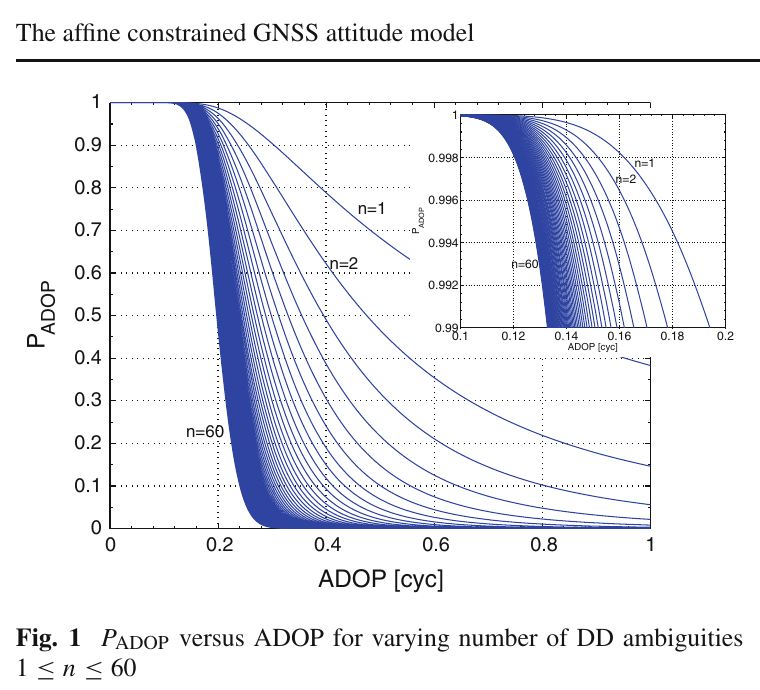
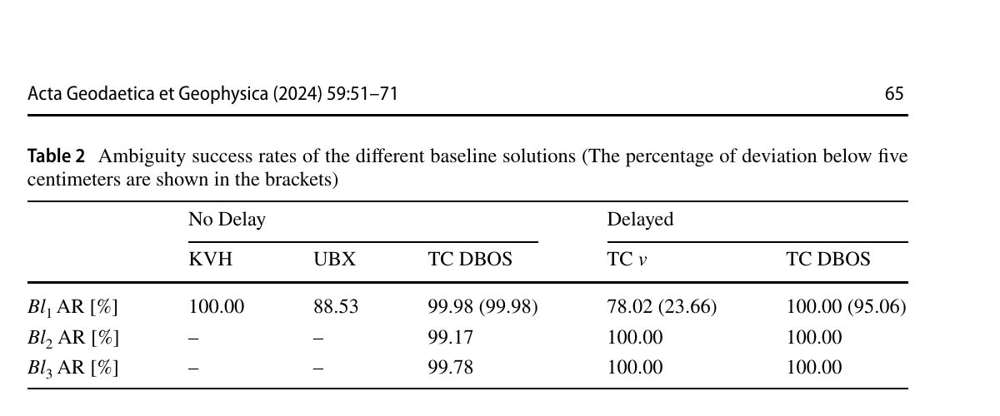
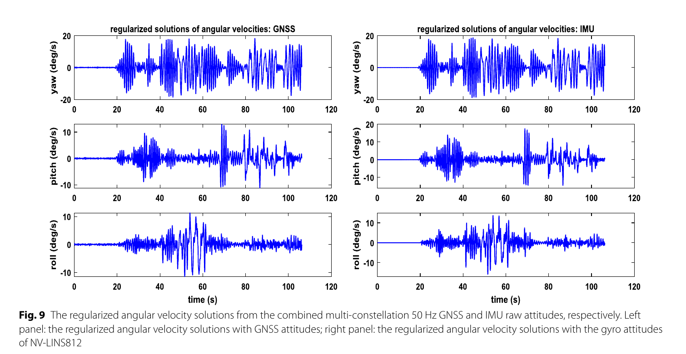

# 2026-09-09 GNSS 每日研究简报

## 今日快报

### 快报 1：遮挡环境定权不能只追位置 RMS，也要同时惩罚卫星几何退化

- 主题：`blocking-gwo-weighting-constellation-selection`
- 来源 ID：`doi:10.1038/s41598-026-70887-7`
- 来源链接：https://doi.org/10.1038/s41598-026-70887-7
- 发表日期：2026-09-08
- 来源类型：Scientific Reports 已接收开放论文、GNSS 遮挡场景多目标定权
- 获取范围：出版者提前在线页面与完整摘要；版本仍可能排版修订，正文配置和逐场景原始统计未据此补写

**内容：** 作者把加权最小二乘的观测权系数与多星座组合一起交给灰狼优化器（GWO），目标函数同时压低位置 RMS 和 DOP。问题意识是正确的：遮挡会同时减少可见星并扭曲几何，若优化器只追训练段坐标误差，可能把一组偶然低残差、但几何脆弱的观测权得过高。

**结论：** 摘要报告三个静态/动态严重遮挡场景中，集成多星座方案的 DOP 平均改善约 66%、52%、77%，RMS 位置误差平均下降约 52%、58%、49%，并称相对 PSO、ACO 和 SA 收敛更快、更稳定。由于当前可核对的是提前在线摘要，本条不推断数据长度、真值独立性、GWO 计算预算或置信区间；这些百分比应视为作者报告，而非跨城市泛化保证。

**关注理由：** 接收机若在线调权，应把几何、残差、卫星健康和计算时限拆开记录。元启发式算法可以离线选超参数，但在安全相关实时定位中仍需确定性的超时、降级和回退路径。

### 快报 2：Android 原始观测转 RINEX 时漏写载波，比后端少用几颗卫星更致命

- 主题：`smartphone-raw-rinex-converter-completeness`
- 来源 ID：`doi:10.1007/s10291-026-02141-6`
- 来源链接：https://doi.org/10.1007/s10291-026-02141-6
- 发表日期：2026-09-08
- 来源类型：GPS Solutions 同行评审开放论文、手机原始 GNSS 转换器实测
- 获取范围：开放全文 19 页；NSGRX v1.5、8 组受控试验、RTKLIB 配置、载波完整性和定整结果已核对

**内容：** NSGRX 把 GnssLogger 与 GeoDataLogger 的 Android 原始记录转换为 RINEX 4.01，并保留伪距、载波相位、多普勒、C/N0 和质量标志。作者用 Xiaomi Mi 11T、Samsung S23/S23 FE 等设备在约 10 m 短基线上采集 1 Hz 数据，与 GnssLogger、UofC、UPV 和 Rokubun 输出采用同一 RTKLIB 设置比较。

**结论：** NSGRX 在试验 1/2 的固定率为 100%/95%，UofC 为 35%/14%；试验 5—8 中 NSGRX 为 73.7%—97.2%，而 UofC 为 0.1%—9.7%，UPV 只得到浮点解。全文还直接展示了某些工具漏写 Mi 11T 的 Galileo E5 或 L1/L5 载波。试验为静态、受控、短基线，并关闭 duty cycle；高固定率不能外推到动态街谷，也不能证明转换器应把所有不连续载波都当作有效。

**关注理由：** 手机定位的可复现链条从日志语义开始。后端算法比较前应先做逐星逐频字段审计、历元连续性和 ADR 状态检查，否则“算法差异”很可能只是转换器丢观测。

### 快报 3：北京湿季里北斗与 GPS 的 PWV 差别小，真正的大误差来自高湿系统性低估

- 主题：`beijing-constellation-pwv-humid-bias`
- 来源 ID：`doi:10.3390/atmos17090880`
- 来源链接：https://doi.org/10.3390/atmos17090880
- 发表日期：2026-09-08
- 来源类型：Atmosphere 同行评审开放论文、多星座 GNSS 水汽反演
- 获取范围：CC BY 4.0 开放全文与补充说明；2023—2025 汛期、严格共同样本、移动块 bootstrap 和留一年验证已核对

**内容：** 研究将四站 GNSS PWV 空间转移到北京探空点，在严格共同历元上比较 BDS-only、GPS-only 及多星座组合，并用 7 d 移动块 bootstrap 保留时间相关性。它把星座几何、空间转移和湿度分层分开，避免直接把“星多、PDOP 小”解释成 PWV 必然更准。

**结论：** 2023—2025 年 BDS/GPS RMSE 分别为 7.17/7.36、8.01/8.40、9.10/9.54 mm，差距远小于高湿偏差；当探空 PWV 超过 50 mm 时，BDS 与 GPS 有符号偏差达到 −10.75 与 −11.36 mm。留一年 PWV 百分位对随后降雨的 AUC 为 0.846，但 FAR 达 92.2%、CSI 仅 7.6%，因此它有相关性而不是可单独业务告警的预测器。

**关注理由：** 对流层产品评估要优先找随湿度增大的结构性偏差，再谈星座排名。PPP/PPP-RTK 用户若把有偏 ZWD 当强约束，厘米级坐标会吸收模型缺口。

### 快报 4：同一 POD 天线同时跟踪的多颗星，能帮助区分电离层闪烁与共模射频干扰

- 主题：`cosmic2-multi-prn-scintillation-rfi-classification`
- 来源 ID：`doi:10.3390/rs18183074`
- 来源链接：https://doi.org/10.3390/rs18183074
- 发表日期：2026-09-08
- 来源类型：Remote Sensing 同行评审开放论文、星载 GNSS 异常弱标签分类
- 获取范围：CC BY 4.0 开放全文 32 页；COSMIC-2 1 Hz POD 数据、60 s 窗口、弱标签、消融和跨年应用已核对

**内容：** 模型以每颗 GPS 卫星的双频 60 s 序列和 16 维统计特征为输入，再用 FiLM 与 DeepSets 汇总同一 POD 天线同期跟踪的多 PRN 信息。物理动机是地面/空中 RFI 更可能让多条链路同步变化，而电离层闪烁通常随传播路径而异；官方 S4 与 RFI 指数只用于生成弱标签，不直接作为模型输入。

**结论：** 在 6,919,896 个 2024 测试窗口上，Macro-F1/MCC 为 0.8227/0.7120，闪烁与 RFI F1 为 0.8152/0.6731；不重训直接用于 2025 全年后为 0.8318/0.7226，RFI F1 为 0.6979。证据仍与官方指数生成的弱标签同源，且跨年未跨平台；1 Hz 数据不能保留全部快速相位与幅度扰动，因此不能把类别概率当作独立干扰真值。

**关注理由：** 多通道共模性是阵列或多星监测很有价值的特征，但必须保留“弱标签一致性”和“物理真值正确性”的区别；部署时还要用受控发射与独立闪烁仪补标。

### 快报 5：伪射线只能补矩阵几何，不能凭空创造新的水汽信息

- 主题：`gnss-tomography-gradient-mapped-pseudo-rays`
- 来源 ID：`doi:10.3390/rs18183070`
- 来源链接：https://doi.org/10.3390/rs18183070
- 发表日期：2026-09-08
- 来源类型：Remote Sensing 同行评审开放论文、无外部场约束 GNSS 水汽层析
- 获取范围：CC BY 4.0 开放全文 23 页；冰岛与香港试验、梯度相容性、有效秩、探空验证和局限已核对

**内容：** 作者用精密 SP3 轨道恢复未跟踪星座的方位/高度角，再把本地已有 ZWD 与水平梯度映射到这些方向，生成伪 SIWV 射线，以补足层析设计矩阵的方向覆盖。它没有引入新的大气观测；伪射线只是对同一站点信息的物理一致重排。

**结论：** 香港多星座梯度方案相对 GPS 梯度在各高度层 RMSE 约下降 2%—7%，而 GLONASS-only 梯度普遍更差；冰岛一组扩展中有效秩中位数增加 2.94、98.6% 历元增加，同时 RMSE 中位数下降 0.075 g/m³、88.1% 历元改善。更多映射方向很快出现冗余，且 RMSE 变化与条件改善没有稳定单调关系，不能把伪射线数当成独立信息量。

**关注理由：** 这是所有“虚拟观测”工程的共同边界：协方差必须反映共同来源，否则同一 ZWD 被复制多次会造成虚假过度自信。

## 深度研读

### 深读 1｜接收机工程｜把旋转硬约束拆成线性仿射约束：先让整数搜索重新回到椭球里

- 类别：`receiver-engineering`
- 学习层级：`foundation`
- 选题定位：`经典基础`
- 来源 ID：`doi:10.1007/s00190-011-0538-z`
- 来源链接：https://doi.org/10.1007/s00190-011-0538-z
- 发表日期：2011-12-28
- 来源类型：Journal of Geodesy 同行评审开放论文、多天线 GNSS 姿态整数估计
- 获取范围：CC BY-NC 2.0 开放全文 17 个期刊页；多元观测模型、仿射约束、整数目标函数、ADOP 闭式表达与算例表已核对
- 价值评分：97/100（相关性 20，经典价值 20，证据 19，教学价值 20，工程价值 18）

#### 为什么先学这个

多天线姿态的难点不是由一条已固定基线算航向，而是载波相位仍带整数模糊度时，如何把已知阵列几何用于整数搜索。完整旋转约束 $`R^{\mathsf T}R=I`$ 是二次非线性约束，直接纳入整数目标会把搜索域从椭球变成非标准形状。仿射模型保留一组线性几何约束，牺牲部分正交性，换回可用标准整数最小二乘求解的二次目标。

#### 先修知识

需要理解载波相位双差、整数模糊度、基线矩阵、机体系与参考系、旋转矩阵、Kronecker 积、加权最小二乘、协方差传播，以及 ADOP 是模糊度平均精度指标而非位置 DOP。

#### 一句话逻辑

把机体系已知基线矩阵 $`B`$ 的零空间写成 $`S`$，真实参考系基线矩阵 $`X=RB`$ 必须满足 $`XS=0`$；只把这组线性条件加入浮点和整数估计，就能在标准椭球搜索中利用阵列冗余提高定整能力。

#### 研究问题与约束

论文给出适用于一维、二维、三维阵列，任意频数、至少两副天线和共同跟踪卫星的多元模型。短阵列假设差分电离层与对流层可忽略，并默认同一阵列中的接收机可形成一致双差。文章主要是理论推导和模型强度算例，不是动态遮挡、周跳或射频前端非理想的实测认证。

#### 核心方法论

令 $`Y`$ 为按频率与观测类型堆叠的双差观测矩阵，$`M`$ 为卫星几何设计块，$`N`$ 为把波长映射到相位模糊度的设计块，$`X`$ 为参考系中的未知基线矩阵，$`B`$ 为机体系已知基线矩阵，$`Z`$ 为整数模糊度矩阵。完整模型通过 $`X=RB`$ 和旋转正交性绑定阵列；仿射模型取 $`S`$ 为 $`B`$ 的零空间基，保留 $`XS=0`$。对候选 $`Z`$，目标函数同时惩罚其偏离浮点模糊度和条件基线违反仿射约束的程度。

#### 关键公式逐步推导

多元观测可写成：

```math
E(Y)=MX+NZ,
\qquad Z\in\mathbb Z^{fs\times r}.
```

若 $`B`$ 的列空间维数为 $`q`$，取 $`S`$ 满足 $`BS=0`$，由 $`X=RB`$ 得：

```math
XS=RBS=0.
```

因此仿射整数目标为：

```math
J(Z)=\|\operatorname{vec}(\hat Z-Z)\|^2_{Q_{\hat Z\hat Z}}
+\|\operatorname{vec}(\hat X(Z)PS)\|^2_{Q_{\hat X(Z)\hat X(Z)}}.
```

模糊度平均精度定义为：

```math
\operatorname{ADOP}=|Q_{\hat a\hat a}|^{1/(2n)}\quad[\mathrm{cycle}],
```

数值越小，整数置信椭球越紧；多历元且几何缓变时，论文给出近似 $`\operatorname{ADOP}_k\approx \operatorname{ADOP}_1/\sqrt{k}`$。

#### 经典价值与创新边界

经典价值在于清楚分开三层模型：无阵列约束、线性仿射约束、完整正交旋转约束，并证明仿射目标仍对整数呈二次型。边界是仿射解不强制 $`R^{\mathsf T}R=I`$，若选取未用于姿态角计算的矩阵元素可能出现不一致；当观测弱到仿射固定仍不可靠时，不能用“投影回旋转矩阵”掩盖错整数。

#### 整体逻辑链

建立双差多元模型；写出阵列秩 $`q`$；由 $`B`$ 构造零空间 $`S`$；求仿射约束浮点解及协方差；对整数候选计算两项二次代价；用标准 ILS 搜索；固定后估计基线/仿射姿态；以 ADOP 预估模型强度；最后按应用需要投影或提取姿态角。

#### 原文图表与结果分析



> 图表源：Teunissen《The affine constrained GNSS attitude model and its multivariate integer least-squares solution》Figure 1，[DOI 页面](https://doi.org/10.1007/s00190-011-0538-z)。由 CC BY-NC 2.0 原始 PDF 第 11 页以 220 dpi 渲染，仅裁出原图与 caption；未重绘、改字或改变曲线。

横轴为 ADOP（cycle，0—1），纵轴为基于 ADOP 的正确整数近似概率 $`P_{\mathrm{ADOP}}`$；蓝线覆盖双差模糊度数 $`n=1\ldots60`$，右上角放大 0.10—0.20 cycle 与 0.99—1.00 区域。原文直接指出 ADOP 低于约 0.10 cycle 时近似成功率高于 0.999，低于 0.13 cycle 时始终高于 0.99。它是基于平均模糊度精度的近似曲线，不包含偏差、周跳、错误随机模型或候选验收，因此不能代替真实固定率和错固定率统计。

#### 原文结果论述

单频三维阵列算例取 $`\sigma_\phi/\bar\lambda=0.01`$、$`\sigma_\phi/\sigma_p=0.01`$。三条基线时需至少七颗卫星才得到足够小的 ADOP；若有六副天线、六颗卫星（文中 $`r=s=5`$），仿射 ADOP 为 0.08 cycle，而无约束模型约大三倍。平面或直线阵列因秩更低、线性约束更多，模型强度还可提高，但直线阵列只能确定航向与俯仰，不能恢复完整三轴姿态。

#### 常见误区与适用边界

第一，把 ADOP 当成实测正确固定概率。第二，只因比率检验通过就忽略偏差。第三，天线体坐标量测有误仍施加强硬几何。第四，非共同卫星或不同步历元直接组成双差。第五，把仿射矩阵当作天然正交旋转矩阵。第六，以增加天线替代良好天线布置。第七，短基线差分大气可忽略的假设外推到长基线。

#### 工程实现步骤

1. 在机体系标定每个天线相位中心及协方差。
2. 依据有效阵列几何求秩 $`q`$ 与零空间 $`S`$，检测近共线退化。
3. 建立按星、频率和基线一致排序的双差矩阵。
4. 求无约束与仿射约束浮点解，核对残差和协方差正定性。
5. 用仿射二次目标做整数搜索并独立验收候选。
6. 固定后检查基线长度、阵列内积及旋转正交误差。
7. 出现天线失锁时重算阵列秩与可观测姿态维数。
8. 同时报 ADOP、固定状态、验收统计量与姿态协方差。

#### 复现实验设计

搭建 4 副同型号双频天线的刚性平面阵列，基线 0.5—1.5 m，10 Hz、开阔场静态 30 min 后做缓慢转台试验。比较无约束 ILS、仿射 ILS 和完整旋转约束三种方法；逐档屏蔽卫星至 5/6/7/8 颗，并给一副天线加入 2/5/10 mm 体坐标误差。指标为 ADOP、经验正确固定率、错固定率、搜索节点数、运行时间、基线内积误差和航向/俯仰/横滚 P95。若 ADOP 预测与经验固定率明显脱节，应回查噪声相关、偏差和候选验收，而不是调阈值粉饰。

#### 与定位及低成本实现的联系

低成本多接收机的码噪声大，阵列冗余恰能用几何换模型强度；但这种收益依赖同步与正确协方差。下一节进入真实低成本系统：即使阵列约束正确，100 ms 级异步也会把运动投影成基线与姿态误差。

#### 本节小结

仿射约束的核心不是“少一个正交条件”，而是把阵列冗余变成标准整数椭球中的可计算惩罚；ADOP 能做设计前筛查，却不能替代错固定监测。

### 深读 2｜低成本定位｜接收机不同步时别硬配最近历元：用平移与转动共同补观测时差

- 类别：`low-cost-mobile`
- 学习层级：`intermediate`
- 选题定位：`基础进阶`
- 来源 ID：`doi:10.1007/s40328-024-00441-2`
- 来源链接：https://doi.org/10.1007/s40328-024-00441-2
- 发表日期：2024-04-18
- 来源类型：Acta Geodaetica et Geophysica 同行评审开放论文、低成本多接收机 GNSS/多传感器融合
- 获取范围：CC BY 4.0 开放全文 21 个期刊页；EKF、四元数约束 MLAMBDA、DBOS 公式、ZalaZone 开阔动态试验与完整结果表已核对
- 价值评分：94/100（相关性 19，经典价值 17，证据 19，教学价值 19，工程价值 20）

#### 为什么先学这个

上一节默认各天线观测描述同一刚体瞬间。独立低成本接收机没有共用振荡器或精确 clock steering，10 Hz 时“取最近基站历元”仍可能差一个采样周期。车辆既平移又转动，单用线速度把观测推到同一时刻会漏掉杠杆臂的旋转速度，最先污染的往往是航向和整数固定。

#### 先修知识

需要掌握单差/双差码与载波、移动基线、接收机钟差、杠杆臂、刚体速度、叉乘矩阵、四元数归一化、EKF、LAMBDA 与 fix-and-hold。

#### 一句话逻辑

由 EKF 的平台线速度和角速度，沿每颗卫星视线预测时间错位造成的距离变化，把该改正施加到码与相位单差；再用四元数单位范数约束收紧整数候选，而不是把异步误差交给模糊度硬吸收。

#### 研究问题与约束

系统使用三台 u-blox ZED-F9P、多频多系统码/相位/多普勒、PixFalcon 惯性/磁/气压传感器，并以 KVH GEO-FOG 3D Dual 作参考。GNSS 为 10 Hz，惯性为 50 Hz；永久站到移动主天线不超过 10 km。试验在 ZalaZone 开阔试车场完成，约 850 s、包含急弯和 8 字，数据后处理但按实时配对模拟。环境几乎无扰动、周跳少，不能据此证明街谷鲁棒性。

#### 核心方法论

EKF 状态含位置、速度、四元数、角速度、传感器误差、接收机钟以及每条移动基线的单差整数模糊度。DBOS 对移动基准天线 M 与从天线 R 的观测时差 $`\delta t`$，将平台平移速度 $`V_M`$ 和由角速度与体坐标杠杆臂产生的旋转速度一起投影到卫星视线。整数搜索在 MLAMBDA 代价外加入“候选四元数归一化后与条件四元数的一致性”代价。

#### 关键公式逐步推导

对卫星 $`s`$，观测时差改正为：

```math
c_{\mathrm{AoD}}^s=
\delta t_{\mathrm{AoD}}\,E_M^s
\left(V_M+R_{\mathrm{body}}^{\mathrm{ecef}}[\omega]_\times b_{M,\mathrm{body}}^R\right).
```

括号第一项是平移速度，第二项是从天线因刚体转动产生的速度；$`E_M^s`$ 将其投影到视线距离。候选整数 $`N`$ 的约束代价写成：

```math
\tilde N=\arg\min_{N\in\mathbb Z^m}
\left(
\|N-\hat N\|_{P_{\hat N\hat N}}^2+
\|\hat q(N)-\breve q(N)\|_{P_{\hat q(N)\hat q(N)}}^2
\right),
```

其中 $`\breve q(N)`$ 是把条件四元数投影到单位范数后的结果；第二项让不符合刚体姿态的整数候选付出额外代价。

#### 经典价值与创新边界

价值在于把异步问题落实到“卫星相关的距离改正”，并同时建模平移和转动，而不是只做历元标签平移。四元数比九元素旋转矩阵紧凑且避免欧拉角奇异。边界是系统还依赖 IMU、磁力计和参考改正流，属于多传感器方案；DBOS 的好结果不能归功于 GNSS 单独观测，也不等于硬件同步不再有价值。

#### 整体逻辑链

读取异步 GNSS 与 50 Hz 惯性；EKF 传播位置、速度、姿态和角速度；计算每条移动基线的实际历元差；按视线生成 DBOS 码/相位改正；形成单差/双差更新；求浮点模糊度；用四元数约束 MLAMBDA 搜索并比率验收；固定后继续 fix-and-hold；与 KVH 轨迹、姿态和固定状态比较。

#### 原文图表与结果分析



> 图表源：Farkas、Rózsa 与 Vanek《Multi-sensor Attitude Estimation using Quaternion Constrained GNSS Ambiguity Resolution and Dynamics-Based Observation Synchronization》Table 2，[DOI 页面](https://doi.org/10.1007/s40328-024-00441-2)。由 CC BY 4.0 原始 PDF 第 15 页以 220 dpi 渲染，仅裁出原表；未重排、改字或修改数值。

表中行是位置基线 $`Bl_1`$ 与两条移动姿态基线 $`Bl_2,Bl_3`$，列比较无延迟 KVH/UBX/TC DBOS 与人为延迟下的仅速度补偿 TC v、完整 TC DBOS；括号给出误差低于 5 cm 的比例。最关键的是 $`Bl_1`$：TC v 报 78.02% 固定，但仅 23.66% 低于 5 cm，说明大量“已固定”并不正确；完整 DBOS 为 100% 固定且 95.06% 低于 5 cm。表不能分离四元数约束、IMU 质量和 DBOS 各自贡献，也只覆盖一次开阔场行程。

#### 原文结果论述

无延迟时 TC DBOS 的三条基线固定率为 99.98%、99.17%、99.78%；延迟时完整 DBOS 均为 100%。仅速度补偿在位置基线的错固定拖累整个滤波状态，位置浮点段甚至到米级。姿态方面，延迟 DBOS 相对 KVH 的航向标准差/95% 绝对误差为 0.49°/1.07°，仅速度方案为 1.59°/3.49°；横滚差异较小，说明旋转杠杆臂补偿主要救回航向相关几何。

#### 常见误区与适用边界

第一，以接收机输出时间戳相同认定射频采样同步。第二，只按线速度补时差。第三，用“固定标志”代替独立基线误差检查。第四，fix-and-hold 在错固定后继续强化错误。第五，磁力计或参考系统参与时仍称纯 GNSS。第六，用开阔场一次行程外推城市遮挡。第七，忽略天线杠杆臂及安装误差。

#### 工程实现步骤

1. 记录每台接收机测量时刻、钟差与数据到达时刻。
2. 标定主从天线杠杆臂和 IMU—机体系旋转。
3. 在统一时间轴传播线速度、角速度与协方差。
4. 为每颗星计算含平移和旋转项的视线距离改正。
5. 对码、相位和多普勒采用一致符号与参考历元。
6. 搜索整数时加入四元数范数/阵列几何代价。
7. 固定后做独立 5 cm 基线误差、残差和姿态连续性监测。
8. 延迟、协方差或 IMU 状态超限时退回浮点或停用相关基线。

#### 复现实验设计

以三台 F9P 和一台可记录原始 IMU 的车载平台，GNSS 10 Hz、IMU 100 Hz，基线 0.8—1.5 m。设计静止、直线加速、30°/s 转弯和 8 字四段；软件注入 0/20/50/100/150 ms 时差。比较最近历元、仅平移、平移+旋转 DBOS、硬件 PPS 同步基线四组。指标为真正正确固定率、错固定率、航向/俯仰/横滚 RMSE/P95、位置 P95、首次固定时间和每历元计算时延；真值使用独立转台或高等级惯导，禁止由被测 GNSS 解回标。

#### 与定位及低成本实现的联系

低成本方案常用多块独立接收机，时钟与数据链恰是系统性短板。DBOS 说明“更聪明的补偿”能回收一部分硬件同步缺口，但其质量最终受速度、角速度和杠杆臂协方差限制。下一节去掉 IMU，考察纯 GNSS 高率姿态能否继续提供角速度与角加速度。

#### 本节小结

异步误差是刚体运动沿卫星视线的距离误差，不是一个可忽略的时间戳细节；完整 DBOS 的价值要用正确固定率验证，而不是看接收机固定灯亮了多久。

### 深读 3｜纯 GNSS 定位｜姿态一做差噪声就爆：用积分方程和正则化把 50 Hz GNSS 变成“陀螺”

- 类别：`positioning`
- 学习层级：`advanced`
- 选题定位：`定位深入`
- 来源 ID：`doi:10.1186/s43020-024-00130-z`
- 来源链接：https://doi.org/10.1186/s43020-024-00130-z
- 发表日期：2024-03-19
- 来源类型：Satellite Navigation 同行评审开放论文、高率纯 GNSS 姿态与角运动重构
- 获取范围：CC BY 4.0 开放全文 17 页；50 Hz 多天线 GNSS、200 Hz 光纤陀螺姿态、差分/最小二乘/正则化推导和结果已核对
- 价值评分：95/100（相关性 20，经典价值 17，证据 18，教学价值 20，工程价值 20）

#### 为什么先学这个

前两节解决“某一时刻姿态是否正确”。控制与振动监测还需要角速度、角加速度，但对带噪姿态直接一阶/二阶差分会按 $`1/\Delta t`$、$`1/\Delta t^2`$ 放大噪声；采样越快，朴素差分反而越坏。论文把求导改写成第一类积分方程，再用正则化选择平滑与跟随之间的折衷。

#### 先修知识

需要掌握多天线短基线相对定位、NED 与机体系旋转、欧拉角或旋转矩阵、高率采样、数值微分、第一类积分方程、病态条件数、Tikhonov 正则化、均方误差与时间同步。

#### 一句话逻辑

不从相邻姿态点直接除以小时间隔，而是用“姿态增量等于角速度在时间上的积分”建立线性观测，再通过最小 MSE 选择正则化参数，抑制求导造成的高频噪声放大。

#### 研究问题与约束

三副 Trimble NetR9 天线组成平台，先以短基线多系统相对定位求 50 Hz 姿态，再与 NV-LINS812 的 200 Hz 光纤陀螺姿态比较。数据来自 2014 年屋顶平台试验，核心动态段约 110 s。GNSS 与 IMU 时间无法完全精确对齐，且没有角速度/角加速度独立真值；因此波形只能谨慎作定性比较，不能把 IMU 曲线当绝对真值。

#### 核心方法论

先由多星座基线对与机体系已知基线求旋转矩阵。对任一角度分量 $`\theta(t)`$，将未知角速度 $`\omega(t)`$ 在基函数上离散；每个姿态增量是从起点到当前时刻的积分，形成病态矩阵 $`A`$。加入平滑矩阵 $`S`$ 的二次惩罚，以最小 MSE 准则选 $`\kappa`$。角加速度同理由角速度积分关系建立，但病态更严重，需要更强正则化。

#### 关键公式逐步推导

连续关系是：

```math
\theta(t)-\theta(t_0)=\int_{t_0}^{t}\omega(\tau)\,d\tau,
\qquad
\omega(t)-\omega(t_0)=\int_{t_0}^{t}\alpha(\tau)\,d\tau.
```

离散后统一写为 $`y=A\beta+\varepsilon`$，其中 $`\beta`$ 是角速度或角加速度序列。正则化目标与闭式解为：

```math
\hat\beta_\kappa=
\arg\min_\beta
\left[(y-A\beta)^{\mathsf T}W(y-A\beta)+\kappa\beta^{\mathsf T}S\beta\right]
=
(A^{\mathsf T}WA+\kappa S)^{-1}A^{\mathsf T}Wy.
```

$`\kappa`$ 太小会保留差分噪声，太大则压平真实峰值；论文以估计 MSE 最小化选择，并在一段小参数区间对解平均以降低单点参数敏感性。

#### 经典价值与创新边界

创新是明确提出“GNSS gyroscope”并把高率 GNSS 姿态的角导数视为逆病态问题，而不是滤波前的普通差分。它展示纯 GNSS 可给出与光纤陀螺形态相近的角速度波形。边界是没有独立角运动真值，正则参数使用静态姿态精度估计，动态姿态误差若更大可能导致过度平滑；“GNSS 陀螺”不是利用惯性物理效应直接测角速度。

#### 整体逻辑链

解算多天线 50 Hz 基线；以加权最小二乘求每历元姿态；评估静态姿态标准差和序列相关；对 GNSS/IMU 姿态先做朴素差分展示噪声灾难；构造积分矩阵；按最小 MSE 选三轴 $`\kappa`$；恢复角速度；再以更强正则恢复角加速度；比较波形、峰值和估计偏差；讨论时差与无真值限制。

#### 原文图表与结果分析



> 图表源：Shi 等《GNSS gyroscopes: determination of angular velocity and acceleration with very high-rate GNSS》Figure 9，[DOI 页面](https://doi.org/10.1186/s43020-024-00130-z)。由 CC BY 4.0 原始 PDF 第 12 页以 220 dpi 渲染，仅裁出原图与 caption；未重绘、改字或改变曲线。

横轴为时间（s，约 0—110），三行依次为 yaw、pitch、roll 角速度（deg/s）；左列由 50 Hz GNSS 姿态恢复，右列由光纤陀螺姿态恢复。两列在约 20 s 后的运动包络和主要峰段相似，说明正则化保留了运动形态；GNSS 俯仰与横滚仍更噪，且峰值普遍更小。图没有真值曲线，也存在未知精确时差，不能据视觉重合给出绝对精度或相位延迟结论。

#### 原文结果论述

GNSS 朴素 LS 角速度三轴平均标准差为 3.7071、2.2336、1.0798 deg/s；正则化后为 0.7966、0.7824、0.7515 deg/s。对应最优正则参数约为 $`1.514\times10^{-4}`$、$`0.895\times10^{-4}`$、$`0.319\times10^{-4}`$。角加速度问题的法矩阵条件数约 $`10^{20}`$，差分/LS 波形被噪声淹没；正则化后以 IMU 姿态重构的三轴 MSE 根为 0.1886、0.3096、0.4366 deg/s²。论文还报告正则化相对差分使 GNSS 角加速度峰值最多缩小 8662.53 倍，这反映噪声放大被压制，不等同于真峰值误差改善同样倍数。

#### 常见误区与适用边界

第一，把更高采样率等同于更准的数值导数。第二，选择 $`\kappa`$ 后不报告带宽或峰值衰减。第三，用同一组数据估噪声又证明精度。第四，把 IMU 姿态当严格同步真值。第五，角度跨 ±180° 未展开就积分。第六，欧拉角逐分量求导后直接当机体系角速度而忽略运动学变换。第七，阵列错固定时仍继续求导。第八，把无漂移 GNSS 波形当作能替代所有陀螺闭环。

#### 工程实现步骤

1. 先保证每历元基线固定、阵列几何和姿态连续。
2. 统一 GNSS、参考 IMU 的时间基准并估计残余时延。
3. 对角度解缠，最好在旋转群/四元数增量域处理。
4. 用积分形式建立 $`A`$，明确边界初值与窗口长度。
5. 从静态与动态残差估计 $`W`$，不要假设白噪声。
6. 选择一阶/二阶平滑矩阵 $`S`$ 并扫描 $`\kappa`$。
7. 报告幅值响应、相位延迟、峰值保持与不确定度。
8. 固定失效或姿态跳变时切断窗口并重初始化。

#### 复现实验设计

用三天线 1 m 刚性阵列安装在可编程双轴转台，GNSS 原始观测 50 Hz，同步编码器真值至少 200 Hz。设计 0.2/0.5/1/2 Hz 正弦角运动、阶跃角速度和带限随机激励；比较一阶差分、Savitzky–Golay、固定 $`\kappa`$ Tikhonov、MSE 自适应正则及陀螺输出。指标为角速度/角加速度 RMSE、幅值衰减、相位延迟、峰值误差、95% 覆盖率和实时延迟；再注入单历元错固定、20 ms 时差与一副天线失锁，检验故障门控是否阻止导数爆炸。

#### 与定位及低成本实现的联系

纯 GNSS 角速度没有惯性零偏长期漂移，可作为 MEMS 陀螺低频校准或故障交叉检查；但短时带宽、遮挡连续性和计算窗口限制明显。低成本落地更合理的角色是“独立慢参考 + 动态质量监视”，而不是在高频控制环中无条件替换 MEMS。

#### 本节小结

从姿态到角速度/角加速度是病态求导问题；50 Hz 只提供更密数据，不自动提供稳定导数。积分方程和正则化能把纯 GNSS 变成可用的角运动参考，但真值同步、带宽与错固定门控决定它是否真的工程可用。
