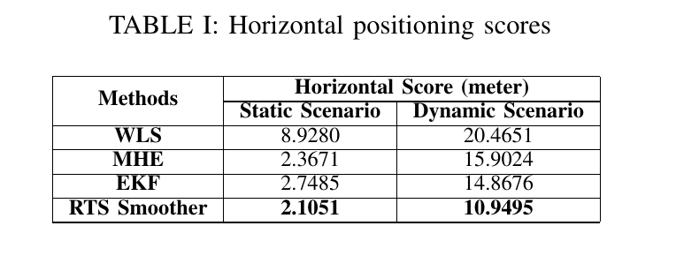
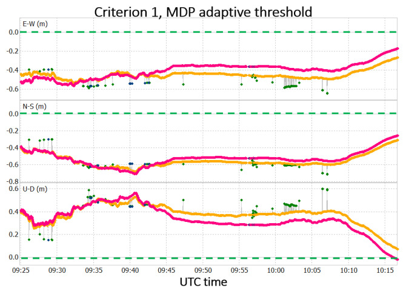
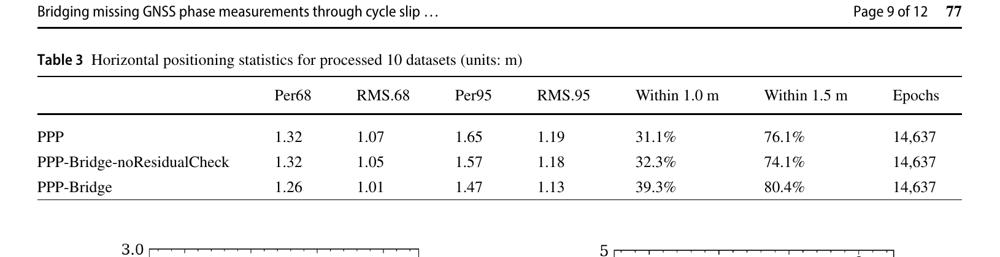

# 2026-09-10 GNSS 每日研究简报

## 今日快报

### 快报 1：中长基线 RTK 不一定非要做双差，先把接收机偏差放进独立钟参数

- 主题：`decoupled-clock-single-difference-rtk`
- 来源 ID：`doi:10.1088/1361-6501/aea4d6`
- 来源链接：https://doi.org/10.1088/1361-6501/aea4d6
- 发表日期：2026-09-09
- 来源类型：Measurement Science and Technology 已接收论文、单差 RTK 模型评估
- 获取范围：出版者元数据与完整正式摘要；正文当前受访问控制，未据此补写站点、时段或逐基线数值

**内容：** 作者比较电离层加权的解耦钟单差（DC-SD）与传统电离层加权双差 RTK。DC-SD 用彼此分离的码钟、相位钟吸收接收机相关硬件偏差，再以随机电离层伪观测约束站间电离层延迟，使单差模型满秩；比较统一覆盖残差白化、大气残差、ADOP、模糊度收敛和固定后的定位。

**结论：** 正式摘要报告：协方差白化后两种模型的伪距残差相近，DC-SD 在长基线上给出更小、更稳定的归一化载波残差，并改善电离层/对流层残差和首次固定时间，同时保持厘米级定位。由于尚未核到正文，本条不复述摘要中的逐基线百分比和历元数，也不把模型比较解释成所有网络与改正流上的普遍优势。

**关注理由：** 双差能消钟，却会放大噪声并引入数学相关；单差模型能否胜出取决于偏差参数化、秩亏处理与随机模型是否闭合。接收机实现应比较白化残差和错固定率，而不只比较 TTFF。

### 快报 2：北斗 PPP-B2b 能远程看守氢钟，但稳定度不能冒充绝对校准不确定度

- 主题：`bds-rtppp-remote-timekeeping-evaluation`
- 来源 ID：`doi:10.3390/s26185718`
- 来源链接：https://doi.org/10.3390/s26185718
- 发表日期：2026-09-09
- 来源类型：Sensors 同行评审开放论文、BDS 实时 PPP 时间频率评估
- 获取范围：CC BY 4.0 开放全文 21 页；零基线、43 km 光纤对比、1150 km IPPP 对比及 MDEV/TDEV 定义已核对

**内容：** 系统用自研 BDS RTPPP 接收机和 PPP-B2b 改正远程比较标准时间。作者先做共钟零基线测试，再以 43 km 临潼—航天链路对比独立校准的光纤链路，并以约 1150 km 临潼—安徽链路对比多 GNSS IPPP；链路时延补偿后分别考察时间差、日频差、TDEV 和 MDEV。

**结论：** 43 km 共同观测段中，RTPPP 与光纤结果的绝对平均时间差为 0.064 ns，86,400 s 平均时间下 MDEV 为 $`2.07\times10^{-15}`$，光纤为 $`1.19\times10^{-15}`$。1150 km 链路中 RTPPP/IPPP 的一日 MDEV 为 $`7.95\times10^{-15}`$/$`6.12\times10^{-15}`$。这些是特定链路的统计稳定度和相互一致性；线缆延迟、锁相环、实时产品和处理策略仍进入误差预算，不能据此声明完成绝对计量校准。

**关注理由：** PPP 时间接收机的工程价值在于连续远程监测和异常发现。产品延迟、改正龄期、钟模型与断流降级状态必须和稳定度曲线一起存档，才能区分钟异常与链路异常。

### 快报 3：GNSS 失锁预测必须显式知道“已经断了多久”，但百秒 MEMS 漂移仍会越界

- 主题：`outage-timer-cnn-bilstm-ins-gps-bridging`
- 来源 ID：`doi:10.1007/s10291-026-02139-0`
- 来源链接：https://doi.org/10.1007/s10291-026-02139-0
- 发表日期：2026-09-09
- 来源类型：GPS Solutions 同行评审开放论文、低成本 INS/GPS 失锁补偿
- 获取范围：CC BY 4.0 出版者全文；网络结构、跨数据集测试、消融、误差统计和局限已核对

**内容：** DeGIN 以 6 维 IMU、3 维导航特征和 1 个失锁计时器组成每个样本，用长度 50、250 Hz 的滑窗；3/5/7 点多尺度一维卷积提局部特征，两层 BiLSTM 建模长时依赖，再以方向感知损失预测下一步 GPS 位置增量。模型只在 NaveGo 训练，并不微调地测试 Nav200、INSANE 飞行集和模拟数据。

**结论：** 在三套真实测试数据汇总中，30/60/100 s 失锁的平均二维误差约为 28.77/43.36/100.74 m；INSANE 飞行集对应 4.35/6.63/22.65 m，明显好于地面数据。论文也显示模拟与真实数据的误差结构存在 3—9 倍差异，且 100 s 时多数地面场景超过 100 m；较平滑的飞行动力学表现不能外推为街谷安全保证。

**关注理由：** “失锁时间”本身就是系统状态，应该进入滤波器或学习器，而不是只靠网络隐式猜测。安全部署还需输出不确定度、限制最大桥接时间，并在 GNSS 恢复时做创新检验而非无条件回灌。

### 快报 4：把全球 GNSS 垂向速度压缩到二阶带谐项，可以独立看地球形状怎么变

- 主题：`global-gnss-vertical-velocity-earth-figure-change`
- 来源 ID：`doi:10.1029/2026jb034224`
- 来源链接：https://doi.org/10.1029/2026JB034224
- 发表日期：2026-09-09
- 来源类型：Journal of Geophysical Research: Solid Earth 同行评审论文、全球形变几何反演
- 获取范围：出版者元数据与完整正式摘要；全文当前未用于本条，未展开格网、协方差或敏感性试验细节

**内容：** 研究把 ITRF2014/ITRF2020 的全球 GNSS 垂向速度及其格网表示映射为地球形状变化参数，重点估计描述固体地球扁率变化的二阶零阶分量。框架用 GIA 模型做合成试验评估格网偏差，移除 GIA 后再在弹性地球假设下，把非 GIA 径向形变转换为对 $`J_2`$ 变化率的贡献。

**结论：** 正式摘要给出的方向性结果是：1997—2015 年极区抬升增强、赤道附近出现相近量级的沉降，几何扁率变化呈加速信号；由弹性响应推得的 $`J_2`$ 变化率也出现正线性趋势。它是对重力低阶球谐监测的几何补充，不等于仅凭 GNSS 已唯一分离冰后回弹、现代质量迁移、旋转和地幔过程。

**关注理由：** GNSS 速度场压缩成全球低阶参数时，站网空间不均匀、参考框架和格网正则化会直接进入结果。对区域监测工程，这提醒我们不要把稠密站区的确定性错误传播成全球置信度。

### 快报 5：GNSS 对流层信息能给风电预测增量，但它测到的是传播延迟梯度，不是风向

- 主题：`gnss-ztd-gradient-wind-power-forecasting`
- 来源 ID：`doi:10.3390/rs18183095`
- 来源链接：https://doi.org/10.3390/rs18183095
- 发表日期：2026-09-09
- 来源类型：Remote Sensing 同行评审开放论文、GNSS 气象条件化风电预测
- 获取范围：CC BY 4.0 开放全文 36 页；PPP-ZTD 输入、匹配对照、666 个共同起报点、移动块置信区间和局限已核对

**内容：** 模型以 LSTM 形成时间主干，用历史 PPP-ZTD、质量字段和水平 ZTD 梯度方向代理条件化图残差支路，在 15—90 min 的活动窗内修正 4 h 风电预测。关键对照让 LSTM+GNN 与 LSTM+GNN+GNSS 共用时间主干和图结构，尽量把增量归因于完整 GNSS 条件化路径。

**结论：** 在盐墩 666 个共同起报点、三组功率模型种子上，完整模型的 4 h nMAE 为 $`4.527\%\pm0.132\%`$，LSTM+GNN 为 $`4.898\%\pm0.027\%`$；配对移动块差为 −0.370 个百分点，95% 区间 [−0.545, −0.179]。主试验只覆盖 2024 年夏季末 6 d，四个公开推理站相距约 550—2580 km，没有共址独立风向真值，且使用约 13 d 延迟的 IGS 最终产品，因此证明的是归档协议下的预测增量，而不是实时风向测量或跨季节泛化。

**关注理由：** 把 GNSS 遥感量接入下游 AI 时，最重要的是匹配对照、时间因果和业务时延。否则同一气象背景、最终产品或站网先验会被误写成新的实时信息。

## 深度研读

### 深读 1｜接收机工程｜先别急着上深度网络：把手机伪距、钟漂与时序状态写进同一个估计问题

- 类别：`receiver-engineering`
- 学习层级：`foundation`
- 选题定位：`经典基础`
- 来源 ID：`doi:10.1109/apwimob59963.2023.10365597`
- 来源链接：https://doi.org/10.1109/APWiMob59963.2023.10365597
- 发表日期：2023-10-10
- 来源类型：IEEE APWiMob 会议论文、Android 原始 GNSS 伪距定位
- 获取范围：IEEE 书目信息与作者公开完整预印本 7 页；公式、有限状态机、静动态数据和结果表已核对
- 价值评分：93/100（相关性 20，经典价值 17，证据 18，教学价值 20，工程价值 18）

#### 为什么先学这个

手机定位常被直接归因于“伪距很吵”，但工程上至少有三层问题：历元内的测量噪声、跨历元的运动与钟漂、以及数据中断后的状态重置。加权最小二乘只看当前历元；MHE、EKF 和 RTS 则把相邻历元通过过程模型连接。先弄清这三者的信息方向，才能判断“变平滑”到底来自实时滤波、有限窗口，还是使用未来数据的后处理。

#### 先修知识

需要掌握 Android `GnssClock`/原始测量形成伪距的基本时间关系、卫星钟和传播改正、ECEF 坐标、伪距率与多普勒、线性化、协方差加权、状态转移、卡尔曼预测/更新，以及分位数误差不同于 RMS。

#### 一句话逻辑

把位置、速度、加速度和手机钟差/钟漂作为统一状态，用伪距与伪距率更新；再依据应用允许的延迟选择当前历元 WLS、递推 EKF、有限窗 MHE 或使用后续状态反推的 RTS 平滑器。

#### 研究问题与约束

论文目标是系统说明 Android 原始伪距 PVT 和时序估计的工程接法，而不是载波相位厘米级定位。静态数据来自 Huawei Mate 10 Pro，动态数据来自 Mountain View 的 Google Pixel 4 公共数据并以 NovAtel SPAN 为真值。作者假设低动态过程模型；动态结果仍保留约 10 m 偏差，说明平滑不能消除未建模的系统误差。

#### 核心方法论

每个历元先由卫星发射时刻、接收时刻和导航电文形成伪距/伪距率，完成卫星钟、相对论、地球自转和大气改正。状态按三个空间轴的位置—速度—加速度块和手机钟差—钟漂块组成。WLS 提供初值；EKF 递推估当前状态；MHE 在 $`N+1`$ 个历元窗口内联合估计；RTS 先前向 EKF，再利用下一历元平滑状态后向修正。有限状态机分别处理少于四星、时钟跳变和伪距不连续。

#### 关键公式逐步推导

线性化后的伪距与伪距率残差统一写作：

```math
\mathbf b_k=\mathbf C_k(\mathbf X_k-\tilde{\mathbf X}_k)+\mathbf E_k,
\qquad \mathbf E_k\sim\mathcal N(0,\mathbf R_k).
```

状态过程为：

```math
\mathbf X_k=\mathbf A_{k,k-1}\mathbf X_{k-1}+\mathbf W_{k-1},
\qquad \mathbf W_{k-1}\sim\mathcal N(0,\mathbf Q_{k-1}).
```

MHE 忽略窗口内过程噪声后，把多历元观测回代到当前状态：

```math
\mathbf Y_{k,N}=\mathbf M_N(\mathbf X_k-\tilde{\mathbf X}_k),
\qquad
\hat{\mathbf X}_k=\mathbf M_N^{+}\mathbf Y_{k,N}+\tilde{\mathbf X}_k.
```

RTS 后向平滑的标准形式为：

```math
\hat{\mathbf X}_{k|K}=\hat{\mathbf X}_{k|k}
+\mathbf G_k(\hat{\mathbf X}_{k+1|K}-\hat{\mathbf X}_{k+1|k}),
\quad
\mathbf G_k=\mathbf P_{k|k}\mathbf A_k^{\mathsf T}\mathbf P_{k+1|k}^{-1}.
```

最后一式明确显示 RTS 使用 $`k+1`$ 及以后的信息，因此不是零延迟实时输出。

#### 经典价值与创新边界

教学价值在于把 Android 时间、PVT 线性化、过程模型和三类不连续串成一条可实现链，并用相同数据比较四种估计器。创新边界是模型主要做伪距/伪距率降噪，没有解决 NLOS、多路径偏差或载波定整；MHE 的窗口和 RTS 的后向信息还带来延迟与计算代价。

#### 整体逻辑链

解析 Android 时钟与导航电文；构造伪距/伪距率；完成卫星与传播改正；WLS 求首个有效状态；估计过程噪声和测量噪声；按不连续类型驱动有限状态机；运行 EKF/MHE；离线任务再做 RTS 后向平滑；最后用统一水平分位数评分比较。

#### 原文图表与结果分析



> 图表源：Weng 与 Ling《Localization with Noisy Android Raw GNSS Measurements》Table I，[DOI 页面](https://doi.org/10.1109/APWiMob59963.2023.10365597)。由作者公开预印本第 7 页以 220 dpi 渲染，仅裁出原表及表题；未重排、改字或修改数值。IEEE 版本的著作权边界未被该预印本重新授权，本摘录仅用于最小必要的研究评论。

表中“Horizontal Score”单位为 m，是水平误差第 50 与第 95 百分位的平均，不是 RMS。静态 WLS/MHE/EKF/RTS 为 8.9280/2.3671/2.7485/2.1051 m，动态为 20.4651/15.9024/14.8676/10.9495 m。RTS 最好符合其使用未来数据的优势；MHE 静态优于 EKF、动态却劣于 EKF，也说明窗口法并非自动占优。表只有一个静态采集和一套动态路线，不能给出跨机型置信区间。

#### 原文结果论述

相对 WLS，RTS 水平评分在静态和动态分别下降 76.4% 与 46.5%。图中轨迹和 ECDF 表明三种时序方法均比逐历元 WLS 平滑，但正文明确指出动态场景约 10 m 的定位偏差仍未消除。换言之，过程模型可降随机噪声，却会保留甚至平滑系统性 NLOS、天线或模型偏差。

#### 常见误区与适用边界

第一，把 RTS 当实时滤波。第二，把轨迹平滑当绝对准确。第三，用同一固定 $`Q/R`$ 覆盖静止、步行和车辆。第四，时钟跳变后只重置位置而不重置钟状态。第五，少于四星仍传播旧位置并标成有效 GNSS。第六，把 GSDC 水平评分等同三维 RMS。第七，不记录 Android 字段缺失与厂商差异。

#### 工程实现步骤

1. 保存原始 `GnssClock`、每星接收状态、伪距率不确定度和 ADR 状态。
2. 在单元测试中复算一颗星的发射/接收时间和卫星位置。
3. 逐历元 WLS，输出残差、权阵、DOP 和可见星数。
4. 建立位置—速度—加速度与钟差—钟漂过程块，检查量纲。
5. 用静态段估 $`R`$，用状态增量估 $`Q`$，限制最小/最大方差。
6. 明确处理少星、时钟跳变、伪距突变的重置路径。
7. 实时输出 EKF；允许延迟时再比较 MHE；后处理才启用 RTS。
8. 同时报偏差、P50/P95、RMS、连续性和恢复时间。

#### 复现实验设计

选两款 Android 双频手机，以 1 Hz 采集 30 min 屋顶静态和 30 min 城市步行/车载数据；屋顶用测量级已知点，动态用独立 GNSS/INS 轨迹。比较 WLS、10/30/60 历元 MHE、EKF、RTS；人为插入 2/10 s 少星、10 ms 时间跳和 20 m 伪距阶跃。指标包括水平/垂直 P50、P95、RMS、创新一致性、恢复历元、CPU 时间和输出延迟。若平滑但偏差不降，应将 NLOS/多路径交给下一节的测量筛选，而不是继续收紧过程噪声。

#### 与定位及低成本实现的联系

低成本接收机最便宜的性能增益往往来自正确的时序模型和状态机，而不是更复杂的网络。下一节进一步处理本节无法消除的测量偏差：用码相组合在单星层面识别多路径突变，并把它反馈到 RTK 权阵。

#### 本节小结

时序估计能把多个噪声历元变成一个更稳定状态，但信息方向决定实时性，随机模型决定可信度；任何平滑器都不会凭空消除未建模偏差。

### 深读 2｜低成本定位｜码减相位再做时间差：让手机 RTK 对每颗星自适应降权

- 类别：`low-cost-mobile`
- 学习层级：`intermediate`
- 选题定位：`基础进阶`
- 来源 ID：`doi:10.3390/s22155790`
- 来源链接：https://doi.org/10.3390/s22155790
- 发表日期：2022-08-03
- 来源类型：Sensors 同行评审开放论文、Android RTK 多路径检测与降权
- 获取范围：CC BY 4.0 开放全文；公式、两组试验、阈值扫描、表 3—8 和开源实现链接已核对
- 价值评分：92/100（相关性 20，经典价值 16，证据 18，教学价值 19，工程价值 19）

#### 为什么先学这个

上一节把噪声交给历元间模型，但城市反射产生的误差不是零均值白噪声。若异常卫星连续存在，滤波器反而会把偏差“学稳”。MDP 方法先在单星观测域构造码减相位量，再做历元差以消去常量模糊度和慢变项，尝试把突发多路径从一般手机噪声中分开。

#### 先修知识

需要理解伪距与载波相位中电离层符号相反、整周模糊度在无周跳弧段内为常量、SNR/C/N0、单频 RTK/PPK、观测方差对加权最小二乘的作用、Chebyshev 不等式及精度和准确度的区别。

#### 一句话逻辑

先算 $`S=P-L`$，再算相邻历元 $`MDP=\Delta S`$；当 MDP 超出每星历史窗口的 $`\mu\pm3\sigma`$，就提高该观测方差而非直接删除，让 RTKLIB 少信可能受反射污染的星。

#### 研究问题与约束

研究使用 Xiaomi Mi 8 和改造 RTKLIB：一组是热那亚 1 Hz 步行方形路线，另一组是已知点 1 h 静态试验，并在 09:45—10:00 UTC 于手机与 u-blox ZED-F9P 后方放金属板人为制造反射。主要结论来自两次采集和参数扫描，最优阈值具有明显场景依赖，不能直接当作通用手机标准。

#### 核心方法论

码相差包含两倍电离层、模糊度、码/相多路径与噪声；在 1 Hz 相邻历元下假设电离层和模糊度近似不变，再做时间差得到 MDP。检测可只用 MDP，或同时要求 SNR 低于门限。MDP 可用固定 2.5—5 m 门限，也可对每星最近 $`N`$ 个历元计算自适应上下限。被标记观测通过附加 MDP 方差降低权重；系统保留 Android 前端、基站流与服务端 RTKLIB 的实时数据路径。

#### 关键公式逐步推导

以 m 为单位，简化码和相位为：

```math
P(t)=\rho+\Delta T+I+T+M_P+\epsilon_P,
\qquad
L(t)=\rho+\Delta T-I+T+\lambda N+m_L+\epsilon_L.
```

先相减：

```math
S(t)=P(t)-L(t)=2I(t)-\lambda N+M_P(t)-m_L(t)+\epsilon(t).
```

再对相邻历元作差：

```math
MDP(t)=S(t)-S(t-1)
\approx \Delta[M_P-m_L]+\epsilon'(t).
```

若每星窗口内 MDP 均值和标准差为 $`\mu_N,\sigma_N`$，自适应检测为：

```math
MDP(t)\notin[\mu_N-3\sigma_N,\mu_N+3\sigma_N].
```

这只是启发式异常检测；Chebyshev 给的是任意分布下至少 $`8/9`$ 样本落在三标准差内的下界，不证明越界必然是多路径。

#### 经典价值与创新边界

价值在于指标简单、逐星、单频可算，并能直接映射为 RTK 权重；论文还公开改造代码，便于复现。边界是 MDP 同时含一般噪声、电离层变化和周跳，手机低质天线让序列本身很噪；方法检测的是“与近期行为不一致”，不是直接识别反射路径。

#### 整体逻辑链

Android 读取码、相位和 SNR；对每星维护前一历元及窗口统计；计算 $`S`$ 与 MDP；按固定或自适应门限置标志；可与 SNR 条件合取；把标志转换为额外方差；RTKLIB 重算浮点/固定解；再以已知坐标比较 E/N/H 与二维 RMS、离群点和固定状态。

#### 原文图表与结果分析



> 图表源：Benvenuto、Cosso 与 Delzanno《An Adaptive Algorithm for Multipath Mitigation in GNSS Positioning with Android Smartphones》Figure 11，[开放全文](https://pmc.ncbi.nlm.nih.gov/articles/PMC9371117/)。直接下载 CC BY 4.0 原始 Figure 11 JPEG 并无损转为 PNG；未裁剪、重绘、改字或改变数据。

横轴为 UTC 09:25—10:15；三行纵轴分别是 E-W、N-S、U-D 误差，单位 m。虚线为已知坐标，粉/蓝为启用 MDP 后的浮点/固定解，橙/绿为未启用 MDP 的对应解；金属板反射发生在 09:45—10:00。图直接显示两套主轨迹仍有数十厘米共同偏差，MDP 的主要作用是减少局部偏离和假固定，而非把手机变成无偏厘米级接收机。

#### 原文结果论述

全时段 Table 3 中，无 MDP、固定 2.5 m 门限、自适应 30 历元门限的二维 RMS 为 1.428/1.374/1.339 m；人为多路径时段为 1.441/1.328/1.259 m。自适应门限在该静态试验更有效，但论文同时报告步行数据中固定门限会因错降权引入新离群点，自适应门限也可能在起始统计未稳定时变差。表中 RMS 定义和数值还受共同坐标偏差影响，不能只据其绝对值声称“米级误差来自多路径”。

#### 常见误区与适用边界

第一，把 MDP 越界当多路径真值。第二，忽略周跳和电离层突变也会改变 $`P-L`$。第三，把论文的 2.5 m 固定门限复制到所有机型。第四，窗口初始化未满就报警。第五，只看固定率而不查假固定。第六，把降权造成的平滑误认为精度提升。第七，以单次金属板试验替代真实街谷多反射验证。

#### 工程实现步骤

1. 对每星每频维护时间、$`P/L/S/MDP`$、SNR 和 ADR 状态。
2. 周跳、失锁或历元间隔异常时中断窗口，禁止跨弧计算。
3. 用滚动 30/60/120 s 估稳健中心与尺度，并设置方差下限。
4. 同时保留论文 $`\mu\pm3\sigma`$ 作为可复现基线。
5. 将异常强度连续映射到方差膨胀，避免权重瞬时归零。
6. 对固定解加独立残差、基线与时间连续性验收。
7. 记录每星降权理由和持续时间，便于回放。
8. 针对静态、步行、车载分别标定，不共享单一门限。

#### 复现实验设计

使用两款手机和一台 ZED-F9P，1 Hz 同步采集：已知点静态 60 min、金属板 15 min、城市步行 30 min。比较无 MDP、固定 2.5/3.5/5 m、30/60/120 历元自适应门限，以及中位数/MAD 稳健门限；再做“仅 MDP”和“MDP 且 SNR<35 dB-Hz”。指标为逐分量偏差/RMS/P95、错固定率、重固定时间、异常星精确率和每历元 CPU。用视频或射线追踪标签只作外部核查，不用来调同一路线阈值。

#### 与定位及低成本实现的联系

MDP 解决“观测是否值得信”，却仍默认每次相位缺测都要重置模糊度。手机载波经常只丢几个历元，若弧段实际上没有周跳，无条件重置会浪费已经收敛的信息。下一节把检测思路延伸到缺测两端，决定何时可以安全保留相位模糊度。

#### 本节小结

码相时差能把多路径突变变成逐星可用的降权信号，但它不是反射真值；自适应门限的收益必须与假固定、窗口冷启动和动态错降权一起评估。

### 深读 3｜定位｜相位缺几秒不等于周跳：四重检验后再保留手机 PPP 模糊度

- 类别：`positioning`
- 学习层级：`advanced`
- 选题定位：`定位深入`
- 来源 ID：`doi:10.1007/s00190-025-02002-z`
- 来源链接：https://doi.org/10.1007/s00190-025-02002-z
- 发表日期：2025-09-21
- 来源类型：Journal of Geodesy 同行评审论文、纯 GNSS 手机 PPP 相位缺测桥接
- 获取范围：作者实验室公开完整期刊 PDF 12 页；10 组手机车载数据、四重检验、阈值、消融和汇总表已核对
- 价值评分：96/100（相关性 20，经典价值 17，证据 20，教学价值 19，工程价值 20）

#### 为什么先学这个

传统处理把相位缺测视为周跳，立刻重置模糊度和方差。对测量级接收机这很稳妥，对手机却会因频繁短缺口反复重收敛。关键不是“插值造出缺失相位”，而是当观测恢复时，利用缺口前后码、相、多普勒及同星座参考星判断整周计数是否真的改变；只有多重检验一致才保留旧模糊度。

#### 先修知识

需要掌握非组合 PPP、码/相观测方程、星间系统偏差、斜电离层与 ZWD、浮点模糊度、EKF 方差传播、GF 与 CMP 组合、多普勒和 TDCP、周跳检验、预拟合残差及参考星差分。

#### 一句话逻辑

把缺口长度改成该星自己的采样间隔，用 GF、CMP、星间差分 DTDCP 和同历元相位预拟合残差四道门判断无周跳；全部通过才保留旧浮点模糊度并适度放大方差，否则按新弧段重置。

#### 研究问题与约束

数据来自 Toronto York University 周边 10 组 1 Hz、20—30 min 车载采集，手机为 Xiaomi Mi 8 与 Samsung S21+，均置于仪表台；车顶 NovAtel SPAN 的 PPK/IMU 紧组合轨迹作参考。环境含开阔、立交、高楼和树遮挡。结论是后处理 PPP 的数据集内证据，参考轨迹仍含 GNSS，且未给出跨城市、实时算力或错桥接概率的独立认证。

#### 核心方法论

系统分别维护每星 L1/L5 最近有效相位的时间戳、码、相、多普勒和同星座参考星。恢复相位后，CMP 差分门限为 2 m；双频 GF 差分门限为 0.05 m；改进 DTDCP 先做星间差分消除手机相位钟跳，再以推荐阈值 2 验收；最后把待桥接星的相位预拟合残差与连续星残差集合比较，阈值因子 $`k=1`$。全部通过时保留模糊度，其方差设为先前值的两倍；任一失败则重置。

#### 关键公式逐步推导

双频几何无关检验为：

```math
\nabla GF_{15}^{s}=\nabla(L_1^{s}-L_5^{s}).
```

码减相位检验为：

```math
\nabla CMP_j^{s}=\nabla(P_j^{s}-L_j^{s}).
```

传统多普勒—TDCP 检验写为：

```math
\nabla DTDCP_j^{s}=
\frac{\nabla L_j^{s}}{\lambda_j}
+\frac{D_j^{s}(t)+D_j^{s}(t-1)}{2}\Delta t.
```

手机相位钟基准会跳，因此论文对同星座参考星 $`n`$ 再作星间与时间双差：

```math
\nabla DTDCP_j^{sn}=(DTDCP_j^{sn})_t-(DTDCP_j^{sn})_{t-1}.
```

最后以连续星预拟合残差的均值和尺度检查待桥接星：

```math
H_0:\ \overline r-k\sigma\le r_i\le\overline r+k\sigma,
\qquad k=1.
```

四式不是投票；论文实现要求所有适用条件均通过，以压低漏检周跳后错误保留模糊度的风险。

#### 经典价值与创新边界

创新点是把“数据缺口”和“周跳”解耦，并为手机特有相位钟跳设计星间差分 DTDCP；数据库结构和残差消融使方法可实现。边界是保留的是浮点模糊度，不是证明整数模糊度正确；CMP 受码噪声影响，GF 有不敏感周跳组合，参考星也可能异常，阈值仍来自经验分析。

#### 整体逻辑链

建立非组合多 GNSS PPP；按星频更新最近有效数据库；相位恢复时计算实际缺口 $`\Delta t`$；先做 CMP/GF；选同星座连续参考星做改进 DTDCP；用连续星预拟合残差做同历元一致性检查；全部通过则保留模糊度并方差乘二；否则重置；最后比较 PPP、无残差检查桥接和完整 PPP-Bridge。

#### 原文图表与结果分析



> 图表源：Hu 等《Bridging missing GNSS phase measurements through cycle slip detection for improved smartphone positioning》Table 3，[作者实验室公开全文](https://www.icg-pnt.com/publication/bridging-missing-gnss-phase-smartphone/)。由作者公开期刊 PDF 第 9 页以 220 dpi 渲染，仅裁出原表；未重排、改字或修改数值。期刊标注 Springer 专有版权，本摘录仅用于最小必要的研究评论，不表示再分发授权。

表覆盖同一 14,637 个有效历元。传统 PPP、去掉预拟合残差门的桥接、完整 PPP-Bridge 的水平 P95 为 1.65/1.57/1.47 m，1 m 内比例为 31.1%/32.3%/39.3%，1.5 m 内比例为 76.1%/74.1%/80.4%。没有残差门时 P95 略降，但 1.5 m 内比例反而下降，直接说明均值或单一分位数改善不能证明桥接可靠；最后一道同历元一致性检查有实际价值。

#### 原文结果论述

完整方法把十组数据的 P68/P95 从 1.32/1.65 m 降到 1.26/1.47 m，把 1 m/1.5 m 内比例提高 8.2/4.3 个百分点。单个 S21+ 数据集中，1.5 m 内比例由 65.1% 提至 99.1%；单个 Mi 8 的 P68/P95 约改善 0.2 m。论文还指出缺口小于 7 s 时大误差压制最明显，最长约 15 s 仍可见改善；这不是允许无上限桥接，而是其数据中的经验范围。

#### 常见误区与适用边界

第一，给缺失历元插造相位；方法只在恢复点决定是否保留状态。第二，只靠一个 GF 门。第三，参考星未验收就做星间差。第四，把手机相位钟跳误判成所有卫星同时周跳。第五，无预拟合残差门仍沿用旧模糊度。第六，把浮点模糊度连续性当整数正确性。第七，跨越长遮挡、强电离层变化或多星同步失锁仍沿用短缺口阈值。

#### 工程实现步骤

1. 为每星每频保存最近有效时间戳、码、相、多普勒和状态标志。
2. 严格区分码可用/相不可用、全信号失锁和 Android 时钟跳变。
3. 相位恢复时按真实时间间隔形成 CMP/GF，不硬按 1 s。
4. 从同星座同频连续星中选残差最稳参考星，必要时多参考星投票。
5. 计算星间差分 DTDCP，记录各门统计量和阈值裕量。
6. 用连续星相位预拟合残差建立同历元基准，完成最后验收。
7. 通过则保留模糊度并膨胀协方差；失败则新建弧段。
8. 设最大桥接时长和连续桥接次数，GNSS 质量差时强制回退。

#### 复现实验设计

用 Mi 8、S21+ 和一款新机各采 10 条 20—30 min 城市路线，1 Hz，车顶独立测量级 GNSS/INS 为参考。对连续相位人为挖去 1/3/5/7/10/15/30 s，并在部分缺口后注入 1/2/5 cycle 周跳；比较传统重置、GF+CMP、再加星间 DTDCP、完整四门和多参考星版本。指标为周跳漏检/虚警、错桥接率、P68/P95、1 m/1.5 m 可用率、恢复时间、创新 NIS 与 CPU。训练阈值的路线与测试城市必须分离。

#### 与定位及低成本实现的联系

手机 PPP 的瓶颈不只是观测噪声，还包括状态被频繁、过度重置。把缺口桥接与上一节的逐星异常降权结合，可形成“测量可信度—状态连续性”两层质量控制；但最终仍需完整性监测给出错桥接后果界限，不能只追 1 m 内比例。

#### 本节小结

短相位缺口可以视为不规则采样，而不是自动视为新弧段；只有多源检验和同历元残差都支持无周跳时，保留模糊度才是有证据约束的性能收益。
