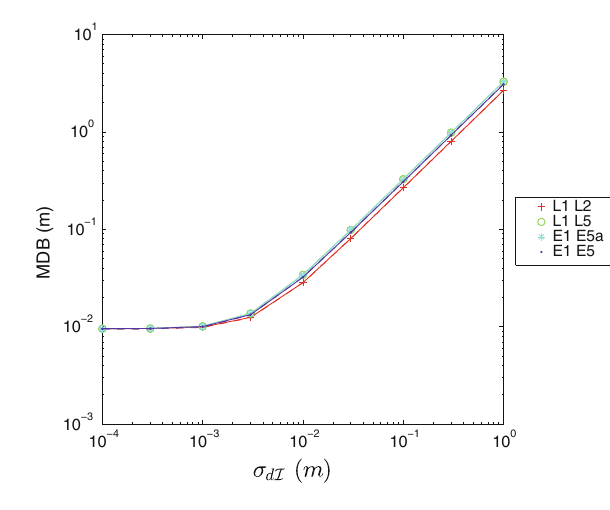
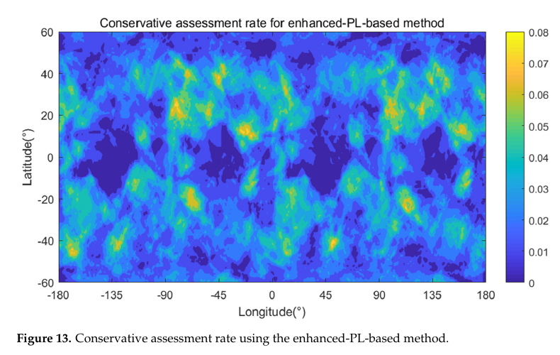
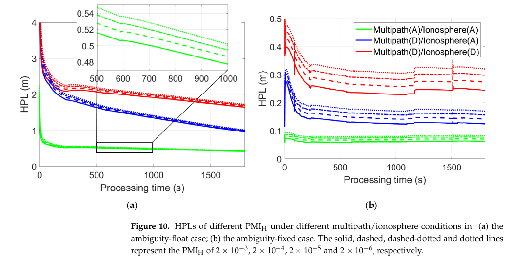

# 2026-09-11 GNSS 每日研究简报

## 今日快报

### 快报 1：GNSS 持续看到毫米级慢变，也不能单独决定边坡会不会失稳

- 主题：`gnss-reservoir-landslide-monitoring-stability`
- 来源 ID：`doi:10.1007/s12665-026-13135-5`
- 来源链接：https://doi.org/10.1007/s12665-026-13135-5
- 发表日期：2026-09-10
- 来源类型：Environmental Earth Sciences 同行评审开放论文、库岸滑坡综合监测与稳定性分析
- 获取范围：CC BY-NC-ND 4.0 出版者开放全文；GNSS 布设、测斜孔、裂缝调查、极限平衡结果与适用边界已核对

**内容：** 研究把一座参考站、7 个 GNSS 监测点、5 个测斜孔、地质测绘和极限平衡计算放进“监测—结构识别—稳定性”闭环。GNSS 给出三维表面位移，测斜孔把潜在滑面约束在 22—34 m 深度，随后分别计算天然、降雨、地震和库水快速下降工况，而不是用位移曲线直接替代失稳判据。

**结论：** 开放全文报告监测期内各点仍处于毫米级慢变，较活跃点的水平速率约 0.06—0.12 mm/d；稳定性计算却显示天然与降雨工况总体稳定至临界稳定，地震和快速降水位工况可能失稳。这个差异说明短窗小位移不等于低风险，滑面几何、孔压路径和加载情景仍决定安全判断；结论也只适用于该 S-J1 变形体及作者采用的参数集。

**关注理由：** GNSS 工程最容易犯的错误，是把“当前速度小”写成“未来稳定”。报警系统应同时保存位移速度/加速度、库水位变化率、降雨、测斜与模型安全系数，并把传感器精度与真实边坡运动分开。

### 快报 2：GNSS-R 土壤湿度不是一张黑箱回归表：SHAP 先解释再跨系统加权

- 主题：`tianmu1-gnss-r-explainable-soil-moisture`
- 来源 ID：`doi:10.1007/s00190-026-02109-x`
- 来源链接：https://doi.org/10.1007/s00190-026-02109-x
- 发表日期：2026-09-10
- 来源类型：Journal of Geodesy 同行评审论文、星载 GNSS-R 土壤湿度反演
- 获取范围：出版者元数据与完整正式摘要；正文受访问控制，本条不采用摘要之外的实验细节或逐模型数值

**内容：** 作者提出“轨道点—格网”协同框架：先用贝叶斯优化的 CatBoost、LightGBM 和 XGBoost 从反射率、地表温度与植被含水量反演土壤湿度，再以 SHAP 检查特征贡献，最后按 CRITIC 权重融合北斗、GPS、GLONASS、Galileo 的轨道点结果。方法试图同时处理模型不可解释、星座/极化差异和离散足迹到格网产品的转换。

**结论：** 正式摘要称 GNSS-R 的归一化双基地雷达截面特征在三类模型中均保持高贡献，且加权格网融合相对中位数融合降低了验证误差。由于未核到正文，本条不复述摘要中的相关系数、RMSE、土层深度和格网分辨率，也不把 SHAP 排名解释为因果机制或跨区域稳健性证明。

**关注理由：** GNSS-R 产品不仅要报回归精度，还要回答星座、极化、地表粗糙度和植被状态如何进入权重。可解释工具能暴露模型依赖，但必须用独立时空外推试验验证，而不能把漂亮的特征排名当物理定律。

### 快报 3：树模型补中国区域 TEC，站网稀疏和磁暴要作为单独工况

- 主题：`ensemble-tree-regional-tec-uppp-constraint`
- 来源 ID：`doi:10.1007/s10291-026-02142-5`
- 来源链接：https://doi.org/10.1007/s10291-026-02142-5
- 发表日期：2026-09-10
- 来源类型：GPS Solutions 同行评审论文、区域 TEC 建模与未组合 PPP 约束
- 获取范围：出版者元数据与完整正式摘要；正文受访问控制，未据此补写特征工程、站点分区或逐历元性能

**内容：** 研究用 GPS 站网训练 LightGBM 与随机森林区域 TEC 模型，并以未参与训练的站点检查空间外推；对照是球冠谐函数模型。评估不只看全年平均，还把地磁宁静期、磁暴期和不同站网规模分开，最后把 TEC 产品作为外部电离层约束送入未组合 PPP。

**结论：** 正式摘要报告两种集成树在宁静和磁暴工况下均比球冠谐模型取得更低 TEC 误差，并缩短受约束未组合 PPP 的三维收敛时间；LightGBM 整体更优。由于全文不可得，本条保留为摘要级方向性证据，不复述具体 TECU 与百分比，也不把 2023 年中国站网结果外推到实时流、其他年份或全球区域。

**关注理由：** 区域电离层改正的工程短板通常不是训练集平均精度，而是站网删减、暴时分布漂移和产品中断。部署时应把模型误差包络、站网密度与磁暴等级随改正流一起广播。

### 快报 4：背心口袋下移 10 cm，10 Hz GPS 总距离就不再可互换

- 主题：`wearable-gps-vertical-placement-interchangeability`
- 来源 ID：`doi:10.1371/journal.pone.0357116`
- 来源链接：https://doi.org/10.1371/journal.pone.0357116
- 发表日期：2026-09-10
- 来源类型：PLOS One 同行评审开放论文、运动 GPS 安装位置一致性试验
- 获取范围：CC BY 4.0 开放全文 17 页与开放数据说明；样本筛选、准则设备、Bland–Altman/一致性/等效性分析和局限已核对

**内容：** 研究让同一受试者同时佩戴上背与中背两台 PlayerTek 10 Hz GPS：团队运动模拟用校准测距轮作总距离准则，直线冲刺用 1080 Sprint 作峰值速度准则。作者保留 758 对有效观测，并用偏差、变异系数、ICC、CCC 与双单侧等效检验区分“相关”“一致”和“可互换”。

**结论：** 上背总距离偏差为 0.57 m、CV 为 1.54%，中背为 −12.69 m、CV 为 4.18%；两位置的受试者级平均差为 13.49 m，90% 区间 11.93—15.05 m，在 ±5.0 m 和 ±8.5 m 两个界限下都不等效。峰值速度受影响较小，但是否等效依赖采用 ±0.20 还是 ±0.10 m/s 的界限。试验是特定商用设备与规定路线，不证明偏差来自射频天线、躯干运动或厂商滤波中的哪一项。

**关注理由：** 安装位置是测量模型的一部分，不是记录表里的备注。运动追踪、车载记录器和低成本接收机若改变天线位置、姿态或遮挡条件，就应重新做一致性与等效性验证，不能只沿用旧标定。

### 快报 5：用基岩 GPS 反验南极积雪模型，看到的是空间积分载荷而非点降雪

- 主题：`antarctic-smb-gps-bedrock-loading-validation`
- 来源 ID：`doi:10.5194/tc-20-5099-2026`
- 来源链接：https://doi.org/10.5194/tc-20-5099-2026
- 发表日期：2026-09-10
- 来源类型：The Cryosphere 同行评审开放论文、GPS 弹性载荷反演与气候模型评估
- 获取范围：CC BY 4.0 开放全文 15 页与补充材料说明；286 站 REGAIN 序列、7 套 SMB 产品、频谱/方差缩减、尺度因子和误差来源已核对

**内容：** 作者把 7 套南极表面质量平衡（SMB）产品转成弹性基岩垂向位移，用 1995—2021 年间 286 个基岩 GPS 站的垂向序列检验模型。处理先移除非潮汐大气和海洋载荷，再比较 1.5 年以上低频段的方差缩减，并估计观测与模型载荷序列之间的尺度因子；每个 GPS 站响应的是周边质量变化的空间加权积分。

**结论：** 7 套模型平均都能降低 GPS 长周期残差方差，但存在明显区域和站点差异：RACMO 27/11/2 km 版本的中位方差缩减约为 23%/21%/19%，MERRA2 与 HIRHAM5 整体较弱。作者明确指出残余 GIA/黏弹响应、GPS 近周年系统误差、天线积雪、站点偏移和未建模载荷都会混入低频信号；因此这是一种互补约束，不是对局地点降雪的独立真值。

**关注理由：** GNSS 垂向序列能检验气候产品的时空一致性，但“站点坐标”并不意味着“点观测”。接收机、载荷格林函数、参考框架和未建模地球物理过程必须共同进入不确定度预算。

## 深度研读

### 深读 1｜接收机工程｜先在单星单通道设防：用最小可探测偏差量化周跳和码粗差

- 类别：`receiver-engineering`
- 学习层级：`foundation`
- 选题定位：`经典基础`
- 来源 ID：`doi:10.1007/s00190-012-0588-x`
- 来源链接：https://doi.org/10.1007/s00190-012-0588-x
- 发表日期：2012-09-01
- 来源类型：Journal of Geodesy 同行评审开放论文、单接收机单通道多频质量控制
- 获取范围：出版者开放全文与作者公开 PDF 17 页；功能/随机模型、UMPI 检验、MDB 闭式表达、GPS/Galileo 数值图和结论已核对
- 价值评分：95/100（相关性 20，经典价值 20，证据 19，教学价值 19，工程价值 17）

#### 为什么先学这个

完整性监测常从位置保护级讲起，但故障首先出现在原始观测：某颗星某个频点的码发生尖峰、载波出现持续周跳，或电离层变化突然超出随机模型。若接收机在形成位置前就能判断“这个故障最小要大到多少才看得见”，后续 RAIM 才有可信输入。单星、单通道、几何无关模型恰好把检测能力与卫星几何分开，是理解最小可探测偏差（MDB）的干净起点。

#### 先修知识

需要掌握伪距与以米表示的载波相位、频率相关电离层系数、历元差分、协方差传播、线性模型残差、中心/非中心卡方分布、显著性水平、检验功效，以及周跳“从某历元后持续”不同于只出现一次的尖峰。

#### 一句话逻辑

把单星多频码相观测按时间差分消掉常量偏差，用频率冗余和电离层平滑先验形成检验统计量，再由给定误警率与检出率反求 MDB：MDB 越小，原始观测层越早能发现故障。

#### 研究问题与约束

论文研究一个接收机、一个卫星、任意多频的几何无关模型，分别问相位周跳、码粗差、电离层扰动和全频短时失锁能否被检测。它不使用卫星位置，也不直接输出 PVT。随机模型假设码相噪声零均值、跨类型不相关，电离层可用一阶自回归或等价的历元差方差描述；多路径、相关噪声和接收机专有平滑若未进入协方差，理论 MDB 就会偏乐观。

#### 核心方法论

对第 $`j`$ 个频点，原始相位与码共享几何/钟项 $`\rho^*(t)`$，电离层符号相反，常量硬件与模糊度偏差分别落入 $`b_{\phi_j}`$、$`b_{p_j}`$。时间差分消去这些常量；把某历元的尖峰或从某历元开始的阶跃写成设计向量 $`s_l`$ 与故障方向矩阵 $`H`$。在零假设下估计故障幅值 $`\hat b`$ 及其协方差，以 UMPI 二次型检验；随后把预设误警率 $`\alpha`$ 和检出功效 $`\gamma`$ 映射为非中心参数 $`\lambda_0`$，得到特定故障方向的 MDB。

#### 关键公式逐步推导

单频码相观测写为：

```math
\phi_j(t)=\rho^*(t)-\mu_j\mathcal I(t)+b_{\phi_j}+n_{\phi_j}(t),
\qquad
p_j(t)=\rho^*(t)+\mu_j\mathcal I(t)+b_{p_j}+n_{p_j}(t).
```

对时间做差后，常量偏差消失；若差分电离层按一阶自回归建模，其两历元方差为：

```math
\sigma_{d\mathcal I}^{2}=2\sigma_{\mathcal I}^{2}
\left(1-\beta^{|t-s|}\right).
```

故障幅值估计形成统计量：

```math
T_q=\hat b^{\mathsf T}Q_{\hat b\hat b}^{-1}\hat b,
\quad
T_q\sim\chi^2(q,0)\;\text{under }\mathcal H_0,
\quad
T_q\sim\chi^2(q,\lambda)\;\text{under }\mathcal H_a,
```

其中 $`\lambda=b^{\mathsf T}Q_{\hat b\hat b}^{-1}b`$。给定 $`\alpha`$ 与目标检出率 $`\gamma`$ 后求 $`\lambda_0`$，MDB 就是满足

```math
b^{\mathsf T}Q_{\hat b\hat b}^{-1}b=\lambda_0
```

的最小故障幅值。检测强度因此同时受冗余、码相噪声、频率分布、电离层平滑度和允许延迟影响。

#### 经典价值与创新边界

经典价值在于它不只给一个经验周跳阈值，而是把“能检测多小的故障”写成显著性、功效和随机模型的函数，并统一处理码粗差、相位周跳和电离层扰动。边界是结果属于模型可检测性分析，不等于某台接收机在街谷中的真实漏检率；UMPI 最优性也只在指定不变检验类和统计假设内成立。

#### 整体逻辑链

建立单星多频码相模型；历元差消去常量；按码相是否可用列冗余；定义尖峰、阶跃和全频失锁故障；计算 $`\hat b`$ 与协方差；形成中心/非中心卡方检验；由误警率和检出率反求 MDB；最后扫描频率组合与 $`\sigma_{d\mathcal I}`$，判断哪些故障在何种条件下可见。

#### 原文图表与结果分析



> 图表源：Teunissen 与 de Bakker《Single-receiver single-channel multi-frequency GNSS integrity: outliers, slips, and ionospheric disturbances》Figure 5，[DOI 页面](https://doi.org/10.1007/s00190-012-0588-x)。由作者公开 PDF 第 10 页以 180 dpi 渲染，仅裁出原图；未重排、改字或修改数据。原文标注 Creative Commons Attribution 开放许可，但该 PDF 未列许可版本号。

横轴是历元差电离层标准差 $`\sigma_{d\mathcal I}`$（m），纵轴是无伪距时的相位周跳 MDB（m），两轴均为对数尺度；曲线比较 GPS L1/L2、L1/L5 与 Galileo E1/E5a、E1/E5。直接读图可见，当 $`\sigma_{d\mathcal I}`$ 约不高于 $`10^{-2}`$ m 时，MDB 低于约 0.03 m；电离层越不平滑，MDB 近线性增大到米级。图只说明模型内的可检测下界，不说明真实周跳幅值分布，也不含多路径或跨频相关误差。

#### 原文结果论述

论文给出的更一般结论是：单频且无伪距时没有足够冗余，周跳检测不可行；双频无伪距时，若 $`\sigma_{d\mathcal I}\le 0.03`$ m，周跳 MDB 可低于 0.10 m；三频条件下，同一 0.10 m 门限可容许 $`\sigma_{d\mathcal I}`$ 增大到约 1 m。多频不是简单“频点越多越好”，频率间隔、电离层自由度和码数据质量共同决定收益。

#### 常见误区与适用边界

第一，把 MDB 当成所有故障都必检出的硬阈值；它对应给定检出功效。第二，调低阈值却不计误警率。第三，把相位周跳和单历元尖峰用同一时间形状。第四，单历元同时判断尖峰与刚开始的阶跃；二者此时不可区分。第五，沿用实验室 $`\sigma_{d\mathcal I}`$ 到磁暴、长采样间隔或强多路径。第六，无伪距模式仍暗中使用被多路径污染的码平滑状态。第七，把观测层检测通过等同位置完整。

#### 工程实现步骤

1. 按信号保存原始码、相位、锁定时间、ADR/LLI 和厂商质量标志。
2. 用静态开阔数据估每频点码相方差与跨频相关，避免直接套标称值。
3. 按实际采样间隔估 $`\sigma_{d\mathcal I}`$，并按磁暴或低高度角放宽。
4. 分别建立单历元尖峰与持续阶跃设计向量。
5. 从目标误警率和检出功效计算卡方门限与 MDB。
6. 码受多路径污染时切换相位-only 检验，但先检查频率冗余。
7. 输出统计量、门限、MDB、故障方向和连续超限历元，不只输出布尔周跳标志。
8. 将剔除/重置动作传给模糊度、钟和电离层状态，并记录恢复过程。

#### 复现实验设计

选一台双频与一台三频接收机，1 Hz 开阔静态采集 2 h，再从同一 RINEX 软件注入 0.01/0.03/0.10/0.30 m 相位阶跃、1/3/10 m 码尖峰和 1/5/30 s 全频失锁。设置 $`\alpha=10^{-3}`$ 与目标功效 0.8/0.9/0.99，比较理论 MDB 和 1000 次蒙特卡洛实测检出率；再以磁暴日与建筑边缘数据测试模型失配。指标包括误警率、检出率、检测延迟、故障类型混淆、重捕后错误重置率，以及相位-only 与码相联合的差异。

#### 与定位及低成本实现的联系

低成本设备的码多路径往往远大于载波热噪声，单星多频的相位-only 检验可在不等待 PVT 的情况下先保护载波连续性。但它没有卫星几何和位置风险概念。下一节把观测故障通过几何斜率投影到垂向位置，并问一个更难的问题：当前星座几何是否真的满足 RAIM 可用性要求。

#### 本节小结

可靠的故障门限不是经验常数，而是误警率、检出率、冗余和随机模型共同决定的 MDB；先量化原始观测“看得见什么”，才能谈位置解“保护到哪里”。

### 深读 2｜接收机工程｜保护级不是可用性的唯一真相：把最坏故障风险折成特征斜率阈值

- 类别：`receiver-engineering`
- 学习层级：`intermediate`
- 选题定位：`基础进阶`
- 来源 ID：`doi:10.3390/s24113283`
- 来源链接：https://doi.org/10.3390/s24113283
- 发表日期：2024-05-21
- 来源类型：Sensors 同行评审开放论文、单星故障快照 RAIM 可用性评估
- 获取范围：CC BY 4.0 开放全文 21 页；垂向特征斜率、经典/增强/理想保护级、离线阈值推导与全球仿真已核对
- 价值评分：94/100（相关性 20，经典价值 17，证据 18，教学价值 20，工程价值 19）

#### 为什么先学这个

上一节的 MDB 只回答观测故障能否被统计量看见；RAIM 还必须回答漏检故障会把位置推多远。传统做法以最大特征斜率乘 MDB 构造保护级，但“保护级低于报警限”不必然等价于“任意故障幅值下的 HMI 风险都合格”。本节把可用性重新写成最坏故障风险问题，解释经典保护级为何可能乐观、增强保护级为何又可能保守。

#### 先修知识

需要理解加权最小二乘、残差投影矩阵、卡方故障检测、垂向位置误差（VPE）、垂直报警限（VAL）、危险误导信息（HMI）、单星故障先验、误警率、漏检概率，以及“可用性”不同于“当前没有报警”。

#### 一句话逻辑

对每颗可见星计算“故障偏差投到垂向误差”与“投到残差检测量”的比值，用完整 HMI 概率求一个只随标称垂向标准差变化的理想斜率阈值；最大斜率低于阈值才判 RAIM 可用。

#### 研究问题与约束

论文讨论单 GPS 星座、单星故障、快照最小二乘残差 RAIM，并以垂向完整性为例。伪距噪声假设为独立白高斯，星历采用一个固定 32 星配置，仿真只覆盖南北纬 60° 之间的格点与预设飞行高度/报警参数。它不处理多星与整星座故障、相关误差、城市 NLOS 或时序滤波，因此结论是可用性判据的理论/仿真比较，不是 ARAIM 或运行认证替代品。

#### 核心方法论

对第 $`m`$ 颗故障星，系数 $`a_{3m}`$ 描述单位伪距偏差造成的垂向位置误差，$`s_{mm}`$ 描述同一偏差在残差统计量中的能量；二者形成特征斜率。HMI 是“垂向误差越过 VAL”且“检测量仍低于门限”的联合事件。作者把故障幅值归一化为 $`\mu_s`$，数值搜索 HMI 曲线的最大值；令该最大值恰好与分配给单星故障的风险相切，得到理想阈值 $`T_{\mathrm{slope}}`$。它可按标称垂向标准差离线制表，接收机在线只查表并比较最大斜率。

#### 关键公式逐步推导

单星故障条件下的危险误导概率写为：

```math
P(\mathrm{HMI}\mid 1F)=
P(|\mathrm{VPE}|\ge \mathrm{VAL}\mid 1F)
P(T_s<T_d\mid 1F).
```

第 $`m`$ 颗星的垂向特征斜率为：

```math
\mathrm{Slope}_m=\sqrt{\frac{a_{3m}^{2}}{s_{mm}}}.
```

把故障幅值对垂向误差的均值贡献归一化为 $`\mu_s`$ 后，HMI 风险可写成函数 $`\Phi(\mu_s;\mathrm{Slope}_m,a_v,T_d,K)`$。理想阈值由相切条件定义：

```math
\max_{\mu_s}\Phi(\mu_s)
\big|_{\mathrm{Slope}_m=T_{\mathrm{slope}}}
=P_r(\mathrm{HMI}\mid 1F).
```

于是在线判据简化为：

```math
\max_m\mathrm{Slope}_m<T_{\mathrm{slope}}(a_v)
\quad\Longrightarrow\quad \mathrm{RAIM\ available},
```

其中 $`a_v`$ 是标称模式的垂向标准差；若可见星不多于 4 颗，则残差检测没有足够自由度，直接判不可用。

#### 经典价值与创新边界

价值在于把“保护级公式是否好看”改成“它与完整 HMI 风险是否严格等价”，并把昂贵的理想保护级在线搜索压缩为一维离线阈值表。创新边界是它没有改变定位解或故障检测器，只改变可用性评估；阈值严格性依赖单故障、高斯独立噪声和风险分配正确。环境模型错了，查表再快也不能保证真实风险。

#### 整体逻辑链

分配标称、单星和多星故障风险；由最小二乘矩阵计算垂向标准差、残差自由度与各星斜率；对任意故障幅值计算 HMI 曲线；取最坏幅值并与风险限相切；离线生成 $`a_v-T_{\mathrm{slope}}`$ 表；在线检查星数、$`a_v`$ 与最大斜率；最后和经典、增强、理想保护级在全球格网上比较乐观/保守误判。

#### 原文图表与结果分析



> 图表源：Zhao、Song 与 Wang《An Improved RAIM Availability Assessment Method Based on the Characteristic Slope》Figure 13，[DOI 页面](https://doi.org/10.3390/s24113283)。由 CC BY 4.0 原始 PDF 第 17 页以 140 dpi 渲染，仅裁出原图及图题；未重排、改字或修改数值。

横轴经度 −180°—180°，纵轴纬度 −60°—60°，颜色是增强保护级相对理想判据的保守评估率，0 到约 0.08。图中几乎全球都有非零色块，高值随卫星几何而呈带状分布。它证明的是给定星座、历元、噪声和网格扫描下的判据差异，不是某地点长期可用率；图也没有展示真实故障数据或时间相关性。

#### 原文结果论述

在 43,680 个格点仿真中，经典保护级在 2032 个格点出现非零乐观评估、在 16,678 个格点出现非零保守评估，单格点乐观率最高可到 100%；增强保护级消除了乐观评估，却在 43,038 个格点出现保守评估，占 98.53%，单格点最高 8.15%。理想保护级与斜率阈值法在该仿真中两类误判均为 0。这里的“0”是离线步长 0.01 和仿真网格内的数值结果，不是现实系统的绝对零风险。

#### 常见误区与适用边界

第一，把 PL 小于 AL 当成无条件充分证据。第二，只优化平均 PL，不检查最坏故障幅值。第三，用相关/重尾伪距却仍查独立高斯表。第四，把单星 RAIM 结论扩展到双星或整星座故障。第五，把当前几何可用性当连续性保证。第六，表格插值过粗却忽略阈值误差。第七，只验证漏检风险，不记录保守拒用造成的服务损失。第八，把仿真零误判写成认证结论。

#### 工程实现步骤

1. 明确 VAL、总完整性风险、误警率、星故障先验和多故障预算。
2. 由当前加权几何矩阵计算 $`a_v`$、残差投影和每星特征斜率。
3. 在目标参数范围离线高精度求 $`T_{\mathrm{slope}}(a_v)`$，保存版本和步长。
4. 在线先检查星数与名义风险是否已耗尽，再查表插值。
5. 以最大斜率作可用性判决，同时保留对应 PRN 作为风险主导星。
6. 与理想保护级离线回放比对，量化乐观率、保守率和查表误差。
7. 对相关噪声、NLOS 和多故障另建包络或切换 ARAIM/MHSS。
8. 输出 AL、PL、风险预算、几何状态与不可用原因，避免单一绿灯。

#### 复现实验设计

复现论文的 32 星 GPS 星历，在 5°×5° 全球网格、纬度 ±60°、10° 截止角下生成 24 h 几何；设置多组 VAL、$`\alpha`$ 和单星故障风险。分别实现经典 PL、增强 PL、在线数值理想 PL 与离线斜率阈值；对每个格点扫描故障偏差并计算真实模型内最大 HMI。指标为乐观/保守格点数、单格点最大误判率、每历元 CPU 时间和阈值插值误差。扩展试验再加入 0.3 的星间相关、Student-t 噪声与双星故障，观察原查表法何时失效。

#### 与定位及低成本实现的联系

斜率查表特别适合算力受限接收机，因为在线只需几何矩阵运算与一维查询；但低成本/城市观测恰恰更容易违背独立高斯和单故障假设。下一节进入 PPP-RTK：除了用户观测噪声，服务端轨道、钟、偏差与电离层插值协方差也必须传到用户，保护级才可能真正包住位置误差。

#### 本节小结

RAIM 可用性应由最坏未检故障风险定义；特征斜率阈值的贡献，是在不牺牲理想风险判据的前提下，把昂贵搜索搬到离线。

### 深读 3｜纯 GNSS 定位｜把服务端改正协方差带到用户端：让 PPP-RTK 保护级真正包住位置误差

- 类别：`positioning`
- 学习层级：`advanced`
- 选题定位：`定位深入`
- 来源 ID：`doi:10.3390/rs14010044`
- 来源链接：https://doi.org/10.3390/rs14010044
- 发表日期：2021-12-23
- 来源类型：Remote Sensing 同行评审开放论文、多系统双频 PPP-RTK 完整性监测
- 获取范围：CC BY 4.0 开放全文 25 页；未组合网络/用户模型、改正协方差传播、HPL 公式、网络与多路径场景试验已核对
- 价值评分：96/100（相关性 20，经典价值 18，证据 19，教学价值 19，工程价值 20）

#### 为什么先学这个

上一节把单历元用户伪距故障投到位置域；PPP-RTK 又多了一条服务链：参考站观测生成轨道、钟、偏差和电离层改正，用户再插值并定整。若用户只拿“改正值”而不拿“改正协方差”，位置可能看起来仍准确，形式标准差却严重偏小，保护级自然失真。高级完整性问题因此不是再加一个残差门限，而是让服务端不确定度在网络与用户之间闭合。

#### 先修知识

需要掌握未差未组合码相观测、S-system 可估参数、SSR 改正、随机游走、空间相关与电离层插值、部分模糊度固定（PAR）、精度/连续性协方差与完整性包络协方差的区别、水平误导概率（PMI）、位置误差（PE）和水平保护级（HPL）。

#### 一句话逻辑

在网络端估计并传播改正的协方差，在用户端把它与本地噪声/多路径包络相加，再由两水平轴的包络标准差和偏差生成 HPL；网络尺度、电离层活动与用户多路径共同决定保护级大小和收敛时间。

#### 研究问题与约束

论文面向 GPS/Galileo/BDS 的 L1/L5 等效双频、1 Hz、未差未组合 PPP-RTK，研究网络规模、电离层活动、用户多路径、PMI 与模糊度状态如何影响 HPL。观测噪声、硬件偏差和 ZTD 主要按模型仿真，并用特定卫星几何和半小时会话评估；多路径用预设 A—D 包络而非城市实测尾部分布。结果是算法与场景级证据，不等于车规/航空运行完整性验证。

#### 核心方法论

网络端通过 S-system 解决钟、硬件偏差、模糊度和电离层之间的秩亏，输出可估卫星改正及协方差。电离层空间相关用距离函数描述，用户插值误差随站间距和活动水平增长。用户端分别维护精度/连续性协方差与更保守的完整性协方差；后者把网络改正包络、插值误差、本地码相噪声与多路径包络合并。部分模糊度固定缩小坐标方差，但只有在网络改正协方差被正确带入时，形式误差与 HPL 才可信。

#### 关键公式逐步推导

用户端完整性观测协方差由服务端改正和本地空气接口误差相加：

```math
\breve Q_o(t_i)=\breve Q_c(t_i)+\breve Q_{\mathrm{air},u}(t_i),
\qquad
\breve b_o(t_i)=\breve b_{\mathrm{air},u}(t_i).
```

其中 $`\breve Q_c`$ 已含网络观测处理噪声与用户电离层插值不确定度。把 $`\breve Q_o`$ 连同历元间过程约束传播到用户状态，得到东西/北向包络标准差 $`\breve\sigma_q`$ 与偏差 $`\breve b_q`$。每个水平轴的保护级可概括为：

```math
\mathrm{PL}_q=K(P_{\mathrm{MI},H})\breve\sigma_q+\breve b_q,
\qquad q\in\{E,N\},
```

其中 $`K`$ 是由分配到该方向的水平误导概率反求的正态分位系数。最终：

```math
\mathrm{HPL}=\sqrt{\mathrm{PL}_E^2+\mathrm{PL}_N^2}.
```

风险要求更严会增大 $`K`$；改正协方差或多路径包络增大会增大 $`\breve\sigma_q,\breve b_q`$；成功 PAR 则通过状态协方差收缩降低 HPL。

#### 经典价值与创新边界

价值在于把 PPP-RTK 的网络改正质量、用户随机模型、模糊度固定与保护级放在一个协方差链中，并区分“让解更准”的名义协方差和“保证风险”的包络协方差。边界是包络参数来自假设或外部监测，论文本身没有证明所有城市多路径都被高斯包络；错误固定、未建模相关、服务端共模故障和时间传播偏差仍需额外假设与监测。

#### 整体逻辑链

网络站建立未差未组合滤波；解秩亏并生成卫星间改正；按网络几何传播处理噪声与电离层空间相关；用户插值得到改正及协方差；叠加本地码相噪声/多路径包络；进行浮点或 PAR 用户定位；传播完整性状态协方差与偏差；按 PMI 计算两个方向 PL 并合成 HPL；最后检查 HPL 是否低于业务报警限并满足持续时间。

#### 原文图表与结果分析



> 图表源：Wang、El-Mowafy、Qin 与 Yang《Integrity Monitoring of PPP-RTK Positioning; Part I: GNSS-Based IM Procedure》Figure 10，[DOI 页面](https://doi.org/10.3390/rs14010044)。由 CC BY 4.0 原始 PDF 第 20 页以 140 dpi 渲染，仅裁出原图及图题；未重排、改字或修改数值。

横轴处理时间 0—约 1800 s，纵轴 HPL（m）；左图是浮点模糊度，右图是固定场景。绿、蓝、红分别代表较简单到较困难的用户多路径/电离层组合，实线到点线表示水平 PMI 从 $`2\times10^{-3}`$ 收紧到 $`2\times10^{-6}`$。直接读图可见，多路径工况把稳态 HPL 的差异拉得远大于同色不同线型的 PMI 差异；固定后 HPL 进入约 0.1—0.3 m 量级，但最差红色工况仍明显高于绿色。图是设定包络下的仿真曲线，不能证明真实街谷尾部已被覆盖。

#### 原文结果论述

论文先展示忽略网络改正协方差的危险：最差用户位置仍可得到厘米级 RMS，但三倍形式标准差只包住约 49.8%—56.2% 的三轴误差；正确加入后包络率约 99.7%—99.8%。在小到中等网络、名义多路径、宁静至中等电离层活动且水平 PMI 收紧到 $`2\times10^{-6}`$ 时，浮点 HPL 可在约 50 个 1 Hz 历元内降至 1.5 m；启用 PAR 后，即使较活跃电离层，名义多路径下也可在 10 个历元内降至 0.3 m。复杂多路径 C/D 则可显著拖延甚至在 30 min 内不收敛。

#### 常见误区与适用边界

第一，只广播改正值，不广播方差、相关和改正龄期。第二，用精度协方差冒充完整性包络。第三，固定标志一出现就把 HPL 缩到厘米级。第四，忽略网络改正与用户观测的相关。第五，用一个电离层梯度覆盖所有网络尺度和磁暴状态。第六，把高斯包络参数从开阔站直接搬到街谷。第七，只看瞬时低于阈值，不要求持续时间。第八，把模型仿真包络率写成真实道路认证结果。

#### 工程实现步骤

1. 服务端为每类 SSR 改正发布值、协方差/包络、相关模型、龄期和健康状态。
2. 监测站按星、频点和高度角估名义残差与完整性包络，分天气/电离层工况版本化。
3. 用户按自身位置计算电离层插值矩阵与改正协方差。
4. 将网络改正、插值误差和本地码相多路径包络在同一单位与参考下合并。
5. 浮点与 PAR 两种状态分别计算形式协方差和完整性协方差。
6. 固定前检查比率/成功率与故障假设，固定后继续监测错固定风险。
7. 按业务 PMI 分配到东西/北向与不同故障模式，计算 PL/HPL。
8. 只有 HPL 连续低于 HAL 且服务健康时输出可用；断流、相关失配或包络超限立即降级。

#### 复现实验设计

用公开 MGEX 站构造三种网络：最大站距约 50/150/300 km；选一名义日与一磁暴日，1 Hz 处理 30 min。用户端设置多路径 A—D 四档，并比较：忽略改正协方差、只用对角方差、完整协方差三组；每组再做浮点、PAR 与故意注入错固定。指标为二维 PE、HPL、PE>HPL 次数、到 1.5/0.3 m 的持续 60 s 收敛时间、固定成功/错误率、CPU 与网络负载。若真实残差尾部超出假设包络，必须先重估包络，不能靠调小 PMI 掩盖。

#### 与定位及低成本实现的联系

PPP-RTK 对低成本终端的吸引力是无需近距离基站也能快速获得高精度，但完整性要求终端同时理解服务不确定度和自身天线环境。低成本实现可压缩协方差或按等级广播，却不能把它省略；最应优先保留的是改正龄期、主要相关项、包络等级、模糊度状态与降级原因。

#### 本节小结

PPP-RTK 保护级不是用户滤波器单独算出来的数字，而是服务端改正、空间插值、本地多路径和模糊度状态共同闭合后的风险上界；漏掉任何一段协方差链，厘米级解也可能只有虚假的安全感。
