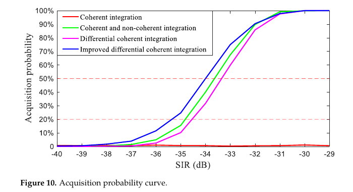
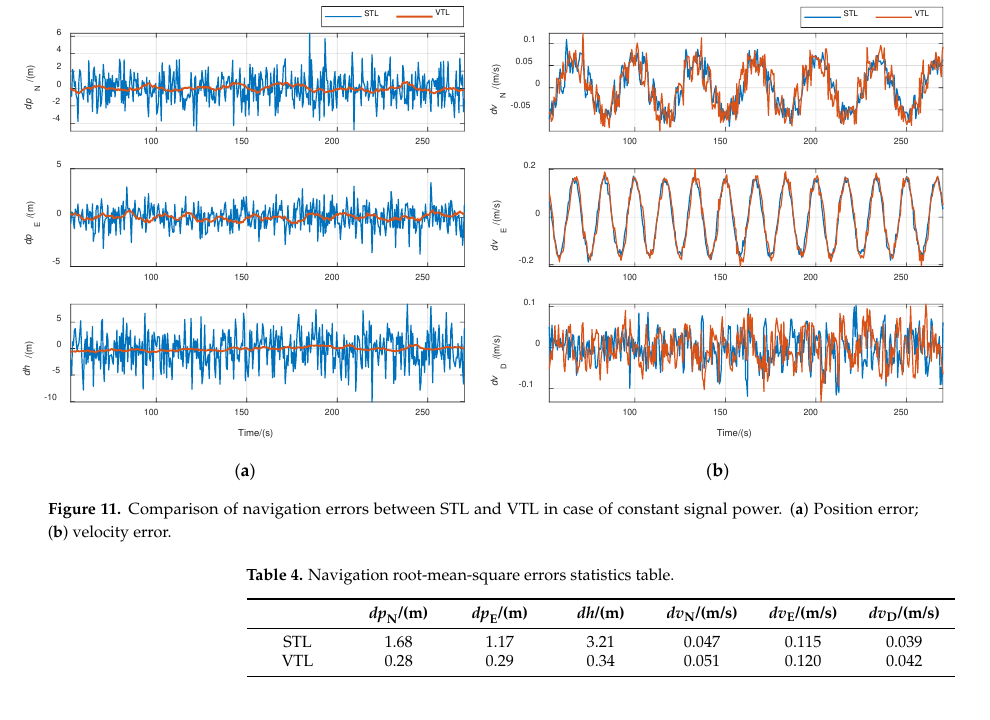
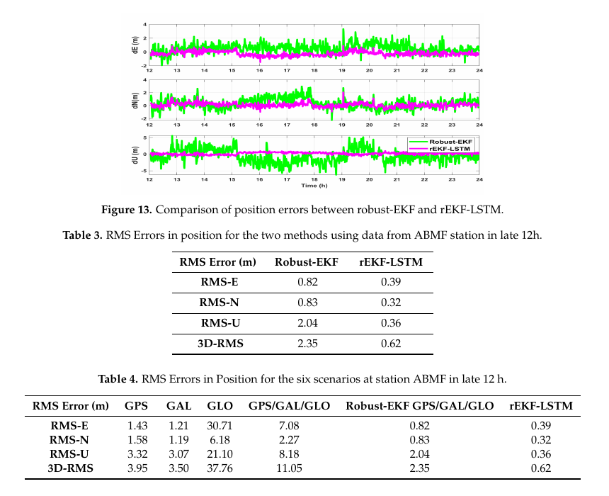

# 2026-09-12 GNSS 每日研究简报

## 今日快报

### 快报 1：日食让三地 TEC 同时下降，但 40—65 min 波动仍只是重力波耦合的有条件解释

- 主题：`eclipse-multilatitude-gnss-tec-wavelet`
- 来源 ID：`doi:10.1134/s0016793226600165`
- 来源链接：https://doi.org/10.1134/s0016793226600165
- 发表日期：2026-09-11
- 来源类型：Geomagnetism and Aeronomy 同行评审论文、多纬度 GNSS-TEC 日食响应分析
- 获取范围：出版者元数据与完整正式摘要；正文当前受访问控制，未据此补写 TEC 降幅、去趋势窗长或小波显著性阈值

**内容：** 研究用低纬 BOGT、中纬 P398 和高纬 NYAL 三站的逐 PRN GNSS-TEC，对比 2017 年 8 月 21 日日食期间的大尺度电子密度下降与短时扰动；去趋势 TEC 残差再进入连续小波变换，寻找日食最大阶段附近及之后的周期结构。

**结论：** 正式摘要报告三站均出现 TEC 减少，低纬响应最大，高纬较弱但更不规则；小波分析给出约 40—65 min 的增强周期。作者将其解释为日食驱动大气重力波及电离层—热层耦合所激发的中尺度行进电离层扰动，但摘要使用“most likely”，所以本条不把周期共现写成已完成因果识别。

**关注理由：** GNSS 电离层监测的工程难点不只在“有没有异常”，还在背景电离、纬度电动力学和去趋势方法会共同改变残差。接收机或空间天气告警应保存原始 TEC、趋势项和检测参数，避免把滤波产物当成独立物理证据。

### 快报 2：磁暴期 S4 要逐星看：同一低纬站也会在时段和 PRN 之间分化

- 主题：`storm-prn-wise-gnss-s4-agra`
- 来源 ID：`doi:10.1134/s0016793226600189`
- 来源链接：https://doi.org/10.1134/s0016793226600189
- 发表日期：2026-09-11
- 来源类型：Geomagnetism and Aeronomy 同行评审论文、低纬逐 PRN 闪烁统计
- 获取范围：出版者元数据与完整正式摘要；正文当前受访问控制，未展开接收机型号、仰角门限或样本完整率

**内容：** 研究分析印度 Agra 站 2024—2025 年逐 PRN 的 GNSS 振幅闪烁指数 $`S_4`$，并把 2024 年 5 月超级磁暴和 2025 年 11 月 G5 事件与 Dst、Kp 指标及连续小波周期并列比较，关注日落后不规则体和行进电离层扰动。

**结论：** 摘要给出的强闪烁门限为 $`S_4\ge 0.6`$，主要事件集中在 17:00—23:00 UT；2024 年 5 月事件峰值接近 1.2，2025 年 11 月事件则以更宽的弱—中等闪烁分布为主，小波周期覆盖约 20—180 min。这是单站、逐星和两次事件的统计关联，不能外推为所有经度或所有接收机的失锁概率。

**关注理由：** 接收机测试若只看整机平均 $`C/N_0`$，会掩盖逐 PRN 的闪烁、仰角和天线方向差异。工程日志应把 $`S_4`$、锁定状态、周跳和环路带宽按星对齐，才能把空间天气与前端故障区分开。

### 快报 3：同一站的 NavIC/GPS VTEC 预测里，FFNN 胜出不等于跨季节、跨站都胜出

- 主题：`navic-gps-vtec-deepar-dlinear-ffnn`
- 来源 ID：`doi:10.1134/s0016793226600293`
- 来源链接：https://doi.org/10.1134/s0016793226600293
- 发表日期：2026-09-11
- 来源类型：Geomagnetism and Aeronomy 同行评审论文、NavIC/GPS VTEC 机器学习预测
- 获取范围：出版者元数据与完整正式摘要；正文当前受访问控制，未补写训练时段、预测步长、特征归一化或独立测试划分

**内容：** 研究以印度 Bangalore 的 ACSCE 站运行中 NavIC 接收机的 L5/S 频段伪距构造 VTEC，比较 DeepAR、DLinear 和前馈神经网络（FFNN），并与 IRI-2016/IRI-2020 经验模型对照。

**结论：** 正式摘要列出 FFNN 的 NRMSE 0.136、SMAPE 9.51%、MASE 0.839，DLinear 为 0.157/11.57%/0.961，DeepAR 列为“0.0.225”/18%/1.468；前者疑似排版错误，故仅按原样标记而不替作者修正。摘要认为 FFNN 最优，但单站数据、未披露的时间切分与磁暴覆盖决定了这一排序的可迁移性。

**关注理由：** 电离层学习模型必须以按时间块和按事件留出的测试集评分。若训练与测试共享相邻日、太阳活动或同一接收机偏差，漂亮的平均误差可能主要反映时间泄漏而不是可部署预测能力。

### 快报 4：双星座航空改装可以并行做鲁棒 SPP 与交叉校验，但仿真可用性不是适航批准

- 主题：`bds-gps-airworthiness-fdi-proxy-architecture`
- 来源 ID：`doi:10.4271/2026-99-1415`
- 来源链接：https://doi.org/10.4271/2026-99-1415
- 发表日期：2026-09-11
- 来源类型：SAE Technical Paper、BDS/GPS 航空改装故障检测与隔离仿真
- 获取范围：SAE/Crossref 书目信息与完整正式摘要；全文当前受访问控制，未核验干扰注入波形、RAIM 风险分配或适航符合性材料

**内容：** 论文提出透明代理架构：以兼容外形的 GPS/BDS 双模天线和射频功分器接入既有航空电子接口；GPS-only、BDS-only 和混合通道并行运行，以 $`C/N_0`$、卫星仰角、码减相位、Hatch 平滑、Huber 重加权 WLS 和各通道 RAIM 组合，再用星座间位置分歧识别可能绕过单系统 RAIM 的星座级欺骗。

**结论：** 摘要报告四档干扰仿真中，混合通道相对 GPS-only 的水平精度改善 34%；当 GPS 欺骗造成位置分歧超过 50 m 时，交叉检查在 25 s 内检测，名义仿真可用性为 99.9%。这些是作者仿真条件下的结果，不等同于机载射频试验、DO-178C/DO-254 证据或任何监管机构的适航批准。

**关注理由：** 多星座冗余只有在故障假设足够独立时才提供完整性增益。共用天线、射频前端、时钟或算法会形成共因失效，工程安全论证必须把“更多卫星”与“真正独立的监测通道”分开。

### 快报 5：运动员 GPS 负荷与心率高度相关，但 266 条记录仍只来自 11 个人

- 主题：`wearable-gps-heart-rate-within-player-load`
- 来源 ID：`doi:10.1371/journal.pone.0357176`
- 来源链接：https://doi.org/10.1371/journal.pone.0357176
- 发表日期：2026-09-11
- 来源类型：PLOS One 同行评审开放论文、可穿戴 GPS/IMU 与心率队内纵向研究
- 获取范围：CC BY 4.0 开放全文 13 页；设备、样本嵌套、重复测量相关、混合模型与局限已核对

**内容：** 11 名 U17 男子足球运动员在 9 周内始终佩戴同一台 10 Hz GPS/100 Hz IMU 设备，形成 266 个“运动员—训练课”观测；研究以重复测量相关分析累计距离、PlayerLoad、冲刺与心率负荷的个体内关系，再以线性混合模型分析每分钟强度指标。

**结论：** 累计心率负荷与总距离、PlayerLoad 的个体内相关分别为 $`r=0.921`$ 和 $`r=0.924`$，每分钟总距离与每分钟爆发动作是每分钟心率负荷的主要独立预测量。论文明确指出 266 条记录嵌套于仅 11 名同队球员，结果是情境性探索，不能把同一人的重复观测当作 266 个独立受试者，也不能据此替代心率测量。

**关注理由：** 这是 GNSS 测量进入下游决策的典型例子：采样率、设备一致性和层级统计模型决定结论是否可信。类似原则同样适用于车辆、手机和群体轨迹数据，必须区分“历元很多”与“独立样本很多”。

## 深度研读

### 深读 1｜信号捕获｜先弄清积分的信息账：相邻相关量为什么既能抗数据位翻转又会损失一次样本

- 类别：`acquisition`
- 学习层级：`foundation`
- 选题定位：`经典基础`
- 来源 ID：`doi:10.3390/electronics12061343`
- 来源链接：https://doi.org/10.3390/electronics12061343
- 发表日期：2023-03-12
- 来源类型：Electronics 同行评审开放论文、强闪烁下 GPS L1 C/A 弱信号捕获
- 获取范围：CC BY 4.0 开放全文 13 页；公式、仿真参数、2000 次 Monte Carlo、巴西实采回放和计算量表已核对
- 价值评分：92/100（相关性 20，经典价值 17，证据 17，教学价值 19，工程价值 19）

#### 为什么先学这个

捕获不是“找最大 FFT 点”这么简单。长相干积分能线性积累信号，却可能被 20 ms 导航数据位翻转抵消；非相干积分不怕符号，却带来平方损失；差分相干积分用相邻相关量的共轭乘积消掉共同符号，但少一项并改变噪声分布。把这笔信息账算清，才知道灵敏度、虚警率和算力之间如何交换。

#### 先修知识

需要理解 GPS L1 C/A 的 1 ms 码周期和 20 ms 导航数据位、码相位—多普勒二维搜索、复相关输出 $`Z_k=I_k+jQ_k`$、FFT 圆周相关、相干/非相干积累、共轭乘积、峰值比门限、$`C/N_0`$ 与本文 SIR 不是同一个量。

#### 一句话逻辑

先把若干短相关块做相干累加以减少 FFT/IFFT 次数，再估计并剔除包含数据位跳变的块，最后对相邻复相关量做完整的差分相干积累，从而在弱信号下保留 I/Q 两路能量。

#### 研究问题与约束

论文目标是严重电离层闪烁下的 GPS L1 C/A 捕获。仿真采样率 3 MHz，搜索步长 500 Hz，PRN10 的码相位与多普勒真值约为 2430 chip 和 3000 Hz；每个 SIR 点用 2000 次 Monte Carlo。实测部分回放 2014-02-27 巴西 PRN19 的 40 s 中频数据。SIR、回放前端、单星与固定门限 2.3 都限制外推。

#### 核心方法论

基线 PCPS 对输入复信号与本地 C/A 码做 FFT 域相关。传统差分相干法直接把相邻 $`Z_k`$ 共轭相乘后求和。作者先对短块做相干累加，把长数据分组以降低变换点数；再根据相邻块幅度差估计可能的数据位跳变并舍弃该块；最后使用完整复数差分表达式而不是只保留实部，使存在多普勒残差时的 Q 路信号能量不被丢掉。

#### 关键公式逐步推导

FFT 并行码相位搜索利用圆周互相关：

```math
z[n]=\sum_{m=0}^{N-1}x[m]y[m-n]
=\operatorname{IFFT}\{X[k]Y^*[k]\}.
```

第 $`k`$ 个相干块的复相关量为 $`Z_k=I_k+jQ_k`$。完整差分相干判决量写作：

```math
R_{\mathrm{diff}}=
\left|\sum_{k=2}^{K} Z_k Z_{k-1}^{*}\right|^2.
```

展开后既含 $`I_kI_{k-1}+Q_kQ_{k-1}`$，也含多普勒残差引起的虚部项；只取实部会在弱信号且相位未完全对准时丢能量。判决再用主峰与次峰之比：

```math
\eta=\frac{R_{\max}}{R_{\mathrm{2nd}}},
\qquad \eta>\gamma \Rightarrow \text{acquired}.
```

门限 $`\gamma`$ 不是普适常数，应按搜索单元数、噪声分布和目标虚警率重标定。

#### 经典价值与创新边界

经典价值在于把 PCPS、数据位翻转和差分相干的三类积分关系完整串起来。创新点是“短块相干累加＋位跳变估计＋完整复差分”的组合，而不是发现新的统计最优检测器。作者以峰值比和经验门限评估，没有给出任意搜索规模下的严格恒虚警推导。

#### 整体逻辑链

中频下变频得到 I/Q；每个多普勒频点做 FFT 圆周相关；短块相干累加；估计数据位跳变并排除受污染块；相邻复相关量共轭相乘；跨块累加形成二维判决面；主峰比过门限则输出码相位和多普勒；最后用 Monte Carlo 与实采回放分别评估灵敏度和场景可行性。

#### 原文图表与结果分析



> 图表源：Lin 等《Optimal GPS Acquisition Algorithm in Severe Ionospheric Scintillation Scene》Figure 10，[开放全文](https://doi.org/10.3390/electronics12061343)。由 CC BY 4.0 原始 PDF 第 10 页以 130 dpi 渲染，仅裁出原图与图题；未重排、改字或修改数据。

横轴 SIR 为 −40 至 −29 dB，纵轴为每个 SIR 点 2000 次试验得到的捕获概率。蓝线（改进差分相干）在约 −34 dB 穿过 50%，比绿/洋红基线更早上升；红线（单纯相干）在该范围几乎为零。曲线直接支持的是给定采样率、积分长度、搜索步长和门限下的相对灵敏度，不是 $`C/N_0`$ 的通用接收机门限，也不提供置信区间。

#### 原文结果论述

仿真中改进方法在 SIR −34 dB 时约 50% 捕获，低于 −36 dB 后也降至 20% 以下。表 2 给出的复乘量为 $`3.11\times10^5`$，是四法最高值 $`1.43\times10^6`$ 的 21.75%；同平台单次时间为 $`0.56t`$，其中基准 $`t=0.49375`$ ms。实采闪烁回放中，四法捕获率为 61.2%、95.9%、94.4% 和 96.1%；后三者差异很小，论文未给重复场景或区间，不能把 0.2—1.7 个百分点写成稳定优势。

#### 常见误区与适用边界

第一，把 SIR 直接换成 $`C/N_0`$。第二，搜索更多多普勒/码单元却沿用同一峰值比门限。第三，只报捕获率，不报虚警率和错误峰分布。第四，在未知数据位边界时盲目拉长相干时间。第五，把仿真复杂度比例当成目标 DSP 上的绝对耗时。第六，把单次巴西闪烁回放当成多纬度、多接收机验证。

#### 工程实现步骤

1. 固定 IF、采样率、码采样数和多普勒网格，建立可复现 PCPS 基线。
2. 输出每个短块的复相关 $`Z_k`$，不要在差分前丢弃 Q 路。
3. 在已知数据位跳变的合成信号上验证估计与剔除逻辑。
4. 以噪声-only 数据按搜索单元数标定 $`\gamma`$ 和全局虚警率。
5. 扫描 SIR、多普勒残差、码偏半格和位边界，至少每点 2000 次。
6. 分开统计正确峰、错误峰、漏检、耗时和内存访问量。
7. 用实采正常/闪烁数据回放，并记录 $`S_4`$、$`C/N_0`$ 与锁定状态。
8. 只有捕获输出落入跟踪环拉入范围时才记为工程成功。

#### 复现实验设计

生成 GPS L1 C/A PRN10，采样率 3 MHz，20 ms 数据块，多普勒真值 3000 Hz、步长 500 Hz，码相位 2430 chip；SIR 从 −40 到 −22 dB 每 1 dB 一档，每档 5000 次。比较 1/10/20 ms 相干、相干＋非相干、完整差分相干和论文方法；随机化数据位边界、残余多普勒与闪烁幅相序列。指标为全局虚警率、正确捕获概率、码/频误差、每次复乘与实际 CPU/DSP 时间。再以至少三段正常和三段强闪烁实采 IF 盲测，若不同门限才可维持同一虚警率，应报告 ROC 而非单点胜负。

#### 与定位及低成本实现的联系

低成本芯片最怕用算力换来的长积分仍被数据位翻转抵消。差分相干能降低对位同步的依赖，但输出频率精度和错误峰概率会影响后续跟踪。下一节因此不再单独优化一个通道，而是用跨通道导航状态帮助 NCO 在高动态和短时衰减中保持可跟踪区间。

#### 本节小结

弱信号捕获的核心不是“积得更久”，而是明确每次积分保留了什么相位信息、付出了什么噪声代价，并在固定虚警率下比较。

### 深读 2｜信号跟踪｜把各通道接到同一导航状态：硬件矢量环如何间接改码相位、直接救弱星

- 类别：`tracking`
- 学习层级：`intermediate`
- 选题定位：`基础进阶`
- 来源 ID：`doi:10.3390/s21165629`
- 来源链接：https://doi.org/10.3390/s21165629
- 发表日期：2021-08-20
- 来源类型：Sensors 同行评审开放论文、FPGA+DSP 高动态矢量跟踪实现
- 获取范围：CC BY 4.0 开放全文 19 页；环路结构、导航滤波、同步、硬件参数和三组模拟器试验已核对
- 价值评分：94/100（相关性 20，经典价值 18，证据 18，教学价值 19，工程价值 19）

#### 为什么先学这个

上一节的捕获只给粗码相位和多普勒。传统标量环让每颗星独立承受热噪声与动态应力，弱星一旦失锁只能重新捕获；矢量跟踪把所有通道通过 PVT/钟状态耦合，让强星和低动态星共同约束弱星的本地复制信号。难点不是 EKF 公式，而是如何在真实 FPGA NCO 接口、异步相关结果和固定导航周期下闭环。

#### 先修知识

需要掌握 Early/Prompt/Late 相关器、DLL/FLL/PLL 鉴别器、码与载波 NCO、伪距和伪距率、LOS 几何、接收机钟差/钟漂、离散 Kalman 滤波、动态应力、相关积分周期与导航更新周期的区别。

#### 一句话逻辑

每个通道只把码/频误差送到公共导航滤波器；滤波器估计统一的位置、速度、加速度和钟状态，再按各星几何反算下一周期码率与载频，使健康通道的信息共同约束弱通道。

#### 研究问题与约束

论文面向 GPS L1 C/A 高动态硬件接收机，平台为 Intel Cyclone V FPGA 与 TI TMS320C6748 DSP。Spirent GSS7700 生成可重复的 50 g、50 g/s jerk、最高 4500 m/s 超高动态，以及 10 km、平均 300 m/s 的八字轨迹。证据来自模拟器而非实飞；VTL 与 STL 共用参数，但公共滤波也会让异常通道污染其余通道。

#### 核心方法论

接收机先在 STL 中完成捕获、跟踪和星历收集，至少四颗有效星后切入 VTL。相关器 I/Q 产生码相位和载频误差；公共导航滤波按 50 ms 更新 PVT 与钟状态。硬件不能瞬时设置任意码相位，所以在 1 ms 校正窗内给码 NCO 叠加频率偏置，积分结束时累积到目标相位；载波相位则在相关后对 I/Q 旋转校正。弱信号时退化为由几何和钟状态预测载频的一阶恢复模式。

#### 关键公式逐步推导

把所有星的伪距/伪距率残差堆叠：

```math
\mathbf z_k=
\begin{bmatrix}\Delta\boldsymbol\rho_k\\
\Delta\dot{\boldsymbol\rho}_k\end{bmatrix}
=\mathbf H_k\,\delta\mathbf x_k+\mathbf v_k,
```

其中误差状态含位置、速度、加速度、钟差和钟漂。线性 Kalman 更新为：

```math
\mathbf K_k=\mathbf P_k^-\mathbf H_k^{\mathsf T}
(\mathbf H_k\mathbf P_k^-\mathbf H_k^{\mathsf T}+\mathbf R_k)^{-1},
\qquad
\delta\hat{\mathbf x}_k=\mathbf K_k\mathbf z_k.
```

对卫星 $`s`$，修正后的几何与钟状态给出预测距离率 $`\hat{\dot\rho}_s`$，载波 NCO 近似为：

```math
f_{\mathrm{NCO},s}=f_{\mathrm{IF}}-\frac{\hat{\dot\rho}_s}{\lambda_s}.
```

若硬件需在 $`T_c`$ 内补偿码相位误差 $`\Delta\tau_s`$，则临时码率增量满足：

```math
\Delta f_{\mathrm{code},s}=\frac{\Delta\tau_s}{T_c}.
```

最后两式是按论文控制逻辑的单位化表达；实现必须核对符号、码片/秒与秒之间的换算。

#### 经典价值与创新边界

经典价值是把矢量环的“跨星共享导航状态”落到 FPGA/DSP 时序、相位间接校正和弱星恢复状态机。创新边界是级联 VTL 及 Kalman 结构并非新概念，论文贡献主要是部分开环 NCO 控制与硬件可实现框架；模拟器场景未覆盖多路径、欺骗或公共滤波发散。

#### 整体逻辑链

STL 捕获并收集星历；有效星数达到四颗；锁存各通道码相位与相关量；同步形成伪距/伪距率；公共导航滤波估计误差状态；校正 PVT 与钟；按星几何生成 NCO 控制；健康通道维持公共状态；弱/中断通道用预测载频快速回锁；有效星不足再退回 STL 重新开始。

#### 原文图表与结果分析



> 图表源：Mu 与 Long《Design and Implementation of Vector Tracking Loop for High-Dynamic GNSS Receiver》Figure 11 与 Table 4，[开放全文](https://doi.org/10.3390/s21165629)。由 CC BY 4.0 原始 PDF 第 15 页以 130 dpi 渲染，仅裁出原图、图题和原表；未重排、改字或修改数据。

横轴是八字轨迹的时间（s）；左列是北、东、高位置误差（m），右列是三轴速度误差（m/s），蓝/橙分别为 STL/VTL。VTL 的位置误差明显收紧，但速度曲线基本重合。原表给出 STL/VTL 的 N/E/H RMS 为 1.68/1.17/3.21 m 与 0.28/0.29/0.34 m；速度 RMS 反而近似或略高，直接支持“公共滤波改善码跟踪而非自动改善所有载波动态”的边界。

#### 原文结果论述

在 50 g 超高动态试验中，STL 的 PRN1/6/22 分别在突变附近失锁并需数秒恢复，VTL 的对应 $`C/N_0`$ 仅短降约 2 s。信号以 1 dB/s 从 50 dB-Hz 衰减时，STL 通道在约 25 dB-Hz 后陆续失锁，VTL 全部保持跟踪。两个通道各关闭 10 s 后，VTL 在信号恢复时立即重锁，而 STL 要重新捕获。12 星导航滤波在 456 MHz DSP 上平均 12.8 ms，低于 50 ms 更新周期，但这是特定实现与状态维数的结果。

#### 常见误区与适用边界

第一，把 VTL 当成每星独立环路的后端平滑。第二，让低质或欺骗通道无门控进入公共滤波。第三，把模拟器动态鲁棒性等同实飞多路径鲁棒性。第四，忽略相关器、NCO、导航更新三个时钟域的同步。第五，在有效星不足四颗时继续相信公共 PVT。第六，只看位置改善而不检查速度、钟漂和创新一致性。第七，不保留回退 STL 的状态机。

#### 工程实现步骤

1. 先用同一 IF 数据把 STL 的 DLL/PLL 和 PVT 基线跑稳定。
2. 为每个通道记录相关完成时刻、码相位锁存时刻和积分长度。
3. 统一伪距率参考历元，避免异步误差被解释成动态。
4. 建立位置—速度—加速度—钟差—钟漂误差状态，做量纲单元测试。
5. 实现 1 ms 码相位间接校正与 I/Q 载波旋转，验证正负号。
6. 以创新、$`C/N_0`$ 和锁定状态门控进入公共滤波的通道。
7. 设计 STL→VTL、弱星恢复、VTL→STL 三套转换测试。
8. 逐星输出 NCO 命令、滤波残差、协方差与 CPU 截止时间违例。

#### 复现实验设计

用软件信号源或硬件模拟器生成 GPS L1 C/A：一组峰值 50 g、jerk 50 g/s，另一组平均 300 m/s 的八字轨迹。STL/VTL 统一 DLL 2 Hz、PLL/载频估计器 18 Hz，相干积分按 37/30 dB-Hz 门限在 1/5/20 ms 间切换，导航周期 50 ms。分别注入 1 dB/s 衰减、两颗星 10 s 中断、单星 50 m 伪距阶跃和公共钟跳。指标包括失锁数、恢复时间、N/E/U 与速度 RMS、创新 NIS、错误通道向健康通道传播量、CPU P99。若 VTL 在无故障时占优却在单星偏差下注入全局误差，应先修门控再谈灵敏度。

#### 与定位及低成本实现的联系

矢量环把信号处理与 PVT 真正闭合，适合资源有限但有多通道并行器的接收机；代价是错误也可跨通道传播。下一节把这个问题带到定位域：对进入状态估计的异常伪距做稳健重加权，再讨论学习器是否真的获得了可泛化的残差结构。

#### 本节小结

VTL 的力量来自跨星共享几何与钟信息，风险也来自同一共享路径；硬件实现的成败取决于同步、门控和可回退状态机，而不只是 Kalman 方程。

### 深读 3｜定位算法｜先稳健重加权再学残差：SPP 精度跃升为何仍可能是静态站点记忆

- 类别：`positioning`
- 学习层级：`advanced`
- 选题定位：`定位深入`
- 来源 ID：`doi:10.3390/app10124335`
- 来源链接：https://doi.org/10.3390/app10124335
- 发表日期：2020-06-24
- 来源类型：Applied Sciences 同行评审开放论文、多 GNSS 稳健 EKF 与 LSTM 单点定位
- 获取范围：CC BY 4.0 开放全文 25 页；观测模型、MM/IRWLS、RAIM、四站静态试验、训练切分和局限已核对
- 价值评分：91/100（相关性 20，经典价值 16，证据 17，教学价值 19，工程价值 19）

#### 为什么先学这个

前两节讨论相关峰和跟踪状态，最终都要形成伪距与伪距率。多星座 SPP 增加几何冗余，也可能把 GLONASS 偏差、NLOS 和粗差一起带进解。稳健估计限制异常观测的影响；LSTM 再学习稳健滤波残差。但若训练目标直接使用已知站坐标，模型也可能只是记住单日静态偏差，所以“更小 RMS”与“可迁移定位器”必须分开评价。

#### 先修知识

需要理解多 GNSS 时间基准与系统间钟差、伪距/伪距率观测、EKF 预测更新、Cholesky 白化、MM 估计、IRWLS、残差投影矩阵、RAIM/HPL、LSTM 输入—隐藏—输出结构，以及训练/验证/测试的时间泄漏。

#### 一句话逻辑

先把 EKF 的先验与当前多星座观测白化成同一回归问题，用 MM 权函数和 IRWLS 降低粗差影响并以 HPL 门控；再让 LSTM 从稳健 EKF 的 ENU 序列预测残差，输出“稳健解减预测误差”。

#### 研究问题与约束

论文用 GPS、Galileo、GLONASS 双频观测，在 ABMF、AJAC、GRAC、LMMF 四个固定站处理 2019-01-01 数据。ABMF 前 12 h 训练、后 12 h 测试 LSTM，其他三站用于补充评估。作者明确说明接收机近似静止，速度接近零有利于网络；没有移动用户、城市街谷、跨日或跨季节验证。

#### 核心方法论

每个星座保留独立接收机钟差/钟漂，先做卫星钟、电离层、对流层和多路径改正，再把伪距与伪距率放进 12 维位置—速度—三系统钟状态。EKF 先验与观测经 Cholesky 白化后形成线性回归；MM 估计以残差尺度决定权，IRWLS 迭代求解，RAIM 计算 HPL 接受/拒绝解。LSTM 的输入是稳健 EKF 的三轴位置，监督目标是真值与该位置之差。

#### 关键公式逐步推导

多星座改正后伪距可写为：

```math
\rho_{c,i}=\|\mathbf r_i-\mathbf r_u\|+c\,\delta t_{s(i)}+\epsilon_i,
```

其中 $`s(i)`$ 指 GPS/Galileo/GLONASS 各自钟状态。把先验与线性化观测白化后：

```math
\mathbf y_k=\mathbf G_k\mathbf x_k+\boldsymbol\zeta_k,
\qquad
\hat{\mathbf x}_k=(\mathbf G_k^{\mathsf T}\mathbf W_k\mathbf G_k)^{-1}
\mathbf G_k^{\mathsf T}\mathbf W_k\mathbf y_k.
```

残差尺度由中位数估计：

```math
s=1.4826\,\operatorname{median}(|r_i|),
```

再以 MM/Bi-Tukey 权函数迭代更新 $`\mathbf W_k`$。论文的 HPL 由最坏故障模式斜率与残差标准差组合：

```math
\mathrm{HPL}=\alpha_{\max}\sigma_0.
```

学习校正最终为：

```math
\widehat{\mathbf p}_{\mathrm{rEKF-LSTM}}
=\widehat{\mathbf p}_{\mathrm{rEKF}}-\widehat{\delta\mathbf p}_{\mathrm{LSTM}}.
```

最后一式有效的前提是训练时残差关系在部署域中保持稳定。

#### 经典价值与创新边界

价值在于把多星座钟状态、稳健回归、RAIM 门控与时序残差学习放在同一流水线，适合教学“模型法先兜底、学习法后校正”。边界是 HPL 构造较简化，稳健权函数与完整性风险没有形成严格联合概率保证；LSTM 的标签依赖已知站坐标，结果更像静态站点残差回归而不是普适动态 SPP。

#### 整体逻辑链

读取 RINEX 与广播星历；统一坐标和三系统时间；改正卫星钟与传播误差；形成伪距/伪距率；EKF 预测；先验和观测联合白化；MM/IRWLS 迭代重加权；RAIM/HPL 门控；保存稳健 ENU 与真值残差；按时间块训练/验证 LSTM；预测残差并从稳健解中扣除；最后跨站比较 RMS。

#### 原文图表与结果分析



> 图表源：Tan 等《Robust-Extended Kalman Filter and Long Short-Term Memory Combination to Enhance the Quality of Single Point Positioning》Figure 13、Table 3 与 Table 4，[开放全文](https://doi.org/10.3390/app10124335)。由 CC BY 4.0 原始 PDF 第 22 页以 130 dpi 渲染，仅裁出原图、图题和原表；未重排、改字或修改数据。

横轴是 ABMF 当天 12—24 h，纵轴为 E/N/U 误差（m）；绿线稳健 EKF，洋红线 rEKF-LSTM。Table 3 的 E/N/U/3D RMS 从 0.82/0.83/2.04/2.35 m 降到 0.39/0.32/0.36/0.62 m。图表证明同日后半段静态站上残差回归有效，却不能区分模型学到卫星几何周期、站点多路径、当天大气还是可迁移的误差规律。

#### 原文结果论述

ABMF 的非稳健 GPS/Galileo/GLONASS 组合 3D RMS 为 11.05 m，稳健 EKF 为 2.35 m，rEKF-LSTM 为 0.62 m；论文分别概括为约 84% 和 95% 改善。AJAC/GRAC/LMMF 的 rEKF-LSTM 3D RMS 为 0.97/1.89/0.76 m，相对各自非稳健组合改善约 87%/77%/93%。但同一日、固定站和可能共享训练策略不足以证明移动、断续或跨天气泛化；某些轴上 rEKF-LSTM 也略差于稳健 EKF，例如 AJAC/GRAC 东向。

#### 常见误区与适用边界

第一，把多星座直接堆叠却只估一个钟差。第二，在白化前比较不同量纲残差。第三，把稳健降权等同故障隔离。第四，用 HPL 低于 HAL 就宣称满足特定安全标准。第五，随机打乱相邻历元训练测试造成泄漏。第六，用固定站训练后直接部署到车辆。第七，只报相对百分比而不报原始 RMS。第八，让 LSTM 校正值无界地回写导航状态。

#### 工程实现步骤

1. 为 GPS/Galileo/GLONASS 分别建立钟差与钟漂状态，并检查时间系统换算。
2. 保存每星原始与改正后伪距、伪距率、仰角、$`C/N_0`$ 和改正标志。
3. 用 Cholesky 白化联合先验/观测回归，检查条件数和单位。
4. 先实现普通 EKF，再加入 MM 尺度与 IRWLS，限制最小权重和迭代次数。
5. 以独立粗差注入校验权重、残差与位置影响曲线。
6. 将 RAIM/HPL 与完整性告警单独记录，不把它当训练损失替代品。
7. LSTM 输入只用部署时可得特征，按整日、整站和整路线留出。
8. 对学习校正设置幅值/不确定度门控；域外时退回稳健 EKF。

#### 复现实验设计

选四个 IGS/MGEX 固定站与一条独立车载路线，使用连续 14 d 的 1 Hz 双频 GPS/Galileo/GLONASS 数据。基线为 WLS、普通 EKF、稳健 EKF；学习组分别做随机历元切分、按整日留一和按站留一，明确展示泄漏差距。注入单星 10/30/100 m 阶跃、持续 NLOS、星座钟跳和 10 s 中断。指标包括 E/N/U 与 3D RMS/P95、HPL 包络率、错误接受率、权重恢复时间、跨日/跨站退化、CPU 和最大校正幅值。若随机切分提升巨大而留日/留站失效，应把 LSTM 定位为站点校准器，不应宣称通用 SPP。

#### 与定位及低成本实现的联系

低成本 SPP 能受益于多星座几何与稳健重加权，而无需载波定整。学习残差只有在可观测特征、独立真值和域外门控齐全时才安全；否则最可靠的收益仍来自正确的系统间钟状态、传播改正、逐星质量控制和可解释权函数。

#### 本节小结

“稳健滤波＋LSTM”可以把静态站 RMS 压低，但工程结论必须由按日、按站、按路线的独立验证决定；小误差不是泛化能力，也不是完整性保证。
