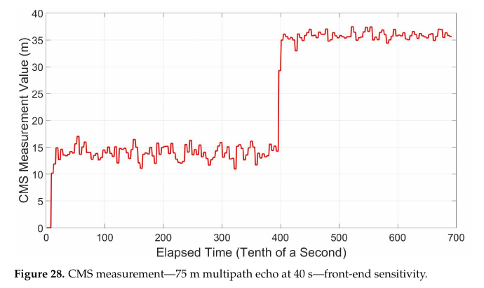
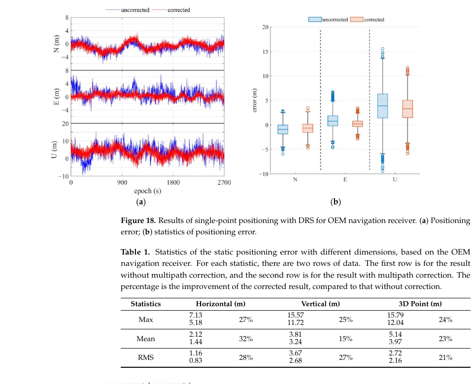
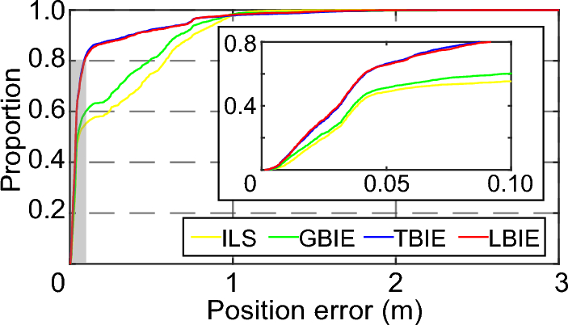

# 2026-09-13 GNSS 每日研究简报

## 今日快报

### 快报 1：高密度 GNSS 速度场刻画川滇应变带，但高应变与地震邻近不等于短期预测

- 主题：`setp-high-resolution-gnss-strain-euler-clustering`
- 来源 ID：`doi:10.1093/gji/ggag369`
- 来源链接：https://doi.org/10.1093/gji/ggag369
- 发表日期：2026-09-12
- 来源类型：Geophysical Journal International 同行评审研究论文、GNSS 地壳形变建模
- 获取范围：Crossref 登记的正式摘要与出版元数据；正文未取得，未补写样本量、反演正则化、站点时间跨度或检验区间

**内容：** 作者汇集川滇地区的 GNSS 速度矢量，构建较高空间分辨率的现今应变率场，并用无监督 Euler 极聚类辅助解释断裂带两侧的运动关系。

**结论：** 摘要报告一条沿鲜水河—小江断裂并向西南延展的 J 形高应变带，以及内部主应变轴的顺时针转向。作者认为这一格局支持断裂间可能的深部联结，并指出高应变区与历史较大地震在空间上接近；这只是区域构造与危险性线索，不能当作地震发生时间或单个断层破裂的预测。

**关注理由：** GNSS 站网加密能让长期形变的空间梯度更清楚，同时也更依赖站点稳定性、参考框架和应变平滑尺度。工程应用若把颜色图直接映射为实时风险等级，会跨过从观测到危险性概率模型的关键一步。

### 快报 2：低成本 GNSS 模块的频点优势需要分场景看，不能把综述结论当成开机即得

- 主题：`low-cost-gnss-module-frequency-environment-review`
- 来源 ID：`doi:10.1515/jag-2026-0044`
- 来源链接：https://doi.org/10.1515/jag-2026-0044
- 发表日期：2026-09-11
- 来源类型：Journal of Applied Geodesy 同行评审定量系统综述、低成本模块比较
- 获取范围：出版者登记的正式摘要与书目信息；全文未取得，未将摘要未给出的价格、天线配置或置信区间补为统一结论

**内容：** 研究按 PRISMA 路线从 Scopus 和 Google Scholar 筛选既有研究，比较单频、双频和多频低成本 GNSS 模块在开阔、城市与运动条件下的 RMSE、标准差和成本。

**结论：** 摘要认为多频模块总体更稳定，双频优于单频但仍受城市多路径影响。由于这是异质研究的汇总而非同一硬件、天线、基站和环境的盲测，摘要不足以证明任意多频模块在任意场景都能稳定达到同一精度。

**关注理由：** 采购和选型应至少同时记录频点、天线、改正服务、基线长度、遮挡条件和固定率。把“多频”当成一个单独的性能规格，会漏掉决定实际部署表现的整条误差链。

### 快报 3：已知跑步路线可帮助修复廉价 GPS 轨迹，路线先验本身也是性能来源

- 主题：`wearable-gps-route-constrained-trajectory-reconstruction`
- 来源 ID：`doi:10.3390/app16188972`
- 来源链接：https://doi.org/10.3390/app16188972
- 发表日期：2026-09-10
- 来源类型：Applied Sciences 同行评审开放论文、消费级 GNSS 轨迹重构
- 获取范围：CC BY 4.0 开放全文；数据规模、基线、结果和局限已逐节核对

**内容：** 论文在同一条 5.726 km 路线上，用三条较高质量手表轨迹构造参考代理，并对三条手机低质量轨迹执行活动窗筛选、路线关联、参考高程替换和配速重构；比较最近检查点、HMM/Viterbi、单调动态规划等方法。

**结论：** 共同活动窗内，原始点到路线的汇总 RMSE 为 30.72 m，筛选且路线一致的保留点为 14.84 m；配速 RMSE 从 2.40 降到 1.74 min/km。正文同时说明，三条低质量记录中大量检查点依赖模型补全，参考轨迹只是手表平均代理而非测量级真值；最近点法还可能以更低几何误差换来严重的轨迹回退。因此这不是未知路线自主定位精度的证明。

**关注理由：** 面向运动或物流轨迹修复，应把“观测点精度”“补全覆盖率”和“路线先验强度”分开报告。若真实路线未知或临时改道，依赖固定参考路线的漂亮轨迹会掩盖误配。

### 快报 4：双站 GNSS 水汽序列能定位设备更换台阶，ERA5 作差不总是更稳

- 主题：`twin-gnss-iwv-step-homogenization`
- 来源 ID：`doi:10.5194/egusphere-2026-3520`
- 来源链接：https://doi.org/10.5194/egusphere-2026-3520
- 发表日期：2026-09-09
- 来源类型：EGUsphere 公开讨论预印本、GNSS 大气水汽时间序列均一化；尚未经期刊最终同行评审
- 获取范围：CC BY 4.0 预印本全文；19 组双站、台阶估计、ERA5 对照和结论均已核对

**内容：** 作者用共址双 GNSS 站的积分水汽量（IWV）差分估计设备变更时的台阶，再用 ERA5 趋势评估长期均一化效果；同时考察站高方向坐标跳变是否可用于缺乏双站的站点。

**结论：** 预印本报告 19 组双站中，双站差分估计的台阶使长期趋势与 ERA5 更一致；高程台阶与 IWV 台阶呈负相关，论文给出约每 1 mm 高程跳变对应 −0.03 kg/m² IWV 台阶。作者也发现直接用 GNSS–ERA5 差估台阶可能过大，且需要更长的变更前后窗口。这是台站资料及所用处理策略下的经验关系，不应未经再校准移植到所有接收机或气候区。

**关注理由：** 水汽长期趋势可能被天线、接收机和测站维护的非气象跳变污染。定位基准站日志应保留设备变更、坐标台阶与水汽产品的共同时间戳，让后续气象应用能追溯硬件影响。

### 快报 5：GNSS 对 InSAR 对流层改正有补充价值，但局地修正并非越强越好

- 主题：`gnss-gacos-insar-troposphere-comparison`
- 来源 ID：`doi:10.1007/s12145-026-02236-1`
- 来源链接：https://doi.org/10.1007/s12145-026-02236-1
- 发表日期：2026-09-08
- 来源类型：Earth Science Informatics 同行评审研究论文、GNSS 与 GACOS 对 InSAR 对流层改正比较
- 获取范围：出版者正式摘要与出版元数据；正文需订阅，未补写未披露的误差缩减量和站网插值参数

**内容：** 研究以 2020 年土耳其 Elazığ–Sivrice 地震为案例，处理升降轨 Sentinel-1A 差分干涉图，比较由 GNSS 估计的对流层延迟与 GACOS 产品对视线向位移场的影响。

**结论：** 正式摘要指出，两类改正都会改变位移场，但影响空间不均匀，且没有一种方法在所有干涉对上都均匀改善结果。作者将局地差异与大气、地形、成像几何和 GNSS 站点分布联系起来；摘要没有给出可泛化的优胜比例。

**关注理由：** GNSS 的天顶延迟需要空间和斜路径映射才能进入 InSAR 像元。只比较全图均方值会遮住断层附近的局地误差，应该同时检验剖面、差分图与独立地面点。

## 深度研读

### 深读 1｜接收机工程｜码相位减子载波相位：单机如何监测反射造成的测距偏差

- 类别：`receiver-engineering`
- 学习层级：`foundation`
- 选题定位：`经典基础`
- 来源 ID：`doi:10.3390/rs15225312`
- 来源链接：https://doi.org/10.3390/rs15225312
- 发表日期：2023-11-10
- 来源类型：Remote Sensing 同行评审开放论文、BOC 信号单机多路径检测
- 获取范围：CC BY 4.0 开放全文 28 页；码/子载波观测式、统计门限、仿真和前端偏差试验已核对
- 价值评分：92/100（相关性 19，经典价值 18，证据 18，教学价值 19，工程价值 18）

#### 为什么先学这个

多路径首先改变相关峰的形状，让 DLL 跟错码相位。常见码减载波组合能暴露码多路径，却带进双倍电离层项和载波整周模糊度。BOC 信号还有可独立跟踪的子载波；将两个同频传播的测距量相减，能让站钟、卫星钟、几何距离和一阶电离层项在同机内抵消。这是理解“检测量为什么有效、又为何必须校准”的小模型。

#### 先修知识

需要区分 BOC 码与子载波、DLL/SLL 的 Early–Late 鉴别器、相关峰延迟、伪距单位 m、$`C/N_0`$、码减载波（CMC）、虚警率与检测概率。子载波测量虽更尖锐，也有支路/旁峰和噪声问题，不能把它视作无误差真值。

#### 一句话逻辑

同一信号上分别跟踪码与子载波，形成码减子载波（CMS）测距量；先在无多路径条件下估计零点和噪声，再对超阈值的偏离报警。

#### 研究问题与约束

论文研究独立 Galileo E1B 接收机的反射检测。其主仿真由 Orolia GSG-8 产生六颗可见星，采样率 25 MHz、相关积分 4 ms，码/子载波环带宽各 0.5 Hz，Early–Late 间隔分别 0.5/0.25 chip；每星 280 s、每 0.1 s 输出一次 CMS。仿真先使用理想基带，后专门检验前端限带。多路径误差包络主要是存在直达波与单个镜面反射的模型，不能代表纯 NLOS 或任意散射簇。

#### 核心方法论

码和子载波都来自同一频率的传播路径，因而几何距离、钟差、对流层和电离层在一阶模型中为共模。单机 CMS 把它们相消，留下两个跟踪环各自的多路径和热噪声。与 CMC 不同，CMS 不含载波整周数和双倍电离层项；但子载波环噪声并不比码环小几个数量级，且两环相关使门限方差不能盲目相加。实际前端滤波会产生稳定偏置，报警前须用无多路径标定。

#### 关键公式逐步推导

把同一星、同一时刻的码观测 $`P`$ 与子载波测距 $`S`$ 写成共模 $`G`$ 加各自误差：

```math
P=G+M_P+\epsilon_P,\qquad S=G+M_S+\epsilon_S.
```

两式相减得到论文的 CMS 观测结构（这里把误差符号统一为带符号量）：

```math
D_{\rm CMS}=P-S=M_P-M_S+\epsilon_P-\epsilon_S.
```

若环路噪声标准差为 $`\sigma_P,\sigma_S`$，则精确的零多路径方差还含协方差：

```math
\sigma_D^2=\sigma_P^2+\sigma_S^2-2\operatorname{Cov}(\epsilon_P,\epsilon_S).
```

忽略较小协方差得到保守近似 $`\sigma_D\approx\sqrt{\sigma_P^2+\sigma_S^2}`$。在经验证的近似正态、无多路径条件下，可取 $`|D_{\rm CMS}-\mu_0|>k\sigma_D`$ 报警；$`k=3`$ 的双侧理论虚警率约 0.27%，$`k=5`$ 约 0.000057%，这些数字只对该零假设分布和单次比较成立，多星多历元全局误报还须重新计算。

#### 经典价值与创新边界

价值在于把同频共模消去与检测统计量的零假设标定接在一起，而不只画多路径误差包络。创新是用码—子载波差分作为独立接收机监测量，论文没有证明它能把每次码测距偏差精确反演，也没有覆盖所有 BOC 实现与前端结构。

#### 整体逻辑链

BOC 信号采样；DLL 与 SLL 并行跟踪；统一单位输出码/子载波测距；无多路径数据标定均值、方差及环路相关；模拟反射延迟/振幅/相位建立误差包络；计算 CMS 偏离与报警；在不同前端带宽下复核零点漂移；报警信息交给定位滤波器降权或剔除。

#### 原文图表与结果分析



> 图表源：论文《A Novel Single Differencing Measurement for Multipath Detection》Figure 28，[原文](https://doi.org/10.3390/rs15225312)。由 CC BY 4.0 原始 PDF 第 22 页以 130 dpi 渲染，只裁出原图及原图题；轴、刻度与曲线未修改。

横轴是 0.1 s 为单位的 elapsed time，纵轴为 CMS 测量值（m）。直接读图：40 s 即横轴约 400 处，注入标称 75 m 延迟反射后，红线从约 14—16 m 跳至约 35—37 m。跳变约 20 m 是这一前端和反射配置的 CMS 响应，不等于真实伪距误差恰好 20 m；注入前非零约 15 m 偏置也说明未校准的零门限会持续误报。图不提供跨前端的检测率或虚警率。

#### 原文结果论述

论文以六星、每星 2800 个样本刻画无多路径 CMS 分布，并用误差包络扫描反射延迟、幅度和相位；摘要指出在所选码/子载波间隔下可检出延迟小至 21 m 的模拟反射。前端试验则提示，即使无反射也可能出现约 14.9 m 的 CMS 偏置。模拟检测能力与工程零点稳定性是两件事，不能只引用最短可检距离。

#### 常见误区与适用边界

第一，将码减子载波视作码多路径的无偏真值，忽略子载波环误差。第二，沿用另一台射频前端的零点。第三，只设单历元 3σ 门限却在多星长时间运行中不控制全局虚警。第四，直达波被完全遮挡时仍套用单反射误差包络。第五，把检测成功等同于定位改善，忽略删星后的几何退化。

#### 工程实现步骤

1. 将 DLL/SLL 输出统一为 m，并在无反射基带模拟中核对符号。
2. 为每一信号、前端带宽和环路配置标定 CMS 均值及稳态噪声。
3. 检查两环噪声相关及非正态尾部，按运行级虚警预算选门限。
4. 通过单反射延迟、幅度、相位网格测 ROC，而非只报一个检出点。
5. 在带限、量化、AGC 和动态切换后重复标定。
6. 输出逐星检测标记给定位端，保留原始观测供复核。

#### 复现实验设计

按论文 25 MHz、4 ms、六颗 Galileo E1B 星及 0.5/0.25 chip 间隔建立 SDR 基线；每星运行至少 280 s。依次注入 0、21、75、150 m 延迟反射，幅度比取 0.1/0.5/0.9，反射相位取 0°/90°/180°；另设两档前端带宽和短时遮挡。比较 CMS、CMC 与相关峰非对称监测，按同一全局虚警率报告逐星检出率、报警时延、码误差、定位误差及删星后的 DOP。若 CMS 偏置随温度或 AGC 漂移超过校准容差，应在报警前重新估计零点。

#### 与定位及低成本实现的联系

低成本接收机往往没有多天线或外部环境模型，CMS 在已具备 BOC 子载波跟踪时可复用相关器输出。但手机通常不暴露子载波环，且自带天线和前端偏置强；下一节因此从可获得的伪距出发，在定位观测域识别和削弱多路径。

#### 本节小结

单机差分检测的关键是找出真正共模的项，再测量没有消掉的环路噪声和硬件偏置；未做零点校准，再漂亮的阈值公式也无意义。

### 深读 2｜低成本移动端｜不依赖连续载波相位：卫星间伪距差与小波怎样提取城市多路径

- 类别：`low-cost-mobile`
- 学习层级：`intermediate`
- 选题定位：`基础进阶`
- 来源 ID：`doi:10.3390/s25196061`
- 来源链接：https://doi.org/10.3390/s25196061
- 发表日期：2025-10-02
- 来源类型：Sensors 同行评审开放论文、城市手机与导航接收机码多路径削弱
- 获取范围：CC BY 4.0 开放全文 23 页；卫星间差分模型、频谱/小波流程、静态和动态试验表已核对
- 价值评分：93/100（相关性 20，经典价值 17，证据 19，教学价值 18，工程价值 19）

#### 为什么先学这个

上一节的 CMS 要求底层 BOC 子载波环输出，手机原始观测接口通常拿不到。码减载波也会被手机载波相位的中断、周跳和硬件偏差困住。本文转向逐星伪距：先用同历元卫星差消去接收机钟差，再从残差频谱中找到随几何变化的多路径分量，小波重构后回写定位观测。

#### 先修知识

需要掌握伪距观测方程、单差、参考星选择、卫星钟与大气残差、离散傅里叶频谱、时频分辨率、小波包分解、SPP 加权最小二乘和参考真值。频率上的“高频”不是多路径专属标签，运动与遮挡也会产生突变。

#### 一句话逻辑

以高仰角星作参考形成卫星间伪距差（DRS），在频谱与小波分解中寻找多路径候选分量，只对可辨分量作修正，再用相同定位模型比较前后误差。

#### 研究问题与约束

论文以 BDS/GPS 城市静态和动态数据检验导航接收机与 Huawei Mate 20 Pro 手机。静态结果在约 2700 s 序列上评估；动态试验在校园建筑周围进行。相位连续性差时 DRS 有价值，但它只消去接收机共钟，参考星自身的多路径、卫星钟差、差分大气项和跨星硬件偏差仍会进入。论文的校正曲线依赖所选波形、频段与场景，不能视为任何街谷的通用频率模板。

#### 核心方法论

选择高仰角参考星 $`u`$ 与目标星 $`v`$，同频同历元作伪距差，削去接收机钟差和公共硬件项。作者先用双频码减相位（CMP）作为诊断参照，观察 DRS 中多路径的功率谱；再通过小波包分解区分较缓慢几何/大气项和时变反射分量，对目标层重构并从观测中扣除。最后在 OEM 接收机与手机的静态 SPP，以及手机动态轨迹上分别评估。直接校正前还须避免将真实运动引起的距离变化误判为反射。

#### 关键公式逐步推导

对卫星 $`s`$ 的伪距写作：

```math
P^s=\rho^s+c(\delta t_r-\delta t^s)+I^s+T^s+M^s+\epsilon^s.
```

目标星 $`v`$ 减参考星 $`u`$，接收机钟项消去，但其余仍是差量：

```math
\Delta P^{vu}=\Delta\rho^{vu}-c\Delta\delta t^{vu}
+\Delta I^{vu}+\Delta T^{vu}+\Delta M^{vu}+\Delta\epsilon^{vu}.
```

因此先减去计算的几何、星钟与大气基线，得到含 $`\Delta M^{vu}`$ 的残差 $`r(t)`$。小波变换把时间 $`b`$、尺度 $`a`$ 显式化：

```math
W_r(a,b)=\frac{1}{\sqrt{|a|}}\int r(t)\,\psi^*\!\left(\frac{t-b}{a}\right)dt.
```

工程上在选定的小波包节点集合 $`\mathcal K`$ 上逆变换，得到候选多路径 $`\widehat{\Delta M}^{vu}`$，再修正目标观测。节点选择和参考星健康度是模型参数，不能用被评估数据的真值误差反向挑最优节点。

#### 经典价值与创新边界

基础价值是把“手机相位不可靠”转换为可用伪距的差分与时频分析问题。论文贡献是 DRS、频谱检视和小波提取的组合及静动实测；它未证明小波分量在物理上唯一等于反射，也未给广泛接收机、不同路段的外部盲测。

#### 整体逻辑链

读取逐星码观测和星历；选高仰角健康参考星；形成 DRS 并去几何/星钟/大气趋势；用 FT 观察主频，设置小波包层；按时段重构候选反射项；做连续性/幅度约束；回写伪距；同权重、同星集重算 SPP；再比较位置与残差分布，避免把删星效应混成校正效果。

#### 原文图表与结果分析



> 图表源：论文《Multipath Identification and Mitigation for Enhanced GNSS Positioning in Urban Environments》Figure 18 及紧接的 Table 1，[原文](https://doi.org/10.3390/s25196061)。由 CC BY 4.0 原始 PDF 第 18 页以 130 dpi 渲染，仅裁取原图、原表与题注；未重绘曲线、改字或改数。

左图横轴为历元时间（s），纵轴为 N/E/U 误差（m）；蓝线是未修正，红线是修正后。右图为对应方向的误差箱线分布。原表直接给出 OEM 静态试验水平平均误差从 2.12 降到 1.44 m，三维点位 RMS 从 2.72 降到 2.16 m；但 N 向箱线中心改善较弱，U 向仍有明显尾部。图表说明该场景的校正有效，不证明每颗星的分离量都是真实多路径，也不证明动态 RTK 的固定率会随之改善。

#### 原文结果论述

Huawei Mate 20 Pro 静态试验的三维平均点位误差从 4.30 降至 3.40 m，RMS 从 2.11 降至 1.49 m；动态试验正文报告水平改善超过 20%、垂向超过 10%。这些数字来自论文表 2/表 3 的特定硬件与路线，且方法使用参考星和所选小波层，不应直接外推成所有手机的固定提升幅度。

#### 常见误区与适用边界

第一，认为卫星间差会把所有大气与星钟误差消掉。第二，默认最高仰角星永不多路径。第三，把所有高频分量都删掉，进而抹去真实急转弯。第四，在训练/调参和评估中重复使用同一段轨迹真值。第五，只报告均值，不报告尾部、断点、可用星数和几何变化。第六，拿米级 SPP 结果直接声称厘米级 RTK 有同等改善。

#### 工程实现步骤

1. 先按历元统一 GNSS 时间、星历、码偏差和各频点单位。
2. 记录每次参考星切换，并在切换点分段估计偏置。
3. 用码减相位或独立环境数据对小波候选层作离线诊断。
4. 用未参与调参的站点与路段确定层数、阈值和窗口。
5. 对校正量限幅，并在失锁或星集骤变时停用。
6. 在相同星集与权重下先比残差，再比分布化的位置误差。

#### 复现实验设计

收集至少两台手机与一台测量级接收机的原始 BDS/GPS 码观测，1 Hz、各三段 45 min 静态和三条 20 min 动态街谷路线；独立测量级轨迹作真值。按参考星仰角 30°/45°/60° 与小波包 3/4/5 层做训练段选择，在留出路线固定参数。基线为未修正 SPP、只按 $`C/N_0`$ 定权、码减相位校正及本文 DRS 小波法。报告水平/垂向 RMS、95% 误差、最大连续失效时长、参考星污染率、星集、运算时间和在急转弯处的轨迹偏差；若留出场景变差，回退原始观测。

#### 与定位及低成本实现的联系

小波法改善的是低成本终端的码观测质量，不能替代 RTK 的载波模糊度处理。城市反射和周跳即便经过码修正仍可能把浮点模糊度推成重尾分布；下一节讨论当候选整数不可靠时，如何避免只信一个固定解。

#### 本节小结

在只有手机码观测可用时，卫星间差提供一个去共钟的观察窗；时频提取能有用，但必须把参考星污染、真实动态和测试集泄漏作为同等重要的误差源。

### 深读 3｜纯 GNSS 定位｜城市 RTK 的重尾模糊度：拉普拉斯 BIE 怎样在多个整数候选间分配信任

- 类别：`positioning`
- 学习层级：`advanced`
- 选题定位：`定位深入`
- 来源 ID：`doi:10.1186/s43020-024-00134-9`
- 来源链接：https://doi.org/10.1186/s43020-024-00134-9
- 发表日期：2024-05-20
- 来源类型：Satellite Navigation 同行评审开放论文、低成本城市纯 GNSS RTK 模糊度估计
- 获取范围：CC BY 4.0 开放全文 16 页；权重与候选截断、两组车测、图表和运算时间已核对
- 价值评分：95/100（相关性 20，经典价值 18，证据 19，教学价值 18，工程价值 20）

#### 为什么先学这个

前两节分别在相关器与伪距层面处理反射，仍不能保证载波相位没有周跳或粗差。RTK 依赖双差相位整周模糊度；把错误整数当真会把位置拉偏，拒绝所有整数又失去精度。最优整数等变估计（BIE）把多个候选的连续位置解按可信度加权，使“不确定”能有中间答案。城市低成本观测偏离高斯时，权重尾部的形状比候选数量同样关键。

#### 先修知识

需要掌握基准站—流动站和星间双差、浮点模糊度 $`\hat a`$、协方差 $`Q_{aa}`$、LAMBDA 候选搜索、ILS/PAR、比值检验、条件位置更新、Mahalanobis 距离、重尾分布和位置误差 CDF。本文 RTK 估计只用 GNSS；车载惯导系统仅提供对照真值，不能误写为融合定位法。

#### 一句话逻辑

先由纯 GNSS 双差滤波求浮点位置与模糊度，再搜索一组整数候选；用拉普拉斯型距离权重而非过快衰减的高斯权重融合候选，最后以位置协方差检查是否优于浮点解。

#### 研究问题与约束

论文对比 ILS-PAR、高斯 BIE（GBIE）、多元 t BIE（TBIE）和拉普拉斯 BIE（LBIE）。测试一是武汉较开阔道路的 Huawei Mate40 工程机，测试二是成都含隧道、立交、楼宇与树木的 STA8100 低成本接收机车测。四法同一 KinPOS 处理，PAR 比值门限 2.5，候选上限 500，LBIE 的 OIA 截断参数为 0.01。两段路测及用惯导作参考不能覆盖不同季节、接收机和长基线电离层条件。

#### 核心方法论

短基线双差降低公共钟、大气和轨道误差，Kalman 滤波生成浮点模糊度与坐标。ILS-PAR 试图选一个整数并验证；BIE 把候选 $`z_i`$ 视为权重之和。GBIE 令权重随残差平方指数衰减，模型失配时容易由首选候选独占，甚至数值下溢；LBIE 改为随残差距离而非平方距离衰减，给次优候选保留权重。OIA 判据限制搜索规模，并计算融合集合产生的位置协方差，若其迹未优于浮点解则回退。

#### 关键公式逐步推导

定义候选 $`z_i`$ 到浮点解的协方差归一化距离：

```math
d_i=\sqrt{(\hat a-z_i)^{\mathsf T}Q_{aa}^{-1}(\hat a-z_i)}.
```

高斯与论文拉普拉斯式候选权重的衰减速度不同：

```math
w_i^{G}=\frac{e^{-d_i^2/2}}{\sum_j e^{-d_j^2/2}},\qquad
w_i^{L}=\frac{e^{-d_i/\lambda}}{\sum_j e^{-d_j/\lambda}},
\qquad \sum_iw_i=1.
```

由此得连续的模糊度估计及对应基线位置：

```math
\hat a_{L}=\sum_i w_i^{L}z_i,\qquad
\hat b_L=\hat b-Q_{ba}Q_{aa}^{-1}(\hat a-\hat a_L).
```

这不是把 $`\hat a_L`$ 强行固定为整数，而是把每个整数条件位置加权的等价表达。论文还通过权重对 $`\hat a`$ 的导数传播位置协方差，仅当 $`\operatorname{tr}(Q_{b_Lb_L})<\operatorname{tr}(Q_{bb})`$ 时接受 BIE 输出。$`\lambda`$ 和 OIA 参数需按设备/场景检验，不能从论文数值直接变成通用完整性风险保证。

#### 经典价值与创新边界

BIE 本身是已有的整数统计估计理论；本文的新意在城市低成本观测中采用拉普拉斯式权重、OIA 候选裁剪和位置方差准入，并与 t 分布 BIE 比较。作者明确称其拉普拉斯观测密度构造在严格多维分布意义上并不完全严谨，所以实测优势不等于已给出正确覆盖概率或正式保护级。

#### 整体逻辑链

基站与流动站码相观测质控；形成双差并做随机模型；滤波求浮点坐标/模糊度及协方差；LAMBDA 去相关与候选搜索；OIA 选有限候选；按距离计算稳定归一化权重；融合模糊度和位置；传播位置方差并决定是否回退浮点；逐历元输出误差、状态与计算时间。

#### 原文图表与结果分析



> 图表源：Liu 等《An improved GNSS ambiguity best integer equivariant estimation method with Laplacian distribution for urban low-cost RTK positioning》Figure 14，[开放全文](https://doi.org/10.1186/s43020-024-00134-9)及[原图](https://link.springer.com/article/10.1186/s43020-024-00134-9/figures/14)。从 CC BY 4.0 出版页面取得原始 PNG，未裁剪、重绘或改动数据与标签。

横轴为三维位置误差（m），纵轴为样本比例；黄/绿/蓝/红分别为 ILS-PAR、GBIE、TBIE、LBIE。直接读图，蓝红两条曲线在 0.1 m 附近高于黄绿，至约 1 m 以后四法差距很小；正文对应的 0.1 m 内比例为 55.42%、60.30%、82.41%、81.65%。因此主要收益是小误差段的概率质量转移，不能只看 1 m 内成功率；图没有跨路线误差区间，也不能证明城市完整性风险受控。

#### 原文结果论述

武汉手机路测中，作者报告 LBIE 三轴误差低于 0.5 m，较 ILS-PAR 与 GBIE 改善超过 50%；成都 STA8100 路测全历元 RMS 为东 0.112、北 0.107、上 0.252 m，相对 GBIE 三轴改善 17.6%、27.2%、26.1%。TBIE 精度相近，但 LBIE 计算时间约为 TBIE 一半，较 ILS-PAR 增 30%—40%。这些是论文实现与两个场景的结果；文中也记录权重可靠性检查失败或偶发错误候选引起的跳点。

#### 常见误区与适用边界

第一，把 BIE 连续融合解标成固定解。第二，以较小 RMS 宣称有已验证的误导概率。第三，忽略 $`Q_{aa}`$ 与真实重尾噪声失配仍会污染所有权重。第四，直接指数化大负数导致数值下溢，应使用 log-sum-exp。第五，候选搜索上限截掉真正高权重候选。第六，把惯导参考真值误认为算法输入。第七，隧道全失锁时继续沿用上一历元的模糊度状态而不重置。

#### 工程实现步骤

1. 分频点估计码/相位随机模型，逐星监控周跳和 NLOS 指标。
2. 用同一浮点滤波器与候选集实现 ILS-PAR、GBIE、TBIE、LBIE。
3. 在去相关空间计算 $`d_i`$，用 log-sum-exp 归一化并监测有效候选数。
4. 将 OIA 截断、$`\lambda`$ 和方差准入参数版本化。
5. 每历元保存候选权重、浮点/融合位置和准入原因。
6. 失锁、参考星切换和明显模型失配时重启或降级，并独立评估错误固定风险。

#### 复现实验设计

取得两款手机与两款低成本板卡的城市车测码相原始数据，短基线 1/5/15 km，各在开阔、林荫、街谷和隧道出口至少三条留出路线；测量级 GNSS/惯导轨迹只用于评估。固定同一星集、权重和周跳门限，对比浮点、ILS-PAR、GBIE、TBIE、LBIE；$`\lambda`$ 在训练路线确定后锁定。报告 E/N/U RMS、95% 与 99.9% 误差、0.1/0.5/1 m 内比例、错误固定率、重启后恢复时间、权重熵、每历元 CPU 时间与最坏候选数。再注入受控码多路径和相位周跳，检验前一节码修正是否改变浮点模糊度尾部；若跨设备排名反转，必须报告而不是合并平均。

#### 与定位及低成本实现的联系

低成本 RTK 不会因多一个频点或一条降噪曲线自动获得可靠整数。相关器检测、伪距校正和模糊度候选融合分别作用于不同误差层；可以串联，但每一层都应保留质控标记与不确定度。LBIE 能让某些城市历元比只选一个整数稳健，却不能替代真正的故障假设与保护级验证。

#### 本节小结

城市 RTK 的关键不是一味提高固定率，而是在观测重尾时让整数候选的权重、输出协方差和回退状态与实际证据一致。
