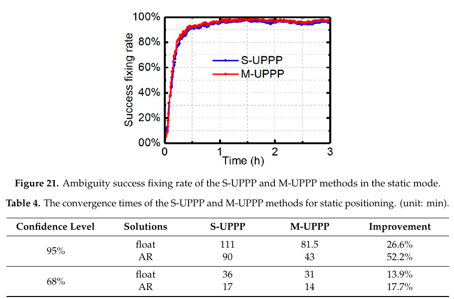
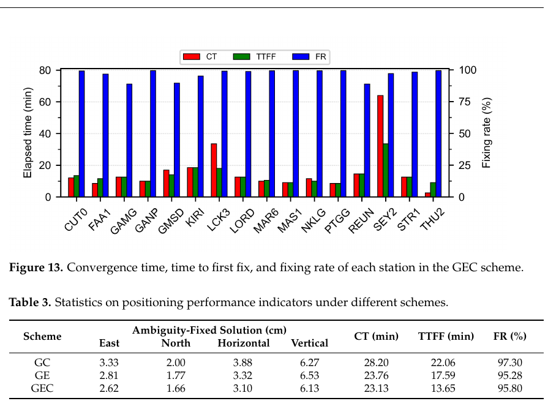
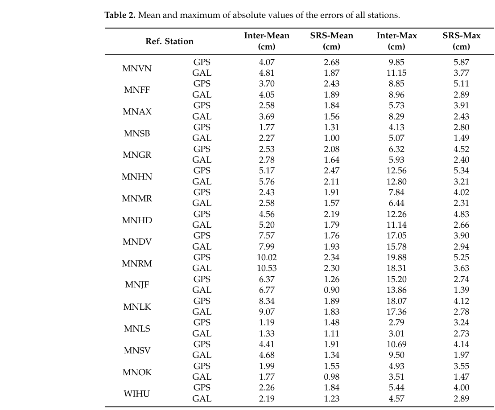

# 2026-09-14 GNSS 每日研究简报

## 今日快报

### 快报 1：北斗通信监测自适应阈值改善异常识别，主要检验仍依赖合成故障

- 主题：`beidou-communication-adaptive-anomaly-threshold`
- 来源 ID：`doi:10.1007/s10791-026-10537-8`
- 来源链接：https://doi.org/10.1007/s10791-026-10537-8
- 发表日期：2026-09-09
- 来源类型：Discover Computing 同行评审开放论文、北斗终端通信监测
- 获取范围：出版者开放全文；方法、试验切分、对照表和局限已核对

**内容：** 作者把堆叠自编码器降噪、神经回路策略模型的时序预测和 NSGA-II／随机森林动态阈值串联，处理北斗终端定位—通信时间序列的尖峰、偏移、静止及漂移异常。训练、验证和测试按时间顺序切分；主要故障标签由注入构造。

**结论：** 论文 Table 2 报告准确率 0.892、F1 0.847、AUC 0.908；Table 3 中去掉动态阈值后 F1 为 0.753。作者也承认真实北斗故障的精确标签稀缺，主要评价仍以合成异常为主；这些分类分数不能直接解释为定位保护级或真实干扰的漏警风险。

**关注理由：** 接收机健康监测可借鉴“预测残差＋随噪声变化的门限”，但必须单列真实异常、合成异常、不同终端和不同站点的表现，避免由阈值调优掩盖部署域变化。

### 快报 2：无线电掩星资料越多越有益，但 2035 观测系统仿真呈边际收益递减

- 主题：`gnss-ro-profile-volume-nwp-osse`
- 来源 ID：`doi:10.1175/mwr-d-25-0281.1`
- 来源链接：https://doi.org/10.1175/MWR-D-25-0281.1
- 发表日期：2026-09-09
- 来源类型：Monthly Weather Review 同行评审论文、GNSS 无线电掩星与数值天气预报
- 获取范围：Crossref 登记的出版者摘要和正式书目信息；正文未取得，仅陈述摘要中的试验范围与结果

**内容：** 作者在代表 2035 年观测系统的 OSSE 中改变每日掩星廓线数量和时空分布，测试资料同化对全球预报与卫星辐射资料偏差订正的影响。

**结论：** 摘要给出的仿真范围是每天 6000 至 100000 条廓线；在每天 6000 条时，模式平流层偏差降低约 1–3 K。增加到每天 50000–100000 条附近仍有收益，但边际收益变小；更均匀分布带来较小附加改善。以上是 OSSE 的模型内结果，不是未来星座在真实业务中保证达到的效果。

**关注理由：** GNSS 信号的价值超出定位。设计掩星星座与资料采购时，应同时比较廓线质量、全球覆盖和模式误差，而不能仅按观测条数线性外推收益。

### 快报 3：南极冰架 GNSS 反射试验暴露信噪比与硬件差异两重边界

- 主题：`mcmurdo-ice-shelf-gnss-reflectometry`
- 来源 ID：`doi:10.5194/egusphere-2026-5057`
- 来源链接：https://doi.org/10.5194/egusphere-2026-5057
- 发表日期：2026-09-08
- 来源类型：EGUsphere CC BY 4.0 公开讨论预印本、GNSS-R／GNSS-IR 冰架观测；尚待最终同行评审
- 获取范围：预印本正式摘要与出版元数据；不补写摘要外的反射系数或分类精度

**内容：** 作者在 McMurdo 冰架两个表面不同的站点，配合相机和激光雷达，比较专用前端 GNSS-R 的直接反射信号与测地接收机 GNSS-IR 干涉谱峰。

**结论：** 预印本摘要指出，专用 GNSS-R 前端的反射信噪比不足以可靠估计表面反射率；GNSS-IR 谱峰均值和偏差在两站间有差异，但尚不能排除两站硬件不同的贡献。因而不能仅凭站间差异声称已识别冰雪类别。

**关注理由：** 对多路径的利用与抑制一样需要仪器校准。若把反射谱峰当环境传感量，天线、接收机、安装高度和时变积雪须一起记录。

### 快报 4：单星时间基准将双钟稳定性与噪声自适应控制合成闭环

- 主题：`single-satellite-dual-clock-adaptive-steering`
- 来源 ID：`doi:10.3390/s26185699`
- 来源链接：https://doi.org/10.3390/s26185699
- 发表日期：2026-09-08
- 来源类型：Sensors 同行评审 CC BY 4.0 开放论文、GNSS 星载时频控制
- 获取范围：开放 PDF 全文，摘要、方法与仿真结论已核对

**内容：** 作者以恒温晶振的短期稳定性和原子钟的长期稳定性为互补条件，用变分贝叶斯自适应 Kalman 滤波估计时钟状态及测量噪声，再由 PID 控制器调节输出频率。

**结论：** 论文的对照仿真认为，该组合在所设噪声条件下比经典 LQG 控制具有更好的短期和长期稳定度。结果属于仿真；没有把它写成任何在轨星钟已完成的性能认证，也不能从时间稳定度直接推出用户定位误差。

**关注理由：** 星钟改进最终会影响广播钟差与用户测距，但控制环的噪声估计、执行延迟和稳定性预算必须先在时频域核对，不能仅比较一个定位 RMS。

### 快报 5：水下重力图匹配能在无 GNSS 时续航，但湖泊试验精度仍是百米级

- 主题：`gnss-denied-gravity-matching-particle-filter`
- 来源 ID：`doi:10.3390/biomimetics11090651`
- 来源链接：https://doi.org/10.3390/biomimetics11090651
- 发表日期：2026-09-09
- 来源类型：Biomimetics 同行评审 CC BY 4.0 开放论文、GNSS 不可用环境的备份导航
- 获取范围：开放 PDF 全文；摘要、试验环境和比较基线已核对

**内容：** 作者将局部重力场可辨性评价、动态搜索范围、多尺度粒子匹配和轨迹运动约束组合，减少弱特征或重复重力异常区的匹配漂移。

**结论：** 论文报告船载湖泊试验的最终重力匹配 RMSE 为 528.2 m，较 TERCOM 和 ICCP 基线分别低逾 41% 和约 31%。这是特定地图与航迹下的无外部定位试验，不能把数百米级备份导航表述为高精度 GNSS 的等价替代。

**关注理由：** GNSS 中断后的连续导航需要可量化的退化模式。重力地图误差、先验位置和运动约束应与 GNSS 重捕后的创新残差一并评价。

## 深度研读

### 深读 1｜接收机工程｜码偏差随时间漂移时，为何会拖累 PPP 模糊度固定

- 类别：`receiver-engineering`
- 学习层级：`foundation`
- 选题定位：`经典基础`
- 来源 ID：`doi:10.3390/rs12050796`
- 来源链接：https://doi.org/10.3390/rs12050796
- 发表日期：2020-03-02
- 来源类型：Remote Sensing 同行评审 CC BY 4.0 开放论文、接收机码偏差与未组合 PPP
- 获取范围：开放 PDF 25 页；观测方程、M-UPPP 可估参数、2017-04-10 IGS 资料和收敛统计已核对
- 价值评分：92/100（相关性 19，经典价值 19，证据 18，教学价值 18，工程价值 18）

#### 为什么先学这个

码观测负责给 PPP 提供绝对尺度与钟差锚点，相位观测负责高精度变化量。接收机码硬件延迟若随时间漂移，传统未组合 PPP 会把部分漂移留在码残差，甚至传给相位模糊度。先弄清这种“可估参数混叠”，才能理解后两节为什么把码钟、相位钟和大气改正分开管理。

#### 先修知识

需要理解伪距 $`P`$、以 m 表示的载波相位 $`\Phi`$、模糊度 $`N`$（cycle）、波长 $`\lambda`$（m/cycle）、接收机钟差 $`\delta t_r`$（s）、一阶电离层的码正相位负、差分码偏差 DCB 和小数周偏差 FCB。码偏差与钟差有共同的加性自由度，不能仅靠同一种码观测把两者独立识别。

#### 一句话逻辑

在未组合 PPP 里显式估计码钟相对于相位钟的漂移，让码硬件变化尽量不进入模糊度，再用相同数据比较固定率和收敛时间。

#### 研究问题与约束

论文用 GPS L1/L2、P1/P2 和 IGS 站资料，主要试验为 2017-04-10、30 s 采样，PPP 仰角截止 7°；FCB 和电离层诊断另有更高截止角。作者报告两小时内码偏差变化最大可到 16 ns，但这不是所有接收机的通用漂移值。FCB 服务端和用户端必须采用兼容的偏差基准。

#### 核心方法论

传统 S-UPPP 将恒定的码偏差吸收到钟差与模糊度中，并让未建模的时变部分主要落在码残差。M-UPPP 引入相对码钟参数，令相位模糊度避免承受电离层无关组合的接收机码偏差变化。实现时仍须设模糊度基准卫星、估计电离层和湿对流层，并使用 FCB 恢复模糊度整数性；新增参数并不神奇地消除硬件误差，只是改变其可估分配。

#### 关键公式逐步推导

以同一卫星和频点的简化观测式说明混叠；$`G`$ 含几何距离、星钟和对流层，$`I_f`$ 是该频点电离层延迟：

```math
P_f=G+c\delta t_{r,P}+I_f+d_{r,f}+\epsilon_{P,f},\qquad
\Phi_f=G+c\delta t_{r,\Phi}-I_f+\lambda_f N_f+b_{r,f}+\epsilon_{\Phi,f}.
```

若强制 $`\delta t_{r,P}=\delta t_{r,\Phi}`$，时变 $`d_{r,f}(t)`$ 无独立状态可容纳。论文的 M-UPPP 以相对码钟 $`d_{r,P}`$（s）表示两类钟参数差：

```math
\delta t_{r,P}=\delta t_{r,\Phi}+d_{r,P},\qquad
c\,d_{r,P}\simeq\text{可估的码偏差组合及其基准项}.
```

这里的近似号提醒：$`d_{r,P}`$ 不是可单独校准的某个物理器件延迟，还吸收钟与模糊度基准。浮点模糊度经 FCB 订正后，再以 LAMBDA 候选搜索和比值检验作整数固定；论文的经验比值门限为 2.0，不能视作统一完整性保证。

#### 经典价值与创新边界

经典价值是把“码残差看似很小”与“模糊度仍被慢漂污染”联系起来，强调参数化和基准约束同样属于接收机误差建模。论文的改善由所用 GPS 信号、站网和 FCB 产品支持；它没有证明每台手机、每个信号制式都能获得相同收敛缩短。

#### 整体逻辑链

原始码／相位和精密轨钟进入两套未组合 PPP；对比码残差与 MW／无电离层组合的漂移；选定相位钟和模糊度基准；在 M-UPPP 中增加相对码钟状态；估计浮点模糊度；用一致的 FCB 产品恢复整数性；固定后统计位置误差、固定率和达到阈值所需时间。

#### 原文图表与结果分析



> 图表源：论文《Mitigation of Short-Term Temporal Variations of Receiver Code Bias to Achieve Increased Success Rate of Ambiguity Resolution in PPP》Figure 21 与 Table 4，[开放全文](https://doi.org/10.3390/rs12050796)。CC BY 4.0 原始 PDF 第 21 页以 160 dpi 渲染，仅裁出原图、原表和题注；曲线、轴、数字未修改。

Figure 21 横轴为初始化后时间（h），纵轴为成功固定率（%），红色 M-UPPP 与蓝色 S-UPPP 在最初约一小时有小幅分离，最终都接近高固定率；图不支持“所有历元都明显更好”。Table 4 给出静态 AR 的 95% 收敛时间从 90 min 降至 43 min，68% 从 17 min 降至 14 min；表中另列浮点解，从 111 降至 81.5 min（95%）。这些是本文阈值和样本集合下的经验分位时间。

#### 原文结果论述

作者还报告码偏差变化最大达 16 ns，并观察到 M-UPPP 的平均码／相位残差更接近零均值。模型减少码偏差对模糊度估计的污染，是本试验收敛改善的合理机制；图表本身只展示结果相关，若无共同轨钟、FCB、几何和门限控制，不能单独证明码钟参数贡献的全部因果份额。

#### 常见误区与适用边界

第一，把所有码偏差当恒定常数。第二，把新增相对码钟状态称为物理真钟差。第三，FCB 与用户滤波器采用不同信号定义或基准。第四，用固定率高替代错误固定率和保护级。第五，接收机码多路径严重时，让单一随机游走状态吸收一切逐星异常。

#### 工程实现步骤

1. 保留逐星逐频原始码、相位、$`C/N_0`$、锁定标志和接收机重启日志。
2. 先实现 S-UPPP 并记录码／相位残差、MW 组合和模糊度漂移。
3. 增加相对码钟状态，明确单位 s 与 m 的转换，并做秩亏／基准测试。
4. 与服务端 FCB 的信号和参考约定对齐，记录产品版本。
5. 在同一轨钟、星集、截止角和比值门限下比较浮点与固定解。
6. 对重启、温度突变、周跳和异常码观测分别做故障注入。

#### 复现实验设计

先按论文取 2017-04-10 的 30 s GPS L1/L2 IGS 数据，保持精密轨钟、7° PPP 截止角和 2.0 比值门限一致，对同一批站跑 S-UPPP、M-UPPP，并单列浮点、AR、错误固定。再做明确属于本简报建议的外推试验：按站点和接收机型号留一，注入相当于 0/4/8/16 ns 的两小时码漂移、10 m 逐星伪距阶跃和一次重启；报告 2D/3D RMS、95% 收敛时间、有效固定率、错误固定率及码钟状态与真注入量的相关性。若新增状态只在训练站改善而在留出型号上恶化，应重新设过程噪声和异常分离策略。

#### 与定位及低成本实现的联系

低成本设备的码观测噪声与硬件漂移常高于测地机。把码偏差当“定位端后处理问题”会让模糊度初始化本身受损；下一节更进一步，为码与相位设置不同的钟产品，使服务端和用户端同时遵守同一偏差账本。

#### 本节小结

能否快速定整，取决于模糊度是否保持稳定且其整数基准可追溯；只看码残差均值不足以判断模型健康。

### 深读 2｜接收机工程｜解耦码钟与相位钟，怎样把多星座相位偏差变成可用 PPP-AR 产品

- 类别：`receiver-engineering`
- 学习层级：`intermediate`
- 选题定位：`基础进阶`
- 来源 ID：`doi:10.3390/rs16162999`
- 来源链接：https://doi.org/10.3390/rs16162999
- 发表日期：2024-08-15
- 来源类型：Remote Sensing 同行评审 CC BY 4.0 开放论文、多 GNSS 解耦钟 PPP-AR
- 获取范围：开放 PDF 18 页；组合式、服务端流程、六日观测、Table 1 与 Table 3 已核对
- 价值评分：93/100（相关性 20，经典价值 18，证据 18，教学价值 18，工程价值 19）

#### 为什么先学这个

上一节在单用户滤波器里给码偏差一个独立去处；实际 PPP-AR 还依赖服务端钟差和相位偏差产品。若服务端用码定义卫星钟，却让相位观测直接沿用这个钟，相位硬件偏差会侵入浮点模糊度。解耦钟模型把两种观测分别闭合，并用宽巷组合恢复整数结构。

#### 先修知识

需要掌握双频无电离层组合、宽巷／窄巷模糊度、Melbourne–Wübbena（MW）组合、多星座系统时间偏差、精密轨钟、相位偏差基准和 LAMBDA。$`\lambda_w=c/(f_1-f_2)`$ 与 $`\lambda_n=c/(f_1+f_2)`$ 的单位为 m/cycle；宽巷更易固定不代表其噪声一定更小。

#### 一句话逻辑

服务端分别估计码钟、相位钟和宽巷偏差，用户端用匹配产品先固定宽巷再搜索窄巷，把 GPS、Galileo、BDS-3 的观测联成同一 PPP-AR 处理链。

#### 研究问题与约束

论文用六日观测验证多星座扩展；信号为 GPS L1/L2、Galileo E1/E5b、BDS-3 B1/B3。Table 1 采用 10° 截止角、先验码噪声 0.3 m、相位噪声 0.003 m；不同星座和信号组合均需独立处理偏差与基准。论文的三系统结果来自选定 MGEX 站和产品，不等于任意终端的实时服务等级。

#### 核心方法论

先形成双频无电离层码与相位组合，使一阶电离层项抵消；码钟含码硬件偏差，相位钟含相位硬件偏差，服务端分别求解。MW 组合提取宽巷模糊度与宽巷偏差，平滑其逐历元噪声。为降低多星座联合求解复杂度，作者先按系统解算，再在用户端用相容的轨钟和偏差产品进行宽巷固定、窄巷候选搜索及定位。估计的是可用于相位整数恢复的产品组合，绝对物理钟值仍受基准约束。

#### 关键公式逐步推导

频率 $`f_1,f_2`$ 的无电离层系数由 $`\alpha+\beta=1`$ 和 $`\alpha/f_1^2+\beta/f_2^2=0`$ 联立得到：

```math
\alpha=\frac{f_1^2}{f_1^2-f_2^2},\qquad
\beta=-\frac{f_2^2}{f_1^2-f_2^2},\qquad
P_{\rm IF}=\alpha P_1+\beta P_2.
```

对应相位 $`\Phi_{\rm IF}=\alpha\Phi_1+\beta\Phi_2`$ 仍带相位模糊度。论文将码与相位硬件项分别吸收入码钟和相位钟：

```math
P_{\rm IF}=\rho+c(\delta t_{r,P}-\delta t_{s,P})+T+e_P,
\quad
\Phi_{\rm IF}=\rho+c(\delta t_{r,\Phi}-\delta t_{s,\Phi})+T+\lambda_n N_1-\beta\lambda_2 N_w+e_\Phi.
```

其中 $`N_w=N_1-N_2`$。MW 宽巷观测再给出 $`A_{\rm MW}=\lambda_w(N_w+B_w)+e_{\rm MW}`$；先估 $`B_w`$，才能让用户宽巷模糊度接近整数。跨系统不能共用一个未经定义的 $`B_w`$。

#### 经典价值与创新边界

方法价值是把码钟、相位钟、宽巷偏差三个产品的角色说清，避免把“精密卫星钟”当作所有观测的同一绝对数。论文贡献是多星座扩展及分系统计算；并未证明它在城市遮挡、手机频点缺测、实时链路中保持同样收敛。

#### 整体逻辑链

服务端筛选 MGEX 站并做轨道／天线／相对论等改正；双频组合；按星座估计解耦码钟与相位钟；用 MW 组合估计宽巷偏差并平滑；发布一致的产品版本。用户端匹配信号与基准；先固定宽巷，再以 LAMBDA 检索窄巷、做成功率和比值检验；输出固定位置、首固时间、收敛时间与失败原因。

#### 原文图表与结果分析



> 图表源：论文《Multi-GNSS Precise Point Positioning with Ambiguity Resolution Based on the Decoupled Clock Model》Figure 13 与 Table 3，[开放全文](https://doi.org/10.3390/rs16162999)。CC BY 4.0 原始 PDF 第 15 页以 160 dpi 渲染，只裁出原图、原表和题注；轴、图例与表值未变。

Figure 13 横轴为各测试站，左轴是收敛时间 CT／首固时间 TTFF（min），右轴是固定率 FR（%）；SEY2 的 CT 红柱约 64 min，明显高于多数站，图示并非所有站都可十几分钟收敛。Table 3 的 GC／GE／GEC 是不同星座组合：GEC 的水平／垂向固定解指标为 3.10／6.13 cm、CT 23.13 min、TTFF 13.65 min、FR 95.80%；GC 的 FR 97.30% 反而更高。表格支持组合星座改善平均收敛和水平误差，不支持“每个指标都优于单星座”。

#### 原文结果论述

作者报告 Galileo 宽巷偏差日内波动约 0.01 cycle 范围，GPS 稍差但约在 0.04 cycle 内；这支撑其将日内宽巷偏差作为产品的处理选择。Table 3 亦显示 GE 垂向 6.53 cm 略差于 GC 的 6.27 cm。首固时间与最终精度、固定率须分别看，不能用平均值掩盖个别站慢收敛。

#### 常见误区与适用边界

第一，把解耦码钟／相位钟称作两个独立物理卫星时钟。第二，用户端选错 BDS 频点仍套用服务端偏差。第三，宽巷固定后跳过窄巷可靠性检验。第四，混用不同产品版本与参考基准。第五，忽略多星座时间系统偏差和不同星座先验噪声。第六，用 TTFF 小于 CT 就宣称已达到指定定位精度。

#### 工程实现步骤

1. 为每星座、每信号登记轨钟、码偏差和相位偏差产品的基准与有效期。
2. 独立核对无电离层组合系数、波长和残差单位。
3. 建立服务端分星座解耦钟与 MW 宽巷偏差计算，并保存日内稳定性曲线。
4. 在用户端按信号匹配产品，先做浮点 PPP 和宽巷固定。
5. 对窄巷候选同时执行成功率与比值检验，并保留未固定回退解。
6. 逐站输出 CT、TTFF、FR、错误固定和 E/N/U 指标。

#### 复现实验设计

以六天多星座 MGEX 观测复核论文 G/C、G/E、G/E/C 方案，信号和 10° 截止角与原文相同，码／相位先验噪声分别取 0.3／0.003 m。基线设置为单码钟 PPP、解耦钟但不使用宽巷产品、完整解耦钟 PPP-AR；建议另做按日留一、按站留一，注入一星 0.05 cycle 宽巷偏差突变、30 s 产品延迟和 5 min 失锁。报告 95% CT、TTFF、FR、错误固定率、3D P95 和每星产品不连续次数。若 FR 上升而错误固定同步增加，应收紧门限，不应只挑最短 TTFF。

#### 与定位及低成本实现的联系

多星座产品增加几何和整数机会，也增加信号管理、偏差版本与缺测处理负担。低成本终端若只收到轨钟没有匹配相位偏差，不能直接沿用本文的 PPP-AR 指标；下一节进一步问：即使卫星侧产品正确，网外用户的大气改正应怎样用。

#### 本节小结

PPP-AR 的整数性来自观测、钟产品与相位偏差基准的一致闭合，而不只是运行一次 LAMBDA。

### 深读 3｜定位算法｜站网外 PPP-RTK：为何最近参考站改正常比插值外推更稳

- 类别：`positioning`
- 学习层级：`advanced`
- 选题定位：`定位深入`
- 来源 ID：`doi:10.3390/rs15010070`
- 来源链接：https://doi.org/10.3390/rs15010070
- 发表日期：2022-12-23
- 来源类型：Remote Sensing 同行评审 CC BY 4.0 开放论文、纯 GNSS PPP-RTK 网外定位
- 获取范围：开放 PDF 14 页；单参考站模型、2020-06-30 Minnesota 数据、Table 2 和定位试验约束已核对
- 价值评分：92/100（相关性 20，经典价值 17，证据 18，教学价值 18，工程价值 19）

#### 为什么先学这个

前两节修复本机码偏差和服务端相位整数基准，仍不能让网外用户自动快速定位。PPP-RTK 还需区域电离层与对流层改正；当用户走出站网的凸包，站网插值变成外推，远站权重可能放大空间梯度误差。本文在纯 GNSS 观测和改正链内比较两种用法，是从接收机误差到定位服务边界的最后一步。

#### 先修知识

需要理解 PPP-RTK 的卫星轨钟／相位偏差、大气斜路径延迟、站网内插与网外外推、Delaunay 三角网、最近站选择、残余电离层状态和模糊度固定。电离层延迟空间相关随天气、地方时与基线改变；“最近”仅是较可靠起点，并不等于零误差。

#### 一句话逻辑

用户出网时停止把全网改正权重向外延展，改用最近参考站的斜电离层改正，同时估计并定权剩余大气延迟。

#### 研究问题与约束

论文用美国 Minnesota 四个参考站和 16 个网外用户站的 GPS／Galileo 数据；主要时间段为 2020-06-30 UTC 12:00–24:00、5 s 采样。论文重点分析电离层改正误差，而非所有对流层、所有纬度或电离层暴条件。作者以约 20 km 说明可能需要估计残差，但明确该距离应随电离层条件调整，不能写死为服务半径。

#### 核心方法论

常见站网方法依据多个参考站的距离和权重估计用户大气改正；用户位于网外时，权重已失去内插的几何约束。单参考站 SRS 方法只使用最近站同星、同频改正，减少远站误差传播；用户滤波器仍要把站—用户间剩余斜延迟作为待估量，并给传播改正合适方差。本文的定位试验为了凸显两法差异，刻意忽略剩余延迟估计，因此试验正确率并非作者建议部署配置的完整性能。

#### 关键公式逐步推导

设参考站 $`j`$ 对卫星 $`s`$ 的斜电离层改正为 $`\widehat I_j^s`$，网外用户 $`u`$ 的线性外推与 SRS 近似分别写为：

```math
\widehat I_{u,\mathrm{ext}}^s=\sum_{j=1}^{m}w_j(u)\widehat I_j^s,
\qquad \sum_j w_j(u)=1,
\qquad
\widehat I_{u,\mathrm{SRS}}^s=\widehat I_{j^*(u)}^s.
```

其中 $`j^*(u)`$ 是最近有效参考站；这是把论文的改正使用逻辑写成紧凑形式，不能把 $`w_j`$ 当成论文唯一指定的权函数。用户伪距可在改正后保留残差状态：

```math
P_u^s-\widehat I_{u}^s
=\rho_u^s+c(\delta t_u-\delta t^s)+T_u^s+\delta I_u^s+e_P^s.
```

$`\delta I_u^s=I_u^s-\widehat I_u^s`$ 若被强行设零，会将空间不匹配推入钟差、位置或模糊度；其先验方差应随距离、方位、电离层活动和改正龄期增长。

#### 经典价值与创新边界

方法价值在于承认“网内插值”和“网外外推”不是同一问题，优先保留可靠的近站信息并显式估残差。论文只检验一张区域站网和一天数据；单参考站在某些近网边站点的平均误差并非都低，亦未证明能在强电离层梯度、长距离或全部星座频点下稳定固定。

#### 整体逻辑链

服务端生成卫星轨钟／相位偏差与站点大气改正；用户依据站网三角形判断是否在网内；网内继续内插，网外选最近有效站；逐星应用改正并传播质量标志；估计残余电离层和湿对流层；执行 PPP-RTK 浮点／固定解；监测改正龄期、基线与创新；越界或故障时退回不使用不可信区域改正的 PPP。

#### 原文图表与结果分析



> 图表源：论文《Atmospheric Delay Correction Utilization Method for Out-of-Network PPP-RTK Users》Table 2，[开放全文](https://doi.org/10.3390/rs15010070)。CC BY 4.0 原始 PDF 第 10 页以 160 dpi 渲染，仅裁出原表和题注；站名、列名、单位和数值未改。

表列为各网外站 GPS／Galileo 改正误差绝对值的均值与最大值，单位 cm；Inter 为多站外推，SRS 为最近站。MNRM 的 GPS 均值从 10.02 降到 2.34 cm、最大值从 19.88 降到 5.25 cm；但 MNLS 的 GPS 均值由 1.19 升到 1.48 cm，最大值由 2.79 升到 3.24 cm。表格直接证明本文多数站点的外推误差较大，也直接显示例外；它不直接给出用户三维位置误差或不同电离层日的置信界。

#### 原文结果论述

作者随后选 MNJF、MNHD、MNSB 三站做静态定位：前 20 min 用于参考站初始化，之后每分钟重启用户解算、每次用 2 min 观测，共每站 700 次；比值门限 1.7，以两分钟内固定且水平误差小于 10 cm 定义正确。MNJF 在 SRS 下正确率 40.1%，外推下 0.3%；MNHD 因离最近站约 115 km，SRS 也只有 7.0%。这说明 SRS 仅改善改正使用方式，不能凭它跨越大气空间失相关的物理边界。

#### 常见误区与适用边界

第一，网外仍沿用网内权重却不标记外推。第二，将最近站改正视为真实用户延迟而不估残差。第三，用某站改正均值改进推断所有站固定率。第四，忽略参考站自身固定失败或产品断档。第五，固定成功就不核对独立坐标误差。第六，把论文为比较而省略残差状态的试验配置直接用作业务推荐。

#### 工程实现步骤

1. 维护站网边界与有效参考站清单，逐历元判断用户是否出网。
2. 按星座、频点和卫星匹配最近站改正与服务端相位偏差。
3. 保存最近站距离、改正龄期、质量指示和用户—站方位。
4. 赋予随距离与扰动增长的改正方差，显式估残余斜电离层／湿对流层。
5. 对不可用站或大创新自动降权，并记录回退 PPP 的原因。
6. 按距离、地方时和电离层活动报告固定率与独立位置误差。

#### 复现实验设计

复核论文 Minnesota 四参考站、16 网外站、2020-06-30 UTC 12:00–24:00 的 5 s GPS／Galileo 资料，先再现 Table 2 的逐星改正误差统计。设置内插外推、最近站但不估残差、最近站加残差状态三组，另加不使用区域大气改正的 PPP 基线；按最近站距离分为 0–20、20–50、50–100、超过 100 km，并在至少一段活跃电离层日期外测。报告改正均值／P95／最大误差、两分钟正确固定率、错误固定率、水平／垂向 P95、回退次数与通信负载。预先固定门限和分组；若 MNLS 之类近站例外或长基线失败持续存在，应缩小服务区并增大残差方差，而不是删掉失败站点。

#### 与定位及低成本实现的联系

低成本终端最需要快速初始化，却也更可能走到站网边缘并遭遇断续改正。前两节的码偏差和解耦钟让模糊度保持可固定；本节表明大气改正的空间有效性仍决定定位是否可信。三环必须一起有质量标志和可退化路径。

#### 本节小结

PPP-RTK 出网后，保守地使用最近可靠信息并估计剩余误差，通常比假装仍在插值更可解释；超过空间相关尺度时，应明确降级。
