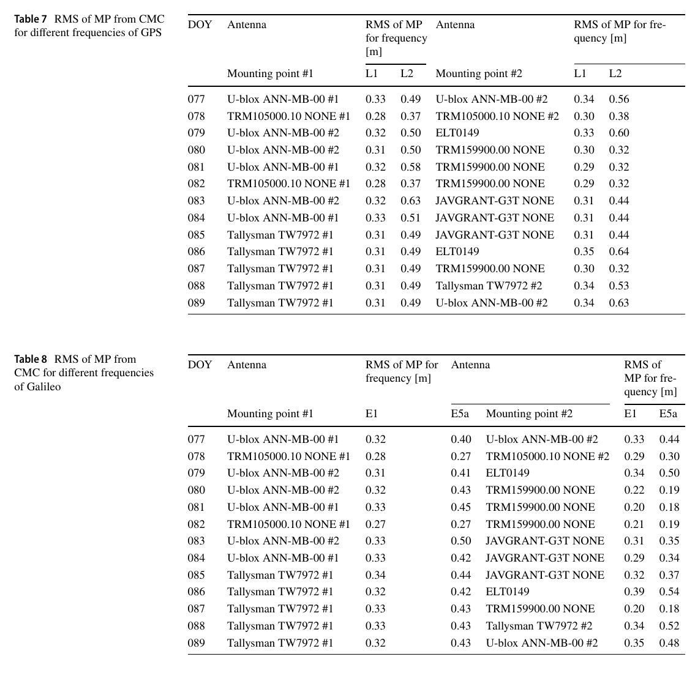
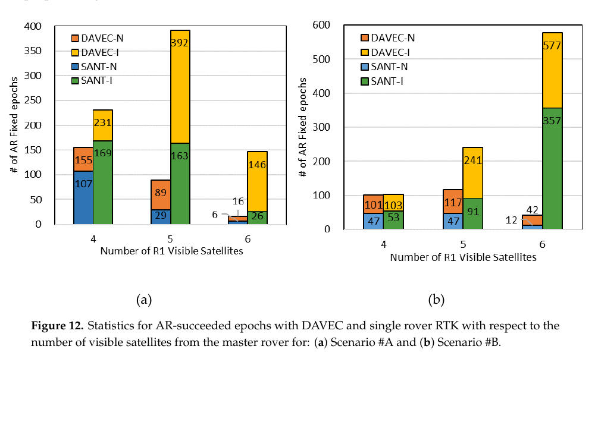
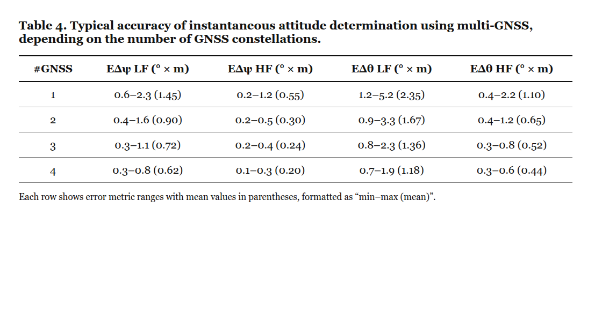

# 2026-09-15 GNSS 每日研究简报

## 今日快报

### 快报 1：旅行接收机把 GNSS 时间传递链路延迟带到现场标定

- 主题：`argentina-gnss-time-transfer-receiver-calibration`
- 来源 ID：`doi:10.24215/18527744e011`
- 来源链接：https://doi.org/10.24215/18527744e011
- 发表日期：2026-09-14
- 来源类型：Geoacta 技术论文、GNSS 时间传递接收机相对标定
- 获取范围：作者机构公开会议论文；现场配置、共视思路与独立核验说明已核对

**内容：** NIST 旅行标定系统在 AGGO、INTI 与 ONBA 与被测系统同时接收相同卫星，以共视差分分离天线、电缆和接收机链路的相对延迟。活动时间为 2021 年 9 月至 2022 年 2 月，旅行系统包括 Septentrio PolaRx3eTR PRO、NovAtel pinwheel 天线和时间间隔计数器。

**结论：** 论文展示了现场相对标定和独立验证流程，证明 UTC(k) 实验室不能把 GNSS 接收设备延迟当作固定且可忽略的常数。来源是较早活动的正式整理，2026 年在线登记日期不等于试验刚完成；其结果也不能直接外推到不同电缆、固件或天线配置。

**关注理由：** 时间接收机的纳秒级硬件延迟会映射到米级传播距离。定位与授时系统都应保存整条射频链配置及重标定记录，而不是只记接收机型号。

### 快报 2：空间图网络只修正本地预测残差，GNSS 位移预报收益小但可复现

- 主题：`bounded-spatial-gnss-residual-adaptation`
- 来源 ID：`doi:10.3390/app16189088`
- 来源链接：https://doi.org/10.3390/app16189088
- 发表日期：2026-09-13
- 来源类型：Applied Sciences 同行评审 CC BY 4.0 开放论文、GNSS 位移残差预测
- 获取范围：开放 PDF 全文；数据切分、消融、置信区间与限制已核对

**内容：** MS-GRAN 先冻结逐站 NLinear 预测，再用只由训练集构图的稀疏非负空间分支学习受门控的增量残差，避免邻站信息覆盖本站时间结构。作者在 Cascadia 90 站上按 2010–2019/2020–2021/2022–2024 严格顺序切分。

**结论：** 一日预测冻结测试 RMSE 从 2.9579±0.0006 mm 降至 2.9158±0.0033 mm，改善 1.422%；三个随机种子中每次有 82–84 个站改善。重连图安慰剂仍改善 1.265%，说明主要增益来自受限残差适配能力，真实拓扑只贡献较小附加量。论文明确不支持地震前兆识别或普适空间迁移。

**关注理由：** GNSS 形变异常检测需要先给正常残差建模。小幅、按时间隔离且有安慰剂对照的收益，比把图网络精度直接解释成地球物理发现更可信。

### 快报 3：双频手机能跟随 TEC 日变化，偏差标定与连续相位弧仍是门槛

- 主题：`smartphone-gnss-ionospheric-tec-quality-control`
- 来源 ID：`doi:10.1007/1345_2026_420`
- 来源链接：https://doi.org/10.1007/1345_2026_420
- 发表日期：2026-09-13
- 来源类型：IAG Symposia CC BY 4.0 开放章节、手机 GNSS 电离层 TEC
- 获取范围：开放全文 9 页；试验时间、设备、偏差策略及定性结果已核对

**内容：** 作者处理 2021-10-22 至 2021-11-04 在 ETH Zürich 共址采集的 Pixel 4 XL 与测地接收机数据，用无几何载波平滑码、$`C/N_0`$ 定权、周跳筛查和连续弧过滤估计 STEC/VTEC。L1–L5 缺少完整 DCB 时，相对于测地机 L1–L2 参考共同估计卫星加接收机偏差。

**结论：** 测地机 L1–L2 与 L1–L5 的 TEC 通常相差亚 TECU 至数 TECU；手机重现日变化和 ROTI 增强时刻，但散布更大、白天峰值更尖且 ROTI 噪声底更高。证据来自一部手机、安静中纬度和共址对照，支持补充加密观测，不支持替代测地网。

**关注理由：** 手机大规模感知的价值取决于偏差账本和质量标记。定位端已有的周跳、信噪比和载波连续性诊断，可直接成为电离层反演的准入条件。

### 快报 4：多系统 GNSS-IR 的卫星数量存在收益饱和点

- 主题：`multi-system-gnss-ir-marginal-satellite-selection`
- 来源 ID：`doi:10.1016/j.jhydrol.2026.135807`
- 来源链接：https://doi.org/10.1016/j.jhydrol.2026.135807
- 发表日期：2026-09（卷期仅给出月份）
- 来源类型：Journal of Hydrology 同行评审论文、GNSS-IR 土壤水分反演
- 获取范围：出版者摘要与正式元数据；正文未取得，仅使用摘要给出的模型和数值

**内容：** 论文用星间平均相关系数描述冗余，以边际改善门限限制多系统双频卫星组合规模，试图把“再加一颗星是否仍有信息”变成可计算的选择规则。

**结论：** 摘要报告单、双、三、四系统双频方案的最优组合规模分别为 5、7、10、14 颗；四系统方案在 P031 与 P387 的 $`R^2`$ 分别为 0.977 和 0.990。这里的“最优”受两站数据、门限和训练设置约束，不能当作其他土壤、植被或安装环境的固定星数。

**关注理由：** GNSS-R 与定位都有“卫星更多但观测相关”的问题。星数、几何和信息独立性应一起评估，不能用可见星数代替有效信息量。

### 快报 5：SLR 快报给微波 GNSS 轨道提供毫米级独立残差检查

- 主题：`code-slr-gnss-quick-look-day-254-2026`
- 来源 ID：`report:code-slr-gnss-2026-254`
- 来源链接：https://edc.dgfi.tum.de/en/mailing_lists/slr_report/no29552/
- 发表日期：2026-09-12
- 来源类型：CODE/AIUB 官方 SLR-GNSS quick-look 数据报告
- 获取范围：EUROLAS Data Center 完整报告；残差基准、单位、卫星与有效/异常观测列已核对

**内容：** CODE 将激光测距残差相对于其快速及 MGEX 微波 GNSS 轨道计算，按台站、卫星、过境时段列出 GOOD/BAD 观测数及均值、标准差；食期间或离开食后 30 min 内另作标记。

**结论：** 例如报告中 8834 站对 Galileo E14 的 2026-09-06 过境有 79 个 GOOD 点，均值 6 mm、标准差 13 mm，并有 4 个 BAD 点。单次过境残差不能代表整颗卫星的长期轨道精度，但它提供了不同测量原理下的独立异常线索。

**关注理由：** 精密定位不能只在同一微波处理链内部自洽。SLR 外部核验能暴露卫星质心、反射器偏置、姿态或轨道建模问题，并应保留食段标记。

## 深度研读

### 深读 1｜接收机工程｜低成本天线的多路径与相位中心误差怎样进入精密坐标

- 类别：`receiver-engineering`
- 学习层级：`foundation`
- 选题定位：`经典基础`
- 来源 ID：`doi:10.1007/s10291-024-01645-3`
- 来源链接：https://doi.org/10.1007/s10291-024-01645-3
- 发表日期：2024-04-12
- 来源类型：GPS Solutions 同行评审 CC BY 4.0 开放论文、低成本天线 PPP-AR
- 获取范围：开放 PDF 17 页；天线配置、16 h 静态处理、运动 PPP-AR 与多路径表已核对
- 价值评分：94/100（相关性 20，经典价值 18，证据 19，教学价值 18，工程价值 19）

#### 为什么先学这个

双天线航向最终由两个天线相位中心间的基线决定。若单个天线的相位中心随入射方位、仰角和频率变化，或反射信号给相位/码引入系统偏差，后续再强的模糊度约束也可能围绕错误基线收敛。因此先把 PCO、PCV 与多路径分开。

#### 先修知识

需要理解天线参考点 ARP、相位中心偏移 PCO、相位中心变化 PCV、码减载波 CMC、无电离层组合、PPP-AR 和仰角定权。PCV 是方向相关改正，不能用一个固定三维偏移完全替代；多路径还随周边反射体和卫星几何变化。

#### 一句话逻辑

在同址、同接收机与同一处理策略下轮换三款低成本和三款测地天线，再以 PPP-AR 坐标、定整率、残差与 CMC 多路径共同判断天线误差。

#### 研究问题与约束

试验在屋顶梁架上进行，16 h 静态会话覆盖 2022 年 DOY 077–089；使用 GPS 与 GPS/GLONASS/Galileo/BDS 四系统处理。Tallysman TW7972 有较完整但仍不含全部星座/方位的 PCC，U-blox ANN-MB-00 只有部分 PCO，ELT0149 无模型。屋顶、烟囱与安装点也是误差源，结果不能只归因于价格。

#### 核心方法论

作者先比较独立窄巷模糊度固定率，再把 16 h 静态坐标相对测地天线基准作偏差统计；运动模式逐历元估计坐标标准差。最后对代表卫星形成 CMC 组合和 IF 残差，按频率比较低成本与 choke-ring 天线。这样把“能否固定”“固定后坐标是否偏”“观测是否受反射”拆成三项。

#### 关键公式逐步推导

忽略大气与钟差后，码和载波同含几何项 $`\rho`$，电离层一阶项符号相反：

```math
P_f=\rho+I_f+M_{P,f}+\epsilon_P,\qquad
\Phi_f=\rho-I_f+\lambda_fN_f+M_{\Phi,f}+\delta_{\rm pcv,f}+\epsilon_\Phi.
```

利用另一频点消去一阶电离层并扣除相位模糊度，可构造码多路径指示量；概念上写为：

```math
CMC_f=P_f-\Phi_f-2\frac{f_{f'}^2}{f_f^2-f_{f'}^2}(\Phi_f-\Phi_{f'})-C,
```

$`C`$ 吸收常数模糊度与硬件项。CMC 的 RMS 同时含码噪声、残余相位误差和环境反射，并不是单独可辨识的物理反射距离。

#### 经典价值与创新边界

经典价值在于说明天线是估计模型的一部分，不是无误差的观测入口。论文用六款天线和多日同址资料给出实证，但没有隔离每个反射面的电磁贡献，也没有覆盖手持姿态、车顶接地面或所有固件。

#### 整体逻辑链

记录天线型号/PCC；同址轮换采集；统一星历、钟差和 PPP-AR 参数；统计定整率；与基准坐标比较；转运动模式看稳定性；计算 IF 残差与 CMC；按频率/仰角/天线解释差异；把缺失 PCC 与环境多路径分别列为限制。

#### 原文图表与结果分析



> 图表源：Krzan 等《Low-cost GNSS antennas in precise positioning: a focus on multipath and antenna phase center models》Tables 7–8，[开放全文](https://doi.org/10.1007/s10291-024-01645-3)。CC BY 4.0 原始 PDF 第 14 页以 160 dpi 渲染，仅裁出两张原表及紧随的解释文字；表值、单位与标签未改动。

表 7/8 的单位为 m。GPS L1 多数天线约 0.28–0.35 m，差别较小；L2 中低成本 ELT0149 达 0.60/0.64 m，而 TRM159900.00 为 0.32 m。Galileo E5a 的 TRM159900.00 为 0.18–0.19 m，ELT0149 为 0.50/0.54 m。表支持频率和天线型号相关的差异，不能把 CMC RMS 全部归因于天线 PCV。

#### 原文结果论述

低成本天线大多数 AFR 为 80%–90%，测地天线常高于 96%；某日 ANN-MB-00 的 GPS AFR 为 70%。运动 PPP-AR 使用多星座后精度改善 3%–58%、平均约 40%，但低成本天线坐标标准差仍至少为测地天线 1.5 倍。多星座增加观测量的收益与非 GPS PCC 不完整的风险同时存在。

#### 常见误区与适用边界

第一，用“低成本”解释全部差异而忽略安装环境。第二，把 PCO 和 PCV 混为一个常数。第三，以固定率高证明固定正确。第四，用 GPS L1 PCC 直接代替 Galileo/BDS 频点。第五，认为长会话一定把近场多路径平均为零。

#### 工程实现步骤

1. 保存 ANTEX/PCC 文件、天线序列号、朝向、接地板和电缆配置。
2. 分星座、频点、仰角输出码/相位残差与 CMC。
3. 对有无 PCC 运行同数据对照，并检查秩与基准一致。
4. 将 AFR、错误固定、E/N/U 偏差和稳定度分开报告。
5. 移动天线或反射体做可逆环境试验，确认恒星日重复性。
6. 把天线改装视作新硬件配置重新标定。

#### 复现实验设计

选择两款低成本贴片、两款中端和一款 choke-ring，同一接收机、同轴电缆和屋顶点位各采三天 24 h；天线轮换顺序随机。对每款运行 GPS 与四系统 PPP-AR、有/无官方 PCC、7°/15°/30°截止角。报告每频点 CMC RMS、相位残差 95% 分位、AFR、错误固定率、E/N/U 偏差与日重复性；再加一块标准金属接地板做受控对照。若改 PCC 只改变坐标而不改变 CMC，应避免把两者说成同一误差。

#### 与定位及低成本实现的联系

低成本定向常用 0.5–1.2 m 基线，毫米级端点误差会转成角误差。下一节把两个天线的已知相对矢量引入估计，但前提是这里定义的相位中心和安装矢量真实可重复。

#### 本节小结

天线模型不完整和多路径可以同时存在；只有联合查看频点残差、坐标偏差与定整状态，才能知道约束应加在哪里。

### 深读 2｜接收机工程｜双天线矢量约束怎样把一副天线看到的信息传给另一副

- 类别：`receiver-engineering`
- 学习层级：`intermediate`
- 选题定位：`基础进阶`
- 来源 ID：`doi:10.3390/s19163586`
- 来源链接：https://doi.org/10.3390/s19163586
- 发表日期：2019-08-16
- 来源类型：Sensors 同行评审 CC BY 4.0 开放论文、双天线纯 GNSS RTK
- 获取范围：开放 PDF 23 页；约束模型、ADOP 分析、仿真与城市实测已核对
- 价值评分：95/100（相关性 20，经典价值 18，证据 19，教学价值 19，工程价值 19）

#### 为什么先学这个

两个刚性安装天线不只提供两个独立坐标。它们之间的基线长度甚至三维矢量是额外观测，可以帮助可见星较少的一端定整。先理解约束如何进入法方程，才能判断后面车辆动态先验究竟新增了什么信息。

#### 先修知识

需要掌握短基线双差、浮点模糊度、协方差、LAMBDA、整数最小二乘、ADOP 和基线坐标系。长度约束只去掉一个自由度，已知三维矢量在给定姿态/坐标变换下能提供更多约束；先验误差必须进入协方差。

#### 一句话逻辑

联合两副天线的 RTK 状态并加入已知基线矢量观测，使卫星视野不同的辅助天线为主天线补足定整信息，再与单天线 RTK 和仅长度约束比较。

#### 研究问题与约束

论文分析 DANOC（无约束）、DALEC（长度约束）与 DAVEC（矢量约束）。实测有开阔静态、遮挡仿真和城市动态，约束来自事先测得的天线相对矢量。若平台柔性变形、时间不同步或天线相位中心漂移，强矢量约束可能把系统误差强行传给两端。

#### 核心方法论

每个 rover 与基站形成双差码相观测；两个 rover 的状态联合后，再把 $`r_2-r_1`$ 与已知基线矢量相等写成伪观测。DAVEC 让两端模糊度和坐标协方差发生耦合。论文用 ADOP 量化整数搜索空间体积，再以相同卫星数/不同视野条件统计固定历元和坐标误差。

#### 关键公式逐步推导

对 rover $`k`$ 的短基线双差相位：

```math
\nabla\Delta\Phi_k=H_k b_k+\Lambda\nabla\Delta N_k+\epsilon_{\Phi,k}.
```

刚体矢量约束作为带协方差 $`R_v`$ 的观测：

```math
(b_2-b_1)-v_0=\eta_v,\qquad \eta_v\sim\mathcal N(0,R_v).
```

联合加权最小二乘最小化观测残差与约束残差。$`R_v\rightarrow0`$ 是强约束；实际应由安装测量、相位中心和平台形变预算给定。ADOP 可写为模糊度协方差行列式的维数归一化尺度：

```math
ADOP=\left(\det Q_{\hat a\hat a}\right)^{1/(2n)}\quad({\rm cycle}).
```

它下降通常意味着更易定整，但并不直接给出错误固定概率。

#### 经典价值与创新边界

论文清楚区分长度与矢量先验提供的自由度，并用单天线作基线。DAVEC 假定相对矢量已知且可在导航系中使用；对任意转动平台，必须由姿态参数或外部信息正确变换，不能把机体系常量直接当导航系常量。

#### 整体逻辑链

两天线同步采样；分别构造双差；联合浮点解；加入长度/矢量伪观测；传播协方差并检查 ADOP；LAMBDA 搜索与验证；回代坐标；按共同/非共同可见星分组；与单天线固定数、误差和姿态成功率比较。

#### 原文图表与结果分析



> 图表源：Zhang 等《Precise and Robust RTK-GNSS Positioning in Urban Environments with Dual-Antenna Configuration》Figure 12，[开放全文](https://doi.org/10.3390/s19163586)。CC BY 4.0 原始 PDF 第 18 页以 160 dpi 渲染，只裁出原图和题注；柱值、图例、轴和分面标签未修改。

横轴是主 rover 可见星数 4/5/6，纵轴是 AR 固定历元数；颜色区分两天线视野相同/不同。场景 A 中单天线固定 500 历元、DAVEC 1108 历元，增加 123.6%；场景 B 为 607 对 1221，增加 101.2%。图直接说明约束在 4–6 星时增加固定输出，但未展示错误固定率或全失锁时表现。

#### 原文结果论述

城市两段姿态成功率为 90.6% 和 83.5%。另一组误差统计中，单天线 E/N/U 标准差为 0.022/0.061/0.197 m，DAVEC 为 0.003/0.005/0.020 m。改善依赖已知矢量、同步观测和试验视野差异；固定历元翻倍不能直接变成安全性翻倍。

#### 常见误区与适用边界

第一，把长度约束当三维矢量约束。第二，把机体系矢量直接用于导航系。第三，令 $`R_v=0`$ 而忽略相位中心和安装误差。第四，把 ADOP 当完整性风险。第五，在两接收机不同步时直接做历元双差。第六，一端周跳后仍通过强约束污染另一端。

#### 工程实现步骤

1. 用统一时钟或可靠时间标记同步两接收机。
2. 在天线相位中心定义下测量机体系基线与协方差。
3. 联合状态中保留两端原始质控标志。
4. 先实现单天线/DANOC，再加入 DALEC 和 DAVEC。
5. 输出 ADOP、候选比值、错误固定与约束归一化残差。
6. 约束残差越界时降权或退回单天线浮点解。

#### 复现实验设计

在 1.0 m 刚性基线平台上布置两套同步双频接收机，设计共同开阔、单侧树荫、交替遮挡和同时遮挡四类路线。固定同一星历/截止角，对比单天线、DANOC、DALEC、DAVEC，并把基线先验标准差设为 2/10/50 mm；额外注入 20 ms 不同步和单端 1 cycle 周跳。报告固定/错误固定率、E/N/U RMS、航向 95% 误差、ADOP、约束残差和恢复时间。只有在先验失配下仍能门控回退，约束才具备工程鲁棒性。

#### 与定位及低成本实现的联系

DAVEC 能把廉价双接收机变成一个联合估计器，但它没有利用车辆运动连续性。下一节在每个历元的 CLAMBDA 之外加入上一历元速度与姿态预测，重点处理复杂环境下初值不稳。

#### 本节小结

刚体基线是一条真实观测；它应带着单位、坐标系和协方差进入滤波，而不是作为固定答案覆盖异常数据。

### 深读 3｜纯 GNSS 定位｜现代多星座瞬时定向：怎样建立独立真值并拆开慢变误差

- 类别：`positioning`
- 学习层级：`advanced`
- 选题定位：`定位深入`
- 来源 ID：`doi:10.34133/adi.0155`
- 来源链接：https://doi.org/10.34133/adi.0155
- 发表日期：2026-05-04
- 来源类型：Advanced Devices & Instrumentation 同行评审 CC BY 4.0 开放论文、多天线纯 GNSS 瞬时姿态精度
- 获取范围：出版者开放全文；五天线试验、独立参考姿态、误差分解和 Table 4 已核对
- 价值评分：96/100（相关性 20，经典价值 18，证据 19，教学价值 19，工程价值 20）

#### 为什么先学这个

上一节用刚体矢量增加整数可观测性，但“固定成功”仍不回答航向究竟准到什么程度。姿态验证常用 IMU，又常用 GNSS 静态姿态反校 IMU 安装角，形成被测量参与构造真值的循环。本节先解决参考独立性，再把低频系统误差与高频噪声分开。

#### 先修知识

需要掌握多天线载波双差、LAMBDA、Wahba 姿态问题、机体系与导航系、安装失准角、航向/俯仰误差及基线长度归一化。角误差乘以基线长度的单位为 °×m，便于比较不同天线几何，但不是线性位置误差的 SI 表达。

#### 一句话逻辑

用五天线十条短基线和低成本 IMU，在旋转板的七个静态位置独立估计参考姿态；随后比较新旧接收机及不同星座组合，并把姿态误差拆成低频与高频部分。

#### 研究问题与约束

试验于 2023-08-02 在莫斯科较有利城市环境完成；五天线安装在可旋转木板上，最大间距不足 1 m，共七个约 20 min 静态位置，总时长约 2.5 h，采样 10 Hz。作者刻意选取良好观测以让瞬时模糊度几乎总能正确固定，因此研究的是固定后的精度上限，不是街谷可用率。

#### 核心方法论

每条短基线形成双差相位并作 LAMBDA 定整，再由多基线解 Wahba 问题得到姿态。参考姿态不直接用被评估的 GNSS 姿态去对齐 IMU，而是利用旋转序列、重力方向和板上几何估计安装失准，使参考精度比典型 GNSS 姿态高 2–3 倍。姿态误差按时间尺度分成低频漂移/系统项和高频随机项，再按使用 1–4 个星座统计范围与均值。

#### 关键公式逐步推导

第 $`i,j`$ 星、第 $`b,r`$ 天线的双差相位模型为：

```math
\phi_{br}^{ij}=\lambda^{-1}(e^i-e^j)^{\mathsf T}b_{br}+N_{br}^{ij}+\epsilon_{br}^{ij}.
```

多条已知机体系基线 $`b_k^B`$ 与导航系估计 $`\hat b_k^N`$ 通过旋转矩阵 $`R`$ 对齐：

```math
\hat R=\arg\min_{R^{\mathsf T}R=I,\det R=1}\sum_k w_k\|\hat b_k^N-Rb_k^B\|^2.
```

对角误差时间序列 $`\Delta\psi(t)`$ 用低通分量表示低频误差，余项为高频误差：

```math
\Delta\psi_{LF}=LPF\{\Delta\psi\},\qquad
\Delta\psi_{HF}=\Delta\psi-\Delta\psi_{LF}.
```

滤波时间尺度会改变两项数值，必须随结果一起版本化。

#### 经典价值与创新边界

价值在于指出标准差不足以描述姿态误差，并正面处理“GNSS 验 GNSS”的循环参考问题。试验仅为静态、良好观测和单日单平台；结果不能证明动态遮挡、柔性结构或错误固定时仍有同样精度。

#### 整体逻辑链

五天线同步采样；建立十条短基线；逐历元定整；多基线解姿态；用旋转序列与 IMU建立独立参考；校准安装失准；计算航向/俯仰误差；分离低频/高频；按硬件代际和 1–4 星座组合归一化比较；检查不同静态位置的一致性。

#### 原文图表与结果分析



> 图表源：Kozlov《Modern Accuracy of Instantaneous Attitude Determination Using Multi-Antenna Multi-GNSS》Table 4，[开放全文](https://doi.org/10.34133/adi.0155)。来源为 CC BY 4.0；从出版者 HTML 表逐项保留标题、列名、范围、均值和单位，以本地 HTML 重排后由 Chrome 截图，未修改任何表值，括号内为原表均值。

表中从 1 个到 4 个星座，航向低频误差均值由 1.45 降到 0.62 °×m，高频由 0.55 降到 0.20 °×m；俯仰低频由 2.35 降到 1.18，高频由 1.10 降到 0.44 °×m。范围仍重叠，说明增加星座总体有益但不保证每一时段单调变好。表只覆盖几乎正确固定的静态样本。

#### 原文结果论述

作者给出的总体关系是低频误差约为高频的 3 倍，俯仰约为航向的 2 倍；新一代硬件精度约比旧一代高 20%。两星座中 Galileo+BDS 最好；三星座时加入 GLONASS 的组合航向最好，加入 GPS 的组合俯仰最好。它说明星座几何和硬件会按姿态轴产生不同影响，不能只报一个三维 RMS。

#### 常见误区与适用边界

第一，用被测 GNSS 姿态校准参考 IMU再称独立真值。第二，只看高频标准差而漏掉慢变误差。第三，把 °×m 直接当度数。第四，以四星座均值证明所有组合、时段都更好。第五，把良好静态定整精度外推到城市动态。第六，忽略天线 PCV和安装板形变。

#### 工程实现步骤

1. 在相位中心定义下测量每条机体系基线及协方差。
2. 同步多接收机并保存原始相位、锁定和天线配置。
3. 建立不依赖被测 GNSS 姿态的安装失准标定流程。
4. 输出每历元整数验证、姿态及参考残差。
5. 明确低/高频分割的窗口和端点处理。
6. 分姿态轴、星座组合、硬件代际报告范围与均值。

#### 复现实验设计

布置五天线非共线阵列，至少形成十条 0.4–1.2 m 基线；用两代接收机各做七个静态转角和三条动态路线。静态按论文检验 1–4 星座及所有组合，动态再加入树荫和急转弯；高等级光学/惯导参考的安装角由独立标定获得。报告航向/俯仰 LF/HF 的 °×m 与实际度数、95%/99.9%误差、正确/错误固定率、组合可用率和天线几何条件数。改变低通窗口做敏感性分析；若“新硬件提升”随窗口消失，就不能归因于测量噪声改善。

#### 与定位及低成本实现的联系

低成本多天线可以给航向提供不随时间积分漂移的绝对约束，但姿态轴精度受基线几何、PCV、星座几何和参考校准共同限制。第一节的天线误差预算和第二节的矢量协方差应进入这里的权重，而非留在硬件说明书中。

#### 本节小结

评价纯 GNSS 定向要先保证参考独立，再把慢变系统误差与高频噪声拆开；增加星座改善均值，但不能替代错误固定和动态遮挡测试。
