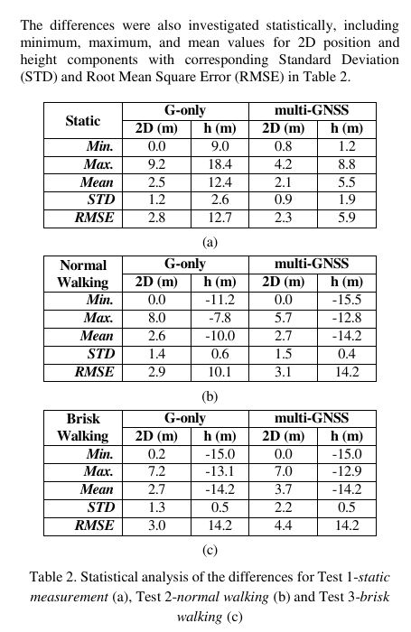
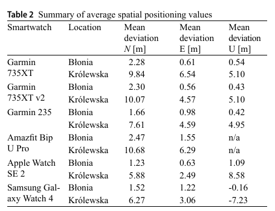
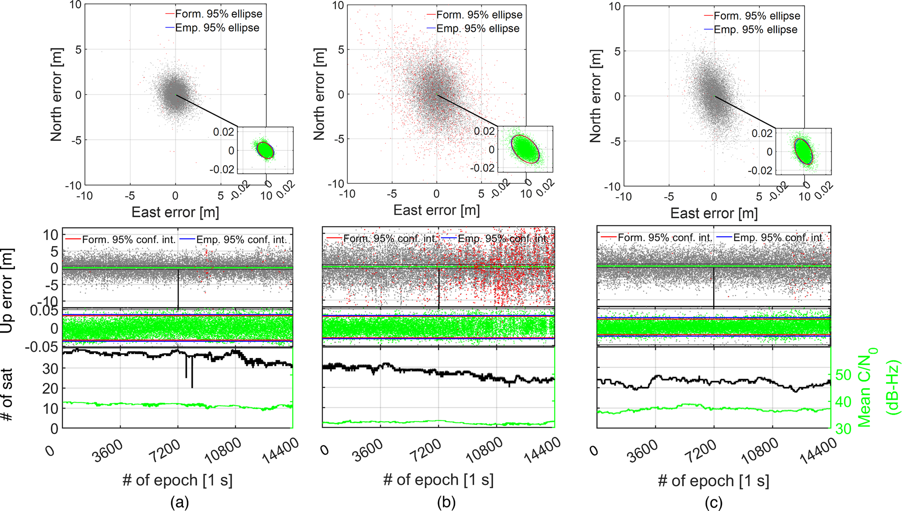

# 2026-09-16 GNSS 每日研究简报

## 今日快报

### 快报 1：物理驱动的轻量注意力网络降低全球 TEC 多步预报误差，但仍是历史图产品上的数据驱动检验

- 主题：`physics-guided-lightweight-global-tec-forecast`
- 来源 ID：`doi:10.1029/2026sw005211`
- 来源链接：https://doi.org/10.1029/2026SW005211
- 发表日期：2026-09-13
- 来源类型：Space Weather 同行评审开放论文、全球电离层 TEC 预报
- 获取范围：开放全文；数据切分、基线、计算量和测试年结果已核对

**内容：** Iono-PhyTAU 用帧内静态注意力和帧间动态注意力替代递归单元，并把 Dst、Kp、F10.7、X 射线通量和太阳黑子数作为外部物理驱动。模型输入前一天 12 张、2 h 分辨率的 IGS 全球 TEC 图，预测下一天 12 张图；2015 与 2020 分别作为高、低太阳活动测试年。

**结论：** 论文报告 2015/2020 年全球 RMSE 分别为 2.97/1.08 TECU；计算量为 19.43 G FLOPs，较 SA-ConvLSTM 的 95.55 G 低约 79.7%。这是同一 IGSG 图产品上的历史回放，不能直接等同于实时单站斜向电离层延迟或定位误差改善。

**关注理由：** 电离层改正服务同时受精度、预报时效和算力约束。把物理驱动作为条件变量有工程价值，但接收机应用仍需把 TEC 图误差传播到具体频点、穿刺点和用户位置域。

### 快报 2：COSMIC-2 与地面 GNSS 融合电子密度总体相关高，晨间和高纬缺测仍暴露系统偏差

- 主题：`cosmic2-gis-electron-density-validation`
- 来源 ID：`doi:10.1029/2025sw004905`
- 来源链接：https://doi.org/10.1029/2025SW004905
- 发表日期：2026-09-03
- 来源类型：Space Weather 同行评审开放论文、GNSS 掩星与地基 GNSS 电离层产品验证
- 获取范围：开放全文；2019-08 至 2025-06 数据范围、Digisonde 对照与时空分层结果已核对

**内容：** 作者把 FORMOSAT-7/COSMIC-2 掩星和 IGS 地面接收机视线 TEC 同化成 1 h 三维 Global Ionospheric Specification（GIS），再用 GIRO Digisonde 的 F2 层峰值电子密度 $`N_mF_2`$ 做独立合点验证，并按地方时、纬度、太阳活动和地磁状态分层。

**结论：** 全样本相关系数为 0.93，GIS 相对 GIRO 平均高估 6.4%；10:00–23:00 LT 的偏差多为高估 10%–30%，07:00–10:00 LT 则可能低估 5%–15%。高纬无掩星同化区和低太阳活动期的相关降低、偏差增加，说明整体相关不能替代覆盖条件审计。

**关注理由：** 用三维电子密度支撑单频改正或空间天气告警时，应把地方时和观测几何写进质量标志，不能只发布一个全球平均相关系数。

### 快报 3：风暴恢复期等离子体泡残迹可持续约 20 h，午后 ROTI 不一定意味着白天新生不规则体

- 主题：`storm-recovery-long-lived-equatorial-plasma-bubble`
- 来源 ID：`doi:10.1029/2026sw005233`
- 来源链接：https://doi.org/10.1029/2026SW005233
- 发表日期：2026-09-08
- 来源类型：Space Weather 同行评审开放论文、多平台赤道等离子体泡观测
- 获取范围：开放全文；COSMIC-2、Swarm-B、地面 GNSS ROTI、GIS 与 GUVI 证据链已核对

**内容：** 研究联合 2023-04-23 至 25 日 COSMIC-2 原位离子密度、Swarm-B 电子密度、四站地面 GNSS 的 5 min ROTI、COSMIC-2 GIS 和 TIMED/GUVI O/N₂，追踪太平洋扇区风暴恢复期的耗空结构。

**结论：** 耗空约从 24 日 19 LT 出现，到 25 日 14–16 LT 仍可辨，最长约 20 h；Swarm-B 观测到结构延伸至南半球约 35° 磁纬、对应顶点高度超过约 3500 km。作者据逐轨减弱和 ROTI 交叉证据，把午后信号解释为夜间结构的残迹，而非证明白天重新生成。

**关注理由：** ROTI 是不规则体指标而不是成因分类器。城市或航空接收机把高 ROTI 用作降权触发时，还要结合地方时、磁纬和空间天气阶段，避免把持续残迹误判为新事件。

### 快报 4：能登震后 GNSS 需要黏弹松弛与余滑共同解释，单一机制会错配近远场分量

- 主题：`noto-postseismic-gnss-viscoelastic-afterslip`
- 来源 ID：`doi:10.1029/2025jb032097`
- 来源链接：https://doi.org/10.1029/2025JB032097
- 发表日期：2026-09-12
- 来源类型：JGR Solid Earth 同行评审开放论文、震后 GNSS 三维形变反演
- 获取范围：开放全文；水平/垂向联合模型、黏度、余滑与分辨率试验已核对

**内容：** 作者用 GEONET 三维 GNSS 速度联合反演 2024 年 $`M_w7.5`$ 能登地震后的 Burgers 黏弹体松弛和运动学余滑，并改变水平/垂向权重、断层几何与黏弹结构做敏感性检查。

**结论：** 首选模型采用 30 km 弹性层，瞬态/稳态黏度约为 $`4.0\times10^{17}`$/$`4.0\times10^{18}`$ Pa·s；余滑约 6 个月内衰减并释放主震矩约 8% 的附加矩。远场和近场垂向主要由黏弹松弛解释，近场水平则必须加入余滑；这是模型依赖的分解，不是 GNSS 直接观测到两种机制的标签。

**关注理由：** GNSS 位移进入地球物理反演后，垂向权、共同模误差和结构先验会改变机制归因。定位工程中的状态分解也应同样检查“数据能辨识什么”，而非仅看总残差。

### 快报 5：学习经验模型残差比直接预报热层密度更稳，轨道收益仍受单星轨迹与空间天气输入限制

- 主题：`thermospheric-density-residual-itransformer-orbit-forecast`
- 来源 ID：`doi:10.1029/2026sw005105`
- 来源链接：https://doi.org/10.1029/2026SW005105
- 发表日期：2026-09-10
- 来源类型：Space Weather 同行评审开放论文、LEO 热层密度与轨道预报
- 获取范围：开放全文；多卫星数据、24 h 预报、风暴试验和轨道传播结果已核对

**内容：** iTrans-Res 不直接预测密度，而学习观测相对 MSISE-00 的残差；用前 24 h 的 CHAMP、GRACE-A/C、GOCE 和天目一号 TM02 沿轨密度及空间天气变量，预报后 24 h，并与直接 iTransformer、原始/偏差订正 MSISE-00 和 Bi-LSTM 残差模型比较。

**结论：** CHAMP 2008 的 MAPE 从 MSISE-00 的 77.66% 降至 11.56%，GRACE-C 2024 从 38.77% 降至 9.58%；相对 MSISE-00，24 h 轨道最大位置误差对 CHAMP/TM02 分别降低 24.6%/16.3%。结果仍是特定卫星沿轨一维预报，不能外推为全球三维密度场或所有 LEO 轨道同幅改善。

**关注理由：** LEO 导航增强、精密定轨与碰撞预警共享阻力误差预算。用经验模型作物理底座、只学习残差，比让网络承担全部尺度更便于监控和失效回退。

## 深度研读

### 深读 1｜低成本与移动端｜先把运动手表当 SPP 接收机：多星座何时改善、何时反而不改善

- 类别：`low-cost-mobile`
- 学习层级：`foundation`
- 选题定位：`经典基础`
- 来源 ID：`doi:10.5194/isprs-archives-xlviii-4-w17-2025-21-2026`
- 来源链接：https://doi.org/10.5194/isprs-archives-XLVIII-4-W17-2025-21-2026
- 发表日期：2026-01-15
- 来源类型：ISPRS Archives 同行评审会议论文、CC BY 4.0、运动手表纯 GNSS SPP
- 获取范围：开放 PDF 7 页；静态、正常步行、快走和 GPS-only/multi-GNSS 对照已核对
- 价值评分：91/100（相关性 19，经典价值 17，证据 18，教学价值 19，工程价值 18）

#### 为什么先学这个

运动手表通常只输出芯片位置，无法像开放原始观测的手机那样重做伪距、相位或随机模型。先在 SPP 层把“精度、准确度、运动速度与星座选择”拆开，才能判断后面更复杂的环境比较和 RTK 到底新增了什么信息。

#### 先修知识

需要理解伪距、卫星钟差、接收机钟差、广播星历、对流层/电离层、最小二乘、二维误差、垂向误差、标准差 STD 和均方根误差 RMSE。STD 描述围绕均值的离散，RMSE 同时包含偏差和离散；二者不可互换。

#### 一句话逻辑

把 Garmin Fenix 7X 与杆上 NRTK 测地接收机同步运动，在 GPS-only 与 multi-GNSS 模式下分别做静态、正常步行和快走，用逐历元坐标差检验星座增加是否真的降低 SPP 误差。

#### 研究问题与约束

试验于 2024-12-23 在体育场进行，手表以 1 s 采样；静态和两种步速各做一次 GPS-only 与 multi-GNSS。CHC i80 通过 NRTK 给出厘米级逐历元参考。不同星座模式不是同一时刻并行记录，因此卫星几何和环境变化不能完全消除；设备也不开放原始观测，无法定位误差来自天线、芯片质控还是 PVT 算法。

#### 核心方法论

对每个历元，把手表经纬高转换到与参考一致的局部坐标，计算二维水平距离与高程差；再分别统计最小、最大、均值、STD 与 RMSE。关键不是只看平均轨迹，而是区分稳定偏差与随机散布，并在静态/运动、GPS-only/multi-GNSS 四种条件间比较。

#### 关键公式逐步推导

单点定位伪距模型可写为：

```math
P_i=\rho_i+c(\delta t_r-\delta t_i)+T_i+I_i+b_i+\epsilon_i.
```

线性化后以加权最小二乘估计位置增量与钟差：

```math
\Delta\hat x=(H^{\mathsf T}WH)^{-1}H^{\mathsf T}W\Delta P.
```

二维误差和 RMSE 为：

```math
e_{2D,k}=\sqrt{e_{E,k}^2+e_{N,k}^2},\qquad
RMSE=\sqrt{\frac{1}{n}\sum_{k=1}^{n}e_k^2}.
```

星座增加会改变 $`H`$ 和可用观测，也可能引入跨系统偏差、低仰角多路径或芯片内部不同门限，因此不保证 RMSE 单调降低。

#### 经典价值与创新边界

价值在于用同杆厘米级参考把消费级手表的静态与运动表现量化，并明确展示“多星座不总是更好”。局限是单设备、单场地、不同模式分时采集，且只看到最终 PVT；它不是原始观测质量或芯片算法的因果拆解。

#### 整体逻辑链

同杆安装手表与 NRTK rover；设定 GPS-only 或 multi-GNSS；静态/正常步行/快走采集；时间对齐；转局部坐标；逐历元算 2D 与高程差；统计偏差、STD、RMSE；跨模式和步速比较；检查结果是否符合卫星几何直觉。

#### 原文图表与结果分析



> 图表源：Alkan 等《GNSS Positioning Performance Analysis of Smartwatches》Table 2，[开放全文](https://doi.org/10.5194/isprs-archives-XLVIII-4-W17-2025-21-2026)。CC BY 4.0 原始 PDF 第 5 页以 130 dpi 渲染，仅裁出表 2、表题和其单位/标签；数值未修改。

静态 multi-GNSS 相对 GPS-only 把 2D RMSE 从 2.8 m 降到 2.3 m、高程 RMSE 从 12.7 m 降到 5.9 m；但正常步行的 2D RMSE 从 2.9 m 升到 3.1 m、高程从 10.1 m 升到 14.2 m，快走 2D 又从 3.0 m 升到 4.4 m。表直接支持“静态受益、运动不保证受益”，不能证明原因一定是步速，因为模式分时和星座几何也变化。

#### 原文结果论述

静态 multi-GNSS 的 2D STD 为 0.9 m、均值 2.1 m，显示稳定但仍有系统偏差；快走 multi-GNSS 的 2D STD 达 2.2 m。高程误差显著大于水平，且部分运动结果均值约 -14.2 m，提醒“轨迹看起来平滑”不代表绝对高程正确。

#### 常见误区与适用边界

第一，把 STD 小写成准确。第二，把多星座等同于更优几何，而不看新增观测质量。第三，用不同时间的两次路线作严格配对。第四，把 NRTK 真值的厘米级精度等同于完全无杆臂/时间误差。第五，由单款 Garmin 外推所有 Wear OS 或 Apple 设备。第六，把高程偏差当随机噪声平均掉。

#### 工程实现步骤

1. 固定手表与参考天线杆臂、姿态和时间基准。
2. 记录模式、固件、采样率、星座与功耗设置。
3. 统一坐标框架和椭球高/正常高定义。
4. 输出 E/N/U、2D、速度和累计距离误差。
5. 同时报均值、STD、RMSE、95% 分位和缺测率。
6. 以同一时段并行设备替代先后两次模式采集。

#### 复现实验设计

选三款手表，各用同一刚性架与一台双频测地 rover 采集；场景含开阔静态、400 m 正常步行、快走和树荫，重复三天。若设备无法同时切模式，用两只同型号设备并行记录 GPS-only 与 multi-GNSS，再交换设备配置。指标为 E/N/U 偏差、2D RMSE、95% 误差、累计距离误差、缺测率和功耗；以固定星座几何窗口作配对基线。

#### 与定位及低成本实现的联系

这一步给出消费级最终 PVT 的下限和黑箱边界。下一节扩大到六款设备、两个强对比环境和独立轨迹/地形真值，回答环境是否比品牌更主导误差。

#### 本节小结

增加星座只增加候选信息，不自动增加可信信息；先用偏差与 RMSE 把 SPP 的真实误差账算清，再谈高精度算法。

### 深读 2｜低成本与移动端｜同一根杆、两种环境：怎样把手表品牌差异与城市峡谷效应分开

- 类别：`low-cost-mobile`
- 学习层级：`intermediate`
- 选题定位：`基础进阶`
- 来源 ID：`doi:10.1007/s12518-026-00807-x`
- 来源链接：https://doi.org/10.1007/s12518-026-00807-x
- 发表日期：2026-09-15
- 来源类型：Applied Geomatics 同行评审 CC BY 4.0 开放论文、六款运动手表纯 GNSS 运动定位
- 获取范围：开放 PDF 14 页；安装、510 m 十圈路线、Leica GS16 真值、DTM 高程和表 2 已核对
- 价值评分：94/100（相关性 20，经典价值 17，证据 19，教学价值 19，工程价值 19）

#### 为什么先学这个

上一节只用一款设备，环境也较有利。本节把六款手表固定在同一刚性架，与测地 rover 同时走同样几何路线，并比较高楼街谷和开阔草地；这种设计能更清楚地区分“设备差异”与“环境共同冲击”。

#### 先修知识

需要理解 E/N/U 局部坐标、水平轨迹到参考线的距离、DTM 高程、城市峡谷遮挡角、多路径、首次定位、气压计校准和 GNSS/传感器融合。平均 N/E/U 偏差有方向，水平距离则非负；两者不能直接相加。

#### 一句话逻辑

让六款手表与 Leica GS16 同杆，以约 1.5 m/s 绕 510 m 四边形各走十圈，在 >50° 遮挡街谷和 <5° 开阔地分别记录，再用参考轨迹和 DTM 比较水平与垂向误差。

#### 研究问题与约束

设备包括两只 Garmin 735XT、Garmin 235、Amazfit Bip U Pro、Apple Watch SE 2 和 Samsung Galaxy Watch 4。两地采集存在转场时间差，卫星几何并非完全相同；刚性架消除了自然摆臂，也不代表实际佩戴姿态。部分设备的高程可能融合气压计，Amazfit 没有可用垂向输出，因此并非纯粹对同一种内部算法作比较。

#### 核心方法论

同一时刻的多设备与 GS16 共享遮挡和运动；水平位置与参考轨迹比较，垂向与栅格 DTM 比较。四边形十圈让同一路段重复出现，可观察拐角、街谷方向与首次校准的重复性。设备作为组间因素、环境作为强条件因素，重点看误差是否一致地随环境恶化。

#### 关键公式逐步推导

将 WGS84 坐标转到参考点的 ENU 后：

```math
\begin{bmatrix}e_E&e_N&e_U\end{bmatrix}^{\mathsf T}
=R_{ecef\rightarrow enu}(x_{watch}-x_{ref}).
```

水平轨迹误差取手表点到参考折线的最短距离：

```math
d_{h,k}=\min_{q\in\mathcal L}\|p_{k,EN}-q\|_2.
```

垂向偏差以 DTM 为参考：

```math
e_{U,k}=h_{watch,k}-h_{DTM}(E_k,N_k).
```

若手表输出为椭球高而 DTM 为正常高，必须先处理大地水准面；论文结果还混合了设备内部高度融合，解释时应视为最终用户输出而非裸 GNSS 高程。

#### 经典价值与创新边界

优势是同杆、多设备、重复路线和强环境对照，且给出测地轨迹与地形高程参考。边界是单日、单城市、设备代际较旧，开阔/街谷并非同步；论文验证最终消费级输出，不揭示芯片原始观测、星座选择或内部滤波。

#### 整体逻辑链

设备刚性共架；控制路线和步速；先街谷后开阔采集；GS16 生成轨迹真值；检查控制点；坐标统一；逐点算水平距离；DTM 算垂向偏差；按设备/场景汇总；检查异常首 fix 与功耗模式；解释环境和硬件交互。

#### 原文图表与结果分析



> 图表源：Antoń 等《Accuracy of Satellite Positioning Using GNSS Smartwatches》Table 2，[开放全文](https://doi.org/10.1007/s12518-026-00807-x)。CC BY 4.0 原始 PDF 第 13 页以 130 dpi 渲染，仅裁出完整表 2；列名、设备名、地点、数值和单位未修改。

表中每款设备在 Królewska 街谷的 N/E 偏差都明显大于 Błonia 开阔地。例如 Apple Watch SE 2 的 N/E 从 1.23/0.63 m 增至 5.88/2.49 m；Samsung Galaxy Watch 4 从 1.52/1.22 m 增至 6.27/3.06 m。垂向更不稳定：Samsung 从 -0.16 m 变为 -7.23 m，Apple 从 1.09 m 变为 8.58 m。表不能把差异唯一归因于多路径，因为两场采集时段和内部算法也不同。

#### 原文结果论述

论文汇总的城市水平平均轨迹误差为 6.72–13 m，开阔地约 1.5–3 m；Apple Watch SE 2 开阔地平均水平距离 1.457 m。Samsung 的开阔垂向约 0.17 m，但街谷约 -7 m，作者认为首次 GNSS fix 对气压计基线的错误校准可能使后续高度整体偏移。

#### 常见误区与适用边界

第一，把同杆测试当真实摆臂佩戴。第二，把 DTM 高程当无误差真值。第三，把有气压计和无气压计设备直接解释为 GNSS 芯片优劣。第四，由平均误差推断最坏情形。第五，把开阔地不同时间的卫星几何忽略。第六，把 Samsung 的一次 0.17 m 垂向结果写成普遍亚米能力。

#### 工程实现步骤

1. 记录设备、固件、星座/频点和功耗模式。
2. 用刚性架测量各天线到参考天线的杆臂。
3. 同步时间并统一 WGS84/ENU/高程基准。
4. 让相同路段重复，输出沿程误差热图。
5. 单列首次 fix、重捕、拐角和遮挡恢复窗口。
6. 对高度区分 GNSS、气压计与最终融合输出。

#### 复现实验设计

在开阔、树荫、单侧高楼和双侧街谷四种场景，以同架六设备加双频 RTK rover 各走十圈；每场景换三个时段并随机顺序。增加正常佩戴摆臂对照。指标含水平/垂向均值、RMSE、95% 分位、最大连续偏移时长、累计距离误差、首 fix 偏差、功耗和缺测率；按路段做配对统计，并报告高程参考转换。

#### 与定位及低成本实现的联系

这节说明 SPP 黑箱在环境变化下可从约 2 m 退化到十米量级。下一节开放载波相位，用同类手表构造短基线 RTK，检验“原始观测＋整数约束”能否把精度提高两个数量级，以及代价是什么。

#### 本节小结

消费级定位的首要分层变量往往是环境，不是品牌排名；任何“最好设备”结论都应先声明天空可见度和高度融合方式。

### 深读 3｜纯 GNSS 定位｜单频运动手表 RTK：厘米级来自多系统整数冗余，还是只来自短基线与好环境

- 类别：`positioning`
- 学习层级：`advanced`
- 选题定位：`定位深入`
- 来源 ID：`doi:10.1007/s10291-025-01965-y`
- 来源链接：https://doi.org/10.1007/s10291-025-01965-y
- 发表日期：2025-10-10
- 来源类型：GPS Solutions 同行评审开放论文、CC BY-NC-ND 4.0、单频多系统运动手表 RTK
- 获取范围：开放 PDF 14 页；模型、三类静态短基线试验、C/N₀ 权、Table 2–4 与 Figure 7 已核对
- 价值评分：96/100（相关性 20，经典价值 18，证据 19，教学价值 19，工程价值 20）

#### 为什么先学这个

前两节都受限于厂家 PVT 输出。本节使用手表开放的 GPS L1、Galileo E1、BDS B1 和 QZSS L1 码相原始观测，直接构造逐历元双差与 LAMBDA 定整。它把问题从“最终坐标有多差”推进到“廉价天线能否支撑整数相位定位”。

#### 先修知识

需要掌握单差/双差、短基线大气共模、载波相位整数模糊度、码/相噪声、C/N₀ 定权、浮点与固定解、LAMBDA、经验/形式协方差和错误固定。单历元模型对周跳不敏感，是因为每个历元重新估计模糊度，不是因为周跳被检测并修复。

#### 一句话逻辑

用两只 Google Pixel Watch 1、两只 Samsung Galaxy Watch 6 和两台 Pixel 5，在零基线外接天线、短基线外接天线和约 1.5 m 内置天线三种静态场景中逐历元全固定，比较成功率、坐标散布、C/N₀ 与双差残差。

#### 研究问题与约束

每组记录 4 h、1 s 采样；短基线忽略相对电离层和对流层。外接 Trimble Zephyr 2 试验借 RF 屏蔽箱和重辐射天线给手表同源优质信号；内置天线在草地直立、朝向一致。研究强调精密度而非绝对准确度，未标定手表天线 PCO/PCV；全部为静态、极短基线和较开阔环境。

#### 核心方法论

每个系统独立选参考星，码相双差组成 $`y=Aa+Bb+e`$；按 C/N₀ 给原始码相方差，逐历元求浮点基线与模糊度，再用 LAMBDA 全固定。三维 E/N/U 误差均不超过 0.05 m 才计为正确固定。外接天线隔离接收机/芯片能力，内置天线再加入小型天线、多路径和信号衰减。

#### 关键公式逐步推导

瞬时双差模型为：

```math
y=Aa+Bb+e,\qquad a\in\mathbb Z^n,\ b\in\mathbb R^3.
```

按论文采用的 C/N₀ 型方差：

```math
\sigma_P^2=c_P10^{-C/N_0/C_{ref}},\qquad
\sigma_\phi^2=c_\phi10^{-C/N_0/C_{ref}},
```

其中 $`C_{ref}=5`$ dB-Hz 用来增强对手表多路径敏感度。整数最小二乘为：

```math
\check a=\arg\min_{a\in\mathbb Z^n}
(a-\hat a)^{\mathsf T}Q_{\hat a\hat a}^{-1}(a-\hat a),
```

固定后回代基线。经验成功率由外部已知基线判定：

```math
SR=\frac{\#\{k:|e_{E,k}|,|e_{N,k}|,|e_{U,k}|\le0.05\ {\rm m}\}}{N}.
```

这个 SR 需要真值，在线接收机不能直接知道；部署时仍需比值检验、残差和完整性门控。

#### 经典价值与创新边界

论文首次系统展示手表—手表单频多系统瞬时 RTK，并用外接/内置天线分层归因。创新不等于普适可用：约 1.5 m 静态基线、大气完全共模、朝向一致、全星座和 4 h 有利数据显著降低了难度；没有动态人体遮挡、长基线、网络延迟或天线相位中心准确度验证。

#### 整体逻辑链

原始码相记录；按系统选参考星；构造双差；C/N₀ 定权；逐历元浮点解；LAMBDA 全固定；用已知基线标正确/错误固定；计算经验与形式 95% 椭圆/区间；比较外接/内置天线；用双差残差解释设备差异；与 Pixel 5 基线对照。

#### 原文图表与结果分析



> 图表源：Thu 等《First Smartwatch RTK Results: Performance Analysis of Instantaneous, Single-Frequency Multi-GNSS cm-Level Positioning with Comparison to Google Pixel 5 Smartphones》Figure 7，[开放全文](https://doi.org/10.1007/s10291-025-01965-y)。原文采用 CC BY-NC-ND 4.0；从出版 PDF 直接提取完整原始嵌入图像，未裁切、重绘、改色或修改任何像素，仅作非商业研究评论引用。

上排横轴/纵轴分别为 East/North error（m），下排给 Up error 随 1 s 历元变化，并叠加可见星数与平均 C/N₀；(a)/(b)/(c) 是 Pixel 5、Pixel Watch 1、Galaxy Watch 6。灰点是浮点、红点是错固定、绿点是正确固定，红/蓝线为形式/经验 95% 椭圆或区间。GW1 的红点和浮点云明显更散，SW6 的正确固定云仍集中在厘米窗口；图也显示固定点很紧不代表没有少量灾难性错固定。

#### 原文结果论述

外接天线零基线时三类设备 ILS SR 约 100%；外接天线短基线仍超过 99.5%。内置天线下，SW6/GW1/Pixel 5 分别为 99.3%/81.9%/99.4%；SW6 正确固定的 E/N/U STD 为 0.003/0.006/0.013 m。GW1 的低 C/N₀ 和更大双差码相残差与较低 SR 一致，但这是设备对照证据，不足以把原因唯一归到天线设计。

#### 常见误区与适用边界

第一，把厘米精密度写成厘米绝对准确度。第二，把经验 SR 当在线可观测量。第三，认为逐历元模型“解决”周跳而忽略它牺牲时间连续性。第四，把 1.5 m 基线结果外推到公里级。第五，忽略未标定 PCO/PCV 和共同朝向。第六，只看正确固定点云而不报错误固定。第七，把多系统冗余当成无跨系统偏差的自由观测。

#### 工程实现步骤

1. 验证 Wear OS 原始码相、时间标签和半周标志。
2. 按星座/频点建参考星与双差映射。
3. 估计设备特定码相尺度因子和 C/N₀ 权模型。
4. 先跑浮点与残差门控，再做 LAMBDA 候选搜索。
5. 加入比值、部分固定或固定失败率控制。
6. 输出固定状态、残差、星数、PDOP、C/N₀ 和约束一致性。
7. 标定天线相位中心并在动态/遮挡下测试回退。

#### 复现实验设计

两款手表和一款手机各成对采集，设计 0 m 共天线、1.5/10/100 m 静态短基线、正常摆臂步行、单侧身体遮挡和树荫；每组 4 h、1 Hz。对比 GPS-only、GPS+Galileo、四系统，C/N₀ 权与仰角权，以及全固定/部分固定/浮点。指标为真值定义 SR、错误固定率、E/N/U RMS 与 95% 误差、TTFF、失锁恢复、功耗；长基线需显式估计电离层/对流层或设基线限制。

#### 与定位及低成本实现的联系

结果证明低成本可穿戴硬件在理想短基线下能承载相位整数信息，但实际用户定位最缺的不是一个漂亮的正确固定点云，而是对环境、天线、错误固定和真值边界的持续监控。与前两节合看，SPP 的米级稳健性和 RTK 的厘米级条件性必须同时报告。

#### 本节小结

多系统冗余能把单频手表推到厘米级，但前提是短基线、良好几何和可靠定整；工程结论应写成“条件成立时可达”，而不是“手表已经普遍厘米级”。
