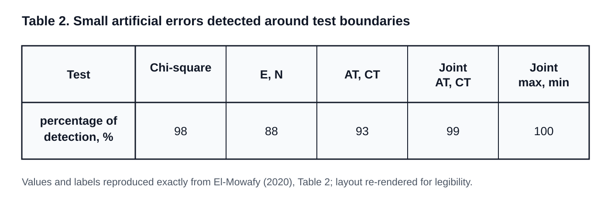
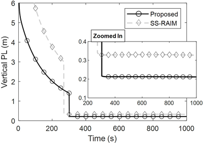
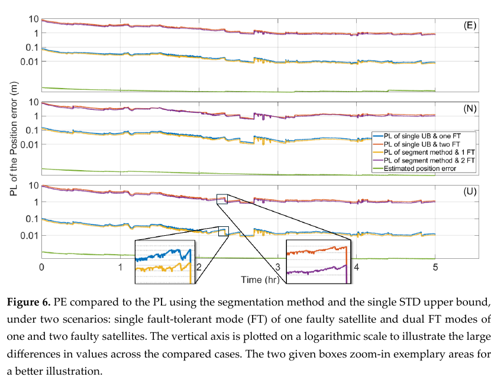

# 2026-09-17 GNSS 每日研究简报

## 今日快报

### 快报 1：三频无电离层组合不自动优于双频，观测完整性先决定 PPP 收益

- 主题：`brazil-multignss-ppp-if2-if3-graphic`
- 来源 ID：`doi:10.14393/rbcv78n0a-81258`
- 来源链接：https://doi.org/10.14393/rbcv78n0a-81258
- 发表日期：2026-09-15
- 来源类型：Revista Brasileira de Cartografia 同行评审开放论文、多系统 PPP 组合评估
- 获取范围：开放 PDF 17 页；观测期、组合定义、收敛与残差结果已核对

**内容：** 研究用巴西 RBMC 五站 2024 年 3 月与 6 月共 60 天 RINEX3 数据，每天处理 00:00 UTC 起 3 h 会话，对比 GRAPHIC、双频无电离层组合 IF2 和三频无电离层组合 IF3。评价项同时包括卫星数、PDOP、收敛时间、局部坐标误差以及按仰角统计的码相残差。

**结论：** IF2 每历元约保留 28 颗卫星、PDOP 接近 1，并给出总体更快的收敛与更小的最终偏差；IF3 因需要三频同时可用，卫星数降至约 12 颗，几何和垂向残差反而恶化。论文明确把结论限定为五站、两个电离层条件月份的初步评估，不能据此断言三频组合在观测完整时也必然较差。

**关注理由：** 频点增加既提供额外信息，也提高“所有频点同时健康”的门槛。接收机工程应先统计逐星逐频可用率、频间偏差和组合噪声，再决定是否启用 IF3，而不是把频点数直接当成精度等级。

### 快报 2：GPS/GLONASS 不只降低 PDOP，也让路线规划模型更贴近实测遮挡

- 主题：`kinematic-gnss-campaign-planning-validation`
- 来源 ID：`doi:10.3390/s26185864`
- 来源链接：https://doi.org/10.3390/s26185864
- 发表日期：2026-09-16
- 来源类型：Sensors 同行评审 CC BY 4.0 开放论文、动态 GNSS 作业规划验证
- 获取范围：开放 PDF 28 页；18.4 km 路线、同步接收机、DSM/DTM 建模和分环境结果已核对

**内容：** 作者在波兰三联市 18.4 km 路线上用两台 1 Hz 接收机同步采集 GPS-only 与 GPS/GLONASS，依据 DSM/DTM 预测路线上的可见星和 PDOP，再按有利与困难环境比较模型和现场观测。

**结论：** GPS/GLONASS 相对 GPS-only 使平均 PDOP 约降低 30%、可见星数增加 81%–86%；模型与观测的平均绝对 PDOP 差在全路线降低 58.0%，有利/困难环境分别降低 66.7%/68.4%。这是规划模型一致性与几何改善，不是厘米级坐标精度或新增星座无系统偏差的证明。

**关注理由：** 移动测绘的失败常发生在出发前就能预见的遮挡路段。把数字表面模型、轨迹和具体星座配置联合起来，可把“选择观测窗口”变成可验证的工程步骤。

### 快报 3：CNN 提局部特征、LSTM 吃时间相关，手机伪距改正的收益仍受单一竞赛数据集约束

- 主题：`smartphone-pseudorange-cnn-lstm-bias-correction`
- 来源 ID：`doi:10.1088/1361-6501/aea179`
- 来源链接：https://doi.org/10.1088/1361-6501/aea179
- 发表日期：2026-09-15
- 来源类型：Measurement Science and Technology 同行评审论文、城市手机 GNSS 伪距偏差学习
- 获取范围：出版社摘要；网络结构、GSDC 2021 对照与摘要所列指标已核对，正文条件未作外推

**内容：** CNN-LSTM 先用卷积提取同历元局部观测特征，再用 LSTM 表达伪距残差的时间依赖；在 Google Smartphone Decimeter Challenge 2021 数据上，与 WLS、PrNet、纯 CNN 和纯 LSTM 按相同条件比较。

**结论：** 摘要报告整体水平 RMSE 为 4.638 m，较 PrNet 低 5.40%；训练吞吐提高 43.1%，GPU 单步延迟降低 33.9%，并在三个场景相对 WLS 改善 53.13%–73.96%。这些数字来自同一历史竞赛数据与训练协议，不能证明跨手机型号、城市或实时接收机部署仍有相同收益。

**关注理由：** 学习型改正若只报告精度而不报告吞吐和延迟，难以落到端侧。该工作把计算代价放回评价表，但下一步仍应做设备留一、城市留一和严格因果在线验证。

### 快报 4：跨站标定能让周跳门限迁移，但 5 s 采样暴露直接修复的时间分辨率边界

- 主题：`multignss-causal-cycle-slip-cross-station-calibration`
- 来源 ID：`doi:10.3390/electronics15184209`
- 来源链接：https://doi.org/10.3390/electronics15184209
- 发表日期：2026-09-16
- 来源类型：Electronics 同行评审 CC BY 4.0 开放论文、多系统周跳检测与直接修复
- 获取范围：开放 PDF 21 页；数据划分、阈值标定、半周网格修复与 1 s/5 s 结果已核对

**内容：** 方法把双频相位—多普勒创新 PDI、同历元公共钟跳去除、仅用过去样本的稳健归一化、最坏源站分位数门限和半周模糊度增量搜索串成因果流程。三座 IGS 源站只负责标定，五座不重合目标站用于检验，每站四段 15 min，并分别处理原生 1 s 与降采样 5 s 数据。

**结论：** 在 1 s、源站 1% 报警预算下，未修改背景报警率为 1.114%，3184 个注入事件历元的检测率 98.68%、双频精确修复率 98.34%；但在 5 s 下，PDI 修复率降至 54.99%，弱于协方差加权 GF/MW 整数搜索的 81.97%。事件是人工注入且移动平台、下游定位收益尚未验证。

**关注理由：** 周跳检测不是一个固定阈值问题：接收机域、采样率和钟跳都会改变统计量。工程上应把门限的训练域、在线归一化窗口和无法修复时的退化路径一并版本化。

### 快报 5：卡斯卡迪亚慢滑分段可由法向应力与耦合分别解释，但仍是 GNSS 反演加模型的机制归因

- 主题：`cascadia-slow-slip-gnss-reduced-order-friction`
- 来源 ID：`doi:10.1029/2026gl122833`
- 来源链接：https://doi.org/10.1029/2026GL122833
- 发表日期：2026-09-16
- 来源类型：Geophysical Research Letters 同行评审 CC BY 4.0 开放论文、GNSS 慢滑与降阶摩擦模型
- 获取范围：出版社摘要与开放元数据；反演框架和摘要所列耦合比例已核对

**内容：** 研究把慢滑事件间 GNSS 速度的耦合反演，与贝叶斯推断的准动态速率—状态摩擦循环模型结合，并以降阶模型加速大量参数样本，解释卡斯卡迪亚沿走向的复发周期与事件矩差异。

**结论：** 摘要报告事件间耦合沿走向约 60%–70%，长期耦合则从南段接近 0 到中段约 42%；模拟把复发间隔主要归因于有效法向应力，把事件矩主要归因于俯冲耦合。南段瞬态慢滑近似补回全部亏损，而北/中段仍留下约 30%/42% 的板块汇聚亏损；这是 GNSS 速度、先验和摩擦模型联合得到的解释，不是直接测得的断层应力。

**关注理由：** GNSS 进入物理反演后，坐标时间序列只是约束之一。定位与地学处理都应保留“观测—反演—机制”三层边界，避免把模型可解释性写成唯一因果。

## 深度研读

### 深读 1｜接收机工程｜从检测到保护级：道路 GNSS 为什么要在轨迹坐标系里算完整性

- 类别：`receiver-engineering`
- 学习层级：`foundation`
- 选题定位：`经典基础`
- 来源 ID：`doi:10.1049/iet-its.2019.0248`
- 来源链接：https://doi.org/10.1049/iet-its.2019.0248
- 发表日期：2020-01-28
- 来源类型：IET Intelligent Transport Systems 同行评审论文、纯 GNSS 道路完整性监测
- 获取范围：出版社开放 HTML 全文；公式、75 min 动态试验、人工故障、表 2 与保护级结果已核对
- 价值评分：94/100（相关性 20，经典价值 19，证据 18，教学价值 19，工程价值 18）

#### 为什么先学这个

完整性不是“位置看起来准”，而是接收机能否在规定风险下发现危险故障，并用保护级界定尚未报警时可能有多坏。道路应用又不只关心东、北坐标：跨车道误差和沿行驶方向误差的代价不同，因此先学会把解分离、检测区域和保护级放到轨迹坐标系。

#### 先修知识

需要理解线性化伪距/载波观测、加权最小二乘或卡尔曼滤波、协方差、标准化残差、卡方检验、正态分布尾概率、虚警概率、漏检概率、报警限 AL、保护级 PL 和解分离。保护级是按统计假设求出的误差上界，不是真实误差，也不是置信椭圆的随意倍数。

#### 一句话逻辑

对每个可疑故障模式计算“全观测解—排除观测解”，把差值投影到沿轨 AT、横轨 CT 或最大误差方向，再用相应分布门限做 FDE，并把未检故障与随机误差共同包进 PL。

#### 研究问题与约束

论文聚焦二维纯 GNSS 道路定位，提出 E/N、AT/CT、联合 AT/CT 和最大/最小方向的解分离检验，并讨论城市非高斯误差。实测只用 GPS，1 Hz、约 75 min、6–12 颗卫星、10° 截止角，以浮点 PPP 对后处理相对定位；人工注入 604 个 30–100 m 大故障和 100 个接近门限的小故障。浮点模糊度避免了错固定威胁，但也意味着结论不能直接覆盖 RTK 整数固定。

#### 核心方法论

先算全观测位置 $`\hat x^{(0)}`$，再对每个故障模式 $`i`$ 排除相应观测并算容错解 $`\hat x^{(i)}`$。解分离向量 $`d_i=\hat x^{(0)}-\hat x^{(i)}`$ 在无故障假设下由两解协方差决定。若车辆航向已知，将 E/N 旋转到 AT/CT；若航向不可靠，则沿协方差或误差椭圆的最大方向构造单一保守检验。城市环境不强行套零均值高斯，而比较经验 logistic 分布和带非零均值的高斯包络。

#### 关键公式逐步推导

线性化观测写成：

```math
y=Hx+\varepsilon+Ab,
```

其中 $`Ab`$ 表示某一故障模式的观测偏差。全观测解和第 $`i`$ 个排除解的差为：

```math
d_i=\hat x^{(0)}-\hat x^{(i)},\qquad Q_{d_i}=\operatorname{Cov}(d_i).
```

车辆航向为 $`\psi`$ 时，二维旋转给出轨迹坐标：

```math
\begin{bmatrix}d_{AT}\\d_{CT}\end{bmatrix}
=
\begin{bmatrix}\cos\psi&\sin\psi\\-\sin\psi&\cos\psi\end{bmatrix}
\begin{bmatrix}d_E\\d_N\end{bmatrix}.
```

一维标准化检验量为 $`T_{i,j}=|d_{i,j}|/\sigma_{d_{i,j}}`$。给定虚警预算得到门限 $`K`$；一个便于实现的解分离保护级骨架是：

```math
PL_j=\max_i\left(|d_{i,j}|+K_i\sigma_{i,j}+b_{i,j}^{\rm bound}\right),
```

其中最后一项必须来自误差/故障包络，不能由样本标准差臆造。可用性条件是 $`PL_j<AL_j`$。

#### 经典价值与创新边界

经典价值在于把航空常用的 E/N 解分离改写为道路更有业务意义的 AT/CT，并说明航向不可靠时为何要看最大误差方向。创新边界是单次较友好的郊区/低密度城市试验、人工故障、GPS-only 和浮点 PPP；logistic 或高斯包络只是候选误差模型，不是所有城市的通用真分布。

#### 整体逻辑链

建立观测模型；枚举故障模式；并行计算全观测与排除解；传播解分离协方差；按航向旋转到 AT/CT；分配虚警/漏检风险；做 FDE；对通过检测的数据计算 AT、CT 或最大方向 PL；与应用 AL 比较；记录不可用历元与触发故障模式。

#### 原文图表与结果分析



> 图表源：El-Mowafy《Fault Detection and Integrity Monitoring of GNSS Positioning in Intelligent Transport Systems》Table 2，[出版社全文](https://doi.org/10.1049/iet-its.2019.0248)。原表为非开放许可论文中的最小必要研究评论摘录；仅按原列名与五个百分数重新排版为 SVG，未改变数据，不主张再分发权。

表中卡方、E/N、AT/CT、联合 AT/CT、联合 max/min 对接近各自检测边界的小人工故障检出率依次为 98%、88%、93%、99%、100%。它直接说明检测区域的形状会改变临界故障的命中率；不能据此说 max/min 对真实城市故障总是 100%，因为样本是围绕本次门限构造的人工注入。

#### 原文结果论述

所有检验都发现了 19 min 和 53 min 附近注入的大故障，小故障表现才拉开差异。作者采用 2.7 m 临界车道宽的一半作为 1.35 m 报警限；FDE 后 AT、CT 和最大方向 PL 在本次试验中均包住位置误差且低于 AL。约 36 min、47 min 的 PL 隆起与几何恶化相关，说明 PL 同时受故障模型与卫星几何控制。

#### 常见误区与适用边界

第一，把检出率当完整性风险保证。第二，把 E/N 最优直接等同于车道方向最优。第三，航向噪声很大仍使用硬 AT/CT 旋转。第四，用零均值高斯覆盖城市 NLOS 的偏置尾。第五，FDE 通过后只输出位置、不输出 PL 与 AL。第六，把浮点 PPP 结果外推到错固定可发生的 RTK。

#### 工程实现步骤

1. 明确应用的 AT/CT 报警限、时间到报警和风险预算。
2. 为每个观测维护质量、协方差与可疑故障模式。
3. 计算全观测解和受监控子集解，缓存公共矩阵分解。
4. 用车辆航向和其不确定度完成 E/N 到 AT/CT 变换。
5. 在开阔与城市数据上分别验证名义误差分布和包络。
6. 检测、排除、重算 PL，并发布 available/unavailable 状态。
7. 保存触发模式、PL、AL、卫星几何与原始残差供审计。

#### 复现实验设计

使用双频多系统接收机与独立全站仪/INS 真值，在开阔、树荫、低楼和高楼街谷各跑 10 条不少于 30 min 的路线。同步注入单星阶跃、斜坡、NLOS 正偏和未建模公共偏差；对比 E/N、AT/CT、联合 AT/CT、max/min 与观测域卡方。指标包括按幅值分箱的检出/虚警、排除正确率、时间到报警、PL 包络率、PL/PE 比、可用率和航向误差敏感性；失败条件是经验包络在独立城市数据上失守。

#### 与定位及低成本实现的联系

这一节解决的是“位置解如何转成安全声明”。下一节进入载波差分：当状态包含整数模糊度且监测器工作在测量域时，未检故障会经滤波记忆和定整的离散跳变传到最终基线，保护级必须显式接住这条链。

#### 本节小结

道路完整性要围绕应用方向、风险与报警限设计；检验量只负责发现不一致，保护级才负责说明未报警的位置还能信到什么范围。

### 深读 2｜接收机工程｜测量域监测怎样越过整周模糊度，把短基线 CDGNSS 故障投影到保护级

- 类别：`receiver-engineering`
- 学习层级：`intermediate`
- 选题定位：`基础进阶`
- 来源 ID：`doi:10.11003/jpnt.2025.14.4.331`
- 来源链接：https://doi.org/10.11003/JPNT.2025.14.4.331
- 发表日期：2025-12-15
- 来源类型：Journal of Positioning, Navigation, and Timing 同行评审 CC BY-NC 4.0 开放论文、短基线 CDGNSS 完整性
- 获取范围：开放 PDF 10 页与期刊 HTML；滤波偏差传播、定整失败风险、仿真参数和图 1–3 已核对
- 价值评分：96/100（相关性 20，经典价值 18，证据 19，教学价值 19，工程价值 20）

#### 为什么先学这个

上一节的解分离直接在位置域比较子集解，直观但需要并行运行许多滤波器。短基线编队可以在星历/测距监测器的测量域发现异常，计算更省；困难在于未检故障会经卡尔曼滤波记忆累积，还可能把整数模糊度推到错误格点，必须把连续偏差和离散错固定同时纳入 PL。

#### 先修知识

需要理解双差码相观测、短基线残余电离层、浮点基线与浮点模糊度、LAMBDA/整数最小二乘、正确固定 CF、错误固定 IF、卡尔曼状态转移和测量更新、故障先验概率、连续性风险与 PHMI。厘米级精度不等于厘米级保护级；错误整数会产生不连续而非高斯的小扰动。

#### 一句话逻辑

先求测量域监测器仍可能漏过的最坏故障，把它递推到浮点基线和模糊度偏差，再分别计算 CF 的位置尾概率与 IF 概率，寻找使总 PHMI 等于风险预算的 PL。

#### 研究问题与约束

论文假设两台无人平台在大田附近，以 GPS 24 星、Galileo 27 星的 L1/L5、E1/E5a 双频相对定位；码/相位多路径是一阶 Gauss-Markov，时间常数 30 s，天顶标准差分别 1 m、2 cm；残余电离层 4 mm/km。只考虑单星星历故障，先验 $`10^{-5}`$，垂向完整性风险 $`10^{-7}`$、连续性风险 $`10^{-5}`$，结果是仿真而非飞行试验。

#### 核心方法论

状态由相对基线与模糊度组成。对每个可能发生故障的历史时刻和卫星，测量更新矩阵把未检偏差映射到当前状态；用监测器给出的最大未检故障 $`M_{j,i}`$ 构造最坏方向。浮点状态经整数映射后，CF 情况用连续高斯尾计算位置越界，IF 情况先由偏置后的模糊度分布算错固定概率，再保守绑定错固定造成的位置风险。仅回看当前时刻前 100 s 以控制计算量。

#### 关键公式逐步推导

带故障的滤波误差均值可写成递推：

```math
\mu_{x,k}=(I-K_kH_k)F_k\mu_{x,k-1}+K_k b_k.
```

展开历史故障后：

```math
\mu_{x,k}=\sum_{j=1}^{k}S(k,j)b_j,
```

其中 $`S(k,j)`$ 是从时刻 $`j`$ 到 $`k`$ 的故障传播矩阵。若监测器只保证 $`|v_{j,i}^{\mathsf T}b_j|\le M_{j,i}`$，则目标位置分量的最坏偏差可保守写成：

```math
|\mu_{b,k}|\le\sum_j|s_b(k,j)v_{j,i}|M_{j,i}.
```

完整性风险按故障假设求和：

```math
P_{HMI}=\sum_i P(H_i)P(|e_v|>PL_v,\ \text{no alert}\mid H_i).
```

对固定解还需分解为：

```math
P_{HMI\mid H_i}=P(CF\mid H_i)P_{HMI\mid CF,H_i}
+P(IF\mid H_i)P_{HMI\mid IF,H_i}.
```

因此 PL 不能只由浮点协方差乘系数得到；只有 $`P(IF\mid H_i)`$ 低于分配预算时，固定解才安全可用。

#### 经典价值与创新边界

价值在于把测量域监测器的未检故障，经递归滤波和整数定整完整地投影到位置域风险，并与 SS-RAIM 作同场对照。边界是已知星历监测性能、单故障、理想双频双系统和模型化多路径；600 m 左右不能固定的转折只是本参数组合的仿真结果，不是 CDGNSS 的通用距离上限。

#### 整体逻辑链

建立双差滤波器；为每颗星导入测量域监测门限；计算各历史故障的状态传播；构造浮点基线和模糊度最坏偏差；计算 CF/IF 风险；若 IF 风险满足预算则用固定解；搜索满足总 PHMI 的垂向 PL；与并行子集 SS-RAIM 的 PL 和计算量比较；随基线长度做敏感性分析。

#### 原文图表与结果分析



> 图表源：Min、Kim 与 Lee《Protection Level for Short-baseline Carrier-phase Differential GNSS with Range-domain Monitoring》Figure 1，[期刊原文](https://doi.org/10.11003/JPNT.2025.14.4.331)。CC BY-NC 4.0 期刊网页提供的原始 PNG，未裁切或修改；限非商业研究评论并保留署名。

横轴为 0–1000 s，纵轴为垂向 PL（m）；黑色圆点是测量域方法，灰色菱形是 SS-RAIM。约 300 s 前使用浮点基线，PL 从约 6 m 逐渐下降；定整风险满足预算后，两条曲线阶跃到约 0.2–0.35 m。图直接展示 10 m 基线和指定模型下测量域 PL 更紧，但没有真实位置误差曲线，也不能证明实际故障下必然保持包络。

#### 原文结果论述

作者报告 10 m 基线时，测量域方法相对 SS-RAIM 在浮点段平均降低 PL 36%，固定段降低 46%，而 SS-RAIM 计算量超过其 5 倍。基线增至 200 m 时，测量域固定解 PL 约增 4.6 倍；超过约 600 m 后，本仿真中 IF 风险始终不能降到预算以下，因此不再出现固定解阶跃。浮点 PL 对距离不那么敏感，因为随机噪声项仍占主导。

#### 常见误区与适用边界

第一，把测量域门限直接当位置保护级。第二，只传播当前历元故障而忽略滤波记忆。第三，假定整数固定是连续高斯映射。第四，把“监测器未报警”写成“没有故障”。第五，将 100 s 截断窗口用于更慢的斜坡而不做尾项审计。第六，把仿真中的 600 m 当产品规格。第七，忽略多个同时故障和基准站共同故障。

#### 工程实现步骤

1. 为每种测量域监测器保存未检故障上界和风险分配。
2. 从实际滤波器导出 $`F_k,K_k,H_k`$，逐历元更新故障传播系数。
3. 对码、相位、星历和大气残差分别建立故障方向。
4. 同时传播基线与浮点模糊度偏差。
5. 用整数搜索区域计算或保守上界 IF 概率。
6. 只有 CF/IF 总风险满足预算时才发布固定解 PL。
7. 对基线长度、窗口长度、星座丢失和相关故障做压力测试。

#### 复现实验设计

搭建两台双频多系统接收机，基线取 10、50、200、600、1000 m；用零基线分路或射频回放先校验共同故障，再在星历、码和相位上注入阶跃/斜坡。以 SS-RAIM 为基线，对比浮点/固定 PL、PL 包络率、IF 率、首次安全固定时间、CPU 时间和内存；至少做 1000 次 Monte Carlo，每次随机卫星几何和故障时刻。失败条件包括多故障、相关 NLOS、100 s 前慢变故障仍显著影响当前状态。

#### 与定位及低成本实现的联系

该方法适合算力受限的紧密编队，但依赖外部监测器给出可信的未检故障界。下一节把问题推到 PPP-RTK 多星多故障：即使坚持解分离，如何不显式处理数百个子集，仍给出保守且可实时更新的 PL。

#### 本节小结

载波差分完整性的难点不是把协方差乘大，而是把监测器漏掉的连续偏差和整数错固定的离散风险都投影到同一个 PHMI 账本。

### 深读 3｜定位｜从 325 个子集到 1 个上界：PPP-RTK 如何把 ARAIM 压到实时

- 类别：`positioning`
- 学习层级：`advanced`
- 选题定位：`定位深入`
- 来源 ID：`doi:10.3390/rs17172924`
- 来源链接：https://doi.org/10.3390/rs17172924
- 发表日期：2025-08-22
- 来源类型：Remote Sensing 同行评审 CC BY 4.0 开放论文、纯 GNSS PPP-RTK 快速保护级
- 获取范围：开放 PDF 19 页；UDUC PPP-RTK、CAKF、Gershgorin 分段上界、10 站网络与 5 h 结果已核对
- 价值评分：97/100（相关性 20，经典价值 18，证据 19，教学价值 19，工程价值 21）

#### 为什么先学这个

多系统 PPP-RTK 同时监控单星和双星故障时，子集数量快速增长；对每个子集跑完整滤波器会让实时 ARAIM 难以落地。上一节借测量域监测减少滤波器，本节仍保留解分离风险框架，但用协方差标准差上界替代逐子集完整求解，并通过分段减少一个总上界的过度保守。

#### 先修知识

需要掌握未差未组合 PPP-RTK、SSR 轨钟/码相偏差与大气改正、模糊度固定、鲁棒自适应卡尔曼滤波、解分离、故障先验、PHMI、有效独立样本数、标准差上界、矩阵特征值和 Gershgorin 圆盘定理。更小的 PL 只有在仍保持包络时才是改进。

#### 一句话逻辑

按被排除卫星的归一化几何映射系数给故障子集排序分段，每段只算一个 Gershgorin 标准差上界，再将该上界代入 ARAIM 风险方程，使 325 个双故障子集压缩为一个代表性计算路径而不逐一反演。

#### 研究问题与约束

试验用澳大利亚珀斯 10 座 CORS 作 PPP-RTK 网络、另一座已知坐标站作用户，双频多系统数据连续约 5 h。CAKF 按残差逐历元降权，UDUC 模型允许按具体观测排除。由于自动驾驶尚无统一完整性参数，PHMI、时间到报警、暴露时间和卫星故障先验采用论文假设；实际 SSR 网络共同故障、相关大气异常和错误固定的完备先验没有在该试验中穷尽。

#### 核心方法论

传统 ARAIM 对每个故障子集 $`k`$ 求位置标准差 $`\sigma_q^{(k)}`$ 和解分离门限。作者先从全观测滤波器得到几何映射，按排除卫星对目标位置分量的归一化影响排序为若干段；每段构造矩阵并用 Gershgorin 圆盘给最大特征值上界，从而得到该段所有子集共享的保守 STD 上界。若某段出现强非对角相关导致上界条件失败，只让该段回退到传统子集计算。

#### 关键公式逐步推导

对位置分量 $`q`$，ARAIM 保护级由名义和各故障容错模式的尾概率共同约束，可概括为：

```math
2N_{ES}Q\!\left(\frac{PL_q-b_q^{(0)}}{\sigma_q^{(0)}}\right)
+\sum_k N_{ES}p_{f,k}Q\!\left(
\frac{PL_q-b_q^{(k)}-T_{k,q}}{\sigma_q^{(k)}}
\right)=PHMI_q.
```

逐子集求 $`\sigma_q^{(k)}`$ 最贵。对分段矩阵 $`A_s`$，Gershgorin 给出：

```math
\lambda_{\max}(A_s)\le
\max_i\left(a_{ii}+\sum_{j\ne i}|a_{ij}|\right)=\bar\lambda_s.
```

于是段内 STD 可用：

```math
\sigma_q^{(k)}\le\bar\sigma_{q,s}=\sqrt{\bar\lambda_s},\qquad k\in s.
```

一个全局 $`\bar\sigma`$ 最省但偏松；分成 3–5 段后，每段上界更贴近实际子集，同时仍保守代入风险方程求根。

#### 经典价值与创新边界

创新点不是新的定位模型，而是把几何相关子集分组后分别上界，兼顾计算量和 PL 紧度，并保留局部回退机制。边界是单个 5 h 静态用户、一个网络和假设故障率；1%–5% 的紧化幅度不大，双故障 PL/PE 仍极保守，不能据此宣称已满足所有车道级报警限。

#### 整体逻辑链

网络生成 PPP-RTK 改正；用户做 UDUC CAKF；根据残差稳健降权；枚举需监控的单/双故障模式；由归一化几何映射排序子集；分段计算 Gershgorin STD 上界；失败段回退；把段上界、偏差、解分离门限和故障先验代入 PHMI 方程；求 E/N/U PL；与真实坐标误差和 AL 比较。

#### 原文图表与结果分析



> 图表源：Elsayed 等《Fast Protection Level for Precise Positioning Using PPP-RTK with Robust Adaptive Kalman Filter》Figure 6，[开放全文](https://doi.org/10.3390/rs17172924)。CC BY 4.0 原始 PDF 第 14 页以 150 dpi 渲染，仅裁出完整图 6 与题注；曲线、对数轴、图例和数值未修改。

三行依次是 E/N/U，横轴 0–5 h，纵轴为对数尺度的 PL 或位置误差（m）。单故障模式的 PL 约从 0.1 m 收敛到 0.05 m；同时监控单/双故障时约从 10 m 收敛到 1 m。分段法与单一上界曲线很接近但略低，绿色实际误差始终更低。图支持“保持本试验包络且略收紧”，不证明风险模型外的共同故障也被包住。

#### 原文结果论述

分段法相对单一 STD 上界使 PL 低约 1%–5%，在双故障模式下把传统需处理的 325 个子集降为 1 个上界计算；单故障模式 PL/PE 约 30:1，双故障模式约 3700:1。卫星故障先验从 $`10^{-4}`$ 降到 $`10^{-5}`$ 时，到达 1 m PL 的时间缩短约 30 min，说明可用率高度依赖先验，而非仅由几何决定。

#### 常见误区与适用边界

第一，把上界更小误写成风险更低，实际风险预算未变。第二，只比较平均 PL，不查每历元是否包络。第三，用过乐观的卫星故障先验换取可用率。第四，忽略同一 SSR 服务造成的相关故障。第五，把 325→1 理解为不再枚举风险模式；模式仍需定义，只是标准差不逐个完整求解。第六，不实现 Gershgorin 条件失败时的段级回退。第七，把静态 CORS 误差外推到城市动态多路径。

#### 工程实现步骤

1. 明确用户端、网络端、卫星端故障树与先验来源。
2. 在 UDUC 状态中保留逐信号可排除结构和完整协方差。
3. 运行 CAKF/残差质控，但把降权与排除事件写入审计日志。
4. 计算各故障子集的归一化位置映射系数并稳定排序。
5. 选择 3–5 段，逐段算 Gershgorin 上界并检查对角占优条件。
6. 失败段回退传统子集协方差；其余段复用上界。
7. 求解 PHMI 方程，输出 E/N/U PL、AL、可用性和主导风险模式。
8. 在线监控 PL/PE 回放、计算时间和先验版本漂移。

#### 复现实验设计

用 10–20 站区域网和两个独立用户，连续处理至少 7 天 GPS/Galileo/BDS 双频 UDUC PPP-RTK；设置单星、双星、整星座、SSR 钟阶跃、相位偏差跳变、区域电离层和用户 NLOS 故障。对比传统全子集、单一 Gershgorin 上界、3/5 段上界和段级回退。指标为每历元 PL 包络、PHMI Monte Carlo 上界、可用率、收敛到 0.5/1 m 的时间、CPU/内存、处理子集数和失败段比例；动态用户另做城市路线，检验相关多路径是否破坏名义模型。

#### 与定位及低成本实现的联系

分段上界把多星多故障完整性的主要矩阵开销降下来，适合边缘计算或车载接收机；但低成本应用的真正瓶颈常是误差包络、SSR 共同故障和城市相关 NLOS。算得快只解决“能不能实时”，不自动解决“模型是否可信”。

#### 本节小结

快速 PL 的正确目标是少算子集、仍守住同一风险约束；分段上界用几何相似性换计算量，但必须保留保守性检查、段级回退和可审计的故障先验。
