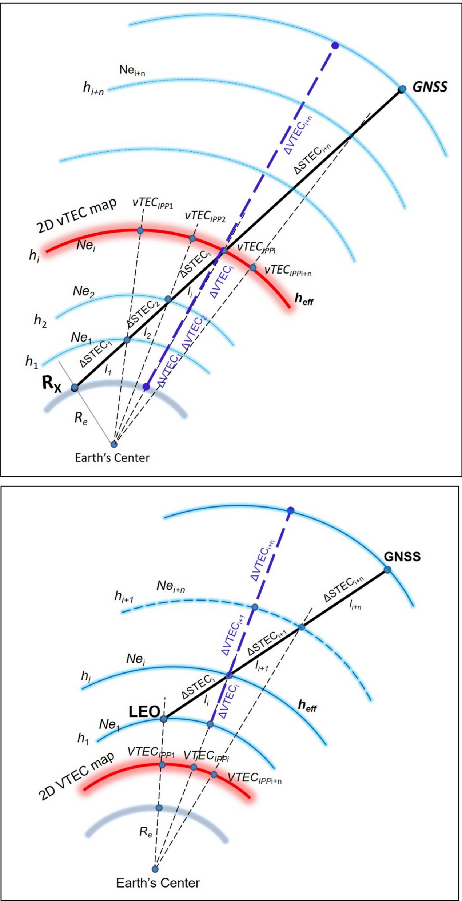
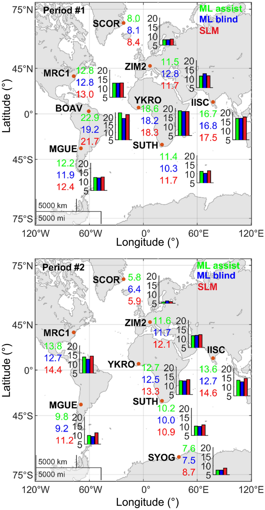
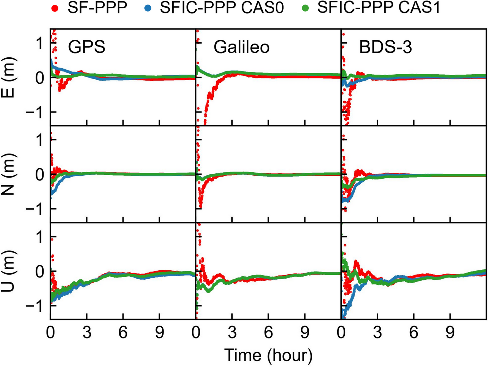

# 2026-09-18 GNSS 每日研究简报

## 今日快报

### 快报 1：把步态误差按运动状态分开补偿，GNSS 失锁后的三维轨迹仍受单路线训练边界约束

- 主题：`gnss-denied-motion-pattern-state-aware-pdr`
- 来源 ID：`doi:10.1088/1361-6501/aea923`
- 来源链接：https://doi.org/10.1088/1361-6501/aea923
- 发表日期：2026-09-17
- 来源类型：Measurement Science and Technology 同行评审论文、低成本惯性/气压计无 GNSS 三维定位
- 获取范围：出版社/Crossref 摘要与元数据；方法流程、约 400 m 闭环试验和摘要指标已核对，正文条件未外推

**内容：** 方法用同步的航位推算轨迹与 RTK 参考轨迹学习步长、航向和高度误差同运动特征之间的系统关系，再按直行、转弯和垂向运动状态调整补偿强度，最后用受约束的局部残差修正短窗口轨迹形变。

**结论：** 约 400 m 室外闭环步行试验中，摘要报告水平、垂向和三维误差的 75% 分位分别为 0.86 m、0.18 m 和 0.88 m，并优于论文复现的对照方法。这是用 RTK 轨迹监督得到的特定步态/路线结果，不能证明跨人员、跨设备或长时间无闭环约束时仍保持同级误差。

**关注理由：** GNSS 失锁补偿不能只给一个全局尺度因子；直行、转弯和上下楼的误差生成机制不同。对低成本终端，状态识别错误、训练域偏移和重新接收 GNSS 时的平滑回接应与精度指标一起测试。

### 快报 2：信号路径与等离子体泡平行会放大闪烁，但 EIA 中心并不服从单一几何规则

- 主题：`low-latitude-scintillation-epb-alignment-multisite`
- 来源 ID：`doi:10.1007/s10291-026-02144-3`
- 来源链接：https://doi.org/10.1007/s10291-026-02144-3
- 发表日期：2026-09-16
- 来源类型：GPS Solutions 同行评审论文、低纬电离层闪烁多站统计
- 获取范围：出版社摘要与元数据；12 个月、四座巴西站、四类对齐状态及定性结论已核对，付费正文数值未作推断

**内容：** 研究在太阳活动周 24 和 25 的峰值期，汇集四座位于赤道电离异常区中心或边界的巴西站一年数据，把传播几何分成完全对齐、仅仰角对齐、仅方位对齐和不对齐，分别比较振幅闪烁 S4、ROTI 与载波相位残差。

**结论：** 严重闪烁通常与完全对齐相关，但在 EIA 中心，高背景电子密度会让不对齐几何也出现严重闪烁；ROTI 的增强反而更常在传播方向近似垂直于地磁场时出现。摘要还指出，对齐会加强闪烁等级与载波相位残差的关联；这不是一个可由单一夹角阈值替代的全球通用模型。

**关注理由：** S4、ROTI 和相位残差响应的是不同尺度与机制。接收机若只用一个闪烁指标做统一降权，可能漏掉相位风险；基准站布设和随机模型应同时考虑纬度、背景 TEC 与磁场几何。

### 快报 3：月球冻结轨道能给北斗星间链路一个绝对方向参照，但目前仍是实测地球链路加仿真月球链路

- 主题：`bds3-lunar-elfo-joint-autonomous-orbit-determination`
- 来源 ID：`doi:10.1186/s43020-026-00217-9`
- 来源链接：https://doi.org/10.1186/s43020-026-00217-9
- 发表日期：2026-09-17
- 来源类型：Satellite Navigation 同行评审 CC BY 4.0 开放论文、BDS-3/月球星间链路联合自主定轨
- 获取范围：开放全文与元数据；集中式 EKF、60 d 方案、实测 BDS-3 ISL 加仿真 ELFO ISL 和摘要误差已核对

**内容：** 仅靠 GNSS 星座内部星间测距时，整体旋转偏差不可观，会随时间漂移。论文把 24 颗 BDS-3 MEO 卫星与椭圆月球冻结轨道 ELFO 卫星放入同一集中式扩展卡尔曼滤波，以月球强引力造成的不同动力学对称性建立外部方向基准。

**结论：** 作者报告 60 d 内三轴旋转误差稳定在 13.59、10.27 和 4.04 mas，24 颗 BDS-3 MEO 的平均 RMS 用户测距误差维持在 0.35 m；ELFO 卫星最大径向、沿轨、横轨误差分别低于 0.16、1.7、1.8 m，最大三维误差低于 2.3 m。北斗链路来自在轨数据，但月球链路为仿真，结果不是在轨月球星座验收。

**关注理由：** 这是一个典型可观性问题：增加同类测距并不一定消除整体旋转自由度，引入不同动力学环境才改变秩结构。星座设计应把“链路数”和“可观方向”分开评估。

### 快报 4：iSAM2 让 PPP/RTK 因子图只重线性化必要部分，单段城市 PPP 收益不能代替全数据结论

- 主题：`ion-gnss2026-incremental-fgo-ppp-rtk`
- 来源 ID：`ion:gnss2026-17075`
- 来源链接：https://www.ion.org/gnss/abstracts.cfm?paperID=17075
- 发表日期：2026-09-17
- 来源类型：ION GNSS+ 2026 原始会议摘要、增量因子图 PPP/RTK
- 获取范围：公开会议摘要；数据集、因子设计、代表性 1 h PPP 片段与作者报告指标已核对，论文/演示需登录

**内容：** 框架把未差或双差码相观测建成因子，连续相位弧模糊度作为跨历元状态，并用 iSAM2 的 Bayes 树增量更新、流式重线性化和局部重排序避免每历元重解整张图；GNSS 因子增加可切换约束，系统支持 1 Hz GNSS、10 Hz IMU 和里程计。

**结论：** 英国 2026 年采集超过 20 h，但摘要展示的是伦敦一段 1 h、含 1.5 km 隧道的 PPP 结果：水平 RMS 从 EKF 的 2.71 m 降到 1.98 m，三维 RMS 从 4.42 m 降到 3.26 m；4 s 窗口相对 EKF 的计算开销约 5%。这是作者在单一代表片段上的会议摘要结果，不能写成全部场景、纯 GNSS 或 RTK 都已达到 26%–27% 改善。

**关注理由：** 因子图的工程价值来自稀疏增量更新和可审计的因子级鲁棒化，不只是“用更多历史”。实时部署要同时报告延迟、重线性化频率、边缘化误差和隧道后的重新收敛。

### 快报 5：超相关延长相干积分并形成方向选择性，深城市场景的厘米级主张仍需看到完整数值与独立对照

- 主题：`ion-gnss2026-supercorrelation-preciseplus-urban`
- 来源 ID：`ion:gnss2026-17144`
- 来源链接：https://www.ion.org/gnss/abstracts.cfm?paperID=17144
- 发表日期：2026-09-17
- 来源类型：ION GNSS+ 2026 厂商原始会议摘要、软件接收机深城市高精度跟踪
- 获取范围：公开会议摘要；接收机架构、支持信号、仿真/实测场景和定性结果已核对，论文、图表和数值需登录

**内容：** Precise+ 在测量引擎中依据用户、钟和卫星动力学延长相干积分并形成方向选择性，输出伪距、伪距率与 ADR；定位引擎向测量引擎闭环反馈，支持 GPS L1/L5、Galileo E1/E5a、BDS B1C/B2a、QZSS L1/L5，并可深耦合 IMU。验证包含 RF 仿真的动力学/功率/回波变量，以及伦敦街谷和英国林下实测。

**结论：** 摘要定性称相对同配置先进接收机减少周跳、提高灵敏度和测量可靠性，并在深城市与林下的各统计分位改善定位误差；公开摘要未给出样本量、误差数值、固定率或置信区间，因此不能把标题中的“厘米级”当作已由公开证据完成验收。

**关注理由：** 延长相干积分的关键不是无限积累，而是先补偿动态并避免 NLOS 被长期积累。评估时应要求原始 IF、基线配置、外部改正、INS 开关和第三方接收机设置都可复核。

## 深度研读

### 深读 1｜接收机工程｜从一张薄壳到多层积分：STEC/VTEC 映射为什么先决定偏差账能否闭合

- 类别：`receiver-engineering`
- 学习层级：`foundation`
- 选题定位：`经典基础`
- 来源 ID：`doi:10.1186/s43020-025-00182-9`
- 来源链接：https://doi.org/10.1186/s43020-025-00182-9
- 发表日期：2025-12-15
- 来源类型：Satellite Navigation 同行评审 CC BY 4.0 开放论文、地面/LEO 多层电离层映射
- 获取范围：开放 HTML 全文与出版社原图；模型、超过 200 站数据、2019/2023 试验和 Figure 1 已核对
- 价值评分：94/100（相关性 19，经典价值 18，证据 19，教学价值 20，工程价值 18）

#### 为什么先学这个

电离层产品通常给垂直总电子含量 VTEC，而接收机观测沿斜路径承受的是 STEC。把两者互换的映射函数看似只是一个仰角因子，实际上会把电离层垂向结构、水平梯度和接收机/卫星差分码偏差 DCB 混在一起。先理解映射几何，才能判断后面的 PPP-AR 收敛收益来自更合理的传播模型，还是滤波器碰巧吸收了偏差。

#### 先修知识

需要理解双频码相几何无关组合、TEC/TECU、VTEC 与 STEC、穿刺点 IPP、差分码偏差 DCB、Chapman 电子密度层、等离子层指数尾、GIM/IONEX 和仰角截止。1 TECU 为 $`10^{16}`$ electrons/m²；GPS L1/L2 的 1 ns DCB 约对应 2.9 TECU，时间偏差不能不经频率因子直接写成距离或 TEC。

#### 一句话逻辑

不再把全部电子压到固定高度薄壳，而是沿卫星视线穿过许多球壳，逐段累加电子密度乘路径长度得到 STEC，再用同一垂向剖面的 VTEC 归一化成映射因子。

#### 研究问题与约束

论文比较多层 MF 与固定 450 km 单层 MF：地面部分用超过 200 座全球站的 GPS L1/L2 相位和 P1/P2 码，选择 2019 年低太阳活动与 2023 年高太阳活动、平静与扰动日；另用 Swarm、COSMIC-1、MetOp 等不同高度 LEO 数据做归一化。多层实现主要验证 blind 模式，仍固定若干 Chapman/等离子层参数并依赖背景 VTEC 模型，不是对真实三维电离层的直接层析。

#### 核心方法论

电子密度用 Chapman 层与指数衰减等离子层相加；斜路径在各高度球壳形成长度 $`l_i`$，垂直方向形成厚度 $`\Delta h_i`$。各交点投影到 450 km 的二维 VTEC 图读取水平变化，再由垂向剖面分配到各层。地面数据以 10° 截止角生成日解 DCB 与 15 阶球谐 GIM；LEO 数据先归一到 800 km 参考轨道再联合估计。

#### 关键公式逐步推导

Chapman 与等离子层电子密度可写为：

```math
N_e(h)=N_m\exp\left[\frac12(1-z-e^{-z})\right]+n_p\exp\left(-\frac{h}{H_p}\right),
\quad z=\frac{h-h_m}{H}.
```

沿路径逐段积分：

```math
STEC_{model}=\sum_i N_{e,i}l_i,
\qquad
VTEC_{model}=\sum_i N_{e,i}\Delta h_i.
```

于是多层映射因子为：

```math
MF_{ML}=\frac{STEC_{model}}{VTEC_{model}}.
```

单层基线只用仰角 $`e`$ 与固定有效高度 $`h_I`$：

```math
MF_{SLM}=\left[1-\left(\frac{R_e}{R_e+h_I}\cos e\right)^2\right]^{-1/2}.
```

二者差别不只是曲线形状：多层法还让沿途不同 IPP 的背景 VTEC 进入积分。

#### 经典价值与创新边界

经典价值是把“斜率因子”还原为电子密度路径积分，并统一地面与 LEO 观测。创新边界是 blind 模式并没有恢复真实三维电子密度；对 CODE/IGS 产品更接近只是外部一致性证据，且 GIM、DCB 和映射函数之间存在共同模型与基准耦合。

#### 整体逻辑链

双频码相生成弧段 STEC；码相平滑去模糊度；选择背景 VTEC；构造 Chapman 加等离子层剖面；斜/垂方向分层积分；形成 $`MF_{ML}`$；将 STEC 映射为 VTEC；联合估计卫星/接收机 DCB 与 GIM；按纬度、太阳活动和地面/LEO来源对照单层结果。

#### 原文图表与结果分析



> 图表源：Hoque 等《Multi-layer ionosphere mapping function for ground and LEO GNSS data and its performance analysis》Figure 1，[开放全文](https://doi.org/10.1186/s43020-025-00182-9)。CC BY 4.0 出版社原始 PNG，原样下载，未裁切、重绘、改色或修改标签。

上图对应地面接收机、下图对应 LEO 接收机；黑线是斜向 STEC 累加路径，紫色虚线是垂向 VTEC，红色弧面是二维 VTEC 图，浅蓝球壳表示离散高度层。图直接说明同一个 450 km 投影面并不等于电子只存在于该高度；它不能证明所采用 Chapman 参数在所有时空条件下都真实。

#### 原文结果论述

相对 IGS/CODE DCB，地面接收机 DCB 的平均接近程度在 2019 年改善 0.14–0.27 ns，在 2023 年改善 0.30–0.78 ns；改善站点比例分别为 68%–81% 与 66%–87%。多层 GIM 相对 CODE/IGS 的平均偏差在 2019 年少约 0.8–1 TECU、2023 年少约 1.1–2.8 TECU；但部分地区的标准差并非总是更小，不能把平均偏差改善写成所有指标全面占优。

#### 常见误区与适用边界

第一，把 450 km IPP 当真实电子层。第二，把 VTEC 图插值误差全归给映射函数。第三，忘记 DCB 与 TEC 同时估计会互相吸收。第四，用地面映射函数直接处理 LEO 顶侧 TEC。第五，把更接近 CODE 当独立真值。第六，只看全球平均而不分低纬、高太阳活动和低仰角。

#### 工程实现步骤

1. 统一码型、频点、天线和 DCB 基准。
2. 做周跳清理与码相平滑，按连续弧段生成 STEC。
3. 为每条视线建立球壳交点和路径长度。
4. 从同一版本 GIM/模型读取各投影 IPP 的 VTEC。
5. 计算 $`MF_{ML}`$，保留单层结果作在线基线。
6. 按纬度、地方时、太阳活动和仰角分箱监控残差。
7. 对 LEO 先做轨道高度归一化，再联合 DCB。

#### 复现实验设计

选 60 个独立于模型训练的 IGS/MGEX 站，低/中/高纬各 20 个，覆盖平静日与磁暴日；用同一 RINEX、码相清理、球谐阶次和 DCB 约束分别跑 SLM、ML blind、ML assist。指标为对外部 DCB 的 ns 偏差、对独立 STEC 的 TECU RMS、按仰角分箱残差、GIM 留站交叉验证误差和计算耗时；失败条件是平均偏差改善但独立留站 RMS 或低仰角尾部恶化。

#### 与定位及低成本实现的联系

低成本单频接收机无法自行消除一阶电离层，最依赖外部 VTEC 到 STEC 的转换；多频 PPP-AR 也需要准确斜向约束加速收敛。下一节把映射函数放进真实 PPP-AR 滤波器和观测域，检查这种几何改进是否真的传到坐标。

#### 本节小结

映射函数是传播模型与硬件偏差之间的接口；多层法的价值在于显式积算垂向结构和水平梯度，而不是把薄壳高度换成另一个经验常数。

### 深读 2｜接收机工程｜从 TEC 一致性到坐标收敛：怎样证明多层映射不是滤波器里的“看起来更好”

- 类别：`receiver-engineering`
- 学习层级：`intermediate`
- 选题定位：`基础进阶`
- 来源 ID：`doi:10.1186/s43020-026-00193-0`
- 来源链接：https://doi.org/10.1186/s43020-026-00193-0
- 发表日期：2026-04-01
- 来源类型：Satellite Navigation 同行评审 CC BY 4.0 开放论文、多层映射函数 PPP-AR/观测域验证
- 获取范围：开放 HTML 全文与出版社原图；九站、两时段、48 个小时段、PPP-AR 与几何无关组合结果已核对
- 价值评分：96/100（相关性 20，经典价值 18，证据 19，教学价值 19，工程价值 20）

#### 为什么先学这个

上一节证明多层映射能让 DCB/GIM 更接近参考产品，但定位滤波器会同时估计坐标、钟差、对流层、斜电离层和模糊度，可能把错误吸收掉。真正有说服力的验证需要两条链：一条看 PPP-AR 坐标与收敛，另一条绕过滤波器直接比较观测域 STEC。

#### 先修知识

需要理解未组合 PPP、解耦钟模型、浮点/固定模糊度、先验电离层约束、收敛时间、几何无关组合、GIM 插值、RMS 与连续门限。达到一次 20 cm 不等于收敛；论文要求此后连续保持阈值。

#### 一句话逻辑

固定同一套 IGS GIM，只替换 SLM、ML blind 和 ML assist 三种 VTEC→STEC 映射，再同时检查 48 次冷启动 PPP-AR 与对齐后的几何无关 STEC 残差。

#### 研究问题与约束

数据取 2019-01-09/10 与 2019-07-14/15，九座站覆盖高、中、低纬。每个两日时段拆成 48 个独立 1 h 会话，每整点重启滤波器；每站每日另选至少 20 条最高仰角不低于 60° 的 GPS/GLONASS 弧段做观测域验证。低相关弧段（<0.9）被剔除，且赤道区出现过 GIM 与实测模式不一致，说明结论受 GIM 本身质量限制。

#### 核心方法论

PPP-AR 使用未组合解耦钟模型，GIM VTEC 经三种 MF 转为斜向先验并约束电离层状态；坐标域统计第 2 历元（1 min）、第 120 历元（60 min）的 3D RMS，并记录持续低于 0.20 m 的收敛时间。观测域先修复周跳，再把几何无关组合与 GIM-STEC 在最高仰角点对齐，按 10° 仰角箱比较 RMS。

#### 关键公式逐步推导

多层电子密度仍写为：

```math
N_e(h)=N_m\exp\left[\frac12(1-z-e^{-z})\right]+n_p\exp(-h/H_p).
```

映射因子由路径积分比值给出：

```math
MF_{ML}=\frac{\sum_i\Delta STEC_i}{\sum_i\Delta VTEC_i},
\qquad STEC^{prior}=MF\cdot VTEC^{GIM}.
```

在未组合 PPP 中，可把先验作为斜电离层状态 $`I_s`$ 的软约束：

```math
I_s-I_s^{prior}=v_I,\qquad v_I\sim\mathcal N(0,\sigma_I^2).
```

收敛时间定义为首个历元 $`t_c`$，使后续全部历元满足：

```math
\|e_{3D}(t)\|<0.20\ \mathrm{m},\qquad \forall t\ge t_c.
```

因此一次穿过门限不会被误计为收敛。

#### 经典价值与创新边界

价值在于把定位域和观测域闭环，能识别“滤波器吸收错误”的假改善。边界是只有九站、两个 2019 两日窗口、1 h 静态会话与同一 IGS GIM；ML 模型与前一论文共享方法谱系，仍需要跨产品、跨太阳活动峰值和动态用户验证。

#### 整体逻辑链

选择两季与三纬度区；固定 GIM；生成三种 MF 的斜电离层先验；48 次冷启动 PPP-AR；记录初始/最终坐标与收敛；独立清理几何无关弧段；在高仰角对齐硬件常数；按仰角比较 STEC RMS；把坐标收益与观测域一致性对应起来。

#### 原文图表与结果分析



> 图表源：Paziewski 等《Validation of a multi-layer approach-based ionospheric mapping function supporting PPP-AR》Figure 4，[开放全文](https://doi.org/10.1186/s43020-026-00193-0)。CC BY 4.0 出版社原始 PNG，原样下载，未裁切、重绘、改色或修改地图、柱形或数值。

上下图分别是冬季 Period #1 与夏季 Period #2；绿、蓝、红对应 ML assist、ML blind、SLM，站点旁三行数字单位为 min，柱图纵轴也是 min。多数站 ML 低于 SLM，但并非每站每模式单调：例如 SCOR 的 Period #1 为 8.0/8.1/8.4 min，Period #2 则 5.8/6.4/5.9 min。图能证明平均与多数站收益，不能证明 ML assist 永远优于 blind 或所有纬度都同幅改善。

#### 原文结果论述

Period #1 全站平均收敛由 SLM 的 14.3 min 降到 ML blind 的 13.8 min；Period #2 由 11.4 min 降到 10.3 min。高纬 SCOR/SYOG 约 6–8 min，赤道 YKRO/IISC 常约两倍。60 min 后 Period #1 三种方案平均 3D 误差差异小于 1 mm；Period #2 最终平均误差从 12.7 cm 降到 10.4 cm，说明主要收益集中在初始化而非稳定态。

#### 常见误区与适用边界

第一，只报终态坐标，错过先验最有影响的初始化段。第二，用一次越过 20 cm 代替持续收敛。第三，把 GIM 错误归因于 MF。第四，在最高仰角对齐后忘记绝对偏差已被消去。第五，剔除低相关赤道弧段后仍把观测域结果写成全样本。第六，由静态 1 h 会话外推动态 PPP-RTK。

#### 工程实现步骤

1. 固定同一 VTEC 产品、插值器和方差模型。
2. 并行输出 SLM 与 ML 斜电离层先验及其差值。
3. 每次冷启动记录电离层状态、模糊度和坐标协方差。
4. 用“持续低于阈值”计算收敛时间。
5. 另跑几何无关组合弧段，按仰角分箱残差。
6. 对低相关弧段单列为 GIM 失配，不静默删除。
7. 在低纬/磁暴时触发先验方差膨胀或退回弱约束。

#### 复现实验设计

使用 IGS Final、CODE、Galileo HAS 三种 VTEC 源，在 18 站、四季、平静/扰动各 7 天做每小时冷启动；对比 SLM、ML blind、ML assist。指标为 20 cm 持续收敛时间、1/5/15/60 min 3D RMS、固定率、错固定率、STEC 分仰角 RMS、不可用弧段比例和 CPU 时间；以隐藏站几何无关组合与双频无电离层 PPP 作外部基线。

#### 与定位及低成本实现的联系

多层 MF 的现实作用是让外部 VTEC 在初始化期更像真实斜延迟，从而减少电离层状态与模糊度的互相污染。但下一节说明，即使映射正确，DCB 产品若吸收了卫星频间 PCO，先验与观测仍不在同一个硬件基准上。

#### 本节小结

一个传播改进只有同时通过观测域一致性与定位域收敛检验，才算从模型走到接收机；终态厘米误差不是唯一、也往往不是最敏感的指标。

### 深读 3｜纯 GNSS 定位｜映射函数对了还不够：卫星 PCO 怎样藏进 DCB，再拖慢单频 PPP

- 类别：`positioning`
- 学习层级：`advanced`
- 选题定位：`定位深入`
- 来源 ID：`doi:10.1007/s10291-025-01983-w`
- 来源链接：https://doi.org/10.1007/s10291-025-01983-w
- 发表日期：2025-11-12
- 来源类型：GPS Solutions 同行评审开放论文、CC BY-NC-ND 4.0、多系统 DCB/单频 PPP
- 获取范围：开放 HTML 全文与出版社原图；400+ MGEX 站、六个月 DCB、20 站 SPP/PPP、Figure 9 已核对
- 价值评分：97/100（相关性 20，经典价值 19，证据 20，教学价值 19，工程价值 19）

#### 为什么先学这个

前两节处理 VTEC 到 STEC 的空间映射，但码偏差产品本身也可能含有频率相关天线相位中心误差。单频用户把 DCB、GIM 和码观测拼在一起时，如果这些产品的 PCO 处理不一致，滤波器会把厘米级天线几何投影放大成分米级电离层/码偏差不闭合，直接影响 SPP 精度和 PPP 收敛。

#### 先修知识

需要理解卫星天线相位中心偏移 PCO/变化 PCV、卫星本体坐标系、视线 LOS 投影、频间 DCB、几何无关码组合、卫星/接收机 DCB 秩亏与零均值基准、ANTEX、单频 SPP、单频电离层约束 PPP（SFIC-PPP）和钟差吸收。产品基准改变可以被接收机钟吸收，不代表逐星残差也消失。

#### 一句话逻辑

先把两频 PCO 差投影到卫星—接收机 LOS 并从几何无关码组合扣除，再估计 DCB；或者用稳定的 z-PCO 差近似修正既有 DCB，然后检查单频 SPP 与电离层约束 PPP 是否更快、更准。

#### 研究问题与约束

论文用 400 多座 MGEX 站估计 2022-07-01 至 12-31 的 GPS、Galileo、BDS-3 DCB，CAS0 不校正 PCO、CAS1 在估计前严密校正，并以 z-PCO 对现有产品做近似校正。定位验证用 20 站：SPP 统计一个月，SFIC-PPP 重点比较 2022-06-20 至 30 和 SYDN 单日 12 h。结果针对指定信号组合、igs20.atx 与 2022 星座块，不能无条件外推到所有频点与后续天线模型。

#### 核心方法论

两频码几何无关组合消去几何距离、钟差和对流层，却保留电离层、卫星/接收机硬件偏差及两频 APC 差。严密法逐历元用轨道、站坐标和 ANTEX 计算 LOS PCO 投影并先扣除；近似法利用 z-PCO 差在日内近似常数，直接修正现有卫星 DCB。随后在零均值约束下联合解卫星/接收机 DCB，并用 CAS0/CAS1 驱动 SF-SPP 与 SFIC-PPP。

#### 关键公式逐步推导

两频几何无关码组合为：

```math
P_{r,4}^{s}=40.3\left(\frac{1}{f_1^2}-\frac{1}{f_2^2}\right)STEC_r^s
+c(b_{r,12}-b_{12}^{s})+d_{pco,12}^{s}.
```

严密校正先做：

```math
P_{r,4}^{s,*}=P_{r,4}^{s}-d_{pco,12}^{s}.
```

再以设计矩阵 $`B`$ 和卫星 DCB 零均值约束 $`FX=0`$ 求：

```math
\hat X_{DCB}=(B^{\mathsf T}B+F^{\mathsf T}F)^{-1}B^{\mathsf T}L_{SPR}^{*}.
```

若只改现有产品，利用近似 $`d_{pco,12}^{s}\approx z_{12}^{s}`$：

```math
DCB_{12}^{s,*}=DCB_{12}^{s}-z_{12}^{s}.
```

近似残差为厘米量级，论文认为日平均可进一步抑制，但这仍需按新星座块验证。

#### 经典价值与创新边界

价值在于打通“天线标定—偏差产品—电离层约束—位置”的完整链，并给出严密与低成本近似两条部署路径。边界是结果依赖特定 ANTEX、DCB 基准和历史数据；Galileo 敏感度较小也不等于其所有卫星/频点永远无需 PCO 一致性处理。

#### 整体逻辑链

读取频率相关卫星 PCO；按 LOS 形成双频 APC 差；修正几何无关码；建站点电离层模型；联合估计卫星/接收机 DCB；与 DLR/CAS 产品比较半年稳定性；将 CAS0、z-PCO 近似修正和 CAS1 分别送入 SPP；再用 GIM 约束 SF-PPP 前 2 h；统计位置与持续 20 cm 收敛。

#### 原文图表与结果分析



> 图表源：Wang 等《Determination of multi-GNSS differential code biases with satellite antenna phase center corrections》Figure 9，[开放全文](https://doi.org/10.1007/s10291-025-01983-w)。原文采用 CC BY-NC-ND 4.0；直接下载完整出版社 PNG，未裁切、重绘、改色、压缩或修改任何像素，仅作非商业研究评论引用。

三列为 GPS、Galileo、BDS-3，三行为 E/N/U 误差，横轴 0–12 h，纵轴 m；红、蓝、绿分别是标准 SF-PPP、CAS0 约束和 CAS1 约束。GPS 与 BDS-3 的绿色曲线通常更早进入零附近，Galileo 蓝绿差异小；垂向仍明显慢于水平。该图是 SYDN 站单日曲线，不能单独证明全球平均提升。

#### 原文结果论述

半年 DCB 对 DLR 的 RMS 差低于 0.1 ns。20 站单频 SPP 中，PCO 校正使 GPS 与 BDS-3 三维精度平均改善 20.3% 和 13.1%，Galileo 改善较小。SFIC-PPP 相对 CAS0 的平均收敛时间，GPS 减少 54.9%、BDS-3 减少 10.7%；20 站联合统计中 CAS1 相对基线约减少 30%。GPS G11/G23 的平均电离层残差分别从 0.630/0.490 m 降到 0.192/0.039 m，说明产品不一致会表现为逐星而非公共钟偏差。

#### 常见误区与适用边界

第一，把 PCO 与 PCV 混为一个常数。第二，认为接收机钟能吸收所有卫星相关偏差。第三，DCB 改了却不记录零均值基准。第四，把 CAS1 对 2022 星座块的结果外推到未来卫星。第五，只看 SPP 平均提升，不看 PPP 初始化和逐星残差。第六，修改 CC BY-NC-ND 原图。第七，把电离层约束一直强加到 12 h；论文只在前 2 h 使用。

#### 工程实现步骤

1. 固定 ANTEX、轨道、信号组合与 DCB 产品版本。
2. 按卫星本体系 PCO 差投影到 LOS。
3. 在 DCB 估计前扣除严密 APC 差，或对旧产品应用 z-PCO 近似。
4. 显式保存卫星 DCB 零均值/参考基准。
5. 检查逐星电离层残差，不能只看公共钟。
6. 对 SPP、SF-PPP、SFIC-PPP 分开验证。
7. 为新卫星块、ANTEX 更新和频点更换触发重新标定。

#### 复现实验设计

用 60 个全球 MGEX 站连续三个月，按 GPS Block、Galileo、BDS-3 CAST/SECM/IGSO 分层；比较 CAS0、严密 LOS PCO、z-PCO 近似与另一分析中心产品。指标包括 DCB 日稳定性/ns、逐星残差/m、SPP 3D RMS、SFIC-PPP 5/10/20 cm 持续收敛、低/高纬差异和近似法相对严密法的计算成本；以更新前后 ANTEX 做敏感性检验。

#### 与定位及低成本实现的联系

单频低成本终端最难自行辨别“外部电离层错”与“偏差产品基准错”。把 MF、DCB、PCO 和信号组合版本一起发布，才能让廉价接收机可靠复用高端网络产品；对 PPP-RTK 服务端，这也是跨分析中心产品互操作的必要条件。

#### 本节小结

纯 GNSS 单频 PPP 的收敛不仅由滤波算法决定；卫星天线频间几何若被错误吸收到 DCB，会破坏 GIM 约束与观测的一致性。先闭合产品基准，再谈更快收敛。
