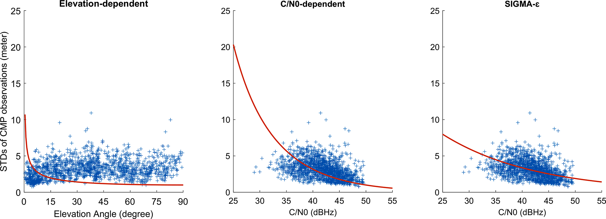
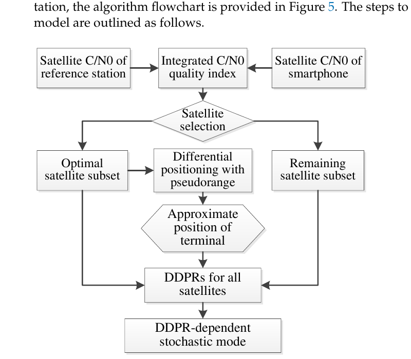
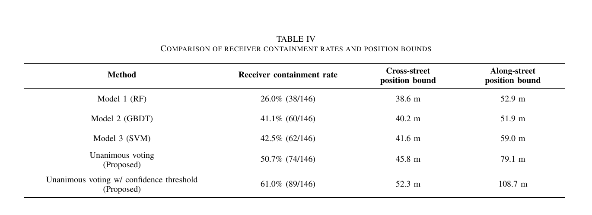

# 2026-09-20 GNSS 每日研究简报

## 今日快报

### 快报 1：Galileo HAS 全服务进入外部测试征集，分米级目标不等于每台终端已完成验收

- 主题：`galileo-has-full-service-external-testing-call`
- 来源 ID：`gsc:has-full-service-testing-2026-09-18`
- 来源链接：https://www.gsc-europa.eu/news/open-for-submission-call-for-expression-of-interest-for-galileo-has-full-service-testing
- 发表日期：2026-09-18
- 来源类型：欧洲 GNSS 服务中心官方征集、高精度服务全服务阶段测试
- 获取范围：官方全文；测试目的、信号播发范围、申请截止日期与服务定位已核对，尚无本轮测试结果

**内容：** EUSPA 面向外部利益相关方征集 Galileo High Accuracy Service 全服务测试参与者，测试包含 HAS Signal in Space 播发；申请截止到 2026 年 10 月 14 日。HAS 通过星上信号和互联网提供 PPP 所需的高精度改正，官方将其定位为免费、全球可用、面向分米级用户性能的服务。

**结论：** 这是一项进入全服务运营阶段前的测试征集，而不是新增的终端精度验收报告。页面没有给出接收机型号、收敛时间、动态场景或本轮误差统计，因此“分米级”应理解为服务目标与能力定位，不能写成所有参与终端已在任意环境达到分米级。

**关注理由：** 对 PPP/HAS 接收机，真正需要提交的是改正获取率、解码连续性、收敛时间、稳态误差和失锁恢复；参与外部测试能把服务端 MPL 与终端实现之间的缺口变成可复核数据。

### 快报 2：Galileo Q2 报告把轨道钟差、可用性和测距精度分开验收，平均达标不能掩盖局部例外

- 主题：`galileo-q2-2026-service-performance-mpl`
- 来源 ID：`gsc:galileo-q2-2026-performance-reports`
- 来源链接：https://www.gsc-europa.eu/news/galileo-performance-reports-for-q2-2026-are-now-available
- 发表日期：2026-09-17
- 来源类型：欧洲 GNSS 服务中心官方季度性能报告汇总、OS/HAS/OSNMA/SAR 服务监测
- 获取范围：官方全文与报告入口；Q2 统计口径、MPL 对照和页面列出的例外已核对，未把季度系统指标外推为单终端定位误差

**内容：** 报告分别监测 Open Service 测距、HAS 轨道/钟差/码偏差改正、OSNMA MAC 与等效导航解可用性，以及 SAR 检测、定位和返向链路。HAS 改正精度页面报告 Galileo/GPS 轨道不差于 0.16/0.22 m，钟差为 0.07/0.12 m，码偏差不差于 0.17/0.25 m；Galileo-only 改正可用性高于 89.76%，Galileo+GPS 不低于 97.94%。

**结论：** Q2 总体超过相应 MPL，但报告也保留例外：6 月 La Réunion 与 Kerguelen 的 SAR 单次突发有效消息检测分别为 98.53% 和 98.79%，未达 99% 目标；5 月 Kerguelen 的 5 km 内单次突发定位概率为 89.31%，低于 90% 目标。系统级轨道钟差指标不能直接等同于用户位置误差，后者还受几何、大气、天线和接收机模型影响。

**关注理由：** 工程验收应复制这种分层：先验收产品本身，再验收传播链和用户解；同时保留最差站点、最差月份与置信水平，避免只报全局平均。

### 快报 3：Galileo 首次把导航数据认证与测距认证合到民用位置解，但一次受控演示不是完备反欺骗保证

- 主题：`galileo-sas-first-civil-authenticated-position-fix`
- 来源 ID：`euspa:sas-first-authenticated-position-2026-09-17`
- 来源链接：https://www.euspa.europa.eu/newsroom-events/news/galileo-achieves-first-ever-civil-authenticated-gnss-position-using-signal
- 发表日期：2026-09-17
- 来源类型：EUSPA 官方技术演示公告、Galileo SAS/OSNMA 民用信号认证
- 获取范围：官方全文；星号、频点、时段、密钥延迟验证流程和 Jammertest 现象已核对，缺少公开的样本量与检测概率统计

**内容：** 9 月 16 日 14:00–16:00 UTC，E06、E21、E23、E34、E36 五颗 Galileo 卫星对 1278.75 MHz 的 E6-C 分量加密。SAS 接收机先记录加密信号数字样本，数秒后利用经 OSNMA 披露的密钥和预取认证信息验证测距，再用至少四星同时形成认证位置解。

**结论：** 在挪威 Andøya 的 Jammertest 受控欺骗中，常规接收机被牵引到假位置，而 SAS 接收机检测攻击并维持认证 Galileo 解。该证据证明了“导航电文认证 + 测距认证”的真实星上闭环可行性；它没有公开覆盖所有欺骗功率、转发延迟、天线攻击、密钥不可用或城市多路径组合，不能替代完整威胁模型和统计认证。

**关注理由：** OSNMA 只验证数据来源还不够，SAS 把认证延伸到距离信息。接收机实现需同步评估认证延迟、缓存长度、可认证卫星数和攻击期间的可用性，而不只是是否报警。

### 快报 4：贝叶斯 DPE 用粒子直接闭环 PVT，但初步对照未做同等仰角与 C/N0 门控

- 主题：`ion-gnss2026-bayesian-direct-position-estimation-urban`
- 来源 ID：`ion:gnss2026-16875`
- 来源链接：https://www.ion.org/gnss/abstracts.cfm?paperID=16875
- 发表日期：2026-09-18
- 来源类型：ION GNSS+ 2026 原始会议摘要、城市 GPS/BDS 贝叶斯直接定位
- 获取范围：公开扩展摘要；SIR 粒子滤波、10,000 粒子、采集硬件、参考解和作者自述的基线偏置已核对，完整论文与数值表需登录

**内容：** 方法跳过逐星伪距估计，直接把接收基带信号写成位置、速度与钟状态的函数，以 Sequential Importance Resampling 粒子滤波递推后验。初步试验在香港理工校园用 PocketSDR 采集 GPS L1 C/A 与 BDS B1I 基带，以 10,000 粒子求解；u-blox F9P 的 WLS/MatRTKLIB 解作两步定位基线，RTK 解作真值。

**结论：** 摘要称 BDPE 初步结果显著优于 WLS，但作者同时明确承认两者都未设仰角和 C/N0 门限，这一设置更有利于联合信号域的 BDPE；计划中的 KF 两步基线与 ARS-DPE 对照尚未完成。公开证据因此支持算法与试验已落地，不支持给出未公开的改善百分比或宣称公平基线下已定胜负。

**关注理由：** DPE 的收益应在等采样率、等先验、等信号筛选和等计算预算下比较。摘要主动暴露基线不对称，是比单个漂亮误差曲线更重要的复现实验提示。

### 快报 5：滑动窗口先寻找局部平稳段再做 PSD 包络，机场多路径完整性仍缺公开数值尾界

- 主题：`ion-gnss2026-nonstationary-code-minus-carrier-psd-overbound`
- 来源 ID：`ion:gnss2026-16812`
- 来源链接：https://www.ion.org/gnss/abstracts.cfm?paperID=16812
- 发表日期：2026-09-18
- 来源类型：ION GNSS+ 2026 原始会议摘要、机场面差分 GNSS 码多路径完整性建模
- 获取范围：公开扩展摘要；CMC 隔离、地面/机载天线数据、局部宽平稳分段和 PSD 包络逻辑已核对，窗口准则与数值保护界未公开

**内容：** 码多路径既时间相关又非平稳，直接对整段数据做 PSD 包络会违反平稳假设。论文先以 code-minus-carrier 隔离码多路径，再用自适应滑动窗口把序列切成局部宽平稳区间，对每个区间建立功率谱密度包络，服务于双频多系统差分 GNSS 的浮点模糊度初始化和机场面高完整性导航。

**结论：** 作者称真实地面与机载天线数据验证了方法，并支持分米级高完整性定位的误差建模；但公开摘要没有给出窗口长度、平稳性检验门限、包络超限率、保护级或独立验证集。因此可以确认其解决的是“非平稳序列如何进入相关误差包络”，不能确认具体完整性风险已经由公开证据闭合。

**关注理由：** 把非平稳数据硬塞进一个全局一阶 Gauss–Markov 模型会低估局部谱峰。接收机应记录窗口切换、最大相关时间、谱包络裕度和异常场景覆盖率，才能把算法接入 PL 计算。

## 深度研读

### 深读 1｜低成本与手机｜从仰角经验权到 C/N0 方差：手机码噪声为什么要先重新标尺

- 类别：`low-cost-mobile`
- 学习层级：`foundation`
- 选题定位：`经典基础`
- 来源 ID：`doi:10.1007/s10291-024-01690-y`
- 来源链接：https://doi.org/10.1007/s10291-024-01690-y
- 发表日期：2024-06-25
- 来源类型：GPS Solutions 同行评审 CC BY 4.0 开放论文、Android 手机伪距随机模型
- 获取范围：开放 HTML 与 PDF 全文、出版社原图；公式、7 h 静态建模、2 h 静态定位、Google 车载数据和 Figure 6 已核对
- 价值评分：96/100（相关性 20，经典价值 19，证据 19，教学价值 20，工程价值 18）

#### 为什么先学这个

加权最小二乘或卡尔曼滤波并不只需要“观测值”，还需要每条观测有多可信。测量型天线的增益通常随仰角有规律，手机却使用线极化、方向图不均匀的小天线；若仍照搬 $`1/\sin E`$ 权重，协方差就可能比伪距本身更先出错。先把码噪声的尺度标准，才能谈残差降权和城市信号筛选。

#### 先修知识

需要理解伪距、载波相位、C/N0（dB-Hz 与线性值不可混用）、卫星仰角、码减相位 CMP、方差/权重、标准化残差、正态 Q-Q 图、卡尔曼创新与 RMS。随机模型描述的是条件分布，不是把所有多路径都“校正掉”。

#### 一句话逻辑

先用 CMP 和 120 s 低阶多项式分离手机码观测的快变噪声，再分别拟合仰角、接收机热噪声型 C/N0 和 SIGMA-ε 三种方差函数，最后用 IGG III 对仍未被方差模型解释的异常残差继续膨胀协方差。

#### 研究问题与约束

建模数据是 2019-10-25 楼顶固定的 Xiaomi Mi 8，1 Hz、约 7 h，含 GPS/GLONASS/Galileo/BDS-2/BDS-3；第二频点可用星数不足，因此只分析单频码。静态定位用其中 2 h，同一数据还参与系数拟合；动态验证采用 2021-12-08 洛杉矶 North Hills 公路 Google Android 数据。跨机型、手持姿态、湿天线和深街谷并未覆盖。

#### 核心方法论

码减相位消去几何距离、钟差和对流层，留下两倍电离层、硬件偏差、模糊度、码/相多路径与噪声；对每条连续弧用 120 s 低阶多项式去掉慢变项，以窗口标准差作为码噪声代理。三类方差函数分别以仰角或 C/N0 给先验尺度；SIGMA-ε 对不同星座单独估计比例系数。滤波阶段计算标准化创新，只对最大异常观测迭代应用 IGG III，避免把全部正常观测一起削弱。

#### 关键公式逐步推导

码与相位同频组合的快变部分可写为：

```math
CMP(t)=P(t)-L(t)=2I(t)+B+MP_P(t)-MP_L(t)+\varepsilon_P(t)-\varepsilon_L(t).
```

以低阶多项式 $`p(t)`$ 去掉 $`B`$ 和慢变电离层后，近似有：

```math
D\{CMP(t)-p(t)\}\approx\sigma_P^2.
```

测量型接收机常用仰角模型 $`\sigma_P^2=a^2/\sin^2E`$；手机更适合以线性 $`c/n_0=10^{(C/N0)/10}`$ 驱动 DLL 噪声模型，或使用论文采用的修正 SIGMA-ε：

```math
\sigma_P^2=C_s^2\,10^{-((C/N0)-40)/20},
```

其中 $`C_s`$ 按星座估计。滤波残差 $`v_k`$ 经 $`\tilde v_k=v_k/\sqrt{\hat\sigma_0^2Q_{v_k}}`$ 标准化，再由 IGG III 因子 $`\gamma_k`$ 形成等价协方差 $`\bar R_k=R_k/\gamma_k`$。

#### 经典价值与创新边界

经典价值是把“权重来自哪里”从经验仰角曲线拉回接收机码环噪声和统计校准；创新在于按星座拟合 SIGMA-ε，并与迭代 IGG III 结合做实时单点定位。边界是 CMP 仍含高频电离层和多路径，静态系数与验证有数据重用，且更接近正态不等于尾部已经满足完整性包络。

#### 整体逻辑链

清理连续码相弧段；计算 CMP；以 120 s 窗去趋势；按仰角/C/N0 分箱；分别拟合三种方差函数；检查标准化误差 Q-Q；按星座保存系数；生成观测协方差；用创新做 IGG III 二次鲁棒化；在静态与车载数据上比较位置 RMS 和 CDF。

#### 原文图表与结果分析



> 图表源：Bahadur 与 Schön《Improving the stochastic model for code pseudorange observations from Android smartphones》Figure 6，[开放全文](https://doi.org/10.1007/s10291-024-01690-y)。CC BY 4.0 出版社 PDF 中的原始图像对象，原样提取，未裁切、重绘、改色或修改坐标轴与数据。

左图横轴为仰角（degree），蓝点是每个 120 s 段 CMP 标准差（m），红线的仰角模型随角度单调下降，却没有跟随点云；中、右图横轴为 C/N0（dB-Hz），两条 C/N0 型曲线至少捕捉到信号强时方差下降的趋势。图直接支持“手机码噪声与仰角弱相关、与 C/N0 更相关”，但点云仍很宽，不能证明单一 C/N0 就解释了方向图、遮挡和多路径。

#### 原文结果论述

标准化误差中，SIGMA-ε 模型在各星座有超过 95% 的观测贴近正态区段，而单纯仰角模型约只有 50%，普通 C/N0 模型超过 75%。静态试验中，典型“C/N0 + 标准 KF”的水平/垂向/三维 RMS 为 3.46/3.85/5.18 m，SIGMA-ε + 鲁棒 KF 为 1.82/2.14/2.81 m，对应三维改善 45.8%；动态全段三维 RMS 从 5.51 m 降到 4.50 m，改善 26.6%。这些是 Mi 8 和特定数据的相对结果，不是所有 Android 设备的误差保证。

#### 常见误区与适用边界

第一，把 dB-Hz 直接代入需要线性 C/N0 的公式。第二，用一套 $`C_s`$ 混合所有星座和频点。第三，把 CMP 全部当热噪声，忽略其中的高频电离层与多路径。第四，在同一数据上拟合系数并宣称完全独立验证。第五，IGG 降权后不报告被降权比例。第六，把 RMS 改善写成尾部完整性已改善。

#### 工程实现步骤

1. 按设备、星座、频点维护独立统计桶。
2. 检查码相时间标签、周跳和相位连续性，生成 CMP 弧段。
3. 用固定 120 s 基线与 60/240 s 敏感性窗口去趋势。
4. 拟合并版本化 $`C_s`$，留出不同日期与姿态作验证。
5. 将方差写入 $`R_k`$，记录创新与标准化残差。
6. 仅对最大异常量迭代 IGG III，并设置最小权重。
7. 在线监控按星座的 NIS、降权率和位置尾误差。

#### 复现实验设计

选 Mi 8、Pixel 8、Galaxy S 系列各两台，固定朝向和手持四朝向各采 2 h，1 Hz，覆盖楼顶、树荫、低楼和高楼街谷。前 60% 日期拟合 $`C_s`$，后 40% 日期锁定参数；比较等权、仰角、DLL-C/N0、SIGMA-ε、SIGMA-ε+IGG。指标包括方差校准曲线、Q-Q 尾部、NIS 覆盖率、水平/垂向 RMS、95/99 分位和每千观测降权数；失败条件是平均 RMS 下降但独立设备的 99 分位或滤波可用率恶化。

#### 与定位及低成本实现的联系

这一节给出先验权重：C/N0 能解释一部分手机码噪声，但对遮挡和 NLOS 仍不充分。下一节引入短基线双差码残差，用一个初始位置解生成更贴近当前环境的后验质量指标。

#### 本节小结

手机随机模型的第一原则不是“低仰角必然差”，而是用本机、本频点、本星座的数据校准条件方差，并把未解释的异常留给可审计的鲁棒步骤。

### 深读 2｜低成本与手机｜从先验信号强度到后验双差残差：怎样让坏伪距自己暴露

- 类别：`low-cost-mobile`
- 学习层级：`intermediate`
- 选题定位：`基础进阶`
- 来源 ID：`doi:10.3390/s24082598`
- 来源链接：https://doi.org/10.3390/s24082598
- 发表日期：2024-04-18
- 来源类型：Sensors 同行评审 CC BY 4.0 开放论文、手机单频伪距相对定位后验随机模型
- 获取范围：开放 PDF/HTML 全文；华为 P40/Mate40、GPS/BDS、开阔/遮挡试验、Figure 5 和表格结果已核对
- 价值评分：95/100（相关性 20，经典价值 18，证据 19，教学价值 19，工程价值 19）

#### 为什么先学这个

上一节的 C/N0 方差仍是先验模型：反射信号有时功率并不低，低功率也不一定产生大距离偏差。若有近距离参考站，可以先用最可信的一小组卫星求粗位置，再计算所有卫星的双差伪距残差 DDPR；这个后验量把“信号看起来怎样”推进到“它与当前几何模型冲突多少”。

#### 先修知识

需要理解单差/双差伪距、参考星、短基线公共误差消除、设计矩阵、协方差的参考星相关项、DOP、C/N0、NLOS/多路径和加权最小二乘。DDPR 只有在坐标足够准、基线足够短时才主要代表手机码噪声和多路径。

#### 一句话逻辑

把参考站与手机同一卫星的 C/N0 相加，先选一组高质量卫星得到粗位置；再用该位置为全部可见星计算 DDPR，并按残差大小重构权重后重解位置。

#### 研究问题与约束

论文使用 Huawei Mate40 与 P40、测量型参考站、单频 GPS/BDS 伪距，在相对开阔与遮挡环境做静态近距离试验。开阔环境约 3 h；选星数量建议开阔 12–15、遮挡 8–10。模型假设短基线下轨道与大气双差可忽略，且参考站观测明显优于手机；长基线、移动参考站或参考站自身 NLOS 会破坏这一前提。

#### 核心方法论

对参考星 $`r`$ 与非参考星 $`i`$ 建立 DD 码方程，协方差矩阵显式保留公共参考星带来的非对角相关。卫星质量用参考站和手机的集成 C/N0 表征；论文还比较只用集成 C/N0、只用仰角，以及二者归一化后按 0.6/0.4 合成的 CQ。最优子集先解粗坐标，然后为最优子集与其余卫星统一计算 DDPR；最终以 DDPR 作为先验信息降低大残差观测权重。

#### 关键公式逐步推导

短基线 DD 码观测可写成：

```math
\nabla\Delta P=\nabla\Delta\rho+B\,\delta x+\nabla\Delta I+\nabla\Delta T+\nabla\Delta M+\nabla\Delta O+\nabla\Delta\varepsilon.
```

令 $`L=\nabla\Delta P-\nabla\Delta\rho_0`$，加权解为：

```math
\delta\hat x=(B^{\mathsf T}WB)^{-1}B^{\mathsf T}WL,
\qquad W=Q^{-1}.
```

若基线短且粗坐标可靠，则：

```math
DDPR_i=\nabla\Delta P_i-\nabla\Delta\rho_i
\approx\nabla\Delta M_i+\nabla\Delta\varepsilon_i.
```

选星综合分数采用归一量：

```math
CQ_i=0.6\,\widehat{(C/N0)}_i+0.4\,\hat E_i,
```

而基础 C/N0 方差形式为 $`\sigma_i^2=\hat a+\hat b\,10^{-(C/N0)_i/10}`$；DDPR 模型再依据后验残差大小调整该卫星权重。

#### 经典价值与创新边界

经典价值是把残差作为观测质量反馈，同时保留 DD 参考星引起的相关协方差。创新是“可信子集求粗解—全星 DDPR—二次定权”的低计算量流程。边界是残差含有粗位置误差并与解耦合；论文的 0.6/0.4、选星数和残差映射均是数据驱动经验量，不能跨设备无条件复用。

#### 整体逻辑链

同步参考站与手机；统一 GPS/BDS 频点和时间；选参考星；计算双端集成 C/N0；排序得到最优子集；用 C/N0 方差解粗坐标；为全星生成 DDPR；将大残差映射为大方差；带完整 $`Q`$ 重解；与全星 C/N0、最优子集 C/N0 和仰角方案对照。

#### 原文图表与结果分析



> 图表源：Deng 等《A Stochastic Model Based on Optimal Satellite Subset Selection Strategy for Smartphone Pseudorange Relative Positioning》Figure 5，[开放全文](https://doi.org/10.3390/s24082598)。CC BY 4.0 原 PDF 第 9 页以 180 dpi 渲染后仅裁去页边与邻近正文，流程框、箭头、文字与数据均未修改。

图从双端 C/N0 汇合到集成质量指标，分出最优子集和剩余卫星；只有最优子集进入第一次伪距差分定位，但粗位置随后服务于全部卫星 DDPR，最终形成后验随机模型。它说明算法没有简单丢弃其余卫星；也不能证明粗解无偏，因为错误最优子集会把位置误差写进所有 DDPR。

#### 原文结果论述

开阔环境中，DDPR 模型相对 C/N0 模型收益很小，P40 北向 RMS 甚至由 1.95 m 变为 2.24 m；作者归因于全星本来质量较好，删星提高 DOP。遮挡环境中，Mate40 北/东/高 RMS 约改善 30%/32%/34%，P40 约改善 26%/33%/24%；水平 5 m 内比例由 C/N0 模型的 23%/42% 提高到 57%/60%。这些是静态、近距离、两款手机结果，不能外推到车载动态或无参考站 SPP。

#### 常见误区与适用边界

第一，把 DDPR 当纯多路径真值。第二，忽略参考星让双差协方差产生相关。第三，在长基线继续忽略大气差。第四，粗解和最终解用同一异常卫星却不检查反馈。第五，只看遮挡收益而忽略开阔场景 DOP 变差。第六，把伪距差分结果写成载波 RTK。

#### 工程实现步骤

1. 对齐参考站/手机历元、星号、系统和码型。
2. 评估参考站自身多路径，必要时屏蔽异常方向。
3. 计算双端集成 C/N0，并按环境设置候选子集大小。
4. 用完整 DD 协方差求粗位置与 DOP。
5. 计算全星 DDPR，做留一星敏感性检查。
6. 将 DDPR 映射为方差膨胀，并限制最大/最小权重。
7. 重解后比较创新、DOP、位置变化与被降权星。

#### 复现实验设计

布设 1–5 km 三条基线，Mate40/P40/Pixel 各两台，1 Hz，在开阔、树荫、玻璃幕墙和高楼街谷各做 10 段 30 min 静态与低速行走。比较全星等权、仰角、双端 C/N0、CQ、DDPR，以及留一法防反馈版本；子集 $`N`$ 从 6 到 15 扫描。指标为 DDPR 与独立真伪 LOS 标签的 AUC、DOP、N/E/U RMS、95 分位、错误降权率和计算量；失败条件是误差下降完全来自少数卫星被删除，或参考站异常导致整段权重翻转。

#### 与定位及低成本实现的联系

这一节需要参考站，因此更接近码差分而非独立 SPP；但“多特征筛选 + 后验冲突量 + 保守降权”的思想可移植到单机城市定位。下一节把筛选器升级为三个分类器的一致投票，并直接考察定位集合是否真正包含用户。

#### 本节小结

先验 C/N0 告诉我们信号强弱，后验 DDPR 告诉我们信号是否与当前几何自洽；两级定权比只看一个信号指标更能暴露遮挡粗差，但必须防止粗位置误差反向污染残差。

### 深读 3｜定位｜宁可少用也不误用：一致投票怎样在城市纯 GPS SPP 中换取更高包含率

- 类别：`positioning`
- 学习层级：`advanced`
- 选题定位：`定位深入`
- 来源 ID：`doi:10.1109/ITSC60802.2025.11423536`
- 来源链接：https://doi.org/10.1109/ITSC60802.2025.11423536
- 发表日期：2025-11-18
- 来源类型：IEEE ITSC 2025 同行评审会议论文、作者 arXiv 预印本、纯 GPS 城市 3D 地图辅助 SPP
- 获取范围：IEEE 元数据、作者预印本全文与原表；Songdo 1 Hz 数据、训练/测试划分、RF/GBDT/SVM、一致投票、Table IV 已核对
- 价值评分：95/100（相关性 20，经典价值 17，证据 19，教学价值 19，工程价值 20）

#### 为什么先学这个

前两节解决“每颗卫星权重多大”，这一节改问更安全的问题：分类器不确定时，这颗星是否应该参与位置集合收缩。城市 shadow matching 一次 LOS/NLOS 误判就可能把真位置从候选区域切掉；三个模型只有意见一致且置信度足够时才允许卫星参与，能提高鲁棒性，但会因可用星减少而放大位置边界。

#### 先修知识

需要理解 GPS SPP、伪距残差、LOS/NLOS、3D 城市模型与射线标注、随机森林 RF、梯度提升树 GBDT、支持向量机 SVM、置信度校准、shadow matching、zonotope 集合、定位成功率、真值包含率和位置边界。包含率高不等于边界紧。

#### 一句话逻辑

对每颗可见 GPS 星分别让 RF、GBDT、SVM 判断 LOS/NLOS；只有三者标签一致且最低置信度不低于 0.7 才进入 ZSM 集合求交，用更少但更可靠的约束降低误分类把真位置排除的概率。

#### 研究问题与约束

数据来自韩国仁川 Songdo 密集城区，NovAtel PwrPak7 与双极化天线以 1 Hz 记录 GPS，独立 NovAtel GNSS/INS 后处理轨迹作真值；商业 3D 城市模型通过射线相交生成 LOS/NLOS 标签。训练集 12,477 条（10,800 LOS、1,677 NLOS），目标道路测试集 917 条（705/212），定位评估 146 历元、平均仅 6.28 颗可见 GPS 星。单城区、单路线、商用高端前端和纯 GPS 限制了外推。

#### 核心方法论

三个分类器都使用仰角、C/N0 和伪距残差三特征，但学习机制不同。单模型会把自己的全部高置信分类送入 ZSM；一致投票先要求三个标签相同，再要求三者置信度均超过 0.7，否则卫星被视为不可靠并排除。ZSM 用 LOS 约束删去建筑阴影区域，用 NLOS 约束保留阴影区域，最终输出集合而非单一点；因此同时报告是否有有效集合、集合是否包含真值和沿街/横街边界。

#### 关键公式逐步推导

先以线性化伪距求一个位置与钟差状态：

```math
\hat p=(G^{\mathsf T}G)^{-1}G^{\mathsf T}\tilde\rho,
\qquad \delta=\tilde\rho-G\hat p,
```

其中 $`\delta`$ 与仰角、C/N0 一起进入三个分类器。对卫星 $`s`$，模型 $`m`$ 输出标签 $`y_{m,s}`$ 与置信度 $`q_{m,s}`$；接纳规则可写为：

```math
a_s=1\iff y_{1,s}=y_{2,s}=y_{3,s}
\quad\land\quad \min_m q_{m,s}\ge0.7.
```

接纳星按标签收缩初始位置集合 $`\mathcal Z_0`$：

```math
\mathcal Z=\mathcal Z_0
\cap\!\!\bigcap_{s\in\mathcal L}\mathcal Z_s^{LOS}
\cap\!\!\bigcap_{s\in\mathcal N}\mathcal Z_s^{NLOS}.
```

可靠性用 $`N(\hat p_{true}\in\mathcal Z)/N_{epoch}`$ 衡量；精度则由集合在 cross-street 与 along-street 方向的宽度描述，二者必须同时报告。

#### 经典价值与创新边界

经典价值是把分类器错误从“平均分类准确率”传到“真位置是否还在集合里”，并显式呈现可靠性—边界宽度折衷。创新是异构模型的一致投票加统一置信门限。边界是三个模型共享同一三特征和同一标签源，错误并不独立；0.7 是经验阈值，ZSM 也依赖 3D 地图几何正确。

#### 整体逻辑链

采 GPS 与独立真值；用 3D 射线生成 LOS/NLOS 标签；按目标道路隔离测试集；训练 RF/GBDT/SVM；逐星输出标签与置信度；执行一致投票与 0.7 门限；把接纳星送入 ZSM；计算有效位置集合；检查真值包含；量取横街/沿街边界；与三个单模型及无置信门限投票对照。

#### 原文图表与结果分析



> 图表源：Kim 与 Seo《Enhancing Urban GNSS Positioning Reliability via Conservative Satellite Selection Using Unanimous Voting Across Multiple Machine Learning Classifiers》Table IV，[作者预印本](https://arxiv.org/abs/2507.12706)。原文未标示开放再利用许可；为非商业研究评论从作者 PDF 第 5 页以 180 dpi 渲染并裁取最小必要完整表格，未修改数字、表头或行列，不主张再分发权。

表中单模型包含率为 26.0%–42.5%，一致投票为 50.7%，加 0.7 门限后为 61.0%。代价同样清楚：加门限方案的横街/沿街边界扩大到 52.3/108.7 m，而 RF 单模型为 38.6/52.9 m。表直接证明保守选星提高“真值仍在集合内”的频率，也直接否定“可靠性提升必然让位置更精确”。

#### 原文结果论述

RF/GBDT/SVM 分类准确率为 80.9%/85.9%/83.2%，每历元平均误分类星数为 1.20/0.88/1.05。一致投票加门限保留 70.9% 的观测，选中星准确率 90.8%，平均误分类降到 0.41 颗。ZSM 有效解成功率从单模型的 91.8%–97.3% 提升到无门限投票 99.3%、加门限 100%；但 100% 只是这 146 历元产生有效集合，不是 100% 精确或 100% 包含真值。

#### 常见误区与适用边界

第一，把分类准确率当定位可靠性。第二，把“成功产生集合”当“集合包含真值”。第三，只报包含率、不报集合边界。第四，假设三个共享特征的模型错误独立。第五，用同一路段调门限又声称独立泛化。第六，把高端双极化天线结果外推到手机。第七，把 GPS-only 结果写成多系统收益已验证。

#### 工程实现步骤

1. 将训练路段与目标路段按空间隔离，禁止同建筑泄漏。
2. 校准三模型置信度，而非直接使用未校准分类分数。
3. 逐星记录标签、置信度、模型分歧与最终接纳原因。
4. 当接纳星少于几何最低数时输出降级状态，不强行收缩集合。
5. ZSM 同时输出 valid、contains-truth（离线）和两方向边界。
6. 监控地图时效、建筑边界误差和天线/设备域偏移。
7. 用多系统增加几何冗余，再重新标定门限。

#### 复现实验设计

在三个城市各选训练区与完全不重叠测试区，车载测量型接收机与两款手机并行 1 Hz，至少 20 条 20 min 路线；3D 地图真值与 GNSS/INS 轨迹独立生成标签。比较 RF、GBDT、SVM、软概率平均、多数投票、一致投票，以及门限 0.5–0.95；再比较 GPS-only 和 GPS+Galileo+BDS。指标为分类 Brier/ECE、误分类星/历元、ZSM 成功率、真值包含率、横/沿街边界、集合面积和计算延迟；失败条件是包含率提升完全依赖边界无限扩大，或跨城市/手机后门限失效。

#### 与定位及低成本实现的联系

这是一条纯 GNSS SPP 路线：没有 IMU、LiDAR 或融合位置约束，外部 3D 地图只用于信号可见性。对手机实现，可用多个轻量模型或不同时间窗口替代高成本传感器，但必须把“少用星导致几何变差”纳入可用性策略；前两节的方差与 DDPR 还可作为分类器校准和软降权基线。

#### 本节小结

城市定位的保守策略不是盲目删星，而是在分类分歧时拒绝让不可靠约束切掉真位置；收益应由包含率证明，代价则必须由位置边界和可用星数如实呈现。
