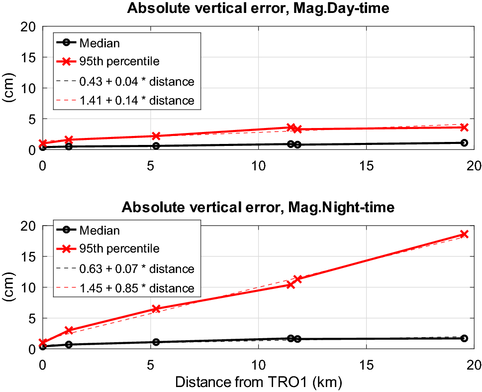
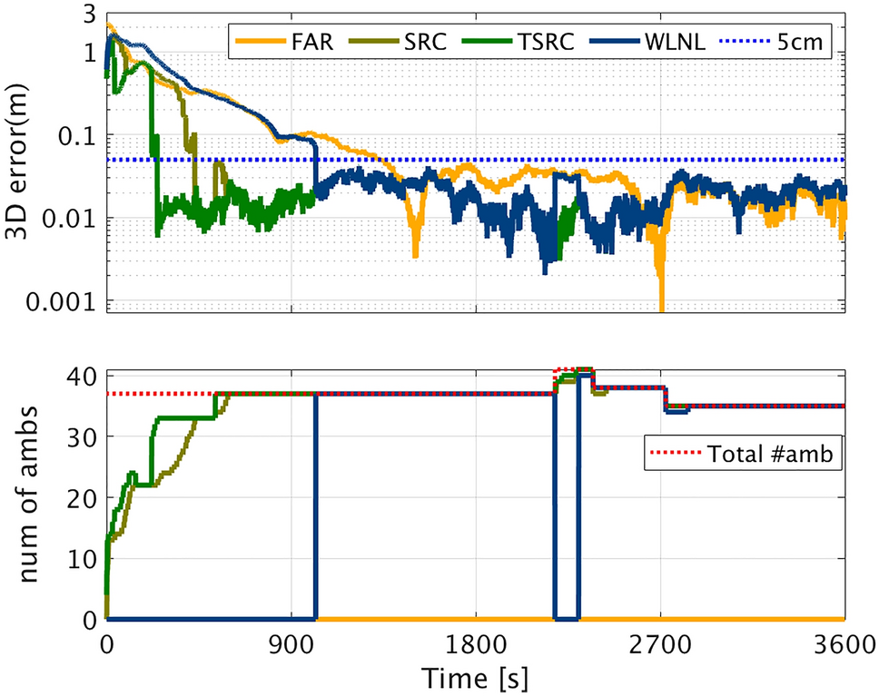
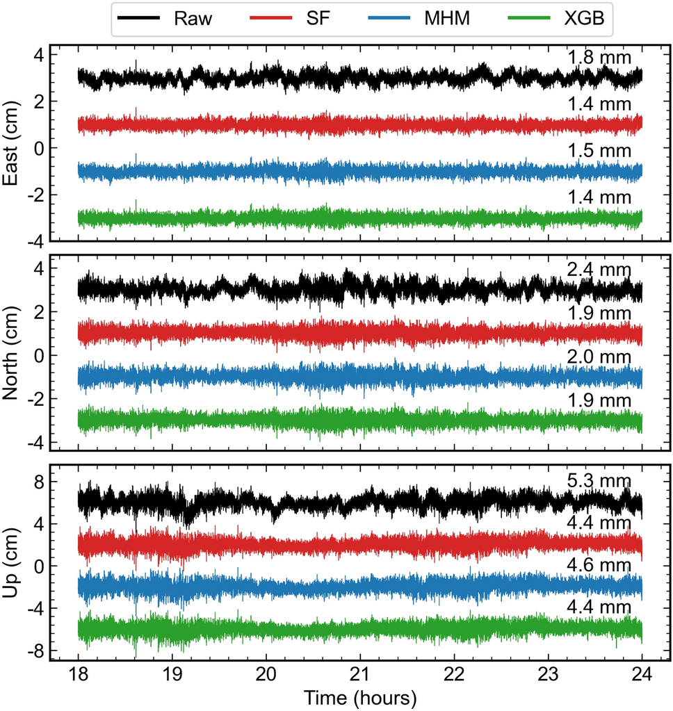

# 2026-09-21 GNSS 每日研究简报

## 今日快报

### 快报 1：人体近场不是楼宇 NLOS，手机动态定权试验目前仍是待验证方案

- 主题：`smartphone-human-body-proximity-transformer-weighting`
- 来源 ID：`ion:gnss2026-17097`
- 来源链接：https://www.ion.org/gnss/abstracts.cfm?paperID=17097
- 发表日期：2026-09-18
- 来源类型：ION GNSS+ 2026 原始会议扩展摘要、手机天线人体近场效应与学习定权
- 获取范围：公开扩展摘要；设备、姿态、距离、采样率、特征和计划对照已核对，页面主要使用将来时，未公开最终分类准确率或定位改善量

**内容：** 研究把人体靠近手机造成的天线失谐与近场反射，从楼宇阻断式 NLOS 中单独分离。计划以 Pixel 7 Pro、Pixel 5 和 Xiaomi 14T Pro 在开阔静态环境按 1 Hz 采集，每种场景 15 min；变量包括人体距手机 15/25 cm、屏幕朝上或倾斜 60°、单人或双人环绕。Transformer 分类器识别人体干扰，再把分类输出映射到卡尔曼滤波观测权重。

**结论：** 摘要给出了可复核的实验设计和“多星同时、方位不对称、随人体移动缓变”的待检验特征，但没有报告已完成的分类混淆矩阵、跨设备测试集或坐标误差改善。因此不能把文中基于既有研究预期的“数 dB C/N0 衰减”写成这三款手机已经测得的结果，也不能宣称 Transformer 已优于 C/N0/仰角权。

**关注理由：** 手机用户本身就是天线环境的一部分。工程上应把握持姿态、机身方位和人体距离纳入设备侧质量标志，同时保留简单的 C/N0、仰角和创新定权作为跨机型基线。

### 快报 2：把城市 SNR 指纹做成道路格网，横街判别提升仍依赖一次静态采样区

- 主题：`smartphone-nmea-snr-grid-map-matching`
- 来源 ID：`ion:gnss2026-17043`
- 来源链接：https://www.ion.org/gnss/abstracts.cfm?paperID=17043
- 发表日期：2026-09-18
- 来源类型：ION GNSS+ 2026 原始会议扩展摘要、手机 NMEA SNR 地图匹配
- 获取范围：公开扩展摘要；SVR 格网建模、参考站遮挡补充、采样间距、手机型号和摘要结果已核对，完整数据划分与长期稳定性未公开

**内容：** 方法只读取手机 NMEA 中的卫星高度角、方位角和 SNR，在每个道路格网训练 SVR，预测该位置随卫星方向变化的连续 SNR 指纹；附近参考站用于识别手机端缺失的被遮挡卫星。在线阶段把当前 SNR 向量与格网库匹配，不需要三维建筑模型或显式 LOS/NLOS 标签。

**结论：** 在大田市政厅站附近、约每 15 m 一个静态点、Galaxy S25 Edge 数据上，摘要报告格网识别成功率由快照 DGNSS 的 32.8% 提高到 61.6%；约 10 m 宽窄路的横街判别由 46.2% 提高到 70.4%。这些是单区域、单机型、静态采样的结果，不能外推到不同季节、卫星星座、握持姿态或高速动态。

**关注理由：** 这把城市多路径从纯误差转化为位置特征，但地图必须版本化。部署时应分离建图集和跨日期测试集，并监控新建筑、树冠和设备天线差异造成的指纹漂移。

### 快报 3：有限时段多观测故障要同时猜起点，创新监测的紧致性来自明确暴露窗口

- 主题：`finite-duration-multimeasurement-kf-innovation-integrity`
- 来源 ID：`ion:gnss2026-17138`
- 来源链接：https://www.ion.org/gnss/abstracts.cfm?paperID=17138
- 发表日期：2026-09-18
- 来源类型：ION GNSS+ 2026 原始会议扩展摘要、卡尔曼创新序列完整性监测
- 获取范围：公开扩展摘要；NIS、时序解分离、累计创新向量和故障起点多假设框架已核对，公开页面未给出最终数值表和完整仿真曲线

**内容：** 研究针对会同时影响全部量测、起点未知但持续时间有限的故障，对三类创新序列检测器统一构造风险界：归一化创新平方和 NIS、等价于时序解分离的投影统计量，以及更适合检测均值漂移的累计创新向量 CVS。所有可能故障起点作为多假设进入界限，应用对象是带浮点模糊度的紧组合载波相位 GNSS/IMU 仿真。

**结论：** 摘要支持“CVS 有新的解析风险界、三类检测器按界限紧致度与告警时间比较”这一方法性结论；它没有公开可复核的最优告警时间或风险改善比例。结果来自标准化故障参数与蒙特卡洛仿真，不是道路实车或认证级飞行试验。

**关注理由：** RTK/PPP 的服务端告警和链路时延天然形成有限暴露窗。接收机若只假设故障从窗口首历元持续至今，会安全但过保守；显式枚举起点可把“安全”与“可用”放在同一计算框架内。

### 快报 4：HASIC 把 HAS 可靠改正与生命安全载波定位分成两条完整性链，原型不等于认证服务

- 主题：`galileo-egnos-hasic-carrier-phase-integrity-platform`
- 来源 ID：`ion:gnss2026-16908`
- 来源链接：https://www.ion.org/gnss/abstracts.cfm?paperID=16908
- 发表日期：2026-09-18
- 来源类型：ION GNSS+ 2026 原始会议扩展摘要、欧盟 HASIC 项目载波相位定位完整性架构
- 获取范围：公开扩展摘要；两类端到端概念、平台模块和目标应用已核对，未公开认证结论、保护级统计或故障注入结果

**内容：** HASIC 探索两条兼容路径：一条面向航空、海事和铁路等生命安全载波相位定位，另一条在 Galileo HAS 之上增加轻量、独立的改正可靠性监测，面向 ADAS、机器控制等中等监管市场。实验平台把改正处理、完整性监测、播发和用户性能串成端到端原型，用于名义表征、故障事件检测和 KPI 评估。

**结论：** 公开证据表明架构和代表性验证平台已经定义；没有公开服务可用率、漏检概率、告警时间或监管认可。因此它是概念验证和责任链设计，不是 Galileo HAS 已获得安全认证，也不是现有 EGNOS SoL 的直接替代品。

**关注理由：** 高精度服务真正难点不只在厘米误差，还在“谁监测改正、谁播报告警、用户如何闭合风险”。HASIC 把技术链和责任链同时纳入设计，适合用来审视商业 PPP-RTK 服务的完整性接口。

### 快报 5：三星手机 VRS 伪距已到约 1 m，载波 PPP-RTK 车道级仍是正在扩展的目标

- 主题：`samsung-smartphone-osr-ssr-ppprtk-carrier-phase`
- 来源 ID：`ion:gnss2026-17189`
- 来源链接：https://www.ion.org/gnss/abstracts.cfm?paperID=17189
- 发表日期：2026-09-18
- 来源类型：ION GNSS+ 2026 原始会议扩展摘要、Exynos 手机 OSR/SSR 辅助高精度定位
- 获取范围：公开扩展摘要；旧金山道路、VRS 伪距基线、L1/L5 自适应、EKF 状态和扩展计划已核对，载波 PPP-RTK 最终车道级统计尚未公开

**内容：** 框架统一接入 VRS 等 OSR 与面向 PPP-RTK 的 SSR，并考虑通过移动定位辅助协议交付厂商 SSR。EKF 可按可观性扩展位置、钟差、残余大气、频间偏差和载波模糊度状态，并配置自适应定权、质量筛选、周跳重置和鲁棒模糊度管理。

**结论：** 摘要中已经完成的是美国 101/280 高速开阔路段的 VRS 改正伪距方案，约达到 1 m 的 1σ 精度且称在多设备复现；载波相位 OSR/SSR、L1/L5 自适应 PPP-RTK 正在扩展和跨区域验证。不能把“通向车道级”改写成载波 PPP-RTK 已在所有路线达到车道级。

**关注理由：** 量产手机从米级走向车道级的瓶颈是载波连续性、偏差状态与改正交付共同闭合，而不是单独更换定位算法。该架构把无线控制面、观测质量和估计器放在同一部署链里。

## 深度研读

### 深读 1｜接收机工程｜从基线长度到空间失相关：NRTK 为什么不能只验收“固定了没有”

- 类别：`receiver-engineering`
- 学习层级：`foundation`
- 选题定位：`经典基础`
- 来源 ID：`doi:10.1007/s42452-023-05325-8`
- 来源链接：https://doi.org/10.1007/s42452-023-05325-8
- 发表日期：2023-04-05
- 来源类型：Discover Applied Sciences 同行评审 CC BY 4.0 开放论文、高纬网络 RTK 长期监测
- 获取范围：开放 HTML/PDF 全文与出版社原图；2021 年连续监测、重初始化流程、距离/磁地方时统计、Figure 11 与异常分布分析已核对
- 价值评分：96/100（相关性 20，经典价值 19，证据 19，教学价值 19，工程价值 19）

#### 为什么先学这个

RTK 的厘米级来自站间差分消去共同误差，但“共同”只在有限空间和时间尺度成立。NRTK 用多站插值延伸这一尺度，却无法消除比站间距更小、变化更快的电离层结构。先理解误差怎样随距离与磁地方时失相关，才能正确解释后续模糊度固定与多路径修正。

#### 先修知识

需要理解载波相位、基站/流动站、单差和双差、整周模糊度固定、对流层与电离层延迟、VRS/FKP、分位数、固定解与浮点解。位置 RMS 小不代表错误固定率小；接收机自报标准差也不一定包住真实尾部。

#### 一句话逻辑

让独立监测站周期性重新接入挪威 CPOS NRTK 服务，记录固定时间、坐标误差和接收机噪声，再按距最近网站距离与磁地方时分箱，直接观察大气改正何时不再具有空间代表性。

#### 研究问题与约束

研究位于约 70°N 的挪威极光区，使用商业 Trimble Pivot 服务；服务内部算法不公开。RTKMon 每 60 s 开始一次会话，收到 5 个良好固定解后断开改正流，接收机最多外推 30 s。主要分析 2021 年多站数据，另以 2022 年一个多月 1 Hz 数据检查分布。结果强烈反映高纬磁地方时与该网络几何，不能直接当作中低纬服务指标。

#### 核心方法论

每个监测站坐标已知，故固定解可直接形成东、北、垂向误差。研究分别统计误差中位数、5/95 分位、接收机报告的噪声以及 TTFF，并把样本按“磁日/磁夜”、日照/黑暗、月份、小时和距最近网站距离分组。平行检查站间电离层斜率传播，解释仅看基线长度无法覆盖的时空结构。

#### 关键公式逐步推导

短基线双差载波可写为：

```math
\nabla\Delta\Phi=\nabla\Delta\rho+\lambda\nabla\Delta N-\nabla\Delta I+\nabla\Delta T+\varepsilon_{\Phi}.
```

NRTK 给用户位置插值大气改正 $`\widehat{I}_u,\widehat{T}_u`$ 后，剩余项为：

```math
r_u=-(I_u-\widehat I_u)+(T_u-\widehat T_u)+\varepsilon_{\Phi}.
```

若改正误差随距离 $`d`$ 的局部近似为 $`q_{0.95}(|e_U|)=a+bd`$，斜率 $`b`$ 不是自然常数，而是网络、地方时和电离层状态的条件统计量。论文 Figure 11 给出的拟合正体现磁日与磁夜的不同斜率。

#### 经典价值与创新边界

经典价值是把“基线越长越差”从经验口号变成独立服务监测：固定状态、误差分位和时间标签同步记录。创新在于高纬全年数据按磁地方时分层，并把电离层扰动传播与位置尾误差连接。边界是商业内核不透明、监测点数量有限，且固定解采样机制可能偏向能成功固定的时段。

#### 整体逻辑链

已知监测点坐标；每分钟开始新的服务监测会话；等待 5 个固定解；记录 TTFF、坐标和状态；按最近网站距离分组；按磁日/磁夜再分层；比较中位数与 95 分位；用电离层站对序列解释异常；最后检查扰动期误差是否偏离高斯。

#### 原文图表与结果分析



> 图表源：Jacobsen 等《Study of time- and distance-dependent degradations of network RTK performance at high latitudes in Norway》Figure 11，[开放全文](https://doi.org/10.1007/s42452-023-05325-8)。CC BY 4.0 出版社原始 PNG，原样下载，未裁切、重绘、改色或修改坐标轴与数据。

横轴是距网站 TRO1 的距离（km），纵轴是绝对垂向误差（cm）；黑圈为中位数，红叉为 95 分位。磁日上图的 95 分位拟合约为 $`1.41+0.14d`$，磁夜下图约为 $`1.45+0.85d`$，说明尾误差的距离斜率在磁夜明显增大。图只有少量距离节点且是条件统计，不能证明所有高纬网络都遵从同一线性关系，也不能把拟合外推到 20 km 之外。

#### 原文结果论述

论文报告大坐标误差出现率在 TM01（距最近网站 1.2 km）由磁日 0.3% 增至磁夜 2.0%，在 TM05（11.5 km）由 2.3% 增至 14.7%；磁夜下两站相差约一个数量级。全年反复出现而非由一两个极端风暴主导。作者也观察到扰动段坐标分布偏离高斯，意味着只报告标准差会掩盖尾部风险。

#### 常见误区与适用边界

第一，把“固定解”当作正确解。第二，用最近基站距离代替完整网络几何。第三，混合磁日与磁夜后只报全年 RMS。第四，把接收机内部标准差当成外部误差包络。第五，将极光区结果直接外推到中纬度。第六，忽略商业服务算法变化和网站维护记录。

#### 工程实现步骤

1. 在服务区布设坐标独立已知的监测站。
2. 周期性冷启动并记录改正接入、首次固定、失固和重新固定。
3. 同时保存位置误差、接收机协方差、最近站距离和网络几何。
4. 按地方时、季节、空间天气和距离建立分位数表。
5. 以 95/99 分位和错误固定率验收，而非只看平均 RMS。
6. 将尾误差回传给用户端随机模型和完整性阈值。
7. 对服务软件或网形变更重新标定。

#### 复现实验设计

在低、中、高纬各选一套 NRTK 网络，每区布设 6 个独立监测站，距最近网站覆盖 1、5、10、20、40 km；连续采集 12 个月，每 5 min 冷启动一次。比较单基站 RTK、VRS 与网络改正；指标为 TTFF 中位数/95 分位、固定可用率、错误固定率、水平/垂向 95/99 分位和协方差覆盖率。失败条件是固定率提高但 99 分位或错误固定率恶化。

#### 与定位及低成本实现的联系

网络改正不能保证每条模糊度都同样可信。下一节把空间失相关反映到浮点模糊度协方差中，并讨论为什么中长基线下应只固定可控子集，而不是强行全固定。

#### 本节小结

NRTK 的基本验收量不是“有没有固定”，而是固定解误差尾部怎样随距离、时间和电离层状态变化。

### 深读 2｜接收机工程｜从全固定到可控子集：中长基线 RTK 怎样用成功率换更早的厘米解

- 类别：`receiver-engineering`
- 学习层级：`intermediate`
- 选题定位：`基础进阶`
- 来源 ID：`doi:10.1007/s10291-022-01317-0`
- 来源链接：https://doi.org/10.1007/s10291-022-01317-0
- 发表日期：2022-08-22
- 来源类型：GPS Solutions 同行评审 CC BY 4.0 开放论文、中长基线 RTK 部分模糊度固定
- 获取范围：开放 HTML/PDF 全文与出版社原图；TSRC 两步准则、三条香港 21.4–49.9 km 基线、24 次小时重启、Figure 2 和坏案例已核对
- 价值评分：97/100（相关性 20，经典价值 19，证据 19，教学价值 20，工程价值 19）

#### 为什么先学这个

上一节说明残余电离层会让长基线浮点状态变差。全模糊度固定 FAR 要求整组都可靠，一个坏模糊度就能拖慢或污染解；只按成功率剔除虽安全，却可能固定得太少。TSRC 先保证固定失败率，再问“多固定哪个子集最能改善坐标”。

#### 先修知识

需要理解浮点模糊度及其协方差、LAMBDA 整数变换、整数最小二乘、成功率、ratio test、全固定/部分固定、条件最小二乘和 TTFF。协方差若过于乐观，任何精致的成功率公式都会给出错误信心。

#### 一句话逻辑

先用 LAMBDA 排序并剔除最差模糊度，找到满足目标成功率的 SRC 子集；再逐步加入能最大化期望基线精度收益的模糊度，每一步都用 ratio test 决定是否真的固定。

#### 研究问题与约束

实验用香港 SatRef 三条中长基线 21.4、42.5 和 49.9 km，多频 GPS、Galileo、BDS、GLONASS 数据；运动模式 EKF 同时估计基线、浮点模糊度、斜 TEC 与 ZTD。每小时重初始化一次，真值由 CANPPP 静态解给出。TTFF 定义为首次固定后保持固定且三维误差持续小于 5 cm；没有覆盖真实车辆遮挡或高动态周跳。

#### 核心方法论

对完整浮点模糊度 $`\hat N`$ 做整数可逆 Z 变换，按条件方差从差到好排序。SRC 从最精确尾部选取满足成功率阈值的最小安全子集。TSRC 再搜索候选扩展子集，计算固定该子集后基线协方差的期望改善；只有 ratio test 通过才把整数约束反馈到坐标与剩余模糊度。对照包括 FAR、宽巷—窄巷 WL–NL 和 SRC。

#### 关键公式逐步推导

浮点解与协方差写为：

```math
\begin{bmatrix}\hat x\\\hat N\end{bmatrix}
\sim\mathcal N\!\left(
\begin{bmatrix}x\\N\end{bmatrix},
\begin{bmatrix}Q_{xx}&Q_{xN}\\Q_{Nx}&Q_{NN}\end{bmatrix}
\right).
```

经整数变换 $`\hat z=Z\hat N`$ 后，对候选子集 $`z_q`$ 做 ILS。若固定为 $`\check z_q`$，坐标条件更新为：

```math
\check x_q=\hat x-Q_{xz_q}Q_{z_qz_q}^{-1}(\hat z_q-\check z_q).
```

相应条件协方差为：

```math
Q_{xx|z_q}=Q_{xx}-Q_{xz_q}Q_{z_qz_q}^{-1}Q_{z_qx}.
```

TSRC 在满足固定失败率上限的前提下，优先选择使 $`\operatorname{tr}(Q_{xx})-\operatorname{tr}(Q_{xx|z_q})`$ 期望值更大的扩展子集；论文实现还对每一步应用 ratio test。

#### 经典价值与创新边界

经典价值是把“固定多少”分成可靠性与坐标收益两个问题，并用条件协方差明确连接模糊度和位置。创新是成功率驱动的初始子集加数据驱动 ratio test 扩展。边界是结果依赖浮点协方差的校准；论文坏案例中，电离层导致协方差过于乐观，TSRC 错误全固定后甚至劣于浮点解。

#### 整体逻辑链

建立未组合中长基线滤波；估计斜 TEC/ZTD 和浮点模糊度；LAMBDA 去相关；按成功率得到 SRC 子集；评估扩展子集坐标收益；ratio test 验证；条件更新位置；连续检查固定状态与 5 cm 门限；与 FAR、WL–NL、SRC 比较 TTFF。

#### 原文图表与结果分析



> 图表源：Hou 等《Two-step success rate criterion strategy: a model- and data-driven partial ambiguity resolution method for medium-long baselines RTK》Figure 2，[开放全文](https://doi.org/10.1007/s10291-022-01317-0)。CC BY 4.0 出版社原始 PNG，原样下载，未裁切、重绘、改色或修改坐标轴与数据。

上图纵轴为三维误差（m，对数刻度），蓝色虚线是 5 cm；下图是固定模糊度数量。49.9 km 基线 01:00 会话中，TSRC 约 248 s 固定 37 个中的 33 个并越过 5 cm，SRC 约 431 s；WL–NL 约 1021 s 后全固定，FAR 一小时内未固定。单个好案例能展示机制，不能代表全天错误固定率。

#### 原文结果论述

三条 21.4–49.9 km 基线的汇总中，论文称 TSRC 的 TTFF 通常比其他 PAR 短 100–200 s、比 FAR 短 400–800 s（排除 FAR 一小时完全不固定的会话）。但 21.4 km 基线 15:00–16:00 的坏案例中，全部策略都未达 5 cm，TSRC 在约 1000 s 全固定后还劣于浮点解；放大浮点模糊度协方差只能部分缓解，证明随机模型是算法安全边界。

#### 常见误区与适用边界

第一，把 ratio test 通过当作固定必然正确。第二，用固定模糊度数量代替坐标收益。第三，忽略 Z 变换后子集与原始卫星的映射。第四，用过于乐观的码/相位方差。第五，只统计成功会话的 TTFF。第六，把香港静态基线结果外推到车载遮挡和频繁周跳。

#### 工程实现步骤

1. 以创新和外部大气指标校准 $`Q_{NN}`$。
2. 对浮点模糊度做 LAMBDA 去相关和条件方差排序。
3. 用目标失败率生成 SRC 基础子集。
4. 按坐标条件协方差收益扩展候选子集。
5. 每一步做 ratio test，并记录阈值与失败原因。
6. 固定后监控坐标跳变、残差和重置触发器。
7. 同时报 TTFF、错误固定率与不可用率。

#### 复现实验设计

选择 5、20、50、100 km 四类基线，每类 10 条，覆盖安静日和高电离层日；每小时冷启动，分别运行浮点、FAR、WL–NL、SRC、TSRC。使用独立精密静态坐标作真值；指标为 TTFF 中位数/95 分位、5 cm 固定可用率、每千会话错误固定数、坐标 99 分位和计算耗时。再把测量协方差缩放 0.5/1/2 倍做敏感性测试；若某方案 TTFF 更短但错误固定率升高，即判失败。

#### 与定位及低成本实现的联系

部分固定处理的是“哪些整数可信”，但基站和流动站附近的静态多路径即使在超短基线也不会被站间差分消掉。下一节把重复空间误差显式建模，检验修正残差是否真的传到 RTK 坐标。

#### 本节小结

中长基线 RTK 不应追求尽快全固定，而应先守住失败率，再用位置收益决定值得固定的子集，并把协方差失配当作首要故障模式。

### 深读 3｜定位｜从天球格网到坐标序列：机器学习多路径模型怎样真正改善纯 GNSS 短基线 RTK

- 类别：`positioning`
- 学习层级：`advanced`
- 选题定位：`定位专题：rtk`
- 来源 ID：`doi:10.1007/s10291-023-01553-y`
- 来源链接：https://doi.org/10.1007/s10291-023-01553-y
- 发表日期：2023-10-16
- 来源类型：GPS Solutions 同行评审 CC BY 4.0 开放论文、纯 GNSS 短基线多路径学习与定位验证
- 获取范围：开放 HTML/PDF 全文与出版社原图；30 天 1 Hz 数据、五条短基线、RF/XGB/MLP 与 SF/MHM 对照、有效期和 Figure 10 已核对
- 价值评分：97/100（相关性 20，经典价值 18，证据 20，教学价值 19，工程价值 20）

#### 为什么先学这个

前两节分别控制空间大气失相关和整数固定风险；超短基线仍有一个差分不掉的误差：接收机周围反射体造成的站点特有多路径。若环境稳定，卫星每天沿相近天球轨迹经过同一反射结构，多路径就具有可学习的方位—高度模式。

#### 先修知识

需要理解双差短基线、事后残差、天球坐标、恒星日滤波 SF、多路径半球图 MHM、SNR 的仰角趋势、XGBoost、训练/验证泄漏、功率谱密度、静态真值与运动模式解。多路径“可重复”不等于环境永远不变。

#### 一句话逻辑

从前 5 天的纯 GNSS 双差残差学习卫星方位、高度与可选校准 SNR 到多路径修正的映射，再在后续 25 天逐日修正码和相位，和 SF、MHM 同时比较残差、有效期与运动模式坐标 RMS。

#### 研究问题与约束

数据来自 Curtin 大学屋顶，30 天、1 Hz GPS；CUT0 为参考站，五个流动站组合与其距离都小于 10 m，天线类型相同。处理用修改版 RTKLIB，双频未组合码/相位，10° 截止角，无 SNR 门限；静态模式残差训练模型，运动模式坐标用于验证。环境较稳定且多路径较弱，研究的是固定站点修正，不是移动汽车沿途泛化。

#### 核心方法论

先从短基线事后残差提取多路径并去异常、归一化；候选输入为方位角、高度角和去除三次仰角趋势后的校准 SNR，模型比较 RF、XGB、MLP。DOY 244–248 训练、249 验证并网格搜参，然后滚动评价后续 24 天。基线方法是按卫星精确轨道重复时刻对齐的 SF 和 1°×1° MHM；四种观测 P1/P2/L1/L2 分别建模。

#### 关键公式逐步推导

单反射的码与载波多路径可写为：

```math
P_{MP}=\frac{\alpha\delta\cos\varphi}{1+\alpha\cos\varphi},
\qquad
\Phi_{MP}=\tan^{-1}\!\frac{\alpha\sin\varphi}{1+\alpha\cos\varphi}.
```

接收强度同时包含同一相位差：

```math
SNR^2=A_d^2+A_m^2+2A_dA_m\cos\varphi.
```

因此可以学习 $`\hat m=f(Az,El,SNR_{cal})`$ 并修正观测 $`y^{corr}=y-\hat m`$。论文用残差 RMS 降幅衡量观测域效果：

```math
R_{red}=1-\frac{RMS(r-\hat m)}{RMS(r)}.
```

但最终必须再比较坐标域 $`RMS_E,RMS_N,RMS_U`$，避免“残差更小”只是过拟合同一解算器。

#### 经典价值与创新边界

经典价值是用 SF 与 MHM 两个成熟站点多路径基线约束机器学习，而不是只与未修正解比较；创新是系统比较三类模型、输入特征、频谱分辨率和模型有效期。边界是训练/测试来自同一屋顶和相同天线，坐标真值是日静态解，且定位改善处于毫米级弱多路径场景。

#### 整体逻辑链

建立五条超短基线；提取 P1/P2/L1/L2 残差；检查跨日重复性；清洗与归一化；对 SNR 去仰角趋势；训练 RF/XGB/MLP；以第 6 天选型；冻结模型向后测试；与 SF/MHM 比较残差和 PSD；把修正写回 RTKLIB；用 125 条坐标序列验证。

#### 原文图表与结果分析



> 图表源：Pan、Möller 与 Soja《Machine learning-based multipath modeling in spatial domain applied to GNSS short baseline processing》Figure 10，[开放全文](https://doi.org/10.1007/s10291-023-01553-y)。CC BY 4.0 出版社原始 PNG，原样下载，未裁切、重绘、改色或修改坐标轴与数据；各曲线的垂直错位是原图为避免重叠所作。

三幅图依次为东、北、上分量，横轴 18–24 h，纵轴 cm；黑、红、蓝、绿分别是未修正、SF、MHM、XGB。标注 RMS 显示 XGB 为 1.4/1.9/4.4 mm，未修正为 1.8/2.4/5.3 mm；SF 与 XGB 相同，MHM 略高。曲线为便于观看被人为上下平移，不能从纵向绝对位置读取坐标偏差；该图证明的是精度和波动收窄，不是绝对准确度独立认证。

#### 原文结果论述

五站、25 天平均，XGB 对 P1/P2/L1/L2 残差 RMS 的降幅为 24.9%/36.2%/25.5%/20.4%，坐标平均精度为东 1.6 mm、北 1.9 mm、上 4.5 mm，相对未修正改善约 20.0%/17.4%/16.7%，与精确对齐的 SF 接近。模型不日更时，到 DOY 273 四类残差降幅由 25.2/35.6/25.1/19.4% 降到 9.0/17.7/16.1/14.4%；作者据此给出 5–7 天更新是性能与工作量折中。

#### 常见误区与适用边界

第一，用当天残差训练又测试。第二，让模型直接学习卫星编号而非几何与环境。第三，不去除 SNR 的仰角趋势。第四，把码和相位、L1 和 L2 混成一个目标。第五，只报告残差降幅不报告坐标。第六，把固定屋顶模型部署到移动平台。第七，环境改变后不触发失效检测。

#### 工程实现步骤

1. 按站点、天线、频点和观测类型维护模型版本。
2. 用固定坐标或高质量静态解提取事后残差。
3. 清除周跳、错误固定和异常残差，避免标签污染。
4. 对 SNR 去仰角趋势，方位角用正余弦编码。
5. 以前 5 天训练并留出第 6 天选参，禁止随机打散历元。
6. 同时生成 XGB、SF、MHM 和未修正解。
7. 在线监控残差降幅、坐标创新和环境变更，5–7 天或触发式更新。

#### 复现实验设计

在开阔屋顶、金属护栏屋顶和树旁三种固定环境各建 5 条小于 20 m 的短基线，连续 45 天采 1 Hz GPS/Galileo/BDS 双频。前 7 天训练，后 38 天锁定评估；中途有计划地移动反射板检验失效。比较未修正、SF、1° MHM、XGB 和不含 SNR 的 XGB。指标包括四类观测残差 RMS/PSD、坐标 95/99 分位、错误固定率、模型有效期和更新耗时；失败条件是残差改善而错误固定率或独立日坐标尾部恶化。

#### 与定位及低成本实现的联系

该方法是纯 GNSS RTK 的站点侧增强，适合固定基站、桥梁监测或长期参考点。低成本接收机可用同样框架，但必须独立处理天线姿态和温漂；移动平台更应把它当作局部地图或在线模型，而非永久校准表。

#### 本节小结

机器学习多路径修正只有在跨日隔离、传统基线、坐标域验真和失效检测同时成立时，才是 RTK 工程改进，而不是对残差的记忆。
