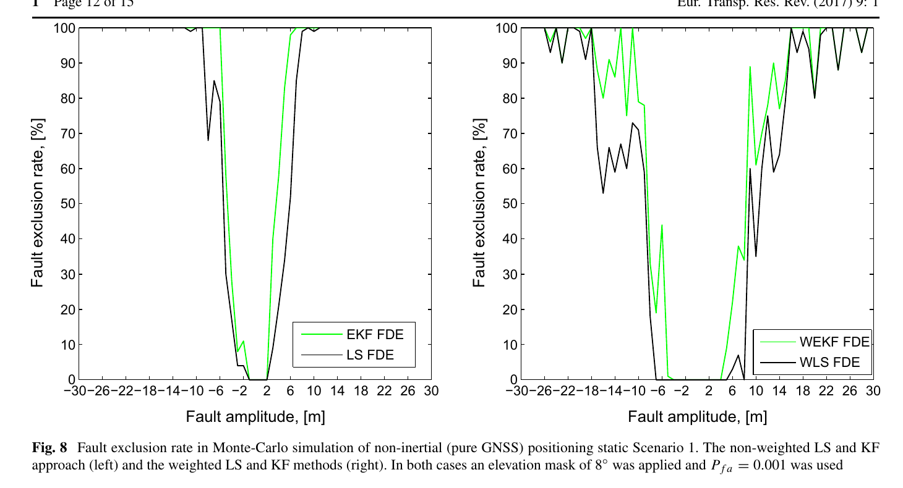
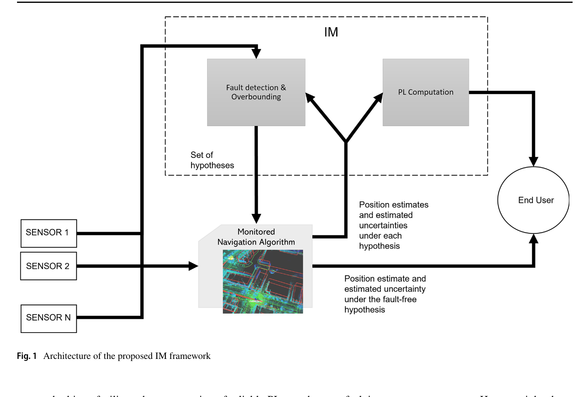
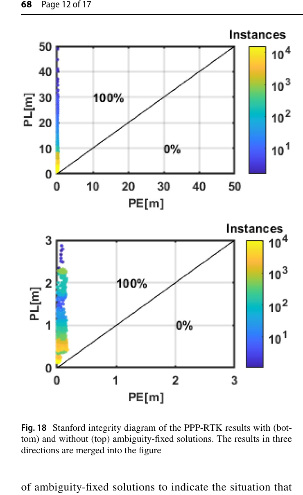

# 2026-09-22 GNSS 每日研究简报

## 今日快报

### 快报 1：空间走廊把保护级推到未来轨道，动力学失配比单星钟跳更难发现

- 主题：`leo-gnss-space-corridor-integrity`
- 来源 ID：`ion:gnss2026-16901`
- 来源链接：https://www.ion.org/gnss/abstracts.cfm?paperID=16901
- 发表日期：2026-09-17
- 来源类型：ION GNSS+ 2026 原始会议扩展摘要、星载 GNSS 完整性跨任务试验
- 获取范围：公开扩展摘要全文；Sentinel-6A/3B、Swarm、六类故障场景、三种算法与定性结果已核对，未公开完整数值表和全部保护级曲线

**内容：** ISCO 项目把“空间走廊”定义为参考轨道周围的三维安全体积，不只计算当前历元保护级，还用状态转移模型向前传播保护级。SPICE 平台比较 EMVC、ARAIM LSQ-KF 与滑窗 KF-ARAIM 解分离，输入包括真实任务遥测、精密定轨产品、2024 年 5 月磁暴和仿真故障。

**结论：** 摘要报告三类方法大多能发现卫星钟跳与广播钟错误；载波相位在磁暴峰值出现更多周跳。故意修改重力参数造成动力学模型失配时，EMVC 与量测域 ARAIM LSQ-KF 未报警，而 KF-ARAIM 解分离宣布完整性不可用。这个对比说明“量测彼此一致”不等于传播模型正确，但公开页没有给出告警时延或漏检概率，不能据此声称已达到在轨认证。

**关注理由：** 自主航天器必须同时监测当前 PVT 与未来轨道包络。接收机工程上应把初始化期、模型参数突变和保护级传播时域列为独立状态，而不是复用地面瞬时 RAIM 的单一告警逻辑。

### 快报 2：H-ARAIM 的轻量预检覆盖八组故障，但 15 小时无人机飞行仍不替代完整 MOPS

- 主题：`ed259b-haraim-sensitivity-drone-flight`
- 来源 ID：`ion:gnss2026-17008`
- 来源链接：https://www.ion.org/gnss/abstracts.cfm?paperID=17008
- 发表日期：2026-09-18
- 来源类型：ION GNSS+ 2026 原始会议扩展摘要、ED-259B H-ARAIM 仿真与飞行评估
- 获取范围：公开扩展摘要；RNP 0.3、GPS+Galileo 双频、全球格网、八组适配测试与超过 15 h 飞行数据已核对，公开页未给出最终 HPL 分位数

**内容：** ENTICE 项目以 ED-259B Service Type A 为参考，扫描卫星/星座故障概率、仰角截止、误差膨胀、单/双频与星座退化等参数，并把 Default ISD 与 Broadcast ISD 分开。轻量测试集覆盖可用性、单星、整星座和双故障四类，每类对两种 ISD 各做一次；另以约 300 m 高度、累计超过 15 h 的 GPS+Galileo 双频无人机数据检验动态与多路径下的 HPL/FDE 行为。

**结论：** 证据支持“已形成标准对齐的前置筛查流程并加入代表性飞行数据”，不支持“八组测试已经完成设备资格鉴定”。作者明确说明缩短时长、减少几何和定制故障注入只用于尽早暴露实现问题，不能替代完整 ED-259B/MOPS 测试。

**关注理由：** 完整性算法的错误常来自参数、星座假设与测试配置的组合，而非单一公式。工程验收应保留默认/广播 ISD、故障类别和星座退化的交叉矩阵，并单独记录剔星造成的 HPL 跳变。

### 快报 3：航空 HAS 原型静态 95% 水平 0.32 m、垂直 0.68 m，飞行验证仍在后面

- 主题：`galileo-has-airborne-triple-band-prototype`
- 来源 ID：`ion:gnss2026-17026`
- 来源链接：https://www.ion.org/gnss/abstracts.cfm?paperID=17026
- 发表日期：2026-09-16
- 来源类型：ION GNSS+ 2026 原始会议扩展摘要、Galileo HAS 航空接收机原型
- 获取范围：公开扩展摘要；三频前端、双频无电离层组合、16 h 静态试验及 95% 误差已核对，FLARE 与 eVTOL 飞行试验仍属后续计划

**内容：** GAUSSIAN 原型在 MPSoC 上完成 L1/E1、L5/E5a PVT 与 E6b HAS 解码，可切换航空 Hatch 平滑和经典 PPP 卡尔曼滤波；设备日志再转为 RINEX，用 gLAB 离线交叉核对。16 h 屋顶开阔静态数据同时检查逐星 HAS 改正可用性与实时 PPP 坐标误差。

**结论：** 摘要称收敛后坐标误差无明显偏置，95% 水平误差在 0.32 m 内、垂直误差在 0.68 m 内；同时观察到部分卫星某些时段没有可用 HAS 改正。这是静态、开阔、已知天线坐标下的精度证据，不是飞行阶段的连续性或完整性证明；FLARE 和最终 eVTOL 试验尚未完成。

**关注理由：** 把免费 HAS 带进航空原型，关键不只看收敛后厘米—分米误差，还要记录改正缺测、重新收敛与安全告警。0.32/0.68 m 应作为后续动态试验基线，而非可认证性能承诺。

### 快报 4：31 天预测产品省链路，前三天轨道 95% 小于 1 m 不等于手机已获得同等位置精度

- 主题：`mass-market-predicted-agnss-ionosphere-corrections`
- 来源 ID：`ion:gnss2026-16912`
- 来源链接：https://www.ion.org/gnss/abstracts.cfm?paperID=16912
- 发表日期：2026-09-17
- 来源类型：ION GNSS+ 2026 原始会议扩展摘要、厂商 AGNSS/电离层改正系统
- 获取范围：公开扩展摘要；产品架构与既有对照数值已核对，本文更新后的联合改正和手机最终结果尚未在公开页给出

**内容：** StarCourse 用全球站网生成 GPS、GLONASS、Galileo、BDS、QZSS 最长 31 天预测轨道钟差，以 LZMA 压缩 RTCM 下发；另提供全球、区域近实时与多日预测电离层三档产品，终端 SDK 负责时效、下载和芯片注入。公开摘要计划在测地站与手机原始 RINEX 上联合评价轨道钟差和电离层改正。

**结论：** 引用的既有试验显示，2024 年 10 月数据中预测轨道前三天的 95% 三维 SIS 轨道误差低于 1 m；全球 NRT 电离层相对 GPS Klobuchar 的 TEC RMS 降低 63%，中国区域模型的 95% 水平位置误差改善 68%。但同页也称 24 h 内联合预测轨道钟差在 40 个静态测地站上的水平位置精度仅与广播星历相当；更新后联合改正与手机动态收益仍待报告。

**关注理由：** 低带宽终端必须同时验收产品精度与断网可用期。轨道、钟差、电离层及终端天线误差不能混成一个百分比，尤其不能把 TEC 域改善直接写成手机坐标改善。

### 快报 5：Android 辅助认证链已闭合，±17 ms 安全时间界仍不是抗欺骗成功率

- 主题：`android-assisted-osnma-secure-time`
- 来源 ID：`ion:gnss2026-17122`
- 来源链接：https://www.ion.org/gnss/abstracts.cfm?paperID=17122
- 发表日期：2026-09-16
- 来源类型：ION GNSS+ 2026 原始会议扩展摘要、Android 辅助导航电文认证实现
- 获取范围：公开扩展摘要；原始 I/NAV、NTS、Galmon、OSNMAlib 集成与实时配置已核对，未公开端到端攻击检测率和跨机型结果

**内容：** ANMA 应用从 Android GNSS API 实时收集 I/NAV，用 NTS 给时间加安全边界，经 Galmon 获取可信 I/NAV，并由 OSNMAlib 判断哪些 OSNMA 比特对攻击者不可预测。公开页显示当时配置为公钥 PK=2、TESLA 密钥 128 bit、标签 40 bit、MACK 查找表 LT=34；NTS 每秒更新 UTC/GST，时间界约为 ±17 ms。

**结论：** 摘要支持“关键模块已集成并运行”，但应用仍在开发，未给出重放/生成式欺骗的检出率、误报率、网络中断保持时间或不同手机电文解码率。±17 ms 是安全时间约束的当前观测，不是位置真实性概率，更不能替代扩频码认证。

**关注理由：** 手机常因弱信号漏解认证电文，却有网络链路可补充可信数据。实现时必须把 NTS 时间界、辅助数据延迟、比特不可预测性与最终认证结论分别记录，避免把“消息可核对”扩大为“测距已认证”。

## 深度研读

### 深读 1｜接收机工程｜从残差到剔星：加权为什么既能提精度，也可能让 FDE 变迟钝

- 类别：`receiver-engineering`
- 学习层级：`foundation`
- 选题定位：`经典基础`
- 来源 ID：`doi:10.1007/s12544-016-0217-5`
- 来源链接：https://doi.org/10.1007/s12544-016-0217-5
- 发表日期：2016-12-27
- 来源类型：European Transport Research Review 同行评审 CC BY 4.0 开放论文、纯 GNSS 与 GNSS/IMU FDE
- 获取范围：开放 PDF/HTML 全文；公式、港口实测、蒙特卡洛注错、Figure 8 与结论已核对
- 价值评分：93/100（相关性 19，经典价值 19，证据 19，教学价值 19，工程价值 17）

#### 为什么先学这个

完整性首先不是“算一个保护级”，而是理解接收机怎样从冗余观测中看见不一致。最小例子是伪距最小二乘：四个未知数之外多出的卫星形成残差自由度，先做全局检验，再定位并剔除最可疑观测。本文还揭示一个反直觉事实：C/N0 降权能缩小位置散布，却会抬高坏观测的容忍度。

#### 先修知识

需要理解伪距线性化、接收机三维坐标与钟差、加权最小二乘、残差协方差、卡方分布、标准正态分位数、C/N0、假警概率、EKF 创新以及故障检测与剔除（FDE）。

#### 一句话逻辑

用全观测残差范数判断“这一历元是否自洽”，再用标准化单星残差寻找故障；若先给弱信号很大的方差，位置可能更稳，但相同米级故障也更容易被统计模型解释为噪声。

#### 研究问题与约束

论文以港口系泊船 GPS L1 码与 Doppler 为主，纯 GNSS 场景 1 Hz、10 min、7–9 颗可见星、DOP 小于 3；对随机卫星注入 −30 至 +30 m、步长 1 m 的阶跃码故障，每幅值 10 次。固定噪声标准差取 2 m，C/N0 自适应模型由 24 h 数据得到；这不是城市动态、多故障或认证级尾部试验。

#### 核心方法论

线性化 WLS 先求四维状态改正。若量测数 $`m>4`$，以残差二次型做全局卡方检验；超阈值后，按残差协方差标准化每颗卫星，选择最大且越过局部门限的观测剔除并重算。EKF 版本把快照残差替换为创新及创新协方差，流程仍是全局—局部两级。

#### 关键公式逐步推导

WLS 改正与残差为：

```math
\delta\hat x=(H^{\mathsf T}R^{-1}H)^{-1}H^{\mathsf T}R^{-1}\delta z,
\qquad
\hat e=\left[I-H(H^{\mathsf T}R^{-1}H)^{-1}H^{\mathsf T}R^{-1}\right]z.
```

在无故障且协方差 $`R`$ 正确时，全局统计量

```math
t_s=\hat e^{\mathsf T}R^{-1}\hat e\sim\chi^2_{m-4}
```

与由 $`P_{fa}`$ 决定的门限比较。第 $`i`$ 颗星的局部统计量是：

```math
r_i=\frac{|\hat e_i|}{\sqrt{U_{ii}}},
\qquad
U=R-H(H^{\mathsf T}R^{-1}H)^{-1}H^{\mathsf T}.
```

EKF 则用 $`d_k=z_k-h(\hat x_k^- )`$、$`S_k=H_kP_k^-H_k^{\mathsf T}+R_k`$，令 $`t_{KF}=d_k^{\mathsf T}S_k^{-1}d_k`$。因此增大某星 $`R_{ii}`$ 会降低其对解和统计量的贡献，也可能降低检测灵敏度。

#### 经典价值与创新边界

经典价值是把快照残差 RAIM 与递推创新 FDE 放在同一统计结构中，并明确协方差模型会同时改变精度和检测能力。创新边界是注入故障只有单星阶跃；加权函数、固定门限和静态运动模型均依赖本场景，论文没有给出完整保护级风险分配。

#### 整体逻辑链

建立固定/自适应 $`R`$；求 LS 或 EKF 解；计算全局统计量；超阈值后计算逐星标准化残差；剔除最可疑星；重新估计；对所有故障幅值统计剔除率；再对照位置误差，区分“没剔除”与“造成危险坐标偏差”。

#### 原文图表与结果分析



> 图表源：Ziebold 等《On fault detection and exclusion in snapshot and recursive positioning algorithms for maritime applications》Figure 8，[开放全文](https://doi.org/10.1007/s12544-016-0217-5)。CC BY 4.0 原 PDF 第 12 页以 200 dpi 渲染，仅裁去正文与页边；两幅曲线、坐标轴、图例、图注和数值未修改。

横轴是注入伪距故障幅值（m），纵轴是故障剔除率（%）。左图固定权在绝对幅值约 10 m 时已接近 100%；右图 C/N0 自适应权在中等故障区明显波动，接近 30 m 才稳定逼近 100%。图直接显示权重模型改变检测门槛；它不能证明加权解更危险，因为被降权的故障即使未被“剔除”，对坐标的影响也可能较小。

#### 原文结果论述

15 m 单星阶跃时，四种 LS/EKF、固定/自适应权组合都能消除污染位置云，自适应权还缩小名义散布。蒙特卡洛幅值扫描则显示 EKF 在等价噪声模型下优于快照 LS，但 C/N0 加权让两类检测率都下降。作者据此提出混合思路：可用非加权统计量检故障，再对保留星用加权模型定位；论文同时强调仍需验证可用性代价与斜坡故障。

#### 常见误区与适用边界

第一，把位置 RMS 变小等同于检错更强。第二，改 $`R`$ 后仍沿用旧门限。第三，把“未剔除”直接记为 HMI，不检查坐标影响。第四，用静态 CV 模型的 EKF 优势外推到机动对象。第五，只注入阶跃故障却宣称能监测慢漂。第六，忽略多星故障与非高斯尾部。

#### 工程实现步骤

1. 分别保存用于定位的 $`R_{nav}`$ 与用于监测的 $`R_{mon}`$ 版本。
2. 在线计算 $`m-n`$ 自由度和对应全局门限。
3. 全局失败后以 $`U_{ii}`$ 标准化局部残差并迭代剔除。
4. 记录每颗星的原始残差、权重、门限和剔除原因。
5. 以阶跃、斜坡、间歇与多星共模故障做注入。
6. 同时报剔除率、误报率、HPE/VPE 与可用星数。
7. 对低 C/N0 星设置最大方差膨胀，防止统计盲区无限放大。

#### 复现实验设计

用双频多系统接收机在屋顶、港口、树荫和街谷各采 10 段 30 min、1 Hz 数据；对单星和双星分别注入 1–50 m 阶跃、0.01–1 m/s 斜坡与 5–60 s 间歇故障。比较固定权、仰角权、C/N0 权、双协方差混合监测四法；指标为检测/剔除概率、平均告警时间、误报率、漏检故障造成的最大 HPE、DOP 和可用率。失败条件是 RMS 改善但 HPE 尾部或漏检风险上升。

#### 与定位及低成本实现的联系

低成本接收机常用强烈 C/N0 降权，正好容易遇到“精度改善、检错迟钝”的冲突。下一节把逐星残差提升为多假设解分离：不只问哪条量测异常，而是显式比较“包含/排除某传感器”两套位置与不确定度。

#### 本节小结

FDE 的门限属于统计模型的一部分；权重不是只影响坐标精度，也会改变故障可见性。任何自适应定权都应和检测率、坐标影响与可用率一起验收。

### 深读 2｜接收机工程｜从剔一颗星到比较多套解：怎样让保护级包住算法与噪声失配

- 类别：`receiver-engineering`
- 学习层级：`intermediate`
- 选题定位：`基础进阶`
- 来源 ID：`doi:10.1007/s10846-022-01692-3`
- 来源链接：https://doi.org/10.1007/s10846-022-01692-3
- 发表日期：2022-08-19
- 来源类型：Journal of Intelligent & Robotic Systems 同行评审 CC BY 4.0 开放论文、算法无关解分离完整性框架
- 获取范围：开放 PDF 全文；架构、公式、UAV 仿真、KITTI 实车、Figure 1 与运行时间表已核对
- 价值评分：92/100（相关性 18，经典价值 18，证据 18，教学价值 19，工程价值 19）

#### 为什么先学这个

上一节靠残差把一颗卫星定位为异常，但复杂导航栈可能输出平滑器结果、黑盒协方差或多个传感器。解分离不要求深入每个算法内部：为每个故障假设重算一套位置，把全源解与容错子集解的分离量和各自不确定度组合成保护级。

#### 先修知识

需要理解故障假设、全源解与子集解、保护级/告警限、完整性风险与连续性风险、正态尾概率、ESKF、平滑优化、Gauss-Markov 有色噪声、协方差外包络及计算并行化。

#### 一句话逻辑

把被监测导航算法只用于名义全源解，另用标准后端并行求各故障假设；若噪声模型失配，再只对被识别的假设启用保守外包络，避免保护级一直过宽。

#### 研究问题与约束

论文以一个 MATLAB 三维 UAV 仿真和一条 KITTI 城市车轨迹检验 ESKF 与 GTSAM；传感器是位置源与 IMU 的松组合，假设每时刻至多一个传感器故障。UAV 的位置源模拟 GNSS，但这不是逐星纯 GNSS ARAIM；KITTI 真值和调参也限制绝对风险解释。

#### 核心方法论

对全源假设 $`H_0`$ 和每个“排除一传感器”的 $`H_i`$，计算位置、协方差和分离阈值。监测算法过重或协方差不可解释时，用标准 ESKF 计算故障假设，仅保留原算法的 $`H_0`$。对时间相关噪声，用一阶 Gauss-Markov 上界膨胀过程噪声；LLRSD 滑窗统计量只在检测到失配时触发外包络。

#### 关键公式逐步推导

对假设 $`H_i`$，要求：

```math
P(\mathrm{HMI}\mid H_i)P(H_i)<I_{REQ,i}.
```

单一坐标方向的解分离保护级写成：

```math
PL_i=Q^{-1}\!\left(\frac{I_{REQ}}{P(H_i)(N_{SS}+1)}\right)\sigma_i+T_{\Delta i},
```

其中 $`\sigma_i`$ 是子集解标准差，$`T_{\Delta i}=Q^{-1}(P_{CONT}/N_{SS})\sigma_{\Delta i}`$，并有 $`\sigma_{\Delta i}^2=\sigma_i^2-\sigma_0^2`$。有色噪声用

```math
y_k=\alpha y_{k-1}+u_k,\qquad \alpha=e^{-1/T}
```

描述；当 $`T`$ 和稳态方差只知范围时，以最大相关时间和膨胀方差构造协方差上界。

#### 经典价值与创新边界

经典价值是把解分离的风险分配、分离门限和保护级拆开，说明保护级既包含估计不确定度也包含连续性门槛。创新是监测算法与标准 ESKF 混合后端，以及按 LLRSD 条件触发的有色噪声外包络。边界是故障概率等分和 LLRSD 阈值带经验性，非线性系统中也不能给出所有时刻绝对保证。

#### 整体逻辑链

读入多源量测；原导航算法生成全源位置/协方差；构造逐传感器故障假设；标准后端并行求子集解；计算解分离、LLRSD 与噪声失配；必要时膨胀指定假设协方差；合成各方向保护级；将位置与保护级同时交给用户。

#### 原文图表与结果分析



> 图表源：Bosdelekidis 等《Navigation Algorithm-Agnostic Integrity Monitoring based on Solution Separation with Constrained Computation Time and Sensor Noise Overbounding》Figure 1，[开放全文](https://doi.org/10.1007/s10846-022-01692-3)。CC BY 4.0 原 PDF 第 5 页以 200 dpi 渲染，仅裁去页边与正文；框图、箭头、标签和图注未修改。

图中传感器同时送入被监测算法与完整性模块；完整性模块生成假设集，导航算法回传每个假设的位置与不确定度，保护级与名义位置分别输出给用户。它直接说明监测器不是事后看一个报警位，而是需要多套估计结果；图本身不能证明保护级足够紧或风险分配正确。

#### 原文结果论述

UAV 场景中，以 ESKF 直接监测时，条件外包络使平均每步时间从 0.1183 s 增至 0.1483 s；GTSAM 全假设从 0.2264 s 增至 0.2718 s，而 GTSAM 名义解配 ESKF 假设后端约为 0.1482 s。作者发现 KITTI 原调参已较保守，继续外包络反而无谓放宽保护级；UAV 噪声失配时，LLRSD 条件触发能在大部分时间包住误差。数值展示的是架构折衷，不是 GNSS 航空级风险验证。

#### 常见误区与适用边界

第一，把全源协方差直接当保护级。第二，所有时刻都无条件膨胀噪声。第三，假设两个传感器错误独立却没有数据支持。第四，用一个黑盒平滑器的协方差计算全部故障假设。第五，只看包络覆盖率，不报保护级宽度。第六，把传感器级排除等同于逐星 FDE。

#### 工程实现步骤

1. 列出 $`H_0`$ 与所有受监测故障假设及先验概率。
2. 定义完整性与连续性预算，禁止隐式平均分配。
3. 为全源解和假设解建立统一坐标、时间与协方差接口。
4. 并行执行子集估计并缓存分离量。
5. 用创新/似然滑窗识别噪声失配。
6. 只对失配假设启用可证明的协方差外包络。
7. 同时输出 PL、AL、可用状态、最坏假设和运行时延。

#### 复现实验设计

搭建 GPS+Galileo 双频伪距/EKF 与一个图优化解算器，加入 IMU 可选支路；在同一 60 min 车载数据上注入单星阶跃、整星座钟偏、位置传感器有色噪声与模型失配。比较原算法全假设、ESKF 全假设、混合后端、无条件/条件外包络。指标为 HPE 被 PL 包住比例、PL 95/99 分位、误警、告警时间、CPU 与内存；失败条件是混合后端省时却在故障窗口低估分离协方差。

#### 与定位及低成本实现的联系

低成本硬件通常无法并行运行多个重型图优化器，混合后端让完整性计算可落在独立轻量线程。下一节把同一解分离思想落到纯 GNSS PPP-RTK，并扩展故障假设到卫星、星座和区域大气改正。

#### 本节小结

解分离把“异常”变成可审计的多假设位置差；保护级要同时付出子集不确定度、分离门限与模型失配的代价，外包络也应按证据触发而非永远开启。

### 深读 3｜定位｜从单星故障到大气改正：纯 GNSS PPP-RTK 怎样给递推解分配完整性风险

- 类别：`positioning`
- 学习层级：`advanced`
- 选题定位：`定位深入`
- 来源 ID：`doi:10.1007/s10291-022-01391-4`
- 来源链接：https://doi.org/10.1007/s10291-022-01391-4
- 发表日期：2023-02-13
- 来源类型：GPS Solutions 同行评审 CC BY 4.0 开放论文、未组合多频多系统 PPP-RTK 完整性
- 获取范围：开放 PDF/HTML 全文；故障模型、并行 EKF、静态/三段实车试验、Figure 18 与边界已核对
- 价值评分：96/100（相关性 20，经典价值 18，证据 20，教学价值 19，工程价值 19）

#### 为什么先学这个

快照 ARAIM 只需对当前伪距做多假设；PPP-RTK 却把载波、模糊度和大气状态跨历元积累。慢漂故障会进入预测状态，单历元子集更新可能仍显得自洽。与此同时，一个错误电离层/对流层改正会同时污染多颗星，不能被“逐星排除”完整描述。

#### 先修知识

需要理解未组合多频 PPP-RTK、相位偏差与整数模糊度、区域电离层/对流层改正、EKF、MHSS/ARAIM、解分离门限、PHMI、故障先验概率、错误固定及 Stanford 完整性图。

#### 一句话逻辑

为卫星、星座与大气改正建立独立故障假设，用并行 EKF 银行保留故障的时间历史，并定期交错重启以控制多故障概率；固定解只有在故障检验和错误固定风险预算都通过时才可输出。

#### 研究问题与约束

静态试验用 2021-03-13 GOPE 一小时 GPS/GLONASS/Galileo/BDS 数据与四站网；实车为悉尼停车场、Goulburn 高速各 34 min，以及 Yass 城镇/高速 90 min。动态参考由商业 Inertial Explorer 后处理 RTK 给出；仰角截止 20°，只用同时具备双频码相观测的卫星。错误固定主要以额外未监测概率预算近似，并未作为显式故障状态完全建模。

#### 核心方法论

全源 EKF 与每个容错子集 EKF 同时运行，SST 比较坐标分离量。故障分为单星、整星座、区域电离层和对流层改正；斜坡故障必须由跨历元滤波器银行积累。为限制窗口越长导致的多故障组合爆炸，两批 EKF 以半窗口交错启动；浮点解检出故障后排除并重启，固定解检出故障则拒绝该固定结果。

#### 关键公式逐步推导

第 $`k`$ 个子集、坐标方向 $`q`$ 的分离门限为：

```math
T_{k,q}=K_{fa,q}\sigma_{ss,q}^{(k)},
\qquad
(\sigma_{ss,q}^{(k)})^2=(\sigma_q^{(k)})^2-(\sigma_q^{(0)})^2.
```

当

```math
|x_q^{(k)}-x_q^{(0)}|>T_{k,q}
```

时判为故障。保护级 $`PL_q`$ 通过半区间搜索，使所有假设的尾概率乘先验概率之和不超过分配后的 $`PHMI_q`$。窗口内故障概率近似为：

```math
P_{fault}\approx P_{fault\_rate}T_{interval},
```

并选择最大受监测同时故障数 $`N_{max}`$，使剩余未监测概率 $`P_{unmonitored}<P_{threshold}`$。因此窗口越长，历史信息更多，但要监测的组合和风险预算也更大。

#### 经典价值与创新边界

经典价值是把快照 MHSS 的风险求和转成递推 PPP-RTK 滤波器银行，并用交错重启控制故障暴露期。创新是将区域电离层、对流层改正列为共模故障类别，同时比较浮点/固定保护级。边界是故障先验、6 min 经验窗口、20° 截止和错误固定概率均依赖应用；真实城市 NLOS 与大气改正时间相关仍未充分包络。

#### 整体逻辑链

生成区域轨道钟、相位偏差和大气改正；未组合 EKF 求浮点 PPP-RTK；模糊度通过比率检验后生成固定候选；为单星、星座、大气故障运行子集 EKF；比较解分离；检出后排除/拒绝并重启；汇总各假设风险求 PL；与 PE、AL 和 Stanford 区域对照。

#### 原文图表与结果分析



> 图表源：Zhang 等《Integrity monitoring scheme for undifferenced and uncombined multi-frequency multi-constellation PPP-RTK》Figure 18，[开放全文](https://doi.org/10.1007/s10291-022-01391-4)。CC BY 4.0 原 PDF 第 12 页以 200 dpi 渲染，仅裁取左栏完整原图与图注；坐标轴、色标、点云、百分比与数值未修改。

横轴是位置误差 PE（m），纵轴是保护级 PL（m），斜线以上为 PL 包住 PE。上图合并三段数据的模糊度浮点解，PL 可达数十米；下图固定解把显示范围压到 3 m，绝大多数点靠近零误差且 PL 约在 0.1–3 m。图中样本均落在斜线以上，直接支持这三段数据没有误导信息；它不能证明真实 $`10^{-8}`$ 尾风险，因为样本量远不足以经验观测如此小的概率。

#### 原文结果论述

静态注入试验中，3 mm/s 单星/星座钟斜坡和 1 m 电离层、0.5 m 对流层改正故障均被滤波器银行发现，PL 在给定试验中包住 PE。动态三段数据没有出现 Stanford 误导信息；浮点 PL 通常为数米，开阔条件下固定解水平 PL 可低于 1 m。Yass 遮挡段因几何差和固定失败出现较大 PL 与固定解缺口。作者明确指出城市环境需更保守模型，且 $`10^{-8}`$ PHMI 与小告警限同时满足仍困难。

#### 常见误区与适用边界

第一，把单历元 EKF 子集更新当成完整递推监测。第二，只建单星故障，漏掉大气共模改正。第三，把固定解协方差当成已包含错误整数风险。第四，用数小时数据宣称验证 $`10^{-8}`$ 概率。第五，忽略电离层改正的时间相关。第六，只报固定解小 PL，不报固定失败时的浮点降级。第七，用商业后处理 RTK 真值误差当作零。

#### 工程实现步骤

1. 明确卫星、星座、电离层、对流层和错误固定五类风险预算。
2. 对每类故障定义可排除的观测/状态集合。
3. 并行运行全源与子集 EKF，并保存历史分离量。
4. 用两批滤波器半窗口交错启动，避免同时冷启动。
5. 固定前检查比率、残差与完整性预算；失败则输出浮点解。
6. 检出故障后重启受污染状态并记录恢复时间。
7. 同时生成 E/N/U PL、固定状态、最坏假设和 Stanford 统计。

#### 复现实验设计

布设四站区域网，采 10 天静态站与三条各 2 h 的开阔高速、郊区、街谷车载数据；GPS/Galileo/BDS 三系统双频。注入单星 1–10 mm/s 钟斜坡、整星座共模、1 m 电离层格网偏差、0.5 m 对流层偏差、错误整数候选和多故障组合；窗口扫 2/6/20 min。对照单步 EKF、并行 EKF、交错重启与显式错误固定假设。指标为检测时延、PL/PE 比、固定/浮点可用率、错误固定率、CPU、重启恢复时间；失败条件是固定 PL 很小却出现未预算错误整数或城市改正相关导致连续 SST 越界。

#### 与定位及低成本实现的联系

这是一条纯 GNSS 高精度完整性路线：保护级来自卫星观测、网络改正与整数决策，不依赖 IMU 或地图。低成本实现可减少故障组合或降低更新率，但不能删除大气共模与错误固定两类关键风险；算力不足应显式降级，而不是悄悄缩小假设集。

#### 本节小结

PPP-RTK 完整性不是给固定坐标套一个高斯倍数，而是对历史故障、共模改正和整数决策逐项记账。并行滤波器银行能看见慢漂，代价是必须管理窗口长度、组合复杂度与降级状态。
