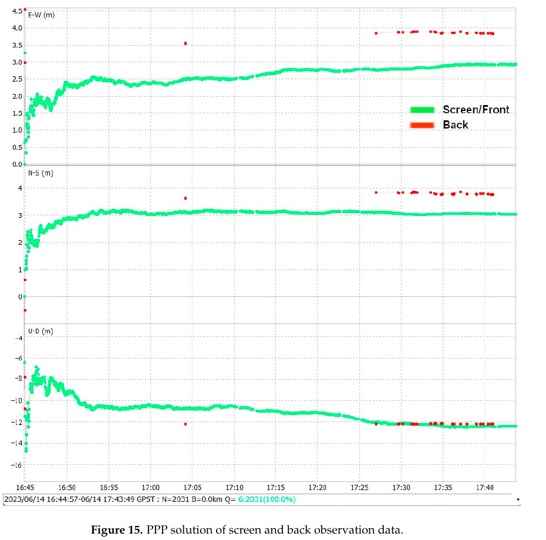
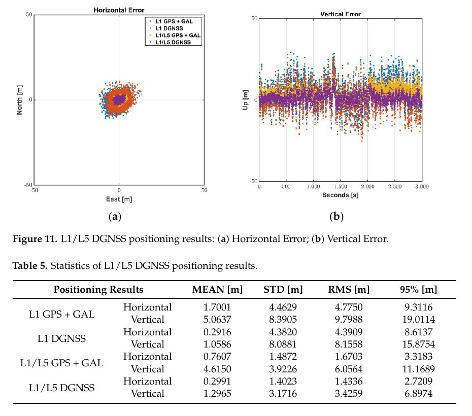
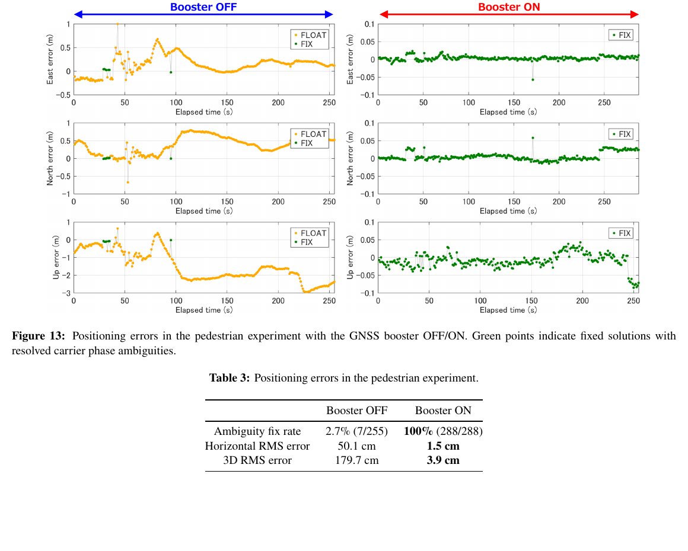

# 2026-09-23 GNSS 每日研究简报

## 今日快报

### 快报 1：太阳风直接驱动区域 TEC 预测，跨年残差范围不等于定位误差已受控

- 主题：`solar-wind-driven-indian-tec-neural-prediction`
- 来源 ID：`arxiv:2609.23732`
- 来源链接：https://arxiv.org/abs/2609.23732
- 发表日期：2026-09-20
- 来源类型：已获 Advances in Space Research 接收的作者预印本、印度低纬 TEC 神经网络预测
- 获取范围：13 页全文；2024 年训练/验证/测试划分、2025 年独立年份检验、网络输入与安静/磁暴案例已核对，期刊 DOI 尚未分配

**内容：** 模型不把 Kp、Ap、Dst 或 SYM-H 这类地磁响应指数作为输入，而使用 IMF $`B_z`$、太阳风速度与质子密度、F10.7 太阳射电通量，并以年积日和时刻的正余弦项表示周期。96 个隐藏神经元用 2024 年 15 min 分辨率 GIM TEC 训练，再对未参与训练的 2025 年做区域与单站检验。

**结论：** 2024 年内部划分给出 $`R^2\approx0.96`$、RMSE 5.37 TECU、MAE 3.77 TECU；2025 年多数安静与磁暴区域残差在 $`\pm10`$ TECU 内，但部分东北区域过估可达约 25 TECU。后两者是图上时空残差范围，不是统一的跨年 RMSE，更不是 GNSS 坐标误差；模型目标来自 GIM，单站 IGS-GPS TEC 与 GIM 还存在约 7–12 TECU 偏置。

**关注理由：** 把上游太阳风参数直接映射为区域电离层先验，有机会减少地磁指数发布延迟；工程接收机仍需把 TEC 预测误差投影到各卫星斜路径，并对极端磁暴和 EIA 梯度单独给出保护裕度。

### 快报 2：Pixel 8 不会因普通 SUPL_INIT 短信把位置发给攻击者，但结论只覆盖一套基带实现

- 主题：`pixel8-sms-supl-init-privacy-gates`
- 来源 ID：`arxiv:2609.22900`
- 来源链接：https://arxiv.org/abs/2609.22900
- 发表日期：2026-09-19
- 来源类型：安全研究预印本、Pixel 8 网络发起 SUPL 隐私评估
- 获取范围：9 页全文；OMA SUPL 规范、Broadcom `gpsd` 静态逆向、真实空口短信动态测试和强制绕过门控试验已核对，仅针对 Pixel 8 的 Samsung Exynos 基带与 Broadcom GNSS 组合

**内容：** 研究构造可携带服务器地址、请求无提示定位的 SUPL_INIT，经 WAP Push/SMS 实际送达手机，再把反编译控制流与运行时插桩对应。实现先检查手机是否正处于真实紧急呼叫；非紧急消息即使强制绕过门控，也忽略消息内服务器地址，连接设备配置的 `supl.google.com:7275` 或由 SIM 推导的标准 H-SLP。

**结论：** 在正常空闲状态，门控返回 DENY，后续会话与网络连接均未触发；强制门控为允许时，非紧急载荷仍没有控制目的服务器。紧急标志且手机已处于紧急呼叫时存在使用消息地址的代码路径，设备的紧急 APN 允许列表又未配置，但纯短信攻击者无法建立这一前置状态。结论不能外推到其他厂商 GNSS 守护进程、运营商配置或紧急呼叫链。

**关注理由：** A-GNSS 攻击面跨越短信、基带、GNSS vendor HAL 和 SUPL 服务器。接收机安全评估不应只审协议字段，还要验证真实实现中的状态门控、地址解析和运营商配置。

### 快报 3：RTK 负责找回移动母机，视觉与独立安全门才完成空中回收

- 主题：`rtk-vision-ppo-airborne-uav-recovery`
- 来源 ID：`arxiv:2609.20629`
- 来源链接：https://arxiv.org/abs/2609.20629
- 发表日期：2026-09-17
- 来源类型：机器人研究预印本、RTK 与视觉融合的空中母子无人机回收
- 获取范围：9 页全文；MuJoCo 随机化训练、PPO/PD 同条件仿真、14 次户外任务和失败分类已核对，尚非同行评审定稿

**内容：** 母子机各自保持 RTK-GNSS，母机持续广播当前位置供远程会合；接近回收甲板后，下视相机的标记相对位姿与 RTK 重叠工作。PPO 只管末段横向恢复，PX4 保留内环，位置、倾角、速度、视觉新鲜度和高度条件由与策略独立的确定性安全门决定是否下降。

**结论：** 2,000 个留出随机仿真中，PPO 成功率 99.55%、平面终端误差中位数 6.62 cm，同条件调参 PD 为 78.4%；14 次户外全任务成功 13 次（92.9%）。但仿真采用简化气动扰动，硬件仅一套子机，第二组母机移动试验缺少计量标定轨迹；这些结果证明系统级可行性，不等于 RTK 单独达到同样回收成功率。

**关注理由：** 这是很清楚的定位职责分层：RTK 提供全局连续相对位置，视觉收紧末端几何，安全门隔离学习策略风险。面向无人系统时，应按这一层次分别验收 GNSS 可用性、局部感知和接触安全。

### 快报 4：LEO PNT 对轨道 GNSS 的最坏干扰很短，结论来自厂商仿真而非在轨接收机

- 主题：`xona-pulsar-spaceborne-gnss-compatibility`
- 来源 ID：`arxiv:2609.17174`
- 来源链接：https://arxiv.org/abs/2609.17174
- 发表日期：2026-09-15
- 来源类型：ION GNSS+ 2026 作者预印本、Xona Pulsar 与星载 GNSS 兼容性分析
- 获取范围：10 页全文；ITU-R M.1831 改造、静态最坏界、258 星 48 h 动态传播和五种轨道倾角已核对，作者来自系统提供方且无独立在轨接收机试验

**内容：** 研究把面向地面 RNSS 用户的 ITU-R 兼容性框架扩展到 400–1000 km 星载用户，评估 Pulsar X1/X5 对 GPS L1/L5 与 Galileo E1/E5 的 $`C/N_0`$ 退化。动态最坏场景把 1,000 km 用户与 258 星完整星座以 1 s 步长传播 48 h，并对 0°–98° 五种用户倾角重算瞬时聚合干扰。

**结论：** 仿真中 400–900 km 高度退化有限；1,000 km 用户的 99 分位仍低于 3 dB、90 分位低于 1 dB。GPS L1 从未超过 1 dB；GPS L5 超过 3 dB 的事件低于 1%，且通常短于 20 s。静态上界不能说明事件频率，动态仿真也未覆盖天线制造偏差、接收机非线性或真实在轨异常。

**关注理由：** 新 LEO PNT 星座会从“邻频地面兼容”进入“同轨邻近几何兼容”。工程审查应同时看幅度分位与持续时间，而不能用单个最坏距离替代任务级失锁风险。

### 快报 5：Galileo SAS 首次闭合民用认证时间解，单星 20 ns 仍不是认证 PVT

- 主题：`galileo-sas-authenticated-snapshot-time`
- 来源 ID：`arxiv:2609.15824`
- 来源链接：https://arxiv.org/abs/2609.15824
- 发表日期：2026-09-14
- 来源类型：IEEE NAVICON 投稿预印本、Galileo Signal Authentication Service 快照时间解
- 获取范围：8 页全文；SAS/OSNMA 密钥链、快照接收机、E14/E18 五场景标定与误差统计已核对，SAS 尚未正式运营

**内容：** 接收机预下载重加密码序列 RECS，记录 E6-C 加密码 ECS 的短 RF 快照；E1-B 上 OSNMA 延迟披露并认证 TESLA 密钥后，解密 RECS，与快照相关得到认证伪距。由于目前 E14/E18 同轨相隔 180°、地面通常仅见一颗，已知天线坐标被用来把单条认证伪距转成接收机钟差。

**结论：** 五个静态场景用于四组标定和一组评估；合并估得硬件延迟 5.366 µs，扣除该常量后 E18 评估场景钟差 RMS 为 20.0 ns（等效 5.99 m）。论文还给出理想最小认证延迟 10 s、认证间隔 30 s。该原型证明了在轨民用认证码可生成时间解，但依赖地理已知、硬件预标定与实验 SDR，不能认证三维位置，也未消除转发/延迟攻击。

**关注理由：** OSNMA 认证导航数据，SAS 进一步认证测距码。两者组合让接收机能区分“比特是真的”与“到达时间也来自真实卫星”，但部署仍要处理认证时延、硬件延迟和多星可见性。

## 深度研读

### 深读 1｜低成本与手机｜从方向图到坐标序列：手机正反面为什么会改变可用观测

- 类别：`low-cost-mobile`
- 学习层级：`foundation`
- 选题定位：`经典基础`
- 来源 ID：`doi:10.3390/s24082569`
- 来源链接：https://doi.org/10.3390/s24082569
- 发表日期：2024-04-17
- 来源类型：Sensors 同行评审 CC BY 4.0 开放论文、Xiaomi Mi 8 天线暗室与实景测量
- 获取范围：开放 PDF/HTML 全文；拆机、VNA/暗室方向图、屏幕/背面观测、PPP Figure 15 与局限已核对
- 价值评分：96/100（相关性 20，经典价值 18，证据 19，教学价值 20，工程价值 19）

#### 为什么先学这个

手机定位算法常把每颗卫星的仰角和 $`C/N_0`$ 当作主要质量变量，却忽略机身本身就是天线的一部分。先把方向图、极化、姿态和接收功率连起来，才能理解为什么同一芯片、同一地点仅翻转手机就会改变观测连续性与 PPP 可用性。

#### 先修知识

需要理解 GNSS L1/L5、载噪密度比、自由空间路径损耗、天线增益与方向图、线极化/右旋圆极化、伪距和载波相位、PPP、相位中心。$`C/N_0`$ 高不自动等于无多路径，能输出 PPP 解也不等于坐标正确。

#### 一句话逻辑

先拆机定位 L1/L5 天线，再用暗室 VNA 扫描不同入射方向，最后把手机屏幕朝天与背面朝天的真实 GNSS 数据送入 PPP，观察天线方向性如何传到观测和坐标序列。

#### 研究问题与约束

对象只有 Xiaomi Mi 8；暗室用近距离发射天线和机械转台模拟入射角，实景部分在单一开阔场景采集。论文把接收功率写成相对“建议最低功率低 25%”，但 dBW 为对数量，不能直接当线性百分比解释。Figure 15 的绝对坐标偏差还混合了参考点/相位中心设置、模型与初始化，不能全部归因于朝向。

#### 核心方法论

VNA 先识别机内天线谐振频段，确认 L1/E1/B1 与 L5/E5a/B2a 天线位于屏幕上端；暗室让手机相对发射源改变高度、方位和正反面，形成 L1/L5 方向图。实景同时比较屏幕朝卫星和背面朝卫星时的可见星、SNR 与 PPP 输出，并把机身姿态作为实验变量而非噪声。

#### 关键公式逐步推导

自由空间链路的接收功率为：

```math
P_r=P_tG_tG_r\left(\frac{\lambda}{4\pi R}\right)^2.
```

改成 dB 形式：

```math
P_{r,\mathrm{dBW}}=P_{t,\mathrm{dBW}}+G_{t,\mathrm{dB}}+G_{r,\mathrm{dB}}-20\log_{10}\frac{4\pi R}{\lambda}.
```

手机翻面不会改变卫星的 $`P_t`$、$`R`$ 或 $`\lambda`$，主要改变入射方向对应的 $`G_r(\mathrm{az},\mathrm{el},\mathrm{pose})`$、极化失配和机身遮挡；这些变化再进入 $`C/N_0`$、跟踪连续性和观测权重。

#### 经典价值与创新边界

经典价值是把“手机天线差”拆成可测的频段位置、方向图、功率和姿态效应。创新是将暗室表征与同机真实 PPP 序列串起来。边界是单机型、单场地、静态短试验，且低成本天线和机壳设计代际变化快。

#### 整体逻辑链

拆机定位天线；VNA 验证频段；暗室旋转手机；得到 L1/L5 方向图；设置屏幕/背面两种朝向；比较卫星数与 SNR；运行 PPP；检查历元保留和坐标序列；把差异回溯到姿态相关接收增益。

#### 原文图表与结果分析



> 图表源：Zabala Haro 等《Comprehensive Analysis of Xiaomi Mi 8 GNSS Antenna Performance》Figure 15，[开放全文](https://doi.org/10.3390/s24082569)。CC BY 4.0；由出版社 PDF 第 19 页 160 dpi 渲染后仅裁去页眉、正文与页边空白，曲线、坐标轴、图例、数值和图注未修改。

横轴为 GPST 时刻，三幅纵轴依次是 E-W、N-S、U-D（m）；绿色为屏幕朝天，红色为背面朝天。背面工况只有 37 个处理历元，论文称丢失 99% 数据；图上红点稀疏且与绿序列在水平分量有约米级差异。绿色序列本身也有明显起始收敛和垂向漂移，因此该图证明的是姿态强烈影响可用性，不证明屏幕朝天就已得到无偏真值。

#### 原文结果论述

论文报告 L1/L5 都表现出低指向性的近全向方向图，但主瓣和平均接收功率随机身正反面与入射角改变。屏幕朝卫星时 L5 可见性和 SNR 更好；背面工况 PPP 仅保留 37 历元。作者据此建议高精度采集时手机水平放置、屏幕对天。该建议是此机型与实验条件下的工程经验，不是 Android 设备统一规范。

#### 常见误区与适用边界

第一，把手机“全向”理解成各方向等增益。第二，只按卫星仰角定权而忽略机身姿态。第三，把 dBW 差直接换成百分比。第四，把背面少量 PPP 点当成同等样本。第五，把坐标偏移全归因于天线，而忽略相位中心与初始化。第六，把单台 Mi 8 结果外推到其他天线布局。

#### 工程实现步骤

1. 为每款设备记录屏幕法向、充电口方向和天线大致位置。
2. 静态旋转采集建立 $`C/N_0`$—方位—仰角—姿态查找表。
3. 同时统计码噪声、相位连续性、周跳和可见星数。
4. 将姿态项加入观测方差模型，不只用仰角权。
5. 对 PPP/RTK 分别验收收敛时间、固定率与外部坐标误差。
6. 对系统升级、保护壳和握持方式重新标定。

#### 复现实验设计

选 Mi 8、Pixel 与三星各两台，四种朝向加四种握持方式，在转台上每 15° 采集 30 min，连续三天重复。以同址测量天线作独立参考；指标为逐频 $`C/N_0`$、MP 组合 RMS、相位周跳/千历元、可用率、PPP 95 分位与 RTK 固定率。基线包括仅仰角权、仰角+$`C/N_0`$ 权和加入姿态查表权。失败条件是姿态模型在跨设备或跨日测试集使误差尾部变差。

#### 与定位及低成本实现的联系

本节说明手机原始观测质量由硬件姿态条件化。下一节不追求不稳定的载波固定，而用更抗多路径的 L5 码、已有 L1 差分改正和 Doppler 滤波，先构造可部署的米级方案。

#### 本节小结

手机朝向不是 UI 细节，而是进入接收增益、观测连续性与坐标可用率的测量条件。

### 深读 2｜低成本与手机｜从 L1 改正到 L5 观测：怎样不新建基站也让手机双频码差分工作

- 类别：`low-cost-mobile`
- 学习层级：`intermediate`
- 选题定位：`基础进阶`
- 来源 ID：`doi:10.3390/s22249879`
- 来源链接：https://doi.org/10.3390/s22249879
- 发表日期：2022-12-15
- 来源类型：Sensors 同行评审 CC BY 4.0 开放论文、Android 双频观测边界与 DGNSS/Doppler 方案
- 获取范围：开放 PDF/HTML 全文；GNSS 中继对照、L1/L5 多路径统计、SBAS 电离层换频、50 min 屋顶试验、Figure 11/Table 5 已核对
- 价值评分：97/100（相关性 20，经典价值 19，证据 19，教学价值 20，工程价值 19）

#### 为什么先学这个

上一节看到手机天线让载波相位频繁中断。与其直接假设 RTK 能稳定定整，本节先问更现实的问题：L5 码噪声和多路径较小，但现有 DGNSS 常只播 L1 改正，用户能否利用 L1 PRC/RRC 与 SBAS 电离层格网在端侧生成 L5 改正？

#### 先修知识

需要理解伪距、载波相位与 Doppler，PRC/RRC，参考站差分，电离层一阶延迟与频率平方反比，SBAS 电离层格网、GPS/Galileo 多星座、DOP、卡尔曼滤波和码多路径组合。DGNSS 的米级稳健性与载波 RTK 的厘米级潜力是不同目标。

#### 一句话逻辑

用 L1 基站改正消去共同钟轨/大气误差，再以 SBAS 给出的 L1 电离层改正按频率平方缩放到 L5，端侧合成 L5 PRC/RRC，并用 L1 几何、L5 低噪声和 Doppler 动力学共同稳定手机位置。

#### 研究问题与约束

实验是 2019 年首代双频 Mi 8 的 50 min 静态屋顶数据，截止仰角 20°、SNR 门限 20 dB-Hz；参考基础设施和 MSAS 格网具有地区与年代特征。论文的载波 RTK 失败说明该设备/配置的限制，不证明所有现代手机无法 RTK；最终 DGNSS 数字也只来自一次短静态会话。

#### 核心方法论

先用 GNSS 中继加测量天线与手机内置天线同步对照，分离天线造成的码/相位噪声；再以码减相位组合比较低仰角 L1/L5 多路径。定位端保留多星座 L1 来维持几何，加入 L5 观测；L1 PRC/RRC 来自既有基站，L5 的频散差由 SBAS 电离层项补偿，最后以位置、速度、钟差/漂移和频间偏差状态的滤波器处理码与 Doppler。

#### 关键公式逐步推导

L1 参考站伪距改正近似为：

```math
\mathrm{PRC}_{L1}\approx-T-I_{L1}-\delta R.
```

一阶电离层延迟满足 $`I\propto f^{-2}`$，故：

```math
I_{L5}=\gamma I_{L1},\qquad \gamma=\left(\frac{f_{L1}}{f_{L5}}\right)^2.
```

在用户端把 L1 改正换频：

```math
\mathrm{PRC}_{L5}=\mathrm{PRC}_{L1}-(\gamma-1)\,\mathrm{IC}_{L1},
```

其中 $`\mathrm{IC}_{L1}`$ 由 SBAS 穿刺点格网生成。校正后：

```math
P^{s}_{u,L5,\mathrm{corr}}=P^{s}_{u,L5}+\mathrm{PRC}_{L5}
\approx \rho^s_u-b^s+B_u+\varepsilon_P.
```

这不会消除手机本地多路径，但能在不增设 L5 参考站的条件下闭合共同误差。

#### 经典价值与创新边界

经典价值是把频散规律转成与既有 L1/SBAS 基础设施兼容的换频改正。创新是面向手机的 L1 几何、L5 码质量和 Doppler 滤波组合。边界是 SBAS 格网误差、基线空间失相关、本地多路径和频间硬件偏差仍需建模，且结论不含动态城市峡谷。

#### 整体逻辑链

中继对照识别天线噪声；验证关闭 duty cycle 仍有周跳；用码减相位比较 L1/L5；保留 L1 多星座几何；读取 L1 PRC/RRC；从 SBAS 求 L1 电离层改正；按频率平方合成 L5 改正；校正 L1/L5 码和 Doppler；滤波输出坐标；与四种配置比较。

#### 原文图表与结果分析



> 图表源：Yun 等《Inherent Limitations of Smartphone GNSS Positioning and Effective Methods to Increase the Accuracy Utilizing Dual-Frequency Measurements》Figure 11 与 Table 5，[开放全文](https://doi.org/10.3390/s22249879)。CC BY 4.0；由出版社 PDF 第 14 页 160 dpi 渲染后裁取原始图表，未修改轴、图例、点、表格数值或图注。

左图为东—北水平误差（m），右图为垂向误差随 0–3,000 s 变化；表格依次给 L1 GPS+Galileo 单点、L1 DGNSS、L1/L5 单点和 L1/L5 DGNSS 的均值、STD、RMS、95%。L1/L5 DGNSS 水平 RMS 1.4336 m、95% 2.7209 m，垂向 RMS 3.4259 m、95% 6.8974 m；优于 L1 DGNSS 的 4.3909 m 与 8.1558 m RMS。图也显示残差仍有长尾，不能称为车道级或厘米级。

#### 原文结果论述

两颗低仰角多路径卫星的 L1 码组合 RMS 约 3.4 m、95% 约 6.5 m，L5 RMS 约 1.4–1.5 m、95% 约 2.94 m；L5 最大误差约 4.7–5.4 m，较 L1 最大值小约 60%–70%。50 min 会话中，合成 L5 改正加多频多星座把水平 95% 降到 2.7209 m；进一步 Doppler 卡尔曼滤波的论文汇总称水平/垂向 RMS 约 1.2/2.3 m。后者不是图表中未滤波 DGNSS 的同一统计层。

#### 常见误区与适用边界

第一，把 L5 低多路径等同于永远更准。第二，只用 L5 而忽略可见星不足和 DOP。第三，把 L1 PRC 直接加到 L5，漏掉电离层频散差。第四，认为关闭 duty cycle 就能恢复测量天线级载波。第五，把短静态 RMS 外推到城市动态。第六，混用未滤波与滤波后的指标。

#### 工程实现步骤

1. 解析 RTCM L1 PRC/RRC 与 SBAS 电离层格网。
2. 为各星计算穿刺点和 $`\mathrm{IC}_{L1}`$。
3. 按频率比生成 L5 PRC/RRC，并估计 GPS/Galileo 钟差与频间偏差。
4. 以 L1 保证几何，以 L5 提高码质量，设置逐频噪声模型。
5. 用 Doppler 约束速度与钟漂，检测异常而非依赖不连续载波相位。
6. 输出水平/垂向分位数、DOP 与改正龄期。
7. 在动态与遮挡场景重新校准。

#### 复现实验设计

在开阔、树荫、街道三场景各跑 20 条 30 min 轨迹，至少三款双频手机；比较 L1 单点、L1 DGNSS、L1/L5 单点、直接复用 L1 PRC、SBAS 换频 L1/L5 DGNSS，以及加 Doppler 滤波六组。以独立测量级 RTK/INS 为真值；指标含可用率、H/V 50/95/99 分位、码 MP RMS、改正龄期敏感度和计算量。若加入 L5 后 99 分位或失解率变坏，即判失败。

#### 与定位及低成本实现的联系

本节给出不改硬件时较稳健的米级路线。下一节反向选择改造信号入口：用外置圆极化接收天线和近距离重辐射把高质量信号送回内置接收机，目标从码差分推进到动态载波定整。

#### 本节小结

双频手机要先闭合“改正可用性—几何—本地噪声”三角，L5 本身不是精度保证。

### 深读 3｜纯 GNSS 定位｜从内置天线到厘米步行：零距离重辐射怎样把手机载波变成可固定观测

- 类别：`positioning`
- 学习层级：`advanced`
- 选题定位：`定位深入`
- 来源 ID：`doi:10.33012/2026.20630`
- 来源链接：https://doi.org/10.33012/2026.20630
- 发表日期：2026-05-04
- 来源类型：ION 2026 Pacific PNT 会议论文与 2026-09-20 作者预印本、便携手机 GNSS 重辐射器
- 获取范围：13 页作者全文；硬件、静态与 200 m 步行试验、RTKLIB Explorer PPK、Figure 13/Table 3 已核对，图表按非开放授权文献的最小研究评论范围引用
- 价值评分：98/100（相关性 20，经典价值 19，证据 20，教学价值 19，工程价值 20）

#### 为什么先学这个

前两节分别说明天线姿态是误差源、纯软件双频码差分仍停在米级。本节把问题定位到 RF 入口：保留手机芯片与内置天线，但用高质量右旋圆极化天线接收、放大，再在手机背部极近距离重辐射，尝试同时改善信号强度、多路径极化和相位中心变化。

#### 先修知识

需要理解 RHCP/LHCP、LNA、近场重辐射、SNR、码多路径组合、载波周跳、单差/双差、整周模糊度、PPK/RTK、固定解与浮点解、RMS。还要区分“手机输出坐标”与“被估计的位置”：使用 booster 后，解对应外置接收天线相位中心。

#### 一句话逻辑

让圆极化有源天线先获得干净强信号，经 33 dB LNA 送到贴近手机的无源贴片重辐射，使内置接收机看到方向统一、强度更高的信号，再以同一 PPK 引擎比较开关前后的周跳、固定率与外部参考误差。

#### 研究问题与约束

原型不含有源天线时约 70×70×15 mm、95 g，不再是纯手机形态；重辐射链引入延迟、供电和法规问题。步行仅在开阔 200 m 环道、约 1.5 m/s、1 Hz、先关后开各两圈，环境与时间没有随机交叉；PPK 使用 RTKLIB Explorer 默认参数，尚未在手机或云端实现实时 RTK，也未验证城市峡谷。

#### 核心方法论

有源螺旋天线接收 RHCP GNSS 并抑制典型 LHCP 反射，LNA 放大后由贴在手机背部的无源贴片向内置线极化天线发射。由于各卫星信号在手机端都从同一重辐射天线方向到达，内置天线的卫星方向相关 PCV 影响近似变为公共几何；强信号减少热噪声和动态周跳。实验保持软件解算器一致，只切换 booster，观察因果链是否闭合。

#### 关键公式逐步推导

普通载波相位以米表示为：

```math
\Phi^s_r=\rho^s_r+c(\delta t_r-\delta t^s)+T^s_r-I^s_r+\lambda N^s_r+b^s_r+\varepsilon^s_\Phi.
```

重辐射链增加近似公共延迟 $`\delta_{rr}`$ 与残余稳定性误差 $`\eta^s_{rr}`$：

```math
\Phi^{s,\mathrm{boost}}_r=\Phi^s_r+\delta_{rr}+\eta^s_{rr}.
```

同一历元作卫星双差后，稳定公共项随接收机钟差一起消除：

```math
\nabla\Delta\Phi=\nabla\Delta\rho+\lambda\nabla\Delta N-\nabla\Delta I+\nabla\Delta T+\nabla\Delta\eta_{rr}+\varepsilon.
```

系统收益不是创造新观测，而是让 $`\varepsilon`$、周跳率与方向相关 $`\eta_{rr}`$ 足够小，使整数 $`\nabla\Delta N`$ 可以稳定验收。

#### 经典价值与创新边界

经典价值是把天线增益、极化、多路径、PCV、周跳和模糊度固定连成一条可测链。创新是零距离、可携带重辐射器在步行条件下仍使用手机内置 GNSS。边界是附加硬件改变了系统定义，结果为单机、单场地、顺序开关和后处理；它不能证明裸机手机已经具备同等能力。

#### 整体逻辑链

构建有源接收天线—LNA—无源重辐射贴片；贴附手机；静态开关验证 L1/L5 SNR、码多路径与周跳；用相同 PPK 比较固定率；再在 200 m 环道先关后开各走两圈；以分路连接的商业 GNSS 接收机作参考；统计固定率和 ENU/RMS；检查收益是否从 RF 一直传到坐标。

#### 原文图表与结果分析



> 图表源：Suzuki《Smartphone GNSS Booster: Centimeter-Level Pedestrian Positioning Using a Portable Signal Re-Radiator》Figure 13 与 Table 3，[作者预印本](https://arxiv.org/abs/2609.23456)，正式会议记录 DOI [10.33012/2026.20630](https://doi.org/10.33012/2026.20630)。由作者 PDF 第 11 页 160 dpi 渲染后作最小裁切用于研究评论；坐标轴、颜色、点、数值和图注未修改，不主张再分发授权。

左列 booster 关闭、右列开启；三行是东、北、上误差（m），注意左右纵轴量级不同：关闭为约 $`\pm1`$ 至 -3 m，开启为约 $`\pm0.1`$ m。绿色是固定解、橙色是浮点解。表中关闭时固定率 2.7%（7/255）、水平/三维 RMS 50.1/179.7 cm；开启后 100%（288/288）、1.5/3.9 cm。顺序试验且样本历元不同，不能把比值当作跨场景普遍提升倍数。

#### 原文结果论述

静态切换时，GPS L1 平均 SNR 由 40.2 增至 46.1 dB-Hz，L5 由 32.1 增至 43.4 dB-Hz；码多路径 RMS 分别由 1.91 降至 1.60 m、1.94 降至 0.91 m，600/600 历元全部固定。步行时周跳由 2,286 次降至 310 次（论文称减少 86%），最终得到图示固定率与 RMS。所有数字属于该原型和开阔实验。

#### 常见误区与适用边界

第一，把 booster 结果称为裸机性能。第二，忽略解算位置已变为外置天线相位中心。第三，认为放大器增益越大越好，忽略饱和、自激和邻频。第四，把固定率当正确率而不验外部真值。第五，忽略开关顺序、卫星几何和短轨迹。第六，把 PPK 默认参数结果当实时 RTK。第七，忽略重辐射设备的无线电合规。

#### 工程实现步骤

1. 选择低 PCV 的双频 RHCP 有源天线并测量带内增益、噪声系数与群时延。
2. 设计屏蔽、滤波、LNA 与近距离贴片，限制泄漏和自激。
3. 用频谱仪验证手机口处功率不饱和，并分别标定 L1/L5。
4. 固定接收天线相位中心与手机坐标系关系。
5. 实时监控 SNR、AGC、周跳、码多路径和创新残差。
6. 只有 ratio/残差/基线长度等验证同时通过才接受整数解。
7. 加入断电、遮挡、人体近场和城市反射降级模式。
8. 完成地区法规与设备共存测试后再外场部署。

#### 复现实验设计

对三款手机采用随机交叉 AB/BA 试验：开阔、树荫、街谷各 20 条 500 m 步行轨迹，速度 0.8/1.5/2.0 m/s，booster 开关顺序随机；同一测量天线经分路器给独立接收机作厘米真值。基线包括裸机 PPK、金属地板、booster PPK 和实时 RTK。指标为逐频 SNR、AGC、码 MP RMS、周跳/千历元、固定率、错误固定率、H/V 50/95/99 分位、功耗和泄漏场强。若固定率升高但错误固定或 99 分位恶化，即判失败。

#### 与定位及低成本实现的联系

这条路线把高精度瓶颈从昂贵接收机转移到可附加 RF 前端：仍复用手机芯片、系统 API 与计算平台，却不再假设内置线极化天线能承担厘米级载波观测。产品化关键将是小型化、实时解算、独立真值和合规，而不是再优化一个离线滤波器。

#### 本节小结

厘米级步行结果来自“先修复信号入口，再做整数固定”；它证明了一条系统路线，而不是宣告所有手机已自然达到厘米级。
