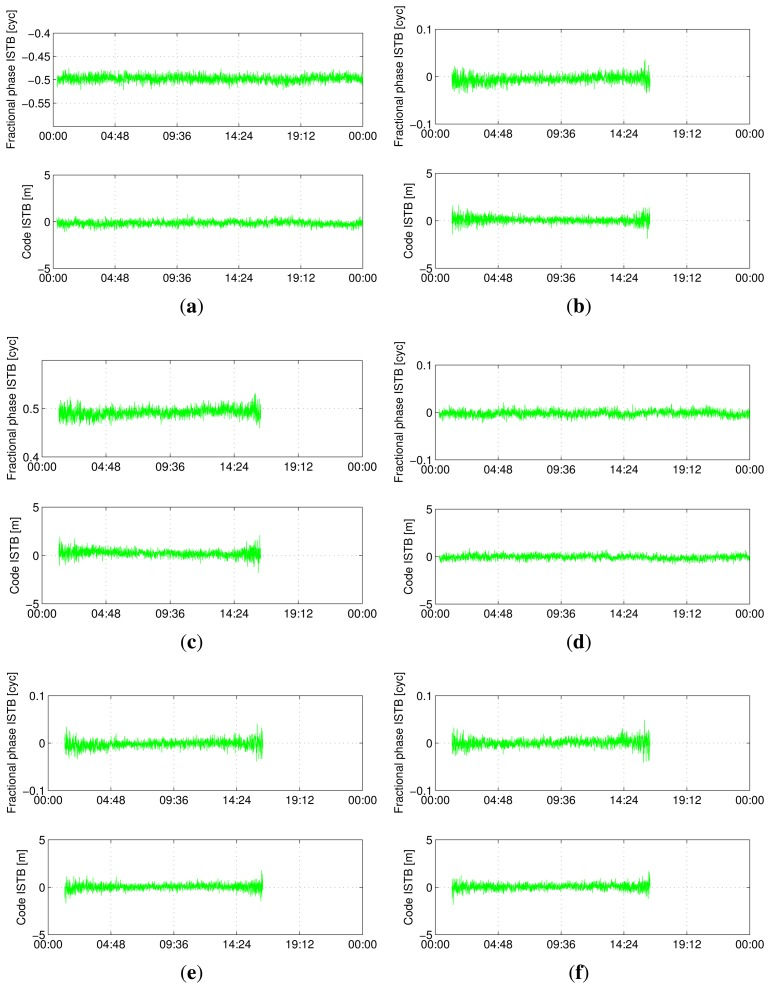
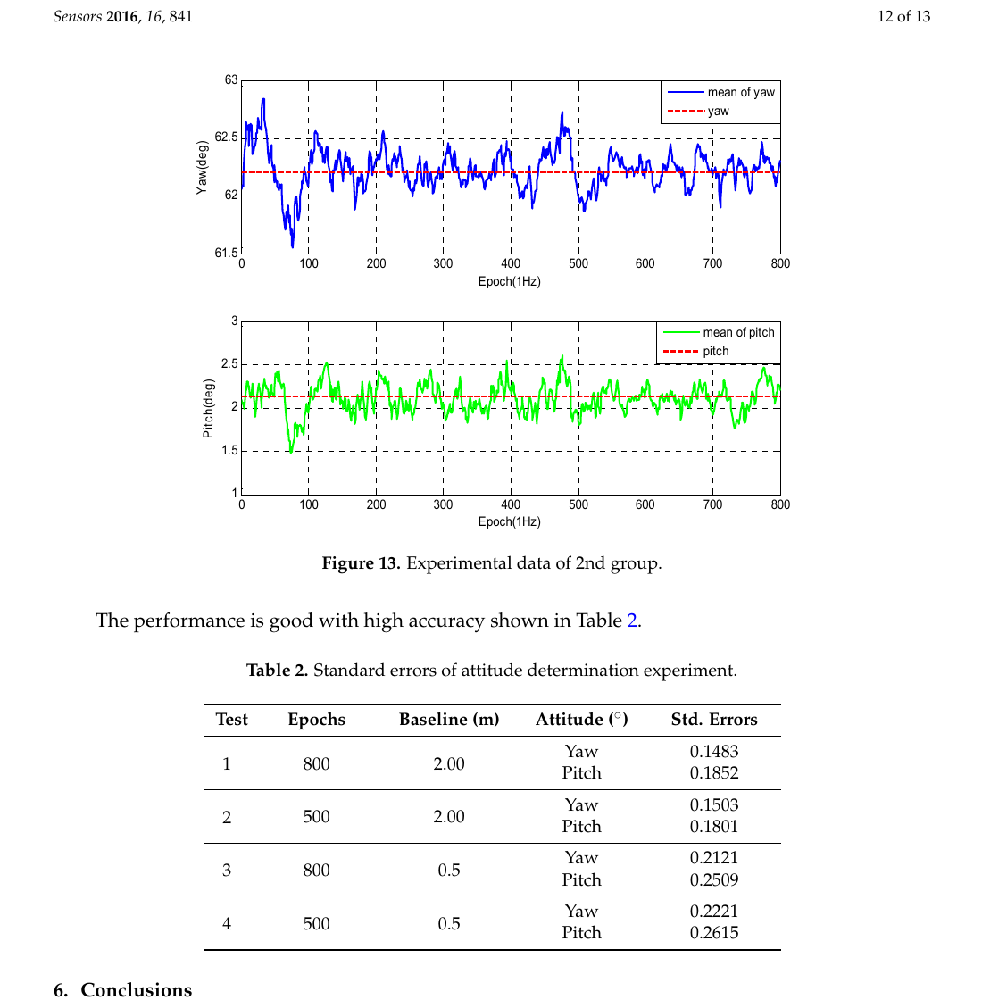
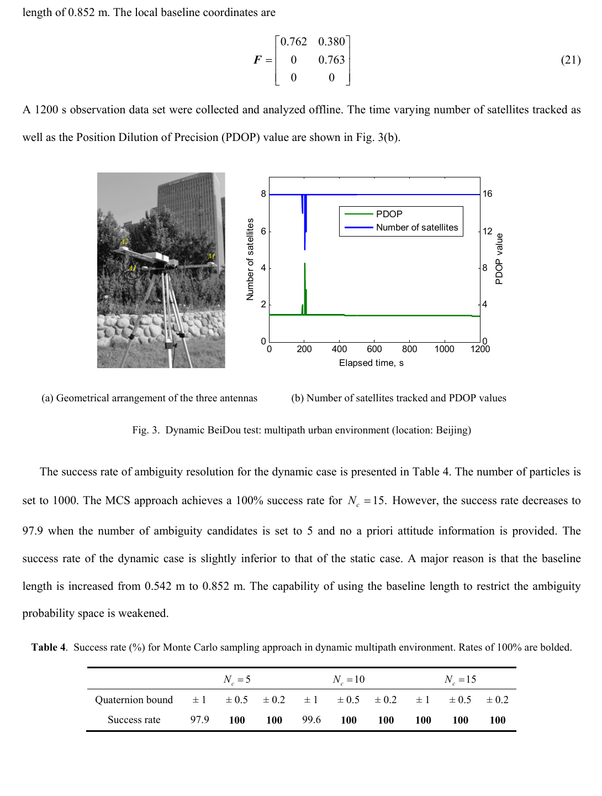

# 2026-09-24 GNSS 每日研究简报

## 今日快报

### 快报 1：高纬电离层变化超过 5 cm/s 时，传统周跳门限可能把扰动当故障

- 主题：`high-latitude-gifc-cycle-slip-detection`
- 来源 ID：`ion:gnss2026-17193`
- 来源链接：https://www.ion.org/gnss/abstracts.cfm?paperID=17193
- 发表日期：2026-09-18
- 来源类型：ION GNSS+ 2026 官方扩展摘要、高纬电离层扰动下的载波周跳检测研究
- 获取范围：公开扩展摘要；GIFC 主检测量、互补检测、DDIF 连续定位方案、仿真注错与 2015 年阿拉斯加 Poker Flat 磁暴日数据范围已核对，未公开检出率、误警率与修复误差表

**内容：** 许多周跳检测器默认电离层延迟变化率可忽略；摘要指出在严重高纬扰动中，变化率超过 5 cm/s 时，这个假设会产生频繁误警。作者以几何无关组合（GIFC）检测主周跳，再用互补算法覆盖 GIFC 不敏感的周跳对，并建议用双差无电离层（DDIF）观测维持连续精密定位。

**结论：** 公开页说明算法已在人工插入周跳的数据和 2015 年磁暴日 Poker Flat 实测数据上验证，但没有给出检测概率、误警率、修复成功率或位置连续性数值。因此证据支持“针对高纬快速电离层变化重写了检测链”，不支持“已经量化优于所有现有方法”。

**关注理由：** 周跳检测是整数固定之前的输入完整性门。接收机若只用安静电离层标定门限，磁暴时可能在“漏检真周跳”和“误报真实电离层变化”之间同时失守。

### 快报 2：冻结更新可让阶跃相位故障不再被滤波状态逐渐吞掉

- 主题：`frozen-kalman-dd-phase-jump-monitoring`
- 来源 ID：`ion:gnss2026-16885`
- 来源链接：https://www.ion.org/gnss/abstracts.cfm?paperID=16885
- 发表日期：2026-09-18
- 来源类型：ION GNSS+ 2026 官方扩展摘要、抗干扰阵列引起双差载波跳变的完整性监测
- 获取范围：公开扩展摘要；冻结更新、Kalman 三差统计量、加权滑窗噪声跟踪与真实多接收机抗干扰阵列数据的初步结果已核对，未公开样本规模和误警统计

**内容：** 空时自适应处理（STAP）的波束切换和权值更新会给双差载波相位引入脉冲或持续阶跃。普通三差法会在故障起止各出现峰值，标准 Kalman 创新又会因状态被污染而让告警逐渐消失。本文在首次检出后冻结滤波更新，用 Kalman 三差单脉冲标记起点，并由加权滑窗跟踪不同基线的噪声。

**结论：** 摘要称初步真实数据试验对持续阶跃实现了 100% 时间覆盖，直到故障消失或系统复位；这是一项“故障区间是否一直被覆盖”的指标，不等于 100% 正确分类。由于公开页没有给出正常数据时长、误警率和故障幅度分布，不能据此断言已满足航空完整性风险要求。

**关注理由：** 递推滤波器最危险的故障不一定是最大跳变，而是能被状态慢慢吸收的偏差。冻结策略把“继续导航”和“继续学习状态”拆开，适合阵列接收机的相位完整性隔离。

### 快报 3：Jetson 以 FP16 和统一内存实时合成 20 通道、40.92 MSPS 双频点信号

- 主题：`jetson-gpu-realtime-gnss-simulator`
- 来源 ID：`ion:gnss2026-16854`
- 来源链接：https://www.ion.org/gnss/abstracts.cfm?paperID=16854
- 发表日期：2026-09-18
- 来源类型：ION GNSS+ 2026 官方扩展摘要、嵌入式 GPU 实时 GNSS 信号模拟器
- 获取范围：公开扩展摘要；并行任务拆分、FP16、查表调制、Jetson 统一内存及最终吞吐已核对，未公开射频一致性、伪距误差或功耗数据

**内容：** 系统把导航数据、扩频调制、载波调制和数据搬运分别映射到 Jetson 的 CPU/GPU 资源；耗时最大的扩频与载波调制采用查表和内存优化，CPU—GPU 间则用统一内存交叉访问，避免重复拷贝。作者在保持其设定精度的前提下引入 FP16 以降低带宽压力。

**结论：** 摘要报告在 40.92 MSPS 下实时生成 20 通道 BDS B1I 与 GPS L1 C/A 复合频点信号。这证明了基带吞吐，不证明输出信号已达到校准级模拟器的码相位、载波相位和功率一致性；公开页也没有与台式模拟器的误差或功耗对照。

**关注理由：** 可携式硬件在环测试需要的不只是“能生成波形”，还要把通道数、采样率、延迟和数值精度同时闭合。该架构为低成本回归测试提供了明确算力基线。

### 快报 4：开源 B1C 生成器已被 SDR 捕获跟踪，商用接收机验收仍是计划项

- 主题：`open-bds3-b1c-sdr-simulator`
- 来源 ID：`ion:gnss2026-16888`
- 来源链接：https://www.ion.org/gnss/abstracts.cfm?paperID=16888
- 发表日期：2026-09-18
- 来源类型：ION GNSS+ 2026 官方扩展摘要、BDS-3 B1C 开源信号生成工具
- 获取范围：公开扩展摘要；B-CNAV1、主/副码、伪距、码相位/载波/Doppler 与 QMBOC 模块、CU-SDR-Collection 验证已核对，公开页未给代码仓库地址和位置误差数值

**内容：** Beidou-SDR-SIM 可从离线导航比特与北斗时，或从公开 RINEX 星历自行生成 B-CNAV1；随后计算可见星与伪距，更新码相位、载波相位和 Doppler，并合成数据/导频 QMBOC I/Q。它支持静态位置和动态轨迹，也可保存基带或交给 SDR 实时发射。

**结论：** 作者用 CU-SDR-Collection 成功捕获、跟踪并解出位置，称可见星和 DOP 符合预期、坐标接近预设点；但摘要未给误差、运行时或代码仓库版本。PC+USRP B210 对商用 B1C 接收机的实时测试以及正式开源发布仍写作后续计划，不能把“拟开放”表述成“仓库已可复现”。

**关注理由：** B1C 的 QMBOC 和导频/数据结构让自研接收机测试门槛高。一个可审计的信号生成器能把 ICD 一致性、捕获跟踪和 PVT 回归串起来，但最终还需商用接收机与射频标定闭环。

### 快报 5：城市欺骗数据把多路径、遮挡与同步拖曳放进同一条 IF 证据链

- 主题：`urban-gnss-spoofing-if-dataset`
- 来源 ID：`ion:gnss2026-16974`
- 来源链接：https://www.ion.org/gnss/abstracts.cfm?paperID=16974
- 发表日期：2026-09-18
- 来源类型：ION GNSS+ 2026 官方扩展摘要、城市 GNSS 欺骗开放数据集与基准计划
- 获取范围：公开扩展摘要全文；真实城市干净信号、屏蔽室欺骗注入、IF 记录、射线追踪标签、SPAN-CPT 真值及两组初步场景已核对，完整数据集扩展和统一基准仍在进行

**内容：** 数据链分别记录干净真实 GPS L1、欺骗信号和二者合成 IF，并给出欺骗存在、多路径/NLOS、遮挡及厘米级参考轨迹标签。真实城市传播由行人与车辆采集，欺骗发射和合成记录在 RF 屏蔽环境中完成；因此它模拟的是可控攻击叠加真实城市背景，而不是在公共道路实际辐射欺骗。

**结论：** 两个初步场景均约在 40 s 注入，约 60 s 出现可见拖曳；车辆场景的 PRN 5 约在 50 s 和 70 s 遮挡，Doppler 异常会抬高误警风险。摘要称接收机在不失锁时逐渐被拉向假轨迹，但完整检测概率、误警率、恢复时间和仓库版本仍属后续工作。

**关注理由：** 只在 TEXBAT 式干净数据上调出的检测器，可能把城市遮挡当攻击，或把同步拖曳当普通多路径。逐层 IF 与真值标签让信号、量测和位置域方法能够在同一事件上比较。

## 深度研读

### 深读 1｜接收机工程｜半周不是整数：混合接收机为何会让 BDS 双差定姿整周失效

- 类别：`receiver-engineering`
- 学习层级：`foundation`
- 选题定位：`经典基础`
- 来源 ID：`doi:10.3390/s130709435`
- 来源链接：https://doi.org/10.3390/s130709435
- 发表日期：2013-07-22
- 来源类型：Sensors 同行评审 CC BY 3.0 开放论文、BDS-2 GEO/IGSO/MEO 类型间偏差与混合接收机定姿
- 获取范围：开放 HTML 全文；零基线/短基线试验、扩展观测模型、Figure 9、Tables 8–11 与结论已核对
- 价值评分：96/100（相关性 20，经典价值 19，证据 20，教学价值 19，工程价值 18）

#### 为什么先学这个

双差常被简化成“钟差和共同大气都消掉，剩下几何加整数”。这只在接收机量测定义相容时成立。早期 BDS-2 同时包含 GEO、IGSO、MEO；不同厂商对不同卫星类型的相位提取可能相差半周。若把这项硬件偏差硬塞进整数，后面的基线约束和姿态算法再强也会在错误格点上搜索。

#### 先修知识

需要理解载波相位、接收机间单差、星间双差、整周模糊度、零基线、GEO/IGSO/MEO、LAMBDA/C-LAMBDA、基线长度约束、航向角与高度角。零基线用于隔离接收机偏差，不代表最终定姿也是零基线。

#### 一句话逻辑

先用同天线分路的异构接收机估出卫星类型间偏差，再从双差载波中扣除；只有让剩余模糊度恢复整数性，基线约束 C-LAMBDA 才能可靠输出瞬时姿态。

#### 研究问题与约束

研究对象是 2013 年亚太可见的区域 BDS-2 星座，使用 Trimble、Septentrio 和 Javad 接收机，在 Curtin 阵列与 Kalamunda 做零基线、短基线试验。偏差被认为对给定接收机—天线连接和运行环境稳定；该假设不能自动外推到固件更新、重启、温度循环或现代 BDS-3 信号。

#### 核心方法论

作者在经典双差模型中加入 GEO、IGSO、MEO 类型对的码/相位 ISTB 状态，比较三条路线：忽略 ISTB；扩展模型联估 ISTB；先标定 ISTB，再回到经典双差。扩展模型能保真但减少冗余；预标定后再改正既保留整数维度，也保留经典模型强度。C-LAMBDA 同时约束模糊度与已知基线长度。

#### 关键公式逐步推导

把全部双差观测堆叠为：

```math
E(y)=Az+Gb+Hh,
\qquad z\in\mathbb Z^k,
\quad b\in\mathbb R^3.
```

其中 $`z`$ 是整周模糊度，$`b`$ 是天线基线，$`h`$ 是接收机相关的类型间偏差，$`H`$ 指示每条观测属于哪一卫星类型对。定姿再加入刚性几何：

```math
\lVert b\rVert=l.
```

若已有零基线标定 $`\hat h`$，则先形成：

```math
\tilde y=y-H\hat h,
\qquad E(\tilde y)=Az+Gb,
```

再运行 C-LAMBDA。若 $`h`$ 含半周而被忽略，$`z`$ 不再落在正确整数格点，长度约束无法替代偏差校准。

#### 经典价值与创新边界

经典价值是把“异构接收机不能直接混用”落实成可估状态，并证明偏差会让整周固定从成功骤降到完全失败。创新边界是 BDS-2 早期区域星座和三类接收机；今天应继承的是校准与整数性审计方法，而不是原偏差数值。

#### 整体逻辑链

同天线分路采集异构接收机数据；按卫星类型构造双差；估计码与相位 ISTB；检查跨天、跨场地稳定性；在短基线定姿中分别忽略、联估和预改正；用已知坐标重构真整数；统计固定成功分数与姿态标准差；选择预改正经典模型作为工程路径。

#### 原文图表与结果分析



> 图表源：Nadarajah、Teunissen、Raziq《BeiDou Inter-Satellite-Type Bias Evaluation and Calibration for Mixed Receiver Attitude Determination》Figure 9，[开放全文](https://doi.org/10.3390/s130709435)。CC BY 3.0；直接保存 PMC 提供的原始 JPEG，未裁切或改动曲线、坐标轴、标签和数值。

六幅图横轴为一天内时间；每组上图是相位 ISTB（cycle），下图是码 ISTB（m）。Trimble—Javad 的 B1 IGSO–GEO 约为 −0.5 cycle、GEO–MEO 约为 +0.5 cycle，而若干 B2 类型对接近 0。曲线直接证明偏差跟接收机组合和卫星类型有关；它不能证明所有同型号设备永久共享同一偏差。

#### 原文结果论述

Table 8 中，B1 混合接收机两条受半周偏差影响的基线，忽略 ISTB 时 LAMBDA 与 C-LAMBDA 成功分数均为 0；预改正后 C-LAMBDA 为 1.00。双频表中三条混合基线忽略偏差也为 0，扩展或预改正后为 1.00。改正后的航向标准差约 0.01–0.02°、高度角约 0.03–0.04°；这些是已正确固定条件下的短基线实验统计。

#### 常见误区与适用边界

第一，把双差后的所有常量都叫整数。第二，用代码偏差小推断相位偏差也小。第三，用基线长度约束“修复”半周偏置。第四，把一次零基线标定永久写死。第五，只看位置或姿态散布，不核对真整数。第六，将 BDS-2 GEO/IGSO/MEO 结果直接套到现代信号和任意接收机。

#### 工程实现步骤

1. 用功分器把同一天线信号送入待混用接收机。
2. 按频点和卫星类型对记录双差残差。
3. 检查偏差是否稳定且接近整数、半整数或其他常量。
4. 将标定值、温度、固件和接线拓扑一起版本化。
5. 先改正 ISTB，再执行 C-LAMBDA 与姿态解算。
6. 用已知短基线和外部姿态真值同时验收。
7. 重启、换线或升级后触发重新校准。

#### 复现实验设计

选择三厂商双频 BDS-3 接收机，两两组合；在恒温室与室外各做 24 h 零基线，温度扫 −20/20/60 °C并加入重启、固件升级。随后用 0.5/2 m 已测双天线基线做静态转台与动态航向试验。比较忽略、联估、预改正三法；指标为偏差稳定度、真整数成功率、错误固定率、航向/俯仰 95/99 分位与重收敛时间。失败条件是标定后仍出现随温度或重启变化的非整数残差。

#### 与定位及低成本实现的联系

低成本多天线系统常因采购与供货混用接收机，最容易踩中“观测看似同频、整数定义却不同”的问题。下一节假定偏差已处理，再研究怎样用两条双差几何、已知基线和模糊函数低成本搜索姿态。

#### 本节小结

整数模糊度成立有硬件前提。先校准接收机—卫星类型偏差，再谈基线约束与姿态精度；否则固定成功率可能从 1 直接掉到 0。

### 深读 2｜接收机工程｜两条双差先旋正坐标：怎样让模糊函数少搜、又不忽略几何噪声

- 类别：`receiver-engineering`
- 学习层级：`intermediate`
- 选题定位：`基础进阶`
- 来源 ID：`doi:10.3390/s16060841`
- 来源链接：https://doi.org/10.3390/s16060841
- 发表日期：2016-06-08
- 来源类型：Sensors 同行评审 CC BY 4.0 开放论文、单频单历元旋转矩阵/模糊函数 GNSS 定姿
- 获取范围：开放 PDF 全文；RMM 构造、卫星选择、噪声传播、仿真、楼顶实测、Figure 13 与 Table 2 已核对
- 价值评分：94/100（相关性 19，经典价值 18，证据 18，教学价值 20，工程价值 19）

#### 为什么先学这个

上一节保证了双差整数性，但直接在航向—俯仰二维空间穷举仍很慢。本文选择两条几何合适的双差，把坐标系旋到它们张成的平面中，使基线分量能近解析求出；随后只对有限整数候选用模糊函数评分。

#### 先修知识

需要理解星间双差、基线向量、卫星视线单位向量、局部水平坐标、三维旋转矩阵、整周候选范围、模糊函数 AFM、载波相位噪声、MEMS 粗姿态和时间记忆因子。AFM 分数高只表示观测内部相容，不自动证明姿态真值正确。

#### 一句话逻辑

用两条夹角合适的卫星差向量建立新坐标系，直接解出基线候选，再让全体卫星的相位闭合度和跨历元记忆挑出唯一整数，从而避免全姿态面盲搜。

#### 研究问题与约束

方法针对单频、单历元初始化，但实验用固定基线、MEMS 提供约 20°俯仰搜索区，并以多历元记忆让真候选逐渐突出。楼顶试验约八颗 GPS 星、两台 COMNAV K500；论文没有独立高等级姿态真值，实测主要报告序列标准差而非绝对角误差。

#### 核心方法论

选主星后寻找两条长度大于 0.7、方位接近正交的差视线；连续旋转局部坐标，使第一条落在轴上、第二条落入平面。给定两个整数候选即可解 $`x_b,y_b`$，再由已知长度求 $`z_b`$。全部卫星计算 AFM 分数；跨历元用记忆衰减累计，按最优/次优差异确定整数。

#### 关键公式逐步推导

双差载波的几何约束为：

```math
\lambda\left(\nabla\Delta\phi^{ij}+\nabla\Delta N^{ij}\right)
=b^{\mathsf T}\left(s^j-s^i\right).
```

已知长度 $`l`$ 给出单个整数的物理范围：

```math
-\frac{l\lVert s^j-s^i\rVert}{\lambda}
\le \nabla\Delta N^{ij}
\le \frac{l\lVert s^j-s^i\rVert}{\lambda}.
```

对候选基线 $`b_p`$，全星模糊函数为：

```math
F(b_p)=\frac{1}{N-1}\sum_{j=1}^{N-1}
\cos\!\left[2\pi\left(\nabla\Delta\phi^{ij}
-\frac{b_p^{\mathsf T}(s^j-s^i)}{\lambda}\right)\right].
```

理想真值趋近 1；论文再用记忆因子累计 $`W_k`$，要求最优值足够高且与次优值拉开，避免单历元噪声误选。

#### 经典价值与创新边界

经典价值是把空间几何直接变成整数搜索降维，并显示“挑什么卫星”会改变浮点模糊度噪声。创新边界是选择阈值、50 历元确认和 AFM 门限具有经验性；论文没有给出城市遮挡、周跳或错误固定尾部概率。

#### 整体逻辑链

构造双差；筛选差视线长度与夹角；生成旋转矩阵；枚举长度允许的整数对；解析基线候选；用全星 AFM 检验；跨历元累计候选分数；输出基线并转成航向/俯仰；以不同基线长度与卫星数比较成功率和角度稳定度。

#### 原文图表与结果分析



> 图表源：Yang、Mao、Tian《Rotation Matrix Method Based on Ambiguity Function for GNSS Attitude Determination》Figure 13 与 Table 2，[开放全文](https://doi.org/10.3390/s16060841)。CC BY 4.0；由开放 PDF 第 12 页 160 dpi 渲染后仅裁去页边与无关正文，曲线、坐标轴、图例、表格值和图注未修改。

图中第二组 800 个 1 Hz 历元，红色虚线为均值，蓝/绿线为航向与俯仰序列；表格将 2.0 m 与 0.5 m 基线分开。2 m 两组航向标准差 0.1483°/0.1503°、俯仰 0.1852°/0.1801°；0.5 m 增至 0.2121°–0.2221°与 0.2509°–0.2615°。这说明角度噪声随基线缩短放大；没有外部真值时，图不能证明均值无偏。

#### 原文结果论述

仿真在 2 m 基线、相位 3 mm、伪距 15 cm 下，几何去相关后 5/6/7/8 星成功率为 72.1%/92.4%/95.1%/97.3%，未处理为 43.1%/67.3%/77.4%/82.1%。楼顶实测中约八颗星，真候选在若干历元后成为清晰峰；论文据序列标准差称方法精度较高，但未报告错误固定次数和独立姿态误差。

#### 常见误区与适用边界

第一，把旋转坐标系误认为改变了物理观测。第二，只选高仰角星而忽略差视线夹角。第三，AFM 第一峰略高就立即固定。第四，使用 MEMS 粗姿态却宣称纯单历元无先验。第五，把标准差当绝对精度。第六，沿用固定门限而不随相位噪声和卫星数重标定。

#### 工程实现步骤

1. 对每个历元形成候选差视线集合。
2. 按长度、夹角和条件数选择两条主方程。
3. 构造正交旋转矩阵并验证数值正交性。
4. 用基线长度裁剪整数范围。
5. 计算候选基线和全星 AFM 分数。
6. 以最优/次优、残差和长度误差联合验收。
7. 发生周跳或星集突变时清空记忆并重新初始化。

#### 复现实验设计

在六自由度转台上安装 0.3/0.5/1/2 m 双天线，采 GPS/Galileo/BDS 单频数据；仰角遮挡使可见星从 4 到 10 变化，并注入 1–5 周周跳。比较全二维 AFM、原 RMM-AFM、条件数选星和 LAMBDA/C-LAMBDA；指标为搜索候选数、CPU、首次正确固定时间、错误固定率、航向/俯仰 95/99 分位。外部光学转台作真值；任何高 AFM 但角误差超限的历元都计错误固定。

#### 与定位及低成本实现的联系

RMM-AFM 适合小型双天线接收机：它以几何换算力，但仍依赖经验门限和伪距/粗姿态裁剪。下一节进一步把姿态先验与相位噪声当随机变量，用粒子近似整个模糊度概率空间，再交给 LAMBDA 搜索。

#### 本节小结

整数搜索的难度由基线、卫星几何和噪声共同决定。先旋正几何、再评分候选能显著提效，但固定判据仍须由独立真值和错误固定率约束。

### 深读 3｜纯 GNSS 定位｜不用伪距也能瞬时定姿：粒子怎样把四元数先验变成整数候选

- 类别：`positioning`
- 学习层级：`advanced`
- 选题定位：`定位深入`
- 来源 ID：`doi:10.1016/j.actaastro.2017.01.006`
- 来源链接：https://doi.org/10.1016/j.actaastro.2017.01.006
- 发表日期：2017-01-07
- 来源类型：Acta Astronautica 同行评审论文与作者预印本、单频纯 GNSS 蒙特卡洛瞬时定姿
- 获取范围：16 页作者预印本全文；四元数模型、粒子传播、LAMBDA 候选筛选、静态/动态北斗试验、Figure 3 与 Tables 2–4 已核对；图表按非开放授权文献的最小研究评论范围引用
- 价值评分：97/100（相关性 20，经典价值 19，证据 19，教学价值 19，工程价值 20）

#### 为什么先学这个

上一节用几何与伪距/粗姿态收缩搜索，但码噪声和多路径常比相位大两个数量级。本文问得更彻底：能否只用单频载波相位、已知多天线刚体几何和可选粗姿态，在一个历元内构造整数概率空间？

#### 先修知识

需要理解多基线双差相位、方向余弦矩阵、单位四元数、非高斯概率分布、蒙特卡洛粒子、LAMBDA、伪逆、残差筛选、PDOP、错误固定率和计算复杂度。文中的“100%”是有限数据集成功分数，不是理论风险上界。

#### 一句话逻辑

从四元数先验和相位噪声采样粒子，把每个粒子传播成一组浮点模糊度；用粒子均值/协方差驱动 LAMBDA 返回多个整数候选，再由刚体姿态残差选出最相容的一组。

#### 研究问题与约束

静态试验用三副天线、0.512/0.542 m 基线、10 颗 BDS 星和 1,100 s 数据；动态试验为北京楼群/树木旁水平转台，基线 0.762/0.852 m、1,200 s、离线处理。接收机标称码/相位噪声来自厂商；没有城市车辆三维运动、实时嵌入式实现或超长尾错误固定检验。

#### 核心方法论

以矩阵同时表示多基线：姿态四元数决定旋转矩阵，双差相位减去几何项后得到模糊度。若有粗姿态，就在其 3σ 四元数盒内均匀采样；无先验则覆盖单位四元数域。相位噪声按协方差采样。粒子传播后的模糊度分布通常非高斯，因此 LAMBDA 不只返回最近一点，而返回 $`N_c`$ 个候选，再逐一反解姿态并做模型残差筛选。

#### 关键公式逐步推导

多基线 GNSS 定姿模型为：

```math
\Phi=G R(q)F+\lambda Z+V,
\qquad q^{\mathsf T}q=1,
\quad Z\in\mathbb Z^{n\times m}.
```

其中 $`F`$ 是机体系基线矩阵，$`G`$ 是双差视线矩阵。第 $`i`$ 个姿态—噪声粒子传播为：

```math
Z_i=\frac{1}{\lambda}
\left[\Phi-GR(q_i)F-V_i\right].
```

用粒子求 $`\bar z,P_z`$，LAMBDA 给出 $`\hat Z_k`$。最终选择：

```math
(\hat q,\hat Z)=\arg\min_k
\left\lVert\operatorname{vec}
\left(\Phi-GR(\hat q_k)F-\lambda\hat Z_k\right)
\right\rVert.
```

因此四元数单位约束进入采样，整数约束进入 LAMBDA，二者在最后残差检查中闭合。

#### 经典价值与创新边界

经典价值是用粒子表达姿态非线性诱导的非高斯模糊度分布，并把概率近似与高效整数搜索组合。创新边界是粒子数和候选数靠经验配置；把非高斯分布压成均值/协方差送入 LAMBDA仍有信息损失，最后靠多候选筛选补偿。

#### 整体逻辑链

读取单频多天线双差相位；建立相位协方差；采样四元数与噪声；传播成模糊度粒子；计算均值和协方差；LAMBDA 搜索多个整数候选；为每个候选反解旋转矩阵/四元数；按原观测残差筛选；输出姿态；以静态删星和动态多路径数据统计成功率与耗时。

#### 原文图表与结果分析



> 图表源：Sun、Han、Chen《Instantaneous GNSS attitude determination: A Monte Carlo sampling approach》Figure 3 与 Table 4，[作者预印本](https://arxiv.org/abs/1701.01792)，正式记录 DOI [10.1016/j.actaastro.2017.01.006](https://doi.org/10.1016/j.actaastro.2017.01.006)。由作者 PDF 第 11 页 160 dpi 渲染后作最小裁切用于研究评论；照片、曲线、轴、表格数值和图注未修改，不主张再分发授权。

左图是三天线水平转台，右图给 1,200 s 内可见星数与 PDOP；约 200 s 时卫星数由 8 短降至 5、PDOP升高。Table 4 显示 1,000 粒子时，无先验、仅保留 5 个整数候选的成功率为 97.9%；候选增至 15 或提供更紧先验时为 100%。图表说明候选预算能抵抗短时几何退化，但不证明任意城市运动都保持 100%。

#### 原文结果论述

静态删星试验中，保留 15 个候选时，即使只有 4 颗星且无姿态先验也报告 100%；标准 LAMBDA 需超过 8 颗星、C-LAMBDA 需超过 5 颗星才达到该数据集的 100%。静态航向/高度/横滚标准差为 0.15°/0.42°/0.52°。代价是 MATLAB 单历元耗时随 100/500/1,000 粒子约为 0.6–0.8 s、2.1–2.4 s、4.1–4.3 s，原实现并非实时。

#### 常见误区与适用边界

第一，把有限 1,100/1,200 历元的 100% 当错误概率为零。第二，忽略真整数由后处理重构。第三，粒子越多就必然实时更稳。第四，把粗姿态先验偷偷算作 GNSS 外援却不声明。第五，只报固定率，不报错误固定和姿态尾部。第六，用水平转台结果代表全三轴车辆动态。

#### 工程实现步骤

1. 标定天线阵列 $`F`$ 与相位中心。
2. 在线构造 $`G`$ 和完整双差协方差 $`Q`$。
3. 根据有无粗姿态自适应设四元数采样域。
4. 分层或低差异采样减少粒子浪费。
5. 让 LAMBDA 返回候选列表而非单一整数。
6. 以正交性、基线残差和观测残差联合筛选。
7. 给 CPU 时限、候选数和错误固定门设置降级状态。
8. 周跳后只重置受影响模糊度块。

#### 复现实验设计

在三轴转台和车载平台安装三天线，场景覆盖开阔、树荫、街谷；基线取 0.3/0.5/1 m，粒子取 50/100/500/1,000，候选取 5/10/15/30。对照标准 LAMBDA、C-LAMBDA、RMM-AFM 和低差异采样 MCS；以光纤陀螺/光学转台作独立真值。指标为正确/错误固定率、姿态 50/95/99.9 分位、首次解时间、CPU/GPU 时延和功耗。失败条件是候选扩张提高固定率却使错误固定或超时率上升。

#### 与定位及低成本实现的联系

这是一条纯 GNSS 双天线/多天线定位路线：不需要地图、视觉或 IMU参与最终姿态解，粗姿态先验也可关闭。低成本实现的关键不是复制 1,000 粒子 MATLAB，而是以几何自适应粒子、并行传播、候选上限和明确降级把计算风险显式化。

#### 本节小结

蒙特卡洛方法把非线性姿态先验变成可搜索的整数概率空间；它在短基线和有限数据上很强，但工程可信度取决于错误固定、独立真值与实时预算，而不只是表中的 100%。
