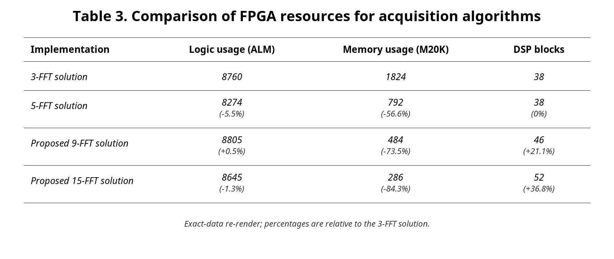
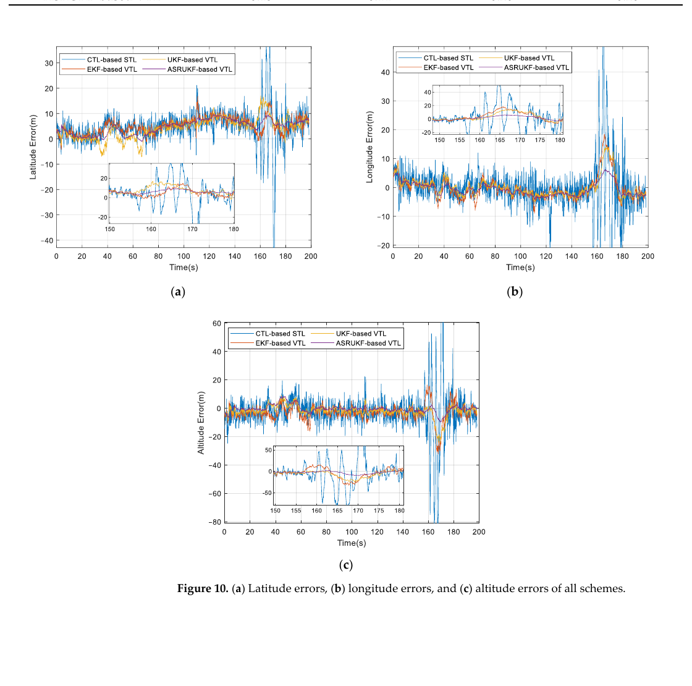
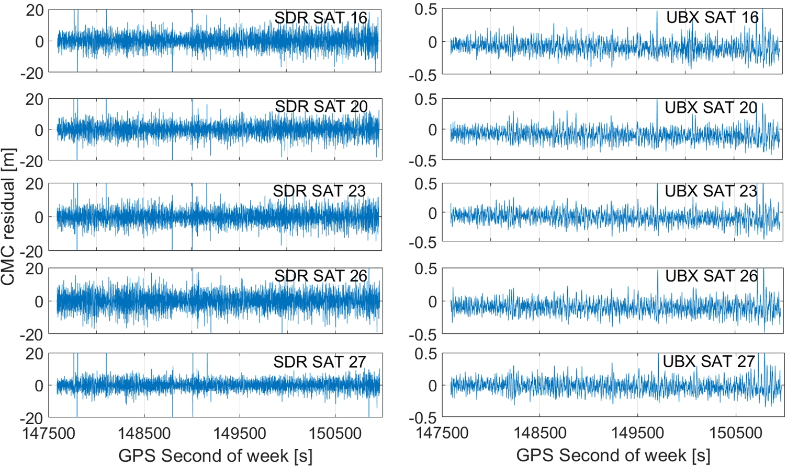

# 2026-09-25 GNSS 每日研究简报

## 今日快报

### 快报 1：LEO 高功率不自动等于低捕获成本，副码假设空间仍会随相干深度增长

- 主题：`leo-pnt-l1-acquisition-complexity`
- 来源 ID：`ion:gnss2026-17164`
- 来源链接：https://www.ion.org/gnss/abstracts.cfm?paperID=17164
- 发表日期：2026-09-16
- 来源类型：ION GNSS+ 2026 官方扩展摘要、GNSS/LEO-PNT L1 信号捕获复杂度分析
- 获取范围：公开扩展摘要全文；信号集合、衰减范围、独立/辅助捕获、FFT 并行码搜索、FPGA/MCU 映射与拟比较指标已核对，公开页未给最终能耗表或工作点数值

**内容：** 研究把 GPS L1 C/A、Galileo E1、BDS B1I/B1C、GPS L1C 与 Xona Pulsar X1 放在同一捕获账本中，显式计入主码长度、码率、调制、副码、数据位翻转、Doppler 不确定度和 LEO Doppler 率。高接收功率可缩短积分，但副码或数据翻转会引入极性假设；相干块越深，穷举、树搜索与约简策略的运算和缓存差异越大。

**结论：** 摘要给出的是分析框架和预期权衡，而非完整结果表。它声称将识别 Pulsar X1 与现代 MEO 信号、GPS L1 C/A 的交叉工作区，但没有公开每个衰减点的检测概率、能耗或耗时。因此目前只能确认“信号功率和结构必须联合比较”，不能引用“LEO 捕获一定更省电”的定量结论。

**关注理由：** 快照接收机的主要能耗常集中在捕获阶段。只按 $`C/N_0`$ 选信号会漏掉副码假设、Doppler 率和存储搬运，芯片设计应把波形结构直接折算成每次定位的焦耳数。

### 快报 2：固定监测站可把已知几何作为外部先验，离线分离真实载波相位与闪烁相位

- 主题：`geometry-aided-scintillation-kalman-tracking`
- 来源 ID：`ion:gnss2026-16869`
- 来源链接：https://www.ion.org/gnss/abstracts.cfm?paperID=16869
- 发表日期：2026-09-16
- 来源类型：ION GNSS+ 2026 官方扩展摘要、几何辅助 Kalman 跟踪与电离层闪烁监测
- 获取范围：公开扩展摘要全文；固定站/星历几何、扩展状态空间、EKF 反馈和监测输出已核对，摘要未给数据集、误差统计或与 $`S_4/\sigma_\phi`$ 的定量对照

**内容：** 常见闪烁跟踪器目标是“别失锁”，本文把目标改成“重建闪烁时间序列”。固定站坐标与星历轨迹先给出粗视线动力学，EKF 同时估计码、载波和闪烁幅相；码相位与载波相位回馈跟踪环，闪烁状态则作为监测产品输出。为换取可分离性，方法放弃实时定位任务但仍需可靠授时，并接受离线处理。

**结论：** 公开材料证明了状态建模思路，没有公开恢复误差、周跳率或与传统去趋势指数的相关系数。尤其不能把“几何辅助”写成“已验证能替代 $`S_4`$ 与 $`\sigma_\phi`$”；后者的可用性正是作者要检验的问题。

**关注理由：** 监测接收机和导航接收机的最优目标不同。固定站已知位置却仍重复做 PVT，会浪费可用于分解电离层相位、钟漂和几何项的信息约束。

### 快报 3：足球大小的 3D 打印 Luneburg 透镜让 20° 来波提高约 8 dB，但仍是五波束原型

- 主题：`printed-luneburg-lens-gnss-antenna`
- 来源 ID：`ion:gnss2026-16802`
- 来源链接：https://www.ion.org/gnss/abstracts.cfm?paperID=16802
- 发表日期：2026-09-18
- 来源类型：ION GNSS+ 2026 官方扩展摘要、被动多波束 GNSS Luneburg 透镜天线实验
- 获取范围：公开扩展摘要全文；五波束结构、开阔/部分遮挡试验、$`C/N_0`$、三阶差分码噪声、平滑 CMC 与相位比较已核对，未公开完整样本数和定位误差表

**内容：** 梯度折射率球形透镜把不同入射方向聚焦到球面不同位置，五个低成本贴片分别形成天顶和四个中仰角固定波束；每束独立接入接收机，并以透镜外同型号贴片为参考。系统不需要相移器、实时校准或数字波束形成，代价是体积接近足球且尚未闭合多波束合并接收机。

**结论：** 摘要报告天顶高仰角典型增益约 5 dB，约 20° 仰角的中仰角波束最高约 8 dB；码噪声与多路径指标改善，波束间/频间载波残差保持厘米级平滑。厘米级指的是残余相位变化，不是厘米级坐标精度；试验也没有给 PPP/RTK 固定率或长期温度稳定性。

**关注理由：** 这是用被动电磁结构替代部分数字阵列复杂度的路线。若波束切换偏差能标定，它可能为监测站、科学接收机和固定平台提供介于贴片与 CRPA 之间的成本点。

### 快报 4：分段双向滤波从健康区向衰落区推进，避免一次中断把整条开环轨迹拖散

- 主题：`segmented-open-loop-waveform-filter`
- 来源 ID：`ion:gnss2026-16927`
- 来源链接：https://www.ion.org/gnss/abstracts.cfm?paperID=16927
- 发表日期：2026-09-18
- 来源类型：ION GNSS+ 2026 官方扩展摘要、间歇开环 GNSS 码相与载波相位联合滤波
- 获取范围：公开扩展摘要；S-CWF 分段、健康区中心初始化、双向传播、MLE 拼接、GPS L1 C/A/L2C 仿真和 Spire GNSS-R 案例已核对，未公开周跳与伪距整平误差数值

**内容：** GNSS-R/RO 的快速相位变化和幅度衰落容易使闭环失锁；开环相关量虽能保留观测，却更噪。原 CWF 用 UKF 联合估双频码延迟和载波相位，但连续功率掉落会使滤波器发散。S-CWF 先检测衰落，将轨迹切段，从每段健康区中部向前、向后滤波，再用最大似然估计连接相邻段，使坏区误差不再单向污染后续健康样本。

**结论：** 摘要称仿真和真实 Spire GNSS-R 案例均比基础开环、SCANF 与原 CWF 更少周跳、伪距整平误差更小，但没有数值、事件数或误警门限。证据支持“分段限制错误传播”，尚不支持量化灵敏度或对任意反射场景的稳定性。

**关注理由：** 许多离线 GNSS 链仍机械地从头向尾递推。允许双向估计并以健康片段为锚，特别适合掩星、反射测量和任何存在成段中断的数据。

### 快报 5：组合移位本地码把宽延迟多路径搬进 ±1 chip，再按频移拆回原位置

- 主题：`l5-shifted-combined-code-multipath-detection`
- 来源 ID：`ion:gnss2026-16806`
- 来源链接：https://www.ion.org/gnss/abstracts.cfm?paperID=16806
- 发表日期：2026-09-18
- 来源类型：ION GNSS+ 2026 官方扩展摘要、GPS L5 高效宽延迟多路径检测与 3DMA 接口
- 获取范围：公开扩展摘要全文；L1/L5 相关范围、SCC 构造、时频移位、两级相干积分、拼接与复杂度式已核对，公开页未给最终城市定位误差或检测概率

**内容：** L5 高码率使 ±1.5 chip 相关范围约 45 m，而 L1 C/A 约 450 m；长延迟反射在 L5 窄窗口外不可见，会让依赖“预测状态—估计状态”匹配的 3DMA 错把反射判为 LOS/不可见。作者把多个以 2 chip 倍数平移、并赋予可分离频移的本地码相加成 SCC，使任意目标延迟先落入 ±1 chip，再经反旋与总积分拆分、拼回原延迟。

**结论：** 摘要给出的理论计算削减比例为 $`(N_p-2)/N_p`$，其中 $`N_p`$ 是覆盖目标多路径范围的 chip 数；它还说明先前 10 chip 方法用了 37 个相关器。公开页没有检测率、虚警率、算力实测或定位改进，因此这是结构和复杂度主张，不是已完成的城市性能验收。

**关注理由：** 更窄的相关峰既能抑制多路径，也可能隐藏 3DMA 需要识别的反射。SCC 提醒工程师：信号域“看不见”不等于环境域“不存在”，接收机接口必须和上层算法共同设计。

## 深度研读

### 深读 1｜捕获｜两段码避免符号翻转：为什么拆小 FFT 能少存很多、又不损失相关峰

- 类别：`acquisition`
- 学习层级：`foundation`
- 选题定位：`经典基础`
- 来源 ID：`doi:10.1155/2015/765898`
- 来源链接：https://doi.org/10.1155/2015/765898
- 发表日期：2015-12-16
- 来源类型：International Journal of Navigation and Observation 同行评审 CC BY 开放论文、现代 GNSS 并行码搜索 FPGA 资源优化
- 获取范围：开放 HTML/PDF 全文；PCS、符号翻转、3/5/9/15-FFT 架构、Tables 1–4 与 FPGA 资源估计已核对
- 价值评分：96/100（相关性 20，经典价值 19，证据 19，教学价值 20，工程价值 18）

#### 为什么先学这个

接收机必须先找到卫星的码延迟和残余 Doppler，才谈得上跟踪。现代信号的副码或数据位可在相邻主码周期之间翻转，直接用一个周期做圆相关会削弱正确峰。最稳妥的“两周期+零填充”又把大量 FPGA 存储用在最终会丢掉的点上；本文把这一捕获瓶颈拆成可计算的 FFT 资源问题。

#### 先修知识

需要理解扩频码、码相位、残余载波、相干/非相干积累、圆相关与线性相关、DFT/FFT、零填充、FPGA 的逻辑单元、片上 RAM 与 DSP 乘法块。捕获峰“无损”只表示相关计算等价，不代表量化、采样或射频前端没有损失。

#### 一句话逻辑

观察两个主码周期以保证至少有一个完整无翻转区间，再把原本很长且零填充很多的 FFT 拆成 3 或 5 个小 FFT 精确组合，使输出仍是同一个圆相关，却减少片上存储和处理时间。

#### 研究问题与约束

研究针对 GPS L5、Galileo E5a/E5b 与按 BOC(1,1) 处理的 E1；资源模型采用 Altera Stratix V、流式 FFT 核和 16 bit 输入/输出/旋转因子。结果是综合后资源估计而非整机功耗实测；控制逻辑被忽略，换 FPGA 家族、位宽或 FFT IP 后绝对数会变化。

#### 核心方法论

标准 PCS 对每个候选 Doppler 去载波，将输入 FFT 与本地码 FFT 的共轭逐点相乘，再 IFFT 得到所有码相位。为避免跨边界符号翻转，基线方案使用两个码周期并把本地码补零，形成 65,536 点 FFT。新方案按 3 或 5 个连续子序列分解长 DFT，以小 FFT、旋转因子和组合网络恢复完全相同的长 DFT；在 FPGA 中再时分复用三个 FFT 核，使吞吐接近基线。

#### 关键公式逐步推导

PCS 的离散圆相关可由频域乘积得到：

```math
r_{xc}[m]=\operatorname{IFFT}\left\{X[k]C^*[k]\right\}[m].
```

长度 $`N`$ 的 DFT 为：

```math
X[k]=\sum_{n=0}^{N-1}x[n]e^{-j2\pi kn/N}.
```

若把输入按 $`n=qM+r`$ 分成 $`K`$ 段、$`N=KM`$，则：

```math
X[k]=\sum_{q=0}^{K-1}e^{-j2\pi kq/K}
\sum_{r=0}^{M-1}x[qM+r]e^{-j2\pi kr/N}.
```

内层由 $`M`$ 点 FFT 计算，外层用旋转因子精确组合。算法没有近似相关值；节省来自减少零填充和无用输出，而非降低检测门限。

#### 经典价值与创新边界

经典价值是把“FFT 越长越快”的直觉改成“对固定有效数据，零填充和丢弃点也要付硬件成本”，并给出无检测损失的结构变换。创新边界是现代 L5/E5/E1 的两周期捕获和特定 FPGA IP；它不解决长时积累下的码 Doppler、振荡器漂移或所有副码假设。

#### 整体逻辑链

识别符号翻转；使用两周期保证无翻转相关峰；建立 3-FFT 基线；按 3/5 段拆 DFT；推导 9/15-FFT 结构；限定精确适用的采样率；计算复乘/复加；映射 Stratix V 资源；比较同级处理时间；选择内存、DSP 与采样率之间的工作点。

#### 原文图表与结果分析



> 图表源：Leclère 等《FFT Splitting for Improved FPGA-Based Acquisition of GNSS Signals》Table 3，[开放全文](https://doi.org/10.1155/2015/765898)。CC BY；按原表的英文列名、四个算法行、ALM/M20K/DSP 数值与相对 3-FFT 百分比做等值重排，未改数值，便于窄屏阅读。

横向三类资源不可合并成一个“快慢分数”。9-FFT 相对 3-FFT 只多 0.5% 逻辑和 21.1% DSP，却把 M20K 从 1824 降到 484（−73.5%）；15-FFT 进一步降到 286（−84.3%），但 DSP 增到 52。表格证明内存可大幅换出，不能证明 15-FFT 在每块 FPGA 上总成本最低。

#### 原文结果论述

论文报告 9-FFT 和 15-FFT 的复乘数量相对 3-FFT 分别减少 25% 和 36.8%，同级时分复用实现的处理时间分别为基线的 75% 与 62.5%。9-FFT 对 L5/E5a/E5b 的精确采样率上限是 24.576 MHz，高于旧 5-FFT 的 21.846 MHz。作者强调资源数依 FPGA、FFT 参数和完整设计而波动。

#### 常见误区与适用边界

第一，把零填充当免费操作。第二，只比较 FFT 次数而不看每个 FFT 长度。第三，把无相关损失误写成无定点量化损失。第四，用资源估计替代板级功耗。第五，忽略采样率适用区间；超区裁样可能产生最高约 1 dB 的示例损失。第六，把副码翻转问题等同于所有弱信号积累问题。

#### 工程实现步骤

1. 按信号主码周期、码率和前端采样率计算两周期有效样本数。
2. 确认数据/副码翻转边界与所需无损相关区间。
3. 为 3/5/9/15-FFT 方案计算 FFT 长度、复乘复加和缓存。
4. 把 IP 核位宽、吞吐、M20K/BRAM 与 DSP 约束代入目标 FPGA。
5. 用同一输入比较相关峰、检测概率和虚警率，验证结构等价。
6. 综合布局布线后再测延迟、动态功耗与温度。
7. 按真实瓶颈选择方案，而不是固定追求最少 FFT 或最少 RAM。

#### 复现实验设计

生成 GPS L5 与 Galileo E1 各 1000 组 IF，采样率取论文精确区间内/边界外各三点，随机放置副码翻转，$`C/N_0`$ 设 18–45 dB-Hz，Doppler 取 ±10 kHz。实现 3/5/9/15-FFT，统一 16 bit 量化和检测门限。指标包括峰值相对误差、$`P_d`$/$`P_{fa}`$、延迟、BRAM/DSP/逻辑、板级焦耳/捕获；基线为直接长 FFT。失败条件是精确区间内相关峰或 ROC 显著偏离基线。

#### 与定位及低成本实现的联系

低成本接收机的第一次取舍发生在捕获：少存储、短延迟能减少唤醒能耗，但只有捕获输出足够稳定，后续跟踪才有可靠初值。下一节把已捕获的多星相关量接入共同导航状态，研究遮挡和动态下怎样避免单通道独自失锁。

#### 本节小结

两周期解决符号翻转，FFT 拆分解决浪费。真正的优化对象不是“FFT 个数”，而是保持相关等价条件下的内存、乘法器、采样率与处理时间组合。

### 深读 2｜跟踪｜让每颗星共享运动信息：自适应平方根 UKF 怎样在遮挡时稳住矢量环

- 类别：`tracking`
- 学习层级：`intermediate`
- 选题定位：`基础进阶`
- 来源 ID：`doi:10.3390/rs16111836`
- 来源链接：https://doi.org/10.3390/rs16111836
- 发表日期：2024-05-21
- 来源类型：Remote Sensing 同行评审 CC BY 4.0 开放论文、非线性 Kalman 矢量跟踪与实车 SDR 验证
- 获取范围：开放 PDF 全文；ASRUKF 状态/噪声自适应、模拟衰减/高动态、南京实车、Figures 9–11 与 Tables 3–4 已核对
- 价值评分：95/100（相关性 20，经典价值 17，证据 19，教学价值 19，工程价值 20）

#### 为什么先学这个

上一节只给出每颗星的粗码相和 Doppler；传统标量环让各通道独立追踪，弱星被遮挡时无法借用强星和车辆运动。矢量环把所有通道的相关输出、PVT 和钟状态闭合起来，但固定噪声参数又会在低 $`C/N_0`$ 与高动态之间失配。本文把共享信息和自适应带宽放在同一接收机中。

#### 先修知识

需要理解 DLL/PLL、早/准/迟相关器、$`C/N_0`$、Doppler、NCO、EKF/UKF、Unscented Transform、Cholesky 平方根滤波、过程噪声 $`Q`$、量测噪声 $`R`$、ECEF 位置速度和接收机钟偏/漂。矢量共享既能救弱星，也可能把错误通道传播到全局状态。

#### 一句话逻辑

用导航解预测每颗星的 Doppler，把各通道接成矢量闭环；再用 $`C/N_0`$ 调量测噪声、用导航 Doppler 不确定度调过程噪声，并以平方根 UKF 保数值稳定，使环路在噪声和动态变化时自动收放带宽。

#### 研究问题与约束

模拟采用 GPS L1、9.548 MHz 中频、38.192 MHz 采样，信号从 50 dB-Hz 每 10 s 降 5 dB 到 30 dB-Hz并恢复；运动含 60–70 m/s² 加减速、最高 800 m/s 和两次 90° 转弯。实车只取南京一次 200 s 路段、成功捕获六星、平均 PDOP 2.2975；数据不公开，泛化到不同前端、星座和城市不能由该试验保证。

#### 核心方法论

四个同数据 SDR 基线分别是固定带宽标量环、EKF 矢量环、SRUKF 矢量环和自适应 SRUKF 矢量环；导航层均用同一 EKF。非线性滤波器直接使用早/准/迟 I/Q，不经传统鉴相器；平方根形式传播协方差因子。$`R_k`$ 由当前 $`C/N_0`$、相干时间和信号功率计算，$`Q_k`$ 由速度/钟漂协方差投影出的 Doppler 辅助误差自适应扩大。

#### 关键公式逐步推导

对第 $`j`$ 颗星，导航状态误差投影到 Doppler 辅助误差：

```math
\sigma^2_{\mathrm{aid},k,j}
=\left(\frac{f_c}{c}\right)^2
\left(P_{\dot b,k}+e_{k,j}^{\mathsf T}P_{v,k}e_{k,j}\right).
```

准相关器 I/Q 的量测噪声随 $`C/N_0`$ 和相干时间变化，可概括为：

```math
R_k=\operatorname{diag}
\left(\sigma^2_{I_P},\sigma^2_{I_E},\sigma^2_{I_L},
\sigma^2_{Q_P},\sigma^2_{Q_E},\sigma^2_{Q_L}\right).
```

过程噪声按导航反馈不确定度增广：

```math
Q_k=Q_0+\Delta Q_k,
\qquad
\Delta Q_k=\alpha_k\sigma^2_{\mathrm{aid},k}I,
\qquad
\alpha_k\propto\frac{1}{C/N_0}.
```

信号越弱、反馈越不确定，滤波器越不应过度相信固定动力学；信号强时则收窄等效带宽以抑噪。

#### 经典价值与创新边界

经典价值是把“矢量环利用多星冗余”具体化为 Doppler 反馈和统一对照架构。创新点是直接 I/Q 的非线性 SRUKF 与 $`R/Q`$ 双自适应。边界是级联结构、GPS L1 和单次数据；实车坐标改善同时包含跟踪与导航反馈闭环，不能解释成单独滤波器的普适增益。

#### 整体逻辑链

捕获并建立通道；早/准/迟相关；非线性滤波估码/载波状态；生成伪距与 Doppler；导航 EKF 解 PVT/钟；将预测 Doppler反馈各星；按 $`C/N_0`$ 更新 $`R`$；按反馈误差更新 $`Q`$；平方根传播；与三种基线比较跟踪、位置和速度误差。

#### 原文图表与结果分析



> 图表源：Gao 等《Performance Enhancement and Evaluation of a Vector Tracking Receiver Using Adaptive Tracking Loops》Figure 10，[开放全文](https://doi.org/10.3390/rs16111836)。CC BY 4.0；由机构库原版 PDF 第 16 页 150 dpi 渲染后仅裁去正文、页眉和 Table 4，坐标轴、图例、曲线、插图和图注未修改。

横轴是 0–200 s，纵轴分别为纬度、经度和高度误差（m）；插图放大 150–180 s 遮挡段。蓝色标量环在该段出现几十米尖峰，三种矢量环更平滑，紫色 ASRUKF 总体最小。图直接显示单次路段的误差序列，不能证明任意遮挡下都不失锁，也不能分离几何、前端和算法贡献。

#### 原文结果论述

Table 3 给出的纬/经/高 RMSE：标量环为 8.54/8.72/17.16 m，EKF-VTL 为 5.94/4.07/6.57 m，UKF-VTL 为 5.84/3.46/4.81 m，ASRUKF-VTL 为 5.48/2.34/2.69 m。ASRUKF 相对 UKF 的三方向 RMSE 降低 6.16%、32.37%、44.07%；速度东/北 RMSE 为 0.13/0.20 m/s。模拟中标量环在约 50 s 的弱信号+加速段失锁，而矢量环在 30 dB-Hz 仍跟踪。

#### 常见误区与适用边界

第一，把 UKF 当成无需调参。第二，只按 $`C/N_0`$ 调带宽而忽略动态。第三，认为多星共享只会改善；坏量测也会污染全局。第四，用 RTK 参考精度替代被测算法精度。第五，把 200 s、六星单路线当跨城市证据。第六，忽略平方根实现的数值和算力成本。第七，把位置 RMSE 改善全归因于跟踪环。

#### 工程实现步骤

1. 保留标量环作为冷启动和故障隔离后备。
2. 统一通道时间戳与导航滤波更新时间。
3. 用 I/Q 直接构造非线性量测，离线核对噪声分布。
4. 实时估 $`C/N_0`$ 并更新 $`R_k`$。
5. 从速度/钟漂协方差投影每星 Doppler 辅助误差并更新 $`Q_k`$。
6. 用平方根形式限制协方差非正定和数值漂移。
7. 对创新、PLI 和跨通道残差设隔离门，防止污染传播。
8. 同时验收跟踪连续性、PVT 尾部和计算负载。

#### 复现实验设计

用同一 GPS L1 IF 同时跑四种架构；相干时间 1 ms、标量 DLL/PLL 带宽 1/10 Hz、导航更新 100 ms。模拟重复论文 50→30→50 dB-Hz 与 60–70 m/s² 动态，再加入单星 1/5/20 s 遮挡及一星 50 m 码偏差。实车选开阔、树荫、街谷三路线各十次。指标为失锁率、重捕时间、Doppler/PLI、位置和速度 50/95/99 分位、错误传播星数、CPU 实时率；基线为固定带宽 STL、EKF-VTL、UKF-VTL。

#### 与定位及低成本实现的联系

矢量跟踪能把多星几何和运动先验用于维持观测，但它不能消除低成本前端本身的码噪声。下一节把链路推进到伪距和 SPP，用同天线同时比较 30 美元 SDR 与低成本 u-blox，量化“信号看起来差不多、坐标却差很多”的原因。

#### 本节小结

矢量环的核心不是换一个滤波器名，而是让通道共享运动与钟信息；双自适应 $`R/Q`$ 则让这份共享在弱信号和高动态之间不过硬也不过软。

### 深读 3｜定位｜同一副天线、同一组卫星：为什么 30 美元 SDR 的 SPP 仍被伪距噪声拉散

- 类别：`positioning`
- 学习层级：`advanced`
- 选题定位：`定位应用`
- 来源 ID：`doi:10.1007/s12518-022-00457-9`
- 来源链接：https://doi.org/10.1007/s12518-022-00457-9
- 发表日期：2022-08-26
- 来源类型：Applied Geomatics 同行评审 CC BY 4.0 开放论文、超低成本 GNSS-SDR 伪距质量与 GPS SPP 评估
- 获取范围：开放 HTML/机构库 PDF 全文；同天线分路、CMC、卫星交集、四个截止角、RTKLIB SPP、Figures 4–15 与讨论已核对
- 价值评分：97/100（相关性 20，经典价值 18，证据 20，教学价值 20，工程价值 19）

#### 为什么先学这个

捕获和跟踪成功不等于量测可用于定位。两个接收机可以显示相近 $`C/N_0`$，但码鉴别器、时钟、采样、量化和前端热稳定性会把不同噪声写进伪距。本文用同一根天线、功分器、同一时段和卫星交集做公平对照，把信号域差异一路追到 SPP 坐标。

#### 先修知识

需要理解 GPS L1 C/A 伪距、载波相位、码减载波（CMC）、多路径与码噪声、广播星历、Klobuchar 电离层、Saastamoinen 对流层、加权最小二乘、仰角截止角、DOP、ENU/三维误差。精度（散布）和准确度（相对真值偏差）不可混用。

#### 一句话逻辑

把同一天线信号同时送入 Rafael RTL 前端+GNSS-SDR 和 u-blox ZED-F9P，先用 CMC 量化码噪声，再强制 SPP 使用相同卫星；若坐标仍明显更散，差异就主要落在前端/接收机观测质量而非天空几何。

#### 研究问题与约束

数据是 2021-03-01 那不勒斯开阔低多路径场地的一小时 GPS L1；RTL 前端约 30 美元、最高可靠采样约 2.4 Msps、GNSS-SDR 建议最多八通道，且约 30 min 开始发热、约 1 h 后可能失锁。SPP 用 RTKLIB 2.4.2、广播星历、Klobuchar 和 Saastamoinen；结果不能代表现代多频 SDR、改良时钟或城市环境。

#### 核心方法论

ANN-MB 天线装在 10 cm 金属地板，经功分器同时连接 SDR 与 ZED-F9P，统一 1 s 采样。先比较可见星和 $`C/N_0`$，再用 CMC 去除几何、钟和一阶大气的共同低频项，观察码噪声。SPP 分别用 5°/10°/15°/30° 截止角；公平主对照只使用 SDR 实际跟踪到的卫星，另算 u-blox 全部卫星以分离几何收益。

#### 关键公式逐步推导

单频伪距与载波相位（以米计）可写成：

```math
P=\rho+c(\delta t_r-\delta t_s)+T+I+M_P+\epsilon_P,
```

```math
\lambda\Phi=\rho+c(\delta t_r-\delta t_s)+T-I+\lambda N+M_\Phi+\epsilon_\Phi.
```

两者相减并去趋势：

```math
\mathrm{CMC}=P-\lambda\Phi
=2I-\lambda N+(M_P-M_\Phi)+(\epsilon_P-\epsilon_\Phi).
```

短时去低频后，载波噪声远小于码噪声，CMC 散布可近似诊断伪距噪声。SPP 线性化为：

```math
\Delta\hat x=(G^{\mathsf T}WG)^{-1}G^{\mathsf T}W\Delta P,
```

所以相同 $`G`$（同卫星）下，坐标差异主要来自 $`\Delta P`$ 的噪声、偏差与权重模型。

#### 经典价值与创新边界

经典价值是严格控制天线、时间和卫星集合，把“SDR 可定位”提升为“SDR 观测质量可审计”。创新边界是特定 RTL2832U/TCXO、GPS L1 和一小时静态试验；研究定位了瓶颈，却没有实现去噪或新随机模型。

#### 整体逻辑链

同天线分路；同步记录；转成统一 RINEX/1 s；比较卫星数与 $`C/N_0`$；构造 CMC；低频/高频分离；设置四种仰角截止；用相同卫星跑 RTKLIB SPP；比较 ENU、三维误差和直方图；再放回 u-blox 全部卫星检验几何贡献；把差异回溯到前端噪声与通道限制。

#### 原文图表与结果分析



> 图表源：Robustelli 等《GNSS-SDR pseudorange quality and single point positioning performance assessment》Figure 4，[开放全文](https://doi.org/10.1007/s12518-022-00457-9)。CC BY 4.0；直接保存出版社提供的原始 PNG，未裁切或修改坐标轴、曲线、卫星编号和数值。

左右分别是 SDR 和 u-blox 对 PRN 16/20/23/26/27 的 CMC 残差；横轴为 GPS 周内秒，纵轴为米。最关键的是两列纵轴不同：SDR 为 ±20 m，u-blox 为 ±0.5 m。图显示同一颗星、同一根天线下 SDR 的码噪声量级远大于 u-blox；它不能把噪声进一步唯一归因于 ADC、TCXO、相关器或热漂中的某一个部件。

#### 原文结果论述

论文称 SDR CMC 主要落在 [−20, 20] m，而 u-blox 为 [−0.25, 0.25] m，约跨两个数量级的绘图范围。5°/10°/15° 截止角下，SDR 水平误差均值约 4.60 m、标准差约 3.15 m，u-blox 约 2 m 和 1.8 m；30° 时两者均恶化，SDR 水平均值约 10 m，u-blox 约 4.60 m。SDR 三维误差均值和标准差约为 u-blox 的三倍；这些数字属于单场静态数据。

#### 常见误区与适用边界

第一，用相近 $`C/N_0`$ 推断相近伪距。第二，只比较位置而不固定卫星集合。第三，把 CMC 全部当白噪声；其中仍有电离层与多路径。第四，把 30° 截止角等同真实城市遮挡。第五，把一次 RTL 前端结果外推到全部 SDR。第六，用标准差代替相对真值误差。第七，忽略发热和八通道上限造成的时间相关与几何变化。

#### 工程实现步骤

1. 用功分器和同天线建立接收机公平对照，并记录增益与供电。
2. 对每星统计捕获率、连续性、$`C/N_0`$ 和 CMC。
3. 分离低频多路径/电离层与高频码噪声，按仰角和 $`C/N_0`$ 建模。
4. 监控前端温度、采样丢失、时钟漂移与通道占用。
5. 定位比较先取卫星交集，再单独报告额外卫星的几何收益。
6. 把经验方差写入 $`W`$，比较等权、仰角权与 CMC 驱动权。
7. 同时报水平、垂直、三维误差及 95/99 分位。
8. 换前端、时钟和采样率做消融，才可归因具体硬件瓶颈。

#### 复现实验设计

选三种前端：RTL2832U、温补中档 SDR、ZED-F9P；同一测量天线四路分配，开阔/树荫/街谷各采 2 h，5 Hz，记录温度。统一 GPS L1 和卫星交集，跑 RTKLIB SPP；比较等权、仰角权、CMC 方差权。指标为逐星 CMC RMS/95 分位、周跳、可用率、ENU 和 3D 误差 50/95/99 分位、功耗与实时率。基线为 u-blox 原始观测；失败条件是新权重只改善均值却放大 99 分位或跨场景失效。

#### 与定位及低成本实现的联系

这条链把硬件资源、跟踪连续性和坐标误差闭合起来：FFT 优化让低成本设备更容易捕获；矢量环让短时遮挡不立即失锁；CMC 和 SPP 审计则防止“能跟踪”被误当成“量测足够准”。低成本实现应同时预算 RAM/DSP、环路鲁棒性和伪距噪声，而不是只优化其中一层。

#### 本节小结

同样的天线和 $`C/N_0`$ 不会自动产生同样的伪距。超低成本 SDR 的真正瓶颈可能在量测噪声与前端稳定性；公平定位比较必须锁定卫星几何，再把误差追回信号链。
