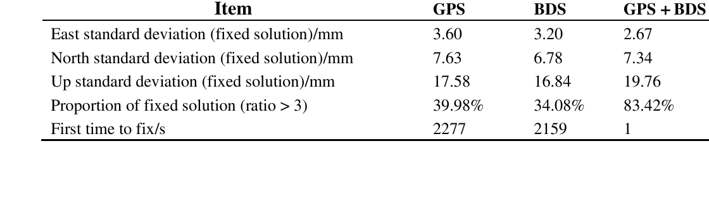
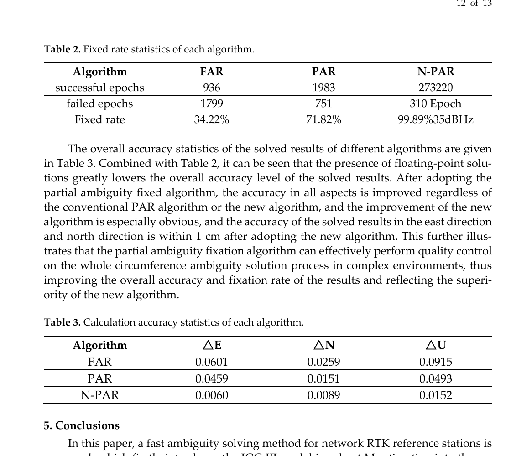
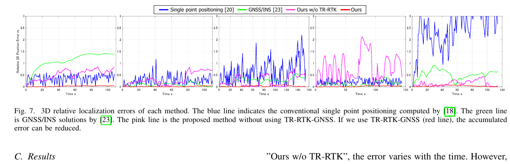

# 2026-09-26 GNSS 每日研究简报

## 今日快报

### 快报 1：24 小时城市信道仿真提醒：码误差小，不等于最终定位一定更好

- 主题：`geometry-adapted-rnss-multipath-assessment`
- 来源 ID：`ion:gnss2026-16880`
- 来源链接：https://www.ion.org/gnss/abstracts.cfm?paperID=16880
- 发表日期：2026-09-16
- 来源类型：ION GNSS+ 2026 官方扩展摘要、候选区域导航信号城市多路径评估
- 获取范围：公开扩展摘要全文；城市几何适配信道、实测误差统计对照、码跟踪与定位传播链、24 h 星座几何采样已核对，未公开波形参数、城市数据集、误差数值或独立复现实验

**内容：** 研究不是只画一条多路径误差包络，而是先用城市几何调整陆地移动卫星信道，再把模拟出的路径时延、幅度和相位送入各候选信号的码跟踪模型，最后将测距误差传播到单星座与融合星座定位。多个时刻样本覆盖 24 h 星座几何周期，意图把“波形本身的抗多路径能力”和“可用星数量、仰角及几何”放在同一评价链中。

**结论：** 摘要只给出方向性结果：城市传播对低仰角测距伤害更大，不同候选信号对多路径的敏感度不同；最终位置表现还受测量可用性和卫星几何控制。公开材料没有候选波形名称、米级误差、DOP 或重复次数，因此不能据此给出信号优劣排名，也不能把 24 h 仿真解释为 24 h 实测。

**关注理由：** 接收机设计常在相关域优化一个误差指标，却忽略某种跟踪策略可能同时改变可用星集合。真正的信号评估应把信道、鉴别器、失锁门限和定位几何连起来。

### 快报 2：区域 PPP-RTK 把 CORS 残差压进四叉树广播，但 70–80% 压缩率不是定位验收

- 主题：`regional-ppp-rtk-local-datum-quadtree`
- 来源 ID：`ion:gnss2026-17003`
- 来源链接：https://www.ion.org/gnss/abstracts.cfm?paperID=17003
- 发表日期：2026-09-17
- 来源类型：ION GNSS+ 2026 官方扩展摘要、厂商区域 PPP-RTK 与本地坐标框架服务架构
- 获取范围：公开扩展摘要全文；区域卫星/大气增强、ITRF 到地方基准转换、CORS 后拟合残差、四叉树压缩、云端微服务及相对 NRTK/RTX 的作者结论已核对，未公开站网密度、数据期、绝对误差表或错误固定统计

**内容：** 方案在 Trimble RTX 改正上叠加密集 CORS 估计的区域卫星改正和大气改正，再根据 CORS 的动态 ITRF 坐标与地方基准固定坐标，联合常规框架参数、精调参数和高分辨率后拟合残差完成坐标转换。残差用四叉树编码后通过单向链路广播，后端以云端微服务完成模糊度整平、改正生成、框架更新和 CMRx 流调度。

**结论：** 摘要报告四叉树压缩率为 70–80%，并称在初始化时间的 90/95 分位上可达到或超过 NRTK，保持固定的可靠性也优于受物理基站问题影响的 NRTK。然而公开页没有压缩前后坐标误差、分位数数值、基线分组和错误固定率；这些是厂商作者的会议结论，不能直接等同第三方跨区域验证。

**关注理由：** 高精度服务不仅要“算到厘米”，还要把全球框架结果一致地落到本地法定坐标。改正压缩、坐标框架和固定可靠性是三条不同的验收链，任何一条都不能由另一条替代。

### 快报 3：L1C 的高频 TMBOC 分量提高可辨性，却不自动得到低算力抗多路径

- 主题：`gps-l1c-correlator-multipath-review-plan`
- 来源 ID：`ion:gnss2026-17179`
- 来源链接：https://www.ion.org/gnss/abstracts.cfm?paperID=17179
- 发表日期：2026-09-18
- 来源类型：ION GNSS+ 2026 官方扩展摘要、GPS L1C 相关器抗多路径比较计划
- 获取范围：公开扩展摘要全文；MBOC/TMBOC 功率构成、L1C 导频结构、待比较相关器和噪声/干扰维度已核对，摘要使用将来时，未给试验数据、误差包络或算法排名

**内容：** GPS L1C 的 MBOC 功率谱由 $`10/11`$ 的 BOC(1,1) 与 $`1/11`$ 的 BOC(6,1) 组成；TMBOC 导频在每 33 个扩频符号中安排 4 个 BOC(6,1)，且导频占总信号功率 75%。更高 RMS 带宽可提高延迟分辨能力，但最大似然或学习型多径参数拟合往往增加积分时长和算力，作者因此计划比较多种相关器/鉴别器结构，并同时观察噪声和干扰下的跟踪性能。

**结论：** 公开摘要是研究计划，不是结果论文。它确认了比较维度和 L1C 结构，却没有证明某种相关器最优，也没有给出“10 颗 L1C 卫星”之外的实测可用性信息。任何抗多路径增益、算力代价或定位改善都必须等待完整结果。

**关注理由：** 现代信号的频谱优势只有通过接收机结构才能兑现。工程上应联合比较偏差、噪声、失锁、积分延迟和乘加次数，而不是把更宽频谱直接翻译成更小伪距误差。

### 快报 4：16 通道前端拟内建扫频 S21 校准，把站间信号监测差异追到 ADC 之前

- 主题：`self-equalizing-array-satnav-front-end`
- 来源 ID：`ion:gnss2026-17201`
- 来源链接：https://www.ion.org/gnss/abstracts.cfm?paperID=17201
- 发表日期：2026-09-18
- 来源类型：ION GNSS+ 2026 官方扩展摘要、阵列式多频多星座信号完整性监测前端设计
- 获取范围：公开扩展摘要全文；DCB 监测链、阵列波束形成、多频电离层改正、S21 内建扫频校准、16 通道超外差/ADC/FPGA 架构已核对，性能结果仍写作论文将包含，未公开亚厘米达成误差

**内容：** 多相关器生成的差分码偏差响应不仅含卫星载荷变形，还混入前端传递函数、多路径和电离层。方案用至少 7 阵元波束形成压低多路径并核对来波方向，用多频观测改正电离层；更难的前端项由内建 DDS 向每个阵元注入超低功率连续波，扫过 1–2 GHz 通带，在 FPGA 中相关估计相对增益与相位，从而随温度和老化实时均衡 S21。原型为 16 通道，通道对可配置到不同中心频率。

**结论：** 摘要提出全球监测接收机至少 1 Hz 输出全部可见民用信号相关响应、目标预警时间不超过 1 s，并希望让站间 DCB 一致到亚厘米量级；但这些是需求或设计目标。公开页没有温漂前后残差、通道一致性、注入音泄漏或长期老化数据，不能表述成已通过验收。

**关注理由：** 分布式完整性监测最怕各站把自身模拟链漂移误判成卫星异常。把校准源、ADC 和 FPGA 放进同一闭环，比事后给单一伪距加常数更接近可审计的信号质量监测。

### 快报 5：把 PPP-AR 验整改写成概率校准问题，300 余站训练方案仍需真实错误固定验真

- 主题：`probability-calibrated-ppp-ar-validation`
- 来源 ID：`ion:gnss2026-17099`
- 来源链接：https://www.ion.org/gnss/abstracts.cfm?paperID=17099
- 发表日期：2026-09-17
- 来源类型：ION GNSS+ 2026 官方扩展摘要、FT-Transformer PPP-AR 模糊度验证研究设计
- 获取范围：公开扩展摘要全文；输入特征、GREAT-PVT 设置、300 余 IGS 站、15/60 min 重置、UrbanNav 外测、标签与概率校准指标已核对，未公开 ECE、Brier、误固定率或定位结果

**内容：** 方法不直接输出“固定/拒绝”，而是估计每历元全部已固定模糊度均正确的概率。输入除 ratio、ADOP、PDOP 和模糊度维数外，还包含浮点模糊度向量、整数候选及协方差结构；FT-Transformer 学习特征交互，输出再用可靠性图、期望校准误差（ECE）和 Brier 分数评估。计划数据为 300 余个全球 IGS 站的一整天 30 s 双频多星座观测，分别每 15/60 min 重置，并用 UrbanNav 动态城市数据外测。

**结论：** 公开材料给的是完整实验协议而非性能结果。训练标签以更晚收敛解重构的整数为参考，这能大规模生成样本，但并非独立真值；静态开阔站训练、动态城市测试也存在分布迁移。没有公开概率校准曲线前，不能声称任一概率阈值已控制错误接受风险。

**关注理由：** 模糊度验证的核心不是分类准确率，而是“报 99.9% 时，长期是否真有约 99.9% 正确”。把校准性单独验收，是机器学习进入高精度完整性链的必要门槛。

## 深度研读

### 深读 1｜接收机工程｜多一套星座先改善可固定性：Kalman 浮点模糊度怎样接到 LAMBDA

- 类别：`receiver-engineering`
- 学习层级：`foundation`
- 选题定位：`经典基础`
- 来源 ID：`doi:10.3390/s140815415`
- 来源链接：https://doi.org/10.3390/s140815415
- 发表日期：2014-08-20
- 来源类型：Sensors 同行评审 CC BY 4.0 开放论文、GPS/BDS 单频短基线 Kalman RTK
- 获取范围：开放 PDF 全文；单/双差模型、状态与协方差更新、参考星处理、LAMBDA/ratio 验收、零基线与 5.9/9 km 静态试验、Figures 2–11、Tables 1–4 已核对
- 价值评分：96/100（相关性 20，经典价值 19，证据 20，教学价值 19，工程价值 18）

#### 为什么先学这个

RTK 的厘米结果来自两步：先在实数域估计基线与浮点模糊度，再在整数域搜索并验证。初学者常把“星多”直接等同“固定准”；本文用 GPS 与早期 BDS 单频数据展示更准确的说法：共同状态把两套星座连起来，额外卫星主要改善模型强度、首次固定时间和固定可用率，固定后坐标散布未必在每一方向都更小。

#### 先修知识

需要理解伪距、载波相位、接收机间单差、星间双差、短基线共同误差抵消、Kalman 预测/更新、单差与双差模糊度、协方差传播、LAMBDA 和 ratio test。论文中的 BDS 是 2014 年区域星座，不能把其可见星结构直接替换成今天的 BDS-3。

#### 一句话逻辑

把唯一的三维基线和 GPS/BDS 各星单差模糊度放进同一个 Kalman 状态，逐历元积累码与相位信息，再把浮点单差变成双差后送入 LAMBDA；更多独立几何约束让正确整数更容易从候选中突出。

#### 研究问题与约束

论文处理 GPS L1 与 BDS B1 单频观测，实验为北京开阔环境的一次零基线、5.9 km 和 9 km 静态短基线，使用自研 96 通道接收机并以 MATLAB 后处理。状态过程把基线近似为随机游走；大气残差、低仰角多路径和新升星仍会破坏一致性。它不是动态实时处理、现代多频多星座或城市遮挡证据。

#### 核心方法论

对每个系统分别选参考星形成双差观测，但滤波状态保存单差模糊度，避免参考星变化时整块重参数化。GPS 与 BDS 共享同一基线 $`b`$，各自保留模糊度块；预测后用码和相位联合更新。更新得到的单差浮点模糊度与协方差经双差变换送入 LAMBDA，以最佳/次佳残差 ratio 大于 3 为固定门，固定整数再回代载波相位求高精度基线。

#### 关键公式逐步推导

短基线双差码与相位可概括为：

```math
P_{DD}=H_b b+\varepsilon_P,
\qquad
\lambda\Phi_{DD}=H_b b+\lambda N_{DD}+\varepsilon_\Phi.
```

把基线与两星座单差浮点模糊度组成状态：

```math
x_k=
\begin{bmatrix}
b_k^{\mathsf T}&(N^{GPS}_{SD,k})^{\mathsf T}&(N^{BDS}_{SD,k})^{\mathsf T}
\end{bmatrix}^{\mathsf T}.
```

Kalman 更新为：

```math
K_k=P_k^-H_k^{\mathsf T}
(H_kP_k^-H_k^{\mathsf T}+R_k)^{-1},
```

```math
\hat x_k=\hat x_k^-+K_k(z_k-H_k\hat x_k^-),
\qquad
P_k=(I-K_kH_k)P_k^-.
```

用双差变换 $`D`$ 得到 $`\hat N_{DD}=D\hat N_{SD}`$ 与 $`Q_{DD}=DQ_{SD}D^{\mathsf T}`$，再求：

```math
\check N=
\arg\min_{n\in\mathbb Z^m}
(\hat N_{DD}-n)^{\mathsf T}Q_{DD}^{-1}(\hat N_{DD}-n).
```

#### 经典价值与创新边界

经典价值是把多星座 RTK 从观测方程落实到可实现状态、升落星管理、协方差变换和固定回代。创新边界是早期 GPS+BDS 单频静态短基线；固定门仍是经验 ratio=3，没有错误固定率设计，也未处理跨系统同频偏差、长基线电离层或实时算力。

#### 整体逻辑链

同步基准站与流动站观测；按系统形成单差；维护共同基线和两套模糊度状态；预测并加入新升星；联合码/相位更新；把单差模糊度变成双差；运行 LAMBDA；ratio 验收；固定后回代基线；参考星或星集变化时重构相应块并连续输出浮点/固定状态。

#### 原文图表与结果分析



> 图表源：Zhao 等《A Kalman Filter-Based Short Baseline RTK Algorithm for Single-Frequency Combination of GPS and BDS》Table 3，[开放全文](https://doi.org/10.3390/s140815415)。CC BY 4.0；由原版 PDF 第 14 页 180 dpi 渲染后仅裁出表格，行列、单位、数值和阈值说明未修改。

表格比较 5.9 km 静态基线的 GPS、BDS 与联合解。联合解的固定比例为 83.42%，明显高于 39.98% 与 34.08%，首次固定从 2277/2159 s 缩到 1 s；但固定解垂向标准差 19.76 mm，反而略大于单 GPS 的 17.58 mm 和单 BDS 的 16.84 mm。图表直接支持“星多主要提高固定可用性”，不能支持“固定后每个分量都更精”。

#### 原文结果论述

零基线三种方法均在 1 s 内固定且固定率 100%。5.9 km 时联合解大幅提高固定比例并缩短首次固定；9 km 时 GPS/BDS 联合解固定率 80.20%，仍高于 GPS 的 73.57% 与 BDS 的 44.25%，但首次固定为 467 s，不再是 1 s。作者还观察到新升低仰角星常与 ratio 突降同时出现，说明更多卫星也可能把低信噪比和多路径带入协方差与验整链。

#### 常见误区与适用边界

第一，把更多卫星等同更小的固定后标准差。第二，把 ratio>3 当已知错误固定概率。第三，忽略 GPS 与 BDS 各自参考星及频率不同。第四，把静态后处理称为实时动态性能。第五，把 2014 区域 BDS 几何外推到 BDS-3。第六，只看固定率，不报告首次固定和错误固定。第七，新升星一出现就无条件加入。

#### 工程实现步骤

1. 统一基准站与流动站时间标记、卫星号和频点。
2. 对码、相位、周跳与信噪比做预检。
3. 在状态中保留共同基线与各星单差模糊度。
4. 为升星增加状态，为落星安全删块并同步协方差。
5. 逐历元执行预测和码/相位联合更新。
6. 变换到双差模糊度及完整协方差。
7. 用 LAMBDA 搜索并以 ratio、残差和模型强度联合验收。
8. 分开记录浮点、固定、拒绝与重初始化状态。

#### 复现实验设计

用现代 GPS L1/L5、Galileo E1/E5a、BDS B1C/B2a 接收机做 0/5/10 km 静态基线，各 6 h、1 Hz；分别跑单星座、两星座和三星座。门限除 ratio=3 外，加入固定失败率与后验载波残差基线。指标为首次正确固定、正确/错误固定率、浮点与固定 ENU 95/99 分位、升落星后恢复时间和 CPU 负载。失败条件是联合解提高固定率却增加错误固定或 99 分位。

#### 与定位及低成本实现的联系

低成本接收机最容易用“加星座”换可用性，但观测质量不齐时全固定会把坏星一起押进整数解。下一节把问题推进到 75 km 网络参考站：先稳健估浮点解，再只固定通过质量门的模糊度子集。

#### 本节小结

多星座共享基线、增加几何冗余，首先改善的是模糊度可辨识性和固定可用性。固定后是否更准，仍由相位噪声、残余系统误差和验收门共同决定。

### 深读 2｜接收机工程｜不要为一颗坏星拒绝全部整数：网络 RTK 怎样逐层缩小固定子集

- 类别：`receiver-engineering`
- 学习层级：`intermediate`
- 选题定位：`基础进阶`
- 来源 ID：`doi:10.3390/s22010165`
- 来源链接：https://doi.org/10.3390/s22010165
- 发表日期：2021-12-27
- 来源类型：Sensors 同行评审 CC BY 4.0 开放论文、网络 RTK 参考站间稳健 EKF 与部分模糊度固定
- 获取范围：开放 PDF 全文；观测模型、IGG III 稳健扩展 Kalman、LAMBDA、卫星级/模糊度级筛选、75 km GPS/BDS 实测、Figures 2–9 与 Tables 1–3 已核对
- 价值评分：92/100（相关性 19，经典价值 17，证据 17，教学价值 20，工程价值 19）

#### 为什么先学这个

上一节把全部可见星送入整数搜索；复杂环境下只要一颗星含粗差或新升星尚未收敛，全固定（FAR）就可能整组失败。部分模糊度固定（PAR）的关键不是“少固定几个”这么简单，而是怎样先修稳浮点协方差，再用可解释门限逐层找到既可固定又保留足够几何的子集。

#### 先修知识

需要理解扩展 Kalman 滤波、创新与协方差、M 估计、IGG III 分段权函数、LAMBDA、ratio、bootstrap 成功率、ADOP、卫星高度角、连续锁定历元、SNR、GDOP、FAR/PAR，以及固定子集后对剩余浮点模糊度的条件更新。

#### 一句话逻辑

先用 IGG III 对创新残差迭代降权，避免粗差拖偏浮点模糊度；若全固定失败，就先按卫星质量剔除整组，再按单模糊度 ADOP 继续缩小候选，直到 LAMBDA 同时通过 ratio 与 bootstrap 成功率门。

#### 研究问题与约束

试验使用广西百色自研 GPS/BDS 接收机，参考站间基线 75 km，共 2735 个历元。算法门含 20°高度角、连续锁定 10 历元、35 dB-Hz、GDOP 2.0；ADOP 阈值按模糊度维数取 0.14/0.135/0.13，bootstrap 成功率 99.5%，ratio=3。论文未给独立真整数、错误固定率或跨日重复，且原文 Table 2 的历元计数与百分比存在排版/算术不一致。

#### 核心方法论

浮点层以扩展 Kalman 创新为入口，按标准化残差用 IGG III 重构等价量测协方差：小残差保权，中残差降权，大残差近似拒绝。整数层先尝试 FAR；失败后按高度角、锁定时长、SNR 和 GDOP 筛卫星级集合，再按模糊度方差/ADOP 筛参数级集合。每个候选子集都运行 LAMBDA，并要求 ratio 与 bootstrap 成功率同时通过；已固定子集再条件更新其余参数。

#### 关键公式逐步推导

EKF 创新与协方差为：

```math
v_k=z_k-h(\hat x_k^-),
\qquad
S_k=H_kP_k^-H_k^{\mathsf T}+R_k.
```

令标准化创新 $`r_i=v_i/\sqrt{S_{ii}}`$，IGG III 可概括为：

```math
w_i=
\begin{cases}
1, & |r_i|\le k_0,\\
\dfrac{k_0}{|r_i|}
\left(\dfrac{k_1-|r_i|}{k_1-k_0}\right)^2,
& k_0<|r_i|<k_1,\\
0, & |r_i|\ge k_1.
\end{cases}
```

用 $`W=\operatorname{diag}(w_i)`$ 构造等价协方差再更新浮点解。若选中的模糊度子集为 $`a_1`$、剩余为 $`a_2`$，固定 $`\check a_1`$ 后条件更新：

```math
\check a_2
=\hat a_2-Q_{a_2a_1}Q_{a_1a_1}^{-1}
(\hat a_1-\check a_1).
```

bootstrap 成功率以去相关后条件标准差 $`\sigma_{i|I}`$ 近似：

```math
P_{boot}=\prod_i
\left[2\Phi\!\left(\frac{1}{2\sigma_{i|I}}\right)-1\right].
```

#### 经典价值与创新边界

经典价值是把“稳健浮点估计”和“部分整数验收”串成可落地的降级链。创新边界在于筛选门限高度经验化，且 bootstrap 成功率依赖随机模型正确；单条 75 km 数据没有证明 99.5% 门对应实际错误固定概率，表格内部不一致也削弱了固定率数字的可审计性。

#### 整体逻辑链

形成参考站间 GPS/BDS 观测；EKF 预测；计算创新；IGG III 迭代重定权；输出浮点模糊度与协方差；尝试 FAR；若失败则按卫星级质量删组；仍失败则按参数级 ADOP 缩子集；LAMBDA 搜索；ratio 与 bootstrap 双门验收；条件更新剩余参数；输出固定或保留浮点。

#### 原文图表与结果分析



> 图表源：Wang、You、Sun《A Fixed Algorithm of Ambiguity among the Network RTK Reference Stations》Tables 2–3，[开放全文](https://doi.org/10.3390/s22010165)。CC BY 4.0；由原版 PDF 第 12 页 180 dpi 渲染后仅裁出原表与作者解释文字，数值和原始排版均未修改。

Table 3 给出 FAR/PAR/N-PAR 的东、北、天向数值分别为 0.0601/0.0259/0.0915、0.0459/0.0151/0.0493、0.0060/0.0089/0.0152；结合正文“东、北小于 1 cm”可知列值按米解释，但表头没有写单位。Table 2 印出 34.22%、71.82% 和 99.89%，同时 N-PAR 历元格出现黏连字符，且若直接用清晰可读的成功/失败数相除并不能复得所有百分比。图表因此支持坐标散布改善趋势，却不能独立审计 99.89% 固定率。

#### 原文结果论述

作者称 IGG III 稳健 EKF 可抑制或消除近 95% 粗差；75 km 数据中，新 PAR 几乎全程保持固定，东/北数值降到 0.0060/0.0089。可确认的证据是单数据集的时序和表格；没有真整数、错误固定标签、独立基线真值说明和跨环境重复。尤其“固定”只是通过论文门限，不等于整数必然正确。

#### 常见误区与适用边界

第一，把固定率当正确固定率。第二，认为 bootstrap 99.5% 已由真实频率校准。第三，把粗差降权和模糊度剔除重复做却不跟踪有效自由度。第四，一味删星导致几何变差。第五，固定子集后忘记条件更新其余状态。第六，忽略论文表格内部不一致。第七，把 75 km 单日结果外推到任意电离层状态。

#### 工程实现步骤

1. 对创新做标准化，按观测类型分别标定稳健门限。
2. 用等价权迭代更新，限制单历元最大迭代数。
3. 保留每颗星的高度角、SNR、锁定时长、周跳与残差历史。
4. 先尝试全固定并记录失败原因。
5. 卫星级剔除时同时监控 GDOP 和整数维数。
6. 参数级按条件方差/ADOP排序，不只按高度角。
7. ratio、成功率、固定后相位残差与位置跳变联合验收。
8. 将固定率、正确固定率、拒绝率和误固定率分开记录。

#### 复现实验设计

选 10/30/75/150 km CORS 基线，平静与扰动电离层各三天、1 Hz；注入 0.05–2 cycle 相位粗差和 1–20 m 码粗差。比较 FAR、传统 PAR、论文 N-PAR、固定失败率 PAR。门限按训练日设定、测试日冻结。指标为真实整数正确率、错误固定率、固定可用率、首次正确固定、ENU 95/99.9 分位与计算时延；对 Table 2 统计用原始历元逐项重算。

#### 与定位及低成本实现的联系

部分固定让系统在坏星出现时保留“可用但降级”的厘米解，比全有或全无更适合低成本接收机。不过网络参考站仍依赖空间同步。下一节把参考站换成同一台接收机的历史历元，用时间双差载波构造 RTK 式闭环。

#### 本节小结

稳健浮点层解决“观测先别把协方差拖坏”，部分固定层解决“整数不要为一颗坏星全盘下注”。两层都必须用真实错误固定率校验，而不能只看固定占比。

### 深读 3｜纯 GNSS 定位｜把过去历元当虚拟基站：单机时相 RTK 怎样闭合 Doppler 轨迹

- 类别：`positioning`
- 学习层级：`advanced`
- 选题定位：`定位深入`
- 来源 ID：`doi:10.1109/lra.2020.3003861`
- 来源链接：https://doi.org/10.1109/LRA.2020.3003861
- 发表日期：2020-06-22
- 来源类型：IEEE Robotics and Automation Letters 同行评审论文与作者接受稿、纯 GNSS 时间相对 RTK/位姿图优化
- 获取范围：8 页作者接受稿全文；Doppler、伪距、时间双差载波、整数固定、图优化、五次 UAV 试验、Figures 1–8 与 Table I 已核对；图按作者预印本的最小研究评论范围引用
- 价值评分：97/100（相关性 20，经典价值 19，证据 19，教学价值 20，工程价值 19）

#### 为什么先学这个

传统 RTK 用空间上同时观测的基准站消掉共同误差；本文把差分的另一端换成同一接收机的历史历元。Doppler 积分给连续但会漂的轨迹，时间双差载波在整数可固定时给跨时刻厘米级位移边，把远隔节点接成回环；伪距则只负责把整条相对轨迹锚到全球坐标。

#### 先修知识

需要理解 Doppler 测速、载波相位、历元间单差、卫星间双差、整周模糊度、ECEF、接收机多系统钟差、因子图、信息矩阵、非线性最小二乘、回环约束、相对位置误差（RPE）与绝对位置误差（APE）。这里的 RTK 是 time-relative RTK，不是有基准站的常规网络 RTK。

#### 一句话逻辑

先积分 GNSS Doppler 建一条短时平滑轨迹，再把历史与当前观测组成时间—卫星双差并固定整数，得到跨历元三维基线因子；这些 RTK 式回环压掉积分漂移，伪距因子保留全球锚点。

#### 研究问题与约束

论文使用单台多星座接收机、无 IMU/里程计和无地面基站；五次 UAV 开阔环境飞行约 35 m 高、2.5 m/s，以另一套厘米级 RTK 接收机作参考。TR-RTK 约只能在时间差小于 100 s 时稳定生成约束，飞行路径转弯越多越容易闭环。试验没有城市多路径、高动态、遮挡或实时嵌入式负载证据。

#### 核心方法论

状态为相对起点的 ECEF 三维位置与 GPS/GLONASS/Galileo/BDS 接收机钟偏。相邻节点由 Doppler 速度积分连接；每历元伪距形成绝对但低精度的全局因子。历史历元与当前历元之间构造时间差观测，再对卫星作差消接收机钟，求跨时刻基线和整数；固定成功的 TR-RTK 结果作为远距离节点间高精度边。GTSAM 最小化三类因子的加权残差。

#### 关键公式逐步推导

图优化统一目标为：

```math
\hat X=\arg\min_X
\sum_i\lVert e_i(X_i,Z_i)\rVert_{\Omega_i}^{2}.
```

相邻历元 Doppler 约束：

```math
e_{v,i}=
(p_{i+1}-p_i)-v_i\Delta t.
```

对卫星 $`k`$ 的载波相位（米）写成：

```math
\lambda\Phi_i^k
=\rho_i^k+c\delta t_i-c\delta t^k
+\lambda N_i^k+\epsilon_i^k.
```

对历元 $`i,j`$ 作时间差，再对卫星 $`k,l`$ 作星间差，接收机钟项消去：

```math
\lambda\nabla\Delta\Phi_{ij}^{kl}
=\nabla\Delta\rho_{ij}^{kl}
+\lambda\nabla\Delta N_{ij}^{kl}
+\nabla\Delta\epsilon_{ij}^{kl}.
```

整数固定后得到跨历元基线 $`\hat b_{ij}`$，形成回环因子：

```math
e_{TR,ij}=(p_j-p_i)-\hat b_{ij}.
```

#### 经典价值与创新边界

经典价值是把 GNSS 从“每历元绝对点”变成能闭环的相对传感器，并用纯 GNSS 构造位姿图。创新边界是时间相关大气与卫星轨道误差随间隔增长、整数固定有约 100 s 窗口、全局绝对位置仍受伪距米级偏差影响；它解决的是轨迹形状，不自动给厘米级地理坐标。

#### 整体逻辑链

逐历元读取多星座伪距、相位与 Doppler；估计速度；积分生成初始节点；加入相邻 Doppler 因子；加入多系统伪距与钟偏因子；在历史窗口内尝试时间双差载波；LAMBDA 固定成功时加入 TR-RTK 回环；非线性优化；输出相对轨迹与全球锚定坐标；比较 RPE 与 APE。

#### 原文图表与结果分析



> 图表源：Suzuki《Time-Relative RTK-GNSS: GNSS Loop Closure in Pose Graph Optimization》Figure 7，[作者接受稿](https://arxiv.org/abs/2312.02448)，正式 DOI [10.1109/LRA.2020.3003861](https://doi.org/10.1109/LRA.2020.3003861)。由作者 PDF 第 6 页 180 dpi 渲染后作最小裁切用于研究评论；曲线、坐标轴、图例、编号和图注未修改，不主张额外再分发授权。

五幅图横轴为时间（s），纵轴为三维相对位置误差（m）。蓝色 SPP 为米级且波动，绿色 GNSS/INS 与粉色“无 TR-RTK”会随时间积累；红色加入 TR-RTK 后贴近零。图直接说明回环约束压制相对漂移，不能说明绝对坐标无偏，也不能分离开阔环境和特定飞行路径贡献。

#### 原文结果论述

五次飞行的三维 RPE 为 3.7、2.6、4.4、4.9、3.1 cm，最大 RPE 合计描述为 9.6 cm；但 APE 仍为 1.823、0.592、0.996、0.698、0.605 m。作者明确承认相对轨迹已到厘米级，全球坐标仍有近米常偏。TR-RTK 约束主要在约 100 s 内可生成；更多转弯让时间上相隔的节点在空间上形成更有价值的闭环。

#### 常见误区与适用边界

第一，把“单机 RTK”误读成无需历史窗口或整数固定。第二，把厘米 RPE 写成厘米 APE。第三，认为 Doppler 不受多路径。第四，把过去历元当基站却忽略大气与卫星误差时间变化。第五，只保留成功回环而不统计错误回环。第六，用开阔 UAV 结果代表街谷车辆。第七，认为轨迹转弯只是运动细节；它直接影响图的可观性。

#### 工程实现步骤

1. 同步输出每星伪距、载波、Doppler、锁定时间与周跳标志。
2. 估计多系统 Doppler 速度及协方差。
3. 以速度积分初始化节点并加入相邻因子。
4. 为各星座保留独立接收机钟偏伪距因子。
5. 在滑动时间窗内筛共同星并构造时间—卫星双差。
6. 运行整数搜索与固定后相位残差检查。
7. 仅把通过门限的基线加入回环，并用稳健核防错误闭环。
8. 分开输出 RPE、APE、固定率、错误回环率和优化时延。

#### 复现实验设计

用单台双频多星座接收机采开阔、树荫、街谷三类闭环路线，各 20 次，1/5/10 Hz；时间窗取 10/30/60/100/180 s。比较 SPP、Doppler 积分、伪距+Doppler 图、TR-RTK 图和传统短基线 RTK。外部全站仪或高等级 GNSS/INS 作独立真值。指标为 RPE/APE 50/95/99 分位、正确/错误回环率、固定时间差分布、CPU 延迟与内存；失败条件是 RPE 改善但错误回环使 APE 或尾部恶化。

#### 与定位及低成本实现的联系

这是一条纯 GNSS 的“以时间换基站”路线：一台低成本双频接收机即可产生高精度相对轨迹，但全球偏置仍需初始已知点、偶发高质量绝对解或外部基准消除。它特别适合重复巡检、测绘航线和短时闭环运动，不适合把任意单程直线都承诺为厘米级绝对定位。

#### 本节小结

TR-RTK 把历史载波变成回环边，能把 Doppler 积分的轨迹形状压到厘米级；它没有取消整数风险，也没有取消伪距决定的全球偏置。评价时必须同时看 RPE 与 APE。
