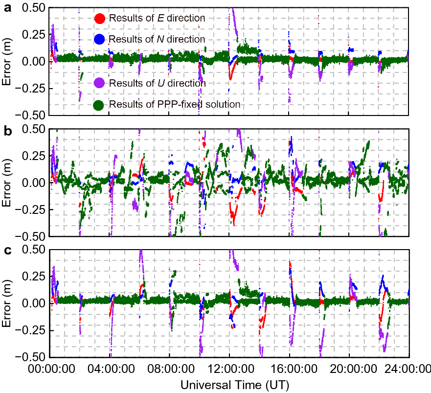
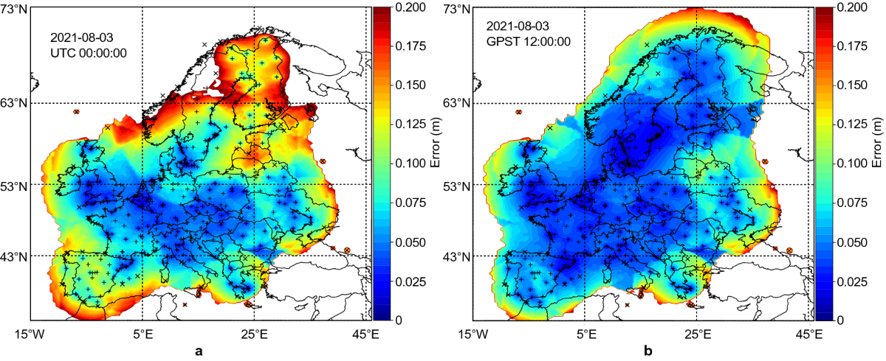
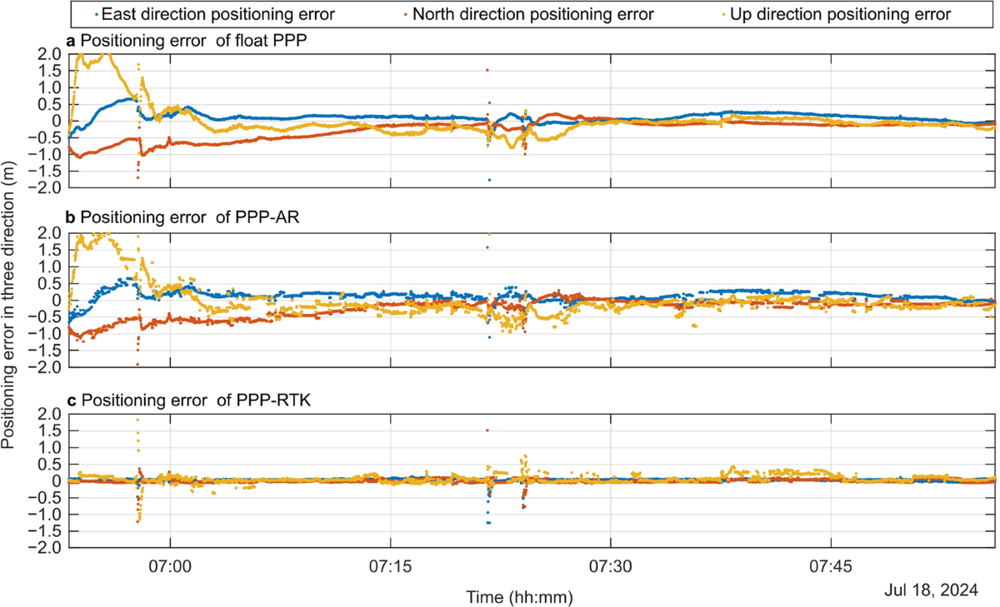

# 2026-09-27 GNSS 每日研究简报

## 今日快报

### 快报 1：完整性监测站不是越均匀越好，凸优化直接按保护级挑位置

- 主题：`ppp-integrity-monitor-convex-station-selection`
- 来源 ID：`ion:gnss2026-16805`
- 来源链接：https://www.ion.org/gnss/abstracts.cfm?paperID=16805
- 发表日期：2026-09-17
- 来源类型：ION GNSS+ 2026 官方扩展摘要、PPP 地基完整性监测网选址与规模设计
- 获取范围：公开扩展摘要全文；稳态信息滤波近似、候选站贡献分解、凸传感器选择、56/200 站示例和既有网络对照已核对，未公开完整目标函数权重、全球保护级地图或求解时间

**内容：** 研究把卫星钟差与星历故障监测网的设计改写成传感器选择：先用稳态信息滤波把各参考站对用户测距误差（URE）协方差的贡献分离，再从数百个候选站中选择固定数量，使目标用户位置的保护级最小。示例从 200 个候选站中选 56 个，并通过增减站数反复检查需求是否满足。

**结论：** 摘要称优化得到的 56 站网络优于人工启发式选择的既有 56 站网络；其前序试验中，56 站网络的 URE 估计精度约 10–20 cm，PPP 用户保护级约 1–2 m。后两组数字属于前序实数 IGS 数据研究，不是本次凸优化示例的新验收结果；摘要也没有给最坏区域、故障注入或完整性风险概率。

**关注理由：** PPP 服务的监测站布局不应只追求地理均匀。把站点几何直接映射到 URE 不确定度与用户保护级，才能判断增加一座站究竟改善哪里、改善多少。

### 快报 2：AIS、ADS-B 与 CYGNSS 交叉佐证干扰，但“没对上”常只是卫星没有经过

- 主题：`multi-domain-gnss-rfi-corroboration`
- 来源 ID：`ion:gnss2026-16839`
- 来源链接：https://www.ion.org/gnss/abstracts.cfm?paperID=16839
- 发表日期：2026-09-17
- 来源类型：ION GNSS+ 2026 官方扩展摘要、海事—航空—星载 GNSS-R 干扰证据融合
- 获取范围：公开扩展摘要全文；41 dB DDM 门限、100 km/±3 h 对齐窗、四级证据、2024-11-01 至 12-31 韩国区域数据和覆盖统计已核对

**内容：** AIS 与 ADS-B 先生成位置异常簇，CYGNSS 则以延迟—Doppler 图噪声底超过 41 dB 且满足多星一致或持续性条件生成射频干扰点。第二阶段按 100 km 空间裕量和 ±3 h 时间窗对齐事件，并以 G3、G2H、G2L、G1 分级；另用 $`N_{obs}`$ 区分“观测过但未报警”和“根本没有覆盖”。

**结论：** 两个月数据含 48 个 AIS 簇、26 个 ADS-B 簇和 21,231 个 CYGNSS 指示样本；最终各有 3 个 AIS 与 ADS-B 簇得到 CYGNSS 佐证，最高只到 G2H，没有 G3。26 个 ADS-B 簇中 20 个、48 个 AIS 簇中 26 个在窗口内没有 CYGNSS 观测，因此未佐证不能当成无干扰；单个星载点即可触发指标，作者也明确提出用随机时间基线检验偶合率。

**关注理由：** 群智监测最危险的统计错误，是把覆盖缺失当阴性样本。这个框架把接收机异常与独立射频环境观测分层，并把“能否交叉检查”单独记账。

### 快报 3：把野外 RF 录像拆成 LOS 与反射，再自动重建可控仿真场景

- 主题：`rf-recording-decomposition-simulator-reconstruction`
- 来源 ID：`ion:gnss2026-16788`
- 来源链接：https://www.ion.org/gnss/abstracts.cfm?paperID=16788
- 发表日期：2026-09-18
- 来源类型：ION GNSS+ 2026 官方扩展摘要、厂商 PNT 记录回放与仿真场景重建方案
- 获取范围：公开扩展摘要全文；RF 记录分解、LOS/多路径参数化、仿真场景自动配置与干扰叠加用途已核对，未公开分解误差、可辨识路径数、数据集或第三方对照

**内容：** 传统记录回放保留真实环境，却不知道每条路径“是什么”；合成仿真可控，却很难复刻某次街谷。方案分析一次 RF 记录，将其分解为逐星直达信号、多路径反射及关键参数，再自动配置 GNSS 仿真器；开发者可在重建场景上增加少见的干扰、欺骗或其他信号并重复测试同一 DUT。

**结论：** 摘要证明的是产品思路和测试流程，没有给路径时延/幅相真值误差、回放与重建相关函数差异或接收机响应一致性。所谓“truth data”是厂商对分解结果的定位，公开材料不足以确认它等同独立场景真值；专利申请中和厂商作者身份也应保留为证据边界。

**关注理由：** 若分解精度可审计，这种流程能把一次昂贵路测变成多个可控反事实试验：保留真实多路径，同时只改变干扰功率、卫星状态或接收机算法。

### 快报 4：Galileo E6C 先录后验，RECS 与 OSNMA 组合给信号来源加密校验

- 主题：`galileo-sas-recs-aposteriori-authentication`
- 来源 ID：`ion:gnss2026-17036`
- 来源链接：https://www.ion.org/gnss/abstracts.cfm?paperID=17036
- 发表日期：2026-09-16
- 来源类型：ION GNSS+ 2026 官方扩展摘要、欧盟 Galileo Signal Authentication Service 早期实现
- 获取范围：公开扩展摘要全文；E6C 加密信号、RECS 下载、E1B OSNMA 延迟解密、MMARIO 服务端/硬件接收机与威胁测试平台已核对，公开页未给检测率、误警率、认证时延或覆盖率

**内容：** SAS 与已投入服务的 OSNMA 互补：接收机先记录 E6 信号快照，并取得重新加密码序列（RECS）；数秒后利用 E1B 上的 OSNMA 数据解密 RECS，再对历史 E6C 快照作后验相关。MMARIO 项目实现早期服务器和实时硬件接收机，并用自生成欺骗、转发、压制以及 Jammertest 记录测试整条链。

**结论：** 摘要说明 2025 年起 L3 卫星进入初始能力阶段，并称原型在标称条件下达到同类商用接收机水平，但性能结果仍写作“将展示”。目前不能引用具体抗欺骗概率，也不能把后验认证解释成零延迟防护；快照缓存、密钥/RECS 获取和 OSNMA 到达都进入告警时延。

**关注理由：** 导航电文认证证明“消息来自谁”，E6C 码相关进一步逼近“信号来自谁”。工程关键从单一密码校验扩展到跨频点时间同步、缓存和延迟告警。

### 快报 5：先用 INS 报警，再把功率匹配的真伪相关峰拆开并分别跟踪

- 主题：`ins-ccaf-iraim-spoofing-separation`
- 来源 ID：`ion:gnss2026-16801`
- 来源链接：https://www.ion.org/gnss/abstracts.cfm?paperID=16801
- 发表日期：2026-09-16
- 来源类型：ION GNSS+ 2026 官方扩展摘要、GNSS/INS 欺骗检测与相关峰分解接收机
- 获取范围：公开扩展摘要全文；累积创新 INS 监测、复交叉模糊函数分解、iRAIM 分组、双 Kalman 滤波器和静/动态数据声明已核对，未公开数据集规模、概率指标或持续导航误差表

**内容：** 紧耦合 INS/GNSS 滤波先累积具有时间结构的创新量，瞄准功率匹配、缓慢拖曳和捕获初期的小偏差；报警后，复交叉模糊函数（CCAF）分解把接收 RF 中的真信号、伪信号与多路径候选分离，iRAIM 跨卫星组装两个自洽集合。两组观测分别进入 GNSS/INS Kalman 滤波，再由 INS 监测器判别哪组可信。

**结论：** 作者称初步静态和动态真实欺骗数据可检测厘米级真值—欺骗预测差异，并分离等功率信号；但没有检测概率、误警率、攻击数量或惯导等级。论文使用“unspoofable”作为目标性表述，现有摘要只支持可行性，不能证明对所有同步、阵列化或多径伪装攻击不可欺骗。

**关注理由：** 只报警会让导航中断，只分峰又可能太晚。把高灵敏检测与信号集合分离接成两阶段，有机会在攻击存在时保留真实信号链，但验收必须看连续解而不只是检测事件。

## 深度研读

### 深读 1｜接收机工程｜电离层改正不是硬常数：先验均值和方差怎样共同拉快 PPP-RTK

- 类别：`receiver-engineering`
- 学习层级：`foundation`
- 选题定位：`经典基础`
- 来源 ID：`doi:10.1186/s43020-022-00067-1`
- 来源链接：https://doi.org/10.1186/s43020-022-00067-1
- 发表日期：2022-03-28
- 来源类型：Satellite Navigation 同行评审 CC BY 4.0 开放论文、外部电离层约束 PPP-RTK
- 获取范围：开放 HTML/PDF 全文；网络/用户 UDUC 模型、不同网络尺度、先验误差与方差、TID 仿真、Figures 1–12 已核对
- 价值评分：96/100（相关性 20，经典价值 19，证据 19，教学价值 20，工程价值 18）

#### 为什么先学这个

PPP-AR 有精密轨道、钟和相位偏差后，模糊度仍会与每星电离层延迟纠缠。PPP-RTK 的关键不是简单“减掉一个电离层数”，而是把网络给出的斜电离层延迟当带不确定度的先验观测。先理解均值与方差怎样进入滤波，才能判断为什么过度自信比不用改正更危险。

#### 先修知识

需要理解伪距、载波相位、未差未组合（UDUC）模型、接收机/卫星钟、对流层湿延迟、斜电离层延迟、硬件码相偏差、整数模糊度、Kalman 滤波、先验方差与总电子含量单位 TECU。文中 1 TECU 在 GPS L1 上约对应 0.162 m 路径延迟，但不同频点按 $`1/f^2`$ 缩放。

#### 一句话逻辑

把参考网插值的每星电离层延迟作为虚拟观测加入用户 UDUC PPP-RTK；改正越准、方差越匹配，坐标—电离层—模糊度相关越快解开，反之错误又被过紧权重锁住时会误固定。

#### 研究问题与约束

作者使用约 190 个中国大陆站的 2020-04-01 至 04-08 数据，比较小、中、大尺度网络、GIM 和 PPP-AR，并向初始电离层延迟注入 0.5/1/3/5 TECU 误差；TID 部分是正弦模拟，不是真实扰动事件。结论依赖双频高等级站、网络固定解和所选随机模型，不能直接外推到低成本单频或极端电离层暴期间。

#### 核心方法论

服务器端用 UDUC PPP 固定模糊度后提取逐站逐星斜电离层延迟，再向用户位置插值。用户端同时估坐标、钟差、对流层、电离层与模糊度，并加一条“用户电离层等于网络插值值加噪声”的虚拟观测。通过改变该噪声方差，论文连续连接三种情况：无约束的 ionosphere-float、带权约束和近似固定电离层。

#### 关键公式逐步推导

对频点 $`i`$，码和相位的核心符号相反：

```math
P_i=\rho+c(\delta t_r-\delta t^s)+mT+\gamma_i I_1+b_i+e_i,
```

```math
L_i=\rho+c(\delta t_r-\delta t^s)+mT-\gamma_i I_1
+\lambda_i(N_i+B_i)+\varepsilon_i,
```

其中 $`\gamma_i=f_1^2/f_i^2`$。网络插值作为虚拟观测：

```math
z_I=I_u-\hat I_{\mathrm{net}}=v_I,
\qquad v_I\sim\mathcal N(0,\sigma_I^2).
```

在正规方程中，它增加信息量 $`1/\sigma_I^2`$：$`\sigma_I\to\infty`$ 时退化为电离层浮点；$`\sigma_I\to0`$ 时近似硬改正。只有 $`\hat I_{\mathrm{net}}`$ 的真实误差与 $`\sigma_I`$ 相称，增加的信息才可靠。

#### 经典价值与创新边界

经典价值是用一个方差旋钮解释 PPP、PPP-AR 与 PPP-RTK 的连续关系，并展示错误先验如何通过模糊度固定放大。创新点是系统比较网络尺度、注入误差和 TID；边界是先验协方差主要按逐星独立处理，真实空间—时间相关、服务延迟与网络共同故障未被完整建模。

#### 整体逻辑链

网络站 UDUC 解算；模糊度固定；提取斜电离层；空间插值到用户；设置先验方差；用户端联合滤波；LAMBDA 固定；按连续保持阈值计算 TTFF；改变网络尺度和注入误差；模拟 TID；观察坐标、固定状态与方差失配。

#### 原文图表与结果分析



> 图表源：Zhang 等《Investigating GNSS PPP–RTK with external ionospheric constraints》Figure 11，[开放全文](https://doi.org/10.1186/s43020-022-00067-1)。CC BY 4.0；直接保存出版社 1200 px 原始 PNG，未裁切或修改曲线、坐标轴、图例和数值。

三幅图横轴为 UT 一天，纵轴为 E/N/U 误差（m）；绿色点为固定解状态。a 无 TID，b 在 1 TECU、0.2 mHz 模拟 TID 下仍使用 0.088 m 的紧方差，c 把方差放宽到 0.38 m。b 出现更长、更密集的大误差与固定异常；c 仍受扰动，但明显比 b 稳。图证明同一错误均值下放宽权重可降低伤害，不能证明 0.38 m 是任意地区的最优值。

#### 原文结果论述

PPP-RTK-GIM 的 TTFF 约 8–10 min，相比约 13–16 min 的 PPP-AR 改善 20%–50%。来自小、中、大尺度网络的约束对应 TTFF 约 4.4、5.2、6.8 min。向初值加入 0.5/1/3/5 TECU 后，对应收敛时间小于 1 min、约 3/5/6 min；TID 仿真中若仍沿用平静期紧方差，会出现超过 10 cm 的持续误差和错误固定。

#### 常见误区与适用边界

第一，把电离层改正当无噪声常数。第二，只广播改正值，不广播可解释精度。第三，认为方差越小越快；均值有偏时恰好相反。第四，把 GIM、区域插值和站间单差的误差单位混用。第五，把仿真 TID 当真实事件统计。第六，只报平均 TTFF，不报错误固定和尾部。第七，忽略改正延迟与空间相关。

#### 工程实现步骤

1. 服务器端先保证载波周跳、相位偏差和固定解质量。
2. 提取逐星斜电离层并保留时间戳、参考星与协方差。
3. 在用户位置插值改正，同时传播网络、距离与时间误差。
4. 将改正作为虚拟观测加入 UDUC 滤波，不直接硬减。
5. 对创新做一致性检验，异常时膨胀 $`\sigma_I`$ 或退回 PPP-AR。
6. 固定后继续监控相位残差、坐标跳变和完整性统计。
7. 分网络尺度、地方时和电离层活动度验收 TTFF 与误固定率。

#### 复现实验设计

选 30/80/150/300 km 四档站间距，平静与扰动日各三天，GPS+Galileo 双频 1 Hz。比较 PPP-AR、硬电离层改正、固定 2/10/30 cm 权重和创新自适应权重；另注入 0.2–3 TECU 阶跃、正弦 TID 与 5–60 s 延迟。指标为正确 TTFF、错误固定率、ENU 50/95/99.9 分位、创新 NIS 与降级持续时间。失败条件是 TTFF 变短却使误固定或尾部误差上升。

#### 与定位及低成本实现的联系

低成本用户最需要快收敛，却也最容易因码噪声和周跳让网络先验失配。第一步应把“改正值”和“可信度”分开传输；下一节进一步解决可信度不能固定为一个区域常数，而要随距离、站密度和时间变化。

#### 本节小结

PPP-RTK 的加速器不是电离层数值本身，而是被正确加权的电离层信息。错误均值配上过紧方差，会把帮助变成错误固定驱动力。

### 深读 2｜接收机工程｜让每五分钟都重新回答“这条电离层改正有多可信”

- 类别：`receiver-engineering`
- 学习层级：`intermediate`
- 选题定位：`基础进阶`
- 来源 ID：`doi:10.1186/s43020-022-00071-5`
- 来源链接：https://doi.org/10.1186/s43020-022-00071-5
- 发表日期：2022-05-26
- 来源类型：Satellite Navigation 同行评审 CC BY 4.0 开放论文、交叉验证驱动的宽域 PPP-RTK 电离层随机模型
- 获取范围：开放 HTML/PDF 全文；UDUC 模型、留一站交叉验证、距离/时间误差函数、欧洲精度地图、31 天/40 用户站定位和 Figures 1–7 已核对
- 价值评分：97/100（相关性 20，经典价值 18，证据 20，教学价值 20，工程价值 19）

#### 为什么先学这个

上一节说明方差失配会出错，但仍需要知道方差从哪里来。用网络残差算一个固定 8 cm 数，只适合相似站距和相似电离层。本文把每座参考站轮流当未知用户，用其余站预测它的斜电离层，再把真实预测误差拟合成随距离变化、每 5 min 更新的随机模型。

#### 先修知识

需要掌握 UDUC PPP-RTK、单星差电离层、空间插值、留一法交叉验证、均方根、异方差、稳健 Kalman 滤波、EPN/SONEL 参考网和 90 分位收敛时间。精度地图给的是估计误差标准差，不是电离层延迟本身，也不是用户坐标误差地图。

#### 一句话逻辑

通过留一参考站交叉验证，实测“某距离、某时段的插值会错多少”，再把这条误差函数传播到用户虚拟观测权重，让稀疏区、夜间或活动期自动少信，密集稳定区自动多信。

#### 研究问题与约束

研究合并约 400 个 EPN 与 SONEL 站，以 40 个不参与建模的用户站验证，处理 31 天欧洲数据；每小时重启 PPP-RTK。地图只在误差不超过 0.2 m 的区域着色。数据属于 2021 年欧洲网络和特定产品质量，5 min 分段、最近三站和距离线性函数不保证适合赤道闪烁、极区或海洋稀疏区。

#### 核心方法论

服务器固定模糊度后获得斜电离层。对每个参考站执行留一预测：用邻站插值得到预测值，与该站固定解电离层相减，按站距拟合每 5 min 的误差函数。用户选择可观测目标星座、距离合适且平均距离最小的局部网络；最近三站既插值改正均值，也插值误差函数产生 $`\sigma_{I,u}`$，再作为 UDUC 虚拟观测的动态方差。

#### 关键公式逐步推导

对留出的站 $`r`$、卫星 $`s`$，交叉验证残差为：

```math
e_{r}^{s}(t)=I_{r,\mathrm{fixed}}^{s}(t)
-\hat I_{r,-r}^{s}(t).
```

在 5 min 窗内，把残差 RMS 拟合为距离函数：

```math
\sigma_I(d,t)=a(t)+b(t)d.
```

用户由邻站权重 $`w_j`$ 得到均值，并传播误差：

```math
\hat I_u^s=\sum_j w_j I_j^s,
\qquad
\sigma_{I,u}^2\approx\sum_j w_j^2\sigma_I^2(d_{uj},t).
```

实际相关误差可能使最后一式偏乐观，因此仍需创新检验和保守下限；本文的核心是让 $`R_I(t)`$ 随服务状态变化，而不是冻结一个经验数。

#### 经典价值与创新边界

经典价值是把改正服务的随机模型变成可重复的交叉验证产品，并同时输出空间覆盖与时间变化。创新边界是经验线性距离模型、5 min 时间片和欧洲密集站网；交叉验证误差包含插值、参考站解和局部异常，但不天然给完整性保护所需的严格概率上界。

#### 整体逻辑链

网络 UDUC PPP-AR；提取固定斜电离层；逐站留一；按距离拟合 5 min 误差函数；生成动态精度地图；用户选局部参考站；插值改正与方差；稳健滤波和固定；对比固定 1/8/30 cm、GIM 与无约束 PPP-AR；统计 31 天 40 站收敛分布。

#### 原文图表与结果分析



> 图表源：Li 等《PPP-RTK considering the ionosphere uncertainty with cross-validation》Figure 4，[开放全文](https://doi.org/10.1186/s43020-022-00071-5)。CC BY 4.0；直接保存出版社 1200 px 原始 PNG，未裁切或修改地图、站点、色条和数值。

左右分别是 2021-08-03 00:00 与 12:00 GPST；色条为斜电离层插值误差 0–0.2 m，超过 0.2 m 的区域不着色。00:00 北欧大片接近或超过 0.2 m，伊比利亚约 0.1 m；12:00 多数区域降至约 0.02–0.05 m。图直接显示同一网络的误差随时空显著变化，不能把深蓝区解释为电离层延迟接近零。

#### 原文结果论述

多数区域和时段的插值 RMS 小于 5 cm，稀疏区某些时段达到 10 cm 以上。GPS 动态权重方案的水平/垂直 90 分位收敛为 4.0/20.5 min，优于固定 8 cm 的 4.5/23.5 min；平均为 2.0/5.0 min。加入 Galileo 后，90 分位降至 2.0/9.0 min，平均 1.4/3.0 min；30 min 后水平、垂直约 2.1/4.4 cm。GLONASS 只作浮点且无高精电离层，因此增益很小。

#### 常见误区与适用边界

第一，把精度地图当改正地图。第二，把 RMS 当完整性上界。第三，留一站仍共享轨道、钟和软件误差，不是完全独立真值。第四，固定 1 cm 看似“高精度”，实为过度自信。第五，认为多星座必然等价；能否固定和是否有匹配电离层产品很关键。第六，忽略无色区代表超过显示上限。第七，把欧洲站密度外推到海洋。

#### 工程实现步骤

1. 为每颗星、每 5 min 保存参考站固定电离层与质量标志。
2. 轮流留出参考站，使用其余站生成预测。
3. 按距离、地方时、纬度和活动指数分桶检查残差。
4. 采用稳健拟合，并设置方差下限与稀疏区上限。
5. 同时广播改正值、标准差、历元、覆盖标志和模型版本。
6. 用户端把动态方差放入虚拟观测，并对创新实时缩放。
7. 对覆盖缺失、延迟和突变设计退回 PPP-AR 的状态机。

#### 复现实验设计

从同一大陆网构造 50/100/200/400 km 四种稀疏度，每次留出 20% 站作为独立用户，跨平静/扰动各 30 天。比较固定方差、距离函数、5 min 交叉验证、时空高斯过程和保守上界模型。指标为电离层残差 RMS/95/99.9 分位、NIS 覆盖率、正确 TTFF、误固定率、带宽和计算量；训练月份与测试月份分离。若均值改善但 99.9 分位欠包络，则判定随机模型失败。

#### 与定位及低成本实现的联系

动态精度产品让低成本用户知道何时能依赖区域改正、何时应降级，而多系统只在服务端和用户端的偏差/电离层产品一致时发挥作用。下一节把这套逻辑放进现代多频多星座全链路，观察 PPP、PPP-AR、PPP-RTK、PPP-B2b 与 HAS 的实际差别。

#### 本节小结

高质量改正服务必须同时回答“改多少”和“可信多少”。交叉验证把第二个问题变成随距离和时间更新、可用留出站核验的工程产品。

### 深读 3｜纯 GNSS 定位｜多频多系统并不只加观测：偏差、几何和大气产品必须一起闭合

- 类别：`positioning`
- 学习层级：`advanced`
- 选题定位：`定位深入`
- 来源 ID：`doi:10.1186/s43020-025-00169-6`
- 来源链接：https://doi.org/10.1186/s43020-025-00169-6
- 发表日期：2025-07-01
- 来源类型：Satellite Navigation 同行评审 CC BY 4.0 开放论文、新一代多频多 GNSS PPP/PPP-AR/PPP-RTK 综合评估
- 获取范围：开放 HTML/PDF 全文；UDUC 多频模型、OSB/UPD、EWL-WL-NL 级联固定、大气格网、全球与欧洲/武汉试验、PPP-B2b/HAS、Figures 1–23 与 Tables 1–11 已核对
- 价值评分：98/100（相关性 20，经典价值 18，证据 20，教学价值 20，工程价值 20）

#### 为什么先学这个

前两节只聚焦电离层权重，真实系统还要让每个频点的码/相位偏差、整数定义、星座钟基准和大气改正一致。多频可以构造超宽巷并缩短搜索，多星座改善几何，但若某系统只有浮点产品、初始固定星太少或地面网稀疏，理论冗余不会自动变成瞬时厘米解。

#### 先修知识

需要理解 UDUC PPP、可估参数基准、observable-specific bias（OSB）、uncalibrated phase delay（UPD）、超宽巷/宽巷/窄巷（EWL/WL/NL）、级联模糊度固定、Kriging 与反距离插值、大气虚拟观测、PPP-B2b、Galileo HAS、PDOP、TTFF 和动态/静态重启试验。

#### 一句话逻辑

服务器先把多频多星座观测统一成可供用户恢复整数性的 OSB/UPD，并生成电离层/对流层格网；用户再按 EWL→WL→NL 逐级固定，只有偏差、几何、大气与用户观测同时可用时，PPP-RTK 才能从分钟级 PPP-AR 进入单历元收敛。

#### 研究问题与约束

PPP-AR 使用 2024-04-01 的 100 个产品站和 120 个验证站并每 4 h 重启；欧洲 PPP-RTK 用 11 个建模站、6 个验证站，平均站距 462 km，早期固定星不足使 00:00–04:00 被排除；武汉车辆试验是单路线。PPP-B2b 用 2023 年 6 个有效日、5 站，HAS 用 2024-01-07 的 100 站。不同服务试验日期、接收机与阈值不同，不能直接作同条件产品排名。

#### 核心方法论

服务器对 GPS、Galileo、BDS-2/3 多频数据运行 UDUC PPP，按时间稳定性估 EWL/WL/NL UPD，再转换为逐观测 OSB；区域网只使用固定卫星解生成单差电离层与对流层格网。用户改正轨道、钟和 OSB，先浮点，再按 EWL、WL、NL 级联固定；PPP-RTK额外以格网大气及其方差约束状态。论文分别用全球站、欧洲模拟动态、武汉车辆和广播服务数据验收不同层。

#### 关键公式逐步推导

多频 UDUC 观测仍遵循：

```math
P_k=\rho+c(\delta t_r-\delta t^s)+\gamma_k I_1+mZ
+(b_{r,k}-b_k^s)+e_k,
```

```math
L_k=\rho+c(\delta t_r-\delta t^s)-\gamma_k I_1+mZ
+\lambda_k(N_k+B_{r,k}-B_k^s)+\varepsilon_k.
```

服务器 OSB 使用户改正后的相位模糊度重新具备整数结构。对两个频点 $`i,j`$，宽巷组合波长为：

```math
\lambda_{WL}=\frac{c}{|f_i-f_j|},
```

频差越小，组合波长越长、整数更易固定，但组合噪声和偏差也需一致传播。大气约束再以：

```math
I_u^s-\hat I_{\mathrm{grid}}^s\sim
\mathcal N(0,\sigma_{I,u,s}^2)
```

进入用户滤波，最终形成“偏差恢复整数性 + 多频降低搜索难度 + 大气解除相关”的闭环。

#### 经典价值与创新边界

经典价值是把现代 PPP 各服务层放在同一 UDUC/OSB 框架中，并用全球、区域、车辆和广播服务实验展示产品依赖。创新边界是大而异质的评估集合：不同实验并非同日同站同接收机；欧洲最初四小时被排除，车辆只有一次，广播 PPP-B2b/HAS 只做浮点，因此不宜把所有百分比拼成统一排行榜。

#### 整体逻辑链

多频观测清洗；服务器 UDUC PPP；估计 EWL/WL/NL UPD；转换 OSB；评估偏差内部残差；用户 PPP 浮点；级联 PPP-AR；区域固定解提取大气；格网插值与方差；用户 PPP-RTK；分别验证静态、模拟动态、车辆、PPP-B2b 与 HAS；按收敛、固定率、TTFF 和 ENU RMS 分层报告。

#### 原文图表与结果分析



> 图表源：Zhang 等《Performance of PPP and PPP-RTK with new-generation GNSS constellations and signals》Figure 19，[开放全文](https://doi.org/10.1186/s43020-025-00169-6)。CC BY 4.0；直接保存出版社 1200 px 原始 PNG，未裁切或修改曲线、坐标轴、图例和数值。

三幅图为同一武汉车辆时段的浮点 PPP、PPP-AR 与 PPP-RTK，横轴约 06:55–07:55，纵轴 E/N/U 误差（m）。浮点和 PPP-AR 初始误差接近 2 m，并在卫星变化处出现尖峰；PPP-RTK 大部分时间压在分米内，仍有少量约 1–2 m 瞬态。图支持区域大气约束显著加快该路线收敛，不能证明全程厘米、也不能将尖峰唯一归因于某颗卫星。

#### 原文结果论述

全球 PPP-AR 中，多系统 NL 固定率约 97%，静态/动态浮点平均收敛 7.29/8.90 min，固定后为 4.59/5.30 min；固定解静态 ENU RMS 为 0.59/0.48/1.87 cm，动态为 0.80/0.71/2.79 cm。区域大气模型良好时，多数 PPP-RTK 重启可单历元收敛；武汉复杂车辆试验称精度改善约 70%。PPP-B2b 五频相对双频收敛改善 29%，HAS 的 GPS+Galileo 相对 Galileo 单系统收敛改善 64%，但两者使用较宽的 0.3 m 水平、0.6 m 垂直并持续 5 min 阈值。

#### 常见误区与适用边界

第一，把固定率当正确固定率。第二，把不同试验的收敛阈值混为一谈。第三，认为频点越多必然更好；噪声和 OSB 稳定性可能抵消收益。第四，忽略初始固定星不足而被排除的数据。第五，把欧洲模拟动态等同实车。第六，用单路线 70% 改善代表全球。第七，把 PPP-B2b/HAS 浮点服务结果当 PPP-AR。第八，混淆毫米级 RMS 与实时绝对完整性。

#### 工程实现步骤

1. 明确每系统每频点的码、相位、钟和 OSB 基准。
2. 按 EWL/WL/NL 的时间稳定性分别估计并监控偏差。
3. 用户端只使用与产品定义完全匹配的观测组合。
4. 级联固定时记录每级候选、成功率、ratio 与残差。
5. 区域网只用质量通过的固定解生成大气产品。
6. 广播大气均值、方差、龄期、覆盖和降级标志。
7. 对星集突变、OSB 中断和改正延迟设置回退路径。
8. 用统一阈值同时报告正确固定、尾部误差和可用率。

#### 复现实验设计

建立 GPS/Galileo/BDS 双频、三频和全频三套用户配置；同一 30 天全球站与三条车辆路线同时输入同一轨道钟。比较 float PPP、PPP-AR、固定 10 cm 电离层 PPP-RTK、动态方差 PPP-RTK、PPP-B2b 和 HAS；统一收敛为水平 <0.10 m、垂直 <0.20 m 且保持 10 min。指标为正确 TTFF、错误固定、ENU 95/99.9 分位、产品龄期、带宽和 CPU；强制保留所有失败弧和初始四小时。

#### 与定位及低成本实现的联系

低成本终端往往不能同时接收所有频点，也未必有外部定位引擎算力。服务器应允许同一改正流支持不同频点子集，并明确缺频时的整数与大气模型；用户则要在“更多观测”和“稳定可校准观测”之间选择，而不是盲目全开。

#### 本节小结

现代 PPP-RTK 的瞬时性来自四件事同时成立：观测够多、偏差定义一致、整数能可靠固定、大气改正有可信方差。缺任何一环，多频多系统都可能只增加状态而不增加可用精度。
