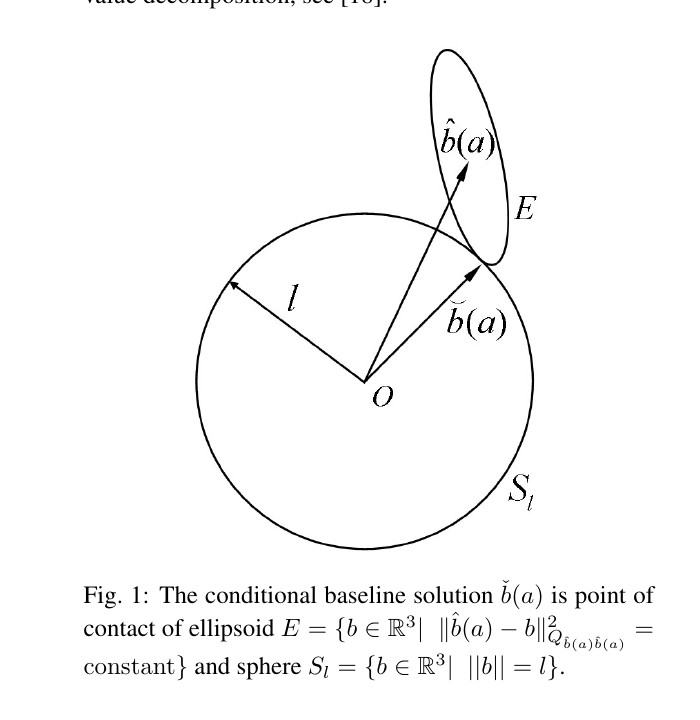
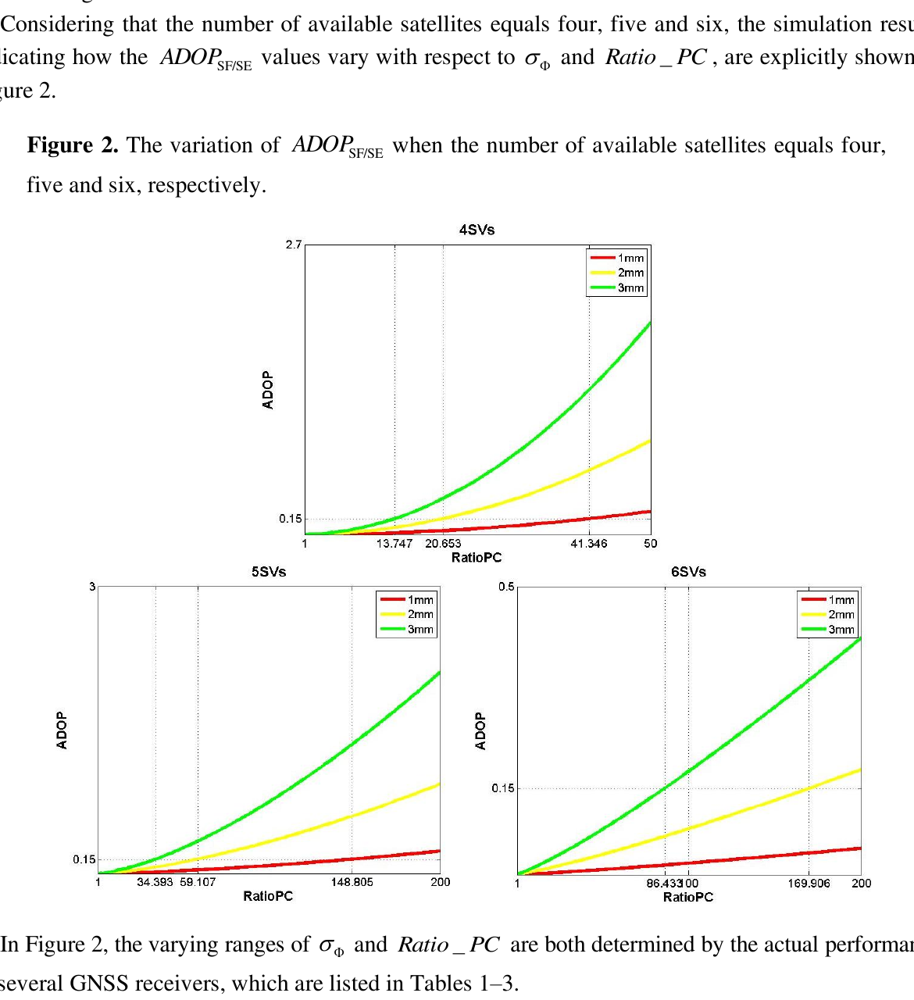
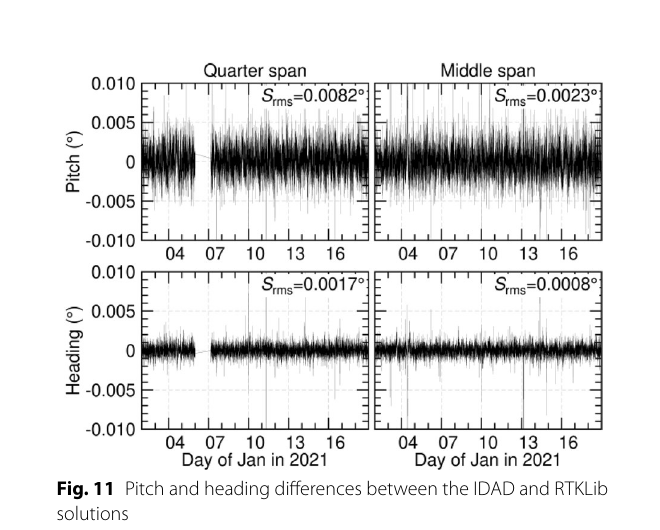

# 2026-09-28 GNSS 每日研究简报

## 今日快报

### 快报 1：质量指标不直接回归误差，而是先决定手机 PPP 应相信哪个历元

- 主题：`smartphone-ppp-error-aware-temporal-attention`
- 来源 ID：`ion:gnss2026-16853`
- 来源链接：https://www.ion.org/gnss/abstracts.cfm?paperID=16853
- 发表日期：2026-09-16
- 来源类型：ION GNSS+ 2026 官方扩展摘要、质量感知时序学习辅助手机 PPP
- 获取范围：公开扩展摘要全文；EACNN/MLP 结构、120/30 数据划分、多机型外测、SLS-PPP 对照与总体误差指标已核对，未公开逐路线分位数、消融表、模型规模或端侧时延

**内容：** 方法把滑窗内的时序卷积与自注意力表示，同信号强度、卫星几何和可见星数形成的显式质量评分共同用于历元权重；并行 MLP 对逐历元特征作均值池化，保留整体偏差与趋势。两路表示融合后估计位置误差，再接入顺序最小二乘 PPP，而不是让质量指标直接成为一个不可解释的坐标改正量。

**结论：** 在 GSDC 2022 与多伦多数据组成的 120 组训练、30 组测试中，摘要报告总体水平 RMS 从 2.8 m 降到 2.0 m，中位误差从 2.5 m 降到 1.5 m；测试还覆盖 Pixel 4/4XL、5、6 Pro、Samsung S20 Ultra 与 Xiaomi Mi8。29%/40% 是该数据划分上的作者结果；没有路线级尾部、训练—测试地域隔离细节或移动端运行数据，不能据此声称普适跨设备实时性。

**关注理由：** 传统经验定权常把 C/N0 或高度角固定映射到方差。把质量指标只用于控制时序聚合，保留了学习非线性误差的能力，也让“坏历元为何被降权”更容易审计。

### 快报 2：五频单星级联把码噪声逐层洗入载波，但 12.7 mm 仍是测距精度

- 主题：`standalone-galileo-five-frequency-narrowlane-ranging`
- 来源 ID：`ion:gnss2026-16939`
- 来源链接：https://www.ion.org/gnss/abstracts.cfm?paperID=16939
- 发表日期：2026-09-17
- 来源类型：ION GNSS+ 2026 官方扩展摘要、厂商作者的无网络 Galileo 五频窄巷级联测距
- 获取范围：公开扩展摘要全文；七级频间级联、PAC 连续组合、自标定、82 站两日数据、固定一致性检查与作者性能数字已核对，未取得可独立复算的完整实现或最终多星定位结果

**内容：** 方法在同一颗 Galileo 卫星的 E1/E5a/E5/E5b/E6 间作七级窄巷级联，以连续“phase-aligned combinations”保存每级的分数周、距离和电离层信息，不像逐级整数舍入那样重新引入全部码噪声。卫星钟在同星频间差中消掉，剩余频间相位硬件偏差由单接收机自标定；最终把 105 mm 窄巷接到绝对载波整数。

**结论：** 作者在 82 个加拿大 CACS 站、2026 年 DOY 001/040 两天、每日约 160 万个相邻历元转移上报告：2.93 m 波长阶段成功率 99.86%，105 mm 窄巷全站逐历元成功率 73.5%，较好环境站为 82%；10 Hz 下 10 历元多数投票在较好站超过 99.5% 置信度。12.7 mm 是无精密轨道钟产品时的逐星无电离层测距精度，并非单历元绝对定位准确度；摘要给出的中位 HDOP 3.18 和约 4 cm 水平“精度”仍是几何传播推算。

**关注理由：** 它把“必须有网络偏差产品”的争论缩到可估参数定义：不是直接宣称单机 PPP-AR，而是先在频间域构造更强的首历元逐星观测。下一步必须用独立真值检查多星位置、跨接收机标定和错误窄巷别名。

### 快报 3：GNSS、LEO 与 5G 共用时间基准，但目前融合结果只覆盖 GNSS+5G

- 主题：`time-coherent-gnss-leo-5g-hybrid-terminal`
- 来源 ID：`ion:gnss2026-16972`
- 来源链接：https://www.ion.org/gnss/abstracts.cfm?paperID=16972
- 发表日期：2026-09-16
- 来源类型：ION GNSS+ 2026 官方扩展摘要、GERMINAL 多源通信—导航统一终端实测架构
- 获取范围：公开扩展摘要全文；四类信号链、共同 OCXO、输出观测、子系统验证与 GNSS+5G TN 初始融合边界已核对，未公开完整误差分布或五源 EKF 结果

**内容：** 终端为双频 GNSS/类 GNSS LEO-PNT、5G TN/受控 NTN、Orbcomm/Iridium/Starlink/Globalstar 机会信号分别配置采集与观测提取链，再用共同 OCXO 和时钟分配把伪距、载波、Doppler、TOA/TDOA/FDOA 与质量指标对齐。实时链覆盖 GNSS/LEO-PNT 和 5G，高速记录链用于机会信号离线处理。

**结论：** 公开结果支持各子系统可产生观测，也报告测试配置中 GNSS+5G TN TDOA 的 NLS 水平误差达到亚米级；但真正进入联合位置解的只有这两类观测。LEO-PNT、5G NTN 与 LEO-SOP 的全源 EKF 融合仍是未来工作，不能把“统一终端能接收”写成“五源融合已提高韧性”。

**关注理由：** 异构 PNT 最容易忽略跨射频链的时间基准。共同振荡器与统一时间戳先让残差可比较，再谈融合或交叉一致性监测，这比简单拼接多个厂商位置输出更接近可验证系统。

### 快报 4：先按环境把误差分层，再在每层内做传统高斯包络

- 主题：`ml-conditioned-gaussian-multipath-overbounding`
- 来源 ID：`ion:gnss2026-17010`
- 来源链接：https://www.ion.org/gnss/abstracts.cfm?paperID=17010
- 发表日期：2026-09-18
- 来源类型：ION GNSS+ 2026 官方扩展摘要、机器学习辅助 GNSS 多路径完整性包络
- 获取范围：公开扩展摘要全文；两层结构、质量类别输入、Mpsim 与 UrbanNav 数据来源和“同要求下更紧”结论已核对，未公开类别混淆矩阵、尾部样本数、失配类包络证明或保护级结果

**内容：** 第一层用伪距、C/N0、可见星数等特征，把历元环境与单观测质量分成开阔、城市、密集城市以及 LOS/NLOS/多路径等离散类别；第二层不让神经网络直接承诺完整性，而是在每个相对同质类别中继续使用 paired/two-step Gaussian overbounding 构造保守误差模型。

**结论：** 摘要称 MATLAB Mpsim 仿真和 UrbanNav 实测上，分类后包络在相同要求下更紧，但没有给覆盖违约次数、目标尾概率、置信区间或保护级收益。分类错误会把样本送入错误包络，故“类内保守”并不自动推出端到端完整性风险受控；这仍需把分类不确定性纳入上界。

**关注理由：** 学习模型可以负责把非平稳误差分区，经典统计方法负责尾部约束。二者的接口——类别错误如何进入风险预算——比平均回归精度更值得完整性系统关注。

### 快报 5：三频 PPP 的 95% 三分钟收敛来自厂商样例，后台切换仍要单独验连续性

- 主题：`global-ppp-service-state-latency-failover`
- 来源 ID：`ion:gnss2026-16978`
- 来源链接：https://www.ion.org/gnss/abstracts.cfm?paperID=16978
- 发表日期：2026-09-17
- 来源类型：ION GNSS+ 2026 官方扩展摘要、Topcon StarPoint 全球 PPP 服务架构与厂商验证
- 获取范围：公开扩展摘要全文；完整性监测、分布式低时延流水线、双/三频模式、故障转移及三频收敛样例已核对，未公开区域/终端分层样本、收敛阈值或独立第三方验证

**内容：** 服务把轨道、钟和偏差生产扩展成四条运行链：改正与服务状态监测、全球分布式低时延处理、实时状态同步与自动故障转移、面向运维报告的生成式 AI。确定性改正生成仍由传统流水线执行，AI 层只读遥测、历史指标和报告，不进入卫星改正数值本身。

**结论：** 摘要称多地区现场验证中，后端切换和网络变化时仍保持厘米级，并给出三频方案 95% 案例在 180 s 内收敛；但没有定义厘米阈值、保持时间、初始化方式、地区权重或样本量。它证明的是厂商样例中的运行可行性，不能替代独立的改正龄期尾部、故障注入和错误固定验收。

**关注理由：** 实时 PPP 服务的失效常发生在算法之外：跨区域延迟、状态切换、异常星传播和回退重收敛。把这些量显式做成服务状态，比只发布日均坐标 RMS 更贴近生产系统。

## 深度研读

### 深读 1｜接收机工程｜已知基线长度不是事后验算：它会重排整数候选

- 类别：`receiver-engineering`
- 学习层级：`foundation`
- 选题定位：`经典基础`
- 来源 ID：`proceedings:isgps2008-teunissen-gnss-attitude`
- 来源链接：https://research.tudelft.nl/en/publications/gnss-ambiguity-resolution-for-attitude-determination-theory-and-m/
- 发表日期：2008-11-11
- 来源类型：International Symposium on GPS/GNSS 2008 同行评审会议论文、基线约束 LAMBDA 理论
- 获取范围：机构页面与作者公开 PDF 全文；标准/加权/二次约束 ILS、上下界、search-and-shrink、单频单历元示例表已核对
- 价值评分：95/100（相关性 20，经典价值 20，证据 18，教学价值 20，工程价值 17）

#### 为什么先学这个

双天线航向不是先算两点坐标再相减这么简单。短基线、单频、单历元时，码噪声使浮点模糊度过散；但两副天线刚性安装后，基线长度在解算前就已知。把这一物理事实直接写进整数目标函数，才能理解后续各种“基线约束”“坐标域搜索”和 GNSS 罗经为何有效。

#### 先修知识

需要理解接收机间与卫星间双差、载波整周模糊度、实数最小二乘、协方差椭球、整数最小二乘、LAMBDA、基线向量、航向/俯仰，以及硬约束与带方差伪观测的差别。

#### 一句话逻辑

普通 LAMBDA 只问哪个整数离浮点模糊度最近；基线约束 LAMBDA 还问这个整数对应的条件基线离“半径为已知长度的球面”多远，于是几何不可能的整数即使靠近浮点中心也会被降权。

#### 研究问题与约束

论文聚焦两天线单基线，输出航向与仰角；重点是理论与典型成功率，不是跨设备实测基准。最具挑战的是单频、单历元、短基线。已知长度必须来自刚性安装和可靠标定；机翼形变、热胀或天线相位中心变化会让硬球面失真，因此论文同时给出带方差的软约束。

#### 核心方法论

先对线性 GNSS 模型求浮点模糊度 $`\hat a`$ 和给定整数 $`a`$ 时的条件基线 $`\hat b(a)`$。标准 ILS 只最小化整数距离；二次约束 ILS 强制 $`\|b\|=l`$；加权版本把长度 $`l`$ 当作方差为 $`\sigma_l^2`$ 的额外观测。非线性目标通过易算的上下界缩小整数集合，再在剩余集合里做精确 search-and-shrink。

#### 关键公式逐步推导

标准双差模型写为：

```math
E(y)=Aa+Bb,\qquad D(y)=Q_{yy},
```

其中 $`a\in\mathbb Z^n`$ 为整周模糊度，$`b\in\mathbb R^3`$ 为基线。加入长度伪观测：

```math
E(l)=\|b\|,\qquad D(l)=\sigma_l^2.
```

于是联合目标为：

```math
\min_{a\in\mathbb Z^n,b\in\mathbb R^3}
\left\{\|y-Aa-Bb\|_{Q_{yy}}^2
+\sigma_l^{-2}(l-\|b\|)^2\right\}.
```

$`\sigma_l^2\to\infty`$ 时退回普通 ILS；$`\sigma_l^2\to0`$ 时成为硬长度约束。对每个整数，新增项等价于量化其条件基线到球面的距离，因此整数排序被真正改变，而不是固定后才检查长度。

#### 经典价值与创新边界

经典价值在于把机械先验、随机模型和整数搜索放进同一最小二乘框架，并区分三类问题：强模型直接用标准 LAMBDA；较长基线可在约束浮点解处二次近似；极短单频单历元必须保留完整曲率。边界是单基线理论，没有现代多星座偏差、动态多路径、错误固定概率或实时实现统计。

#### 整体逻辑链

双差观测建模；求浮点解与协方差；为每个整数构造条件基线；引入已知长度及其方差；计算约束目标上下界；用近似解初始化搜索半径；枚举并收缩候选集合；选精确整数极小值；回代基线；从 ENU 分量计算航向与仰角。

#### 原文图表与结果分析



> 图表源：Teunissen《GNSS Ambiguity Resolution for Attitude Determination: Theory and Method》Figure 1，[机构条目](https://research.tudelft.nl/en/publications/gnss-ambiguity-resolution-for-attitude-determination-theory-and-m/)，作者公开 PDF。由 PDF 第 3 页 180 dpi 渲染后仅裁出原图、原图注与相邻公式片段用于研究评论；未修改符号和几何，不主张额外再分发授权。

圆 $`S_l`$ 是已知长度球面在二维示意中的截面，椭圆 $`E`$ 是给定整数 $`a`$ 后条件基线 $`\hat b(a)`$ 的协方差等值线。约束解 $`\check b(a)`$ 不是简单把向量按比例归一化，而是在协方差度量下寻找椭球与球面的接触点。图说明不同方向的不确定度会改变投影，不能据此判断某个整数已正确。

#### 原文结果论述

论文 Table 1 的典型单频、单历元、短基线普通 ILS 成功率显示：当未差相位标准差为 3 mm、未差码标准差分别为 30/15/5 cm 时，5 星成功率为 3.3%/19.1%/86.7%，8 星为 86.2%/94.5%/99.9%。这些是说明模型强度的典型值，不是本文独立实测；它们支持“少星+噪码时普通模型太弱”，不直接量化加入长度约束后的现场错误固定率。

#### 常见误区与适用边界

第一，把已知长度只用作固定后阈值。第二，把硬约束用于会形变的平台。第三，认为短基线更容易；同样毫米基线误差会映射成更大角误差，曲率也更强。第四，把近似二次目标用于极短基线。第五，只报候选 ratio，不报告随机模型与错误固定。第六，把两天线的航向/俯仰误写成完整三轴姿态。

#### 工程实现步骤

1. 标定天线相位中心间长度及其温度/载荷稳定度。
2. 形成同步双差码与相位，传播完整协方差。
3. 求浮点模糊度、基线和交叉协方差。
4. 按结构稳定性设置 $`\sigma_l`$，避免盲目硬约束。
5. 用约束浮点解或目标下界初始化整数搜索半径。
6. 对候选整数求条件基线到球面的加权距离。
7. 固定后继续检查相位残差、长度创新和姿态跳变。

#### 复现实验设计

构造 0.15/0.30/1.00/3.00 m 四档刚性基线，GPS+Galileo L1/E1 单频 1 Hz；在 5–10 星、码噪声 0.05–3 m、相位噪声 1–10 mm 下做每格 10 万次蒙特卡洛，并加入 0/2/10 mm 长度标定偏差。比较普通 LAMBDA、硬约束、1/5/20 mm 软约束与固定后长度门。指标为正确固定率、错误固定率、拒绝率、航向/俯仰 95/99.9 分位、候选数和耗时；失败条件是总固定率上升但错误固定率或尾部角误差恶化。

#### 与定位及低成本实现的联系

低成本接收机码噪声大，恰好是长度先验最有价值的场景；但低成本天线相位中心和安装结构也更不稳定。下一节绕过高噪声码和浮点模糊度中心，直接在已知长度球面上搜索载波分数周是否一致。

#### 本节小结

基线长度不是一个“验算数字”，而是一条能改变整数目标地形的观测。约束越强，搜索越集中；长度模型若错，错误整数也会被更强地推成看似合理。

### 深读 2｜接收机工程｜惯性姿态不是替代 GNSS：它先把模糊度搜索椭球压瘦

- 类别：`receiver-engineering`
- 学习层级：`intermediate`
- 选题定位：`基础进阶`
- 来源 ID：`doi:10.3390/s140711395`
- 来源链接：https://doi.org/10.3390/s140711395
- 发表日期：2014-06-26
- 来源类型：Sensors 同行评审 CC BY 3.0 开放论文、MEMS-IMU 姿态辅助单频单历元 GNSS 定整
- 获取范围：开放 HTML/PDF 全文；IDBV、模糊度协方差、ADOP 强度分析、低成本观测统计、固定失败率整数孔径与 10 万次蒙特卡洛阈值设计已核对
- 价值评分：94/100（相关性 20，经典价值 18，证据 18，教学价值 20，工程价值 18）

#### 为什么先学这个

上一节只用刚性基线长度，单频单历元模型仍可能太弱。若平台已有低成本 IMU，就能把惯性姿态转成“这条基线现在大概指向哪里”的三维先验。关键不是用 INS 航向覆盖 GNSS，而是把该先验及其协方差映射到浮点模糊度空间，缩小整数搜索，再由 GNSS 载波决定最终整数。

#### 先修知识

需要理解捷联惯导姿态矩阵、体坐标/导航坐标、双差码与相位、浮点模糊度协方差、误差传播、ADOP、整数孔径估计、ratio/difference test、固定失败率和 MEMS 陀螺零偏/角随机游走。

#### 一句话逻辑

用 IMU 姿态矩阵把已标定体坐标基线旋到导航系，得到带协方差的惯性派生基线向量（IDBV）；把它当作附加观测更新模糊度协方差，使 ADOP 降低、候选整数减少，再用固定失败率门决定接受还是拒绝。

#### 研究问题与约束

论文针对最弱的单频、单历元 GNSS 罗经，主要是理论推导和仿真，不是道路实测。卫星几何取 Yuma 星历下长沙 12 h 可见性，GNSS 噪声参考数款 OEM 板卡静态统计；MEMS 参数用四组零偏/噪声组合。仿真假定初始姿态与 IMU 误差模型已知，不能直接外推到磁干扰、剧烈振动、时间不同步或 IMU 温漂未建模场景。

#### 核心方法论

已知体坐标基线 $`\bar b^b`$ 与惯性姿态 $`C_b^n`$ 先生成 IDBV $`b_I^n`$。论文把 IDBV 误差传播到 GNSS 模糊度浮点解，得到辅助后的协方差 $`Q_{\hat a_I}`$，再用 ADOP 将高维整数搜索体积压成一个周期量纲指标。最后不是固定阈值 ratio，而是以 10 万次蒙特卡洛为给定失败率标定 ratio/difference test 阈值。

#### 关键公式逐步推导

惯性派生基线为：

```math
b_I^n=C_b^n\bar b^b.
```

把它写成带噪附加观测并与 GNSS 模型联合，信息形式的模糊度协方差可概括为：

```math
Q_{\hat a_I}^{-1}
=Q_{\hat a}^{-1}+H_I^{\mathsf T}Q_I^{-1}H_I,
```

其中 $`Q_I`$ 来自 IMU 姿态误差、基线长度和安装误差传播。若模糊度维数为 $`d`$，ADOP 定义为：

```math
\operatorname{ADOP}=\det(Q_{\hat a})^{1/(2d)}.
```

附加信息为正半定时，$`Q_{\hat a_I}`$ 不大于原协方差，故搜索椭球体积和 ADOP 下降；但这只在 $`Q_I`$ 与真实误差匹配时成立，过度自信的姿态先验会把正确整数排除。

#### 经典价值与创新边界

经典价值是把“IMU 能帮助定整”从经验框图推进到模糊度协方差和 ADOP 的量化，并把验收改成显式固定失败率。创新边界是结果来自仿真，固定失败率阈值仍依赖所设噪声、卫星数与动力学；IDBV 省略或低估 IMU 偏差、杆臂与同步误差时，理论风险控制不会自动成立。

#### 整体逻辑链

标定体坐标基线；初始化姿态；积分 MEMS 陀螺；生成 IDBV 与协方差；建立单频单历元双差 GNSS 模型；求未辅助浮点模糊度；加入 IDBV 信息更新协方差；计算 ADOP；整数搜索；按目标失败率标定的 ratio/difference test 验收；统计正确、拒绝与错误固定。

#### 原文图表与结果分析



> 图表源：Zhu 等《The Inertial Attitude Augmentation for Ambiguity Resolution in SF/SE-GNSS Attitude Determination》Figure 2，[开放全文](https://doi.org/10.3390/s140711395)。CC BY 3.0；由原版 PDF 第 11 页 180 dpi 渲染后仅裁出原图、图注及必要上下文，未修改曲线、坐标轴、图例或数值。

三幅图分别为 4/5/6 颗卫星，横轴 `RatioPC` 是码噪声与相位噪声的比例，纵轴为未辅助模型 $`ADOP_{SF/SE}`$（周）；红/黄/绿对应 1/2/3 mm 相位噪声，虚线 0.15 是论文采用的 99% 成功率参考。卫星数增多和相位噪声降低会显著压低 ADOP；图没有画惯性辅助后的 ADOP，也不能证明任意 IMU 都能把曲线压到阈值下。

#### 原文结果论述

论文判断：4 星时，现实低成本码相噪声比难使未辅助 ADOP 低于 0.15；5 星且相位噪声不小于 2 mm 时仍困难；6 星且相位噪声不超过 1 mm 时，所考察噪声比内可低于 0.15。惯性辅助仿真中，4 星即使用最好 MEMS 参数，保持 ADOP≤0.15 也不超过约 2 min；5 星对基线与 IMU 等级敏感；6 星时各组合可保持超过 3 min。这里的时间来自设定陀螺漂移仿真，不是现场可用性保证。

#### 常见误区与适用边界

第一，把 ADOP≤0.15 当普适成功率定理；映射依赖模型与维数。第二，把 IMU 姿态直接当最终姿态。第三，只计陀螺白噪声与常值偏置，忽略温漂和振动整流。第四，用仿真标定的 ratio 阈值处理分布迁移后的实车数据。第五，卫星增加时忽略低仰角多路径。第六，只报接受率，不报固定失败率。第七，忽略 GNSS—IMU 时间同步与杆臂方向误差。

#### 工程实现步骤

1. 标定双天线体坐标基线、IMU 安装角和时间偏差。
2. 在线估计陀螺零偏并传播姿态协方差。
3. 将姿态与基线误差传播为 IDBV 协方差，不只给一个角标准差。
4. 同步形成单历元双差码相模型与浮点协方差。
5. 以信息矩阵方式融合 IDBV，检查创新一致性。
6. 计算 ADOP 和候选数，模型弱时允许拒绝。
7. 以目标失败率离线标定门限，并用独立数据回测。
8. 固定后用载波残差、基线长度和 INS 创新持续监控。

#### 复现实验设计

用 0.3/1/2 m 三档双天线基线与三种 MEMS 等级，采开阔、树荫、城市转弯数据各 20 条；高等级光纤惯导和测量级多天线 GNSS 提供独立整数/姿态真值。比较无辅助 LAMBDA、仅长度约束、IDBV 辅助和过紧 IDBV；按 4–10 星、1–10 mm 相位噪声、0–50 ms 时间偏差分桶。指标为 ADOP、候选数、正确/错误接受率、拒绝率、姿态 99.9 分位和恢复时间；训练阈值与测试路线隔离。

#### 与定位及低成本实现的联系

低成本系统可以用一枚 MEMS 把弱 GNSS 模型推入可固定区，但辅助传感器也引入新的共同故障与校准账。下一节展示另一条纯 GNSS 路线：用多监测点和长基线的内部几何，在一个 UKF 中联合估位移、姿态和整数，不依赖 IMU 作为当前解的外部姿态源。

#### 本节小结

惯性姿态的作用不是替 GNSS 报一个角，而是以可传播的不确定度压缩整数搜索空间。只有当姿态先验、阈值标定和真实误差分布一致时，ADOP 改善才会转成受控的正确固定。

### 深读 3｜纯 GNSS 定位｜长桥不是先定位再算姿态：把位移与四元数放进同一 UKF

- 类别：`positioning`
- 学习层级：`advanced`
- 选题定位：`定位深入`
- 来源 ID：`doi:10.1186/s43020-025-00174-9`
- 来源链接：https://doi.org/10.1186/s43020-025-00174-9
- 发表日期：2025-07-15
- 来源类型：Satellite Navigation 同行评审 CC BY 4.0 开放论文、纯 GNSS 联合位移—姿态桥梁监测
- 获取范围：开放 HTML/PDF 全文；双差多基线模型、单位四元数/长度/正交约束、UKF、Forth Road Bridge 17 天数据、Figures 1–12 与计算量已核对
- 价值评分：97/100（相关性 20，经典价值 18，证据 20，教学价值 19，工程价值 20）

#### 为什么先学这个

前两节把姿态视为一条刚性短基线的输出。长桥监测却同时关心各站三维位移与跨站姿态，而且这些量共享同一批载波、整数和几何。若先用 RTK 独立求点坐标，再由坐标差算姿态，位置—姿态交叉协方差会在接口处丢失。本文直接把位移、四元数和模糊度放进一个非线性滤波器。

#### 先修知识

需要掌握多基线双差、刚体坐标变换、单位四元数、旋转矩阵、UKF sigma 点、整数模糊度固定、桥梁坐标系、RTKLib 对照、误差传播，以及“两个解之差”并非独立真值。

#### 一句话逻辑

用四元数把已知的桥体基线旋转到导航系，让同一组码/相位观测同时约束监测点位移和姿态；UKF传播非线性与交叉协方差，模糊度固定后给出统一的位移—航向—俯仰解。

#### 研究问题与约束

案例为 Forth Road Bridge，基站到监测点约 1.2–2.0 km，姿态主基线约 262.810 m；处理 2021-01-02 至 01-18 共 17 天。原始数据 10 Hz，但概念验证重采样到每 10 s 一点，只适合准静态/低频响应。精度由 IDAD 与共享观测的 RTKLib 解之差在“等精度、相互独立”假设下折算，作者明确承认独立性不严格，真实误差可能更差。

#### 核心方法论

一个稳定基站和多个桥面站形成多条双差基线。桥体坐标中的已知基线通过单位四元数对应的旋转矩阵映射到导航系，与各监测点位移共同进入观测方程；基线长度和非共线基线的正交关系作为约束。UKF 用 sigma 点传播强非线性，保持位置—姿态—模糊度的联合协方差，随后固定双差整数提高精度。

#### 关键公式逐步推导

两监测点的双差相位可概括为：

```math
L_{12}^{ij}=g^{ij}R(q)b_{12}^{b}+\lambda N_{12}^{ij}+\varepsilon_L,
```

其中 $`R(q)`$ 由单位四元数 $`q`$ 生成，$`b_{12}^{b}`$ 是桥体坐标中的标定基线。状态含位移、四元数与模糊度：

```math
x_k=\begin{bmatrix}d_k^{\mathsf T}&q_k^{\mathsf T}&N_k^{\mathsf T}\end{bmatrix}^{\mathsf T},
\qquad q_k^{\mathsf T}q_k=1.
```

UKF 不在单一点上线性化，而是从 $`(\hat x,P)`$ 生成 sigma 点 $`\chi_i`$，逐个通过观测函数：

```math
\zeta_i=h(\chi_i),\qquad
\hat z=\sum_i W_i^{(m)}\zeta_i,
```

```math
P_{xz}=\sum_iW_i^{(c)}(\chi_i-\hat x)(\zeta_i-\hat z)^{\mathsf T},
\qquad K=P_{xz}P_{zz}^{-1}.
```

航向误差的一阶量级约为 $`\sigma_\psi\approx\sigma_\perp/l`$；0.003 m 横向误差除以 262.810 m 后换算为角度约 0.00065°，说明长基线为什么能看到极小姿态变化。

#### 经典价值与创新边界

价值在于从“多点 RTK 后处理”升级为统一状态估计，保留位移—姿态交叉相关，并以四元数避免欧拉角奇异。创新边界是桥梁基线并非严格刚体，研究仍把 263.60 m 视作固定长度；10 s 采样没有验证高频振动，且精度参考与待测解共享 GNSS 观测，不是完全独立真值。

#### 整体逻辑链

定义桥体/导航/ECEF 坐标；形成基站—监测站及监测站间双差；建立位移、四元数和整数联合状态；加入长度、单位四元数和基线几何约束；UKF 预测；sigma 点过观测模型；更新完整协方差；固定双差模糊度；输出各点位移与跨点姿态；同 RTKLib 两步解比较；关联风速与温度解释结构响应。

#### 原文图表与结果分析



> 图表源：An 等《GNSS integrated displacement and attitude determination for structural health monitoring of long-span bridges》Figure 11，[开放全文](https://doi.org/10.1186/s43020-025-00174-9)。CC BY 4.0；由原版 PDF 第 11 页 180 dpi 渲染后仅裁出原图与图注，未修改曲线、坐标轴、单位或数值。

四幅图横轴为 2021 年 1 月日期，纵轴为 IDAD 与 RTKLib 的俯仰/航向差（°）；左右是四分之一跨与中跨。图内 $`S_{rms}`$ 分别约为俯仰 0.0082°/0.0023°、航向 0.0017°/0.0008°，而正文对全序列给出的对应 RMS 为俯仰 0.0018°/0.0017°、航向均 0.0006°，两处标注口径显然需要谨慎核对。论文最终精度来自正文差分 RMS 再除以 $`\sqrt2`$ 的假设，不是图直接证明的绝对真值。

#### 原文结果论述

论文报告 IDAD 水平位移精度约 0.004–0.006 m、垂向 0.008–0.010 m；对 262.810 m 主基线，俯仰与航向精度约 0.0013°、0.0004°。桥梁在强风时四分之一跨航向从约 1.63°降到 1.56°，作者将反向跨段变化解释为横风下差异位移。17 天、每 10 s 一历元的 IDAD 处理耗时 307 s，RTK 为 198 s，即约 0.035/0.023 s 每历元；这显示算法余量，不等同已经完成 10 Hz 实时验收。

#### 常见误区与适用边界

第一，把 IDAD—RTKLib 差当独立真值。第二，忽略两法共享观测导致除 $`\sqrt2`$ 偏乐观。第三，把长基线毫米位移换来的微小角误差外推到 0.3 m 车载基线。第四，把 10 s 重采样结果称作高频振动监测。第五，强行把可变形桥梁当绝对刚体。第六，把联合估计“保留相关性”误写成必然提高姿态精度；作者明确说主要收益是一致性与可扩展性。

#### 工程实现步骤

1. 建立稳定基站、桥体坐标和各天线相位中心标定。
2. 同步多站多频观测并形成一致双差参考星。
3. 初始化各监测点位移、单位四元数和模糊度状态。
4. 把标定基线、长度方差和允许形变量显式建模。
5. 生成 sigma 点并在每次传播后归一化四元数。
6. 联合更新码、相位、位置—姿态交叉协方差。
7. 仅在通过成功率与残差门后固定整数。
8. 分开报告绝对位移、相对姿态、观测缺口和结构模型失配。

#### 复现实验设计

在长桥布设 1 个岸上基站与 4 个桥面站，保留原始 10 Hz 一个月数据；以全站仪/倾角仪和独立高等级 GNSS/INS 作分层真值。比较独立 RTK+姿态两步法、EKF-IDID、UKF-IDID、允许基线缓变的 UKF 和错误硬刚体模型。注入参考星切换、30–300 s 遮挡、1–10 cm 热伸缩和错误固定。指标为位移/姿态 50/95/99.9 分位、创新 NIS、正确固定率、交叉协方差一致性、0.01–5 Hz 频响与实时因子；失败条件是平均值变好但尾部、频谱或结构事件相位失真。

#### 与定位及低成本实现的联系

这仍是纯 GNSS 定位：没有 IMU 参与当前结果。其思想可缩放到车辆或无人机多天线，但短基线时角精度按 $`1/l`$ 迅速恶化，低成本实现更应重视天线安装、相位中心与错误固定。联合滤波的真正收益，是让位置与姿态共享信息和风险账，而不是把一个微小角度数字孤立展示。

#### 本节小结

多天线 GNSS 的高级形态不是“先求若干坐标，再算欧拉角”，而是在一个状态中同时估位移、姿态与整数，并保留它们的交叉相关。长桥结果很精，但精度参考、刚体假设和采样率决定了它能证明什么。
