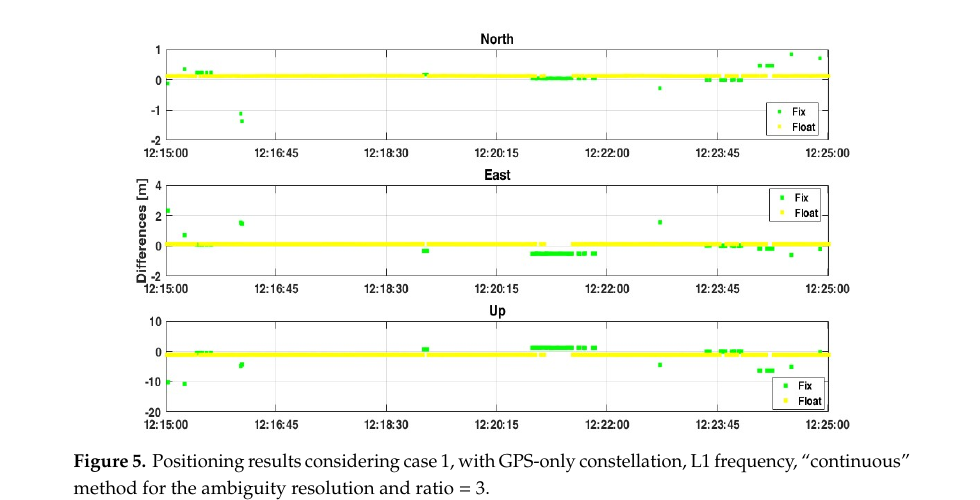
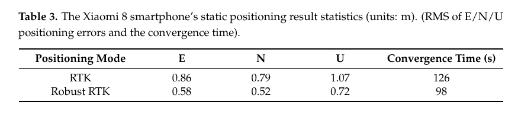
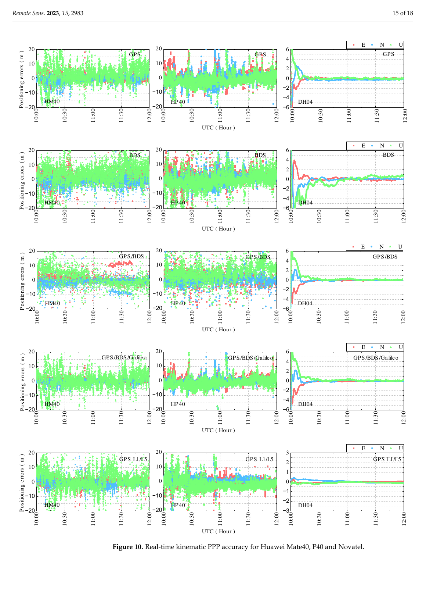

# 2026-09-30 GNSS 每日研究简报

## 今日快报

### 快报 1：Galileo 广播测距误差已稳定，但“走向完全运行能力”仍要看独立长期监测

- 主题：`galileo-open-service-long-term-performance`
- 来源 ID：`ion:gnss2026-17094`
- 来源链接：https://www.ion.org/gnss/abstracts.cfm?paperID=17094
- 发表日期：2026-09-18
- 来源类型：ION GNSS+ 2026 官方扩展摘要、ESA/EUSPA/EC 与产业联合 Galileo 开放服务性能报告
- 获取范围：公开扩展摘要全文；当前星座/地面段规模、GRC/G2STB 监测架构、SISE 95% 水平与定时/定位定性结论已核对，未公开完整时间序列、异常事件清单或各用户几何的 PVT 分位数

**内容：** 报告把运行监测分成服务运营、Galileo Reference Centre 独立监测和 ESA G2STB 试验验证三条链。当前公开摘要列出 26 颗运行卫星、17 个地面传感站；G2STB 另有 20 个全球试验传感站，并从信号在轨状态、导航电文、空间信号误差、GST-UTC/GGTO 和用户 PVT 多层交叉检查。

**结论：** 摘要称星座平均测距误差的 95% 水平自 2018 年以来稳定在约 20 cm，多频水平/垂直定位及定时播发符合 Galileo 开放服务定义文件目标。这里的 20 cm 是星座级 SISE 统计，不是任意终端的 95% 位置误差；“成熟稳定”也来自报告方汇总，仍需看独立原始序列和异常处置记录。

**关注理由：** 接收机验收不能只引用服务承诺。把运营监测、独立监测和下一代试验床分开，才能判断稳定数字来自哪一层证据，并把广播误差与用户几何放大区分开。

### 快报 2：铁路与海事误差模型不能整套搬航空：可移植项按设计复用，本地多路径按投运验真

- 主题：`rail-maritime-integrity-model-validation`
- 来源 ID：`ion:gnss2026-17024`
- 来源链接：https://www.ion.org/gnss/abstracts.cfm?paperID=17024
- 发表日期：2026-09-18
- 来源类型：ION GNSS+ 2026 官方扩展摘要、欧盟 ENTICE 项目用户段完整性模型验证框架
- 获取范围：公开扩展摘要全文；两类验证策略、残差构造/条件化/包络/验收流程及误差项分工已核对，未公开尾部样本量数值、保护级结果或监管认证结论

**内容：** 框架先判断误差是否可跨平台迁移：对物理稳定、已有成熟模型的对流层和滤波器机制采用“按设计验证”；对安装位置、船体/列车结构和当地反射环境主导的多路径、NLOS 与接收机噪声采用“按投运验证”。两条路径都要经过残差定义、工况条件化、保守包络、保守性验收，再进入保护级。

**结论：** 公开材料给出的是可追溯验证蓝图，不是已经通过监管的误差模型。特别是平滑滤波必须同时包住启动瞬态和稳态，时间相关会减少有效独立样本并要求放大离散度；摘要没有给具体相关时间、尾部置信度或可用率代价。

**关注理由：** 把航空高斯包络原样复制到港口或城市轨道，可能既不保守也不可用。工程上真正可审计的是“哪些参数能继承、哪些必须随平台重新验”。

### 快报 3：10% 占空比不等于只耗 10% 电：射频前端、唤醒时间和捕获代价都要入账

- 主题：`hardware-gnss-duty-cycle-power-characterization`
- 来源 ID：`ion:gnss2026-16855`
- 来源链接：https://www.ion.org/gnss/abstracts.cfm?paperID=16855
- 发表日期：2026-09-16
- 来源类型：ION GNSS+ 2026 官方扩展摘要、Fraunhofer 可测量硬件 GNSS 接收机占空比功耗研究
- 获取范围：公开扩展摘要全文；离散射频前端、ADC、低功耗 FPGA、RISC-V 导航核、Galileo E1BC 试验与拟测指标已核对；40%–80% 降耗仍是摘要中的预期值，不是公开实测结果

**内容：** 原型不是软件仿真，而是可分别关闭相关器通道和射频前端的完整硬件链；试验计划把真实信号与射频星座模拟器信号都降到 10% 占空比，同时记录跟踪、PVT 和分部件功耗。FPGA 平台换来可观测性，却不能直接代表功耗约低一个数量级的量产 ASIC。

**结论：** 摘要预期在 10% 占空比时相对连续运行降低 40%–80% 功耗，但尚未给测量表，不能把区间写成已实现结果。硬件设置时间、重新稳定跟踪、捕获引擎和一直开启的控制逻辑，使功耗不会按占空比线性缩放。

**关注理由：** 低成本手机或物联网 GNSS 的算法性能常被“黑盒省电”破坏。只有同时报告每瓦能耗与首次定位、重捕获、相位连续性和位置尾部，省电策略才可比较。

### 快报 4：叠加谐波想保留宽带测距收益，同时减少 BOC 多峰带来的假锁

- 主题：`harmonic-superposition-navigation-modulation`
- 来源 ID：`ion:gnss2026-17129`
- 来源链接：https://www.ion.org/gnss/abstracts.cfm?paperID=17129
- 发表日期：2026-09-16
- 来源类型：ION GNSS+ 2026 官方扩展摘要、未来导航信号谐波叠加调制方案
- 获取范围：公开扩展摘要全文；BOC/MBOC 多峰问题、边带处理损失、HSM 设计目标与前端带宽区间已核对，未公开候选波形参数表、完整仿真数据或第三方接收机结果

**内容：** BOC 以更大的 RMS 带宽换取更陡的相关峰，却会产生多个捕获旁峰和 DLL 假锁点；单边带或非相干双边带处理可提高稳健性，但分别牺牲约 3 dB 或 1–2 dB。HSM 通过叠加两个或更多优化配置的分量，试图同时压低旁峰、保持常包络，并适配小于 10 MHz 的低功耗前端和大于 30 MHz 的高精度前端。

**结论：** 摘要称若干 HSM 配置将在失锁门限、干扰、多路径、假锁概率和精度上优于 MBOC，但公开页没有数表，现阶段只能记录为作者的会议报告结论。文中超过 30 个假锁点和 10.1 MHz RMS 带宽属于 split C/A 历史例子，不应移植为 HSM 实测指标。

**关注理由：** 信号设计的“理论带宽更大”只有在真实前端、捕获和跟踪都能使用时才有价值。对接收机工程师，旁峰结构、相关器数量和弱信号门限与频谱形状同等重要。

### 快报 5：把接收机相位偏差放到单位圆上，避免选一颗枢轴星把误差传播给所有卫星

- 主题：`circular-receiver-phase-bias-estimation`
- 来源 ID：`ion:gnss2026-16881`
- 来源链接：https://www.ion.org/gnss/abstracts.cfm?paperID=16881
- 发表日期：2026-09-16
- 来源类型：ION GNSS+ 2026 官方扩展摘要、CNES 多频多系统 PPP-AR 接收机相位偏差估计
- 获取范围：公开扩展摘要全文；单位圆表示、von Mises 随机游走、三站 24 h/30 s 实数数据与初步对照已核对，未公开固定率、错误固定率、位置改善或运算量

**内容：** PPP-AR 中接收机相位偏差与整数模糊度线性相关，常见做法用枢轴星或固定一个 datum 消除秩亏，代价是参考星未建模误差会扩散。新方法利用偏差模 1 周期的性质，把它映射为单位圆角度，并以 von Mises 分布描述圆周随机游走；每颗星按质量贡献权重，再把模糊度取至最近整数。

**结论：** 三个 IGS 站各 24 h、30 s 采样的初步实数结果显示：不加动态模型时性能与枢轴星法相近，加动态模型后偏差估计改善。摘要没有给“改善多少”或整数/位置风险，因此不能推出 PPP-AR 固定率或精度必然提高。

**关注理由：** 周期变量若硬塞进欧氏直线，会在 0/1 周边制造不连续。圆统计提供了更自然的状态空间，但最终验收仍必须回到正确固定率、位置误差和参考星异常下的故障传播。

## 深度研读

### 深读 1｜低成本与手机｜手机 RTK 显示 FIX 也可能是错的：先理解双差、ratio 与拒绝

- 类别：`low-cost-mobile`
- 学习层级：`foundation`
- 选题定位：`经典基础`
- 来源 ID：`doi:10.3390/s19194302`
- 来源链接：https://doi.org/10.3390/s19194302
- 发表日期：2019-10-04
- 来源类型：Sensors 同行评审 CC BY 4.0 开放论文、双频手机单基线 RTK
- 获取范围：开放 PDF 全文；单基站模型、两种主站配置、约 1 km 基线、多系统/双频对照、Figures 1–11 与 Tables 1–10 已核对
- 价值评分：96/100（相关性 20，经典价值 20，证据 19，教学价值 20，工程价值 17）

#### 为什么先学这个

手机支持载波相位后，最容易犯的错误是把接收机输出的 `FIX` 当成厘米级正确性的同义词。论文用开阔、短基线和测地基站这个偏有利场景，仍直接展示 ratio=3 时约 15% 历元被判为固定却明显偏离真值。先弄清单差/双差消了什么、整数验收又没保证什么，后面的稳健定权才有意义。

#### 先修知识

需要掌握伪距与载波相位、接收机/卫星钟差、电离层与对流层、主站—流动站短基线、星间双差、整数模糊度、LAMBDA 候选、ratio test、固定/浮点解、RMS 与标准差的区别。

#### 一句话逻辑

短基线双差把共同误差压掉并保留整数模糊度，但手机相位噪声会让错误整数也通过宽松 ratio 门限，所以可信 RTK 必须允许拒绝，而不是追求更多 `FIX` 标签。

#### 研究问题与约束

实验以 Xiaomi Mi 8 为流动站，分别用约 1 km 外的 Leica CORS 与另一台 Mi 8 作主站；2018 年 11–12 月多次约 10 min、1 Hz 会话，环境刻意避开建筑遮挡、多路径和电磁干扰。已知点来自测地接收机 12 h 观测与 Bernese 网平差。该设计能隔离手机观测质量，却不能代表街谷、手持姿态、长基线或跨设备实时链路。

#### 核心方法论

主站从已知坐标形成码/相位改正，流动站接收后再做站间与星间差分。小于约 10 km 时，大气和星历误差近似相关；双差消去收发钟差，并让载波模糊度保持整数。处理器使用 RTKLIB 2.4.3 修改版、连续定整和紧组合多系统模型；论文比较 L1 与 L1+L5、GPS 与多星座、测地/手机主站以及 ratio 门限。

#### 关键公式逐步推导

对参考星 $`q`$ 与卫星 $`s`$、主站 $`A`$ 与流动站 $`B`$，双差载波可概括为：

```math
\nabla\Delta\Phi_{AB}^{sq}
=\nabla\Delta\rho_{AB}^{sq}
+\lambda\nabla\Delta N_{AB}^{sq}
+\nabla\Delta T_{AB}^{sq}
-\nabla\Delta I_{AB}^{sq}
+\varepsilon_{\Phi}.
```

短基线把大气残差压小后，先得到浮点模糊度 $`\hat a`$ 与协方差 $`Q_{\hat a}`$，再比较最优和次优整数候选的加权平方残差：

```math
\mu=\frac{\Omega_2}{\Omega_1},\qquad
\Omega_i=(\hat a-a_i)^{\mathsf T}Q_{\hat a}^{-1}(\hat a-a_i).
```

只有 $`\mu`$ 超过门限才接受 $`a_1`$。提高门限通常降低错误接受但增加拒绝；它不是与环境、维数和噪声无关的普适概率保证。

#### 经典价值与创新边界

经典价值是用真实手机双频相位把“整数固定会失败”画到位置域，而不是只报固定率。论文也比较手机—CORS 与手机—手机主站，说明两端都低成本时硬件差异会进入双差。边界是会话短、场景开阔、基线约 1 km，且所用门限和软件实现不能代表所有芯片。

#### 整体逻辑链

采集手机原始码相；建立已知主站；形成站间改正；构造星间双差；求浮点位置与模糊度；LAMBDA 搜索候选；ratio=3 验收；用已知点检查固定是否正确；提高门限到 30 或保留浮点；比较频点、星座和主站类型。

#### 原文图表与结果分析



> 图表源：Dabove 与 Di Pietra《Single-Baseline RTK Positioning Using Dual-Frequency GNSS Receivers Inside Smartphones》Figure 5，[开放全文](https://doi.org/10.3390/s19194302)。CC BY 4.0；由原版 PDF 第 10 页 150 dpi 渲染后仅裁出原图与图注，未修改坐标轴、图例、点或数值。

横轴是约 10 min 的 UTC 时间，纵轴是北、东、天三个方向相对已知坐标的差（m）；黄点为 float，绿点为 fix。若 `FIX` 真等于正确，绿点应紧贴零线；图中却出现东向约 2 m、天向约 −10 m 等绿色离群，直接说明 ratio=3 接受了错误整数。图不能给错误固定概率的置信区间，也不能外推到其他手机与卫星几何。

#### 原文结果论述

GPS L1、ratio=3 时约 15% 历元被标为固定但固定错误。作者把门限提高到 30 后倾向保留浮点，并报告浮点为主的北/东 RMS 仍约 0.2–0.4 m、天向约 0.5 m。加入 L5 和更多星座可改善精度与可用性，但低质量频点也可能引入噪声；“频点更多”并不自动保证更优。

#### 常见误区与适用边界

第一，只报 fix rate，不核对 correct-fix 与 wrong-fix。第二，把 ratio=3 当标准答案。第三，用固定解内部协方差当外部精度。第四，忽略手机天线方向图、相位中心和时钟不连续。第五，把开阔 1 km 基线外推到城市或网络 RTK。第六，把 RMS 降低误写成偏差消失。第七，手机作主站时忽略设备间偏差。

#### 工程实现步骤

1. 记录每颗星每频点的锁定、半周、C/N0、时间和载波连续性标志。
2. 先以已知短基线验证双差残差与参考星切换。
3. 求浮点解并保存 $`Q_{\hat a}`$，不要只保存最终标签。
4. 用训练集按卫星数、频点和环境标定 ratio 门限。
5. 同时检查基线长度、码/相位残差和历元间速度一致性。
6. 输出正确固定率、错误固定率、拒绝率与恢复时间。
7. 发生观测断裂或模型失配时退回浮点而非强行保持固定。

#### 复现实验设计

选 3 款双频手机，各做手机—CORS 与手机—手机 0.2/1/5 km 基线；在开阔、树荫和楼间各采 20 条 15 min、1 Hz 会话。比较 ratio=2/3/5/10/30、固定失败率门限和保留浮点策略；测地双频基线提供独立整数/坐标真值。指标为 correct/wrong fix、拒绝率、E/N/U 50/95/99.9 分位、首次正确固定和错误固定持续时间；训练门限与测试地点分离。

#### 与定位及低成本实现的联系

这节说明低成本链的第一原则：不可信的高精度比诚实的分米浮点更危险。下一节不直接调整数门限，而是在 Kalman 更新前后识别异常创新并自适应放大其协方差，让坏观测较少推动位置与模糊度。

#### 本节小结

双差只消共同误差，ratio 只比较两个候选；两者都不会自动识别手机观测的长尾和模型失配。可靠手机 RTK 的关键指标不是“固定了多少”，而是“错固定了多少，并能否及时拒绝”。

### 深读 2｜低成本与手机｜别先删观测：用创新与后验残差连续调大坏数据方差

- 类别：`low-cost-mobile`
- 学习层级：`intermediate`
- 选题定位：`基础进阶`
- 来源 ID：`doi:10.3390/s24051477`
- 来源链接：https://doi.org/10.3390/s24051477
- 发表日期：2024-02-24
- 来源类型：Sensors 同行评审 CC BY 4.0 开放论文、低成本终端稳健自适应 RTK
- 获取范围：开放 PDF 全文；多系统 RTK、Kalman 创新/后验稳健估计、IGGIII 阈值、静态/步行/车载对照、Figures 1–15 与 Tables 1–8 已核对
- 价值评分：95/100（相关性 20，经典价值 18，证据 19，教学价值 19，工程价值 19）

#### 为什么先学这个

上一节靠更严格整数验收避免错误固定，但异常码相在浮点阶段已经能拉偏位置和协方差。硬删除一颗星会损失低成本终端本就有限的冗余；稳健滤波改为根据创新和后验残差连续放大观测方差，让轻度异常降权、重度异常近似隔离。

#### 先修知识

需要理解 Kalman 预测/更新、创新、观测协方差、标准化残差、相关观测、Huber/IGGIII M 估计、短基线双差、LAMBDA、E/N/U 误差与收敛时间。

#### 一句话逻辑

先用预测创新找出“观测与动态模型不合”，更新后再用后验残差复查，并按 IGGIII 分段膨胀方差而非一刀切删除，从而降低粗差对 RTK 状态的影响。

#### 研究问题与约束

论文比较 Xiaomi 8、Huawei P40、Huawei Mate40 和低成本 M8 接收机，覆盖静态、步行与封闭道路车载试验；全部是短基线，作者因此忽略剩余电离层/对流层。方法阈值来自经验，数据可用性声明写“未创建或分析新数据”，公开复现材料不足；路线、终端和参考系统也没有形成跨地点盲测。

#### 核心方法论

滤波先形成状态预测与创新协方差，对创新标准化后用 IGGIII 阈值膨胀异常观测方差；随后执行一次更新，再以后验残差重复稳健处理。由于星间差分引入参考星共同项，协方差并非对角阵；论文要求膨胀方差时同步调整协方差，使原相关系数保持不变，避免“只改对角线”破坏统计结构。

#### 关键公式逐步推导

预测、创新与创新协方差为：

```math
\hat x_{k|k-1}=F_k\hat x_{k-1|k-1},\qquad
v_k=H_k\hat x_{k|k-1}-z_k,
```

```math
Q_{v,k}=H_kP_{k|k-1}H_k^{\mathsf T}+R_k.
```

第 $`j`$ 个标准化创新：

```math
r_j=\frac{v_j}{\sqrt{(Q_{v,k})_{jj}}}.
```

IGGIII 的方差膨胀可概括为：$`|r_j|\le k_0`$ 保持原方差；$`k_0<|r_j|\le k_1`$ 连续增大；超过 $`k_1`$ 乘约 $`10^5`$，近似拒绝。论文预检取 $`(k_0,k_1)=(2.5,7)`$，后验取 $`(1.5,3)`$。若原相关系数为 $`\rho_{ij}`$，方差放大 $`\alpha_i,\alpha_j`$ 后应同步令：

```math
\hat R_{ij}=\rho_{ij}\sqrt{\alpha_iR_{ii}\,\alpha_jR_{jj}},
```

从而保留差分观测的相关结构。

#### 经典价值与创新边界

经典部分是创新检验、M 估计和协方差重标定；值得学习的是把预检与后验检验并列，并显式处理差分相关。创新边界是阈值经验化、动力学与噪声模型较简化，提升数字来自同一批场景内对照；没有以错误固定率或保护级证明安全性。

#### 整体逻辑链

形成多系统短基线双差；Kalman 预测；计算标准化创新；IGGIII 膨胀方差与协方差；第一次更新；计算后验残差；第二次稳健重标定；解算浮点/固定 RTK；比较普通与稳健方案的 RMS、收敛和路线贴合。

#### 原文图表与结果分析



> 图表源：Zhu 等《Research on Robust Adaptive RTK Positioning of Low-Cost Smart Terminals》Table 3，[开放全文](https://doi.org/10.3390/s24051477)。CC BY 4.0；由原版 PDF 第 13 页 150 dpi 渲染后仅裁出表格，未修改行列、单位或数值。

表中 E/N/U 单位为 m，收敛时间为 s。Xiaomi 8 从普通 RTK 的 0.86/0.79/1.07 m 降到稳健 RTK 的 0.58/0.52/0.72 m，收敛从 126 s 缩至 98 s。它证明同一数据和作者定义下的改善，不证明稳健法达到厘米级，也没有给多次试验方差或显著性。

#### 原文结果论述

静态试验中三款手机各方向改善约 23.0%–35.4%；步行平面 RMS 由 Xiaomi 8/P40/Mate40 的 1.67/1.39/1.31 m 降到 1.12/0.93/0.76 m。车载平面 RMS 分别由 3.93/2.98/2.89 m 降到 3.19/2.10/2.06 m。低成本 M8 原始较好，车载只从 1.16 m 降到 1.07 m，说明基线越好，可供稳健化修正的异常越少。

#### 常见误区与适用边界

第一，把降权当成找到了异常物理原因。第二，只放大方差对角线，忘记差分相关。第三，用同一阈值覆盖静态、步行和车载。第四，把 RMS 改善等同错误固定风险下降。第五，短基线忽略大气可行，不可直接移到长基线。第六，用非独立路线拟合当外部真值。第七，误读论文结论中“精度越好改善越大”的表述；表格实际显示原始最好的 M8 相对改善更小，应以数表为准。

#### 工程实现步骤

1. 分星、分频保留创新与协方差，而非只输出位置残差。
2. 预检用较宽门限避免动力学突变时误杀好观测。
3. 按 IGGIII 连续膨胀 $`R`$，重度异常近似隔离。
4. 对差分观测同步更新非对角协方差。
5. 第一次更新后再做后验残差检验。
6. 将稳健权与参考星切换、C/N0、锁定状态一起记录。
7. 定整前重新评估浮点协方差，固定后继续监控残差。
8. 按环境分别标定阈值，并设最小有效卫星数。

#### 复现实验设计

沿用三款手机与一台低成本模块，在 0.5/5/20 km 基线、静态/步行/车载和开阔/林荫/街谷组合中各采 10 条。比较普通 KF、Huber、单阶段 IGGIII、双阶段 IGGIII 与删除异常；注入 1–20 m 码粗差、1–10 周相位跳变和参考星异常。指标为 E/N/U 分位数、NIS 一致性、正确/错误固定率、拒绝率、收敛与恢复时间；阈值只用一城训练、另一城测试。

#### 与定位及低成本实现的联系

稳健定权能减少观测粗差把 RTK 拉走，却仍依赖附近参考站。下一节去掉本地基站，直接用实时轨道钟产品做手机 PPP，并展示同一算法在静态和动态时为什么会出现数量级差异。

#### 本节小结

稳健滤波的核心不是“发现坏点就删”，而是把异常程度映射成可审计的协方差变化，并保留差分相关。它能改善低成本 RTK，但不能替代整数风险和跨场景验真。

### 深读 3｜纯 GNSS 定位｜静态分米不等于动态分米：实时多系统手机 PPP 的场景鸿沟

- 类别：`positioning`
- 学习层级：`advanced`
- 选题定位：`定位深入`
- 来源 ID：`doi:10.3390/rs15122983`
- 来源链接：https://doi.org/10.3390/rs15122983
- 发表日期：2023-06-08
- 来源类型：Remote Sensing 同行评审 CC BY 4.0 开放论文、手机实时多系统 PPP
- 获取范围：开放 PDF 全文；未差未组合/无电离层组合模型、GFZ 实时产品、Mate40/P40/NovAtel 静动态试验、Figures 1–10 与 Tables 1–6 已核对
- 价值评分：97/100（相关性 20，经典价值 18，证据 20，教学价值 20，工程价值 19）

#### 为什么先学这个

手机 PPP 常以静态收敛后的最好分量宣传“分米级”，但车辆导航关心的是移动、遮挡、噪声和连续重收敛。本文在同一日、同一实时产品与同一组设备上并列静态和动态结果：P40 静态三系统可到 0.09/0.27/0.12 m，动态却是 3.88/3.39/7.83 m。这种差距比单个最好数字更有教学价值。

#### 先修知识

需要掌握未差未组合 PPP、无电离层组合、精密轨道钟、卫星/接收机码相偏差、对流层湿延迟、相位缠绕、随机游走、C/N0/仰角定权、静态/动态过程噪声、收敛判据及独立真值。

#### 一句话逻辑

用实时精密轨道钟和多系统观测消除服务端误差后，手机静态平均能积累到分米级；一旦运动使低增益天线、长尾噪声和过程模型同时暴露，多星座只增加几何，不能把坏观测自动变成测地质量。

#### 研究问题与约束

试验使用 Huawei Mate40、P40 和 NovAtel DH04，于 2022-11-16 10:00–12:00 UTC 采集约 2 h、1 Hz 数据，接收 NTRIP 广播星历和 GFZ 实时轨道钟。静态参考取最后 500 s 坐标均值，缺少完全独立静态真值；动态图以各设备自身结果对比，路线/真值说明有限。单日、单地点和两款华为手机不足以代表所有设备与城市。

#### 核心方法论

单频 GPS/BDS/Galileo 使用未差未组合模型并估计电离层；双频 GPS L1/L5 用无电离层组合。状态含坐标、分系统接收机钟、对流层湿延迟和每星模糊度；1 s 采样、15° 截止角，C/N0 与仰角共同定权。改正包括 GFZ 实时轨道钟、CODE 硬件延迟、igs14.atx 相位中心、相位缠绕、相对论和地球自转。

#### 关键公式逐步推导

对系统 $`Q`$、卫星 $`s`$、频点 $`j`$，未差未组合码和相位为：

```math
P_{r,j}^{s,Q}=\rho_r^{s,Q}+c(\delta t_r-\delta t^{s,Q})+T_r^{s,Q}+I_{r,j}^{s,Q}
+c(d_{r,j}^{Q}-d_j^{s,Q})+\varepsilon_P,
```

```math
L_{r,j}^{s,Q}=\rho_r^{s,Q}+c(\delta t_r-\delta t^{s,Q})+T_r^{s,Q}-I_{r,j}^{s,Q}
+\lambda_j^{s,Q}N_{r,j}^{s,Q}+(b_{r,j}^{Q}-b_j^{s,Q})+\varepsilon_L.
```

码中电离层为正、相位中为负，使单频可把 $`I`$ 作为每星状态估计；双频无电离层组合则以 $`f_1^2/(f_1^2-f_2^2)`$ 与 $`-f_2^2/(f_1^2-f_2^2)`$ 线性消去一阶电离层，但会放大观测噪声。多系统还需分别处理接收机钟/系统间偏差，否则“多星座”会把偏差带进坐标。

#### 经典价值与创新边界

价值在于完整闭合实时产品、手机观测和静动态对照，并把手机与测地接收机放在同一处理框架。边界是 PPP 未做整数固定，静态参考不独立，动态缺少高等级轨迹真值；文中个别文字把 DH04 的 0.06/0.11/0.16 m 称作“sub-centimeter”，与数值本身的厘米到分米量级不一致，应以表格为准。

#### 整体逻辑链

同步采集手机与测地数据；接入实时广播和 GFZ 产品；检查 C/N0、卫星数与 PDOP；验证实时轨道钟；建立单频 UDUC 与双频 IF 模型；静态/动态 Kalman 解算；比较 GPS、BDS、GPS+BDS、GPS+BDS+Galileo 与 GPS L1/L5；分别报告静态和动态 RMS。

#### 原文图表与结果分析



> 图表源：Li 等《BDS/GPS/Galileo Precise Point Positioning Performance Analysis of Android Smartphones Based on Real-Time Stream Data》Figure 10，[开放全文](https://doi.org/10.3390/rs15122983)。CC BY 4.0；由原版 PDF 第 15 页 150 dpi 渲染后仅裁出原图、页眉与图注，未修改点、轴、图例或数值。

五行依次为 GPS、BDS、GPS/BDS、GPS/BDS/Galileo 和 GPS L1/L5；三列是 Mate40、P40、DH04，红/蓝/绿为 E/N/U。手机列纵轴多为 ±20 m，点云厚且天向最差；DH04 多为 ±6 m 或 ±3 m 且迅速收敛。图能证明这次两小时试验的设备差异，不能把点云直接当概率分布或证明所有动态手机 PPP 都会同样退化。

#### 原文结果论述

P40 静态 GPS/BDS/Galileo RMS 为 E/N/U 0.09/0.27/0.12 m；Mate40 三系统为 0.08/0.13/0.20 m。动态时 P40 三系统为 3.88/3.39/7.83 m，Mate40 为 3.45/4.41/8.60 m。GPS L1/L5 相对单频 GPS 的动态改善只有约 2.49%/1.38%/3.26%；更多频点未克服手机动态观测噪声。

#### 常见误区与适用边界

第一，只引用静态收敛后的最佳 RMS。第二，把最后 500 s 均值当独立真值。第三，把多星座卫星数增加等同观测质量增加。第四，忽略系统间偏差和各系统钟状态。第五，把双频无电离层组合当无噪声组合。第六，以单日两机型概括所有手机。第七，把测地接收机的收敛当手机可复制性能。第八，把 RMS 当 95% 或完整性界。

#### 工程实现步骤

1. 逐设备核对 Android 时钟、频点和相位连续性。
2. 监控实时轨道钟年龄、断流和参考产品切换。
3. 单频显式估电离层，双频并行保留 UDUC 与 IF 对照。
4. 分系统估计接收机钟或系统间偏差。
5. 用 C/N0、仰角和设备噪声共同定权，并设长尾门控。
6. 静态与动态采用不同过程噪声，转弯/遮挡时允许重置。
7. 分开报告首次收敛、重收敛、持续可用率和尾部误差。
8. 用外部高等级 GNSS/INS 而非自身均值提供动态真值。

#### 复现实验设计

用 5 款双频手机和一台测地接收机，在车顶与仪表台各跑开阔、林荫、街谷三条 30 min 路线；高等级 GNSS/INS 给独立 100 Hz 真值。比较 GPS、BDS、双系统、三系统、GPS L1/L5 UDUC 与 IF，并加入实时产品 5/15/60 s 延迟和 30 s 断流。指标为 E/N/U 50/95/99.9 分位、首次/重收敛、连续可用率、产品龄期敏感度和单位功耗；失败条件是静态改善但动态尾部或重收敛恶化。

#### 与定位及低成本实现的联系

这是一条纯 GNSS 路线：没有 IMU 替手机填补动态误差。它说明低成本定位的瓶颈不只在精密产品，还在天线、观测连续性、随机模型和运动状态。工程上应把静态测量与动态导航当成两个验收域，而不是共享一个“分米级”标签。

#### 本节小结

实时多系统 PPP 能把静态手机推到分米级，但同一设备动态仍可能是数米，且垂向最弱。多星座和双频提供冗余，不会自动消除低成本观测的长尾、断裂与模型失配。
