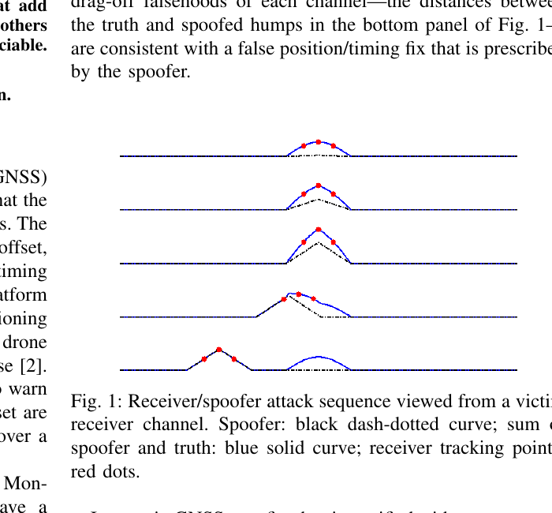
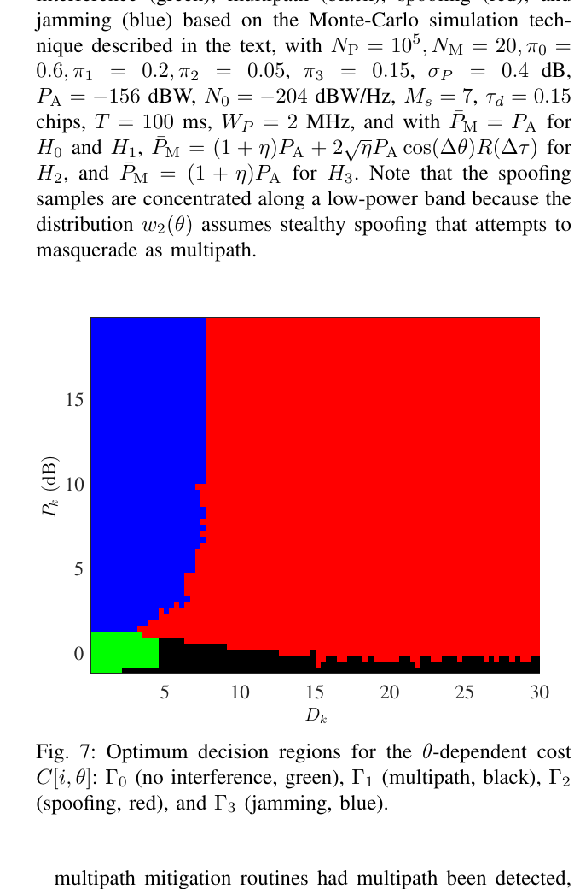
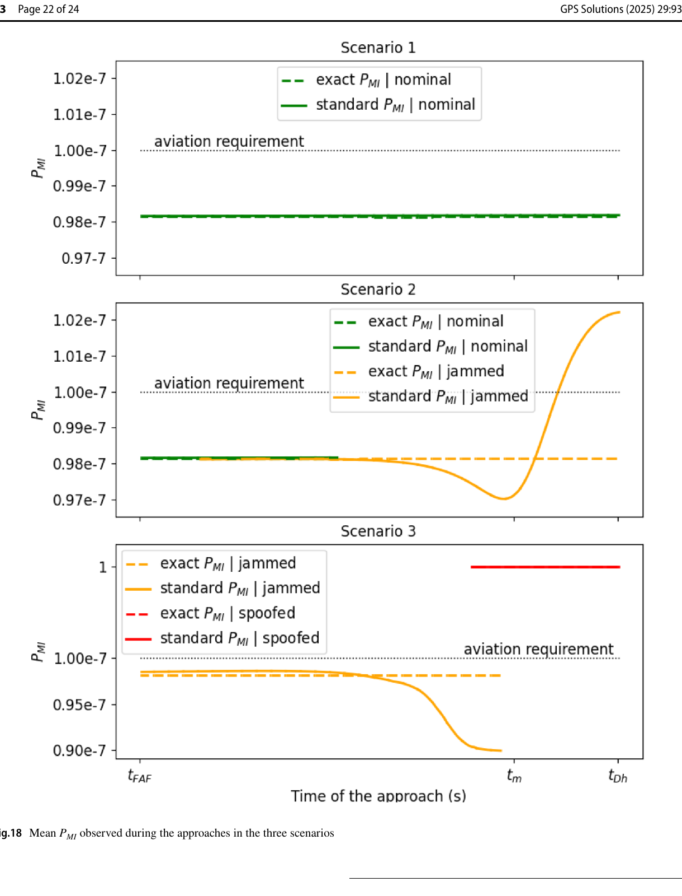

# 2026-10-01 GNSS 每日研究简报

## 今日快报

### 快报 1：重构欺骗信号也会混叠：相位插值先补高采样等效，再滤波降采样

- 主题：`phase-interpolated-successive-spoofing-cancellation`
- 来源 ID：`ion:gnss2026-16845`
- 来源链接：https://www.ion.org/gnss/abstracts.cfm?paperID=16845
- 发表日期：2026-09-17
- 来源类型：ION GNSS+ 2026 官方扩展摘要、清华大学相位插值连续欺骗抵消研究
- 获取范围：公开扩展摘要全文；算法、仿真参数和射频信号源/LabSat 实验结果已核对，未取得正式论文、逐场景原始 IQ 或运算资源表

**内容：** 连续欺骗抵消（SSC）用跟踪环估计的码相位、载波相位和幅度重构欺骗信号再相减；若直接在接近奈奎斯特的低采样率重构，就没有复现模拟前端带通滤波，频谱混叠会留在抵消残差。PI-SSC 在每个相干积分段内线性插值相位，按真实前端设计线性相位 FIR，随后降采样并抵消，不改变接收机实际采样率。

**结论：** GPS L1 C/A 仿真中，6 MHz 采样、插值因子 2、欺真功率比超过 35 dB 时，恢复 C/N0 相对 SSC 至少多 2.5 dB；以抵消后 C/N0 下降 3 dB 为准，抗欺骗增益约 7.3 dB。4.092 MHz、8 bit 场测中，欺真功率比超过 30 dB 时恢复增益至少 2 dB，6 dB 退化点的抗欺骗增益约 3.2 dB；到 40 dB 时两法都失锁。数字来自作者设定的单真单欺实验，不等于复杂多通道现场保证。

**关注理由：** 抵消算法不仅受参数估计误差影响，也受“重构链是否复制模拟前端”影响。低成本接收机若只比较算法名而忽略采样率、量化位宽、滤波长度和群延迟，会把实现误差错当成方法极限。

### 快报 2：车辆安全广播可反向帮助同步欺骗：侧信道先暴露位置与运动状态

- 主题：`cav-bsm-assisted-synchronous-gnss-spoofing`
- 来源 ID：`ion:gnss2026-17192`
- 来源链接：https://www.ion.org/gnss/abstracts.cfm?paperID=17192
- 发表日期：2026-09-16
- 来源类型：ION GNSS+ 2026 官方扩展摘要、联网自动驾驶车辆同步 GPS 欺骗攻击模型
- 获取范围：公开扩展摘要全文；BSM 侧信道、跟踪滤波、延迟约束和静态/匀速实车采集设计已核对，未公开可隐蔽拖偏的最终距离、速度或误警统计

**内容：** 同步欺骗要让伪信号码延迟和多普勒贴近真信号，传统难点是实时跟踪受害车。研究利用 C-V2X 基本安全消息（BSM）中最高 10 Hz 广播且未加密的位置、速度、航向和加速度，估计目标运动，再联合硬件、收发链路、天线间距和接收机钟差做约束优化，生成对齐的码延迟与多普勒。

**结论：** 作者用商用 OBU、约 2.5 cm 水平误差参考接收机和原始 IF 记录搭建静止/匀速直线实验，并在数字域把合成欺骗与真实 IF 叠加后送入软件接收机。公开页只说明将以相关器 SQM 分布建立隐蔽容差并称其为实用演示，没有给最终容差值，因此不能据此断言所有 C-V2X 车辆都能被无告警接管。

**关注理由：** 安全系统之间并非天然相互加固。若 V2X 明文运动状态被用于提高 GNSS 欺骗同步精度，威胁建模必须跨越射频、车联网消息与导航滤波三个接口。

### 快报 3：真实干扰测试不应只报“检测到”：还要公开真值、对手接收机与恢复轨迹

- 主题：`commercial-receiver-jammertest-antijam-antispoof-assessment`
- 来源 ID：`ion:gnss2026-16800`
- 来源链接：https://www.ion.org/gnss/abstracts.cfm?paperID=16800
- 发表日期：2026-09-16
- 来源类型：ION GNSS+ 2026 官方扩展摘要、Hexagon｜NovAtel 厂商实测抗干扰/抗欺骗报告
- 获取范围：公开扩展摘要全文；Jammertest 2025 场景、OEM7/GRIT/RoDAR 处理链和拟报告指标已核对，未公开完整混淆矩阵、基线接收机配置、原始日志或每场景位置/时间误差

**内容：** GRIT 固件将频谱监测、输入功率、C/N0 与欺骗标志结合；双天线 RoDAR 再用双极化阵列做零陷。测试覆盖全频段静态转发、真假星历的相干/非相干欺骗、静态假位置、错误轨迹、小定时偏差和跨年时间偏移，并常在欺骗前或同时加入宽带压制。

**结论：** 摘要表明数据来自 Jammertest 2025 与冲突区实测，且会与竞争接收机比较，但公开页没有给检测率、误警率、位置尾部或恢复时间。现阶段能确认的是测试覆盖面与可观测指标，不能把“展示有效”改写成量化性能保证。

**关注理由：** 厂商黑盒在复杂射频环境里很有工程价值，但采购或认证应要求逐场景真值、告警时间、错误 PVT 持续时间、恢复条件和同配置对照，否则无法区分检测、隔离与继续安全导航。

### 快报 4：多层判决把逐星异常汇总到频段和星座，但 98% 仍不是完整风险证明

- 主题：`embedded-multitier-observable-spoofing-classifier`
- 来源 ID：`ion:gnss2026-16902`
- 来源链接：https://www.ion.org/gnss/abstracts.cfm?paperID=16902
- 发表日期：2026-09-17
- 来源类型：ION GNSS+ 2026 官方扩展摘要、WAY4WARD 厂商 ASPIS 嵌入式反欺骗报告
- 获取范围：公开扩展摘要全文；特征、模型族、层级聚合和 2023–2025 现场试验汇总已核对，未公开数据划分、类别基数、置信区间、门限迁移或逐接收机混淆矩阵

**内容：** ASPIS 用普通多频多系统接收机已有的 C/N0 趋势、码相一致性、多普勒、接收机钟、锁定标志和星座一致性，组合 SVM、前馈网络、集成模型与时序模型；先逐星分类，再在频段和星座层按可配置门限汇总，并向导航滤波输出剔除或降权标志。

**结论：** 作者称 2023–2025 多次 Jammertest 的 50 余种相干/非相干欺骗、转发、功率爬升与联合压制场景上总体检测准确率为 98%；接收机专用调优后，扩展干净信号测试为零误警。这里的“准确率”没有类别占比和置信区间，“零误警”又以专用调优为条件，不能转换为未知接收机上的完整性风险上界。

**关注理由：** 层级聚合适合把机器学习分类接入导航滤波，但安全论证必须把数据漂移、接收机差异和同源多路径相关性纳入；一个总体准确率不能替代漏检概率、误警率与危险误导信息统计。

### 快报 5：阵列先在相关前找异常空间特征，再在相关后判断谁正被欺骗信号牵引

- 主题：`blind-pre-post-correlation-array-spoofing-detection`
- 来源 ID：`ion:gnss2026-17004`
- 来源链接：https://www.ion.org/gnss/abstracts.cfm?paperID=17004
- 发表日期：2026-09-17
- 来源类型：ION GNSS+ 2026 官方扩展摘要、DLR/RWTH 盲阵列检测与压制研究
- 获取范围：公开扩展摘要全文；两级波束形成、协方差特征分解、空间签名匹配和 Jammertest 2025 验证范围已核对，未公开阈值、阵元几何、逐攻击检测率或定位连续性数字

**内容：** 相关前的阵列原始信号在标称情况下近似空间白噪声，协方差矩阵接近单位阵；强干扰或欺骗会抬高至少一个特征值，其特征向量提供异常源空间签名。相关后扩频增益恢复逐星信号，再把每个通道的主空间方向与相关前异常签名匹配：相同则该通道可能跟踪欺骗源，不同则更像被压制的干扰或未接管欺骗。

**结论：** 方法不要求外部位置、姿态或阵列标定，并可在识别通道后剔除观测或形成更深零陷；摘要称已用仿真和 Jammertest 2025 的压制、欺骗、转发数据评估，但没有公开数字。其“盲”只免除部分外部输入，不等于对多发射源、近场、互耦或阵列失配免疫。

**关注理由：** 单星被接管也可能严重推偏 PVT。把相关前“有异常源”和相关后“哪颗星受它控制”分开，是阵列接收机从检测走向隔离与重捕获的关键接口。

## 深度研读

### 深读 1｜接收机工程｜先理解接管：欺骗峰怎样贴住、压过并拖走真实相关峰

- 类别：`receiver-engineering`
- 学习层级：`foundation`
- 选题定位：`经典基础`
- 来源 ID：`doi:10.1109/jproc.2016.2526658`
- 来源链接：https://doi.org/10.1109/JPROC.2016.2526658
- 发表日期：2016-06-01
- 来源类型：Proceedings of the IEEE 同行评审综述；作者公开全文版本
- 获取范围：作者公开 PDF 全文；攻击模型、接管/拖偏顺序、攻击—防御矩阵和 Figures 1–3 已核对；IEEE 正式版版权，图 1 仅作最小研究评论摘录
- 价值评分：96/100（相关性 20，经典价值 20，证据 18，教学价值 20，工程价值 18）

#### 为什么先学这个

反欺骗算法若只背检测器名称，很容易忽略攻击者真正要完成的三件事：复刻码与数据、在受害天线处对齐码相位/多普勒、再以自洽的多星伪距把解拖到假位置或假时间。先看清相关峰如何被接管，才能理解为什么单纯失锁检测和普通伪距 RAIM 会漏掉协同欺骗。

#### 先修知识

需要理解扩频码相关、码相位、载波拍频、跟踪环、伪距定位与接收机钟差；知道 RAIM 用冗余伪距残差查找不一致，而不是验证射频信号来源。

#### 一句话逻辑

隐蔽接管先让伪峰与真峰重合并缓慢提高功率，使跟踪点在不失锁的情况下转移到合成峰，再协调移动各通道码相位，使所有伪距共同解释同一个假 PVT。

#### 研究问题与约束

论文是攻击/防御方法综述与相对成本矩阵，不是单一硬件的统计认证。它讨论自洽信号模拟、转发、估计重放、零陷、多天线发射等威胁，也讨论功率、相关形状、漂移、NMA 与到达方向检测；不同方法的“成本”和检测概率分级含作者判断，不能当作统一试验下的数值排名。

#### 核心方法论

真实信号由每颗星的幅度、数据、扩频码、码延迟和载波相位叠加；欺骗器生成结构相同但参数可控的副本。低功率对齐后逐步提高伪信号幅度，跟踪环看到的仍是一个连续复合峰；捕获后再缓慢改变各伪码延迟与载波，使码/载波变化保持物理一致，并让跨星伪距残差维持在 RAIM 门限内。

#### 关键公式逐步推导

真实接收信号可写成：

```math
y(t)=\Re\left\{\sum_{i=1}^{N} A_iD_i[t-\tau_i(t)]C_i[t-\tau_i(t)]e^{j[\omega_ct-\phi_i(t)]}\right\}.
```

欺骗副本把参数替换为 $`A_{s,i},\tau_{s,i},\phi_{s,i}`$，受害机实际看到：

```math
y_{\mathrm{tot}}(t)=y(t)+y_s(t)+\nu(t).
```

隐蔽初始化令 $`A_{s,i}\approx0`$、$`\tau_{s,i}\approx\tau_i`$，随后提高 $`A_{s,i}`$；拖偏时还要近似满足：

```math
\omega_c[\tau_{s,i}(t_b)-\tau_{s,i}(t_a)]
=\phi_{s,i}(t_b)-\phi_{s,i}(t_a),
```

否则异常码—载波发散或失锁会暴露攻击。

#### 经典价值与创新边界

经典价值在于统一列出攻击面与防御面，并明确“自洽多星欺骗可以绕过普通 RAIM”。其边界是 2016 年的系统状态：今天已有 OSNMA、更多多频信号和新型阵列/学习方法；但接管物理与多层防御原则仍成立，不能照搬当年的商用接收机覆盖判断。

#### 整体逻辑链

接收真信号；欺骗器估计受害点的码相位和多普勒；生成逐星伪副本；对齐后爬升功率；跟踪点从真峰过渡到复合峰；协调拖动各通道；输出自洽假位置/时间；防御侧同时观察功率、相关形状、位置/钟漂移、信号认证与空间到达方向。

#### 原文图表与结果分析



> 图表源：Psiaki 与 Humphreys《GNSS Spoofing and Detection》Figure 1，[作者公开全文](https://rnl.ae.utexas.edu/images/stories/files/papers/gnss_spoofing_detection.pdf)。IEEE 版权；由作者公开 PDF 第 1 页 180 dpi 渲染后，仅裁出五阶段相关峰与原图注用于研究评论，未修改曲线、颜色、跟踪点或标签。

五行从上到下表示时间推进：黑色点划线是欺骗峰，蓝色实线是真实与欺骗叠加，红点是接收机跟踪抽头。前三行伪峰贴着真峰并增大，跟踪点仍处在连续峰顶；后两行伪峰拖离，接收机跟随伪峰，而真峰重新出现。图是机制示意，没有横轴码片单位、功率比或检出概率，不能据此读取具体接管门限。

#### 原文结果论述

作者的攻击—防御矩阵指出，伪距 RAIM 对自洽欺骗检测概率低；相关函数畸变对前五类较低成本攻击至少具有中等、依场景而定的检测能力。文章建议低成本接收机先加入接收功率、钟漂移和异常跳变监测，再用多抽头相关器、NMA、IMU 或多天线补齐单项盲区。这里是综述性建议，不是统一数据集上的比较试验。

#### 常见误区与适用边界

第一，把“跟踪未失锁”当信号真实。第二，认为 RAIM 能识别所有欺骗；多星自洽伪距正是它的盲区。第三，只看 C/N0 爬升，不看相关形状与钟漂移。第四，把 NMA 当即时测距认证；消息验证可能有秒到分钟延迟。第五，认为单一检测器没有对抗适配。第六，把受控演示外推为任意距离、功率和平台可实现。

#### 工程实现步骤

1. 保存 AGC/带内功率、多抽头复相关、码/载波创新和接收机钟状态。
2. 给每类指标建立标称环境包络，不只设单一固定阈值。
3. 在通道层检测峰形与功率，在解算层检测跨星一致性和漂移。
4. 把告警、可疑观测隔离、重捕获和可信源恢复分成不同状态。
5. 记录检测延迟期间的最大可积累位置/时间误差。
6. 用互补指标组合，避免单一检测器被有针对性地绕过。

#### 复现实验设计

在屏蔽环境或纯数字回放中生成 GPS L1 C/A：8 颗星、10 Hz 相关输出，伪峰初始码差 0/0.05/0.2 chip、功率优势 −3 至 10 dB、拖偏速率 0.001–0.1 chip/s。比较失锁标志、伪距 RAIM、AGC、早晚抽头不对称和钟漂移联合检测。指标为接管成功率、检测/误警率、告警延迟、告警时位置误差和恢复时间；另加多路径回放作主要混淆基线。

#### 与定位及低成本实现的联系

手机与廉价芯片未必开放原始 IQ，但通常能提供 AGC、C/N0、伪距、载波、多普勒和钟偏。即使不能完整重建相关面，也可从多层观测组合逼近攻击链；下一节进一步把功率和对称抽头畸变放入一个显式分类平面。

#### 本节小结

欺骗不是瞬间把接收机“切换”到假信号，而是控制相关峰所有权并维持多星解算自洽。防御必须覆盖接管前、拖偏中和恢复后三个阶段。

### 深读 2｜接收机工程｜低功率会扭曲峰，高功率会抬升底噪：把攻击夹在二维判决面里

- 类别：`receiver-engineering`
- 学习层级：`intermediate`
- 选题定位：`基础进阶`
- 来源 ID：`doi:10.1109/taes.2017.2765258`
- 来源链接：https://doi.org/10.1109/TAES.2017.2765258
- 发表日期：2018-04-01
- 来源类型：IEEE Transactions on Aerospace and Electronic Systems 同行评审论文；作者公开全文版本
- 获取范围：作者公开 PDF 全文；贝叶斯分类、功率/对称差模型、27 组记录、Figures 1–10 与 Tables I–III 已核对；IEEE 版权，图 7 仅作最小研究评论摘录
- 价值评分：97/100（相关性 20，经典价值 19，证据 20，教学价值 20，工程价值 18）

#### 为什么先学这个

上一节说明接管时真伪峰会相互作用。只监测功率会漏掉低功率拖偏，只监测峰形又会把城市多路径当欺骗，且强欺骗可能淹没真峰而恢复成“看似干净”的单峰。功率—畸变（PD）检测器把这两个盲区配成互补观测。

#### 先修知识

需要掌握早/晚相关器、AGC、C/N0、复相关函数、码片、功率 dB、贝叶斯先验/代价、蒙特卡洛分类，以及多路径、欺骗和压制干扰在相关域的差别。

#### 一句话逻辑

若攻击功率接近真信号，真伪峰叠加会产生对称抽头差；若攻击用大功率掩盖畸变，带内总功率会上升，于是联合 $`(D_k,P_k)`$ 比任一单指标更难绕过。

#### 研究问题与约束

论文假定接收机能测带内功率并输出多抽头复相关；主要针对 carry-off 型欺骗、压制和多路径分类。模型排除真信号严重遮挡超过 6 dB 的情况，因为此时强反射可能与低功率欺骗不可辨；对精细载波相消的 nulling 攻击性能也明显下降。

#### 核心方法论

每个时刻构造接收功率 $`P_k`$ 和对称抽头复差归一化幅值 $`D_k`$，定义无干扰、多路径、欺骗、压制四个假设。根据干扰功率比、码差和载波相差的物理先验生成蒙特卡洛样本，再以场景先验和误判代价划分二维判决区域；多通道、时间连续判决可进一步压低误警。

#### 关键公式逐步推导

令 $`\xi_k(\tau)`$ 为相对 prompt 延迟 $`\tau`$ 的复相关，$`\tau_d`$ 为对称早晚抽头，标称噪声标准差为 $`\sigma_{N0}`$：

```math
D_k(\tau_d)=\frac{|\xi_k(-\tau_d)-\xi_k(\tau_d)|}{\sigma_{N0}}.
```

联合观测向量为：

```math
z_k=[D_k,\ P_k]^{\mathsf T}.
```

对判为第 $`i`$ 类、真实参数为 $`\theta`$ 的代价 $`C[i,\theta]`$，选择规则通过最小化贝叶斯风险：

```math
r(\delta)=\mathbb E_{\Theta}\{\mathbb E[C(\delta(Z_k),\Theta)\mid\Theta]\}.
```

因此边界不是普适阈值，而随功率带宽、抽头间隔、先验威胁和误判代价变化。

#### 经典价值与创新边界

经典价值是把“功率监测+峰形监测”的工程直觉变成可重建的物理先验贝叶斯分类器，并公开代码生成应用特定边界。边界是检测器不证明信号来源、不能单独恢复导航，对多源协同、精确 nulling、严重遮挡和分布外接收机仍需额外防线。

#### 整体逻辑链

宽带采样/AGC估计功率；相关器输出多抽头复数；计算对称差；按前端带宽和噪声标定；用多路径/欺骗/压制物理参数生成训练分布；加入误判代价；形成二维判决区；逐通道分类；跨通道和时间汇总；向导航状态机发出抑制或告警。

#### 原文图表与结果分析



> 图表源：Wesson 等《GNSS Signal Authentication via Power and Distortion Monitoring》Figure 7，[作者公开全文](https://radionavlab.ae.utexas.edu/images/stories/files/papers/pincer.pdf)。IEEE 版权；由作者公开 PDF 第 10 页 180 dpi 渲染后，仅裁出原判决图、轴标和图注用于研究评论，未修改颜色、边界或数值。

横轴 $`D_k`$ 是无量纲归一化畸变，纵轴 $`P_k`$ 是相对功率 dB；绿/黑/红/蓝分别为无干扰、多路径、欺骗和压制。低功率低畸变落在标称区，低功率但较大畸变更像多路径或欺骗，高功率且低畸变更像压制。红区占比很大来自设定的安全代价与先验，不是自然界类别概率地图，也不能直接移植为其他接收机阈值。

#### 原文结果论述

27 组高质量记录覆盖干净、深城市多路径、7 个 TEXBAT 欺骗场景和 4 个压制场景，总计超过 90 万次检测。除特殊 nulling 场景 tb7 外，所有恶意攻击均被告警；多路径丰富数据中 0.57% 被误报为攻击，干净数据无误报。欺骗被错分成“压制”超过五分之四，但两类都会停止不可信导航。tb7 攻击阶段判为标称 14%、多路径 10%、欺骗 70%、压制 6%，仍在拖偏开始后很快被各通道捕获。

#### 常见误区与适用边界

第一，把“正确检测攻击”误写成“正确分类攻击类型”。第二，把单通道 0.57% 直接当整机误警率。第三，忽略作者先剔除了城市记录中的低级无意干扰段。第四，把蒙特卡洛决策边界用于不同带宽/抽头。第五，在严重遮挡下强行区分反射与欺骗。第六，告警后继续输出原 PVT 而无安全状态机。

#### 工程实现步骤

1. 固定前端测功率带宽和时间平均窗，标定温度/AGC漂移。
2. 从跟踪通道输出对称多抽头复相关并估计 $`\sigma_{N0}`$。
3. 用本机天线、带宽和典型场景重建四类物理先验。
4. 明确漏检、误警、错把欺骗当压制的不同代价。
5. 生成二维边界，并在未参与调参的真实记录上测试。
6. 跨星、跨时间聚合，但验证相关性假设。
7. 把告警接到剔除、保持、重捕获和外部可信源逻辑。

#### 复现实验设计

用 TEXBAT 与本地无遮挡/街谷记录，以 2/8 MHz 功率带宽、$`\tau_d`$=0.1/0.15/0.2 chip、100 ms/1 s 汇总窗构成网格。比较功率单阈值、对称差单阈值、PD 贝叶斯边界和跨 6 星投票；训练与测试按记录分组。报告逐类混淆矩阵、ROC、每小时误警、检测延迟、最大未告警位置误差，并专门保留 nulling 和严重遮挡为失败集。

#### 与定位及低成本实现的联系

PD 检测只需 AGC/功率和少量额外相关抽头，适合固件级加入低成本接收机；但手机通常不开放复相关，可能只能用 C/N0、AGC 与伪距/载波创新做代理。高级定位完整性还要回答“即使监测漏掉，共模假伪距会把保护级推向哪里”，这正是下一节的问题。

#### 本节小结

功率与相关畸变是一对互补证据：攻击者压低一个特征，往往会抬高另一个。联合检测提高接管阶段可见性，但仍不是位置误差上界。

### 深读 3｜定位完整性｜保护级几乎不动，位置却已落到转发器附近：共模欺骗的完整性断层

- 类别：`positioning`
- 学习层级：`advanced`
- 选题定位：`定位深入`
- 来源 ID：`doi:10.1007/s10291-024-01804-6`
- 来源链接：https://doi.org/10.1007/s10291-024-01804-6
- 发表日期：2025-04-11
- 来源类型：GPS Solutions 同行评审 CC BY 4.0 开放论文、民航 GPS/SBAS 转发欺骗建模与蒙特卡洛完整性分析
- 获取范围：开放 HTML/PDF 全文与电子补充；相关器—伪距—位置级模型、3 场景、每场景 10,000 几何和 Figures 1–18 已核对
- 价值评分：98/100（相关性 20，经典价值 18，证据 20，教学价值 20，工程价值 20）

#### 为什么先学这个

前两节解决“攻击怎样进入”和“接管阶段怎样看见”。但位置完整性不能停在检测率：若所有可用伪距被同一个转发器一致接管，残差仍小，标准保护级也可能几乎不变。必须沿着相关器输出、平滑伪距、残差检验、保护级和实际位置误差追踪同一攻击。

#### 先修知识

需要掌握 GPS L1 C/A 码/载波跟踪、100 s 载波平滑、加权最小二乘、卡方残差故障检测、HPL/VPL、告警限、误导信息概率 $`P_{MI}`$，以及转发器增益、固有时延和传播路径差。

#### 一句话逻辑

部分卫星被接管时跨星残差可触发故障检测；全部卫星共同指向转发器时伪距重新自洽，残差与保护级反而安静，而位置误差变成飞机到转发器的距离，$`P_{MI}`$ 可接近 1。

#### 研究问题与约束

研究针对标准化民航接收机的 GPS L1 C/A+SBAS 处理，以法国图卢兹 RNP RWY 32L 进近为例，重点隔离一致性检查、故障检测和保护级本身的作用；没有纳入飞行员/标准操作程序的额外保护。结果来自高保真数学模型和蒙特卡洛，不是实机飞行认证，也不覆盖多频、多星座或机载多传感器融合。

#### 核心方法论

作者先把相关器输出分为标称、压制、欺骗和多路径四种 COS，再映射到不可用/标称/压制/欺骗等伪距状态 PRS，最后组合成无位置、无 SBAS、标称、压制、FD 告警、欺骗六种位置状态 POS。每一步都传播有效 C/N0、码相跟踪、100 s 平滑、30 dB-Hz 门限、10 m 码减载波门、卡方残差、HPL/VPL、可用率、精度与完整性。

#### 关键公式逐步推导

无转发干扰的平滑伪距写为：

```math
\tilde\rho_i=d_i-c\delta t_i+c\delta t_r+T_i+\tilde I_i+\tilde M_i+\tilde n_i.
```

加权最小二乘残差 $`r`$ 形成故障统计量：

```math
q=r^{\mathsf T}Wr,\qquad q\ge F^{-1}_{N_s-4}(1-p_{fa})\Rightarrow\text{FD alarm}.
```

论文把误导信息概率定义为位置误差超过保护级、同时保护级仍小于告警限的联合事件：

```math
P_{MI}=P\!\left(
HPL<\epsilon_H\mid HPL<HAL
\ \cap\
VPL<\epsilon_V\mid VPL<VAL
\right).
```

全通道欺骗时位置误差均值包含 $`x_{mc}-x_a`$，即转发器与飞机位置差；标准 PL 仍主要由标称方差模型决定，所以两者会脱钩。

#### 经典价值与创新边界

创新在于把转发器相对功率、重播噪声和时延一路传播到位置完整性，而非只画相关峰或位置轨迹。它清楚展示保护级为何对共模、模型外欺骗失效。边界是场景与标准特定，$`10^{-7}`$ 要求和结果不能直接搬到道路、海事或手机；模型可信度仍需真实转发场测验证。

#### 整体逻辑链

定义飞机—卫星—转发器几何；计算真/转发路径功率、噪声与时延；分类 COS；生成码/相位和有效 C/N0；经 100 s 平滑；执行 30 dB-Hz、CMC 与步进检查；形成 PRS；做 WLSE 和卡方 FD；形成 POS；计算标准/精确 PL；统计 10,000 几何下可用率、位置误差和 $`P_{MI}`$。

#### 原文图表与结果分析



> 图表源：Hussong 等《GNSS performance degradation under meaconing in civil aviation: pseudorange and position models》Figure 18，[开放全文](https://doi.org/10.1007/s10291-024-01804-6)。CC BY 4.0；由原版 PDF 第 22 页 180 dpi 渲染后仅裁出原图、坐标轴、图例和图注，未修改曲线、数值或标签。

纵轴是误导信息概率 $`P_{MI}`$，前两幅在约 $`10^{-7}`$ 附近用窄线性尺度，第三幅用跨越到 1 的尺度；横轴是从最终进近定位点 $`t_{FAF}`$、最近转发器时刻 $`t_m`$ 到决断高度 $`t_{Dh}`$ 的进近时间。场景 1 标称曲线低于要求线；场景 2 的压制状态仅小幅变化；场景 3 一旦进入全欺骗状态，红线跳到 1。该图是模型平均，不给有限蒙特卡洛对极低概率的直接经验置信度。

#### 原文结果论述

每种场景用 10,000 个卫星几何，覆盖图卢兹 24 h 可见 GPS 几何；进近约 194 s、131 kt、1 Hz。场景 2 的转发器增益 110 dB，距跑道方向 4,000 m、横向 1,500 m；场景 3 为 120 dB、4,000 m、横向 150 m。高功率附近可用率降至 0%；全伪距进入欺骗 PRS 后 FD 不告警，PL 仅边际变化，而欺骗 POS 的 $`P_{MI}\approx1`$。这说明标准 PL 没有覆盖未建模共模欺骗。

#### 常见误区与适用边界

第一，把 PL 当所有威胁下的真实误差上界；它只对威胁模型负责。第二，以“残差小”证明位置真。第三，把部分通道可检出的结果外推到全通道。第四，把可用位置等同可信位置；论文中欺骗 POS 仍可用却不安全。第五，用 10,000 次样本声称经验验证 $`10^{-7}`$ 尾部；这里依赖解析模型。第六，忽略平滑器对历史高噪声的记忆。

#### 工程实现步骤

1. 为每种干扰建立相关器、伪距和位置三级状态分类。
2. 把 AGC/C/N0/峰形告警作为 PL 威胁模型的前置输入，而非旁路日志。
3. 显式建模跨星共模、部分接管到全接管的转换。
4. 分别验证 FD、FDE、PL 和告警状态机，不用一个指标代替全部。
5. 报告“有解但不可信”的持续时间与最大误差。
6. 用独立时间/惯性/阵列/认证信息打破同源转发的自洽性。
7. 将模型参数、故障先验和风险预算版本化，便于审计。

#### 复现实验设计

复现 GPS L1 C/A 1 Hz、100 s 平滑、30 dB-Hz 门限、10 m CMC 和卡方 FD；选无转发、110 dB/1.5 km 横向、120 dB/150 m 横向三场景，每场景 10,000 个 24 h 均匀几何。比较标准 PL、带平滑记忆的精确 PL、加入 PD 告警的扩展状态机和双天线/OSNMA 辅助。指标为可用率、FD 告警率、H/V 误差分位、$`P_{MI}`$ 解析上界、最大未告警偏差与恢复时间；失败条件是 PL<AL 时真实误差越界且无及时告警。

#### 与定位及低成本实现的联系

低成本终端更难开放相关器和严格误差包络，却同样会遇到共模欺骗。实用路线不是把航空 PL 数字照搬到手机，而是保留“威胁模型闭环”：信号质量异常必须改变观测可用性、故障先验或保护半径；否则界面上很小的精度圆可能只是在错误模型下过度自信。

#### 本节小结

完整性的核心不是“算法算出了多小的保护级”，而是它是否覆盖当前威胁。全通道转发让伪距彼此一致，正好揭示残差型 PL 对模型外共模故障的断层。
