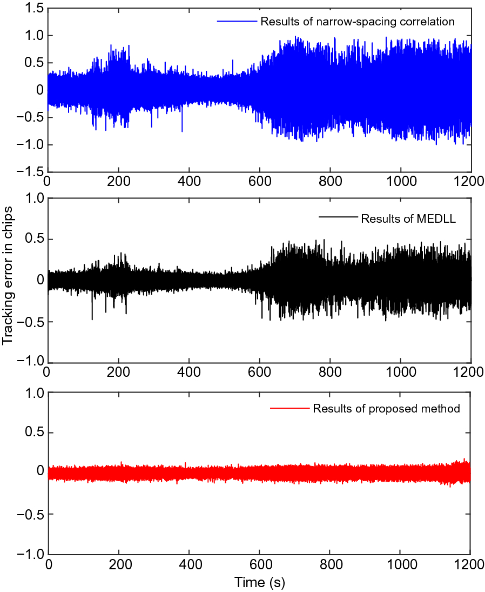
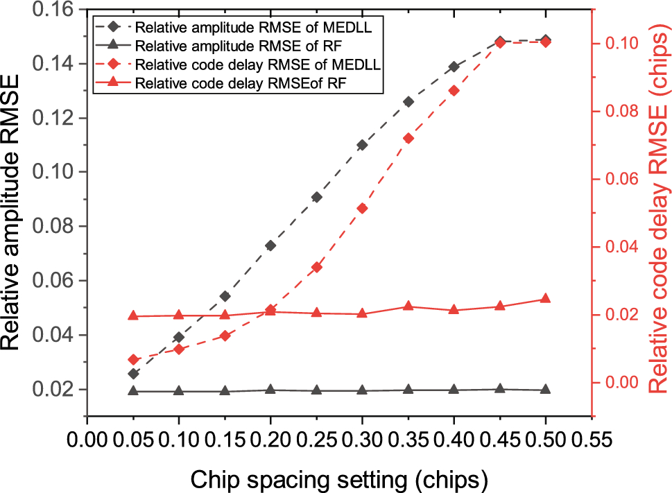
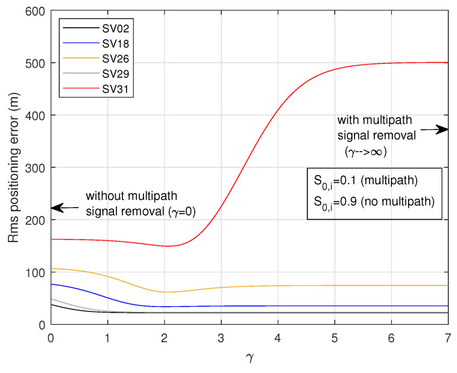

# 2026-10-02 GNSS 每日研究简报

## 今日快报

### 快报 1：极低 C/N0 下别先求鉴相角：直接把导频 I/Q 相关量送进惯导深耦合 EKF

- 主题：`pilot-iq-deep-ins-carrier-tracking-under-wideband-jamming`
- 来源 ID：`ion:gnss2026-16783`
- 来源链接：https://www.ion.org/gnss/abstracts.cfm?paperID=16783
- 发表日期：2026-09-18
- 来源类型：ION GNSS+ 2026 官方扩展摘要、伊利诺伊理工学院抗宽带压制载波跟踪研究
- 获取范围：公开扩展摘要全文；导频二级码剥离、原始 I/Q-EKF 接口与低 C/N0 结论已核对，未取得正式论文、干扰波形、惯导等级、试验时长或完整失锁统计

**内容：** 常规载波环先由 prompt I/Q 求反正切鉴相量，低 C/N0 时非线性与数据位符号会使测量偏置、跳变。研究选用无未知数据位的导频分量，剥离确定性二级码后，把原始 prompt I/Q 直接作为 EKF 观测，并由惯导状态共同约束载波频率与相位。

**结论：** 摘要称理论分析表明直接 I/Q 处理在低 C/N0 下保留更多信号信息，实验在低于 5 dB-Hz 时仍能稳健跟踪载波。公开页没有给“低于 5”具体下限、失锁率、惯导漂移、干扰带宽或传统 PLL/矢量环的同条件曲线，因此这只能视为作者报告的试验能力，不是任意接收机的灵敏度保证。

**关注理由：** 深耦合的收益不只来自加入 IMU，还来自避免先把弱相关量压缩成有奇异点的鉴相角。实现时应保存 I/Q 噪声协方差、二级码同步状态和惯导误差模型，否则“原始量更好”无法转化为可复现实验。

### 快报 2：低多普勒会让码间互相关长期不平均：GEO/QGEO 的 PRN 组合要先做最坏对筛选

- 主题：`l1c-weil-code-low-doppler-prn-minimax-selection`
- 来源 ID：`ion:gnss2026-16825`
- 来源链接：https://www.ion.org/gnss/abstracts.cfm?paperID=16825
- 发表日期：2026-09-16
- 来源类型：ION GNSS+ 2026 官方扩展摘要、L1Cd Weil 码与 GEO/QGEO 仿真 PRN 选择研究
- 获取范围：公开扩展摘要全文；10230 chip、BOC(1,1)、PRN 193–202、早减晚零交叉与 minimax 筛选范围已核对，未公开三颗候选 PRN 编号、偏差数值或硬件验证

**内容：** L1Cd 由 Legendre 序列、Weil 码与 PRN 专属插入索引构造。作者遍历 QZSS 已分配的十个 L1C PRN（193–202）两两组合，将 BOC(1,1) 互相关项带入归一化 Early–Late DLL，并在等功率、低相对多普勒下以最大跟踪偏差最小的 minimax 规则选三颗候选码。

**结论：** 扩展摘要说明不同 PRN 对和相对功率会产生确定性零交叉偏移；GEO/QGEO 几何近静止，使互相关项缺少时间平均，风险比快速变化的 MEO 对更持久。但摘要没有公布 RMS/最大偏差和最终 PRN 集，不能据此量化测距误差或复现最优组合。

**关注理由：** CDMA 码“全局互相关低”不等于任意部署组合都安全。仿真器和接收机验证应把轨道导致的低多普勒、近静态码差与近远效应一起建模，而不是只用随机相位做平均性能测试。

### 快报 3：Galileo G2 准导频不只是“更长积分”：健康状态叠加码可能在积分窗内改变

- 主题：`galileo-g2-quasi-pilot-qhs-receiver-processing`
- 来源 ID：`ion:gnss2026-16983`
- 来源链接：https://www.ion.org/gnss/abstracts.cfm?paperID=16983
- 发表日期：2026-09-16
- 来源类型：ION GNSS+ 2026 官方扩展摘要、GMV/ESA Galileo 二代准导频接收机原型评估
- 获取范围：公开扩展摘要全文；前端/基带影响、TDS/QHS 叠加码监测和 G2TURN 端到端能力已核对；接口参数仍标注 provisional，未公开 TTFF、灵敏度、功耗或 PVT 数字

**内容：** 新公布的 G2 准导频载频与信号计划允许评估前端带宽、下变频和基带通道；Quality Health Status（QHS）又以随时间变化的叠加码传送。接收机若跨较长相干或非相干积分，健康状态可能在窗内切换，因此必须在积分管理中持续监测 QHS，并校验 TDS/QHS 与其他任务数据的一致性。

**结论：** 作者称 G2TURN 已能从时间同步到完整 PVT 端到端处理准导频，既可只用新信号，也可与传统 Galileo/GPS 组合；但公开参数仍是预备版本，页面未给性能曲线。能确认的是接口与状态机工作量，不能把“首个系统性利用”改写为已证明的 TTFF 或稳健性增益。

**关注理由：** 长积分提升弱信号检测，却也扩大“状态在窗内变化”的风险。新信号支持不能只增加相关器，还需定义健康切换、积分截断、旧新信号一致性和回退策略。

### 快报 4：优化波形若还用 BPSK 本地副本会自损：硬件在环必须匹配片内极性变化

- 主题：`hil-distortion-optimized-multilevel-coded-spreading-tracking`
- 来源 ID：`ion:gnss2026-16828`
- 来源链接：https://www.ion.org/gnss/abstracts.cfm?paperID=16828
- 发表日期：2026-09-16
- 来源类型：ION GNSS+ 2026 官方扩展摘要、DLR/RWTH/Politecnico di Torino 多级编码扩频硬件在环研究
- 获取范围：公开扩展摘要全文；五种 MCS 候选、BPSK(10) 基线、有线 SDR 发收与 C/N0/码跟踪抖动指标已核对，未公开各候选绝对增益、发射功率点、滤波器或置信区间

**内容：** 研究把五种考虑硬件失真的多级编码扩频（MCS）波形经可配置 SDR 有线发射与记录，在不同发射功率下分别用传统 BPSK(10) 本地副本和高采样率波形匹配副本跟踪，比较估计 C/N0 与经验码抖动。

**结论：** 摘要报告优化 MCS 相对 BPSK(10) 有可测改善，且对片内发生极性翻转的候选，波形匹配跟踪可避免传统 BPSK 副本的相关损失并提高估计 C/N0。由于未给每个候选的 dB 或抖动数值，现阶段只能确认“实现匹配很重要”，不能排序五种波形或估算链路预算。

**关注理由：** 信号设计收益会被接收机副本、采样率和模拟链失真共同决定。标准化或选型若只比较理想自相关函数，可能把发射端优化的收益丢在接收端失配里。

### 快报 5：BDS-3 片波形异常与带宽、抽头间隔联合作用，测距偏差可达米级

- 主题：`bds-b1c-b2a-code-chip-anomaly-ranging-bias`
- 来源 ID：`ion:gnss2026-17046`
- 来源链接：https://www.ion.org/gnss/abstracts.cfm?paperID=17046
- 发表日期：2026-09-16
- 来源类型：ION GNSS+ 2026 官方扩展摘要、北航 BDS-3 B1C/B2a 空间信号质量建模研究
- 获取范围：公开扩展摘要全文；数字/模拟/混合异常、ISI、相关峰与 DLL 零交叉机制已核对，未公开正式论文、卫星实测数据、异常参数分布或逐配置误差表

**内容：** 数字异常使正负码片宽度不等，模拟滤波异常产生振铃，二者叠加会同时造成边沿错位、峰展宽与不对称；有限前端带宽和成形滚降失配还会引入片间干扰（ISI）。作者把这些效应映射到互相关峰、Early–Late 鉴别器斜率与零交叉偏移，比较 B1C/B2a 在不同带宽和抽头间隔下的锁点偏差。

**结论：** 仿真显示组合异常下 B1C/B2a 测距误差强烈依赖接收机前端带宽和相关器间隔，影响可到米级；摘要同时称可通过接收机配置或差分应用显著缓解。这里是模型仿真结论，没有公开在轨异常分布与完好性尾部，不能把“米级可达”解释成常态误差。

**关注理由：** 空间信号质量不是只由卫星决定，接收机参数会放大或抑制同一波形异常。高完好性测试应报告信号异常参数、带宽、滤波滚降、抽头间隔和鉴别器类型的联合矩阵。

## 深度研读

### 深读 1｜跟踪｜从相关峰走向锁点：用可微代价的梯度更新替代一对早晚差

- 类别：`tracking`
- 学习层级：`foundation`
- 选题定位：`经典基础`
- 来源 ID：`doi:10.1186/s43020-022-00077-z`
- 来源链接：https://doi.org/10.1186/s43020-022-00077-z
- 发表日期：2022-07-13
- 来源类型：Satellite Navigation 同行评审开放论文
- 获取范围：CC BY 4.0 开放全文；信号模型、梯度更新、BDS B1I/GPS L1 仿真与短/长时实测、Figures 1–12 和 Tables 1–4 已核对
- 价值评分：94/100（相关性 20，经典价值 18，证据 18，教学价值 20，工程价值 18）

#### 为什么先学这个

多径抑制的起点不是机器学习，而是理解反射副本怎样改变相关峰、DLL 又怎样把峰形变化变成码相误差。本文把“寻找相关峰”改写成一个简单代价函数的梯度下降，适合先建立信号、相关器、鉴别器、环路更新与假设边界的完整链条。

#### 先修知识

需要理解扩频码、码片、相关函数、prompt/early/late 抽头、I/Q 积分、C/N0、DLL 数控振荡器（NCO）与 LOS/NLOS；知道码相误差乘以码片等效距离后进入伪距。

#### 一句话逻辑

当直达信号强于迟到反射且相关峰最大位置不被反射搬走时，用 $`P_F=(1-R)^2`$ 把峰顶变成唯一谷底，再用 prompt 与单侧抽头近似梯度更新码 NCO，可少一个相关支路并降低多径下的跟踪抖动。

#### 研究问题与约束

论文处理的是“LOS 存在且功率强于 NLOS”的码多径，不覆盖直达完全遮挡、反射强于直达、多个近等功率峰或欺骗信号。理论误差包络忽略噪声和有限带宽；实测验证来自特定天线布设、BDS B1I/GPS L1 与离线软件接收机，不是城市全场景统计。

#### 核心方法论

接收相关函数写成直达自相关与一个延迟反射的叠加。作者观察到在假设范围内反射会扭曲峰两侧，却不改变横轴最大位置，于是将归一化相关幅度代入二次代价。左导数实现只需 late+prompt，右导数实现只需 early+prompt；两路幅度差形成梯度，驱动码 NCO 向代价最小点收敛。

#### 关键公式逐步推导

单反射下的相关模型为：

```math
R_M(\tau)=R(\tau)+\alpha_sR(\tau-\tau_s),
```

其中 $`\alpha_s\in(-1,1)`$ 表示反射相对幅度及相位符号，$`\tau_s>0`$ 是反射相对延迟。归一化后定义可微代价：

```math
P_F(\bar R)=(1-\bar R)^2.
```

若采用 prompt/late，间隔为 $`d`$，则左侧有限差分给出码相迭代：

```math
\tau_{k+1}=\tau_k-\mu\frac{P_F(\bar S_P)_k-P_F(\bar S_L)_k}{d}.
```

无多径理想条件下可化为 $`\tau_{k+1}=(1-2\mu)\tau_k`$，所以 $`0<\mu<1`$ 才收敛；$`\mu`$ 决定过阻尼、临界或欠阻尼折衷。

#### 经典价值与创新边界

经典价值是把 DLL 的“找零交叉”与优化的“找谷底”统一起来，并明确抽头数、控制步长和稳定性之间的关系。创新在于只用 prompt 加单侧抽头实现梯度型码跟踪。边界同样明确：峰顶保持不动是强假设；有限带宽、噪声和强 NLOS 会破坏理想曲面。

#### 整体逻辑链

接收直达与反射叠加；生成 prompt/单侧本地码；I/Q 混频并按 1 ms 积分；计算非相干幅度；用短窗最大值归一化；构造二次代价；有限差分近似梯度；更新码 NCO；输出码相与伪距；用窄相关和 MEDLL 作基线。

#### 原文图表与结果分析



> 图表源：Qiu 等《A multipath mitigation algorithm for GNSS signals based on the steepest descent approach》Figure 12，[开放全文](https://doi.org/10.1186/s43020-022-00077-z)。CC BY 4.0；直接保存出版页原始 PNG，未裁剪、重绘或改动坐标轴、曲线、图例与数值。

横轴是 0–1200 s，纵轴是码跟踪误差（chip）；蓝、黑、红分别为窄间隔相关、MEDLL 和本文方法。蓝色误差在约 150–250 s、600 s 后明显变宽，黑色较小但仍随区段变化，红色大部分时间维持在接近零的窄带。作者对同段数据给出的标准差依次为 0.088、0.031、0.016 chip。图直接显示的是单颗 PRN 6、特定重复观测段的环路输出，不是位置误差，也没有独立真值证明红线的均值绝对无偏。

#### 原文结果论述

仿真在 C/N0 为 43 或 53 dB-Hz、$`\mu`$ 约 0.2–0.9 时，误差落在 0.1 chip 内的概率超过 95%；作者认为 0.6–0.8 的步长对噪声折衷较好。短时实测稳定后各方法最大误差均小于 0.2 chip；长时 PRN 6 的标准差如图所示。处理 12 s 数据时，窄相关耗时 13.708 s，本文方法 10.390 s，作者计算缩短 24.21%。这些数值属于该软件、CPU 与数据配置。

#### 常见误区与适用边界

第一，把“反射总是更弱”当城市普遍事实；NLOS-only 时并不成立。第二，把相关峰最大点不变等同 DLL 一定无偏；带宽、噪声与多反射会改变局部梯度。第三，将 chip 标准差直接写成米级位置改进。第四，只看计算时间百分比，不报告语言、采样率与优化级别。第五，忽略归一化窗和 $`\mu`$ 的稳定性。第六，把单 PRN 重复段当统计泛化。

#### 工程实现步骤

1. 输出 prompt 与 early 或 late 的复相关量，并保留 C/N0 与锁定状态。
2. 对 I/Q 求幅度，按短窗峰值归一化，监测峰值突变。
3. 计算 $`P_F=(1-\bar S)^2`$ 与有限差分梯度。
4. 用 C/N0 和动态范围调度 $`\mu`$，并限制单历元码 NCO 步长。
5. 同时运行普通窄相关作影子通道，检查两者码相发散。
6. 当多峰、LOS 弱于 NLOS 或峰值不唯一时降级而非强行更新。

#### 复现实验设计

用 GPS L1 C/A 与 BDS B1I 软件信号生成器，采样 10 MHz、1 ms 相干积分、0.05/0.1 chip 抽头；C/N0 设 25–53 dB-Hz，单反射延迟 0–1.5 chip、幅度比 0.1–1.2、相位覆盖 $`0`$ 到 $`2\pi`$。比较窄相关、MEDLL 与梯度法，$`\mu`$ 扫描 0.1–0.9。指标为码偏差均值/标准差/95% 分位、失锁率、收敛时间、每毫秒运算量；失败用例必须含 NLOS-only、双反射和前端 2/4/10 MHz。

#### 与定位及低成本实现的联系

少一个 early 或 late 支路可降低相关器和存储负担，适合低成本 SDR/芯片；但位置端真正需要的是偏差而非仅抖动降低。下一节保留多相关器的峰形信息，显式估计反射幅度与延迟后再从相关函数中减去，为复杂峰形提供更强模型。

#### 本节小结

梯度法说明了最基本的工程事实：跟踪器优化的是一个由相关峰、抽头和代价函数共同定义的锁点。方法很轻量，但收益依赖直达峰仍主导；假设失效时必须有检测和回退。

### 深读 2｜接收机工程｜不直接猜锁点：让随机森林估计反射幅度与延迟，再重建并相减

- 类别：`receiver-engineering`
- 学习层级：`intermediate`
- 选题定位：`基础进阶`
- 来源 ID：`doi:10.1007/s10291-024-01667-x`
- 来源链接：https://doi.org/10.1007/s10291-024-01667-x
- 发表日期：2024-05-20
- 来源类型：GPS Solutions 同行评审开放论文
- 获取范围：CC BY 4.0 开放全文；单/三多径训练与仿真、MEDLL 对照、香港城市 IF 数据、Figures 1–18 和 Tables 1–6 已核对
- 价值评分：96/100（相关性 20，经典价值 18，证据 19，教学价值 19，工程价值 20）

#### 为什么先学这个

上一节只利用峰顶仍在原位的几何性质，遇到多反射、带宽变窄或峰形圆化就会受限。本节把多个相关器抽头视为一段“峰形指纹”，估计每个反射的幅度与延迟，再从总相关函数中显式扣除，进入参数化多径抵消。

#### 先修知识

需要理解多相关器、复相关函数、MEDLL、C/N0、前端带宽、NEML/HRC 鉴别器、随机森林回归、bootstrap 集成、训练/测试划分与 RMSE。

#### 一句话逻辑

用 −3 到 +3 chip 的等间隔相关样本训练随机森林回归反射幅度和延迟，按估计参数重建反射相关函数并相减，再让普通 DLL 在“清洁后”的直达峰上判别码相。

#### 研究问题与约束

作者希望比迭代最大似然 MEDLL 更不依赖理想峰形和前端带宽。训练样本主要由给定模型仿真，单多径与最多三多径的参数范围预先规定；实测仅 GPS、香港尖沙咀一个地点、180 历元、2 MHz 前端和约 39 dB-Hz 平均 C/N0。模型对未见调制、天线、采样率与反射数的迁移未被完整验证。

#### 核心方法论

接收相关函数是直达峰与多个延迟缩放峰之和。随机森林输入为多相关器的同相采样，输出每条反射的等效幅度 $`\alpha_{Ii}`$ 与码延迟 $`\tau_i`$；每棵树在 bootstrap 样本上分裂，最终平均输出。接收机用固定参考自相关函数重建反射分量，逐项相减后把剩余峰送入 NEML、窄相关或 HRC。

#### 关键公式逐步推导

多径相关输出可写成：

```math
R_{\Sigma I}(t)=R(t-\tau_0)+\sum_{i=1}^{M}\alpha_{Ii}R(t-\tau_i)+N_I(t).
```

随机森林由 $`p`$ 棵回归树平均：

```math
\hat\theta=m_D(x)=\frac{1}{p}\sum_{j=1}^{p}m_{D_j}(x),
```

其中 $`\hat\theta=\{\hat\alpha_{I1},\ldots,\hat\tau_1,\ldots\}`$。清洁直达峰近似为：

```math
\hat R_0(t)=R'_{\Sigma I}(t)-\sum_{i=1}^{M}\hat\alpha'_{Ii}R(t-\hat\tau_i).
```

参数估计以延迟 RMSE 等指标评价：

```math
\operatorname{RMSE}(\tau_i)=\sqrt{\frac{1}{m}\sum_{k=1}^{m}(\hat\tau_i^k-\tau_i^k)^2}.
```

#### 经典价值与创新边界

经典价值是延续 MEDLL 的“估计—重建—相减”物理结构，而不是直接从峰形回归位置。创新是用随机森林替代迭代最大似然搜索，增强窄带峰形下的稳健性并降低参数估计时间。边界在于训练分布仍编码了反射数、延迟、幅度、C/N0 与参考峰形；随机森林并未消除模型失配，只把模型放进数据生成与标签里。

#### 整体逻辑链

多相关器采样峰形；归一化实测幅度；随机森林估计反射参数；按固定参考峰重建多径；从总相关函数相减；DLL 判别清洁峰；输出伪距；用模拟真值比较参数/伪距误差，再用城市 IF 数据比较 2D/3D 定位统计与运行时间。

#### 原文图表与结果分析



> 图表源：Qi 等《Random forest-based multipath parameter estimation》Figure 17，[开放全文](https://doi.org/10.1007/s10291-024-01667-x)。CC BY 4.0；直接保存出版页原始 PNG，未裁剪、重绘或修改坐标轴、曲线、标记与数值。

横轴为相关采样间隔 0.05–0.50 chip；左纵轴是相对幅度 RMSE，右纵轴是相对码延迟 RMSE（chip）。三角实线的 RF 两类误差在 0.30 chip 以内近乎平坦，延迟 RMSE 约 0.02 chip；菱形虚线的 MEDLL 随间隔增大快速上升，到 0.45–0.50 chip 时延迟 RMSE 约 0.10 chip。图直接支持“RF 对抽头稀疏较不敏感”，但条件固定在 35 dB-Hz、20 MHz、单多径模型，不能证明任意真实城市环境只需稀疏抽头。

#### 原文结果论述

单多径训练集 80,000 样本，其中 30% 无多径、70% 有一个反射；输入为 −3 到 +3 chip、0.3 chip 间隔的 21 个抽头，森林含 100 棵树，训练 C/N0 为 18–35 dB-Hz。18 个测试集各 2,000 样本，带宽为 2/4/8/20 MHz。作者报告前端小于 6 MHz 时 RF 伪距误差明显小于 MEDLL。香港实测以 20 Msps 采集、2 MHz 带宽、约 39 dB-Hz，180 历元中相对普通 DLL 的 2D/3D RMSE 分别降低 8.5%/8.7%；这是短样本平均，不是尾部或跨地点保证。

#### 常见误区与适用边界

第一，把仿真标签精确等同真实反射参数。第二，训练和测试共享参数范围却宣称域外泛化。第三，只看平均 RMSE，不看极端误差和误差相关性。第四，认为 21 抽头一定低成本；前端采样与并行相关仍有代价。第五，把 RF 对带宽稳健理解为无需重新标定。第六，用 180 历元的 8% 改进支持安全结论。第七，忽略错误相减可能制造新峰。

#### 工程实现步骤

1. 在跟踪通道生成覆盖 ±3 chip 的多抽头相关向量与 C/N0、带宽元数据。
2. 对不同调制、采样率、带宽和反射数生成可追溯训练集。
3. 分离地点/硬件/日期建立验证集，避免随机切分泄漏。
4. 回归 $`\alpha_i,\tau_i`$，同时输出树间方差作不确定度提示。
5. 重建并相减反射峰；若剩余峰能量或对称性恶化则回退普通 DLL。
6. 在位置端同时评估均值、95/99.9% 分位和连续错误时长。

#### 复现实验设计

生成 GPS L1 C/A 单/双/三反射数据：采样 20/58 Msps，带宽 2/4/8/20 MHz，C/N0 18–45 dB-Hz，反射延迟 0.05–2.0 chip、幅度 0.05–1.2。比较普通 DLL、MEDLL 与 RF（抽头间隔 0.05–0.5 chip，树数 50/100/300）。再用至少三城市、三天线的原始 IF 做域外测试。指标包括参数 RMSE、伪距偏差/尾部、错误相减率、2D/3D SPP 和每通道 CPU/内存；基线必须使用同一抽头预算。

#### 与定位及低成本实现的联系

随机森林推理和较稀疏抽头可比高维迭代搜索更易落在嵌入式接收机，但本节最终仍给每颗星一个“修正后的伪距”。若模型不确定，硬修正可能比保留原观测更危险。下一节改用分类软输出作为位置端权重，让可疑观测连续降权，并显式考虑删星导致的几何恶化。

#### 本节小结

参数学习把多径抑制从“调一个鉴别器”扩展为“解释并减去峰形组成”。它在受控分布和窄带实测中优于 MEDLL，但部署关键是域外监测、错误相减回退和位置尾部，而不只是训练集 RMSE。

### 深读 3｜定位｜可疑星不一定该删：把 CNN 置信度变成权重，兼顾多径与几何

- 类别：`positioning`
- 学习层级：`advanced`
- 选题定位：`前沿进阶`
- 来源 ID：`doi:10.3390/s24144663`
- 来源链接：https://doi.org/10.3390/s24144663
- 发表日期：2024-07-18
- 来源类型：Sensors 同行评审 CC BY 4.0 开放论文、纯 GNSS 多径检测与加权单点定位仿真研究
- 获取范围：PMC/出版全文；二维相关器网格、时/频域 CNN/MLP、硬/软判决、五星 SPP 几何仿真、Figures 1–11 与附录参数已核对
- 价值评分：95/100（相关性 20，经典价值 17，证据 18，教学价值 20，工程价值 20）

#### 为什么先学这个

前两节在跟踪层试图修正码相，但任何修正都可能不确定。位置解真正面对的选择是：保留、降权还是删除可疑星。删星能去掉 50 m 偏差，也可能让 GDOP 爆炸；本文把 CNN 的连续输出接到加权最小二乘，展示信号质量与卫星几何必须联合决策。

#### 先修知识

需要理解二维时延—多普勒相关面、DFT、CNN/MLP、softmax、虚警/漏检、伪距观测方程、设计矩阵、加权最小二乘、GDOP 与 SPP 线性化。

#### 一句话逻辑

CNN 从二维相关器网格判断每颗星受多径的程度，softmax 不只做二元删留，而通过指数 $`\gamma`$ 映射为 WLS 权重，使位置解在“保留坏伪距”和“删星破坏几何”之间连续折衷。

#### 研究问题与约束

文章的分类与定位验证主要基于合成多径模型。位置示例固定五颗 GPS 星、每颗伪距独立 5 m 标准差、单颗星增加 50 m、多径 softmax 值理想设为 0.1/0.9；没有真实城市路线、模型校准误差、跨接收机域移或完整性尾部。因此图展示的是机制和参数敏感性，不是现场精度承诺。

#### 核心方法论

对每颗星建立码延迟×多普勒二维相关器网格；分别用时域网格或其二维 DFT 幅相特征训练 MLP/CNN 分类多径。硬判决把可疑伪距删除；软判决取“无多径”输出 $`S_{0,i}`$，经 $`S_{0,i}^{\gamma}`$ 形成对角权重。$`\gamma=0`$ 等于普通 LS，$`\gamma\to\infty`$ 接近删掉判为多径的星，中间值保留几何同时限制其影响。

#### 关键公式逐步推导

第 $`i`$ 颗星的伪距模型为：

```math
r_i=\sqrt{(X_i-x)^2+(Y_i-y)^2+(Z_i-z)^2}+\Delta r_c.
```

在线性化点 $`\tilde x`$ 附近，加权最小二乘增量为：

```math
\delta\hat x=(G^{\mathsf T}WG)^{-1}G^{\mathsf T}W(r-\tilde r).
```

作者把两类 softmax 输出映射为：

```math
W=\operatorname{diag}\left(S_{0,1}^{\gamma},\ldots,S_{0,K}^{\gamma}\right).
```

所以 $`\gamma`$ 是从全保留到近似删除的连续旋钮；它不能脱离概率校准、噪声方差和几何单独选择。

#### 经典价值与创新边界

经典价值是把信号质量信息接入 WLS，而非停在分类准确率。创新点包括二维相关网格的时/频域学习与 softmax 权重。边界是 softmax 通常不是校准后的误差方差或多径米级偏差；用指数变成权重是工程映射，不构成完整概率最优或完整性保证。

#### 整体逻辑链

原始信号形成二维相关网格；多径模型生成训练标签；二维 DFT增强可分特征；CNN 输出无多径/多径分数；多历元可做投票降低判决噪声；硬模式删星，软模式构造 $`W`$；线性化伪距方程求 SPP；扫描 $`\gamma`$ 并比较不同故障星下的 3D RMS。

#### 原文图表与结果分析



> 图表源：Lopes、Matos 与 Silva《Deep Learning Soft-Decision GNSS Multipath Detection and Mitigation》Figure 11，[PMC 开放全文](https://pmc.ncbi.nlm.nih.gov/articles/PMC11280973/)。CC BY 4.0；直接保存 PMC 原始 JPEG，未裁剪、重绘或修改坐标轴、曲线、图例与数值。

横轴是权重指数 $`\gamma`$，纵轴是 3D 定位 RMS（m）；五条曲线表示分别由 SV02/18/26/29/31 承担 50 m 伪距偏差。$`\gamma=0`$ 为不降权；对前四颗星，增大到约 2 后误差下降并趋近删星解。红色 SV31 在 $`\gamma\approx2`$ 附近短暂改善，继续趋向删除时却升到约 500 m，说明该星对几何至关重要。图证明的是所设几何下“硬删可能更坏”，不证明 $`\gamma=2`$ 可跨星座、城市或模型通用。

#### 原文结果论述

作者的五 GPS 星示例中，无多径但含每星 5 m 独立高斯噪声时，3D RMS 为 22.0 m；单颗多径给对应伪距加 50 m。对四颗星，删除受污染观测通常降低误差；删除 SV31 却因 GDOP 大幅恶化产生异常大误差。设无多径 $`S_0=0.9`$、多径 $`S_0=0.1`$ 时，作者报告 $`\gamma\approx2`$ 的软权重总体最好。分类部分是仿真数据，结果不能等同真实 softmax 已校准。

#### 常见误区与适用边界

第一，把分类准确率当位置安全性。第二，把 softmax 当真实无多径概率。第三，一见可疑星就删除，不检查 GDOP。第四，用 $`S_0^\gamma`$ 却忽略基础热噪声/高度角方差。第五，用 RMS 掩盖危险尾部。第六，用合成 DLR 多径训练后直接部署到新天线。第七，认为纯 GNSS 等于无外部依赖；模型训练和标定仍依赖数据与场景。

#### 工程实现步骤

1. 为每星输出相关网格、C/N0、高度角和跟踪状态。
2. 在独立地点校准 CNN 分数，绘制可靠性图而非只报准确率。
3. 将热噪声/高度角方差与多径权重组合，避免重复计权。
4. 对每次降权同时计算条件数、GDOP 与可用卫星数。
5. 联合扫描 $`\gamma`$ 和最小权重下限，设置几何保护门。
6. 输出普通 LS、软 WLS、硬删除三套影子解并监测分歧。
7. 用位置 95/99.9% 分位、误警/漏检和连续危险误差验收。

#### 复现实验设计

先复现五 GPS 星仿真：每星伪距噪声 5 m，单星偏差 0–100 m，softmax 正确/错误校准从 0.05 到 0.45，$`\gamma`$ 扫描 0–8；再扩展至 GPS/Galileo/BDS 的 6–20 星几何与每历元多星相关偏差。比较普通 LS、硬删除、本文软 WLS、Huber WLS 和按已知误差方差的 oracle WLS。指标为 2D/3D RMS、95/99.9% 分位、GDOP、不可用率、危险误导概率与计算量；最终在独立城市 IF/伪距数据上冻结模型测试。

#### 与定位及低成本实现的联系

该方法只用 GNSS 相关量和星历几何，不依赖 IMU、相机或 3D 地图，符合纯 GNSS SPP 路径。低成本接收机的瓶颈是能否开放二维相关网格；若只能得到少量抽头，可缩小模型，但必须重新校准。最重要的接口不是“多径标签”，而是把观测可信度、基础方差与几何代价共同送入解算器。

#### 本节小结

多径抑制的终点不是把每颗星判成好或坏，而是管理它对位置解的影响。软权重能在保留几何与限制偏差间折衷，但 $`\gamma`$、softmax 校准与尾部风险必须用独立场景验证。
