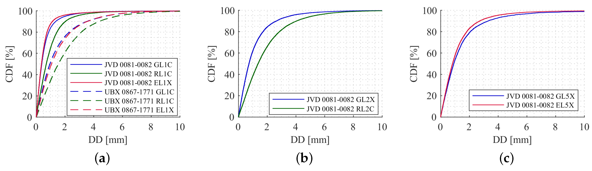
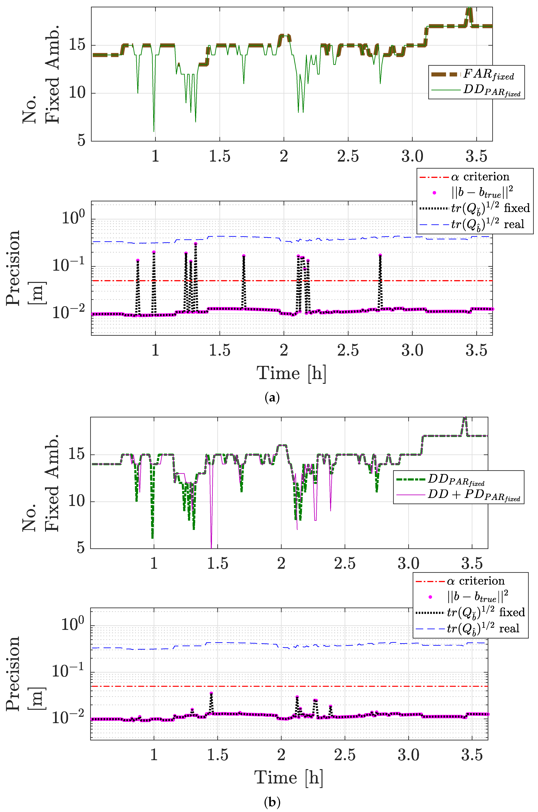
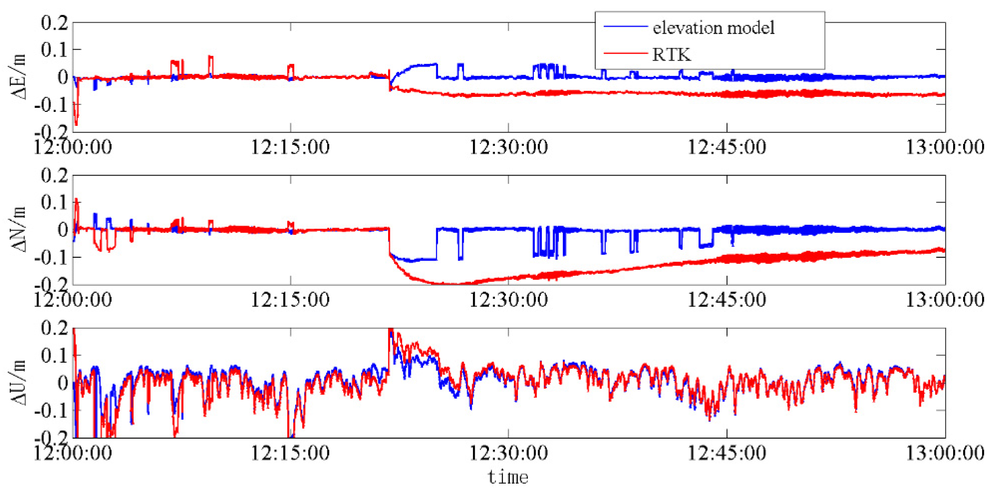

# 2026-10-03 GNSS 每日研究简报

## 今日快报

### 快报 1：机器学习能加快网端宽巷固定，但众包站的错固定风险仍显著高于测地站

- 主题：`ml-ppp-rtk-network-ambiguity-validation`
- 来源 ID：`ion:gnss2026-16951`
- 来源链接：https://www.ion.org/gnss/abstracts.cfm?paperID=16951
- 发表日期：2026-09-16
- 来源类型：ION GNSS+ 2026 官方扩展摘要、u-blox／York University PPP-RTK 网端机器学习研究
- 获取范围：公开扩展摘要全文；39 个站、站点专用／通用 XGBoost、宽巷与窄巷固定指标已核对，未取得正式论文、特征清单、训练切分或置信区间

**内容：** 研究以 13 个众包站和 26 个测地站的数据训练 XGBoost，分别构建每站独立模型与聚合全部站点的通用模型，用于替代 PPP-RTK 网络处理中的经验模糊度验证规则。重点不在用户端位置回归，而在判断宽巷／窄巷候选是否可信以及何时接受固定。

**结论：** 摘要称测地站的宽巷模糊度验证正确率由约 75% 提升到约 97%，站点专用模型的错固定率约 0.04%，68% 分位首次固定时间由 18.5 min 降到 1.5 min；众包站正确率由 67.5% 升到 81.9%，错固定率由 4.5% 降到 1% 以下，但 68% 分位首次固定仍约 11.5 min。窄巷只呈较温和改善。数字来自作者的站网与划分，不能外推为任意廉价站的完整性保证。

**关注理由：** 机器学习最有价值的接口可能不是直接输出坐标，而是替代刚性门限；但众包硬件、天线环境和站址变化造成明显域偏移。部署时必须同时报告漏固定、错固定、时间到固定和跨站泛化，而不能只报平均正确率。

### 快报 2：道路低成本 PPP-RTK／NRTK 对比，先把参考轨迹的独立性和共模误差说清

- 主题：`low-cost-road-ppp-rtk-nrtk-reference-workflow`
- 来源 ID：`ion:gnss2026-17083`
- 来源链接：https://www.ion.org/gnss/abstracts.cfm?paperID=17083
- 发表日期：2026-09-16
- 来源类型：ION GNSS+ 2026 官方点播扩展摘要、低成本车载 PPP-RTK／NRTK 道路试验
- 获取范围：公开扩展摘要全文；F9P/F9R/NRTK 三配置、城市／高速场景、双测地接收机刚性杆参考流程与定性结果已核对，未公开逐项 2DRMS、道路长度、改正服务或原始日志

**内容：** 作者比较 GNSS-only F9P PPP-RTK、GNSS/IMU 融合 F9R PPP-RTK 与 GNSS-only NRTK，并用装在标定刚性杆上的两台测地接收机生成后处理参考轨迹。候选参考解按杆长一致性与垂向一致性加权，再人工确认有效区间，以避免把被测低成本接收机自身当真值。

**结论：** 摘要报告紧凑城市段达到分米级水平表现，较长高速段退化更强，尤其是 F9P PPP-RTK；F9R PPP-RTK 连续性最好，而 F9P NRTK 在城市测试的水平 2DRMS 最低。参考流程虽与被测解分离，两台测地锚点仍可能共享轨道、大气或环境共模误差，尤其影响绝对垂向；人工区间确认也尚未扩展到大规模道路数据。

**关注理由：** 接收机对比的可信度由“参考怎样生成”决定。车载试验应同时公开参考的几何闭合、共同失效、人工筛选规则以及城市和高速分段指标，避免把参考轨迹自身的平滑或共模偏差当成被测设备性能。

### 快报 3：新一代手机不必然有更好的码观测，天线集成可压过芯片代际收益

- 主题：`cross-generation-smartphone-observable-quality`
- 来源 ID：`ion:gnss2026-17087`
- 来源链接：https://www.ion.org/gnss/abstracts.cfm?paperID=17087
- 发表日期：2026-09-17
- 来源类型：ION GNSS+ 2026 官方扩展摘要、四款手机跨代际原始观测评估
- 获取范围：公开扩展摘要全文；Mi 8／Pixel 5／Mi 14／Pixel 9、约 1 h 静态观测、500 m 参考站、三日 RTK 与 CMC／双差残差结果已核对，未取得正式论文、逐星样本数或固件复现包

**内容：** 四台手机在同一测地墩、同一朝向、关闭 duty cycling 后记录 GPS、Galileo 与 BDS 原始量；作者用 C/N0、双差载波残差、周跳、码减载波（CMC）以及三日静态 RTK 评估“可见卫星更多”是否真的转化为更可靠的精密定位。

**结论：** 摘要称 GPS L1 双差载波残差约在 ±0.1–0.2 cycle 内，L5/E5a 载波残差均低于 0.04 m；低仰角 L1/E1 CMC 对部分设备散布超过 ±40–60 m。Mi 8 的三日静态 RTK 中位二维误差约 0.67 m，且重复性最好；新款 Pixel 9 跟踪连续性较好，却有显著日间波动和极端离群。L1/E1 码残差 RMS：小米约 4–5 m，Pixel 约 14–17 m；这些是单地点、固定朝向与关闭占空比结果，不代表手持动态城市性能。

**关注理由：** 芯片支持更多频点只扩大“可用信号集合”，不会自动修复天线方向图、机身耦合、群时延和固件状态机。手机 RTK 选型应以观测域稳定性和跨日错固定统计为主，而不是按上市年份排序。

### 快报 4：TD-CMC 只拦快速码—载波不一致，慢变残差还要靠尾部包络进入 RTK 协方差

- 主题：`td-cmc-gating-overbound-rtk-iar`
- 来源 ID：`ion:gnss2026-17092`
- 来源链接：https://www.ion.org/gnss/abstracts.cfm?paperID=17092
- 发表日期：2026-09-17
- 来源类型：ION GNSS+ 2026 官方扩展摘要、DLR 城市 RTK 模糊度筛选与误差包络研究
- 获取范围：公开扩展摘要全文；FOGM+WGN 压力仿真、30 次蒙特卡洛、600 s GPS/Galileo UAV 段、经验尾部包络设计已核对，未公开最终门限、固定率或保护级数字

**内容：** 方法以时差码减载波（TD-CMC）作为时间一致性门，只识别快速变化的码—载波不一致；通过门限的观测并不默认“干净”，而是再按仰角建立高斯上包络协方差。仿真改变一阶 Gauss–Markov 残差的幅度与相关时间，前 10 次运行校准、后 20 次独立评估，并用 600 s UAV 实测段构造去几何、去趋势的码残差代理。

**结论：** 摘要指出过严的逐星排除会损失卫星数和模糊度连续性，而慢变残差能穿过 TD-CMC 门，因此门限和剩余协方差必须成对设计；膨胀量来自归一化经验尾部，而非先验假设样本高斯。未公布固定成功率、错固定率和保护级，所以目前能确认的是设计原则，不是城市 RTK 性能增益。

**关注理由：** “检测后保留什么统计模型”与“检测谁”同等重要。工程实现应把门限、保留卫星几何、尾部包络、固定验证与连续性放在一条闭环里调参。

### 快报 5：闪烁下谁先失锁不只看频率，C/N0 裕量、衰落时间尺度和鉴相器捕获范围共同决定

- 主题：`multifrequency-gps-scintillation-loss-of-lock`
- 来源 ID：`ion:gnss2026-17200`
- 来源链接：https://www.ion.org/gnss/abstracts.cfm?paperID=17200
- 发表日期：2026-09-18
- 来源类型：ION GNSS+ 2026 官方扩展摘要、2026 年 1 月地磁暴多频 GPS 失锁研究
- 获取范围：公开扩展摘要全文；Daytona Beach PolaRx5S 50 Hz 数据、22 dB-Hz 声明门限、相位屏与相关后跟踪仿真已核对，未公开整场逐频失锁计数、接收机固件或跨站验证

**内容：** 作者比较同一风暴中 GPS L1 C/A、L2C 和 L5 的失锁，区分两类机制：慢衰落把报告 C/N0 压到接收机约 22 dB-Hz 门限；快衰落在 C/N0 输出的平均窗中被抹平，却使多普勒跟踪误差越过载波鉴相器捕获范围。相位屏产生同一闪烁实现，再驱动三个信号的相关后跟踪仿真。

**结论：** 实测中 L5 的失锁明显少于 L1/L2C，主要因其基线 C/N0 更高、离门限更远；慢衰落时裕量最小的 L2C 更易失锁，快衰落时数据调制 L1 C/A 的 Costas 鉴相器捕获范围只有 L2C/L5 导频四象限鉴相器的一半，L1 可在报告 C/N0 尚高时先失锁。结论来自单站单风暴与特定接收机状态机，不能变成“L5 永远最稳”的普遍排序。

**关注理由：** 失锁模型若只用平均 C/N0 会漏掉快衰落的动态应力。接收机测试需同时回放幅度／相位闪烁、报告窗、环路带宽、鉴相器类型和频点间基线功率。

## 深度研读

### 深读 1｜接收机工程｜先量清载波：运动零基线双差怎样分离毫米噪声与时间不同步

- 类别：`receiver-engineering`
- 学习层级：`foundation`
- 选题定位：`经典基础`
- 来源 ID：`doi:10.3390/s20144046`
- 来源链接：https://doi.org/10.3390/s20144046
- 发表日期：2020-07-21
- 来源类型：Sensors 同行评审开放论文
- 获取范围：CC BY 4.0 开放全文；车载／飞行移动零基线、双差与异步改正、Figures 1–17 和 Tables 1–6 已核对
- 价值评分：95/100（相关性 20，经典价值 19，证据 20，教学价值 19，工程价值 17）

#### 为什么先学这个

RTK 的整周固定、协方差和验证门限都从“观测噪声有多大”开始。静态零基线很容易把环境和动态问题藏掉；本文把两个接收机接到同一天线并随汽车和飞机运动，展示双差虽能消钟差与共同路径，接收机时间标签不齐仍会把平台速度投影成厘米级伪载波误差。

#### 先修知识

需要理解载波相位、整周模糊度、站间单差、星间双差、视线单位向量、接收机钟偏、周跳、C/N0、白相位噪声和累积分布函数。毫米是相位双差的距离单位，不是最终三维位置误差。

#### 一句话逻辑

同天线的运动零基线先消共同传播误差，再用速度与接收机时间差改正运动偏置、修复周跳并逐弧去整数，剩余双差分布就能给 RTK 随机模型提供可测的毫米级噪声尺度。

#### 研究问题与约束

城市试验以同一测地天线分接两台 Javad 测地接收机和两台 u-blox NEO M8T，高敏设备只跟踪各系统 L1；飞行试验使用测地级设备。零基线会强消天线、传播与部分环境共模项，因此它适合定接收机噪声和同步效应，却不能直接代表真实基站—流动站的电离层、对流层、两副天线多径或长基线误差。

#### 核心方法论

对接收机 A/B 和卫星 i/k 做双差；根据两接收机实际接收时刻差、平台速度以及两颗星视线差计算运动偏置并扣除。以三差检测／修复周跳，超过 1.2 cm 的三差样本按作者的 3σ 门限剔除；零基线每个连续弧的双差中位数除以波长并取整，得到应扣除的整数模糊度。GLONASS 还需处理 FDMA 接收机间频间偏差。

#### 关键公式逐步推导

两站两星的载波双差为：

```math
\Phi_{AB}^{ik}=(\Phi_A^i-\Phi_A^k)-(\Phi_B^i-\Phi_B^k)=\lambda N_{AB}^{ik}+e_{AB}^{ik}.
```

若两个接收机的实际时间标签相差 $`t_A-t_B`$，平台速度为 $`\mathbf v(t)`$，一阶运动偏置为：

```math
b_{AB}^{ik}=[\mathbf s_B^i(t)-\mathbf s_B^k(t)]^T\mathbf v(t)(t_A-t_B),\qquad
\widetilde\Phi_{AB}^{ik}=\Phi_{AB}^{ik}-b_{AB}^{ik}.
```

零基线连续弧的整数可由稳健中位数估计：

```math
N_{AB}^{ik}=\operatorname{round}\!\left(\frac{\operatorname{med}(\Phi_{AB}^{ik})}{\lambda}\right).
```

扣除整数后，剩余量用于估计系统／频点／接收机组合的噪声分布。

#### 经典价值与创新边界

经典价值是把双差、同步、周跳、逐弧整周和随机模型串成可执行处理链；创新点在于系统比较车载城市与高动态飞行的移动零基线。边界是同天线设计主动移除了很多真实 RTK 误差；1.2 cm 剔除门限也会改变尾部，不能把处理后的 CDF 当未监测失效概率。

#### 整体逻辑链

同天线分路采集；统一 RINEX 与时间尺度；形成站间、星间双差；计算并扣除运动异步项；三差找周跳；删异常；逐连续弧取整去模糊度；处理 GLONASS 频间偏差；按时间、仰角、C/N0 与 Allan 偏差分析；把经验分布转成观测权。

#### 原文图表与结果分析



> 图表源：Ruwisch、Jain 与 Schön《Characterisation of GNSS Carrier Phase Data on a Moving Zero-Baseline in Urban and Aerial Navigation》Figure 12，[开放全文](https://doi.org/10.3390/s20144046)。CC BY 4.0；直接保存出版页原始 PNG，未裁剪、重绘或改动坐标轴、曲线、图例与数值。

横轴为载波双差绝对幅度（mm），纵轴为 CDF（%）；(a)/(b)/(c) 分别为 L1/L2/L5。实线是 Javad 测地接收机对，L1 虚线是 u-blox 高敏接收机对。L1 上测地对的曲线更靠左，而高敏对明显右移；L2/L5 只有测地对。图直接显示处理后双差的经验分布，不显示坐标误差、错固定率或被剔除异常的尾部。

#### 原文结果论述

城市段测地对 95% 的 GPS／GLONASS／Galileo L1 双差低于 2／2.8／1.7 mm，高敏对为 4.8／5.6／4.7 mm；测地对 L2 的 GPS／GLONASS 为约 3.6／5.3 mm，L5 的 GPS／Galileo 为约 4.8／3.8 mm。高敏接收机记录的载波观测比码观测少 17%–26%。未改正的运动异步在车速约 15 m/s 时可超过 10 cm。以上是特定接收机、阈值和同天线配置的经验统计。

#### 常见误区与适用边界

第一，把零基线毫米噪声当真实 RTK 总误差。第二，认为双差自动消除时间不同步；运动平台并不成立。第三，把高敏“能跟踪码”当成载波也连续。第四，用仰角权统一解释城市数据；本文城市段受反射覆盖，没有清晰仰角依赖。第五，忽略异常剔除对 CDF 尾部的条件化。第六，把 GLONASS 与 CDMA 系统同样处理。

#### 工程实现步骤

1. 用分路器把同一天线送入待评估接收机，并记录每机钟偏和原始时间标签。
2. 同步星历、观测类型、信号与天线电缆延迟，保留各系统频点标签。
3. 形成双差并按速度、视线差、时间差扣除运动偏置。
4. 用三差标记周跳，对删除与修复分别保存审计标志。
5. 逐弧去整数，分别估计中位数、MAD、95% 分位、C/N0 与时间相关性。
6. 将经验权模型带入 RTK，再用非零基线独立验证。

#### 复现实验设计

同一天线连接两台测地级和两台低成本多频接收机；采样 1/10 Hz，安排静止、0–15 m/s 车载与 0–100 m/s 飞行段。人为注入 0、10、100、500 µs 时间偏移，比较未改正／一阶改正。指标包括每频点有效相位率、周跳率、双差均值／95%／99.9% 分位、Allan 偏差、C/N0 条件方差；基线为静态零基线、仅按仰角定权及不改正时间差。失败用例含数据空洞、GLONASS 频间偏差与非共同多径。

#### 与定位及低成本实现的联系

低成本设备最先暴露的往往不是相位瞬时噪声，而是时间标签、载波可用率和周跳状态。先用移动零基线把这些接口测清，才能判断模糊度协方差是否可信。下一节进一步说明：即使部分模糊度质量差，也不必全固定或全放弃，可按其对位置精度的贡献选择子集。

#### 本节小结

双差不是“按两次减法就干净”。在运动平台上，接收机异步可比毫米相位噪声大两个数量级；修正同步、逐弧与异常后，经验分布才有资格进入 RTK 权阵。

### 深读 2｜接收机工程｜别为“固定更多”而固定：按位置精度贡献挑选模糊度子集

- 类别：`receiver-engineering`
- 学习层级：`intermediate`
- 选题定位：`基础进阶`
- 来源 ID：`doi:10.3390/rs13152904`
- 来源链接：https://doi.org/10.3390/rs13152904
- 发表日期：2021-07-23
- 来源类型：Remote Sensing 同行评审开放论文
- 获取范围：CC BY 4.0 开放全文；混合整数模型、模型／数据／精度驱动 PAR、104 次蒙特卡洛、22.41 km 实测与 Figures 1–11、Tables 1–2 已核对
- 价值评分：97/100（相关性 20，经典价值 19，证据 20，教学价值 19，工程价值 19）

#### 为什么先学这个

上一节给出了观测随机模型，但“所有模糊度都固定”会让最差的一维拖垮整个整数向量；只按方差删模糊度又未必保留对三维位置最有用的方向。本节把子集选择从模糊度域投影到位置域：只要所选整数能让位置协方差达到应用阈值，就不必追求固定数量最大。

#### 先修知识

需要理解加权最小二乘、协方差分块、整数最小二乘、LAMBDA 的 Z 变换、成功率／失败率、ratio test、固定失败率检验、协方差迹以及短中基线电离层残差模型。

#### 一句话逻辑

对每个候选模糊度子集先计算它投影到位置协方差后能否满足 $`\operatorname{tr}(Q_{\check b\check b})\le\alpha^2`$，再做整数搜索与可靠性检验；因此可用更少但几何贡献更大的整数换取更高固定可用率。

#### 研究问题与约束

研究面向单历元、双频 GPS+Galileo 的短／中基线 RTK，以电离层加权模型描述中基线残差；未覆盖长基线递归大气估计、强多径非高斯尾部或实时大规模星座的最坏计算时延。实测只有 PERT–CUT0 一条 22.41 km 基线和 12 h 数据。

#### 核心方法论

先求实数模糊度 $`\hat a`$ 与基线 $`\hat b`$ 及其联合协方差。全固定失败时枚举固定规模的模糊度子集，选择使位置协方差降幅最大的集合；若它仍达不到应用阈值 $`\alpha`$，直接返回浮点解。若达标，则对子集重新 Z 去相关、求整数最小二乘并通过固定失败率 ratio test；失败后缩小子集继续搜索。

#### 关键公式逐步推导

RTK 混合模型写为：

```math
\mathbf y\sim\mathcal N(\mathbf A\mathbf a+\mathbf B\mathbf b,Q_y),\qquad
\mathbf a\in\mathbb Z^n,\;\mathbf b\in\mathbb R^3.
```

固定子集 $`I`$ 后，基线及协方差为：

```math
\check{\mathbf b}=\hat{\mathbf b}-Q_{\hat b\hat a_I}Q_{\hat a_I\hat a_I}^{-1}(\hat{\mathbf a}_I-\check{\mathbf a}_I),
```

```math
Q_{\check b\check b}=Q_{\hat b\hat b}-Q_{\hat b\hat a_I}Q_{\hat a_I\hat a_I}^{-1}Q_{\hat a_I\hat b}.
```

要求位置精度达到 $`\alpha`$ 等价于：

```math
\operatorname{tr}\!\left(Q_{\hat b\hat a_I}Q_{\hat a_I\hat a_I}^{-1}Q_{\hat a_I\hat b}\right)
\ge \operatorname{tr}(Q_{\hat b\hat b})-\alpha^2.
```

这把“选谁固定”从单个模糊度方差排序改成位置域信息增益排序。

#### 经典价值与创新边界

经典价值是完整连接浮点、整数、验证和固定三个阶段，并把部分固定解释为应用约束下的混合整数估计。创新是以位置精度而非仅成功率或 ratio 统计量选子集。边界是穷举与重做 Z 变换的渐近复杂度约 $`O(2^n+n^4)`$；协方差失配时，漂亮的迹约束也会过度自信。

#### 整体逻辑链

形成码／相位双差；按仰角和基线长度建协方差；求浮点联合解；尝试全固定；失败则按子集对位置协方差的投影增益排序；检查 $`\alpha`$；对子集去相关和整数搜索；固定失败率验证；更新位置与协方差；输出浮点／部分固定状态和被舍弃整数。

#### 原文图表与结果分析



> 图表源：Castro-Arvizu 等《Precision-Aided Partial Ambiguity Resolution Scheme for Instantaneous RTK Positioning》Figure 9，[开放全文](https://doi.org/10.3390/rs13152904)。CC BY 4.0；直接保存出版页原始 PNG，未裁剪、重绘或改动坐标轴、曲线、图例与数值。

横轴为 3.5 h 实测时间；每组上图是固定模糊度数，下图纵轴是位置精度／误差（m，对数尺度）。(a) 比较全固定与数据驱动 PAR，(b) 比较数据驱动与叠加精度约束的 PAR；红线为 5 cm 的 $`\alpha`$ 门限。约 1.5 h 前，精度驱动法固定更少整数却仍将黑色预测精度和紫色实际误差压在门限下。图只覆盖该基线和条件化的正确固定历元，不证明未知环境下失败率为零。

#### 原文结果论述

仿真使用 104 次蒙特卡洛、GPS L1/L2 与 Galileo E1/E5a、10° 截止角、30 s 间隔，目标失败率 0.1%、位置精度阈值 5 cm。实测 PERT–CUT0 基线 22.41 km、12 h；全固定、数据驱动 PAR、精度驱动 PAR 的固定解可用率分别为 88.33%、98.60%、100%，精度驱动法舍弃 10.21% 模糊度。样本内没有观察到错固定不等于真实失败概率为零，尤其 0.1% 尾部远超 12 h 样本的验证能力。

#### 常见误区与适用边界

第一，把固定率当正确率。第二，认为固定整数越多越好；弱几何整数可能增加风险却几乎不改善位置。第三，把协方差迹当某一方向的保护级。第四，忽略中基线电离层模型失配。第五，用 12 h 零错固定证明 $`10^{-3}`$ 失败率。第六，忽略子集枚举在多系统多频上的时延和内存。

#### 工程实现步骤

1. 输出浮点 $`\hat a,\hat b`$ 与完整联合协方差，校验对称正定和单位。
2. 先执行全固定与固定失败率检验，记录最优／次优整数距离。
3. 失败时按子集的位置协方差降幅搜索，并设置最小卫星／几何约束。
4. 对每个子集重新去相关，避免沿用全维排序。
5. 同时检查水平、垂向和三维阈值，不能只看迹。
6. 把固定状态、被删整数、预测精度和事后残差写入完整性日志。

#### 复现实验设计

用公开 IGS 双频 GPS+Galileo 数据构造 1、10、25、50 km 基线，30 s 单历元解；码噪声 0.2–2 m、相位噪声 2–10 mm，另加入仰角相关电离层偏差与单星 0.1–1 cycle 污染。比较 FAR、按条件方差的模型驱动 PAR、ratio 驱动 PAR 和位置精度驱动 PAR。指标为正确／错误固定率、浮点率、水平／垂向 95% 误差、门限违例、固定整数数与每历元耗时；至少 $`10^6`$ 仿真历元用于观察 $`10^{-3}`$ 失败率。

#### 与定位及低成本实现的联系

低成本接收机常有“卫星多但质量不齐”的组合，部分固定可保住几何贡献大的观测；但协方差必须由上一节那类实测标定，并在城市尾部膨胀。下一节转向另一条路线：不只删除坏整数，而是用少数优质双差启动，再迭代调整其余低质量方程。

#### 本节小结

PAR 的目标不是最大化固定数量，而是在可接受错固定风险下满足应用位置精度。位置域投影让子集选择更贴近任务，但它的可信度仍完全依赖随机模型和尾部验证。

### 深读 3｜定位｜少量好双差先锚定，再迭代收回坏观测：序贯 RTK 的收益与风险

- 类别：`positioning`
- 学习层级：`advanced`
- 选题定位：`纯 GNSS 定位前沿`
- 来源 ID：`doi:10.3390/rs13112106`
- 来源链接：https://doi.org/10.3390/rs13112106
- 发表日期：2021-05-27
- 来源类型：Remote Sensing 同行评审开放论文
- 获取范围：CC BY 4.0 开放全文；四类选星、广义最小二乘残差迭代、GPS/BDS/GLONASS 实测、Figures 1–6 与 Tables 1–8 已核对
- 价值评分：93/100（相关性 20，经典价值 16，证据 19，教学价值 19，工程价值 19）

#### 为什么先学这个

部分固定放弃最差模糊度，换取可靠输出；但卫星本来就少时，继续删观测会损失几何。本文尝试先用三条最优双差得到比 SPP 更好的锚点，再让良好方程迭代校正其余方程，代表“保留观测但降权去噪”的另一类纯 GNSS RTK 路线。

#### 先修知识

需要理解短基线双差码／相位模型、LAMBDA、固定解由浮点解和协方差投影得到、广义最小二乘、残差定权、ratio test、E/N/U 与 ECEF 坐标、首次固定历元和错固定。

#### 一句话逻辑

从最高仰角、最大 SNR 或最小码／相位残差中选三条双差固定初始位置，再按残差阈值把方程分成好坏两组并膨胀坏组方差，迭代到加权残差不再下降，最后尝试固定全部模糊度。

#### 研究问题与约束

论文处理低质量接收机、少星和含偏差观测，但把短基线大气项弱化，以经验阈值选择三条方程；四种选星准则并未证明在所有环境最优。数据来自 2015/2016/2018 的几组静态、桥梁与定向移动实测，基线、设备和真值条件有限；“去噪”结论主要来自与常规 RTK 的同数据对比。

#### 核心方法论

第一阶段按仰角、SNR、最小码残差或最小相位残差选四颗卫星形成三条双差，以 LAMBDA 求初始固定位置。第二阶段用全体双差形成载波残差，把初始三条视为良好组；后续迭代以良好组平均加权残差为门限，门外方程按残差大小膨胀方差、缩小权。每轮更新序贯浮点解与相对改正，取加权残差组合最小处，再做 ratio 与位置差一致性检查。

#### 关键公式逐步推导

短基线双差载波模型写为：

```math
\lambda\nabla\Delta\boldsymbol\phi
=\nabla\Delta\mathbf r-\lambda\nabla\Delta\mathbf N
-\nabla\Delta\mathbf I-\nabla\Delta\mathbf T-\nabla\Delta\boldsymbol\zeta
+\nabla\Delta\boldsymbol\varepsilon.
```

由浮点位置与模糊度联合协方差得到固定位置：

```math
\mathbf X=\mathbf X_f-Q_{12}Q_{22}^{-1}(\nabla\Delta\mathbf N-\nabla\Delta\check{\mathbf N}).
```

把残差分为阈值内外两组，目标为：

```math
\mathbf V^TP\mathbf V=\mathbf V_1^TP_1\mathbf V_1+\mathbf V_2^TP_2\mathbf V_2=\min.
```

坏组对角权随 $`|v_{2i}|`$ 超过阈值 $`c`$ 而缩小；当相邻迭代的 $`\Delta(\mathbf V^TP\mathbf V)`$ 不再改善时输出当前浮点解，再按 ratio 与水平 2 cm／垂向 5 cm 的经验一致性阈值接受固定。

#### 经典价值与创新边界

价值在于把“少数好观测启动”和“全体观测递增纳入”组合成实时迭代流程，避免一开始让坏观测污染锚点。创新边界也明显：初始只取三条双差很激进；残差由当前解产生，坏初值可能把真好观测判坏；水平 2 cm、垂向 5 cm 是经验规则而非完整性风险上界；论文称 signal noise，但残差中还混有模型偏差、多径和硬件误差。

#### 整体逻辑链

形成全体双差；按四种准则排序；选三条求初始固定位置；计算全体载波残差；分良好／超阈值组；膨胀坏组方差；更新浮点位置与协方差；重新分组并迭代；取最小加权残差组合；LAMBDA 固定；ratio 与位置差复核；输出纯 GNSS RTK 位置和状态。

#### 原文图表与结果分析



> 图表源：Li 等《Sequential Ambiguity Resolution Method for Poorly-Observed GNSS Data》Figure 3，[开放全文](https://doi.org/10.3390/rs13112106)。CC BY 4.0；直接保存出版页原始 PNG，未裁剪、重绘或改动坐标轴、曲线、图例与数值。

横轴为 12:00–13:00，三个面板为 E/N/U 坐标残差（m）；蓝线是以最高仰角三条双差启动的序贯模型，红线是常规 RTK。约 12:22 后，红线 E/N 分量出现持续约 −0.05 至 −0.2 m 偏移，蓝线多数时间更靠近零但仍有阶跃；U 分量两法大体重合并存在约 ±0.2 m 波动。图证明的是该一小时数据上的分量差异，不提供独立轨迹真值、保护级或尾部错误概率。

#### 原文结果论述

Baishazhou Bridge 10 Hz、1 h 的 GPS+BDS+GLONASS 组合中，作者报告序贯仰角模型的模糊度成功率 96.2%、首次固定第 115 历元，常规 RTK 为 28.4%、第 147 历元；单系统 GPS/BDS/GLONASS 的序贯成功率为 99.5%/100%/96.2%。另一组 Ping’an Building 数据中，JY 基线由 36.1% 提升到 83.6%，NS 基线由 16.4% 提升到 67.6%。这些“成功率”采用论文自己的正确固定准则，并非独立完整性监测结论。

#### 常见误区与适用边界

第一，把残差小当成观测真实；一致的共模偏差也可残差小。第二，把迭代降权称作真正删除信号噪声。第三，用当前解派生的残差同时训练和评价门限。第四，认为多系统组合必然改善；论文常规组合反而被单系统噪声拖垮。第五，把固定成功率提升等同无错固定。第六，忽略四星／三双差锚点几何脆弱性。

#### 工程实现步骤

1. 对每颗星同时计算仰角、SNR、码残差、相位残差与锁定连续性。
2. 至少保留多种初始三双差候选，拒绝单一排序造成的几何退化。
3. 用候选锚点计算全体残差，并给门限设置最小噪声底与最大权比。
4. 每轮限制位置和权阵变化，检测残差下降但位置跳变的伪收敛。
5. ratio test 之外加入独立历元、参考基线或解分离验证。
6. 输出浮点、部分固定、全固定和拒绝四种状态，而非二元成功标志。

#### 复现实验设计

建立 0.1–20 km GPS/Galileo/BDS 短基线，1/10 Hz；每历元 5–14 星，向单星注入 0.05–2 cycle 周跳、0.1–10 m 慢变码偏差和相关时间 1–300 s 的相位偏差。比较常规全固定、上一节精度驱动 PAR、Huber 残差降权和本文序贯流程。指标为独立真值下正确／错误固定率、首次正确固定、连续固定时长、水平／垂向 95% 与 99.9% 误差、最大连续危险误导时间及 CPU；失败用例含三条锚点同时偏置、共模 NLOS 和参考星异常。

#### 与定位及低成本实现的联系

这是一条纯 GNSS RTK 路线：不依赖 IMU、地图或视觉，适合资源有限设备；但低成本场景最常见的相关多径和固件周跳会破坏残差独立性。实际系统可把精度驱动 PAR 作为安全回退，把序贯收回观测作为提高可用率的候选，两者都需独立错固定监测。

#### 本节小结

序贯方法展示了“先信少数、再谨慎收回其余观测”的工程思路，并在几组实测中显著提高作者定义的固定成功率。它不是完整性证明：锚点选择、残差门限和共模偏差仍决定是否会稳定地收敛到错误答案。
