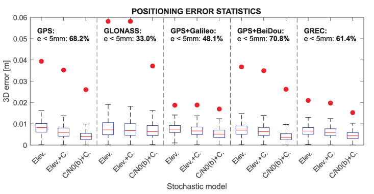
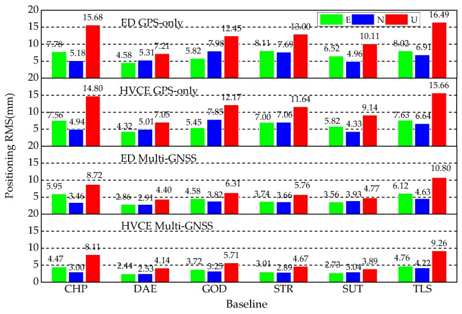
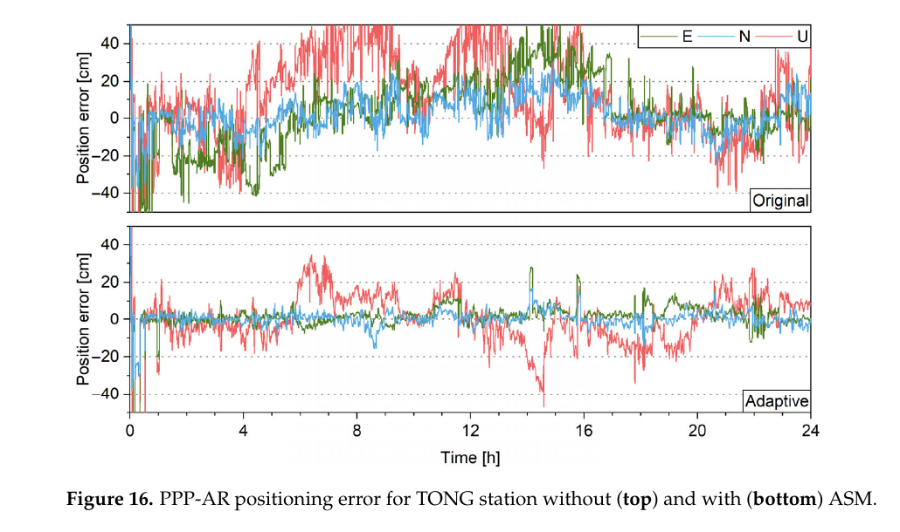

# 2026-10-04 GNSS 每日研究简报

## 今日快报

### 快报 1：把双频电离层消除移到位置域，前提是两套单频偏移确实共享同一尺度

- 主题：`position-domain-ionosphere-free-combination`
- 来源 ID：`ion:gnss2026-16872`
- 来源链接：https://www.ion.org/gnss/abstracts.cfm?paperID=16872
- 发表日期：2026-09-17
- 来源类型：ION GNSS+ 2026 官方扩展摘要、Sony 双频接收机算法研究
- 获取范围：公开扩展摘要全文；位置域双单频组合逻辑与定性轨迹结果已核对，未公开数据集、频点组合、误差统计或正式论文

**内容：** 方法不先组合 L1/L5 伪距，而是分别生成两套单频位置解，再按载频平方导出的电离层无关权重组合坐标。设计动机是冷启动阶段频间偏差改正尚未就绪时，部分硬件偏差会被接收机钟吸收，剩余一阶电离层项可能表现为两套位置解中近似成比例的缓变偏移。

**结论：** 摘要只报告在出现明显大尺度单频偏移的测试段中，位置域组合压低了主导偏移；没有给出 RMS、95% 分位、试验时长或相对传统观测域组合的量化优势。因此证据支持“特定短时共模条件下可减偏”，不支持它普遍等价于观测域电离层无关模型；两套解的几何、卫星集合或非电离层误差若不同，线性组合还可能放大噪声。

**关注理由：** 这是一个很实用的接收机启动期接口：复用现成单频导航核就能延迟依赖频间标定。但工程门槛不在公式本身，而在实时检验两套位置偏移是否满足同一频率尺度关系，并在失配时回退。

### 快报 2：低纬电离层定权不能只看基线长度，地方时与基线方位也进入方差

- 主题：`low-latitude-ionosphere-spatiotemporal-weighting`
- 来源 ID：`ion:gnss2026-16964`
- 来源链接：https://www.ion.org/gnss/abstracts.cfm?paperID=16964
- 发表日期：2026-09-17
- 来源类型：ION GNSS+ 2026 官方扩展摘要、港澳 CORS 低纬 IW-RTK 研究
- 获取范围：公开扩展摘要全文；三日试验、四因子随机模型与作者报告指标已核对，未取得正式论文、基线清单、误差尾部或独立区域验证

**内容：** 电离层加权 RTK 把站间单差电离层延迟作为待估参数，并用伪观测约束其大小。作者在传统卫星仰角与基线长度之外，引入地方时和基线方位角，使伪观测方差能反映低纬电离层的日变化及方向性空间梯度，而不改动功能模型。

**结论：** 港澳 CORS 代表性三日试验中，作者报告相对几何模型平均首次固定时间缩短约 34.77%，固定率提高约 15.31%，固定解三维精度提高约 2.19%。这是单区域、三日和摘要级结果；固定率与首次固定改善远大于已固定坐标精度，说明主要收益在约束强度与真实变化更匹配，而非消除了电离层本身。

**关注理由：** 随机模型不是附属参数。把错误的“强先验”塞进滤波器会比保守放宽更危险；网端服务应按地方时、方向和扰动状态播发不确定度，而不只播发改正值。

### 快报 3：LEO-PNT 共频兼容性应先由独立机构量信号，而不是只看运营商链路预算

- 主题：`independent-leo-pnt-signal-compatibility-assessment`
- 来源 ID：`ion:gnss2026-16999`
- 来源链接：https://www.ion.org/gnss/abstracts.cfm?paperID=16999
- 发表日期：2026-09-16
- 来源类型：ION GNSS+ 2026 官方扩展摘要、DLR/RWTH 对 Xona Pulsar-0 的独立评估计划
- 获取范围：公开扩展摘要；评估对象与指标清单已核对，页面使用将来时，未公开最终测量数字、接收机配置或正式论文

**内容：** DLR/RWTH 计划从地面接收功率、相关损失、信号畸变、测距偏差与跟踪抖动评估 Pulsar-0，并同时检查其在现有与未来 GNSS L 波段中的共存影响。重点是把“可见一个强 LEO 信号”拆成兼容性、测距质量与定位性能三类问题。

**结论：** 当前官方页面只说明将开展首次独立评估，没有给出实测结果，因此不能把它写成 Pulsar 已达到某种精度或已证明对 GNSS 无干扰。可确认的价值是测量闭环：频谱占用必须继续传到相关器畸变、测距偏差和跟踪抖动，而不能停在功率谱图。

**关注理由：** 新星座与 GNSS 共频时，强信号既可能提高可用性，也可能通过前端非线性、相关损失或邻频能量改变旧接收机表现。独立、可复测的射频到测距链路是产业宣传与完整性证据之间的分界线。

### 快报 4：通信星座叠加低功率定位导频可行，但当前证据仍是自研仿真而非在轨服务

- 主题：`leo-ntn-inband-positioning-overlay`
- 来源 ID：`ion:gnss2026-17107`
- 来源链接：https://www.ion.org/gnss/abstracts.cfm?paperID=17107
- 发表日期：2026-09-16
- 来源类型：ION GNSS+ 2026 官方扩展摘要、ESA 5G NTN 通信定位一体化系统研究
- 获取范围：公开扩展摘要全文；NPRS/DL-PRS 叠加架构、Loo 信道、MCRB 与最大似然时延—多普勒估计框架已核对，未公开仿真代码、完整参数表或在轨验证

**内容：** 架构在同一 LEO-NTN 频段内保留通信服务，并用卫星特异序列广播低功率、宽覆盖的 NR DL-PRS；同时研究适应 LEO 大差分时延和大多普勒的 NPRS/DL-PRS。链路级以改进 Cramér–Rao 界和最大似然时延—多普勒估计评估测距，再把测量传播到多星定位解。

**结论：** 摘要说明在加性白噪声与两状态半马尔可夫 Loo 陆地移动卫星信道中验证了通信与定位共存的可行性，但当前官方版本未给出最终位置误差、可用率或功耗数字。结论应限于“所建仿真框架中可共同设计”，不能外推为 3GPP 已标准化或真实遮挡环境已达标。

**关注理由：** 对接收机工程而言，真正的取舍是照明波束、卫星可见数、导频功率、通信吞吐与多普勒搜索量的共同预算，而不是单独优化某个波形。

### 快报 5：抗干扰要跨越信号、认证、传感器与参考网，但厂商闭环仍需公开量化边界

- 主题：`multilayer-precise-navigation-interference-defense`
- 来源 ID：`ion:gnss2026-16804`
- 来源链接：https://www.ion.org/gnss/abstracts.cfm?paperID=16804
- 发表日期：2026-09-16
- 来源类型：ION GNSS+ 2026 官方扩展摘要、Trimble 厂商抗干扰体系与 JammerTest 2025 报告
- 获取范围：公开扩展摘要全文；多层架构、RTX-NMA、频率多样性、跟踪噪声调节和网端频谱监测流程已核对，未公开检测概率、误警率、攻击功率或误差时间序列

**内容：** 体系把信号级一致性与多天线检测、GPS/BDS 星历的 RTX-NMA、Galileo OSNMA、频率多样性、非 GNSS 传感器融合、受干扰信号的跟踪噪声调节，以及参考站 FFT 干扰概率与 VRS 站剔除连接成多层防线。作者称在实景欺骗、干扰和挪威 JammerTest 2025 场景中进行了验证。

**结论：** 摘要称 RTX-NMA 能标记并排除直播天空攻击中的伪造卫星，也称干扰下仍满足紧导航要求；但没有公开场景门限、检测延迟、漏检/误警、剩余精度或外部真值。因此它证明的是产品架构与案例存在，不是可移植的完整性保证，也不能说明认证可抵御转发真实导航电文的欺骗。

**关注理由：** 多层防御最重要的工程启示是故障必须向下游传递不确定度：检测器、跟踪环、PVT、改正网和操作界面要共享状态，避免某层“通过”被误解为整机安全。

## 深度研读

### 深读 1｜接收机工程｜先把噪声量出来：按信号与卫星块构造完整经验协方差

- 类别：`receiver-engineering`
- 学习层级：`foundation`
- 选题定位：`经典基础`
- 来源 ID：`doi:10.3390/s21134566`
- 来源链接：https://doi.org/10.3390/s21134566
- 发表日期：2021-07-03
- 来源类型：Sensors 同行评审开放论文
- 获取范围：CC BY 4.0 开放全文；一周零基线/短基线数据、各系统信号方差与时域/跨频相关、Figures 1–24 已核对
- 价值评分：96/100（相关性 20，经典价值 19，证据 20，教学价值 19，工程价值 18）

#### 为什么先学这个

定位滤波器不仅需要观测方程，还需要回答“每条观测该信多少、彼此是否相关”。如果把 GPS 的经验噪声复制给 GLONASS、Galileo 和 BeiDou，形式上仍能求解，协方差、模糊度搜索椭球和验整门限却会整体失真。本节先从可控零基线与超短基线残差出发，把方差、时间相关和跨信号相关实际量出来。

#### 先修知识

需要理解码与载波观测、C/N0、站间/星间双差、历元三差、零基线、协方差矩阵、Kalman 滤波、整数最小二乘和模糊度固定率。相关系数描述随机误差共同变化，不等于两种信号具有相同系统偏差。

#### 一句话逻辑

用短基线三差估计噪声随 C/N0 的方差函数，用零基线双差估计时间与跨频相关，再把这些量填入完整协方差矩阵，定位器才能按真实信号质量塑造搜索空间。

#### 研究问题与约束

论文使用华沙理工大学屋顶两站、同型 Septentrio PolaRx5 接收机的一周 1 Hz 数据；零基线用于弱化多径并保留接收机内部相关，短基线相邻历元三差用于压低缓变多径。结果针对特定接收机、天线、固件、采样率和开阔屋顶，不应直接成为手机、城市峡谷或其他跟踪环的通用噪声表。

#### 核心方法论

先按 GPS、GLONASS、Galileo、BeiDou 的系统、频点与卫星块分组。短基线三差残差按 120 s 窗与平均 C/N0 拟合四阶经验标准差函数；零基线双差序列给出相邻历元自相关和同系统信号间交叉相关。单机未差观测协方差先含每条信号方差和跨频协方差，再通过差分矩阵传播到双差模型，并在改进 Kalman 滤波中显式处理时间相关。

#### 关键公式逐步推导

将观测误差协方差写成方差与相关的组合：

```math
V_{0,a}(f_i,f_j)=\Gamma_{ij}C_{f_i,a}C_{f_j,a},\qquad
V_{0,a}(f_i,f_i)=C_{f_i,a}^{2}.
```

其中 $`C_{f,a}=\operatorname{diag}(\sigma_{f}^{1},\ldots,\sigma_{f}^{k})/\sqrt{1-\rho_{t,f}}`$，$`\rho_t`$ 修正用三差估方差时的相邻历元相关；跨信号块为 $`\Gamma_{ij}=\rho_{ij}I`$。经验标准差按 C/N0 拟合：

```math
\sigma_f(C/N_0)=\sum_{i=1}^{4}a_i\,10^{(1-i)(C/N_0)/40}.
```

最后用差分矩阵 $`D`$ 传播为双差协方差 $`V_{DD}=DV_0D^T`$；因此“做了双差”不会让相关性自动消失。

#### 经典价值与创新边界

经典价值在于把热噪声直觉变成可复测的协方差工程流程，并同时覆盖四系统、信号与卫星块。创新是将 C/N0 方差、时间相关和跨频相关放入同一完整矩阵并检验其对 AR 的影响。边界是残差仍可能混入未完全消除的多径和硬件效应，完整矩阵也会增加存储与滤波计算量。

#### 整体逻辑链

可控基线采数；按信号/卫星块分组；形成短基线三差和零基线双差；拟合 C/N0 方差；估计时间与跨频相关；构造未差完整协方差；传播到双差；运行浮点与整数定位；比较仰角模型、C/N0 方差和完整相关模型。

#### 原文图表与结果分析



> 图表源：Prochniewicz、Wezka 与 Kozuchowska《Empirical Stochastic Model of Multi-GNSS Measurements》Figure 24，[开放全文](https://doi.org/10.3390/s21134566)。CC BY 4.0；直接保存 PMC 出版原图，未裁剪、重绘或改动坐标轴、箱线、标注与数值。

纵轴为三维误差（m），横轴按 GPS、GLONASS、GPS+Galileo、GPS+BeiDou 与四系统 GREC 分组，每组比较仅仰角、仰角加相关、C/N0 加完整相关模型。箱线给出误差分布，红点是最大误差；图中文字给出各系统最优配置中误差小于 5 mm 的比例。完整经验模型通常把箱体和尾部下移，但 GLONASS 单系统仍明显弱，说明权模型不能补回几何或观测本身缺失。图不展示城市多径、不同接收机迁移或实时算力。

#### 原文结果论述

作者报告四系统、按卫星块区分且使用完整协方差的方案，相对忽略相关的仰角模型将 AR 有效率提高约 2 个百分点并达到 100%，误差低于 5 mm 的解增加 37%，最大误差下降 6 mm。Figure 24 中各组合的小于 5 mm 比例分别标为 68.2%、33.0%、48.1%、70.8% 和 61.4%；这些是该短基线实验条件下的条件统计，不是任意环境的完整性概率。

#### 常见误区与适用边界

第一，把 C/N0 当唯一噪声解释变量。第二，假设不同星座同精度。第三，只填对角方差而忽略跨频与时间相关。第四，把零基线残差当真实道路多径。第五，把固定率升高自动解释为错固定率下降。第六，在更换天线、固件或前端后继续沿用旧协方差表。

#### 工程实现步骤

1. 选择同型接收机并记录信号、卫星块、C/N0、锁定与硬件配置。
2. 同时采零基线和几米级短基线，保留 1 Hz 或目标运行采样率。
3. 按固定窗形成双差/三差残差，标记周跳与异常而不静默删除。
4. 分组拟合方差函数，估计自相关与交叉相关及其置信区间。
5. 构造对称半正定协方差，必要时做特征值截断或收缩。
6. 在独立日期与非零基线上比较固定率、错固定、尾部误差和算力。

#### 复现实验设计

两台同型多频接收机共享天线做 24 h 零基线，再在 2–10 m 短基线上连续采七天 1 Hz 数据；训练六天、留一天滚动验证。比较仰角模型、仅 C/N0 对角模型、完整经验矩阵和对角收缩矩阵。指标含方差拟合残差、协方差条件数、创新白度、浮点 NEU RMS、固定率、错固定率、三维误差 95%/99.9% 分位与每历元耗时。失败用例包括低 C/N0、GLONASS FDMA、周跳、天线更换和相关矩阵非正定。

#### 与定位及低成本实现的联系

低成本设备的噪声、相关和掉锁比测地设备更依赖前端与固件，因而更需要自有标定；但完整逐信号矩阵可能超出嵌入式预算。下一节把大量协方差参数压缩成“码/相位 × 星座”的少数方差分量，让残差在线调整组间权重。

#### 本节小结

随机模型应从数据产生，而不是从 GPS 手册复制。完整经验协方差能改善定位与 AR，但它是设备和场景相关的标定资产，必须持续验证其迁移边界。

### 深读 2｜接收机工程｜不逐元素追噪声：用 Helmert 方差分量在线平衡多系统权重

- 类别：`receiver-engineering`
- 学习层级：`intermediate`
- 选题定位：`基础进阶`
- 来源 ID：`doi:10.3390/s20030669`
- 来源链接：https://doi.org/10.3390/s20030669
- 发表日期：2020-01-25
- 来源类型：Sensors 同行评审开放论文
- 获取范围：CC BY 4.0 开放全文；六条短基线、两个月 180 s 数据、五种定权策略、Figures 1–10 与 Tables 1–6 已核对
- 价值评分：95/100（相关性 20，经典价值 19，证据 20，教学价值 18，工程价值 18）

#### 为什么先学这个

上一节的完整矩阵最细致，却需要大量稳定样本并承担高维相关估计。工程上常先把观测分成 GPS/BDS/GLONASS/Galileo 的码和相位组，只估每组“单位权方差”。Helmert 方差分量估计用残差和冗余度回答各组当前应放大或缩小多少。

#### 先修知识

需要理解 Kalman 创新/后验残差、正规方程、迹、冗余度、稳健 M 估计、仰角定权、多系统相对定位和收敛时间。单位权方差是组尺度，不等于某颗卫星某历元的实际误差平方。

#### 一句话逻辑

把观测按星座与码/相位分组，用每组残差能量扣除参数估计消耗的自由度，求出相对方差因子并回写观测协方差，就能让多系统贡献随数据质量自动平衡。

#### 研究问题与约束

论文在全球六条 IGS 共址短基线上，以 180 s 采样处理 2019 年第 171–230 日数据；先比较 30 天后验 HVCE，再把稳定的组间比例冻结用于下一个月。短基线、大采样间隔和测地站环境弱化了高动态与快速遮挡；“一个月稳定”不能直接外推到手机、城市或接收机固件更新。

#### 核心方法论

滤波先按仰角先验求状态与残差，再对各观测组形成残差二次型和正规矩阵迹项，解单位权方差。以 GPS 相位组为参考常数，按相对方差缩放每组原协方差并重算 Kalman 增益；同时对异常观测施加稳健权。作者还把 30 天估计的码/相位组比例求平均并冻结为 FVUW，换取接近后验 HVCE 的精度与显著更低计算量。

#### 关键公式逐步推导

设第 $`i`$ 组后验残差为 $`v_i`$、观测数为 $`n_i`$、其正规阵贡献为 $`N_i`$。简化 Helmert 方差分量可写成：

```math
\hat\sigma_i^2=\frac{v_i^TP_i v_i}{n_i-\operatorname{tr}(N^{-1}N_i)}.
```

取参考尺度 $`c_0=\hat\sigma_{G,L}^{2}`$ 后，更新第 $`i`$ 组协方差：

```math
\widetilde Q_{v_i}=\frac{\hat\sigma_i^2}{c_0}Q_{v_i}.
```

再用 $`K=\bar Q_xA^T(A\bar Q_xA^T+\widetilde Q_v)^{-1}`$ 重算增益。分母中的迹项是有效参数消耗；若直接用 $`n_i`$，冗余度不足的组会被错误定权。

#### 经典价值与创新边界

经典价值是把多源融合中的“权重拍脑袋”改成可审计的方差分量估计。论文的工程贡献是验证组间权比可长期稳定，并提出冻结权比降低算力。边界是组内仍假设同一尺度，难以识别单星多径；后验残差也可能因模型吸收偏差而显得过小，稳健化与可观测性检查不可省略。

#### 整体逻辑链

仰角先验初始化；Kalman 更新；生成分组残差；稳健降权异常；解方差分量；归一化组间比例；回写协方差并重算；统计 30 天稳定性；冻结均值；用下一月独立检验精度与耗时。

#### 原文图表与结果分析



> 图表源：Li 等《Helmert Variance Component Estimation for Multi-GNSS Relative Positioning》Figure 7，[开放全文](https://doi.org/10.3390/s20030669)。CC BY 4.0；直接保存 PMC 出版原图，未裁剪、重绘或改动柱形、颜色、标签与数值。

纵轴是定位 RMS（mm），横轴为六条基线；每组三色柱为东、北、上。四行依次是仰角定权 GPS、HVCE GPS、仰角定权多系统、HVCE 多系统。所有基线上，多系统行整体低于 GPS-only；HVCE 多系统通常最低，例如 SUT 基线约为 2.73/3.04/3.89 mm。图显示组间平衡与卫星增加的联合效果，不能单独把全部下降归因于 HVCE，也没有给出误固定尾部。

#### 原文结果论述

相对仰角先验多系统策略，后验 HVCE 在 ENU 分量平均改善 20.5%、15.7%、13.2%；平均收敛时间从 6.1 min 降至 5.1 min。冻结 30 天权比后，ENU 仍改善 20.0%、14.1%、11.1%，计算时间较 HVCE 节省 88%；下一月改善为 18.1%、13.2%、10.6%。这些统计来自 180 s 测地短基线处理，不代表实时 1 Hz 高动态延迟。

#### 常见误区与适用边界

第一，把后验残差小直接当观测好。第二，在组冗余不足时仍解方差分量。第三，忽略分量可能为负或振荡。第四，所有异常都靠组尺度吸收，遗漏单星故障。第五，把冻结权比永久使用。第六，只报 RMS，不核查收敛门限、尾部和错固定。

#### 工程实现步骤

1. 按星座、码/相位与必要的频点建立最小可辨识分组。
2. 用保守先验协方差完成首轮滤波，输出残差与组正规阵贡献。
3. 计算有效冗余度，对低冗余组保持先验或合并分组。
4. 解相对方差，施加非负、上下限与时间平滑。
5. 回写协方差并限制单历元权重跳变，保留稳健单星门控。
6. 监控创新白度与组权漂移；跨设备、固件或环境切换时重新学习。

#### 复现实验设计

选择六条 0–10 km 基线，连续 60 天 GPS/BDS/GLONASS/Galileo 1 Hz 数据；前 30 天学习、后 30 天冻结验证。比较仰角先验、每历元 HVCE、10/60/300 s 滑窗 HVCE 和冻结权比。指标为 ENU RMS/95% 分位、收敛到 0.1 m 时间、固定率/错固定率、组方差稳定性、创新白度和 CPU 时间。失败用例含单组仅两颗星、BDS GEO 多径、GLONASS FDMA 偏差、整组遮挡与突发干扰。

#### 与定位及低成本实现的联系

方差分量把高维协方差压缩成少数组尺度，适合低成本 CPU；冻结权比又可作为启动先验。下一节把同一思想推进 PPP Kalman 滤波，同时估计测量噪声和电离层等过程噪声，并检验其对 PPP-AR、周跳检测与中断重收敛的实际影响。

#### 本节小结

HVCE 的价值不只是让多系统 RMS 下降，而是提供“哪一组观测当前不可信”的量化接口。冻结权比可节省算力，但必须由漂移监测和重新学习机制守护。

### 深读 3｜定位｜随机模型也要跟踪：LS-VCE 如何让 PPP-AR 与中断恢复不过度自信

- 类别：`positioning`
- 学习层级：`advanced`
- 选题定位：`定位深入`
- 来源 ID：`doi:10.3390/rs17173071`
- 来源链接：https://doi.org/10.3390/rs17173071
- 发表日期：2025-09-03
- 来源类型：Remote Sensing 同行评审开放论文
- 获取范围：CC BY 4.0 开放全文；多系统双频非组合 PPP、全球站测试、PPP/PPP-AR、DIA 周跳与三分钟中断试验、Figures 1–23 和 Tables 1–4 已核对
- 价值评分：97/100（相关性 20，经典价值 18，证据 20，教学价值 19，工程价值 20）

#### 为什么先学这个

前两节分别给出离线完整协方差和分组后验定权，但 PPP 同时依赖观测噪声与状态过程噪声。电离层变化、码相质量和数据中断会改变滤波器对旧信息的信任；若仍使用固定随机模型，位置、验整、DIA 周跳检测和重收敛可能一起过度自信。

#### 先修知识

需要理解非组合双频 PPP、Kalman 预测/更新、创新向量、LS-VCE、随机游走过程噪声、PPP-AR、整数自举、DIA 检测辨识适配、周跳与电离层状态。方差因子可估不等于所有过程噪声都可辨识。

#### 一句话逻辑

把每历元创新写成测量噪声、过程噪声和上一历元状态误差之和，用 LS-VCE 估计少数方差因子，再以遗忘机制累积正规方程，使 PPP 协方差能平滑跟随观测与电离层变化。

#### 研究问题与约束

论文处理 GPS/BDS/Galileo 双频非组合 PPP，估计位置、钟、系统间偏差、对流层、电离层与模糊度；大部分 IGS 站观测条件良好，挑战通过不合适先验、模拟 1 cycle 周跳和每 2 h 删除 3 min 全部观测构造。结果验证算法敏感性，但不等同于真实城市 NLOS、海上动态或硬件重启。

#### 核心方法论

将观测噪声与状态过程噪声分别表示为若干已知基矩阵的线性组合，未知量仅是方差因子。单历元创新的冗余信息形成 LS-VCE 正规方程；为避免单历元不稳定与负估计，算法累积多历元正规方程，并对旧解协方差加入衰减噪声，使历史权重逐渐遗忘。新方差因子用于下一次 Kalman 更新，并分别评估浮点、PPP-AR、DIA 周跳检测、直接重收敛与整数中断修复。

#### 关键公式逐步推导

Kalman 模型为：

```math
x_k=F_kx_{k-1}+\varepsilon_{p,k},\qquad y_k=A_kx_k+\varepsilon_{m,k}.
```

创新 $`v_k=y_k-A_k\bar x_k`$ 的协方差可分解为：

```math
Q_{v,k}=A_kF_kQ_{\hat x,k-1}F_k^TA_k^T+\sum_i\sigma_{p,i}A_kQ_{p,i}A_k^T+\sum_j\sigma_{m,j}Q_{m,j}.
```

LS-VCE 对每个基矩阵 $`Q_i`$ 构造：

```math
N_{ij}=\tfrac12\operatorname{tr}(Q_iQ_v^{-1}Q_jQ_v^{-1}),\qquad
L_i=\tfrac12v^TQ_v^{-1}Q_iQ_v^{-1}v-\tfrac12\operatorname{tr}(Q_iQ_v^{-1}Q_0Q_v^{-1}).
```

解 $`N\hat\sigma=L`$ 后，以 $`Q_f`$ 衰减上一历元信息再合并新正规方程；这比直接估计整个 $`Q_v`$ 更低维，也比无限累计更能跟踪时变环境。

#### 经典价值与创新边界

经典价值是把方差分量理论嵌入递推滤波，并清楚区分功能模型正确与随机模型正确。论文的贡献是同时检验多个 PPP 下游环节，而非只报坐标 RMS。边界是对流层方差因子因历元间变化太小而不可估；算法在先验已经合适时几乎无收益，且方差因子自身需要收敛，不能改善初始 PPP 收敛。

#### 整体逻辑链

建立非组合 PPP；预定义方差基矩阵；由创新形成 LS-VCE；累积并遗忘历史；更新测量/过程噪声；运行 PPP 浮点和 AR；用 DIA 检测模拟周跳；删除三分钟观测测试直接重收敛；保留旧新模糊度相关测试整数中断修复；比较固定模型与 ASM。

#### 原文图表与结果分析



> 图表源：Zheng 等《Variance Component Estimation (VCE)-Based Adaptive Stochastic Modeling for Enhanced Convergence and Robustness in GNSS Precise Point Positioning (PPP)》Figure 16，[开放全文](https://doi.org/10.3390/rs17173071)。CC BY 4.0；从出版 PDF 第 16 页按 Figure 16 边界裁出，保留原坐标轴、曲线、图例、标签与图注，未重绘或改动数据。

横轴为 0–24 h，纵轴为 ENU 位置误差（cm）；上图使用原固定随机模型，下图使用自适应模型。上图东、北、上分量存在长时段数十厘米漂移，下图多数时间收缩在约 ±20 cm 内，但垂向在约 14 h 仍接近 −40 cm，说明自适应定权显著减弱而没有消除模型外误差。图是 TONG 单站不合适先验案例，不能证明所有全球站都会改善。

#### 原文结果论述

TONG 站 PPP-AR 的 ENU RMS 从 0.211/0.109/0.380 m 降至 0.134/0.078/0.244 m。30,528 个模拟 1 cycle 周跳中，检测数从 24,711 增至 28,047，即检测率 81% 升到 92%。每 2 h 插入 3 min 中断时，60% 数据段达到 0.1/0.1/0.2 m 门限的直接重收敛由 19 min 缩至 15.5 min；整数中断修复下，80% 数据段由 30 min 缩至 13.5 min。作者同时指出先验合适时 ASM 对 PPP/PPP-AR 无显著优势。

#### 常见误区与适用边界

第一，把方差变大误解成位置一定变差；它可能只是更诚实。第二，同时估太多不可辨识方差因子。第三，允许负方差或无界跳变。第四，用模拟一周跳代替真实多周跳/半周跳。第五，把三分钟全星中断等同城市逐星遮挡。第六，只看 RMS 改善，忽略自适应滞后与计算量。

#### 工程实现步骤

1. 先按码、相位和关键过程状态定义少量正半定基矩阵。
2. 用创新而非滤后位置误差形成 LS-VCE 正规方程。
3. 设方差非负、上下限、条件数与最小冗余度保护。
4. 对不同因子配置遗忘率；观测噪声快、电离层过程噪声慢。
5. 把更新后的协方差同时送入 Kalman、DIA 与 AR，而非只改坐标滤波。
6. 输出方差因子、创新白度、检测统计与重收敛事件作为诊断遥测。

#### 复现实验设计

选 20 个全球 IGS 站和 4 个城市/海上动态站，30 s 与 1 s 两档数据；运行 GPS、GPS+Galileo、三系统非组合 PPP。人为设置正确/偏小/偏大先验，注入 0.5/1/5 cycle 周跳、逐星与全星 30 s/3 min 中断。比较固定模型、Sage–Husa、无遗忘 LS-VCE 与多时间尺度 ASM。指标含 ENU RMS/95%/99.9%、协方差一致性、周跳漏检/误警、固定率/错固定、达到 0.1/0.1/0.2 m 时间、因子收敛时间和 CPU/内存；失败用例含 NLOS 偏差、不可估对流层因子和创新非高斯。

#### 与定位及低成本实现的联系

对 PPP/PPP-RTK 用户端，改正服务再精确也不能替代接收机自身的随机模型。低成本设备可先按少数观测/过程组估因子，并用离线冻结值启动；高算力端再扩展到频点或环境分组。最重要的是让同一协方差贯穿坐标、验整、故障检测和中断恢复，避免各模块各自“调权”。

#### 本节小结

自适应随机模型的收益不是凭空提高精度，而是在先验失配时恢复一致性。它能改善 PPP-AR、周跳检测与中断恢复，但只有在方差因子可辨识、受约束且经真实恶劣场景验证时，才可成为可靠工程组件。
