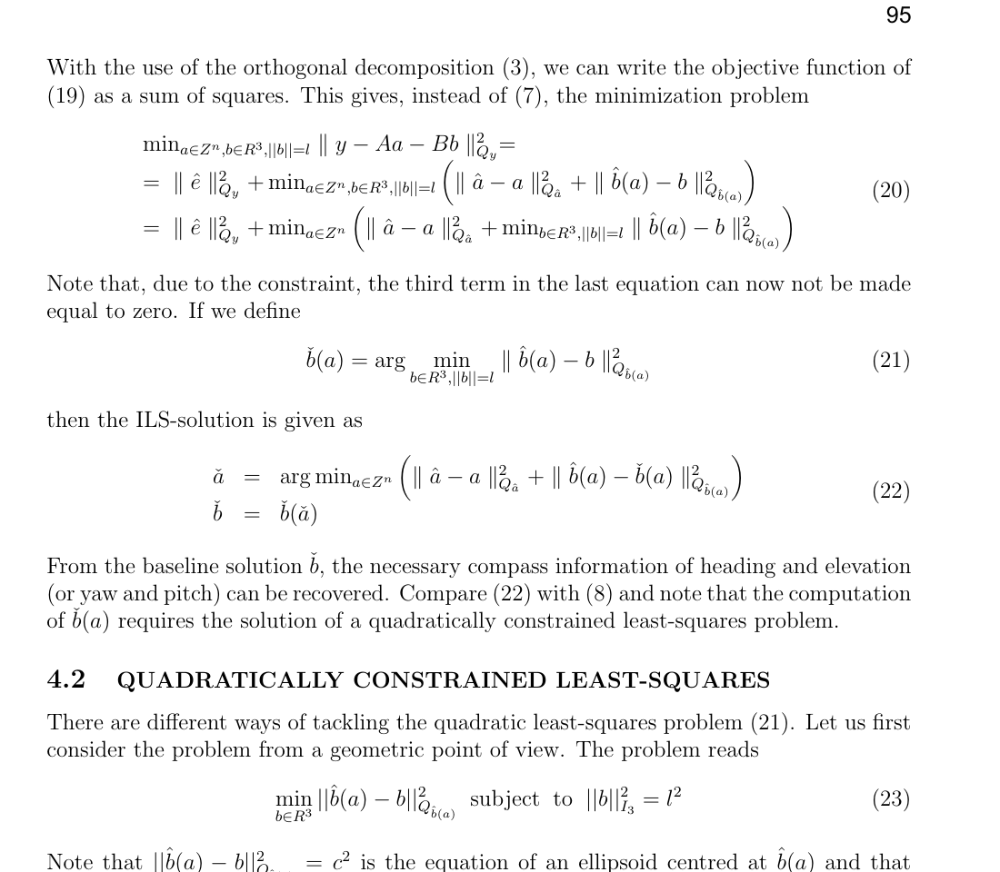
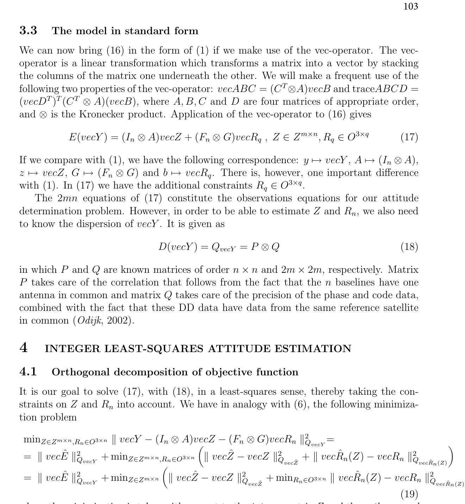
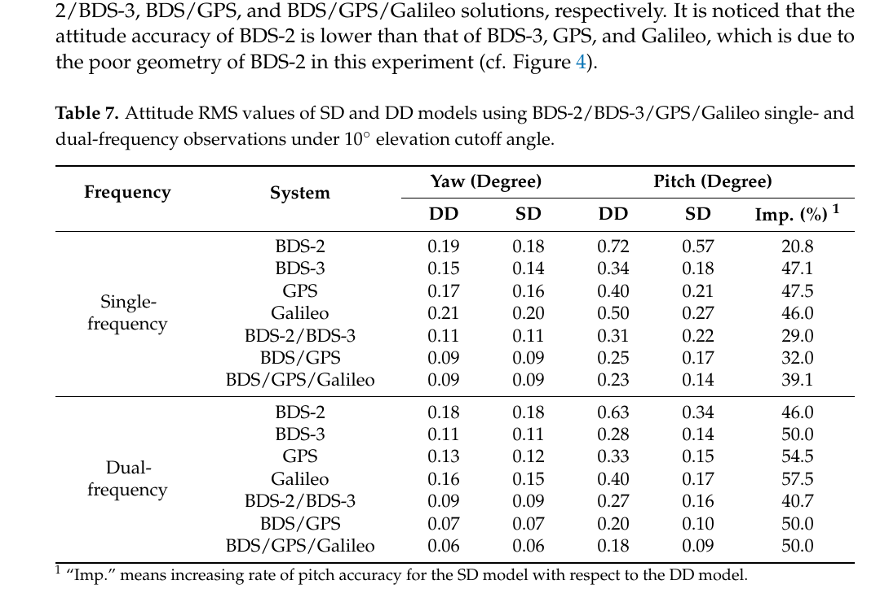

# 2026-10-05 GNSS 每日研究简报

## 今日快报

### 快报 1：GPS 导航电文能藏在 5G 波形下，但发射 SIR 不是接收 SINR

- 主题：`dsss-ofdm-gnss-overlay-meo-relay`
- 来源 ID：`ion:gnss2026-16819`
- 来源链接：https://www.ion.org/gnss/abstracts.cfm?paperID=16819
- 发表日期：2026-09-16
- 来源类型：ION GNSS+ 2026 官方扩展摘要、MEO 透明转发链路试验
- 获取范围：公开扩展摘要全文；仿真波形、跟踪结构、发射 SIR 扫描与在轨透明转发结果已核对，未取得正式论文、接收 SINR 标定或定位结果

**内容：** 研究把低功率 GPS L1 C/A DSSS/LNAV 叠加到 5 MHz 的 5G NR Case A OFDM 下行中，先按约 8000 km MEO 轨道生成多普勒动态，再用 FLL 辅助 PLL 与频率辅助 DLL 完成捕获、跟踪和电文恢复。实测链路把 35 s 复合波形循环送过 SES O3b mPOWER 透明转发器，并利用 5G SSB 先估残余频偏、缩小 GPS 捕获搜索区。

**结论：** 每个发射 SIR 从 -5 dB 到 -35 dB、步长 5 dB 的配置记录 300 s I/Q；作者报告 LNAV 在约 -25 dB 发射 SIR 仍可可靠恢复，-30 dB 以下端到端恢复不可靠，延长非相干积累时捕获仍可能成功。由于在轨记录没有直接量到有效接收 SINR，结果只证明特定透明转发链和离线接收机中的共存可行性，不能把 -25 dB 当成通用接收门限。

**关注理由：** 通信导航一体化的瓶颈不只在波形设计，还在“发射端功率比—卫星链路—接收端 SINR—跟踪失锁—电文失败”的可校准映射；若这条链不闭合，仿真门限无法转成接收机预算。

### 快报 2：把 SSR 在终端还原成 OSR，可复用旧引擎，但验证仍混入厂商服务与高等级天线条件

- 主题：`on-device-ssr-to-osr-vrs-reconstruction`
- 来源 ID：`ion:gnss2026-16987`
- 来源链接：https://www.ion.org/gnss/abstracts.cfm?paperID=16987
- 发表日期：2026-09-17
- 来源类型：ION GNSS+ 2026 官方扩展摘要、Rx Networks 厂商客户端改正转换研究
- 获取范围：公开扩展摘要全文；客户端轨钟/偏差/大气重构、静态与动态验证范围及作者报告精度已核对，未公开站网、接收机清单、样本量或完整误差分布

**内容：** 终端把 SSR 轨道、钟差、码相偏差和区域大气状态在每个观测历元重构为虚拟参考站 OSR，使只接受 DGNSS/RTK OSR 的 COTS 引擎无需改写估计器；VRS 可贴近本地粗位置生成，也不必把用户位置持续回传服务器。轨道在 ECEF 中插值，钟差按 SSR 多项式外推，STEC 经映射函数投影到斜路径。

**结论：** 作者称名义更新率下，多款 COTS 接收机的静态水平 95% 误差处于分米到亚米级；5、10、15 min 的降频更新中，最长间隔退化更明显，动态城市/郊区结果与网络 OSR 表现相当。测试使用测地级天线以压低多径和相位中心变化，又未给出各接收机、基线、更新年龄与精度的逐项表，因此证据支持“转换链可运行”，不支持对普通量产天线或所有网络状态作同等承诺。

**关注理由：** 这是一种很现实的迁移层：服务端保留可扩展 SSR，终端继续用成熟 OSR 引擎。工程验收必须同时记录改正年龄、VRS 距离、偏差约定、固定状态和天线条件，避免只看最终坐标百分位。

### 快报 3：Doppler 更擅长量速度而非单独量位置，运动几何比可见星数更关键

- 主题：`doppler-motion-geometry-pseudorange-integration`
- 来源 ID：`ion:gnss2026-16946`
- 来源链接：https://www.ion.org/gnss/abstracts.cfm?paperID=16946
- 发表日期：2026-09-18
- 来源类型：ION GNSS+ 2026 官方扩展摘要、商用接收机实测研究
- 获取范围：公开扩展摘要全文；三纬度 24 h 静态实验、城市车辆 EKF 与作者报告 RMSE 已核对，未公开站点名称、原始数据、接收机型号或误差尾部

**内容：** 研究用低、中、高纬三站各 24 h 数据检验卫星视线速度方向分布对 Doppler 定位的影响，并在城市车辆上将伪距、Doppler 速度和方位相关修正放入 EKF。静态部分比较 GPS 与 GPS/Galileo/BDS，多星座不仅增加观测数，也改变速度几何。

**结论：** GPS-only 的三维 Doppler 定位 RMSE 在低、中、高纬分别为 220.67、137.25、79.08 m，三系统后降为 95.23、61.00、48.26 m；低纬与高纬平均可见星数近似时，高纬误差仍低 49.3%。车辆实验中，伪距-only 的 4.04 m 降至伪距+Doppler 的 1.70 m，再经速度与方位修正降至 1.40 m，三维速度误差为 0.16 m/s。摘要未给独立真值结构和路线重复性，不能把均方改善解释为完整性保证。

**关注理由：** 面向 LEO 或城市接收机时，Doppler 观测设计应优化“速度方向几何”，而不只是卫星数；它更适合作为速度与动态约束补伪距，而非单独替代测距。

### 快报 4：跨场景欺骗检测要压掉场景指纹，但模拟迁移仍不是实网泛化

- 主题：`domain-adversarial-cross-scene-spoofing-detection`
- 来源 ID：`ion:gnss2026-16998`
- 来源链接：https://www.ion.org/gnss/abstracts.cfm?paperID=16998
- 发表日期：2026-09-18
- 来源类型：ION GNSS+ 2026 官方扩展摘要、跨场景仿真检测研究
- 获取范围：公开扩展摘要全文；DANN 结构、物理特征、基线模型与作者报告分类指标已核对，未取得数据划分、攻击功率、置信区间或真实射频外场验证

**内容：** 方法用域对抗网络让编码特征难以辨认来源场景，同时把相关峰形状、功率相关、锁相状态和时间演化等物理特征与带通道注意力的深层特征融合；权重范围约束与权重熵正则用于抑制模型记住源域特征。

**结论：** 跨场景仿真中，基础 DANN 报告 92.80% 准确率，并在 1.38% 误警率下得到 85.49% 检出率；改进模型在同一误警水平达到 95.90% 检出率，较基础版本提高超过 10 个百分点。结果来自模拟迁移，摘要未说明攻击族是否覆盖真实多径、前端饱和或未见过的渐进接管，因此不能把 95.90% 外推为开放世界检测概率。

**关注理由：** 欺骗检测真正困难的是域偏移而非样本内分类。接收机部署应把“新城市、新天线、新固件、新攻击器”设成完全隔离的外部测试域，并持续监控阈值漂移。

### 快报 5：LEO 到达方向能估姿态，但四星实验里的 459 m 联合位置误差说明可观测性仍弱

- 主题：`leo-doa-quaternion-pose-estimation`
- 来源 ID：`ion:gnss2026-17185`
- 来源链接：https://www.ion.org/gnss/abstracts.cfm?paperID=17185&sessionID=2130
- 发表日期：2026-09-16
- 来源类型：ION GNSS+ 2026 官方扩展摘要、Starlink/OneWeb 信号机会实验
- 获取范围：公开扩展摘要全文；四元数 DOA、乘法 UKF、两 Starlink 加两 OneWeb 实验及作者报告终值已核对，未公开阵列标定、实验时长、DOA 噪声或真值系统

**内容：** 方法不用方位—仰角参数化，而以四元数表示 DOA 和接收机姿态，避免高仰角时方位角奇异；乘法无迹 Kalman 滤波器分别处理“已知位置只估姿态”和“位置姿态联合估计”。实验从两颗 OneWeb 与两颗 Starlink 提取 DOA。

**结论：** 姿态-only 从 39.03° 初差收敛到 0.018°；联合估计从 39.03° 与 81.14 km 初差收敛到 0.043° 和 459.49 m。后者说明方向观测可迅速约束姿态，却不能在四颗机会卫星与当前几何下给出 GNSS 级绝对位置；摘要也未量化阵列系统误差和终值稳定时长。

**关注理由：** DOA 是 GNSS 失效时很有价值的姿态与粗位置补充，但必须把阵列相位校准、卫星轨道误差、发射机位置与几何可观测性一起纳入协方差，而不能只展示滤波收敛曲线。

## 深度研读

### 深读 1｜接收机工程｜已知基线长度不是事后验尺：把它放进整数最小二乘目标

- 类别：`receiver-engineering`
- 学习层级：`foundation`
- 选题定位：`经典基础`
- 来源 ID：`doi:10.2478/v10018-007-0009-1`
- 来源链接：https://doi.org/10.2478/v10018-007-0009-1
- 发表日期：2007-05-10
- 来源类型：Artificial Satellites 开放同行评审论文
- 获取范围：开放全文；GNSS compass 模型、基线约束 ILS、候选搜索界与近似算法已核对；论文为方法推导，不含独立实测数据集或性能统计
- 价值评分：95/100（相关性 20，经典价值 20，证据 18，教学价值 20，工程价值 17）

#### 为什么先学这个

双天线航向的核心不是把两个坐标相减，而是把毫米级载波相位里的未知整周数解对。单频、单历元、无 IMU 辅助时，码噪声让普通浮点模糊度很弱；但天线间距离在刚体安装后已知。本文解释怎样让这个物理事实进入整数目标函数，而不是固定后才拿尺子筛结果。

#### 先修知识

需要理解双差码与载波、浮点与固定模糊度、加权最小二乘、协方差椭球、LAMBDA 去相关、基线向量以及航向/俯仰。已知长度只约束三维基线落在球面，不直接告诉接收机朝向。

#### 一句话逻辑

对每个整数候选，不只计算它离浮点模糊度多远，还计算该候选诱导的条件基线离已知长度球面多远；两个代价共同最小的候选才是 GNSS compass 解。

#### 研究问题与约束

标准模型把双差整数 $`a`$ 与实数基线 $`b`$ 联合估计；GNSS compass 再加入 $`\lVert b\rVert=l`$。论文聚焦最困难的无辅助、单频、单历元情况，并假设基线短到可忽略大气差分。它主要给出理论与搜索构造，不提供固定率、错固定率或真实动态数据，因此定量性能必须由后续实验验证。

#### 核心方法论

先对普通混合整数最小二乘做正交分解，得到残差、模糊度距离和条件基线距离三项。无约束时，给定任何整数都能令第三项为零；加入长度球后，条件基线必须投影到球面，剩余距离成为候选的额外判别量。为避免逐候选求昂贵的二次约束最小二乘，论文用上下界包住真实代价，并以 search-and-shrink 逐步收紧搜索区。

#### 关键公式逐步推导

标准观测模型为 $`E(y)=Aa+Bb`$。加入长度约束后，整数解变为：

```math
\check a=\arg\min_{a\in\mathbb Z^n}
\left(\lVert\hat a-a\rVert_{Q_{\hat a}}^2+
\lVert\hat b(a)-\check b(a)\rVert_{Q_{\hat b(a)}}^2\right),
```

其中

```math
\check b(a)=\arg\min_{b\in\mathbb R^3,\,\lVert b\rVert=l}
\lVert\hat b(a)-b\rVert_{Q_{\hat b(a)}}^2.
```

第一项是整数候选到浮点解的统计距离；第二项是该候选下的基线与已知长度球面的不一致。若 $`Q_{\hat b(a)}=\mu^{-1}I`$，投影简化为 $`\check b(a)=l\hat b(a)/\lVert\hat b(a)\rVert`$。

#### 经典价值与创新边界

经典价值是把“已知基线长度”从启发式检验升级为受协方差度量的约束 ILS，并明确约束如何改变整数搜索空间。边界是球面投影与非椭球搜索增加计算量；基线长度标定误差、天线相位中心变化和弯曲安装若未进入模型，硬约束会把真实误差伪装成整数证据。

#### 整体逻辑链

双差观测；求浮点模糊度与条件基线；加入长度球；对整数候选计算浮点距离；把条件基线投影到球面；计算残余几何代价；用边界剪枝；输出固定整数和基线；由基线求航向与俯仰。

#### 原文图表与结果分析



> 图表源：Teunissen《The LAMBDA Method for the GNSS Compass》原文第 95 页 Equations 20–23，[开放全文](https://doi.org/10.2478/v10018-007-0009-1)。出版页标注 Open Access 与 Creative Commons，但未指明具体版本；这里只保留最小公式区块用于研究评论，裁去页边空白，未改动公式、编号或符号。

原文公式把总代价拆成模糊度距离与基线投影残差。Equation 22 最关键：若只运行普通 LAMBDA，就遗漏第二项；Equation 23 则把条件基线投到半径 $`l`$ 的球面。该截取是方法公式而非性能图，没有坐标轴、样本量或误差统计，也不能证明某个固定率提升。

#### 原文结果论述

作者的结论是：单历元单频中，浮点模糊度精度主要受码噪声支配，而给定整数后的条件基线受高精度相位支配，所以长度残差对错误候选具有很强排斥力；但直接以普通椭球搜出大量候选再逐个投影会“search halting”。论文给出边界与收缩策略作为计算解法，没有报告真实数据中的成功率数字。

#### 常见误区与适用边界

第一，把长度约束当固定后的简单阈值。第二，认为知道长度就能直接知道三轴姿态；双天线只有两个姿态自由度。第三，把天线安装长度当相位中心距离。第四，忽略相关协方差而用欧氏距离投影。第五，在长基线仍忽略电离层/对流层。第六，把算法找到唯一整数等同于已验证正确。

#### 工程实现步骤

1. 标定两天线相位中心间的基线长度及温度/结构不确定度。
2. 形成同频双差码相观测与完整协方差，检测周跳和参考星切换。
3. 求 $`\hat a,Q_{\hat a},\hat b(a),Q_{\hat b(a)}`$ 并先做 LAMBDA 去相关。
4. 用下界排序候选，只对有希望者求球面投影与精确代价。
5. 以固定失败率或独立残差检验验收，不只用固定 ratio。
6. 输出长度残差、候选间隔、姿态协方差与失败状态。

#### 复现实验设计

搭建 0.3、0.8、1.5 m 三种双天线基线，单频 1 Hz，分别在开阔静态、转台慢转与局部遮挡下采集每组 6 h。比较普通 LAMBDA、固定后长度筛选和约束 ILS；注入 1–20 mm 长度偏差及 2–20 mm 相位噪声。指标含正确/错误固定率、未固定率、候选数、每历元耗时、航向/俯仰 95% 与 99.9% 误差。失败用例包括相位中心漂移、参考星切换、低卫星数和共面几何。

#### 与定位及低成本实现的联系

低成本双天线往往码噪声大、单历元模型弱，刚体长度是无需额外传感器的高价值先验。但短基线角度误差对毫米级基线误差极敏感，约束越强越要诚实建模安装不确定度。下一节把一条基线的球面约束推广到多条基线共享一个旋转矩阵。

#### 本节小结

GNSS compass 的关键不是“先固定、再验尺”，而是让长度一致性与整数距离在同一统计目标里竞争。它增强弱模型，也会放大错误几何先验的伤害。

### 深读 2｜接收机工程｜多条基线不是逐条解：把整数矩阵与正交姿态矩阵一起估

- 类别：`receiver-engineering`
- 学习层级：`intermediate`
- 选题定位：`基础进阶`
- 来源 ID：`doi:10.2478/v10018-008-0002-3`
- 来源链接：https://doi.org/10.2478/v10018-008-0002-3
- 发表日期：2008-02-29
- 来源类型：Artificial Satellites 开放同行评审论文
- 获取范围：开放全文；任意天线数的多变量模型、Kronecker 协方差、正交姿态约束、SVD 特例与多历元扩展已核对；论文为理论推导，不含实测性能表
- 价值评分：96/100（相关性 20，经典价值 20，证据 18，教学价值 20，工程价值 18）

#### 为什么先学这个

上一节只有一条基线，只能得到航向与俯仰。三维姿态至少需要两条不共线基线；若逐基线独立固定，再把结果拼成旋转矩阵，会丢掉共参考天线相关性、刚体几何和正交约束。本文把所有基线的整数与姿态放进一个矩阵模型。

#### 先修知识

需要理解矩阵向量化 $`\operatorname{vec}`$、Kronecker 积、旋转矩阵、正交约束、双差相关、整数最小二乘、奇异值分解以及刚体坐标系。$`R^TR=I`$ 保证轴正交与单位长度，但还需 $`\det R=1`$ 排除镜像。

#### 一句话逻辑

把每条基线的观测列成数据矩阵 $`Y`$、整数列成 $`Z`$，用已知机体系基线矩阵 $`F`$ 将所有导航系基线写成同一个 $`RF^T`$；整数性和旋转正交性便能共同缩小解空间。

#### 研究问题与约束

设 $`n+1`$ 副天线同时跟踪 $`m+1`$ 颗卫星，单历元单频下有 $`n`$ 条独立基线与 $`m`$ 个双差。论文覆盖两副及以上天线、任意 GNSS/频率扩展，并假设阵列在机体系的基线几何已知。理论模型没有处理天线形变、非同步接收机、遮挡造成的列缺失或硬件线偏差。

#### 核心方法论

各基线观测满足 $`Y=AZ+GB`$，刚体几何给出 $`B=RF^T`$。向量化后，整数矩阵与姿态矩阵进入统一线性观测式；协方差写成 $`P\otimes Q`$，其中 $`P`$ 表示共参考天线引入的基线间相关，$`Q`$ 表示码相精度及共参考卫星相关。再将目标正交分解为浮点整数距离与候选姿态到正交流形的距离。

#### 关键公式逐步推导

多天线模型写成：

```math
E(Y)=AZ+GR_qF_n^T,\qquad Z\in\mathbb Z^{m\times n},\quad R_q\in O^{3\times q}.
```

向量化并传播协方差：

```math
E(\operatorname{vec}Y)=(I_n\otimes A)\operatorname{vec}Z+
(F_n\otimes G)\operatorname{vec}R_q,
\qquad D(\operatorname{vec}Y)=P\otimes Q.
```

于是整数解为：

```math
\check Z=\arg\min_{Z\in\mathbb Z^{m\times n}}
\left(\lVert\operatorname{vec}\hat Z-\operatorname{vec}Z\rVert^2_{Q_{\operatorname{vec}\hat Z}}+
\lVert\operatorname{vec}\hat R_n(Z)-\operatorname{vec}\check R_n(Z)\rVert^2_{Q_{\operatorname{vec}\hat R_n(Z)}}\right).
```

第二项把候选姿态拉回单位、正交的旋转流形，而不是让多条基线各自漂移。

#### 经典价值与创新边界

经典价值是用一个模型统一双天线、三天线和更多天线，显式保留基线间相关，并说明阵列几何如何进入姿态精度。边界在于正交流形使整数搜索不再是普通椭球；一般情形需非线性迭代，只有特定协方差或阵列几何可用 SVD 直接解。多历元严格解还不能只靠上一历元递推保存有限状态。

#### 整体逻辑链

选择共参考天线与参考星；形成每条基线双差列；堆成 $`Y,Z`$；输入机体系阵列 $`F`$；构造 $`P\otimes Q`$；求无约束浮点 $`\hat Z,\hat R`$；对整数候选投影正交流形；联合选取 $`\check Z`$；恢复 $`\check R`$ 与姿态角。

#### 原文图表与结果分析



> 图表源：Teunissen《A General Multivariate Formulation of the Multi-Antenna GNSS Attitude Determination Problem》原文第 103 页 Equations 17–19，[开放全文](https://doi.org/10.2478/v10018-008-0002-3)。出版页标注 Creative Commons 但未指明具体版本；保留最小方法区块用于研究评论，仅裁去页边空白，未改动公式、编号或符号。

Equation 17 把整数矩阵与正交姿态矩阵同时放进观测式；Equation 18 的 $`P\otimes Q`$ 则明确“多条基线共享天线”和“多颗双差共享参考星”会产生相关性。下方 Equation 19 展示正交分解。该图没有实测坐标轴或数值，能证明模型结构，不能证明多天线一定提高正确固定率。

#### 原文结果论述

作者从理论上给出任意天线数的统一 ILS 解，并指出更长基线使已知整数条件下的姿态协方差按长度平方缩小；阵列几何可通过 $`F_n^TP^{-1}F_n`$ 影响解算。多历元中，若每一历元姿态都施加正交约束，严格整数解不能仅由上一历元严格递推；只保留当前历元约束可得到次优递推方案。论文没有提供数据驱动的提升百分比。

#### 常见误区与适用边界

第一，逐基线独立解完再平均。第二，忽略共参考天线导致的相关。第三，只约束列单位长度而不约束互相正交。第四，接受 $`\det R=-1`$ 的镜像矩阵。第五，以为天线越多必然更好；近共线阵列仍病态。第六，把次优递推结果当严格批处理 ILS。

#### 工程实现步骤

1. 测量阵列相位中心坐标，建立右手机体系 $`F`$ 及安装协方差。
2. 选择参考天线/卫星并构造完整双差协方差 $`P\otimes Q`$。
3. 按卫星与频率建立整数矩阵 $`Z`$，处理缺测和参考切换的状态映射。
4. 求浮点整数与姿态，使用 LAMBDA 去相关整数维。
5. 对候选姿态做 SO(3) 投影或受约束优化，显式检查行列式。
6. 输出正交残差、阵列闭合差、候选间隔与姿态协方差。

#### 复现实验设计

用四副同钟接收机组成三种阵列：共线、直角 L 形、近等边三角加高差；基线 0.5–1.5 m，GPS/Galileo L1 单频 10 Hz。比较逐基线固定、忽略 $`P`$ 的联合解、完整 $`P\otimes Q`$ 联合解与批处理严格解。指标为整数正确率、SO(3) 正交残差、三轴 RMS/99.9% 误差、候选数和延迟；注入 2–10 mm 安装误差、单天线周跳与参考星切换。

#### 与定位及低成本实现的联系

多天线让刚体几何成为观测冗余，也把同步、线偏差和协方差管理推到前台。低成本阵列可通过合理几何换取姿态精度，但若各射频通道不共钟，单差整数性与本文假设会被破坏。下一节考察共钟商业接收机能否减少一次卫星差分并改善姿态弱分量。

#### 本节小结

多天线定姿不应是多条 RTK 基线的松散拼接。整数矩阵、阵列几何、基线相关和旋转正交性必须在同一估计问题里闭合。

### 深读 3｜定位｜共钟单差少一次差分：保留卫星几何能否补强俯仰

- 类别：`positioning`
- 学习层级：`advanced`
- 选题定位：`纯 GNSS 定位前沿`
- 来源 ID：`doi:10.3390/rs13234845`
- 来源链接：https://doi.org/10.3390/rs13234845
- 发表日期：2021-11-29
- 来源类型：Remote Sensing 同行评审开放论文
- 获取范围：CC BY 4.0 开放全文；两类共钟接收机线偏差、重启试验、静态多系统单差/双差定位与姿态 Tables 1–7 已核对
- 价值评分：95/100（相关性 20，经典价值 17，证据 20，教学价值 19，工程价值 19）

#### 为什么先学这个

前两节默认用站间加星间双差消钟。若两天线接入真正共用振荡器的多通道接收机，站间单差已消接收机钟，继续做星间差分会额外放大噪声并丢失卫星级几何信息。本文问：保留单差并显式估计通道线偏差，能否改善垂向基线与俯仰。

#### 先修知识

需要理解未差、单差与双差，接收机钟、码/相位硬件延迟、整数模糊度、Kalman 滤波、LAMBDA、ratio test、PDOP，以及由 ENU 基线求航向/俯仰。共钟只消共同时间误差，不会自动消掉各射频通道的线偏差。

#### 一句话逻辑

共钟接收机用天线间单差保留每颗卫星一条方程，在线估计稳定但会在重启后跳变的相位线偏差，再以更多几何信息和较低差分噪声改善基线 U 分量与俯仰。

#### 研究问题与约束

论文先用 Trimble BD992 与 Unicore UB482 检验 BDS/GPS/Galileo 的码相线偏差，再用武汉静态 1.71 m 基线比较 SD 与 DD。处理覆盖 BDS-2/BDS-3 B1I/B3I、GPS L1/L2、Galileo E1/E5a，10° 截止角、广播星历和超短基线大气忽略。只有静态、同型号线缆/天线条件，姿态 RMS 又归一到 1 m；不能直接外推车辆动态或异构射频链。

#### 核心方法论

两天线单差后，卫星钟、轨道与大气在超短基线上大幅抵消，共钟消去接收机钟，但每个系统/频点保留码相 line bias。滤波把基线、整数与 LB 联合估计，LB 设为小过程噪声随机游走；DD 作为对照直接消掉 LB。两者都用 LAMBDA 与固定 ratio，再从固定基线直接求姿态。

#### 关键公式逐步推导

同一卫星 $`s`$、同一频率 $`i`$ 的天线间相位单差可概括为：

```math
\Delta\phi_i^s=-(e^s)^Tb+\lambda_i\Delta N_i^s+LB_{\phi,i}+\varepsilon_{\phi,i}^s.
```

双差再减参考星 $`r`$：

```math
\nabla\Delta\phi_i^{sr}=-(e^s-e^r)^Tb+
\lambda_i\nabla\Delta N_i^{sr}+\nabla\Delta\varepsilon_i^{sr},
```

$`LB_{\phi,i}`$ 被消去，但参考星噪声进入每条方程并形成相关。固定基线 $`b=[E,N,U]^T`$ 后，航向与俯仰可写成 $`\psi=\operatorname{atan2}(E,N)`$、$`\theta=\operatorname{atan2}(U,\sqrt{E^2+N^2})`$；因此 U 分量改善主要反映到俯仰。

#### 经典价值与创新边界

价值在于把“共钟所以单差更好”落实到多系统 LB 实测与姿态表，并揭示重启会改变相位 LB。创新边界是 SD 优势依赖真正共钟、稳定射频链和正确 LB 模型；若过程噪声太小，重启或温漂会把偏差吸进基线与整数。论文的固定正确判据还借用了同一数据全时段后处理基线，不是外部独立真值。

#### 整体逻辑链

共钟双天线采数；估计各系统/频点码相 LB；重启验证稳定性；建立 SD Kalman 模型并给 LB 随机游走；建立 DD 对照；LAMBDA 固定与 ratio 验收；按后处理基线标记正确固定；统计 ENU 与姿态 RMS；比较单/双频和星座组合。

#### 原文图表与结果分析



> 图表源：Wu 等《Performance Assessment of BDS-2/BDS-3/GPS/Galileo Attitude Determination Based on the Single-Differenced Model with Common-Clock Receivers》Table 7，[开放全文](https://doi.org/10.3390/rs13234845)。CC BY 4.0；从出版 PDF 原表裁去页边正文，未重绘或改动标题、行列、单位与数值。

表中角度单位为 degree，分别列单频/双频、各星座组合、DD/SD 航向与俯仰 RMS；最右是 SD 相对 DD 的俯仰精度提高率。航向列通常接近，例如双频 BDS/GPS/Galileo 都为 0.06°；俯仰差更明显，同一组合从 DD 0.18° 降到 SD 0.09°。表只包含正确固定、静态且归一到 1 m 基线的 RMS，不展示尾部、错固定或动态转弯误差。

#### 原文结果论述

单频各组合的俯仰改善为 20.8%–47.5%，双频为 40.7%–57.5%。单频 SD 的 BDS/GPS/Galileo 航向/俯仰 RMS 为 0.09°/0.14°；双频为 0.06°/0.09°。多数 AR 成功率超过 99.6%，但作者把 ratio 达标且相对全时段后处理基线 E/N/U 小于 4/4/8 cm 定义为正确固定，这不是独立的整数真值。重启试验还显示 GPS L1/L2/L5 相位 LB 从 0.984/0.190/0.714 cycle 变到 0.229/0.418/0.203 cycle，不能跨重启沿用标定值。

#### 常见误区与适用边界

第一，把双天线共用机箱误认为共用采样钟。第二，忽略通道线偏差。第三，用上一启动周期的相位 LB。第四，把 RMS 改善解释为尾部或完整性改善。第五，忽略表中姿态已归一到 1 m。第六，把静态 1.71 m 基线结果外推到短基线车辆。第七，用同数据后处理结果当完全独立真值。

#### 工程实现步骤

1. 用零/短基线确认各通道同钟、时间标记和相位整数性。
2. 分系统与频点估计码相 LB，记录开机、重启、温度和线缆配置。
3. 在 SD 滤波中联合估计基线、整数和 LB，并为 LB 设置可检验过程噪声。
4. 重启、失锁或通道重构时重新初始化相位 LB，禁止静默继承。
5. 与完整协方差 DD 并行 A/B，比对固定率、错固定和姿态尾部。
6. 用独立转台/全站仪或高等级 INS 提供姿态真值。

#### 复现实验设计

选择两款共钟与一款双独立接收机，基线 0.5、1.0、1.7 m；静态 24 h 后做 10 次受控重启，再上三轴转台以 0.5–30°/s 转动。比较 SD-LB、DD、错误冻结 LB 与无共钟 SD。指标含 LB Allan 偏差/温度系数、正确与错误固定率、航向/俯仰 RMS 及 99.9% 分位、重启恢复时间和滤波创新白度。失败用例包括异长线缆、通道换接、参考星切换、遮挡及 5–20 mm 安装形变。

#### 与定位及低成本实现的联系

共钟多通道正在低成本多天线硬件中出现，单差可减少一次差分并保留更多卫星几何；但它把原本被 DD 消掉的硬件项变成必须在线维护的状态。对短基线，俯仰的角度增益尤其依赖 U 分量与相位中心标定，硬件与估计器必须共同设计。

#### 本节小结

共钟单差的优势来自保留几何和少一次差分，不来自“没有偏差”。只有把线偏差、重启和通道配置纳入状态与生命周期管理，表中的俯仰改善才可能在真实平台复现。
