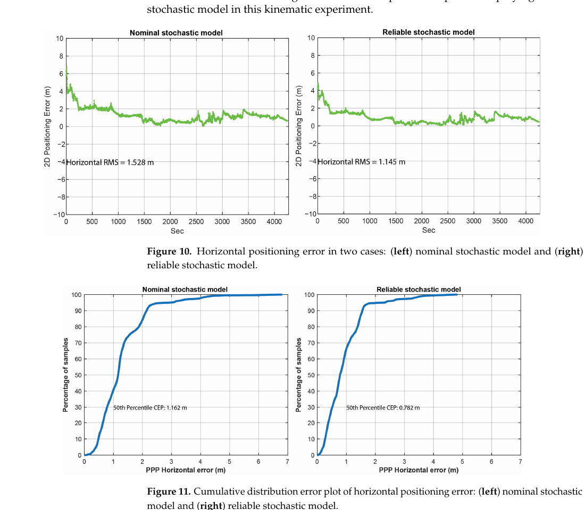
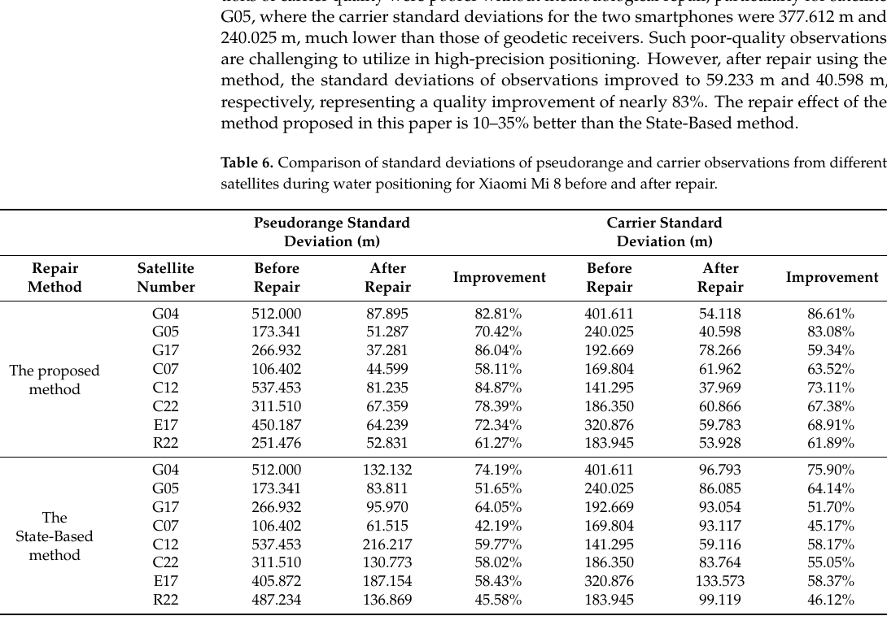
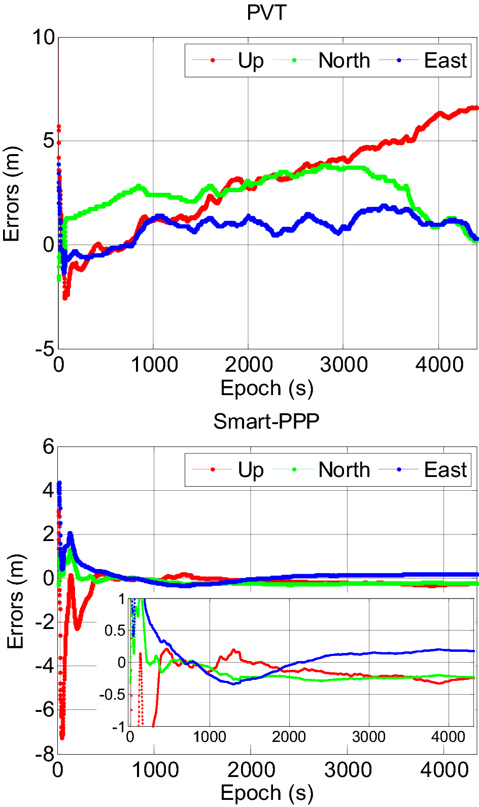

# 2026-10-06 GNSS 每日研究简报

## 今日快报

### 快报 1：把城市衍射从定位误差反过来当测图传感器，但 4 m 偏移仍只是可行性证据

- 主题：`smartphone-gnss-diffraction-building-edge-renewal`
- 来源 ID：`ion:gnss2026-17161`
- 来源链接：https://www.ion.org/gnss/abstracts.cfm?paperID=17161
- 发表日期：2026-09-18
- 来源类型：ION GNSS+ 2026 官方扩展摘要、仿真加初步城市手机试验
- 获取范围：公开扩展摘要全文；UTD/刀刃衍射假设空间、相似度融合与单次现场结果已核对，未取得正式论文、误差分布或多建筑重复试验

**内容：** 方法把通常被当作 NLOS 污染的建筑边缘衍射变成几何观测：在接收机位置和立面垂距已知时，平移候选竖直边或屋顶边，用一致性绕射理论生成各候选的 C/N0 衰减曲线，再把模拟曲线与手机实测衍射特征做相似度加权，反演 LOD1 建筑边缘位置。

**结论：** 仿真显示不同边缘假设通常产生可分辨的衰减幅度和持续时间，但屋顶上移 6–10 m 时主衍射点迁移会令若干曲线近乎重合。一个城市现场事件得到的更新边缘相对真值建筑模型仍有约 4 m 水平偏移；这支持“衍射特征含几何信息”的可行性，不足以证明稳定测图精度。

**关注理由：** 3DMA GNSS 依赖建筑模型及时更新，而低成本手机正好能众包衍射观测。工程上必须先检验边缘可辨识性、接收机位置误差和错误衍射分类，否则反问题会把传播模型偏差写回地图。

### 快报 2：手表载波周跳先辨识再修复，比删掉 TDCP 因子更能保住弱约束

- 主题：`smartwatch-tdcp-dia-cycle-slip-repair-fgo`
- 来源 ID：`ion:gnss2026-17096`
- 来源链接：https://www.ion.org/gnss/abstracts.cfm?paperID=17096
- 发表日期：2026-09-18
- 来源类型：ION GNSS+ 2026 官方扩展摘要、静态开阔环境人工注入试验
- 获取范围：公开扩展摘要全文；Samsung SM-R940、DIA 修复、注入比例和 3D RMSE 已核对，未取得正式论文、真实运动周跳或未注入外场统计

**内容：** 针对手表载波半周模糊与短弧，研究不把异常 TDCP 一律删除或仅用 M 估计降权，而是用检测—辨识—适配（DIA）估计可靠的整数周跳，修复载波后再把 TDCP 放入因子图优化，使信息留在图中。

**结论：** 在 0.1%、0.2%、0.5%、1% 和 2% 的人工注入比例下，正确修复率分别为 100.00%、100.00%、96.93%、98.08% 和 98.95%。原始开阔静态数据的 3D RMSE 为 1.764 m；2% 注入时，相对 M 估计最多改善 4.3 cm，相对删除受影响因子改善 4.5–6.4 cm。厘米级差值来自人为周跳与静态开阔数据，不代表真实腕部运动中的同等收益。

**关注理由：** 可穿戴设备真正稀缺的是连续相位弧。修复策略的价值在“恢复多少可用约束”而不只是检测率；部署时还应分别统计错修、漏修以及修复后对位置尾部的影响。

### 快报 3：量产 SoC 上的紧组合能减弱桥下误差，但厂商摘要未给路线与样本账

- 主题：`production-soc-tight-ins-gnss-adr-udr`
- 来源 ID：`ion:gnss2026-16793`
- 来源链接：https://www.ion.org/gnss/abstracts.cfm?paperID=16793
- 发表日期：2026-09-18
- 来源类型：ION GNSS+ 2026 官方扩展摘要、Airoha/MediaTek 厂商车载试验
- 获取范围：公开扩展摘要全文；伪距/Doppler 紧组合、几何分类、ADR/UDR 与桥下对比已核对，未公开路线、时长、真值、设备数量或置信区间

**内容：** 方案在量产 GNSS SoC 内以 INS 传播位置、速度和姿态，用星历生成伪距与 Doppler 预测，在测量域紧组合更新导航与惯导误差状态；卫星几何分类和鲁棒自适应权重处理遮挡。四轮 ADR 可加入车速，两轮 UDR 在无外部车速时沿用同一框架。

**结论：** 厂商报告桥下试验相对松组合的二维 RMSE 平均改善约 8%，最大位置误差改善约 17%。摘要没有给绝对误差、路线重复、基线调参或真值结构，因此只能说明该生产实现相对所选松组合基线有改善，不能据此宣称跨车辆或跨城市的可靠性。

**关注理由：** 从算法论文到量产芯片的关键是固定算力、传感器安装差异与无车速输入模式。验收应把 GNSS-only、松组合、紧组合和失锁传播分开，并公开绝对误差尾部。

### 快报 4：同型号 Pixel 7 的载波 TEC 噪声也会相差一倍，硬件个体差不能被型号名遮住

- 主题：`pixel7-carrier-phase-tec-inter-device-variability`
- 来源 ID：`doi:10.1029/2025SW004871`
- 来源链接：https://doi.org/10.1029/2025SW004871
- 发表日期：2026-05-12
- 来源类型：Space Weather 同行评审开放全文、静态手机电离层观测试验
- 获取范围：开放全文；三台翻新 Pixel 7、参考站、日食与极光案例、原始 RINEX/部分 TEC 数据可用性已核对

**内容：** 研究关闭 Android duty cycling，用双频手机载波相位构造相对 TEC，并先在安静电离层下与 1 Hz FAI1 测地站交叉核验，再检查 2024 年日全食和极光亚暴的不同时间—空间尺度结构。

**结论：** 对约 55° 高度角的 GPS G09，15 min 内载波相位 TEC 与参考站差值大体在 ±0.5 TECU，60 s 去趋势 RMS 为 0.04–0.08 TECU；伪距 TEC RMS 则为 15–37 TECU。同型号三机中，一台无周跳且为 0.04 TECU，另两台为 0.06–0.08 TECU，并出现失锁或周跳。结果依赖静止、无遮挡、主动采集，不能外推到口袋或城市被动众包。

**关注理由：** 低成本阵列或众包算法不应把“同型号”视作同一随机模型。设备磨损、系统版本、天线环境与 duty cycling 状态都应进入质量台账。

### 快报 5：OSNMA 城市评估先把“能定位”与“能连续认证”拆成两套 KPI

- 主题：`osnma-mass-market-urban-kpi-methodology`
- 来源 ID：`ion:gnss2026-17069`
- 来源链接：https://www.ion.org/gnss/abstracts.cfm?paperID=17069
- 发表日期：2026-09-18
- 来源类型：ION GNSS+ 2026 官方扩展摘要、ESA 城市测试方法与计划
- 获取范围：公开扩展摘要全文；OSNMA 服务状态、Rotterdam 测试框架、接收机处理优化和 KPI 定义已核对，摘要未发布 COTS 对比数值结果

**内容：** ESA 计划把量产 OSNMA 接收机与可配置的 FOC Test User Receiver 对比，既测有效 3D PVT 可用率和水平/垂直 95% 误差，也测各频点跟踪数、每 30 s MACK 历元成功认证的钟差/星历卫星数、每 60 s 的时间参数认证、连续 TESLA 密钥间隔与四星认证间隔。接收机还可拼接不同卫星的 TESLA 密钥并从不完整 I/NAV 子帧提取认证位。

**结论：** 摘要确认 OSNMA 已于 2025-07-24 07:00 UTC 从测试转入初始服务阶段，但 Rotterdam 城市测试的数值结果仍未给出。当前证据支持评价框架和服务状态，不支持对某款量产接收机的 TTFAF、认证可用率或定位精度作结论。

**关注理由：** 导航电文认证不是“开关已打开”就完成。遮挡环境中必须同时记录定位连续性、认证数据连续性、冷/热启动假设和失败处理逻辑，避免用普通 PVT 可用率替代安全能力。

## 深度研读

### 深读 1｜低成本与手机｜先把手机噪声量出来：LS-VCE 如何从双机双差生成随机模型

- 类别：`low-cost-mobile`
- 学习层级：`foundation`
- 选题定位：`经典基础`
- 来源 ID：`doi:10.3390/s23073478`
- 来源链接：https://doi.org/10.3390/s23073478
- 发表日期：2023-03-26
- 来源类型：Sensors 同行评审开放论文
- 获取范围：CC BY 4.0 开放全文；两台 Samsung S20 的 5 cm 基线、10,800 个历元、LS-VCE 与单频运动 PPP、Figures 1–11 和 Tables 1–6 已核对
- 价值评分：96/100（相关性 20，经典价值 19，证据 19，教学价值 19，工程价值 19）

#### 为什么先学这个

手机定位常把 C/N0 或高度角直接塞进经验权函数，但权值决定了残差、状态协方差和异常门限的含义。先用受控双机短基线把 GPS/GLONASS、伪距/载波各组方差量出来，才有资格讨论后续异常检测与精密定位。

#### 先修知识

需要理解伪距与载波相位、单差/双差、短基线公共误差抵消、协方差矩阵、最小二乘残差、C/N0、高度角定权和单频 PPP。随机模型描述不确定性，不改变观测方程的几何均值模型。

#### 一句话逻辑

用两台同型号手机的超短基线双差消掉大部分公共误差，再让 LS-VCE 从残差中估计按星座与观测类型分组的方差尺度，最后把这些尺度写回运动 PPP 权阵。

#### 研究问题与约束

两台 Samsung S20 放在已知测地墩上，基线约 5 cm，采样 1 Hz、共 10,800 历元。设备未记录 Galileo，GPS L5 也只有一两颗星，因此标定限于 GPS/GLONASS L1。独立运动验证只使用一台 S20 的单频 PPP；结论不能直接迁移到 L5、其他型号、手持姿态或城市 NLOS。

#### 核心方法论

短基线下忽略双差电离层和对流层，以已知基线解双差模糊度。将 GPS 与 GLONASS 分块，每块再分码、相位和可能的码相协方差；LS-VCE 用已知余因子矩阵的线性组合表达观测协方差，迭代估计各组尺度。随后把估得的星座/观测类型系数与 C/N0、高度角函数组合，形成 PPP 逐观测方差。

#### 关键公式逐步推导

线性化模型写为：

```math
E(y)=Ax,\qquad D(y)=Q_y=\sum_{k=1}^{p}\sigma_k Q_k.
```

其中 $`Q_k`$ 是预先定义的码、相位与星座余因子结构，$`\sigma_k`$ 是待估方差分量。令 $`P_A^\perp=I-A(A^TQ_y^{-1}A)^{-1}A^TQ_y^{-1}`$、残差 $`\hat e=P_A^\perp y`$，LS-VCE 以

```math
N_{ij}=\tfrac12\operatorname{tr}\!\left(Q_iQ_y^{-1}P_A^\perp Q_jQ_y^{-1}P_A^\perp\right),\qquad
l_i=\tfrac12\hat e^TQ_y^{-1}Q_iQ_y^{-1}\hat e
```

形成 $`\hat\sigma=N^{-1}l`$。论文最终把组尺度写入经验模型：

```math
\sigma_{i,\mathrm{type}}^{2,\mathrm{sys}}
=\hat a_{\mathrm{type}}^{\mathrm{sys}}\,
\frac{10^{-C/N_{0,i}/10}}{\sin E_i}.
```

这一步把离线标定结果变成每颗星、每历元可计算的权。

#### 经典价值与创新边界

经典价值是把“手机噪声更大”拆成可估计的方差分量，并保持随机模型与最小二乘理论一致。论文还检验码相相关而非默认其存在。边界是 LS-VCE 依赖选定的余因子结构、短基线误差抵消和足够冗余；矩阵大且迭代耗时，估出的权仍是设备、固件与场景相关资产。

#### 整体逻辑链

双机同场采数；形成 L1 双差；剔除失锁并解模糊度；按 GPS/GLONASS 与码/相位分组；定义余因子基；LS-VCE 估尺度与相关；拟合 C/N0—高度角权函数；在独立运动数据上运行单频 PPP；对比名义权与标定权。

#### 原文图表与结果分析



> 图表源：Zangenehnejad 与 Gao《Stochastic Modeling of Smartphones GNSS Observations Using LS-VCE and Application to Samsung S20》Figures 10–11，[开放全文](https://doi.org/10.3390/s23073478)。CC BY 4.0；从出版 PDF 第 16 页按两幅图及原图注边界裁出，未重绘或改动坐标轴、曲线、标签与数值。

Figure 10 横轴为秒、纵轴为二维位置误差（m）；左侧名义模型 RMS 为 1.528 m，右侧标定模型为 1.145 m，且约 1500 s 后的误差基线更低。Figure 11 横轴为 PPP 水平误差（m）、纵轴为样本百分比；50% 误差从 1.162 m 降到 0.782 m，右侧曲线更早上升。两图含收敛阶段且来自同一条运动数据，不能证明跨设备迁移或尾部完整性。

#### 原文结果论述

作者报告使用标定随机模型后，水平 RMS 降低 25.1%，50% 分位误差降低 32.7%，最大误差约从 7 m 降到 5 m。双差描述性统计同时显示码噪声远大于相位，但论文也明确指出未能评估 L5，且 LS-VCE 的大矩阵和迭代会增加计算成本。

#### 常见误区与适用边界

第一，把双差 RMS 直接当单机未差标准差。第二，把同型号两机视为完全同噪声。第三，只估方差而不检查码相相关。第四，在秩不足或异常残差主导时仍信任 VCE。第五，把较低 RMS 当成协方差一致性或错固定风险证明。第六，把 L1 标定表无条件移植到 L5、不同姿态与不同固件。

#### 工程实现步骤

1. 固定两台同型号设备与天线姿态，记录系统、频点、C/N0、锁定和硬件版本。
2. 在已知 0–10 m 基线上采至少数小时同步数据并保留原始 Android 状态字段。
3. 形成双差码相观测，标记周跳和缺测，先检查可用星与冗余度。
4. 为星座×观测类型定义最小余因子基，分批迭代 LS-VCE 并约束方差非负。
5. 在留出时段拟合 C/N0/高度角函数，检查创新白度和经验覆盖率。
6. 用独立路线比较位置 RMS、50%/95%/99.9%、协方差一致性和算力。

#### 复现实验设计

选三对 Samsung S20 与一对不同品牌双频手机，在 5 cm 和 5 m 基线上分别采 3 h 开阔、3 h 半遮挡的 1 Hz 数据；按设备留一验证。比较固定等权、仅高度角、仅 C/N0、LS-VCE 分组权与对角收缩权。指标含方差分量稳定性、码相相关、创新白度、PPP 水平 RMS/50%/95%/99.9%、负方差次数和单历元耗时。失败用例包括仅一两颗 L5、周跳簇、设备温升、旋转手机和训练设备外推。

#### 与定位及低成本实现的联系

可靠的随机模型是异常检测门限、滤波增益和 PPP 协方差的共同底座。下一节不再只问“正常噪声多大”，而是处理单历元跳变和长串异常：当观测超出模型时，是删除、降权，还是用其他频点和动态预测修复。

#### 本节小结

手机权阵应由受控数据标定并在独立路线验证。LS-VCE 能把设备特性压成少数可审计方差分量，但其有效性受频点、设备、环境和余因子结构约束。

### 深读 2｜低成本与手机｜不要见异常就删：用跨频 Kalman 预测实时修复码相跳变

- 类别：`low-cost-mobile`
- 学习层级：`intermediate`
- 选题定位：`基础进阶`
- 来源 ID：`doi:10.3390/rs16173117`
- 来源链接：https://doi.org/10.3390/rs16173117
- 发表日期：2024-08-23
- 来源类型：Remote Sensing 同行评审开放论文
- 获取范围：CC BY 4.0 开放全文；Xiaomi Mi 8 与 Huawei Mate 40 Pro 的陆地静态/水上运动试验、Figures 1–13 和 Tables 1–7 已核对
- 价值评分：94/100（相关性 20，经典价值 18，证据 19，教学价值 19，工程价值 18）

#### 为什么先学这个

上一节给出正常条件下的噪声尺度，但水面反射或手机跟踪器异常会产生数百米甚至更大的单历元差分。简单删除会进一步减少本已稀缺的频点和卫星；本节学习如何利用星地距离的时间平滑性和同星其他频点，把部分异常观测修回来。

#### 先修知识

需要理解历元间差分、常加速度状态模型、Kalman 预测/更新、创新及其方差、码相波长换算、多频观测和异常门限。修复观测是模型生成值，不等于重新获得了独立测量信息。

#### 一句话逻辑

为每颗卫星建立星地距离差分的常加速度滤波器，用预测—观测差超过两倍标准差检测异常；部分频点异常时由正常频点更新后回填，全部异常时只用预测回填。

#### 研究问题与约束

论文比较测地接收机、Xiaomi Mi 8 与 Huawei Mate 40 Pro，在江苏校园做静态陆地试验、在盐城水道做约 1 h、1 Hz 运动试验。水面多径显著放大异常频率，但作者用固定 $`2\sigma`$ 门限；不同手机硬件和环境可能需要不同门限，且修复后主要评价观测标准差而非独立位置完整性。

#### 核心方法论

状态取历元间星地距离变化、变化率和加速度，以白噪声加加速度驱动。伪距和载波先做历元间差分并统一到米；GPS L1 载波用于初始化。每历元比较预测距离变化与各频点码相差分：正常观测进入 Kalman 更新，异常观测不参与更新。若仍有正常频点，用滤后最优估计替换异常；若所有频点异常，仅用预测值替换。

#### 关键公式逐步推导

状态与转移为：

```math
X_k=[\Delta\rho_k,\ \dot{\Delta\rho}_k,\ \ddot{\Delta\rho}_k]^T,
\qquad
X_k=FX_{k-1}+Gw_{k-1},
```

```math
F=\begin{bmatrix}1&t&t^2/2\\0&1&t\\0&0&1\end{bmatrix},
\qquad
G=\begin{bmatrix}t^3/6\\t^2/2\\t\end{bmatrix}.
```

对频点 $`i`$，形成 $`\Delta P_{k,i}=P_{k+1,i}-P_{k,i}`$ 与 $`\Delta\phi_{k,i}=\phi_{k+1,i}-\phi_{k,i}`$，再计算预测差 $`d_{P,i}`$、$`d_{\phi,i}`$。论文门限可概括为：

```math
|d_{P,i}|>2\sqrt{D(d_{P,i})}
\quad\text{或}\quad
|d_{\phi,i}|>2\sqrt{D(d_{\phi,i})}.
```

若部分频点正常，则按 $`K=P^-H^T(HP^-H^T+R)^{-1}`$ 更新状态，以 $`\widehat{\Delta\rho}_k`$ 和 $`\widehat{\Delta\rho}_k/\lambda_i`$ 回填码、相位差分；若全异常，则改用纯预测 $`\Delta\rho_k^-`$。

#### 经典价值与创新边界

经典价值是把异常检测、可用观测更新和缺测预测明确分开。创新在于跨系统多频共同支撑连续异常修复，而非每条观测独立滤波。边界是二倍标准差在高斯假设下本就较激进，预测回填会制造时间相关并可能掩盖真实机动；若所有频点长期共同异常，模型只是在外推。

#### 整体逻辑链

检查手机原始码相差分；比较陆地与水上异常比例；建立星地距离动态模型；由载波初始化；逐频计算预测差和方差；用 $`2\sigma`$ 检测；按无异常/部分异常/全异常三种分支更新或预测回填；恢复原观测；与 State-Based 方法比较标准差。

#### 原文图表与结果分析



> 图表源：Mu 等《Real-Time Detection and Correction of Abnormal Errors in GNSS Observations on Smartphones》Table 6，[开放全文](https://doi.org/10.3390/rs16173117)。CC BY 4.0；从出版 PDF 第 19 页按 Table 6 及原表题边界裁出，保留全部行列、单位与数值，未重排或改写数据。

表按卫星列出 Xiaomi Mi 8 水上试验中伪距和载波差分标准差（m）。例如 G04 伪距从 512.000 m 降到 87.895 m、载波从 401.611 m 降到 54.118 m；同一原始数据上，State-Based 对应为 132.132 m 和 96.793 m。各星改善差异很大，说明收益随异常数量和幅度变化。表衡量“差分序列变平滑”，并没有直接给出坐标误差或回填偏差。

#### 原文结果论述

水上试验中异常历元比例最高接近一半；作者报告最好个例的伪距和载波质量改善分别为 93.47% 和 86.61%，相对 State-Based 方法，陆地约好 10%、水上好 10–35%。但仍有约 2–3% 异常未被实时检出/修复，且固定 $`2\sigma`$ 门限被作者列为主要原因。

#### 常见误区与适用边界

第一，把回填值当新观测。第二，不传播修复值更大的不确定性和时间相关。第三，用固定 $`2\sigma`$ 覆盖所有手机。第四，在全频共同异常时无限预测。第五，用标准差下降替代位置精度或完整性验证。第六，未区分真实几何快速变化、周跳、码跳和多径偏差。

#### 工程实现步骤

1. 按卫星和频点维护码、相位差分及锁定状态。
2. 用可信短弧初始化距离变化、速度、加速度和协方差。
3. 逐频计算标准化创新，门限同时考虑设备标定、C/N0 与多重检验。
4. 正常观测才进入更新；部分异常用滤后状态回填并加修复标志。
5. 全异常时限制纯预测最大持续时间，并膨胀协方差。
6. 在定位器中降低修复观测权，记录原值、替换值、来源频点和失败原因。

#### 复现实验设计

用两款双频手机在开阔陆地、池塘岸边、船上直行/转弯各采 60 min 1 Hz 数据，并由外接测地接收机给出独立参考。比较删除、Huber 降权、State-Based、固定 $`2\sigma`$ 修复和设备自适应门限。指标含逐类检出/误警、回填偏差、异常连续长度、SPP/PPP RMS 与 95%/99.9%、滤波 NEES、纯预测持续时间和算力。失败用例包括急转、全频共同失锁、连续 30 s NLOS、周跳与真实钟跳。

#### 与定位及低成本实现的联系

修复层把稀疏、跳变的手机观测变成更连续的输入，但它不能替代精密定位模型。下一节把设备特有的码相不一致、单/双频混合、外部精密改正、RAIM 与动态约束放进一个实时 PPP 链，观察最终坐标能到什么量级。

#### 本节小结

跨频滤波能比简单删除保留更多手机观测，但每个回填值都带模型债务。门限、协方差膨胀、最长预测时长和位置域验证必须一起设计。

### 深读 3｜定位｜把测地 PPP 改成手机能用：分离码相钟、混频观测与实时质量控制

- 类别：`positioning`
- 学习层级：`advanced`
- 选题定位：`定位深入`
- 来源 ID：`doi:10.1007/s10291-021-01106-1`
- 来源链接：https://doi.org/10.1007/s10291-021-01106-1
- 发表日期：2021-03-03
- 来源类型：GPS Solutions 同行评审开放论文
- 获取范围：CC BY 4.0 开放全文；Smart-PPP 模型、Android 实时软件、Huawei Mate20 静态与 Mate30 步行试验、Figures 1–12 和 Tables 1–3 已核对
- 价值评分：97/100（相关性 20，经典价值 19，证据 20，教学价值 19，工程价值 19）

#### 为什么先学这个

前两节分别给出权阵和异常修复；真正的手机 PPP 还必须处理单/双频混杂、码相钟不一致、电离层状态、平滑码、RAIM 和遮挡后的动态连续性。Smart-PPP 展示了这些模块如何在 Android 终端形成一条可运行的纯 GNSS 精密定位链。

#### 先修知识

需要理解非组合 PPP、精密轨钟、码/相位偏差、电离层频率缩放、载波平滑码、Kalman 滤波、RAIM、Doppler 速度和收敛定义。外部精密改正仍属于 GNSS 定位，不等于完全自主无服务。

#### 一句话逻辑

用非组合模型统一处理手机可用的单/双频观测，为每个信号分别估计码钟与相位钟吸收硬件不一致，以电离层伪观测和 C/N0 权增强可观测性，再用 RAIM 与动态滤波把实时解稳定输出。

#### 研究问题与约束

静态试验用 Huawei Mate20 在北京道路旁约 70 min；步行试验用 Mate30 约 140 min，并以邻近测地接收机后处理 RTK 为参考，手机与参考天线仍有约 0–10 cm 未建模放置偏差。实时产品来自 CAS 轨钟和 VTEC 流。Android PVT 基线是厂商多传感器融合而非 GNSS 芯片纯解，二者对比并非只差 PPP 算法。

#### 核心方法论

非组合 PPP 为每系统/信号保留原始码相，不强制所有卫星都有双频。针对手机码相与频间钟不一致，码和相位、不同信号使用独立接收机钟参数；斜电离层作为状态并由实时 VTEC 伪观测约束。Doppler 平滑伪距降低码噪声，C/N0 随机模型控制权重，RAIM 检测剔除残余故障。位置域自适应 Kalman 滤波结合 PPP 位置和 Doppler 速度，在遮挡时按运动状态调整过程噪声。

#### 关键公式逐步推导

以信号 $`j`$ 的非组合观测为例，可把论文模型的关键结构写成：

```math
P_{r,j}^s=\rho_r^s+c(\delta t_{r,P,j}-\delta t^s)+T_r^s+\gamma_j I_{r,1}^s+b_{P,j}^s+\varepsilon_P,
```

```math
\Phi_{r,j}^s=\rho_r^s+c(\delta t_{r,\Phi,j}-\delta t^s)+T_r^s-\gamma_j I_{r,1}^s+\lambda_jN_{r,j}^s+b_{\Phi,j}^s+\varepsilon_\Phi,
```

其中 $`\gamma_j=f_1^2/f_j^2`$。关键不是符号多少，而是 $`\delta t_{r,P,j}`$ 与 $`\delta t_{r,\Phi,j}`$ 分开，使手机码相不一致不被硬塞进模糊度或残差。外部 VTEC 转成斜电离层伪观测：

```math
\widetilde I_{r,1}^s=I_{r,1}^s+\nu_I,
```

以有限方差增强单频状态。滤后位置与 Doppler 速度再进入动态模型，而 RAIM 负责在更新前后门控离群测量。

#### 经典价值与创新边界

经典价值是展示“专业 PPP 模型不能原样搬到手机”的具体改造点：钟参数、混频、电离层、随机模型和质量控制必须一致。工程价值在于 Android 实机实时实现。边界是实时改正和 VTEC 来自外部服务，试验设备和路线有限，且与 Android PVT 的比较混入厂商传感器融合；它不是城市全球可用性证明。

#### 整体逻辑链

Android API 取原始码相/Doppler；接收广播星历和实时轨钟/VTEC；预处理与周跳检查；Doppler 平滑码；建立分信号码相钟的非组合 PPP；加入电离层伪观测；按 C/N0 定权；RAIM 检测剔除；Kalman 估位置、钟、电离层和模糊度；位置域动态滤波；与 RTK 参考和 Android PVT 比较。

#### 原文图表与结果分析



> 图表源：Wang 等《Real-time GNSS precise point positioning for low-cost smart devices》Figure 6，[开放全文](https://doi.org/10.1007/s10291-021-01106-1)。CC BY 4.0；直接保存 Springer 出版页提供的原始全尺寸 PNG，未裁剪、重绘或改动坐标轴、曲线、图例与数值。

横轴为历元秒，纵轴为东、北、上误差（m）。上图 Android PVT 的垂向随时间漂到 5 m 以上，北向长期在数米；下图 Smart-PPP 初期有明显收敛，约数分钟后大体进入 ±1 m，并在嵌入小图中显示亚米变化。上下图纵轴不同（上图 −5 至 10 m，下图 −8 至 6 m），不能只凭视觉面积比较；图也只是一段静态试验。

#### 原文结果论述

静态全时段 Smart-PPP 的 ENU RMS 为 0.43/0.27/0.73 m，Android PVT 为 1.09/2.66/3.71 m；收敛后各分量约 0.2 m。36 次每小时重启中，达到 1 m 的中位时间约为水平 1.5 min、垂直 4.5 min，上邻近值约水平 11 min、垂直约 22 min。步行试验 Smart-PPP ENU RMS 为 0.65/0.54/1.09 m，95% 为 1.03/1.08/2.29 m。作者同时说明 Android PVT 是未知细节的厂商融合解。

#### 常见误区与适用边界

第一，把外部实时轨钟/VTEC 忽略为“手机自主”。第二，用同一码相钟参数迫使不一致进入残差。第三，把双频缺测的卫星全部丢掉。第四，把与厂商融合 PVT 的差异全归功于 PPP。第五，只报收敛后精度而不报启动分布。第六，把单路线 RMS 当城市完整性或所有手机型号性能。

#### 工程实现步骤

1. 记录每信号 Android 原始状态、硬件钟、码相、Doppler、C/N0 和锁定信息。
2. 对实时星历、轨钟、VTEC 建统一时间基准并监控改正年龄。
3. 用非组合状态表动态接纳单/双频卫星，分别参数化必要的码相钟。
4. 传播平滑码的方差，按设备标定模型定权，并保留原始/修复标志。
5. 用 RAIM 或标准化创新门控，异常后重置对应模糊度而非全滤波器。
6. 输出收敛状态、改正年龄、观测构成、保护性质量标志和位置协方差。

#### 复现实验设计

选 Mate20/Mate30 与两款新双频手机，在静态开阔、林荫步行、城市道路各跑 10 次 90 min；同时记录独立双天线测地 RTK 真值。比较 Android PVT、传统共钟 PPP、分码相钟 Smart-PPP、无 VTEC、无 RAIM 与完整方案。每 30 min 冷启动并注入 10–120 s 改正延迟、单频缺测和码跳。指标含 ENU RMS/95%/99.9%、到 1 m/0.5 m 时间分布、可用率、误警/漏检、协方差覆盖、流量、CPU 和电耗。

#### 与定位及低成本实现的联系

这条链把前两节的随机模型与异常处理落到最终纯 GNSS 坐标：离线标定提供可信权，实时检测避免坏观测污染，手机化 PPP 模型处理硬件不一致和频点缺失。三者缺一，亚米结果都可能只是某段数据的偶然表现。

#### 本节小结

手机 PPP 的核心不是把测地代码编译到 Android，而是重建与硬件观测相匹配的功能模型、随机模型和质量控制。Smart-PPP 证明实时亚米级具有条件可行性，也清楚暴露了服务依赖、收敛与验证范围。
