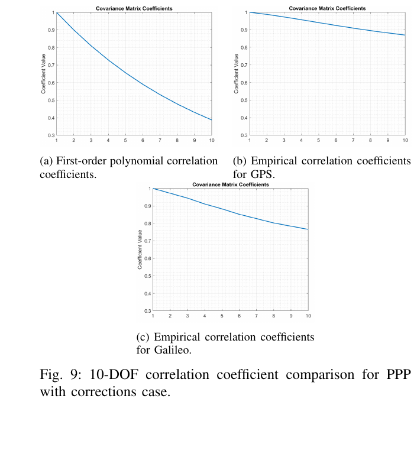
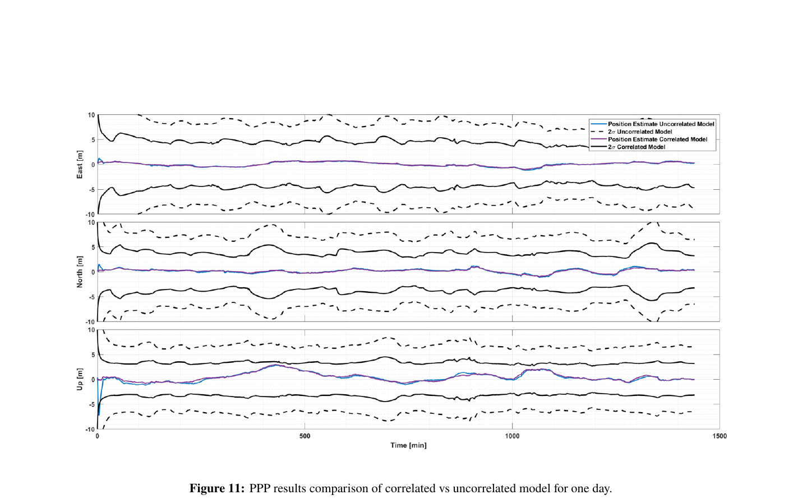
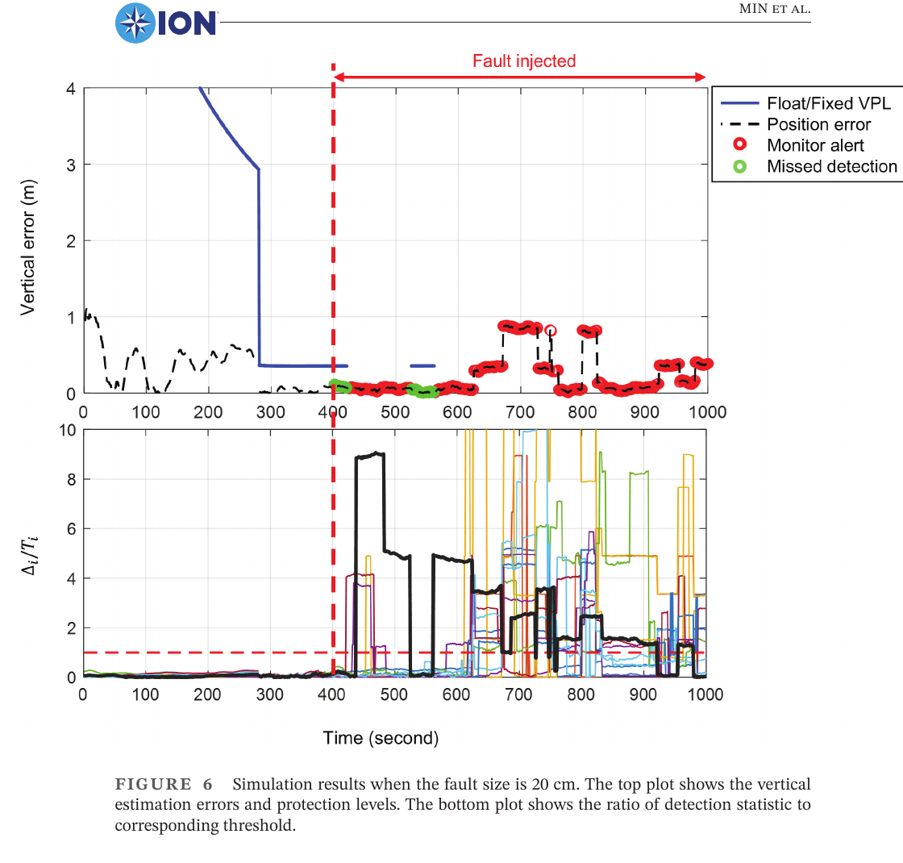

# 2026-10-08 GNSS 每日研究简报

## 今日快报

### 快报 1：重尾误差不必全塞进膨胀高斯，但 50 次仿真还不是尾部概率证明

- 主题：`gaussian-pareto-hybrid-protection-level-filter`
- 来源 ID：`ion:gnss2026-17167`
- 来源链接：https://www.ion.org/gnss/abstracts.cfm?paperID=17167
- 发表日期：2026-09-18
- 来源类型：ION GNSS+ 2026 官方扩展摘要、航空进近仿真
- 获取范围：公开扩展摘要全文；Gaussian–Pareto 似然、Kalman 估计分离、Student-t 测量误差、50 次 Monte Carlo 与 10 m 告警限已核对，未取得正式论文、样本尾部分布或实际飞行验证

**内容：** 方法把“如何递推状态”和“如何算保护级”拆开：状态时间更新与测量更新仍使用高斯外包络，以保持 Kalman 框架；保护级计算则用 Gaussian–Pareto 外包络构造 Bayesian 后验，试图在不丢失重尾保守性的前提下收紧尾部界。

**结论：** 点质量飞机进近仿真以 Student-t 误差代替真实重尾，按 $`10^{-6}`$ 完整性风险计算垂向保护级。官方摘要称 50 次 Monte Carlo 中，10 m 告警限下传统高斯外包络偶有越限，而混合方法保持在限值内并给出更小保护级。该结果只说明所设分布与几何下的可行性；50 次试验无法经验验证 $`10^{-6}`$ 尾概率，摘要也把 VPL/HPL 用词混用。

**关注理由：** 直接膨胀高斯会牺牲可用性，完全非高斯递推又难以落地。工程上应把“估计器是否稳定”和“尾部界是否保守”分别验收，并用重要抽样或解析界补足稀有事件证据。

### 快报 2：Bayes tree 的秩更新可把约 23 个故障假设压到 1 ms 内，但保证依赖高斯后验近似

- 主题：`incremental-smoothing-araim-rank-update`
- 来源 ID：`ion:gnss2026-16840`
- 来源链接：https://www.ion.org/gnss/abstracts.cfm?paperID=16840
- 发表日期：2026-09-18
- 来源类型：ION GNSS+ 2026 官方扩展摘要、GNSS/IMU 增量平滑城市试验
- 获取范围：公开扩展摘要全文；Bayes tree 边缘协方差、Sherman–Morrison/Woodbury 秩更新、约 23 个故障假设、香港数据与运行时间主张已核对，未取得正式论文或独立复现实验

**内容：** 研究把 ARAIM 从 WLS 迁到 iSAM2/固定滞后因子图：从 Bayes tree 后验取边缘协方差，单星故障用 Sherman–Morrison 更新，整星座故障用 Woodbury 更新，无需为每个假设重解整张图。系统还叠加测量残差、优化残差、GNSS-only/融合解一致性与告警限检查。

**结论：** 作者报告约 20 个单星加 3 个整星座假设可在 1 ms 内完成，额外计算开销低于优化时间的 5%。数据来自香港城市道路、u-blox ZED-F9P、通常 20 颗以上在用卫星、400 Hz IMU 和 15 s 固定滞后窗。形式保证建立在因子图 Laplace/高斯后验近似上，不能自动覆盖多峰、错误线性化或未建模相关误差。

**关注理由：** 因子图完整性真正的瓶颈不是“会不会算残差”，而是能否在多假设下快速、可审计地传播协方差。秩更新值得复现，但应同时测试重线性化、错误数据关联和相关观测对保护级的破坏。

### 快报 3：AI 干扰检测开始闭环到删星与降权，但摘要没有给误警、漏警或时延数字

- 主题：`ai-gnss-interference-closed-loop-mitigation`
- 来源 ID：`ion:gnss2026-17035`
- 来源链接：https://www.ion.org/gnss/abstracts.cfm?paperID=17035
- 发表日期：2026-09-17
- 来源类型：ION GNSS+ 2026 官方扩展摘要、GMV 厂商系统方案
- 获取范围：公开扩展摘要全文；C/N0、伪距残差、Doppler、信号质量指标、时间窗特征、实录加实验室训练与闭环动作已核对，摘要未公开模型结构、样本规模、误警率、漏警率或端到端时延

**内容：** 框架不只给“疑似干扰”标签，而是把当前观测与多时间窗统计/趋势特征共同送入分类器，再由定位引擎按类别和置信度触发删星、降权、改变融合策略或增加惯性/车辆运动约束。训练集同时使用外场真实干扰录波和实验室受控攻击。

**结论：** 官方摘要主张时间演化特征有助于区分多路径、电离层扰动和蓄意干扰，并可降低检测到缓解的响应时间；但没有发布任何定量混淆矩阵、跨场景留出结果、算力或时延。因此当前证据支持系统架构，不支持“显著降低误警”或“实时性已验证”的量化结论。

**关注理由：** 防护系统的最后一公里是把检测结果变成可逆、可降级的导航动作。上线前必须把错误删星造成的几何损失、模型漂移和攻击者适应纳入闭环测试，而不是只验分类准确率。

### 快报 4：跨厂商质量分类想修正接收机“过度自信”，但“显著改善”仍缺公开样本账

- 主题：`cross-vendor-ai-gnss-quality-classification`
- 来源 ID：`ion:gnss2026-16947`
- 来源链接：https://www.ion.org/gnss/abstracts.cfm?paperID=16947
- 发表日期：2026-09-18
- 来源类型：ION GNSS+ 2026 官方扩展摘要、TDK/Trusted Positioning 厂商多城市数据
- 获取范围：公开扩展摘要全文；运动感知重叠窗口、标准化 GNSS 特征、质量等级与置信因子、多城市多接收机范围已核对，未公开城市数、里程、设备清单、基线指标或误差分位数

**内容：** 针对低成本接收机在 NLOS、多路径和隧道环境中低估自身位置标准差的问题，方法用运动感知重叠窗口切分连续流，只依赖标准化 GNSS 观测与派生运动特征，输出质量等级和置信因子，再动态调节 GNSS/INS 融合权重。

**结论：** 作者称模型在多城市、从消费级到高精度模块的数据上优于传统质量评估，并改善严重退化时的组合导航；公开摘要没有任何绝对或相对数值，也未说明训练城市与测试城市是否隔离。因而只能记录“提出并做过多设备验证”的作者主张，不能据此认定跨厂商泛化成立。

**关注理由：** 接收机给出的 sigma 若不可信，滤波器再精巧也会过度自信。真正有价值的验收应按未见城市、未见硬件和未见干扰类型分层，并检查置信因子的统计校准而非只看分类率。

### 快报 5：LEO 星座自己用 GNSS 定轨时，上游单星故障会变成下游共因故障

- 主题：`leo-pnt-onboard-ura-cascaded-gnss-fault`
- 来源 ID：`ion:gnss2026-16859`
- 来源链接：https://www.ion.org/gnss/abstracts.cfm?paperID=16859
- 发表日期：2026-09-18
- 来源类型：ION GNSS+ 2026 官方扩展摘要、高低轨 LEO 合成仿真
- 获取范围：公开扩展摘要全文；机载导航电文生成、级联 GNSS 故障、URE 域解分离与 URA 推导已核对，摘要未发布数值保护级、检测率或硬件在环结果

**内容：** 专用 LEO PNT 卫星若依赖 GNSS 在轨定轨并自行生成导航电文，一颗上游 GNSS 卫星故障可能同时污染多颗 LEO 的轨道钟产品。方法在 LEO 卫星端做解分离监测，以未检出故障的最坏 URE 构造 URE 域保护级，再换算成下发给用户的 URA。

**结论：** 研究用合成 GPS/Galileo 观测评估代表性的高、低轨 LEO 场景，论证这种级联故障应分配到星座故障概率，而不能当作相互独立的 LEO 单星故障。公开摘要没有数值结果，且合成观测尚未覆盖真实在轨接收机、定轨动力学失配和星间共同软件错误。

**关注理由：** LEO-PNT 的 URA 不只是“定轨 RMS 除以一个系数”。生成链上共享的上游观测、算法和时间源会制造共因失效，用户端保护级必须看见这条依赖链。

## 深度研读

### 深读 1｜接收机工程｜先把时间相关写进协方差：多元高斯外包络怎样约束任意线性组合

- 类别：`receiver-engineering`
- 学习层级：`foundation`
- 选题定位：`经典基础`
- 来源 ID：`doi:10.1109/PLANS61210.2025.11028185`
- 来源链接：https://doi.org/10.1109/PLANS61210.2025.11028185
- 发表日期：2025-04-28
- 来源类型：IEEE/ION PLANS 2025 同行评审会议论文、作者公开全文
- 获取范围：作者公开全文；2024 年 1 月 GPS/Galileo、5 min URE、10 维时间窗、两类精密产品代理、Figures 1–12 和 Tables I–III 已核对
- 价值评分：95/100（相关性 20，经典价值 18，证据 19，教学价值 19，工程价值 19）

#### 为什么先学这个

保护级不是把每个历元的标准差独立相加。轨道钟误差在时间上高度相关，同一误差被滤波器连续使用时，若仍用独立噪声模型，会误判信息量；若简单把所有样本当完全相关，又会让保护级过宽。第一步应学会为一段误差序列构造能外包任意线性估计方向的协方差。

#### 先修知识

需要理解 URE、协方差矩阵、正定矩阵、Mahalanobis 范数、卡方分布、尾累积分布、Kalman 线性组合和 PPP 轨道钟改正。外包络追求的是“所用统计模型不低估尾部风险”，不是拟合均方误差最小。

#### 一句话逻辑

把连续 $`n`$ 个 URE 组成向量，用候选协方差 $`C`$ 白化；只要白化后平方范数的尾部被 $`\chi_n^2`$ 尾部覆盖，就能把 $`N(0,C)`$ 作为这一多元误差的高斯外包络。

#### 研究问题与约束

论文以 2024 年 1 月、5 min 采样的 GPS/Galileo 数据构造 10 维连续 URE。超快速产品相对最终产品被当作“有 PPP 改正”代理，广播星历相对最终产品被当作“无改正”代理；200 个全球均匀用户位置用于把轨道钟误差投影到视线。代理没有重现真实服务延迟、改正连续性和接收机本地误差，5 min 采样也会漏掉更快故障。

#### 核心方法论

先对每颗星、每个用户位置形成连续 URE 向量 $`Y_t`$，用在线 Welford 更新处理大样本均值和协方差。候选 $`C`$ 可来自一阶相关曲线或经验相关矩阵，再乘尺度 $`\beta`$。算法搜索最小 $`\beta`$，使全部可检验尾部上经验 $`Y^TC^{-1}Y`$ 不超过同自由度卡方尾部；满足后，任何估计向量 $`a`$ 的 $`a^TY`$ 可由 $`a^TCa`$ 给出保守尺度。

#### 关键公式逐步推导

对长度为 $`n`$ 的误差向量，定义白化量 $`X=C^{-1/2}Y`$。外包络判据为：

```math
P\!\left(Y^TC^{-1}Y>T\right)\le P\!\left(\chi_n^2>T\right),\qquad \forall T.
```

任意线性状态误差写成 $`\eta=a^TY`$，其候选方差为 $`\sigma_\eta^2=a^TCa`$。令 $`u=C^{1/2}a/\sqrt{a^TCa}`$，则：

```math
P\!\left(a^TY>K\sqrt{a^TCa}\right)
=P\!\left(u^TX>K\right)\le Q(K).
```

工程实现通常取 $`C=\beta C_{\mathrm{shape}}`$；固定相关形状后，沿经验尾部求使上述卡方不等式成立的最小 $`\beta`$。

#### 经典价值与创新边界

经典价值是把“尾部保守”从单一标量推广到整段相关向量，且结果可直接进入线性估计器。创新边界在于该判据对线性组合和所检验样本分布成立，并不自动覆盖非平稳、跨卫星相关、模型切换或样本之外的更极端尾部；$`C`$ 的形状选择仍是一项优化问题。

#### 整体逻辑链

下载广播、超快速和最终轨道钟产品；投影成全球 URE；按卫星与时间切出 10 步窗口；估经验相关；选一阶或经验形状矩阵；用卡方尾判据求尺度；比较 GPS/Galileo 与两种产品代理；把有效协方差交给后续用户滤波。

#### 原文图表与结果分析



> 图表源：Wang、Blanch 与 Walter《Overbounding Time-correlated Errors for a Multi-constellation Precise Point Positioning Integrity Service》Figure 9，[作者公开全文](https://web.stanford.edu/group/scpnt/gpslab/pubs/papers/Wang_ION_IEEE_PLANS_2025_NonGaussian_Overbound.pdf)。未见开放再许可声明；按研究评论仅从 PDF 第 7 页裁取原图与原图注，未重绘或改动坐标轴、曲线、标签与数值。

三幅图横轴为 10 个相邻 5 min 步，纵轴为相关系数。左图是一阶多项式候选形状，从 1 衰减到约 0.39；右上经验 GPS 相关在第 10 步仍约 0.87，右下 Galileo 约 0.77。直接读图说明两星座都远非白噪声，GPS 衰减更慢；它不能证明该月之外仍保持同一相关结构，也不能说明哪一个 $`C`$ 给出最小用户域保护级。

#### 原文结果论述

论文报告经验相关形状和预设的一阶形状都能经尺度化满足卡方判据，但低概率大离群会把尺度推大。广播对最终产品、超快速对最终产品的误差结构不同；GPS 相比 Galileo 需要更强的相关处理或更大的尺度。作者把结果定位为基线协方差，后续仍需在实际 PPP 滤波器和更长数据上验证紧致度。

#### 常见误区与适用边界

第一，只匹配样本协方差就宣称尾部被包住。第二，把相关系数矩阵直接当完整协方差，忘记尺度。第三，用 5 min 产品推断秒级快速故障。第四，把同星时间相关外推成跨星独立。第五，把全球 200 个投影点当真实用户网络。第六，只看均方误差而不逐尾概率检查卡方判据。

#### 工程实现步骤

1. 按卫星、产品、采样率和用户视线形成带时间戳的 URE。
2. 分清广播—最终、超快速—最终与真实服务残差，避免混合不同链路。
3. 以业务滤波记忆长度切滑窗，先检查平稳性和缺测机制。
4. 构造 Toeplitz、一阶 Gauss–Markov 及经验收缩等候选 $`C_{\mathrm{shape}}`$。
5. 对经验 $`Y^TC^{-1}Y`$ 尾部搜索最小尺度，并在留出月份复验。
6. 将 $`C`$ 传播到用户状态，比较保护级、覆盖率与可用性。

#### 复现实验设计

下载 2024–2026 年 GPS/Galileo/BDS 广播、超快速与最终产品，按 5 s、30 s、5 min 三种采样构造 2、10、30、120 步窗口；训练 6 个月、按整月留出。比较独立高斯、经验协方差、AR(1)、Matérn 与频域外包络。指标包括每个尾阈值的超越比、最小 $`\beta`$、垂向用户方差、保护级 50%/95%/99.9% 和计算量。失败用例包括钟跳、产品切换、缺测簇及跨星共因异常。

#### 与定位及低成本实现的联系

低成本接收机无法自行修正所有上游轨道钟误差，却会在 PPP 中反复使用这些改正。准确建模相关性可以避免把同一信息重复计数，也能比“全部独立后粗暴膨胀”更紧。下一节把这里的范围域协方差真正放进 PPP 用户滤波器。

#### 本节小结

时间相关误差必须作为向量而非一串独立 sigma 管理。卡方范数判据提供了可审计的多元高斯外包络，但其可信度仍受数据长度、采样率、候选形状和非平稳故障约束。

### 深读 2｜接收机工程｜外包络要落到用户域：一阶相关状态怎样收紧 PPP 的 2σ 边界

- 类别：`receiver-engineering`
- 学习层级：`intermediate`
- 选题定位：`基础进阶`
- 来源 ID：`doi:10.33012/2026.20609`
- 来源链接：https://doi.org/10.33012/2026.20609
- 发表日期：2026-04-16
- 来源类型：ION 2026 Pacific PNT 同行评审会议论文、作者公开全文
- 获取范围：作者公开全文；2024-01-01 至 2024-07-01 GPS、30 s URE、15 min 窗口、无改正 PPP 原型、Figures 1–11 和 Tables 1–3 已核对
- 价值评分：96/100（相关性 20，经典价值 18，证据 19，教学价值 20，工程价值 19）

#### 为什么先学这个

上一节只证明某个范围域协方差能包住相关误差；工程上还要回答它如何进入递推器、会不会双重计算信息、最终位置界能否收紧。本节用一阶 Gauss–Markov 状态把相关轨道钟误差接进 PPP，展示“保守但不必过宽”的用户域结果。

#### 先修知识

需要理解 PPP 码相观测、精密/广播轨道钟、状态转移、过程噪声、稳态方差、相关时间常数、批处理与递推滤波、位置误差归一化及 QQ 图。相关模型中的小 sigma 不等于放松安全要求，它必须与正确的状态记忆配套。

#### 一句话逻辑

把经卡方判据得到的时间相关外包络转换为一阶 Gauss–Markov 轨道误差状态，让滤波器显式记住误差而不是每历元重复注入独立大噪声，从而在保持经验覆盖的同时收紧位置 2σ。

#### 研究问题与约束

论文用 2024-01-01 至 2024-07-01 的 GPS 广播相对最终产品 URE，30 s 采样、30 步即 15 min 窗口，JPLM 单站观测几何。PPP 原型使用广播轨道钟、没有实际 PPP 改正；只把轨道钟相关误差建成状态，其他多路径、电离层、对流层和载波平滑误差按相互不相关加入。结果是概念验证，不是完整服务完整性论证。

#### 核心方法论

先按前一节判据在候选相关矩阵中选择使垂向用户误差最小且仍外包的 $`C`$。随后把轨道误差作为滤波状态 $`e_k`$，以 AR(1)/一阶 Gauss–Markov 转移传播；稳态方差来自外包尺度，过程噪声按相关系数闭合。对照模型把误差当历元独立，必须采用更大的等效噪声，因而保护边界更宽。

#### 关键公式逐步推导

一阶误差状态写为：

```math
e_{k+1}=\alpha e_k+\eta_k,
\qquad \alpha=\exp(-\Delta t/\tau).
```

若要求稳态 $`\operatorname{Var}(e_k)=\sigma_e^2`$，则：

```math
\sigma_e^2=\alpha^2\sigma_e^2+\sigma_\eta^2
\quad\Longrightarrow\quad
\sigma_\eta^2=\sigma_e^2(1-\alpha^2).
```

把该状态加入 PPP 的 $`F,Q,H,R`$ 后，位置协方差不再假设每个历元收到一份独立轨道误差。论文在候选协方差中最小化垂向项：

```math
\min_C\;[G^TR^{-1}G]^{-1}_{33}
\quad\text{s.t.}\quad
Y^TC^{-1}Y\preceq\chi_n^2.
```

#### 经典价值与创新边界

价值在于完成“范围域尾界—相关状态—用户位置界”的接口闭合。创新边界是只用一阶模型刻画轨道钟相关；实际误差可能含多时间尺度、产品切换和确定性周期。滤波结果还依赖未建模误差的独立假设，不能把图中 2σ 当成完整 HPL/VPL 或认证风险界。

#### 整体逻辑链

收集半年 30 s GPS 产品；形成 15 min URE 窗；搜索外包相关矩阵；从相关系数换算 $`\alpha,\tau,\sigma_\eta`$；扩充 PPP 状态；运行相关与独立两套模型；检查一天、五天和一个月的位置误差、2σ、直方图与 QQ 图；比较边界紧致度。

#### 原文图表与结果分析



> 图表源：Wang、Min、Blanch 与 Walter《User Domain Overbounding with Integrity of Time-Correlated Errors for Precise Point Positioning》Figure 11，[作者公开全文](https://web.stanford.edu/group/scpnt/gpslab/pubs/papers/Wang_ION_PPNT_2026_Time_Corr_Errs.pdf)。未见开放再许可声明；按研究评论仅从出版 PDF 第 13 页裁取原图与原图注，未重绘或改动坐标轴、曲线、图例或数值。

三行分别为 East、North、Up，横轴为一天内分钟，纵轴为米。蓝/紫位置误差几乎重合，说明两种噪声处理没有制造明显的估计偏移；黑色实线是相关模型 2σ，虚线是独立模型 2σ，后者大约每侧再宽 3–4 m。图能直接支持“显式相关可收紧边界”，但只是一日、无真实 PPP 改正的原型，不能证明业务告警限下的长期可用性。

#### 原文结果论述

作者报告半年样本得到的 15 min 相关外包在 30 天归一化位置误差直方图与 QQ 图上表现保守；相关模型相对独立模型把 2σ 约收紧 3.5 m，而位置估计本身相近。论文同时明确指出，相关强度随观测与产品而变，高阶模型可能更紧，真实 PPP 改正接入后的效果仍待验证。

#### 常见误区与适用边界

第一，把 $`\alpha`$、相关系数 $`\rho`$ 和外包尺度 $`\beta`$ 混为一谈。第二，只减小测量 sigma 而不加入相关状态。第三，用同一时间常数覆盖钟、轨道、对流层与多路径。第四，用一天 2σ 图声称 $`10^{-7}`$ 风险已验证。第五，忽略初始化与产品切换。第六，把无改正 PPP 结果外推到实时改正服务。

#### 工程实现步骤

1. 将外包协方差按采样间隔转换为离散 $`\alpha`$ 与 $`Q`$。
2. 为每颗卫星或公共模式建立轨道钟误差状态，避免重复注入同一误差。
3. 产品更新、卫星切换和钟跳时显式重置或切换模型。
4. 将其他误差项分层加入，记录是否假定跨历元/跨星独立。
5. 用留出月检查归一化误差、QQ 尾部与创新白度。
6. 同时输出位置误差、保护级/2σ、可用率和异常事件日志。

#### 复现实验设计

在三座 IGS 站运行 GPS/Galileo 双系统 PPP，30 s 与 1 s 两种采样，各取 12 个月；对比独立噪声、AR(1)、AR(2)、多过程和频域外包。使用广播、事后精密及真实 SSR 流三条链。指标含 ENU RMS、2σ 覆盖、99.9% 归一化误差、保护级 50%/95%、收敛时间和状态维数。注入 0.1–2 m 钟阶跃、改正延迟、产品断档与跨星共模故障；基线应含不建轨道误差状态的标准 PPP。

#### 与定位及低成本实现的联系

低成本平台最怕为保守而把保护级膨胀到不可用。显式相关状态用模型记忆换取更紧边界，但也引入参数失配风险；必须提供退化模式，在相关模型失效时回落到更宽的独立外包。下一节进一步处理载波差分中“整数固定让误差分布多峰”的完整性难题。

#### 本节小结

好的外包络不应停在离线统计图上。只有把相关结构一致地写进状态转移、过程噪声和用户协方差，并用留出数据验证，才能既守住覆盖又避免无谓膨胀。

### 深读 3｜定位｜固定解不是高斯：CDGNSS 解分离怎样把漏检故障也包进 VPL

- 类别：`positioning`
- 学习层级：`advanced`
- 选题定位：`纯 GNSS 定位前沿`
- 来源 ID：`doi:10.33012/navi.718`
- 来源链接：https://doi.org/10.33012/navi.718
- 发表日期：2025-12-01
- 来源类型：NAVIGATION 同行评审开放论文、纯 GNSS 载波差分仿真
- 获取范围：CC BY 4.0 开放全文；固定解多峰分布、解分离阈值、测量外包、GPS/Galileo 双频仿真、Figures 1–6 与 Table 1 已核对
- 价值评分：97/100（相关性 20，经典价值 19，证据 19，教学价值 20，工程价值 19）

#### 为什么先学这个

码伪距 RAIM 的位置误差常可近似单峰高斯；CDGNSS 一旦把浮点模糊度映射为整数，固定位置误差会随候选格跳变，成为多峰分布。若还用单一高斯残差直接算保护级，最危险的错固定可能完全不在模型里。本节把正确固定概率、解分离和测量外包放进同一风险预算。

#### 先修知识

需要理解双差码相、浮点/固定解、整数 bootstrapping、pull-in region、条件高斯、解分离 RAIM、完整性风险、连续性风险、VPL、半正定序和 Gaussian overbounding。ratio test 只衡量候选相对接近程度，不等于正确整数概率证明。

#### 一句话逻辑

主滤波器用全部卫星，各子滤波器删除一个故障假设卫星；以固定位置之差做监测量，把所有错固定保守地计作完整性损失，再用外包协方差确保正确固定分支和正确固定概率都不会过度乐观。

#### 研究问题与约束

论文只考虑单星测量故障，双系统双频、5 km 基线、用户 60 km/h 的合成场景；使用 integer bootstrapping 而非一般 LAMBDA，未包含真实接收机时间不同步、参考站故障、跨星共因、大气突变或城市 NLOS。完整性风险 $`10^{-7}`$、连续性风险 $`10^{-5}`$ 是设计输入，仿真不能经验验证如此低的真实失效率。

#### 核心方法论

主滤波器得到全星浮点基线/模糊度并固定；每个单星故障假设建立删除该星的子滤波器并独立固定。监测量 $`\Delta_i=\check b_i-\check b_0`$ 直接位于位置域。完整性风险按假设先验加权；对正确固定条件下的浮点位置使用高斯尾，对任何错误固定直接取风险 1。阈值由故障自由连续性预算和条件解分离方差确定；若正确固定概率尚不够高，就继续输出浮点解。

#### 关键公式逐步推导

完整性风险目标可写为：

```math
\sum_{i=0}^{h}P\!\left(|\check b_{0,v}-b_v|>VPL,\
\bigcap_{j=1}^{h}|\Delta_{j,v}|\le T_{j,v}\mid H_i\right)P(H_i)
\le I_{req,v}.
```

利用三角不等式，故障 $`H_i`$ 下可由无故障子集解上界：

```math
P\!\left(|\check b_{0,v}-b_v|>VPL,\ |\Delta_{i,v}|\le T_{i,v}\mid H_i\right)
\le P\!\left(|\check b_{i,v}-b_v|+T_{i,v}>VPL\mid H_i\right).
```

再把固定解按整数候选展开，并令所有错固定分支风险为 1；正确固定分支用条件高斯计算。条件解分离协方差为：

```math
Q_{\Delta_i\mid\hat a_i,\hat a_0}
=Q_{\hat b_i\mid\hat a_i}-Q_{\hat b_0\mid\hat a_0}.
```

只有当各假设错固定概率加权和小于风险预算时，固定 VPL 才有定义；否则使用浮点 VPL。

#### 经典价值与创新边界

价值在于不强迫多峰固定解“假装高斯”，而是条件化到正确整数分支并对未知错固定作最坏处理；位置域解分离也避免分别最大化浮点偏差和模糊度偏差造成的额外保守。边界是“所有错固定都导致损失”很保守，且并行子滤波器、错误先验和外包模型都增加计算与建模负担。

#### 整体逻辑链

主/子滤波器并行；各自估浮点基线与模糊度；integer bootstrapping 固定；计算主/子固定位置差；按连续性预算设阈值；用外包测量模型得到保守条件协方差和正确固定概率下界；求 VPL；固定概率不足时输出浮点；比较告警、漏检与位置界。

#### 原文图表与结果分析



> 图表源：Min 等《SS-RAIM-Based Integrity Architecture for CDGNSSs Against Satellite Measurement Faults》Figure 6，[开放全文](https://doi.org/10.33012/navi.718)。CC BY 4.0；从出版 PDF 第 20 页按原图及原图注边界裁出，未重绘或改动坐标轴、曲线、图例、标记与数值。

横轴 0–1000 s，400 s 起向 GPS pivot 卫星双频码相共同注入 20 cm 阶跃。上图黑虚线为垂向误差、蓝线为浮点/固定 VPL，红圈为告警、绿圈为漏检；下图为各假设 $`\Delta_i/T_i`$，超过红色 1 即告警。漏检确实出现，但图中对应误差仍低于 VPL。它只展示一次仿真轨迹，不能证明所有 20 cm 故障方向或长期概率都被覆盖。

#### 原文结果论述

故障自由验证使用 10,000 次、每次 1,000 s、1 Hz，共 1,000 万个垂向误差样本，论文报告无样本超过 VPL。2 m 阶跃在 400 s 注入后触发多路监测；20 cm 阶跃有漏检，作者将其归因于递推初期影响小以及名义噪声可能抵消故障，但展示的漏检误差仍由 VPL 包住。这是合成误差模型下的结果，不足以直接验证 $`10^{-7}`$ 现场风险。

#### 常见误区与适用边界

第一，把固定位置当单一高斯。第二，把 ratio 通过当正确整数。第三，忽略主/子解整数可能不同。第四，只统计检测率，不看漏检时位置界。第五，把 VPL 覆盖 1,000 万仿真样本等同于 $`10^{-7}`$ 已证。第六，未外包测量尾部却直接用滤波协方差。第七，在多星/共因故障下仍沿用单星先验。

#### 工程实现步骤

1. 定义单星、整星座、参考站和大气故障清单及先验概率。
2. 主滤波器和故障自由子滤波器保持一致的双差、pivot 切换与协方差。
3. 对每套解计算固定概率下界，不足时保留浮点状态。
4. 用条件解分离协方差分配连续性风险并生成阈值。
5. 以外包码相误差模型求各假设 VPL，记录主导项。
6. 输出位置、解状态、VPL、监测比、假设 ID 和降级原因。

#### 复现实验设计

建立 1、5、20 km 三基线 GPS/Galileo L1/L5 实测回放，参考真值用独立高等级 INS/全站仪；对比标准 RTK+ratio、范围域 RAIM、SS-RAIM 浮点和本文固定 SS-RAIM。注入每颗星 0.02–5 m 码相阶跃/斜坡、pivot 故障、双星共因及电离层梯度。每场景至少 $`10^5`$ 重要抽样并解析外推尾部。指标含正确/错误固定率、漏检/误警、VPL 覆盖、可用率、告警时延、初始化时间和每历元算力。

#### 与定位及低成本实现的联系

低成本 RTK 的码噪声、短相位弧和偏置更容易造成错固定，因此“厘米输出”必须与固定可信度和保护级同步发布。本文方法完全基于 GNSS 主/子解，符合纯 GNSS 主题，但真实低成本部署还需要更强的多径外包、参考站监控和多故障假设。

#### 本节小结

载波差分完整性的核心不是把码 RAIM 公式套到固定坐标上，而是承认整数映射带来的多峰误差。条件化正确固定、保守计入错固定并在位置域做解分离，才能让漏检故障仍被 VPL 管住。
