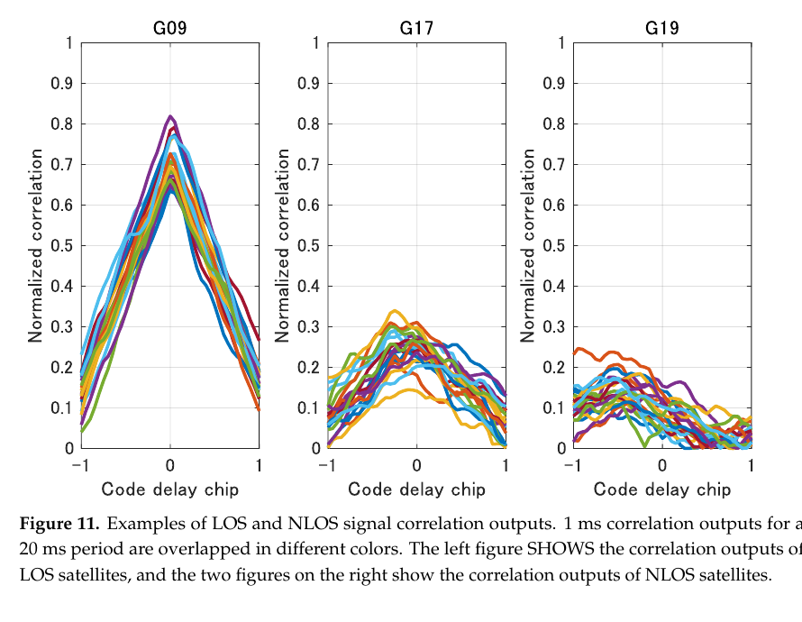
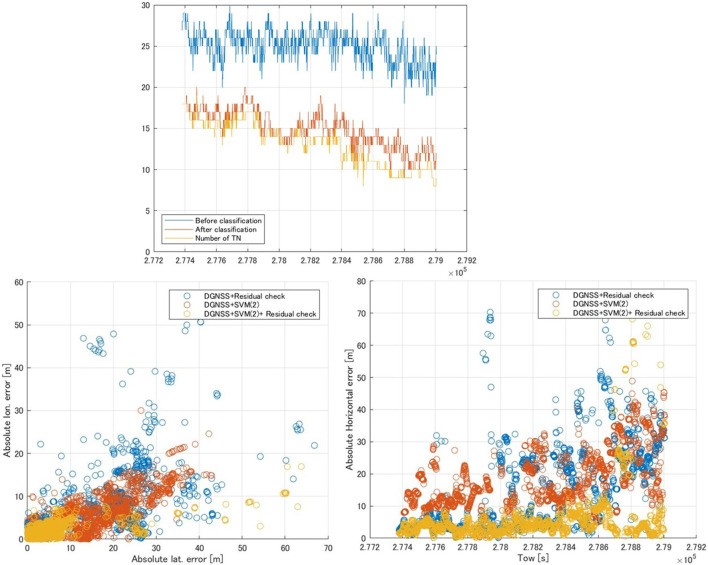
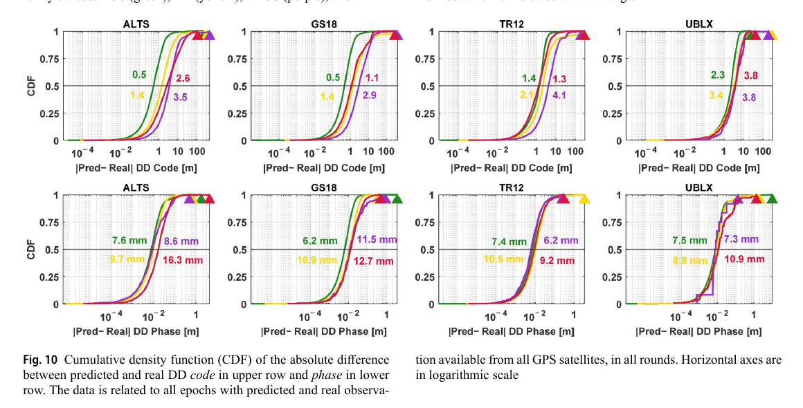

# 2026-10-09 GNSS 每日研究简报

## 今日快报

### 快报 1：图神经网络在已见攻击上检出率 96.4%，换成未见动态等功率欺骗后只剩 58.6%

- 主题：`spoofing-stgnn-cross-scenario-generalization`
- 来源 ID：`ion:gnss2026-17147`
- 来源链接：https://www.ion.org/gnss/abstracts.cfm?paperID=17147
- 发表日期：2026-09-17
- 来源类型：ION GNSS+ 2026 官方扩展摘要、TEXBAT 跨场景实验
- 获取范围：公开扩展摘要全文；动态卫星图、节点/边特征、混合划分与两种跨场景划分、检出率和误警率已核对，未取得正式论文、训练细节或逐数据集混淆矩阵

**内容：** 方法把每颗卫星的跟踪环观测量作为动态图节点，把卫星间归一化观测差作为边，用时空图神经网络同时学习单星时间演化和星间共同变化。评估没有只做随机混合划分，还逐步把攻击类型从训练集移除，以检查对未知欺骗的泛化。

**结论：** 官方摘要报告混合划分下检出率为 96.4%、误警率为 2.26%；训练排除 TEXBAT ds6 与 ds8、仍保留 ds7 时，总检出率降至 58.6%，其中动态等功率欺骗退化明显。数字来自既有公开数据集而非新外场，说明星间关系对同类攻击有用，却不能证明模型可识别全新攻击族。

**关注理由：** 安全模型最容易在随机切分中“见过同一种攻击”。把攻击族整类留出比报告单一准确率更接近上线风险，也提醒工程团队必须把未知攻击拒识和传统物理监测保留下来。

### 快报 2：信号不可预测性加亚毫秒时钟界可把欺骗区域压到几十平方千米，但仍不是精确位置认证

- 主题：`authenticated-geometry-time-spoofing-region`
- 来源 ID：`ion:gnss2026-17064`
- 来源链接：https://www.ion.org/gnss/abstracts.cfm?paperID=17064
- 发表日期：2026-09-17
- 来源类型：ION GNSS+ 2026 官方扩展摘要、Galileo SAS 场景开阔地与动态数据验证
- 获取范围：公开扩展摘要全文；可欺骗区域、真实位置可行区域、认证卫星数量、接收机时钟界与 HDOP 协方差椭圆近似已核对，未取得正式论文、完整场景表或尾部误差统计

**内容：** 框架联合使用认证信号的有界延迟不可预测性和接收机时间不确定度，分别构造攻击者能维持一致伪解的“可欺骗区域”和真实用户仍可能存在的“可行区域”。简化实现用水平 DOP 协方差椭圆近似后者，以降低实时几何计算量。

**结论：** 作者称在认证卫星足够且时间界小于 1 ms 时，两类区域可收缩到几十平方千米，适合启动阶段排除明显不可能的位置。这个尺度仍远大于道路级定位需求；摘要没有给覆盖率、卫星数阈值或恶劣遮挡结果，因此只能证明几何—时间约束能缩小攻击自由度，不能视为位置真实性证明。

**关注理由：** 认证导航电文并不自动认证用户位置。接收机还要把信号不可预测性、自己的钟差上界和实时几何闭合成可审计区域，并明确这个区域能做“排除”而不能做“定点确认”。

### 快报 3：跨域注意力在 1% 误警率下给出 94.59% 单星检出率，但数据集留出方式决定可信度

- 主题：`cross-domain-lightweight-spoofing-attention`
- 来源 ID：`ion:gnss2026-16935`
- 来源链接：https://www.ion.org/gnss/abstracts.cfm?paperID=16935
- 发表日期：2026-09-16
- 来源类型：ION GNSS+ 2026 官方扩展摘要、实测欺骗与多路径数据集实验
- 获取范围：公开扩展摘要全文；相关域、观测域、定位域特征，Bi-LSTM、跨星自注意力、参数量、单样本推理时延与 TPR@1%FPR 已核对，未取得正式论文、硬件型号或跨城市留出账

**内容：** 方案把相关器、原始观测和定位残差对齐为“时间—卫星—特征”张量，先由双向 LSTM 学习单星的突变、恢复和缓慢拖偏，再以跨卫星自注意力分辨单星传播异常与多星共同欺骗。缺测卫星通过掩码处理，输出用于逐星剔除。

**结论：** 摘要报告完整跨域融合在 1% 假阳性率下得到 94.59% 真阳性率，模型有 229,507 个可训练参数，单样本推理时延 0.173 ms，并优于所列 CNN、LSTM、GRU、Transformer 与 ResNet18 基线。公开信息未说明计时硬件、样本独立性及训练/测试攻击族是否隔离，数字应视为作者数据集内结果。

**关注理由：** “轻量”不仅要看参数量，还要看特征生成、缓存窗口和硬件端到端时延；“泛化”则必须用未见地点、接收机和攻击族验证。摘要给出了可复核 KPI，却尚未给完整复现实验账。

### 快报 4：Pulsar 首颗在轨星的时间传递仍处于“将报告结果”，不能把测试计划写成性能证明

- 主题：`xona-pulsar-iov-time-transfer-plan`
- 来源 ID：`ion:gnss2026-17176`
- 来源链接：https://www.ion.org/gnss/abstracts.cfm?paperID=17176
- 发表日期：2026-09-18
- 来源类型：ION GNSS+ 2026 官方扩展摘要、厂商在轨验证与认证仿真测试计划
- 获取范围：公开扩展摘要全文；双频兼容信号、独立 Xona System Time、1PPS 比对链、屋顶/半室内/室内与干扰测试指标已核对，摘要明确写明测试进行中且未给任何最终精度或稳定度数字

**内容：** Xona 计划用 Pulsar 在轨验证星的实时信号和认证仿真器分别测试 1PPS 精度、短期稳定度、冷启动首次脉冲时间、短时中断后的重捕与无信号保持。Pulsar-only 接收机输出对齐 Xona System Time，再与 UTC(k)、校准时间传递链或 GNSS 驯服钟比较。

**结论：** 公开摘要只定义了测量链和待交付指标，并说初始数据“预计在未来几周”获得；没有给误差、稳定度、重捕时间或抗干扰阈值。更高接收功率、快速变化几何和认证/加密带来的收益都是设计动机或待验证主张，当前不能写成已证实性能。

**关注理由：** 这是一份有价值的验收模板：参考时标、链路校准、环境分层和失锁恢复都被列明。研究简报更重要的工作是守住“测试计划”和“测试结果”的边界。

### 快报 5：MEMS 保持称 8 小时误差小于 1.5 μs，但证据包含厂商仿真与客户陈述

- 主题：`mems-oscillator-gnss-holdover-resilience`
- 来源 ID：`ion:gnss2026-16810`
- 来源链接：https://www.ion.org/gnss/abstracts.cfm?paperID=16810
- 发表日期：2026-09-18
- 来源类型：ION GNSS+ 2026 官方扩展摘要、SiTime 厂商模型/仿真/客户陈述
- 获取范围：公开扩展摘要全文；环路带宽机理、MATLAB 仿真范围、保持数字、温度/加速度/冲击/功耗与成本主张已核对，未取得正式论文、器件型号、独立实验或误差置信区间

**内容：** 更稳定的本振可缩窄码环和载波环而不过度牺牲动态响应，使不一致 Doppler、相位瞬变和相关峰畸变更容易显现；失去 GNSS 后则通过老化补偿维持本地时间。论文把抗欺骗跟踪和抗压制保持放在同一时钟误差预算中。

**结论：** 厂商摘要称补偿后的低 SWaP-C MEMS 可保持最长 8 h、累计时间误差小于 1.5 μs，补偿可把保持时长相对未补偿实现加倍；还列出 ±20 ppb 温度频稳、0.004 ppb/g、超过 100,000 g、低于 22 mW 和低于 100 美元。数字缺少器件型号、温度轨迹和独立复验，不能外推到任意安装与威胁场景。

**关注理由：** 本振不会让接收机在压制中继续测距，却会决定检测器的可用环宽、失锁后的时间漂移和重捕搜索窗。器件选型应把稳定度、温变、老化、振动和补偿算法一起测，而不是只比较数据手册的单一 ppb。

## 深度研读

### 深读 1｜跟踪｜从相关峰看见 NLOS：多相关器为什么比单一 C/N0 多一层信息

- 类别：`tracking`
- 学习层级：`foundation`
- 选题定位：`经典基础`
- 来源 ID：`doi:10.3390/s21072503`
- 来源链接：https://doi.org/10.3390/s21072503
- 发表日期：2021-04-03
- 来源类型：Sensors 同行评审开放论文
- 获取范围：CC BY 4.0 开放全文；信号模型、SVM/NN、五地点交叉验证、采样与带宽、Figures 1–15、Tables 1–4 已核对
- 价值评分：96/100（相关性 20，经典价值 19，证据 19，教学价值 20，工程价值 18）

#### 为什么先学这个

城市 NLOS 的根源不是“位置解突然变差”，而是直达分量消失后，接收机锁住了一个或多个反射/绕射分量。只看 C/N0 会把较强反射误当好信号；先回到 DLL 前后的相关器输出，才能理解为什么峰形本身含有传播路径信息。

#### 先修知识

需要理解 PRN 码自相关、码延迟、Early/Prompt/Late 相关器、DLL/PLL、相干与非相干积分、LOS 多路径和纯 NLOS 的区别，以及监督分类中的训练、验证、假阳性和假阴性。分类输出不是测距改正值；错误剔除还会损害卫星几何。

#### 一句话逻辑

直达波存在时主峰通常由 $`A_0`$ 主导；直达波消失后多个幅度相近的反射分量共同塑形，因此多相关器在码延迟轴上的峰值、局部极大值和峰位漂移可以区分 LOS 与 NLOS。

#### 研究问题与约束

论文用 GPS L1 C/A 软件接收机在东京新宿五处高楼环境采集数据；每处每隔约 2 h 采三段 5 min 数据，并以鱼眼相机、双天线移动基线航向和建筑掩膜自动生成 LOS/NLOS 标签。RF 采样率 20 MHz、带宽 4.2 MHz。所有地点仍在同一城市，标签依赖图像分割和姿态闭环，不能代表全球城市、不同天线或现代化信号。

#### 核心方法论

SVM 使用三类人工特征：相对开阔地仰角模型的峰值强度、局部极大值个数、最大峰码延迟的时间分布；NN 则直接输入归一化多相关器输出，让网络自行学习形状。分类器位于相关器和导航解之间，判为 NLOS 时不向导航模块输出该观测。五地点采用四处训练、一处测试的轮换交叉验证，避免同一地点随机拆分造成最明显的数据泄漏。

#### 关键公式逐步推导

直达加单反射的 LOS 多路径可写为：

```math
S_{LOS}(t)=A_0C(t-\tau_0)\cos(\omega_0t)+A_1C(t-\tau_1)\cos(\omega_0t+\Delta\phi_1).
```

纯 NLOS 中第一、第二反射构成主信号：

```math
S_{NLOS}(t)=A_1C(t-\tau_1)\cos(\omega_0t+\Delta\phi_1)
+A_2C(t-\tau_2)\cos(\omega_0t+\Delta\phi_2).
```

令 $`\alpha_{LOS}=A_1/A_0`$、$`\alpha_{NLOS}=A_2/A_1`$。作者的物理假设是通常 $`\alpha_{LOS}<\alpha_{NLOS}`$，故 NLOS 主峰更易被另一反射扭曲。第 $`j`$ 个相关器在历元 $`k`$ 的同相输出为：

```math
I_{j,k}=A_kR(\tau_{e,k}+\delta_j)\cos(\varphi_{e,k}),
```

多相关器向量 $`C_k=\{I_{-J,k},\ldots,I_{J,k}\}`$ 才保留峰形；单一 Prompt 或 C/N0 会丢掉这部分几何信息。

#### 经典价值与创新边界

经典价值是把多路径机理、相关器可观测量和分类器接口连在一起，不依赖外部地图即可在观测形成前门控。创新边界是它做二分类而非估计额外路径时延；训练标签仍依赖相机和已知环境，网络也没有给出校准概率或未知类拒识。删除 NLOS 不保证剩余几何足够。

#### 整体逻辑链

RF 采样；每星捕获与多点相关；DLL/PLL 跟踪；按 20 ms 窗汇集峰形；鱼眼图和移动基线生成标签；构造 SVM 三特征或 NN 输入；四地点训练一地点测试；比较 SNR 门限、SVM、NN；把分类结果作为导航观测门控。

#### 原文图表与结果分析



> 图表源：Suzuki 与 Amano《NLOS Multipath Classification of GNSS Signal Correlation Output Using Machine Learning》Figure 11，[CC BY 4.0 开放全文](https://doi.org/10.3390/s21072503)。从出版 PDF 第 14 页按原始像素裁取原图与图注，未重绘或改动坐标轴、曲线、标签和数值。

横轴是相对码延迟（chip，$`-1`$ 到 $`1`$），纵轴是归一化相关值；每种颜色是一段 1 ms 输出，叠加覆盖 20 ms。左侧 LOS 星 G09 在零延迟附近保持约 0.65–0.82 的单主峰；G17 峰值约 0.15–0.34 且偏离零点，G19 更弱并呈多处局部起伏。图直接支持“峰形含 NLOS 信息”，却不能说明三颗星之外的分类率，也不能把峰值低自动等同于 NLOS。

#### 原文结果论述

五折地点留出中，NN 略优于 SVM；作者报告 NN 正确判别 97.7% 的 NLOS 信号。MATLAB 测试阶段处理 100 个样本的平均时间为 SVM 0.66 ms、NN 1.27 ms。这个计时没有包含 RF、相关计算和特征缓存，也不是嵌入式硬件结果。训练和验证都来自东京，论文明确要求跨城市和车载动态复验。

#### 常见误区与适用边界

第一，把弱 C/N0 当 NLOS 的充分条件。第二，只保留 Prompt 值却声称学习了峰形。第三，把地点内随机划分当跨环境泛化。第四，分类后无条件删星，不检查 DOP 与可观测性。第五，把相机生成标签当无误真值。第六，用 GPS L1 C/A 的模型直接外推 BOC、L5 或不同前端带宽。

#### 工程实现步骤

1. 在现有 DLL 旁路增加对称多相关器，固定延迟格点和归一化方式。
2. 同步记录 C/N0、仰角、码环状态、前端带宽和 AGC，避免域漂移不可追踪。
3. 用可审计的天空掩膜或射线追踪生成标签，并人工抽检边界卫星。
4. 先实现 SNR、SVM 和轻量 NN 三条基线，按地点/日期/硬件整组留出。
5. 输出概率与不确定度，导航端采用降权、剔除和几何保护三档动作。
6. 在线监控分类分布、剩余卫星数、DOP、残差和定位尾部误差。

#### 复现实验设计

使用两种前端带宽（4.2 MHz、10 MHz）、三种天线和 GPS/Galileo 各一频点，在五座城市各采开阔地、单侧街谷、十字路口三类路线；采样 20 MHz，相关器间隔 0.1 chip，20 ms 特征窗。比较 C/N0 门限、SVM、1D-CNN 和不分类。指标含按卫星精确率/召回率、TPR@1%FPR、校准误差、每历元算力、删星后 HDOP、SPP 95%/99% 水平误差。失败用例包括强镜面 NLOS、弱 LOS、短时遮挡和地图标签错误。

#### 与定位及低成本实现的联系

低成本接收机最缺的不是分类网络，而是可访问、跨设备一致的多相关器输出。若芯片只能给 RINEX 级观测，就需要下一节的观测域方法；若能开放相关器，多相关器门控可在伪距生成前阻断严重 NLOS，但仍应与导航残差组成第二道检查。

#### 本节小结

多相关器把传播路径造成的峰形扭曲保留下来，比单一 C/N0 更接近误差源。97.7% 是同城地点留出结果，不是通用保证；工程闭环还要处理概率校准、几何损失和跨硬件域漂移。

### 深读 2｜接收机工程｜拿不到相关器怎么办：RINEX 特征与伪距残差做两道 NLOS 门控

- 类别：`receiver-engineering`
- 学习层级：`intermediate`
- 选题定位：`基础进阶`
- 来源 ID：`doi:10.3389/frobt.2022.868608`
- 来源链接：https://doi.org/10.3389/frobt.2022.868608
- 发表日期：2022-05-05
- 来源类型：Frontiers in Robotics and AI 同行评审开放论文
- 获取范围：CC BY 4.0 开放全文；RINEX 五特征、SVM、静态/动态数据、Tables 1–7 和 Figures 1–8 已核对
- 价值评分：95/100（相关性 20，经典价值 18，证据 19，教学价值 19，工程价值 19）

#### 为什么先学这个

商用模组通常不给完整相关器曲线，却能输出 C/N0、伪距和 Doppler。上一节的信号域思路因此需要降维成观测域特征，并在位置解中再做一次残差检查。本节展示“学习分类 + 物理残差”如何互补，而不是让单一模型承担全部错误检测。

#### 先修知识

需要理解 RINEX 观测、DGNSS 改正、最小二乘伪距残差、Doppler 与伪距率、SVM 的 RBF 核、混淆矩阵、静态与动态时间窗，以及误删 LOS 和漏删 NLOS 对几何与偏差的不同影响。

#### 一句话逻辑

先用 C/N0、仰角、归一化残差、码率—Doppler 一致性和 C/N0 波动把每星分成 LOS/NLOS，再迭代删除最大伪距残差，利用数据驱动和模型驱动的不同失效模式取得更稳的 DGNSS 解。

#### 研究问题与约束

训练和两组静态测试均在东京站附近：u-blox F9P、ANN-MB 天线、1 Hz，参考站约 3 km；训练约 27 min，两个测试集各约 1,620 历元。动态试验 1,811 s、平均速度 3.6 m/s，真值来自 Applanix POS LVX。地点高度集中，静态参考坐标还用同类 GNSS 固定解确认，结果不构成跨城市、跨设备或独立完整性验证。

#### 核心方法论

SVM(1) 使用 C/N0、仰角、归一化伪距残差 NPR 和伪距率一致性 PRC；SVM(2) 再加入滑窗内 C/N0 波动量 SFM。分类为 NLOS 的卫星先被剔除，然后用剩余观测求 DGNSS；若最大残差仍超阈值，就逐星删除最大残差，直到全部通过或卫星数不足。静态用 120 s SFM 窗，动态因环境变化快而退回 SVM(1)。

#### 关键公式逐步推导

每历元把第 $`s`$ 星伪距残差 $`Pr_s`$ 归一化：

```math
NPR_s=\frac{Pr_s-Pr_{min}}{Pr_{max}-Pr_{min}}.
```

伪距率一致性比较相邻伪距差和 Doppler：

```math
PRC_s=\left|\frac{P_s(k)-P_s(k-1)}{\Delta t}+\lambda_sD_s(k)\right|.
```

SFM 可理解为长度 $`N`$ 窗内 C/N0 的样本标准差：

```math
SFM_s(k)=\sqrt{\frac{1}{N-1}\sum_{i=k-N+1}^{k}
\left(C/N_{0,s}(i)-\overline{C/N}_{0,s}\right)^2}.
```

三类量分别捕捉绝对信号强度、观测方程不一致和时间波动；最后的迭代残差删除不是独立于 SVM 的“真值”，而是第二个有几何耦合的检测器。

#### 经典价值与创新边界

经典价值是使用量产接收机可得特征，并明确展示静态时间特征在动态中失效。联合门控的边界是两道检测共享同一批伪距与初始位置，错误并非独立；残差会被坏位置解吸收，NLOS 多时尤其如此。方法输出精度改进，没有保护级或漏检风险上界。

#### 整体逻辑链

收集 F9P 码、Doppler、C/N0；DGNSS 改正；以参考坐标生成训练标签；按训练集网格搜索 RBF-SVM；逐星分类；保留判为 LOS 的卫星；最小二乘求解；迭代最大残差门控；分别统计静态与动态的平均、最大、标准差和 3/10/30 m 可用比例。

#### 原文图表与结果分析



> 图表源：Ozeki 与 Kubo《GNSS NLOS Signal Classification Based on Machine Learning and Pseudorange Residual Check》Figure 5，[CC BY 4.0 开放全文](https://doi.org/10.3389/frobt.2022.868608)。使用 PubMed Central 保存的出版者原始 JPEG，未裁剪、重绘或改动坐标轴、散点、图例和数值。

上图纵轴是卫星数，分类前均值 25，分类后约 14.9，而真实 LOS（TN）约 13.1，说明仍有少量误留或误删。左下横纵轴分别为绝对纬向/经向误差（m），右下是绝对水平误差随 GPS TOW；黄色“ SVM(2)+残差”大多压在 10 m 内，但仍有约 60–70 m 离群点。图证明联合门控改善此静态数据，不能证明最大误差被严格约束。

#### 原文结果论述

静态数据集 2 中，原始 DGNSS 平均水平误差 27.68 m、10 m 内比例 5.78%；联合方案分别为 5.77 m 和 91.63%，但最大误差仍为 68.16 m。数据集 3 中平均误差从 51.43 m 降到 4.93 m，10 m 内比例从 7.59% 升到 92.35%。动态试验联合 SVM(1)+残差后平均误差从 36.52 m 降到 5.22 m、10 m 内从 35.37% 升到 87.53%，最大误差仍有 160.84 m。

#### 常见误区与适用边界

第一，把归一化残差当绝对误差尺度。第二，在动态车载上沿用 120 s SFM。第三，把同一区域不同日期称为跨城市泛化。第四，只报告平均误差，忽略仍然很大的最大误差。第五，连续删星而不设最小几何与停止条件。第六，把 DGNSS 精度改善误写成完整性保证。

#### 工程实现步骤

1. 统一各模组的 C/N0、Doppler 符号、伪距时标和缺测标记。
2. 计算 NPR、PRC；按平台速度自适应选择是否启用 SFM。
3. 用地点和日期整组留出训练 SVM，并校准输出概率。
4. 分类结果先用于连续降权，只有高置信 NLOS 才硬剔除。
5. 解算后做标准化残差门控，同时守住最少卫星数和最大 DOP。
6. 记录每次删星原因、解变化、尾部误差和恢复时间，便于回放审计。

#### 复现实验设计

在三座城市用 F9P 与另一品牌模组各跑 2 h 静态和 20 km 动态路线，1 Hz 与 10 Hz 两种频率；训练按城市整组留出。比较原始 DGNSS、仅残差、仅 SVM、SVM+残差、Huber 加权五条基线。指标含分类 ROC、误删 LOS 数、卫星数、HDOP、水平误差 50/95/99.9% 和最大连续失效时长。失败用例包括多星同向 NLOS、错误差分改正、Doppler 周跳、低速转弯和参考站异常。

#### 与定位及低成本实现的联系

该方案只需量产 GNSS 原始观测，适合不能访问基带相关器的低成本平台。更重要的是它把分类结果放回定位几何中验收：分类精度高不等于位置一定好。下一节再向前一步，不只判断当前观测，而是用 3D 环境模型预测未来路线上的可见性、C/N0 和双差误差。

#### 本节小结

RINEX 特征和伪距残差能形成互补门控，显著改善所测东京数据，但没有消除尾部离群，也没有提供安全界。静态时间特征不能机械搬到动态场景。

### 深读 3｜定位｜从射线到双差误差：3D 地图怎样为城市 NRTK 预演可用观测

- 类别：`positioning`
- 学习层级：`advanced`
- 选题定位：`定位深入`
- 来源 ID：`doi:10.1007/s10291-025-01962-1`
- 来源链接：https://doi.org/10.1007/s10291-025-01962-1
- 发表日期：2025-10-31
- 来源类型：GPS Solutions 同行评审开放论文
- 获取范围：CC BY 4.0 开放全文；四接收机车载试验、12 圈路线、LoD2/树木/绕射模型、码相门限、Figures 1–10、Tables 1–4 已核对
- 价值评分：97/100（相关性 20，经典价值 18，证据 20，教学价值 19，工程价值 20）

#### 为什么先学这个

前两节都是收到信号后再判断；自动驾驶路线规划更想在出发前知道哪段街道会失去载波、哪种几何会让 NRTK 变脆弱。本节把建筑、树木、反射、绕射、天线增益和跟踪门限连到码相双差误差，是从传播模型走向定位可用性预测的关键接口。

#### 先修知识

需要理解射线追踪、LOS/MP/NLOS/BLKD 分类、C/N0、Friis 链路预算、天线方向图、绕射与植被衰减、码和载波跟踪门限、RTK 双差、额外路径长度 EPD、码相多路径以及 CDF。预测观测误差不等于已经跑出 NRTK 固定解。

#### 一句话逻辑

用 LoD2 建筑与树木模型先判传播路径，再预测每星 C/N0、按码相不同门限决定能否跟踪，最后把多路径/额外路径和 C/N0 噪声投影成双差观测，供 NRTK 可用性与完整性仿真使用。

#### 研究问题与约束

四台接收机（Septentrio Altus NR3、Leica GS18 T、Trimble R12i、u-blox ZED-F9P 单元）装在同一车辆；约 1 km、5 min 的 8 字路线跑 12 圈，两组六圈间隔 2 h。SAPOS 当时只给 GPS/GLONASS 改正；GNSS/导航级 IMU 经 TerraPos 得到约 6 mm 水平、11 mm 垂向参考。建筑是 LoD2，树冠从 Google Earth 手工加盒体，树干未建模。

#### 核心方法论

射线追踪把每星每历元分成 LOS、MP、NLOS、BLKD，并另外计算建筑边缘绕射和植被损耗。发射功率、路径损耗、极化和收发天线增益给出 C/N0；码观测用 20 dB-Hz、相位用 35 dB-Hz 门限决定可见性。可见后，以接收机静态数据标定的 C/N0 噪声模型叠加多路径或 NLOS 额外路径偏差，再与参考星和 CORS 组成双差，与实测双差残差比较。

#### 关键公式逐步推导

C/N0 的基本定义为：

```math
C/N_0[\mathrm{dB\!\cdot\!Hz}]=10\log_{10}C-10\log_{10}N_0,
\qquad N_0=kT_E.
```

论文的接收功率账把传播损失写成：

```math
10\log_{10}C=10\log_{10}P_{LOS/MP/NLOS}-L_D-L_F,
```

其中 $`L_D`$、$`L_F`$ 分别为绕射和植被损耗。码噪声按实测标定系数 $`a`$ 建模：

```math
\sigma_{code}^{2}=a^{2}10^{-(C/N_0)/10}.
```

对 NLOS，码偏差近似取额外路径长度 $`\delta`$；对 MP，偏差由相对幅度 $`\alpha=A_{MP}/A_{LOS}`$、$`\delta`$ 和波长共同决定。双差会消去相关轨钟项，却不会消去车辆附近的局部反射偏差。

#### 经典价值与创新边界

经典价值是把“地图能看见卫星吗”扩展成“接收机能形成哪类码相观测、误差大致多大”。创新边界是载波在绕射和植被中的行为仍缺理论闭合，NLOS 相位偏差被忽略，长 EPD 近似会失败；研究尚未运行完整的模糊度固定、保护级或路线规划器。

#### 整体逻辑链

输入路线、星历、LoD2 建筑和树木；射线追踪传播类别；计算反射、绕射和植被衰减；叠加天线方向图得到 C/N0；应用码相门限；按 C/N0 生成噪声；按 EPD 生成 MP/NLOS 偏差；构造预测双差；与四接收机 12 圈实测可见性、C/N0 和双差残差比较；把输出交给未来 NRTK 仿真。

#### 原文图表与结果分析



> 图表源：Karimidoona 与 Schön《Advanced, 3D map aided (3DMA) GNSS simulations for NRTK performance prediction》Figure 10，[CC BY 4.0 开放全文](https://doi.org/10.1007/s10291-025-01962-1)。从出版 PDF 第 11 页裁取原图与图注，未重绘或改动坐标轴、CDF、颜色、三角标记、标签和数值。

上排是码双差预测—实测差的绝对值（m，对数横轴），下排是相位（m）；四列对应 ALTS、GS18、TR12、UBLX，颜色为 LOS 绿、MP 黄、NLOS 紫、BLKD 红。图上中位数显示码的 LOS 为 0.5–2.3 m、NLOS 可到 TR12 的 4.1 m；相位多在 6.2–16.3 mm。长尾三角远超中位数，说明“中位数接近”不能支撑完整性尾界。

#### 原文结果论述

作者报告码相可见性预测多数准确率约 90%–96%；C/N0 预测—实测差在 LOS 最好约 2 dB-Hz、NLOS 最差约 9 dB-Hz。结论段给出的最大类别中位数是码 3.8 m、相位 16.3 mm，而 Figure 10 直接标出 TR12 NLOS 码为 4.1 m；简报保留这处正文/图读数差异，不替作者消解。论文还记录个别码差达 300–400 m，长 EPD 与树模型是主要限制。

#### 常见误区与适用边界

第一，把几何可见等同于接收机可跟踪。第二，码和载波使用同一 C/N0 门限。第三，认为双差会消除本地多路径。第四，只看中位数忽略 300–400 m 长尾。第五，把手工盒状树冠当可迁移植被模型。第六，把预测双差观测写成已验证的 RTK 固定率或完整性。第七，忽略不同天线方向图和接收机内部平滑。

#### 工程实现步骤

1. 校验路线坐标、星历、建筑 LoD 和树木时效，记录地图不确定度。
2. 逐星射线追踪 LOS、反射、绕射、遮挡和植被路径，并保存 EPD。
3. 为每种天线/频点标定增益、极化损失、C/N0 偏差和跟踪门限。
4. 用开阔地静态数据拟合码相噪声，不混入接收机平滑差异。
5. 生成码相可见性和偏差，进入真实 NRTK 模糊度固定器。
6. 按路线输出固定率、错误固定、保护级、连续性和告警限越界地图。

#### 复现实验设计

选择城市街谷、林荫路和郊区各 2 km，四类接收机同车跑 20 圈，间隔覆盖不同几何；3D 模型分别使用无树、盒状树、点云树三档。比较几何-only、C/N0-only、完整传播模型和实测回放。参数固定为码 20 dB-Hz、相位 35 dB-Hz起步，再做 ±5 dB 灵敏度。指标含可见性 F1、C/N0 MAE、双差码相 50/95/99.9%、模糊度正确固定率、错误固定率、首次固定时间和保护级覆盖；失败用例含湿树叶、玻璃幕墙、临时车辆与地图过期。

#### 与定位及低成本实现的联系

低成本 ZED-F9P 与三台高端接收机同车，结果显示模型必须保留接收机特有噪声和平滑。对纯 GNSS RTK，预测的真正价值不是画一张“卫星可见图”，而是提前识别载波不足、偏差长尾和错误固定风险，并为路线选择或速度规划提供可量化输入。

#### 本节小结

3DMA 可以把环境传播一路推到码相双差层，已在四接收机和 12 圈数据上验证多数可见性与中位误差；但长尾、树木和载波传播仍未闭合，论文输出还只是 NRTK 仿真的观测入口，不是最终定位保证。
