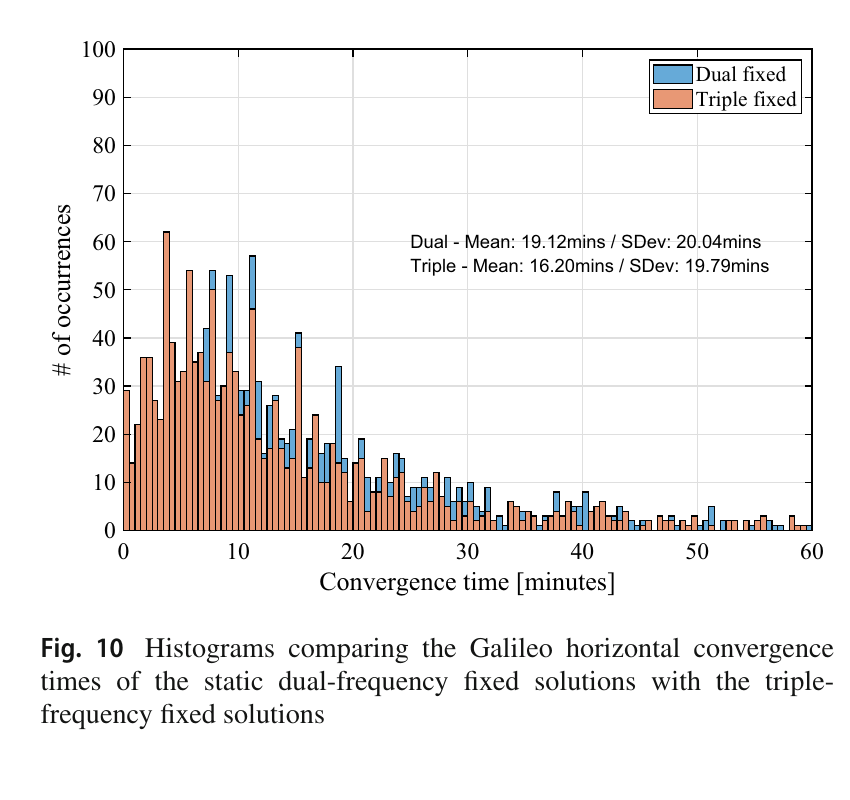
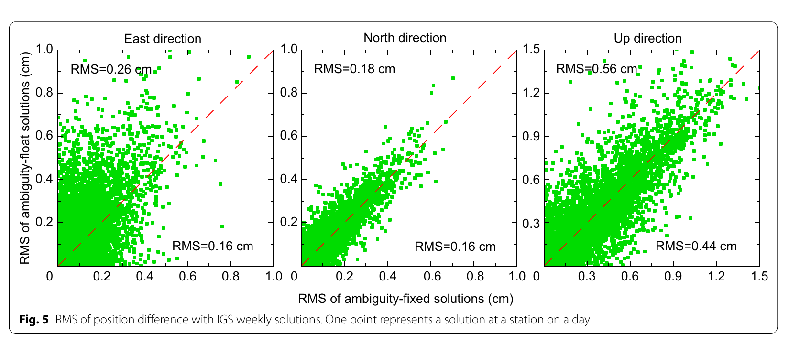
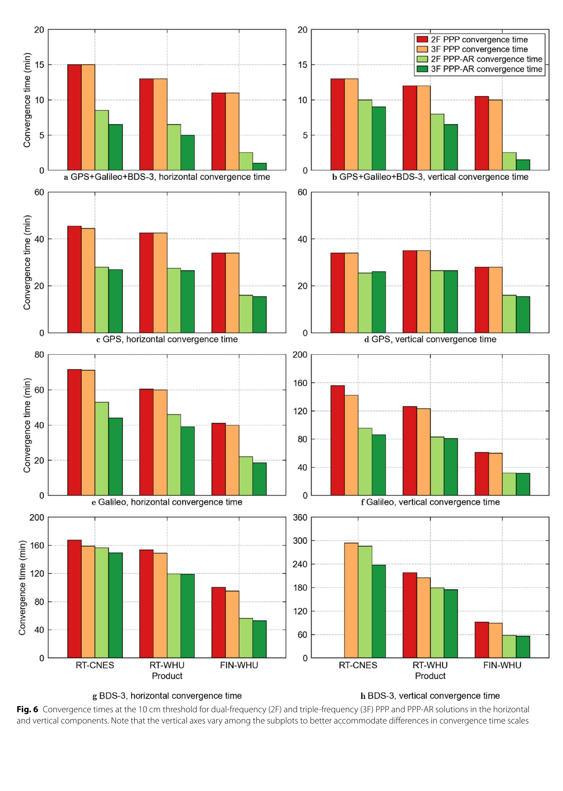

# 2026-10-10 GNSS 每日研究简报

## 今日快报

### 快报 1：MADOCA 多频多系统加电离层约束把平均收敛从 300 s 降到 200 s，但仍是厂商静态测试

- 主题：`madoca-pppar-multifrequency-ionosphere`
- 来源 ID：`ion:gnss2026-16506`
- 来源链接：https://www.ion.org/gnss/abstracts.cfm?paperID=16506
- 发表日期：2026-09-17
- 来源类型：ION GNSS+ 2026 官方扩展摘要、CORE Corporation 接收机测试
- 获取范围：公开扩展摘要全文；多频、多系统、60 s STEC、静态平均收敛时间与后续测试计划已核对，未取得正式论文、样本数、收敛门限或逐场景分布

**内容：** Ten++ 接收机把 MADOCA-PPP 的 GPS、GLONASS、Galileo、BeiDou、QZSS 改正与多频 EWL/WL/NL 逐级定整结合，并用每 60 s 广播的斜向总电子含量约束初始电离层。目标是减少模糊度与电离层状态的相关性，而不是只靠无电离层组合放大约三倍的观测噪声。

**结论：** 厂商摘要称静态试验中集成方案平均收敛约 200 s，传统双频 MADOCA-PPP-AR 约 300 s，改善约 30%。摘要未定义误差门限、连续保持时间、样本量与失败比例，且动态、城市和郊区测试仍在进行；因此数字只支持该接收机配置下的早期静态结果。

**关注理由：** 快收敛不是“多一个频点”单因素收益，而是波长层级、星座几何和电离层先验共同作用。工程验收应分别消融三项，并报告错误固定与重收敛，而不能只给平均首次过门限时间。

### 快报 2：Fast-PPP 在四站二十天数据上常缩短 2–4 倍收敛，但混用不相容产品反而变差

- 主题：`fast-ppp-ssr-product-coherence`
- 来源 ID：`ion:gnss2026-17051`
- 来源链接：https://www.ion.org/gnss/abstracts.cfm?paperID=17051
- 发表日期：2026-09-17
- 来源类型：ION GNSS+ 2026 官方扩展摘要、gAGE/UPC 与 ESA/EC 多产品对比
- 获取范围：公开扩展摘要全文；8 种配置、4 个测站、2026 年 DOY 130–149、PPP/PPP-IAR/Fast-PPP/PPP-RTK 和 95% 分位判据已核对，未取得正式论文、逐站曲线或异常日清单

**内容：** IONO4HAS 处理中心以不同外部轨道产品为输入，同时控制是否替换内部联合估计的钟差与偏差，再比较 PPP、PPP-IAR、带电离层约束的 Fast-PPP 和 PPP-RTK。核心问题是轨道、钟差、码偏差、相位偏差和电离层格网是否来自相容的参数基准。

**结论：** 作者报告 Fast-PPP 相对 PPP 通常快 2–4 倍，个别配置达一个数量级；但把第三方钟差或偏差硬拼进内部产品会明显退化。在 95% 分位、100–300 s 收敛窗内，PPP-IAR 对浮点 PPP、PPP-RTK 对 Fast-PPP 都没有有意义优势。该结果来自四站二十天，不能外推为全球服务保证。

**关注理由：** “每项产品单独更准”不等于组合后更好。SSR 用户端必须做联合基准、时间标签和偏差定义的一致性检查，快速定整也不能替代电离层模型质量。

### 快报 3：公共跨频相位偏差格式节省约 16.6% 传输量，代价是固定率下降约 0.84%

- 主题：`compact-ssr-common-interfrequency-phase-bias`
- 来源 ID：`ion:gnss2026-17199`
- 来源链接：https://www.ion.org/gnss/abstracts.cfm?paperID=17199
- 发表日期：2026-09-18
- 来源类型：ION GNSS+ 2026 官方扩展摘要、QZSS CLAS/GEONET 格式验证
- 获取范围：公开扩展摘要全文；Common-IFPB 表示、GEONET 定位评估、传输量与固定率变化已核对，未取得正式论文、消息周期、网络规模或定位误差分布

**内容：** 现行 Compact SSR 把相位偏差作为网络相关、逐频项传输，而研究把相对 L1 的跨频相位偏差提取成全局公共量，减少各网络重复发送同一卫星频间信息。用户端仍接收网络相关大气和其余局部改正。

**结论：** 官方摘要报告总传输量减少约 16.6%，即约 7,400 bit；模糊度固定率下降约 0.84%，定位精度“几乎相同”。没有公开绝对固定率、比特统计窗口或误差分位数，故不能判断 0.84 个百分点是否集中在弱几何或高电离层时段。

**关注理由：** 改正格式压缩应同时核对带宽、解码状态量、固定率和尾部定位误差。公共参数减少冗余，却也可能把区域性硬件变化错误地当成全局常量。

### 快报 4：轮载惯性周期运动加轻量网络使位置 RMSE 降约 46%，但收益不是纯 GNSS 算法

- 主题：`wheel-mounted-inertial-ai-gnss-update`
- 来源 ID：`ion:gnss2026-16784`
- 来源链接：https://www.ion.org/gnss/abstracts.cfm?paperID=16784
- 发表日期：2026-09-16
- 来源类型：ION GNSS+ 2026 官方扩展摘要、轮载 IMU/GNSS 实车融合
- 获取范围：公开扩展摘要全文；周期轨迹增益、神经位移回归、误差状态 EKF、多轮 IMU 实验与相对 RMSE 已核对，未取得正式论文、路线长度、传感器规格或绝对误差

**内容：** 轮上 IMU 随车轮旋转形成周期信号，研究用轻量网络从惯性序列回归车辆位移，再把结果和 GNSS 位置更新放入误差状态扩展 Kalman 滤波。周期运动提高部分惯性特征的信噪比，试图降低低成本 IMU 漂移。

**结论：** 作者摘要称相对标准轮载惯性/GNSS 融合，位置 RMSE 约降低 46%。未公开绝对 RMSE、失锁时长、训练/测试路线隔离和 GNSS 更新质量，因此不能判断收益来自泛化位移模型、路线记忆还是 GNSS 场景差异。

**关注理由：** 这是 GNSS 间歇可用时的相邻工程方案，不是纯 GNSS 精度提升。复现时应把 GNSS 正常、短断和长断三段分开，并与零速/非完整约束等物理基线比较。

### 快报 5：三接收机共钟一体机宣称垂向精度改善 50%，但没有公开绝对误差与样本账

- 主题：`triple-antenna-common-clock-machine-control`
- 来源 ID：`ion:gnss2026-16827`
- 来源链接：https://www.ion.org/gnss/abstracts.cfm?paperID=16827
- 发表日期：2026-09-17
- 来源类型：ION GNSS+ 2026 官方扩展摘要、Carlson Software 厂商系统验证
- 获取范围：公开扩展摘要全文；双 RTK 引擎一致才报 Fixed+、三接收机共钟、RTK/IMU 定姿与相对垂向改善主张已核对，未取得正式论文、对照设备、路线、固定率或绝对精度

**内容：** VASCO-R 在单盒内放置三套 GNSS 接收通道并共用振荡器，以多基线给出姿态；定位端并行运行两个不同 RTK 引擎，只有二者都固定且一致时才输出 Fixed+。机身 IMU/GNSS 融合还试图替代传统驾驶舱双天线。

**结论：** 厂商摘要称共钟三接收机结构带来 50% 垂向精度改善，并声称实际误差始终受预测不确定度约束；但没有给基线、绝对误差、置信水平、样本量或错误固定次数。“安全关键”和“完整性”在当前材料中仍是系统定位与厂商主张，不是经独立风险验证的结论。

**关注理由：** 共钟和多基线确实能增加差分信息，但“双解一致”仍可能遭遇共同模型、共同改正或共同多路径故障。工程审计要专门注入共因错误，而不只比较正常工况平均精度。

## 深度研读

### 深读 1｜接收机工程｜先把码钟与相位钟拆开：PPP 模糊度为什么才能重新成为整数

- 类别：`receiver-engineering`
- 学习层级：`foundation`
- 选题定位：`经典基础`
- 来源 ID：`doi:10.1007/s00190-021-01510-y`
- 来源链接：https://doi.org/10.1007/s00190-021-01510-y
- 发表日期：2021-05-05
- 来源类型：Journal of Geodesy 同行评审开放论文
- 获取范围：CC BY 4.0 开放全文；解耦钟模型、双频/三频无组合推导、25 站一周 1,400 个三小时数据段、Figures 1–17 与 Tables 1–4 已核对
- 价值评分：96/100（相关性 20，经典价值 20，证据 19，教学价值 20，工程价值 17）

#### 为什么先学这个

PPP 的载波相位很精，却不能直接把滤波器里的“模糊度”四舍五入：卫星和接收机的码、相位硬件偏差已被吸收到钟差与模糊度中。解耦钟模型先解释整数性为何丢失，再说明如何用可传输产品恢复它，是理解 OSB、相位钟和 PPP-AR 的入口。

#### 先修知识

需要理解伪距与载波相位观测、接收机/卫星钟差、电离层频散、对流层映射、整周模糊度、Melbourne–Wübbena 宽巷组合、LAMBDA、秩亏与基准选择，以及收敛时间与最终精度是两个不同指标。

#### 一句话逻辑

把码观测与相位观测的钟参数分开，并把接收机相位基准固定到参考星模糊度，就能把硬件偏差从用户模糊度中搬走，使各频点整数参数可由 LAMBDA 联合固定。

#### 研究问题与约束

论文把经典组合式 DCM 推到无组合双频和三频用户模型，只处理 Galileo E1/E5b/E5a。数据来自 25 个全球 IGS-MGEX 站、2019 年连续 7 天，24 h 文件切成 3 h 数据段，共约 1,400 段；静态和运动学模式都使用测地级站与外部精密产品。它没有覆盖多星座系统间偏差、实时流中断或低成本天线多路径。

#### 核心方法论

原始每频伪距和相位都含几何距离、钟差、电离层、对流层和硬件偏差。模型把接收机码钟 $`dt_r`$ 与相位钟 $`\delta t_r`$ 分开，把卫星端对应偏差交给外部解耦钟产品；再以参考星吸收秩亏，使接收机宽巷、超宽巷偏差成为可估状态，而星间模糊度保持整数。用户先固定 EWL/WL，再固定短波长 NL。

#### 关键公式逐步推导

第 $`i`$ 频点的基本观测写为：

```math
P_{r,i}^{s}=\rho_r^s+c(dt_r-dt^s)+\gamma_i I_1^s+M_r^sT_r+b_{r,i}-b_i^s+\epsilon_{P_i},
```

```math
\Phi_{r,i}^{s}=\rho_r^s+c(\delta t_r-\delta t^s)-\gamma_i I_1^s+M_r^sT_r
+\lambda_i(N_i^s+B_{r,i}-B_i^s)+\epsilon_{\Phi_i}.
```

若强迫 $`dt=\delta t`$，码相硬件偏差会污染 $`N_i^s`$；DCM 让两类钟独立，再通过参考星 $`s_0`$ 形成隐式星间基准：

```math
\widetilde N_i^s=(N_i^s-N_i^{s_0})+\text{已校准的卫星相位偏差},
```

从而使 $`\widetilde N_i^s\in\mathbb Z`$ 可检验。三频增加 EWL 组合，长波长先缩小 NL 搜索空间，但第三频残差也会让模型对频间偏差更敏感。

#### 经典价值与创新边界

经典价值是把“PPP 不能定整”还原成参数基准和硬件偏差问题，并给出从双频到三频的用户端闭合推导。创新边界在于 DCM、FCB/UPD 和整数恢复钟在固定解层面可等价，论文证明的是一种实现，不是唯一正确表示；外部产品、参考星切换和偏差连续性仍决定实际可靠性。

#### 整体逻辑链

原始码相观测；码钟/相位钟解耦；接收机频间偏差入状态；卫星解耦钟与宽巷产品校正；参考星给定模糊度基准；EWL/WL 分级固定；LAMBDA 固定 NL；比较双频/三频的浮点与固定解；按分位数和数据段统计收敛。

#### 原文图表与结果分析



> 图表源：Naciri 与 Bisnath《An uncombined triple-frequency user implementation of the decoupled clock model for PPP-AR》Figure 10，[CC BY 4.0 开放全文](https://doi.org/10.1007/s00190-021-01510-y)。从出版 PDF 第 12 页以 240 dpi 渲染后裁取原图与图注，未重绘或改动坐标、柱形、图例和数值。

横轴是静态固定解水平收敛时间（min），纵轴是出现次数；蓝色双频、橙色三频。图中均值从双频 19.12 min 降至三频 16.20 min，标准差仍分别为 20.04 和 19.79 min，长尾一直延伸到 60 min。正文进一步给出三频在 5 min 内收敛的数据段占 23%，双频为 12%；10 min 内分别 50% 与 36%。图证明分布整体左移，却也直接显示三频没有消除长尾。

#### 原文结果论述

论文摘要按 100% 分位平均曲线报告：双频浮点到固定的水平收敛由 19 min 降到 14 min，三频由 17.5 min 降到 9.5 min；水平 RMS 分别从 2.7 cm 降到 1.1 cm、从 2.6 cm 降到 1.0 cm。Figure 10 的逐数据段固定解均值使用不同统计口径，因此不能把 19.12/16.20 min 与摘要数字直接相减当同一指标。

#### 常见误区与适用边界

第一，把滤波器实数模糊度直接取整。第二，混用不同分析中心的码钟、相位钟和偏差基准。第三，认为第三频一定改善浮点解；论文显示主要收益来自更多可固定组合。第四，只报平均收敛而忽略近 20 min 标准差。第五，把测地站静态结果外推城市车载。第六，参考星切换时不变换全部相关状态与协方差。

#### 工程实现步骤

1. 固定每个信号的频率、波长、码相偏差和时间系统定义。
2. 在状态向量中拆分码钟、相位钟、电离层、对流层与接收机频间偏差。
3. 对外部轨钟/偏差产品做 datum、符号和日界连续性检查。
4. 先固定 EWL/WL，再把约束传给 NL；每级保留比率检验与残差门控。
5. 参考星变化时用整数可逆变换迁移模糊度、偏差和协方差。
6. 输出逐弧固定状态、错误固定代理量、首次持续收敛和重初始化原因。

#### 复现实验设计

取 30 个 MGEX 站连续 14 天，统一 30 s 采样和同一套轨钟产品；比较双频浮点、双频 DCM-AR、三频浮点、三频 DCM-AR。静态与白噪声运动学各做 3 h 重启，门限定义为水平/垂直误差连续 20 个历元低于 10 cm。指标含 50/68.3/95/100% 收敛、RMS、错误固定代理、参考星切换次数和状态不连续。失败用例包括删第三频、注入 0.05 cycle 相位偏差、产品日界跳变和 5 min 改正中断。

#### 与定位及低成本实现的联系

低成本接收机常同时遭遇码噪声大、载波中断和频间偏差不稳，长 EWL 波长有助于缩小搜索，却不会自动抵消这些问题。DCM 最实用的启示是：产品定义和接收机状态必须成对设计；下一节因此从用户滤波器转向服务端相位偏差产品。

#### 本节小结

PPP-AR 的整数性不是载波观测天然消失，而是被钟差和硬件偏差的参数化遮住。解耦码相钟并选择一致基准可以恢复整数，但三频收益主要体现在收敛分布左移，长尾和产品连续性仍需单独验收。

### 深读 2｜接收机工程｜用户能否固定取决于服务端：OSB、相位钟与轨道怎样一起闭合

- 类别：`receiver-engineering`
- 学习层级：`intermediate`
- 选题定位：`基础进阶`
- 来源 ID：`doi:10.1186/s43020-022-00084-0`
- 来源链接：https://doi.org/10.1186/s43020-022-00084-0
- 发表日期：2022-10-17
- 来源类型：Satellite Navigation 同行评审开放论文
- 获取范围：CC BY 4.0 开放全文；WUM 快速轨道/钟差/OSB 生成、2022 年 DOY 047–078/079、多中心比较、PRIDE PPP-AR 验证、Figures 1–6 与 Tables 1–5 已核对
- 价值评分：97/100（相关性 20，经典价值 18，证据 20，教学价值 19，工程价值 20）

#### 为什么先学这个

上一节假定用户能拿到一致的相位钟和偏差产品。本节打开服务端黑箱：先用全球站网解轨道与钟差，再从双差整数构造逐信号 OSB，最后让独立用户用同一套产品定整。这样才能看见“产品精度”与“用户固定率”之间的接口。

#### 先修知识

需要理解 IGS/MGEX、精密定轨、卫星钟差、码/相位 OSB、宽巷与窄巷 UPD、双差和星间单差模糊度、日界不连续、卫星姿态/天线 PCO/PCV、PPP-AR 固定率及参考框架 Helmert 变换。

#### 一句话逻辑

用约 200 个全球站先生成相容轨钟，再把网络整数模糊度映射成逐星逐信号相位 OSB；用户校正 OSB 后固定宽巷和窄巷，以坐标 RMS 和固定率反验产品闭合。

#### 研究问题与约束

研究覆盖 2022 年 DOY 047–078，部分产品归档描述延至 DOY 079；每天约 200 个 IGS 站。WUM 快速产品延迟低于 16 h，但用户验证是日静态 PPP-AR，不是在线实时流。坐标与 IGS 周解比较前做 Helmert 变换，粗差按 3σ 剔除；因此毫米级 RMS 不能直接等同于动态实时用户误差或完整性界。

#### 核心方法论

服务端先以站网估计多系统轨道和钟差，网络双差模糊度用于改善轨道；随后对每个卫星/信号从 Melbourne–Wübbena 宽巷开始估计 OSB，再通过电离层无关窄巷关系得到相位 OSB。GPS、Galileo、BDS 用户端用 PRIDE PPP-AR 2.2 消除对应 OSB，先固定宽巷、再固定窄巷，并与 IGS 周坐标比较。

#### 关键公式逐步推导

以两频 $`i,j`$ 为例，MW 宽巷可概括为：

```math
MW_{ij}^{s}=\lambda_{WL}N_{WL}^{s}+b_{r,WL}-b_{WL}^{s}+\epsilon_{MW},
\qquad \lambda_{WL}=\frac{c}{f_i-f_j}.
```

网络内先以星间/站间差分消除接收机公共项并固定 $`N_{WL}`$，即可反求卫星宽巷偏差。窄巷相位 OSB 再与相位钟联合：

```math
\Phi_{r,i}^{s}-OSB_{\Phi_i}^{s}
=\rho_r^s+c(dt_r-dt_{\Phi}^{s})-\gamma_i I_1^s+M_r^sT_r+\lambda_i\widetilde N_{r,i}^{s}+\epsilon_{\Phi_i}.
```

关键不是某个 OSB 单独最小，而是 $`dt_{\Phi}^{s}`$ 与 $`OSB_{\Phi_i}^{s}`$ 的基准和日界一起保持一致，使 $`\widetilde N`$ 仍接近整数。

#### 经典价值与创新边界

经典价值是给出分析中心从站网原始观测到轨道、钟差、码/相位 OSB，再到用户 PPP-AR 的完整生产链。创新边界是产品之间高度相关；把某中心相位 OSB 和另一中心钟差拼接，单项精度再好也可能破坏整数性。验证主要是日静态测地站，且不同中心产品没有完全相同策略。

#### 整体逻辑链

全球站观测与元数据；精密定轨/钟差网络解；网络双差定整；宽巷 UPD 与窄巷相位 OSB；日界与卫星异常质控；发布快速轨钟/偏差；约 200 站 PRIDE PPP-AR；统计坐标 RMS、宽巷/窄巷固定率；再以轨道边界不连续检验定整策略。

#### 原文图表与结果分析



> 图表源：Geng 等《Observable-specific phase biases of Wuhan multi-GNSS experiment analysis center’s rapid satellite products》Figure 5，[CC BY 4.0 开放全文](https://doi.org/10.1186/s43020-022-00084-0)。从出版 PDF 第 12 页以 240 dpi 渲染后裁取原图与图注，未重绘或改动坐标、散点、虚线和数值。

三幅散点的横轴是固定解相对 IGS 周解的 RMS（cm），纵轴是浮点解 RMS（cm），每点代表一个测站一天；红虚线是二者相等。固定解均值为东 0.16 cm、北 0.16 cm、上 0.44 cm，浮点为 0.26、0.18、0.56 cm。东向多数点落在虚线上方，改善最清楚；北向两者接近，说明日静态长弧下定整对已收敛北向精度增益有限。图不能说明首次收敛或实时连续性。

#### 原文结果论述

多数卫星相位 OSB 峰峰值在 2 ns 内，码 OSB 多在 0.5 ns 内；个别 Galileo/BDS 卫星受偏心轨道、姿态切换或剔除重初始化影响。宽巷固定率为 GPS 92.71%、Galileo 95.54%、BDS-2 92.92%、BDS-3 92.26%；窄巷分别 90.16%、93.55%、85.67%、82.40%。论文还报告星间单差定整相对双差定整使 GPS、Galileo、BDS-3 轨道内部一致性改善 14%、17%、24%，但这是所用模型和数据期内结果。

#### 常见误区与适用边界

第一，只校正相位 OSB 却忽略配套相位钟。第二，把 ns 级偏差稳定度直接当 cm 级位置误差。第三，忽略日界钟差跳变会同步进入窄巷 OSB。第四，把日静态 RMS 当实时收敛。第五，不报告 3σ 粗差剔除和 Helmert 对齐。第六，认为宽巷固定率高就保证窄巷正确。第七，混用不同姿态、PCO/PCV 和太阳辐射压模型的产品。

#### 工程实现步骤

1. 固定卫星/接收机天线、姿态、潮汐、相对论和时间系统模型。
2. 网络解中保存轨道、钟差、模糊度及其 datum 元数据，不只保存最终文件。
3. 逐星监控宽巷/窄巷残差、固定率、OSB 峰峰值和日界跳变。
4. 用独立站同时验证轨钟一致性、OSB 整数残差和 PPP-AR 坐标。
5. 产品切换时执行共同时段差分与状态平移，禁止静默拼接。
6. 发布延迟、缺测、重初始化与异常卫星清单，让用户端可降级。

#### 复现实验设计

用 150 个网络站生成 14 天轨钟/OSB，另留 50 站独立验证；比较同中心完整产品、跨中心混搭、移除日界对齐和不做星间单差定整四组。用户端每 6 h 重启，30 s 采样。指标含轨道 1D RMS、钟差星间差 STD、EWL/WL/NL 整数残差、正确固定代理、10 cm 收敛 68.3/95% 分位、最终一小时 RMS 和产品切换跳变。失败用例含卫星姿态切换、参考星丢失、1 h 产品缺测和 0.1 ns 钟跳。

#### 与定位及低成本实现的联系

低成本用户无法自行从全球站网重建相位偏差，只能信任服务产品。其防线是检查产品 age、IOD、信号映射、datum 和残差，并在不一致时退回浮点解。下一节进一步问：即使产品格式闭合，归档实时流与最终产品的质量差还会怎样传到全球 PPP-AR 收敛。

#### 本节小结

PPP-AR 是服务端和用户端共同完成的整数问题。OSB、相位钟、轨道与姿态模型必须成套闭合；日静态毫米级结果证明了产品可用性，却没有验证在线流中断、切换和重收敛。

### 深读 3｜定位｜多系统能遮住多少产品误差：实时与事后 PPP-AR 的公平同框比较

- 类别：`positioning`
- 学习层级：`advanced`
- 选题定位：`定位深入`
- 来源 ID：`doi:10.1186/s43020-026-00222-y`
- 来源链接：https://doi.org/10.1186/s43020-026-00222-y
- 发表日期：2026-10-07
- 来源类型：Satellite Navigation 同行评审开放论文
- 获取范围：CC BY 4.0 开放全文；31 天 249 个 MGEX 站、RT-CNES/RT-WHU/FIN-WHU、199 站用户 PPP-AR、约 24,676 条六小时弧/配置、Figures 1–13 与 Tables 1–11 已核对
- 价值评分：99/100（相关性 20，经典价值 19，证据 20，教学价值 20，工程价值 20）

#### 为什么先学这个

前两节分别解决用户参数化和产品生成，但工程决策还需要知道：实时产品相对最终产品的轨钟质量差，究竟会在什么星座、频点和精度门限下变成收敛损失。本节在同一滤波器、同一站网和同一统计口径下做控制比较，避免跨论文数字硬拼。

#### 先修知识

需要理解实时 SSR 与最终轨钟产品、UPD/OSB、EWL/WL/NL 逐级定整、多系统几何、双频/三频 PPP 与 PPP-AR、集合分位误差曲线、逐弧持续收敛、RMS 超限率，以及“归档实时产品离线回放”与真实在线服务的区别。

#### 一句话逻辑

固定用户模型和数据，只替换 RT-CNES、RT-WHU、FIN-WHU 产品，按单/双/三星座和双/三频重启数万条弧；由窄巷残差、10 cm 收敛及 5/10/20 cm 灵敏度追踪产品质量怎样传播到定位。

#### 研究问题与约束

31 天数据含 249 个全球 MGEX 站，其中 199 站用于用户定位；每 6 h 重启，单配置约 24,676 条弧，采样 30 s。实时流是归档改正离线处理，并假设连续可用，因此排除了传输延迟、漏改正、更新不连续、状态不确定度增长、失去模糊度连续性和实际重收敛。主指标是所有弧同历时 pooled 后的 68.3% 分位首次过门限，不表示每条弧都持续满足。

#### 核心方法论

三套产品先在轨道、钟差和 EWL/WL/NL 小数周残差层比较，再用完全相同的无组合 PPP/PPP-AR 用户模型处理 GPS、Galileo、BDS-3 单系统及其组合。双频/三频、浮点/固定分别统计水平和垂直误差。主结果用 10 cm 的 68.3% 集合曲线，补充 90% 分位、5/20 cm 门限、最终一小时逐弧 RMS 超限率、卫星数分箱和 BDS-3 IGSO 消融。

#### 关键公式逐步推导

产品校正后的相位仍可写为：

```math
\Phi_{r,i}^{s,c}=\rho_r^s+c\,dt_r-\gamma_i I_1^s+M_r^sT_r
+\lambda_i\left(N_{r,i}^{s}-b_i^{s,\mathrm{prod}}\right)+\epsilon_{\Phi_i}.
```

产品轨钟误差和相位偏差误差共同进入浮点模糊度。令校正后的星间小数周残差为：

```math
r_N=\widehat N-\operatorname{round}(\widehat N).
```

$`r_N`$ 越分散，NL 越难通过同一 ratio 门限。论文主收敛量不是逐弧平均，而是：

```math
t_c=\inf\left\{t:Q_{0.683}\bigl(|e_1(t)|,\ldots,|e_M(t)|\bigr)<\tau\right\},
```

其中 $`\tau=10\ \mathrm{cm}`$，$`M`$ 为同一历时仍有效的全部弧。它描述集合典型水平，不等价于单用户持续收敛保证。

#### 经典价值与创新边界

经典价值是把产品误差、整数残差和用户收敛放进同一受控链条，并明确比较 68.3% 与 90% 统计。创新边界是“实时”只指产品类型，不含在线传输；不同中心产品仍含不同估计策略，不能把差异归因于单一轨道或钟差项。新论文结果也需跨季节和高率在线流复验。

#### 整体逻辑链

获取三套轨钟/偏差；同参考下比较轨道和钟差；为每套产品独立估计 UPD；计算 EWL/WL/NL 小数周残差；199 站每 6 h 重启；跑单/多系统、双/三频、PPP/PPP-AR；形成 68.3/90% 集合误差；变更 5/10/20 cm 门限；按卫星数与 IGSO 消融解释地区差异；列出归档流边界。

#### 原文图表与结果分析



> 图表源：Du 等《Performance gap between archived real-time and post-processed precise products for multi-GNSS and multi-frequency PPP-AR》Figure 6，[CC BY 4.0 开放全文](https://doi.org/10.1186/s43020-026-00222-y)。从出版 PDF 第 13 页以 240 dpi 渲染后裁取完整原图与图注，未重绘或改动坐标轴、柱形、图例、标签和数值。

横轴是 RT-CNES、RT-WHU、FIN-WHU，纵轴是 10 cm 门限的集合收敛时间（min）；红/橙为双/三频浮点，浅/深绿为双/三频 PPP-AR。最上方 GPS+Galileo+BDS-3 的量程仅 20 min，而单系统 Galileo/BDS-3 垂向量程到 200/360 min，不能跨子图按柱高直接比较。多系统三频 PPP-AR 垂向约从 RT-WHU 6.5 min 降到 FIN-WHU 1.5 min；GPS 单系统对应约 26.5 与 15.5 min。图直接显示几何冗余能缓冲产品差，却不能证明在线改正不断流。

#### 原文结果论述

在 10 cm、68.3% 分位下，多系统组合显著降低产品敏感度；但门限收紧后差距扩大。GPS-only 垂向 PPP-AR 在 20 cm 时 RT-WHU/FIN-WHU 约 13.0/10.5 min，在 5 cm 时增至 71.0/24.0 min。论文还发现实时产品的 NL 残差分布更宽，而 EWL/WL 差异较小；这解释了为何产品质量首先打击短波长固定。所有数字都建立在连续改正和 30 s 采样上。

#### 常见误区与适用边界

第一，把归档实时流称为真实在线可用性测试。第二，把 68.3% 集合首次过门限理解成每条弧持续收敛。第三，跨子图忽略不同纵轴。第四，把多系统的缓冲作用写成产品质量不再重要；5 cm 门限会放大差距。第五，只比较 EWL/WL 而忽略 NL。第六，把同中心实时/最终差完全归因于钟差，忽略轨道、偏差和估计策略联动。第七，不报告更新中断后的重新定整。

#### 工程实现步骤

1. 建立每套 SSR 的 orbit/clock/bias/IOD/age 联合日志和统一信号映射。
2. 在定位前持续计算星间 EWL/WL/NL 小数周残差与可固定数。
3. 单系统与多系统分别维护质量门限，避免冗余掩盖单系统异常。
4. 同时输出 68.3/95/99% 误差、逐弧持续收敛和最终窗口超限率。
5. 产品缺测或切换时冻结/重置对应模糊度，并记录恢复到正确固定的时间。
6. 以 5/10/20 cm 多门限验收，防止只针对一个指标调参。

#### 复现实验设计

选 200 个全球站连续 90 天，10 s 与 30 s 两档；同时录制真实在线 RT-CNES/RT-WHU 并保留归档流，最终产品作参考。每 6 h 重启，比较 GPS、Galileo、BDS-3 和三系统的双/三频 PPP/PPP-AR。基线为同中心归档连续流、真实在线流、人工注入 30/120 s 缺测和产品切换。指标含 NL 残差 CDF、正确固定代理、逐弧连续 20 历元的 5/10/20 cm 收敛、50/68.3/90/95% 分位、最终一小时 RMS 超限、重收敛时间和地区分层。失败用例包括高电离层、低卫星数、BDS IGSO 缺失、IOD 回退和钟差跳变。

#### 与定位及低成本实现的联系

纯 GNSS 用户无法靠 IMU 掩盖产品错误；多系统多频只能用冗余降低敏感度。低成本设备还会叠加天线多路径、频间偏差和数据断续，因此必须把产品质量指标暴露给固定器，并在 NL 残差恶化时退回浮点或较松门限，而不是维持一个不可审计的 fixed 标签。

#### 本节小结

多系统几何可显著缓冲实时产品的轨钟/偏差误差，但严格精度门限会重新放大质量差。本文给出公平同框的产品上限测试，不是在线服务 SLA；真正部署还要把延迟、缺测、切换和逐用户持续收敛纳入同一实验。
