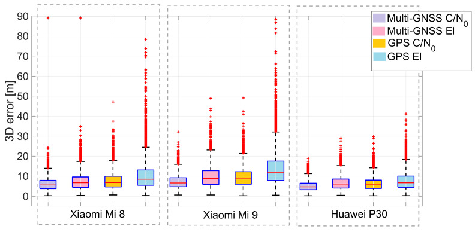
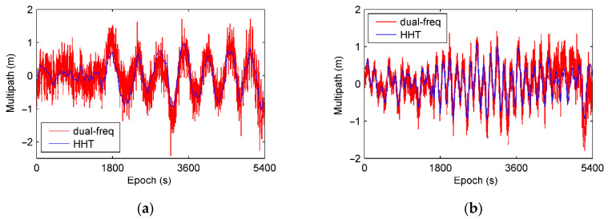
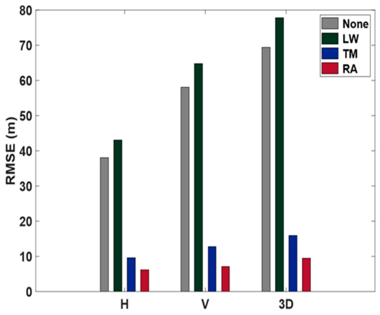

# 2026-10-11 GNSS 每日研究简报

## 今日快报

### 快报 1：纯 GNSS Supercorrelation 在伦敦深城市峡谷给出 7.36 m 的 95% 水平误差，但对照仍由厂商掌控

- 主题：`supercorrelation-deep-urban-gnss-only`
- 来源 ID：`doi:10.33012/2026.20696`
- 来源链接：https://doi.org/10.33012/2026.20696
- 发表日期：2026-09
- 来源类型：ION GNSS+ 2026 同行评审会议论文、Focal Point Positioning 厂商实车试验
- 获取范围：官方论文摘要全文；伦敦实车、四台商用接收机、纯 GNSS 与 GNSS/INS 配置及水平误差分位数已核对，未取得付费论文中的路线长度、真值系统、逐设备配置和可复现实验数据

**内容：** Precise+ 把 Supercorrelation 多路径抑制扩展到伪距、伪距率和累积增量距离，并在自研软件定义接收机内从中频样本生成多系统多频观测。当前纯 GNSS 定位引擎只使用伪距与伪距率，不使用载波相位或惯性；另设 INS 辅助配置。

**结论：** 厂商论文摘要称，纯 GNSS 配置在伦敦深城市峡谷的水平误差 95% 分位为 7.36 m，四台商用接收机均超过 12 m；加入惯性后 95% 分位为 2.01 m、99% 分位低于 3 m。摘要没有公开真值不确定度、四台设备的统一天线/改正条件或重复路线，因此结果支持该次对照中的排序，不支持普遍优于所有接收机。

**关注理由：** 这是把信号域多路径处理闭环到纯 GNSS 位置域的近期实例。工程复验必须把前端、观测生成、位置引擎和惯性增益拆开，否则“软件更新”收益无法归因。

### 快报 2：先判场景再调 LOS/MP/NLOS 比例把水平 RMSE 降约 65%，但标签和路线外泛化仍待公开

- 主题：`scene-adaptive-signal-classification-wls`
- 来源 ID：`ion:gnss2026-16848`
- 来源链接：https://www.ion.org/gnss/abstracts.cfm?paperID=16848
- 发表日期：2026-09-18
- 来源类型：ION GNSS+ 2026 官方扩展摘要、Google 加州动态数据实验
- 获取范围：官方扩展摘要全文；场景分类、信号质量排序、两种方案与水平 RMSE 相对改善已核对，未取得正式论文、训练/测试路线划分、绝对误差和分类混淆矩阵

**内容：** 方法不再使用一套固定阈值直接判 LOS、受多路径影响的 LOS 和 NLOS，而是先给观测环境分场景，再按场景调整三类信号的目标比例，最后以加权最小二乘求位置。这样试图缓解同一分类器在开放、轻遮挡和深城市环境之间失配。

**结论：** 官方摘要报告两种场景标注方案相对基线的水平 RMSE 分别改善 65.45% 和 65.39%。摘要没有给绝对 RMSE、独立城市测试、设备留出或标签误差，因此不能把相对改善解释为跨设备、跨城市的稳定增益。

**关注理由：** 城市 SPP 的关键不是只把分类准确率做高，而是让场景判断改变位置域的权重。验收应同时报告分类、可解历元比例和尾部位置误差。

### 快报 3：STFT 同时看伪距残差与多普勒可区分 LOS/MP/NLOS，但“显著改善”尚无公开数值

- 主题：`stft-neural-los-multipath-nlos-classification`
- 来源 ID：`ion:gnss2026-16981`
- 来源链接：https://www.ion.org/gnss/abstracts.cfm?paperID=16981&sessionID=2078
- 发表日期：2026-09-17
- 来源类型：ION GNSS+ 2026 官方扩展摘要、首尔真实城市峡谷实验
- 获取范围：公开扩展摘要全文；复数 STFT 特征、三分类、3D 建筑模型训练标签和首尔实测已核对，未取得正式论文、窗长/步长、样本数、分类指标或定位误差表

**内容：** 研究分别对伪距残差和多普勒做短时傅里叶变换，让神经网络同时利用频谱幅度与相位；3D 建筑模型只在训练阶段产生 LOS/NLOS 标签，推理阶段不依赖地图。输出把“直达信号受多路径污染”和“完全无直达路径”分开，再剔除或降权最严重观测。

**结论：** 作者称首尔真实城市峡谷试验显著降低定位误差，并强调固定时间窗适合实时处理；但摘要未给准确率、误警率、绝对位置误差、计算时延或跨城市留出。因此目前只能确认方法与试验范围，不能量化收益。

**关注理由：** 伪距残差与多普勒对多路径的响应不同，复数时频特征可能比单一 C/N₀ 更有辨识力；不过缺少数字时，工程团队应把它当候选特征管线而不是成熟基线。

### 快报 4：所有卫星同时降 C/N₀ 才告警可压低局部掉星误报，代价是轻微降低干扰灵敏度

- 主题：`cors-intersection-union-jamming-detection`
- 来源 ID：`doi:10.33012/2026.20695`
- 来源链接：https://doi.org/10.33012/2026.20695
- 发表日期：2026-09
- 来源类型：ION GNSS+ 2026 同行评审会议论文、NOAA CORS 网络监测
- 获取范围：官方论文摘要全文；IUT/WAT 判决逻辑、二维检测空间和 NOAA CORS 实际事件验证已核对，未取得付费论文中的站数、阈值、误警计数和检出概率曲线

**内容：** 旧的加权平均检验会被少数卫星的大幅 C/N₀ 下降拖过阈值。交并检验把假设改成“所有可见卫星的 C/N₀ 同时下降”才触发告警，以匹配宽带公共干扰的共模特征。

**结论：** 论文摘要称 IUT 大幅减少 WAT 因部分卫星 C/N₀ 下降产生的误报，同时仍检出真实共模干扰事件，但对小幅 C/N₀ 下降的灵敏度略降。没有公开误警率、检测率和站点分布，不能据此设定生产阈值。

**关注理由：** 这是检测假设与物理故障模式对齐的例子。若攻击、遮挡或接收机 AGC 变化不是共模，严格交并规则也可能漏检，适合与局部异常检测器并行而非完全替换。

### 快报 5：保留 TEC 空间结构把 IGSG 一日预报 RMSE 从低分辨率 3.81 降到高分辨率 3.47 TECU

- 主题：`ed-convgru-global-tec-forecast`
- 来源 ID：`ion:gnss2026-16920`
- 来源链接：https://www.ion.org/gnss/abstracts.cfm?paperID=16920
- 发表日期：2026-09-17
- 来源类型：ION GNSS+ 2026 官方扩展摘要、多源全球电离层图回放实验
- 获取范围：公开扩展摘要全文；IGSG/UPCG/JPLG/BHRG、一日输入预测后一日、四种基线及 IGSG 指标已核对，未取得正式论文、训练年份、网格间距和不确定度校准结果

**内容：** 编码器—解码器 ConvGRU 同时建模全球 TEC 图的空间相关与时间依赖，使用前一日历史 TEC 预测后一日全球分布；与单变量 MLP、SOFTS 和 iTransformer 在低、高空间分辨率下比较。

**结论：** IGSG 数据上，低分辨率 MAE/RMSE 为 2.55/3.81 TECU，高分辨率为 2.31/3.47 TECU；作者还称 2015 年两次强磁暴及低纬区保持优势。摘要没有给独立年份、极值偏差或定位域验证，故不能直接换算为用户伪距误差改善。

**关注理由：** 空间分辨率不是越高越好，只有模型保留空间结构时才可能兑现收益。定位端还需把 TEC 预测误差映射到频率、穿刺点和斜向电离层延迟后再验收。

## 深度研读

### 深读 1｜低成本与手机｜先承认手机天线不按仰角行事：C/N₀ 定权为什么比几何定权更贴近码噪声

- 类别：`low-cost-mobile`
- 学习层级：`foundation`
- 选题定位：`观测与随机模型基础`
- 来源 ID：`doi:10.3390/s21062125`
- 来源链接：https://doi.org/10.3390/s21062125
- 发表日期：2021-03-18
- 来源类型：Sensors 同行评审开放论文
- 获取范围：CC BY 4.0 开放全文；三款手机、5 h 静态数据、时间双差码噪声、仰角/C/N₀ 定权、Figures 1–16 与 Tables 1–4 已核对
- 价值评分：95/100（相关性 20，经典价值 18，证据 19，教学价值 20，工程价值 18）

#### 为什么先学这个

城市 SPP 的算法常从“低仰角观测更差”出发，但手机线极化天线、机身遮挡和方向性增益会破坏测地天线近似的仰角对称性。先看实测码噪声究竟跟仰角还是 C/N₀ 更相关，才能理解后两节为什么要引入时频特征与伪距动态量。

#### 先修知识

需要理解伪距、载噪密度比 C/N₀、卫星仰角与方位角、多系统时间偏差、加权最小二乘、广播/精密轨钟与码偏差、时间双差、RMS/STD、L1/E1/B1/G1 和 L5/E5a 信号。

#### 一句话逻辑

同一地点同一时段比较三款双频手机，先用时间双差估计各信号的码噪声，再把仰角定权和 C/N₀ 定权放进同一 SPP；若 C/N₀ 权重的误差云更窄，就说明手机随机模型应优先听接收机实际信号强度。

#### 研究问题与约束

数据由 Xiaomi Mi 8、Xiaomi Mi 9 和 Huawei P30 Pro 于 2019-12-11 静态采集 5 h，手机相距约 20 cm，采样 5 s、截止仰角 10°。位置解使用武汉大学精密轨钟与 CODE 码偏差，不是只用广播星历的普通消费级实时 SPP；单日、单地点、无手持姿态变化，也没有跨设备训练/测试问题。

#### 核心方法论

研究先对绝对码观测做时间双差，压低几何、钟差、大气和慢变多路径，按误差传播归一回未差分码噪声。随后建立 GPS 时间为基准的多系统 SPP，把 GLONASS、Galileo、BDS 相对 GPS 的系统间接收机钟差作为附加未知数；相同观测模型分别使用仰角相关权重与 C/N₀ 相关权重。

#### 关键公式逐步推导

把各星座校正后的伪距残差堆叠成 $`\mathbf y`$，位置增量、接收机钟差和系统间偏差组成 $`\mathbf x`$：

```math
\mathbf y=\mathbf A\mathbf x+\boldsymbol\varepsilon,
\qquad
\widehat{\mathbf x}=(\mathbf A^{T}\mathbf W\mathbf A)^{-1}\mathbf A^{T}\mathbf W\mathbf y.
```

权阵为观测方差的逆：

```math
\mathbf W=\operatorname{diag}(\sigma_1^{-2},\ldots,\sigma_m^{-2}).
```

仰角方案让 $`\sigma_i`$ 主要随 $`\sin e_i`$ 变化；C/N₀ 方案用接收机报告的信号强度映射方差。论文的关键不是宣布一条通用 C/N₀ 曲线，而是用时间双差残差证明：三款手机的码噪声对仰角依赖弱、对 C/N₀ 依赖更清楚。

#### 经典价值与创新边界

价值在于把“手机观测很吵”分解到设备、星座和频点，并用位置域验证随机模型。边界是 C/N₀ 既受传播环境也受天线、AGC 和固件影响，不能跨机型直接复用同一参数；使用精密产品也把星历误差从比较中压低了。

#### 整体逻辑链

同址三机采集；比较各频点可见星数；时间双差估计码噪声；检查噪声对仰角与 C/N₀ 的依赖；建立多系统 SPP 与系统间偏差；只替换权重模型；比较 GPS/多 GNSS 的误差分布、均值、STD 和 RMS；再单独比较 Galileo E1/E5a。

#### 原文图表与结果分析



> 图表源：Robustelli、Paziewski 与 Pugliano《Observation Quality Assessment and Performance of GNSS Standalone Positioning with Code Pseudoranges of Dual-Frequency Android Smartphones》Figure 11，[CC BY 4.0 开放全文](https://doi.org/10.3390/s21062125)。直接保存 PMC 发布的原始 JPEG，未裁剪、重绘或改动坐标、箱体、图例和数值。

纵轴是三维位置误差（m），三组面板依次为 Xiaomi Mi 8、Mi 9、Huawei P30；每款设备比较多 GNSS/C/N₀、多 GNSS/仰角、GPS/C/N₀、GPS/仰角。C/N₀ 箱体整体更低更窄，尤其 Mi 9 的仰角定权长尾明显；图为便于显示把纵轴截到 90 m，红叉仍显示大量离群点，因此不能从图上读出完整最大误差。

#### 原文结果论述

Table 4 显示，多 GNSS 水平/垂直/三维 RMS 在 Mi 8 上由 4.76/7.42/8.81 m 降到 4.14/5.73/7.07 m，在 Mi 9 上由 6.60/9.30/11.41 m 降到 4.90/6.38/8.05 m，在 P30 上由 4.39/6.30/7.68 m 降到 3.24/4.73/5.73 m。时间双差码噪声也显示 L5/E5a 普遍低于 L1/E1，但可用二频星数限制了统一双频比较。

#### 常见误区与适用边界

第一，把 C/N₀ 当成无偏的多路径真值。第二，把一款手机拟合的曲线直接套到另一款。第三，只看箱体而忽略 90 m 显示截断和离群点。第四，把精密轨钟条件下的结果当作广播星历实时性能。第五，认为多星座必然改善；新增系统间偏差和低质量观测也会消耗冗余。第六，把静态朝向结论外推到手持旋转。

#### 工程实现步骤

1. 按设备、星座、频点记录 C/N₀、仰角、方位角和码残差。
2. 用已知点或高质量真值构造时间双差噪声代理，并排查周跳和时钟突变。
3. 分箱估计 $`\operatorname{Var}(P\mid C/N_0)`$，同时保留仰角作为大气与几何下限。
4. 在同一 SPP 中只替换权阵，保证星历、改正、截止角和剔星规则一致。
5. 输出按设备和场景分组的 50/95/99% 误差、可解率与标准化残差。
6. 对权重设置方差下限和上限，避免单个异常 C/N₀ 获得极端权值。

#### 复现实验设计

选 6 款手机、开放天空与两条城市路线，各做静态 2 h 和手持动态 30 min，1 s 采样；以测地接收机 RTK/INS 为真值。比较等权、$`1/\sin^2 e`$、设备内 C/N₀ 标定和跨设备共享 C/N₀ 四种模型。指标含码残差方差拟合误差、水平/垂直 50/95/99% 误差、可解率、标准化残差方差和计算时延。失败用例包括手机旋转、SIM/蜂窝开启、热机升温、弱信号饱和与 C/N₀ 突跳。

#### 与定位及低成本实现的联系

C/N₀ 已由消费级芯片输出，不需要相关器级接口，适合做低成本 SPP 的第一层定权。不过它只给瞬时信号质量线索，不能稳定地区分弱 LOS 与强反射；下一节转而从伪距时间序列的频谱结构提取多路径。

#### 本节小结

手机天线和机身让码噪声不再只服从仰角。C/N₀ 定权在三款手机的同址 SPP 中都缩小误差，但它是设备相关的随机模型入口，不是多路径标签。

### 深读 2｜接收机工程｜让频带从数据里长出来：EMD 与 HHT 怎样把码多路径从电离层和噪声中拆开

- 类别：`receiver-engineering`
- 学习层级：`intermediate`
- 选题定位：`从经验权重到自适应分解`
- 来源 ID：`doi:10.3390/s21010188`
- 来源链接：https://doi.org/10.3390/s21010188
- 发表日期：2020-12-30
- 来源类型：Sensors 同行评审开放论文
- 获取范围：CC BY 4.0 开放全文；EMD/HHT、码减载波、双频多路径对照、GPS/BDS 静动态 SPP、DGNSS 与短基线试验、Figures 1–24 已核对
- 价值评分：94/100（相关性 19，经典价值 18，证据 19，教学价值 20，工程价值 18）

#### 为什么先学这个

上一节只把不可靠码降权，并没有修正误差。若一段码观测同时含慢变电离层、中频多路径和高频噪声，固定带宽滤波器很容易错分。经验模态分解从信号自身的局部极值生长出本征模态，再用 Hilbert 谱给各层物理解释，是进入数据驱动多路径提取的合适中间台阶。

#### 先修知识

需要理解码与载波观测、码减载波 CMC、电离层频散、整周模糊度、经验模态分解、Hilbert 变换、瞬时频率、功率谱密度、BDS GEO/IGSO/MEO 轨道类型、SPP/DGNSS 与短基线双差。

#### 一句话逻辑

先用双频组合标出真实码多路径的频带，再把单频 CMC 自适应分解成若干 IMF；通过 PSD 与 Hilbert 时频谱识别多路径所在的中频层，重构并从伪距扣除，最后用 SPP 位置误差验证。

#### 研究问题与约束

静态数据来自中山大学楼顶 Unicore UR240，2018 年 DOY 310–317 每天 9:00–10:30、1 Hz；动态试验用低成本 Mengxin MXT900 手推车绕运动场。论文覆盖 GPS+BDS，并延伸到 DGNSS 和短基线，但每颗星的 IMF 层仍靠频谱比较选定，数据不共享；强电离层时频带可能与多路径重叠。

#### 核心方法论

双频阶段先用码和两频载波组合消除一阶电离层并得到多路径参考。单频阶段构造 CMC，其中含码多路径、两倍电离层、常数模糊度和码噪声。EMD 反复拟合局部上下包络并抽取 IMF；HHT 计算每层瞬时频率与能量。论文观察到电离层通常低于 1 mHz，多路径多在约 1–20 mHz，高频层主要是噪声、硬件延迟和信号偏差。

#### 关键公式逐步推导

原信号分解为 IMF 与残差：

```math
x(t)=\sum_{i=1}^{n}c_i(t)+r_n(t).
```

第 $`i`$ 个 IMF 的 Hilbert 变换与解析信号为：

```math
\widetilde c_i(t)=\frac{1}{\pi}\int_{-\infty}^{+\infty}
\frac{c_i(\tau)}{t-\tau}\,d\tau,
\qquad
z_i(t)=c_i(t)+j\widetilde c_i(t)=a_i(t)e^{j\varphi_i(t)}.
```

单频码减载波写成：

```math
CMC=\rho_1-\lambda_1\phi_1=MP_1+2I_1+\lambda_1N_1+\varepsilon_{\rho_1}.
```

在无周跳弧段中 $`\lambda_1N_1`$ 为常数；用 PSD/HHT 识别 IMF 后，多路径估计为目标层之和 $`\widehat{MP}=\sum_{i\in\mathcal M}c_i(t)`$，再从码观测中扣除。

#### 经典价值与创新边界

价值是为“哪一层是多路径”增加双频真值和时频谱证据，而不是仅凭滤波后更平滑。边界是 EMD 仍可能模态混叠和端点发散，IMF 层号随卫星与场景变化；论文也明确指出活跃电离层与多路径频带重叠时需要额外滤波。

#### 整体逻辑链

八天双频观测；构造多路径参考；统计不同轨道类型的 PSD；单频 CMC；EMD 分出十个 IMF 与残差；HHT/PSD 给各层定性；按星选择多路径层；与双频参考对照；修正 GPS/BDS 码；静态 SPP、动态 SPP、DGNSS 和短基线逐级验证。

#### 原文图表与结果分析



> 图表源：Li 等《Intrinsic Identification and Mitigation of Multipath for Enhanced GNSS Positioning》Figure 13，[CC BY 4.0 开放全文](https://doi.org/10.3390/s21010188)。直接保存 PMC 发布的原始 JPEG，未裁剪、重绘或改动坐标、曲线、图例和数值。

左右分别是 BDS C09 与 GPS G19；横轴历元（s），纵轴多路径（m），红色为双频组合、蓝色为单频 CMC 经 EMD/HHT 提取。蓝线跟随红线的主要周期与幅值包络，但红线高频抖动更大；图支持“主要多路径形态被提取”，不能证明所有红蓝差异都是噪声，也没有置信区间。

#### 原文结果论述

静态 SPP 的 RMSE 分布均值由 1.457 m 降到 1.328 m，标准差由 0.146 m 降到 0.114 m。动态手推车 GPS+BDS 解在周围树木与建筑遮挡下由优于 4 m 改为优于 3 m；文中还报告 RMSE 平均值下降 12%，其标准差由 0.354 m 降到 0.254 m、下降 28%。这些是特定场景统计，不是尾部误差保证。

#### 常见误区与适用边界

第一，把每个 IMF 固定映射成某种物理误差。第二，忽略 CMC 中两倍电离层和周跳。第三，把双频组合当无噪声真值。第四，用全段数据选层后再声称实时。第五，忽略 EMD 端点效应与模态混叠。第六，把轨迹更平滑等同更准确。第七，将普通电离层条件下的 1 mHz 边界用于磁暴。

#### 工程实现步骤

1. 按连续弧检查码、载波、周跳和时标，剔除重捕获边缘。
2. 用双频样本或已知反射场景标定 PSD/HHT 的候选频带。
3. 对单频 CMC 做 EMD，记录停止准则、IMF 数量和端点延拓方法。
4. 依据瞬时频率、功率与跨日一致性选择多路径 IMF，而不是固定层号。
5. 重构并扣除多路径，限制改正幅度，保留原始观测供回滚。
6. 在独立日期和路线比较残差、位置尾部与处理延迟。

#### 复现实验设计

在开放、单墙反射、树荫和窄街采 10 天静态 90 min 与 4 条动态路线，1 Hz；测地接收机和低成本板卡同步。比较原始 SPP、C/N₀ 定权、固定带通、EMD/HHT 和集合 EMD。指标含与双频参考的相关系数/RMSE、H/V 50/95/99% 误差、可解率、端点 60 s 误差和计算延迟。失败用例包括周跳、活跃电离层、参考频点缺失与短数据弧。

#### 与定位及低成本实现的联系

EMD/HHT 能在不预设固定基函数时适应不同卫星的非平稳多路径，适合离线标定和较长窗口改正；但手机载波断续会破坏 CMC，实时成本也高。下一节因此转向只需三个码历元的伪距加速度特征，用更少状态直接调 SPP 权重。

#### 本节小结

EMD/HHT 通过数据自适应模态和物理频谱证据把单频 CMC 中的多路径拆出来，且静动态 SPP 均有改善；它最需要防范的是模态混叠、端点效应和活跃电离层下的频带重叠。

### 深读 3｜定位｜三个历元够不够看见反射：伪距加速度与 SNR 怎样联合稳住城市 SPP

- 类别：`positioning`
- 学习层级：`advanced`
- 选题定位：`纯 GNSS SPP 轻量闭环`
- 来源 ID：`doi:10.3390/s24216880`
- 来源链接：https://doi.org/10.3390/s24216880
- 发表日期：2024-10-26
- 来源类型：Sensors 同行评审开放论文
- 获取范围：CC BY 4.0 开放全文；伪距/伪距率/伪距加速度、三类权函数、SNR 门控、楼顶与城市峡谷 GPS/BDS 静态试验、Figures 1–13 已核对
- 价值评分：96/100（相关性 20，经典价值 17，证据 19，教学价值 20，工程价值 20）

#### 为什么先学这个

前两节分别依赖设备标定和一段时间窗。若接收机只允许保存极短历史，能否用伪距的二阶时间差把平滑几何运动与突变反射分开？本节给出一个只靠纯 GNSS 码和 SNR 的轻量 SPP 闭环，并公开了它失效时为何需要第二道门。

#### 先修知识

需要理解多系统伪距 SPP、数值差分、卫星视线几何、最小二乘随机模型、RMSE、SNR/C/N₀、LOS/NLOS、多路径、GPS/BDS 系统间钟差，以及静态结果与动态泛化的区别。

#### 一句话逻辑

LOS 下真实卫星—接收机距离的二阶变化接近零，而反射让连续伪距剧烈跳动；因此用三个历元的伪距加速度指数化膨胀方差，再用低 SNR 抓住“加速度偶然很小”的反射历元。

#### 研究问题与约束

方法用 u-blox EVK-M8T 与小型有源天线，楼顶单反射面和 40 层建筑环绕的城市峡谷均为静态。楼顶每秒 1 个历元、城市峡谷 30 min；城市峡谷加入 BDS 保证至少 13 颗可见星。参数和 SNR=40 门限来自同类设备/场景调试，未验证手机、动态车辆、不同采样率或跨城市迁移。

#### 核心方法论

连续三个伪距先差分成伪距率，再差分成伪距加速度。作者计算表明，静止站 12 h、26 颗星的几何加速度最大约 0.081 m/s²，假设接收机以 100 km/h 北行时约 0.085 m/s²；相比受遮挡 PRN 的数十 m/s² 波动可忽略。先比较线性、多项式和指数方差模型，再对 SNR<40 的历元强制把加速度指标设为 100 m/s²，以避免反射恰好产生小二阶差时被高权接纳。

#### 关键公式逐步推导

对 1 s 采样的伪距 $`\rho_k`$，可写离散二阶差：

```math
\ddot\rho_k\approx\frac{\rho_k-2\rho_{k-1}+\rho_{k-2}}{\Delta t^2}.
```

论文比较三种标准差模型，并以指数形式最好：

```math
\sigma_i=\alpha e^{k\ddot\rho_i},
\qquad w_i=\sigma_i^{-2}.
```

随后施加 SNR 门控：

```math
\ddot\rho_i^{*}=
\begin{cases}
\ddot\rho_i, & \mathrm{SNR}_i\ge 40,\\
100\ \mathrm{m/s^2}, & \mathrm{SNR}_i<40.
\end{cases}
```

工程实现应核对源代码是否对 $`\ddot\rho`$ 取绝对值或作对称处理，因为论文展示的指数表达式本身未写绝对值；这是复现时必须验证而不能自行默认为真的细节。

#### 经典价值与创新边界

价值是把一个可解释、只需三历元的动态特征直接变成 SPP 权重，并公开了单指标失效后如何加 SNR 门。边界是参数经验化、SNR 门限接收机相关；二阶差也会放大码噪声、时钟跳变和真实高动态，不能把所有大加速度都叫多路径。

#### 整体逻辑链

单反射面采集；比较实测与几何伪距/伪距率/加速度；确认 LOS 加速度接近零；比较线性、二次和指数权函数；发现多路径加速度偶尔接近零；加入 SNR<40 门控；在楼顶复验；转到 GPS+BDS 城市峡谷；与无权、LW、TM 三种基线比较位置 RMSE。

#### 原文图表与结果分析



> 图表源：Park、Yoon 与 Lee《Reduction of Multipath Effect in GNSS Positioning by Applying Pseudorange Acceleration as Weight》Figure 13，[CC BY 4.0 开放全文](https://doi.org/10.3390/s24216880)。直接保存 PMC 发布的原始 JPEG，未裁剪、重绘或改动坐标、柱形、图例和数值。

横轴是水平 H、垂直 V 和三维 3D，纵轴为 RMSE（m）；灰色无权、绿色 LW、蓝色 TM、红色 RA。LW 比无权更差，显示跨接收机复用 SNR 模型可能反噬；RA 三个方向最低。图只有一次 30 min 静态试验的汇总柱，不显示时间序列、置信区间、最坏历元或可解率。

#### 原文结果论述

城市峡谷无权的 H/V/3D RMSE 为 38.0/58.0/69.3 m，LW 为 43.1/64.8/77.8 m，TM 为 9.6/12.7/16.0 m，RA 为 6.2/7.1/9.4 m。作者据此报告 RA 相对无权改善 83%/88%/86%，相对 TM 改善 35%/44%/41%。楼顶试验 RA 为 3.7/3.7/5.2 m，而无权为 22.1/22.9/31.8 m。

#### 常见误区与适用边界

第一，把大二阶差都判成多路径，忽略接收机真实运动与时钟跳变。第二，把论文的 SNR 数值等同标准 C/N₀ dB-Hz 而不核对接收机定义。第三，跨设备复制阈值 40。第四，忽略二阶差的噪声放大和缺测处理。第五，把 30 min 静态结果外推动态。第六，只报相对百分比而不展示原始数十米基线。第七，忽略 LW 退化所揭示的参数迁移风险。

#### 工程实现步骤

1. 对每星维护至少三历元码观测、采样间隔、锁定状态和时钟跳变标志。
2. 先扣除可可靠计算的卫星钟与几何变化，或验证其二阶项可忽略。
3. 对 $`\ddot\rho`$ 做对称幅值、限幅和缺测重置，参数由独立标定集拟合。
4. 将 SNR/C/N₀ 门限按设备、频点和 AGC 状态分层，不硬编码全局 40。
5. 把所得方差送入多系统 WLS，并同时做标准化残差/FDE 门控。
6. 输出每星权重来源、拒绝原因和门限命中率，便于诊断错误降权。

#### 复现实验设计

在两座城市采集开放、单反射、树荫和深峡谷数据；每场景含静态 1 h、步行 30 min、车辆 30 min，1/5/10 Hz 三种重采样。比较等权、仰角、C/N₀、TM、原论文 RA、绝对值对称 RA、RA+自适应 C/N₀。指标含 H/V 50/95/99% 与最大误差、可解率、标准化残差、错误高权比例、首次三历元延迟和 CPU 时间。失败用例注入时钟跳变、急加速、单历元缺测和低 SNR 真 LOS。

#### 与定位及低成本实现的联系

该方法不需要相关器、多天历史或外部地图，适合嵌入低成本 SPP；但真正可移植的产品应把它作为一项方差特征，与 C/N₀、仰角、残差和环境状态联合校准。其最重要的工程启示是：权重不仅要有“发现异常”的灵敏度，还要有处理单指标盲区的第二证据。

#### 本节小结

三个历元的伪距加速度能在静态城市数据中显著区分平滑 LOS 与剧烈反射，SNR 门控补上了偶然小加速度的盲区；公开结果很强，但设备阈值、符号处理和动态泛化仍是复现重点。
